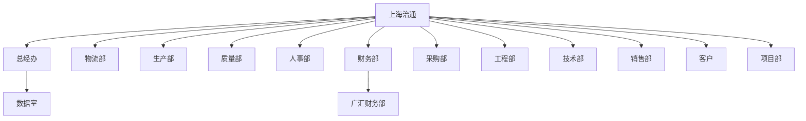

# 上海治通组织架构

> 数据来源：企业微信通讯录 API | 更新时间：2026-06-08

## 组织架构总览

## 部门列表

| 部门ID | 部门名称 | 上级部门 | 部门负责人 |
|--------|----------|----------|-----------|
| 1 | **上海治通** | — | 郑希钦 (PuJiang) |
| 2 | **总经办** | 上海治通 | — |
| 3 | **数据室** | 总经办 | — |
| 4 | **物流部** | 上海治通 | — |
| 5 | **生产部** | 上海治通 | — |
| 6 | **质量部** | 上海治通 | 温天祯 (wentianzhen) |
| 7 | **人事部** | 上海治通 | 蔡汉东 (caihandong) |
| 8 | **财务部** | 上海治通 | — |
| 9 | **采购部** | 上海治通 | — |
| 10 | **工程部** | 上海治通 | 徐红雷 (ZhenXiXianZai) |
| 11 | **技术部** | 上海治通 | 杨云祥 (yxyangshai) |
| 12 | **销售部** | 上海治通 | — |
| 13 | **客户** | 上海治通 | — |
| 14 | **其他（待设置部门）** | 上海治通 | — |
| 15 | **项目部** | 上海治通 | — |
| 16 | **广汇财务部** | 财务部 | — |

---

## 人员明细

### 🏢 上海治通（集团）

| 姓名 | UserID | 职位 | 部门负责人 |
|------|--------|------|-----------|
| **郑希钦** | PuJiang | **总经理** | ✅ |
| 谭昌发 | TanChangFa | — | ❌ |
| 郑敏 | zhengmin | — | ❌ |

---

### 📋 总经办

| 姓名 | UserID | 职位 | 电话 |
|------|--------|------|------|
| 治通微信 | ZhiTongWeiXin | — | 18917734927 |
| **高荣幸** | XiaoZai | 秘书（泰峰） | 18796752216 |
| **韩莹星** | hanyingxing | 总经办主任（治通） | — |
| **邢建峰** | xingjianfeng | 门卫（治通） | — |
| **沈俊** | shenjun | 基建规划专家（治通） | — |
| **邱桂昊** | qiuguihao | 数据分析员（治通） | — |
| **黄华** | huanghua | 门卫（治通） | — |

### 💻 数据室
> 当前无成员

---

### 🚚 物流部

| 姓名 | UserID | 职位 |
|------|--------|------|
| **李丹洋** | LiDanYang | 班长（广汇） |
| **朱钱海** | ZhuQianHai | 生产物流主管（泰峰） |
| **杨小青** | yangxiaoqing | 仓库文员（治通） |
| **陈建** | chenjian | 物流班长（治通） |
| **蔡宗言** | caizongyan | 物流主管（治通） |
| **丰魏** | fengwei | 文员（治通） |

---

### ⚙️ 生产部（17人）

| 姓名 | UserID | 职位 | 备注 |
|------|--------|------|------|
| **牛周义** | NiuZhouYi | 生产主管（广汇） | |
| **潘利飞** | PanLiFei | 生产主管（治通） | |
| **吴春鹏** | WuChunPeng | 生产主管（泰峰） | |
| **王付毫** | WangFuHao | 生产班长（广汇） | |
| **赵飞** | zhaofei | 生产班长（治通） | |
| **张迪** | zhangdi | 生产班长（治通） | |
| **祝新斌** | zhuxinbin | 生产班长（广汇） | |
| **李雪峰** | lixuefeng | 生产副经理（广汇） | |
| **潘杏梅** | PanXingMei | 化验员 | |
| **刘奇** | LiuQi | — | |
| **从安高** | CongAnGao | — | |
| **于海军** | yuhaijun | 普工（娄塘） | |
| **胡国宏** | huguohong | 普工（娄塘） | |
| ~~许谋~~ | xumou | 普工（娄塘） | ⚠️ 已离职 (status=4) |
| **孙明** | sunming | PMC专员（治通） | |
| **袁延志** | yuanyanzhi | 技术员（治通） | |
| **姚志芳** | YaoZhiFang | — | |

> 生产部管理层体系：生产副经理→生产主管→生产班长→普工

---

### 🏅 质量部（31人）

| 姓名 | UserID | 职位 |
|------|--------|------|
| **林帅** | LinShuai | 班长（治通） |
| **夏玉强** | XiaYuQiang | 班长（广汇） |
| **赵建星** | ZhaoJianXing | 班长（泰峰） |
| **梁婉** | LiangWan | — |
| **文平** | wenping | 巡检员（治通） |
| **位瑞华** | weiruihua | 巡检（广汇） |
| **李洁珍** | lijiezhen | 巡检（广汇） |
| **李创业** | lichuangye | 巡检（广汇） |
| **李加祥** | lijiaxiang | 巡检副班长（广汇） |
| **赵惠** | zhaohui | 巡检（广汇） |
| **温天祯** | wentianzhen | **质量主管（治通）** ⭐部门负责人 |
| **郑贤岗** | zhengxiangang | 巡检员（治通） |
| **李顺东** | lishundong | 外检副班长（治通） |
| **路钦然** | luqinran | 巡检员（治通） |
| **梅小强** | meixiaoqiang | 检验员（治通） |
| ~~黄明飞~~ | huangmingfei | 检验员（治通） ⚠️ 已离职 (status=4) |
| **付兴晨** | fuxingchen | 巡检员（治通） |
| **张双喜** | zhangshuangxi | 检验员（副班长） |
| **徐扬** | XuYang | 质量工程师 |
| **黄兵** | huangbing | 巡检（治通） |
| **王环川** | wanghuanchuan | 外检（治通） |
| **朱玉红** | zhuyuhong | 巡检（广汇） |
| **李世佳** | lishijia | 巡检（治通） |
| **刘珉** | liumin | 巡检（治通） |
| **韩金叁** | hanjinsan | 巡检（治通） |
| **陈永灯** | chenyongdeng | 检验员 |
| **路振** | luzhen | 检验员（治通） |
| **孟永超** | mengyongchao | 检验员（治通） |
| **王涛** | wangtao | 巡检员（治通） |
| **余新葵** | yuxinkui | 巡检（治通） |
| **张乐** | zhangle | 巡检（治通） |

> 质量部是人数最多的部门。三大基地（治通/广汇/泰峰）各有班长带队，温天祯为质量部负责人。

---

### 👥 人事部（8人）

| 姓名 | UserID | 职位 |
|------|--------|------|
| **赵配配** | ZhaoPeiPei | 人事主管（治通） |
| **邓嘉君** | 9eea3d575a9f58b086624fd7b18746f3 | 人事行政主管（泰峰） |
| **曾华** | ZengHua | 人事行政经理（广汇） |
| **蔡汉东** | caihandong | **人事经理（集团）** ⭐部门负责人 |
| **广汇（会议专用）** | guanghui | —（会议账号） |
| **胡旭宾** | huxubin | 人事行政专员（广汇） |
| **陶新芋** | taoxinyu | 人事专员（治通） |
| **宋家伟** | songjiawei | 人事专员（治通） |

---

### 💰 财务部（3人）

| 姓名 | UserID | 职位 |
|------|--------|------|
| **潘雄萍** | PanXiongPing | 返聘（治通） |
| **王雅珏** | WangYaJue | 出纳（治通） |
| **丁秀玲** | dingxiuling | 会计（治通） |

#### 🔹 广汇财务部（1人）

| 姓名 | UserID | 职位 |
|------|--------|------|
| **唐玉** | TangYu | 会计（广汇） |

---

### 📦 采购部（2人）

| 姓名 | UserID | 职位 | 电话 |
|------|--------|------|------|
| **郭新杰** | XiandLei | 采购（治通） | 17712612475 |
| **赵菡** | ZhaoHan | 采购主管（治通） | — |

---

### 🔧 工程部（20人）

| 姓名 | UserID | 职位 |
|------|--------|------|
| **徐红雷** | ZhenXiXianZai | **工程经理** ⭐部门负责人 |
| **张治民** | ZhangZhiMin | 机修班长（治通） |
| **任广建** | RenGuangJian | 技修（泰峰） |
| **王法辉** | WangFaHui | 机修（治通） |
| **顾旭** | GuXu | 机修（治通） |
| **杨帅通** | YangShuaiTong | 机修（泰峰） |
| **崔道均** | CuiDaoJun | 机修（治通） |
| **张仲华** | ZhangZhongHua | 调试班长（治通） |
| **谢红桥** | xiehongqiao | 调试员（治通） |
| **严振东** | YanZhenDong | 机修（广汇） |
| **周青龙** | WuYan | 机修（治通） |
| **任万传** | R | 电气工程师（泰峰） |
| **王可** | wangke | 机修学徒（治通） |
| **吴进虎** | wujinhu | 机修（治通） |
| **袁建富** | YuanJianFu | 机修（泰峰） |
| **唐庚** | tanggeng | 机修学徒（治通） |
| **李帅兵** | lishuaibing | 机修（广汇） |
| **丁成昊** | dingchenghao | 机修工（广汇） |
| **赵松** | zhaosong | 机修学徒（治通） |
| **张方印** | zhangfangyin1 | 调试员（治通） |

> 工程部下设机修/调试两大方向，分布在治通/广汇/泰峰三基地

---

### 📐 技术部（6人）

| 姓名 | UserID | 职位 |
|------|--------|------|
| **杨云祥** | yxyangshai | **技术经理（治通）** ⭐部门负责人 |
| **龚登琼** | GongDengQiong | 技术（泰峰） |
| **邹杰** | ZouJie | 技术（泰峰） |
| **邢晓桐** | XingXiaoTong | 工程师（泰峰） |
| **袁明** | yuanming | 技术专家 |
| **舒瑞** | ShuRui | 模具工程师 |

---

### 🎯 项目部（2人）

| 姓名 | UserID | 职位 | 电话 |
|------|--------|------|------|
| **石垒** | shilei | 项目&销售经理（治通） | 13248667058 |
| **吴胜** | wusheng | 项目工程师（治通） | — |

---

### 🤝 客户（智机科技团队 — 自动化系统集成）

> 该部门对应 Simon 的自动化系统集成公司团队

| 姓名 | UserID | 职位 |
|------|--------|------|
| **谢宇航** | XieYuHang | — |
| **李强** | LiQiang | — |
| **王亚丽** | WangYaLi | — |
| **苏杨** | suyang | Python工程师 |
| **李红梅** | lihongmei | 视觉工程师 |
| **付磊建** | fuleijian | 机械工程师 |
| **赵伟伟** | zhaoweiwei | 电气工程师 |
| **郑翔翥** | zhengxiangzhu | — |
| **李安康** | liankang | 装配电工 |
| **汪新意** | wangxinyi | 数据分析助理工程师 |
| **吕兵** | lvbing | 电气助理工程师 |
| **戴嘉龙** | daijialong | 视觉助理工程师 |
| **朱佳浩** | zhujiahao | 机械助理工程师 |
| **李小龙** | lixiaolong | 装配钳工 |
| **张青华** | zhangqinghua | 人事专员（智机） |

---

## 数据摘要

| 统计项 | 数值 |
|--------|------|
| 总部门数 | 16（含子部门） |
| 在职成员数 | **119人** |
| 已离职（待清理） | 许谋、黄明飞 |
| 最大部门 | 质量部（31人） |
| 最小部门 | 采购部（2人）、项目部（2人） |

### 各基地分布
- **治通** — 总部基地，含生产/质量/工程/技术/人事/财务/采购/物流/项目
- **广汇** — 分基地，含生产/质量/工程/人事/财务
- **泰峰** — 分基地，含生产/质量/工程/技术/人事/物流
- **娄塘** — 普工驻点（于海军、胡国宏）
- **智机科技** — 自动化系统集成公司团队（客户部门）

---

## 变更记录

| 日期 | 变更内容 |
|------|----------|
| 2026-06-08 | 首次建立，从企业微信通讯录API完整采集 |

> ⚡ 建议：将此通讯录与日报/周报/绩效数据关联，用于员工行为分析与管理层决策支持
