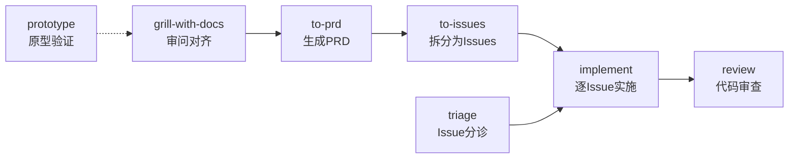

# Matt Pocock AI Agent Skills

> 来源: [github.com/mattpocock/skills](https://github.com/mattpocock/skills)
> 安装日期: 2026-06-19
> 总计: 34 个 skill, 58 个文件
> 已部署: Claude Code / Codex / Hermes

---

## 核心理念

"Skills for Real Engineers — not vibe coding."

这些 skill 基于数十年工程经验，小而可组合，适用任何模型。解决四大常见失败模式：

1. **Agent 没做你想要的东西** → `grill-me` / `grill-with-docs` 审问对齐
2. **Agent 过于啰嗦** → `domain-modeling` 建立共享语言
3. **代码不工作** → `tdd` 红绿重构 + `diagnosing-bugs` 结构化调试
4. **代码变成泥球** → `improve-codebase-architecture` 深度模块设计

---

## 主工作流

---

## 技能索引

### 🔧 工程流程（主路径）

| 技能 | 类型 | 说明 |
|------|------|------|
| [[ask-matt/SKILL]] | 用户调用 | 路由器：根据场景推荐用哪个 skill |
| [[grill-with-docs/SKILL]] | 用户调用 | 审问 + 建立领域模型 + CONTEXT.md |
| [[to-prd/SKILL]] | 用户调用 | 对话 → PRD（自动综合，无需面试） |
| [[to-issues/SKILL]] | 用户调用 | PRD → 独立可抓取的垂直切片 Issues |
| [[implement/SKILL]] | 用户调用 | 基于 PRD/Issues 实施 + TDD + review |
| [[triage/SKILL]] | 用户调用 | Issue 状态机分诊 |

### 🏗️ 工程质量

| 技能 | 类型 | 说明 |
|------|------|------|
| [[tdd/SKILL]] | 模型可调用 | 红-绿-重构循环 |
| [[diagnosing-bugs/SKILL]] | 模型可调用 | 6 阶段结构化调试 |
| [[codebase-design/SKILL]] | 模型可调用 | 深度模块设计词汇与原则 |
| [[domain-modeling/SKILL]] | 模型可调用 | 领域术语表 + ADR |
| [[improve-codebase-architecture/SKILL]] | 用户调用 | 扫描代码库 → HTML 报告 → 重构 |
| [[design-an-interface/SKILL]] | 模型可调用 | 设计模块接口 |
| [[ubiquitous-language/SKILL]] | 模型可调用 | 统一语言 |
| [[review/SKILL]] | 模型可调用 | 代码审查 |
| [[decision-mapping/SKILL]] | 模型可调用 | 决策映射 |
| [[resolving-merge-conflicts/SKILL]] | 模型可调用 | 解决合并冲突 |
| [[request-refactor-plan/SKILL]] | 模型可调用 | 请求重构计划 |

### ⚡ 生产力工具

| 技能 | 类型 | 说明 |
|------|------|------|
| [[grill-me/SKILL]] | 用户调用 | 启动审问会话 |
| [[grilling/SKILL]] | 模型可调用 | 可复用的审问循环 |
| [[prototype/SKILL]] | 用户调用 | 抛弃式原型验证 |
| [[handoff/SKILL]] | 用户调用 | 对话压缩为交接文档 |
| [[teach/SKILL]] | 用户调用 | 多 session 教学 |

### 🔒 配置与守护

| 技能 | 类型 | 说明 |
|------|------|------|
| [[setup-matt-pocock-skills/SKILL]] | 用户调用 | 首次配置（Issue 追踪器、标签等） |
| [[git-guardrails-claude-code/SKILL]] | 模型可调用 | Git 危险命令拦截 |
| [[setup-pre-commit/SKILL]] | 模型可调用 | Pre-commit hooks |

### ✍️ 写作工具

| 技能 | 类型 | 说明 |
|------|------|------|
| [[writing-great-skills/SKILL]] | 用户调用 | Skill 写作指南 |
| [[writing-beats/SKILL]] | 模型可调用 | 写作节奏 |
| [[writing-fragments/SKILL]] | 模型可调用 | 写作片段 |
| [[writing-shape/SKILL]] | 模型可调用 | 写作结构 |
| [[edit-article/SKILL]] | 模型可调用 | 文章编辑 |

### 📦 杂项

| 技能 | 类型 | 说明 |
|------|------|------|
| [[qa/SKILL]] | 模型可调用 | QA 测试 |
| [[scaffold-exercises/SKILL]] | 模型可调用 | 脚手架练习题 |
| [[migrate-to-shoehorn/SKILL]] | 模型可调用 | 迁移到 shoehorn |
| [[obsidian-vault/SKILL]] | 模型可调用 | Obsidian 仓库操作 |

---

## 部署状态

| 平台 | 路径 | 技能数 |
|------|------|--------|
| Claude Code | `~/.claude/skills/` | 34 (symlink) |
| Codex | `~/.codex/skills/` + `~/.agents/skills/` | 34 (通用格式) |
| Hermes | `skills/software-development/` | 34 (symlink + 5 原生) |

## 相关链接

- [GitHub 仓库](https://github.com/mattpocock/skills)
- [Skills.sh 页面](https://skills.sh/mattpocock/skills)
- [Matt Pocock 的 Newsletter](https://www.aihero.dev/s/skills-newsletter)
