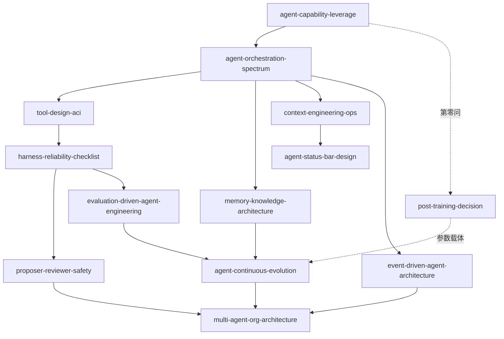

# 《深入理解AI Agent》蒸馏 Skills 索引

> 13 个 skills，源自李博杰《深入理解AI Agent：设计原理与工程实践》（2026）。
> 面向智机公司自建企业级 Agent 体系、组织由数字化向数智化进化的应用场景。
> 生成：cangjie 流水线（RIA-TV++），2026-07-31。验证：V1 跨域 / V2 预测力 / V3 独特性 全过。

## 使用路线（按落地顺序）

```
第一步 判断能不能做
  agent-capability-leverage        大脑/眼睛/手脚，短板在哪
        ↓
第二步 决定先做什么、什么形态
  agent-orchestration-spectrum     提示词→工作流→自主Agent→多Agent
        ↓
第三步 把系统建对
  tool-design-aci                  把 MES/ERP/机床变成 Agent 的手脚
  memory-knowledge-architecture    企业知识库的存取治
  context-engineering-ops          提示词与上下文运营
  agent-status-bar-design          状态感知
  event-driven-agent-architecture  从被动应答到主动行动
        ↓
第四步 上线前把住安全
  harness-reliability-checklist    五要素静态审查
  proposer-reviewer-safety         高风险动作运行时双签
        ↓
第五步 运营期越做越好
  evaluation-driven-agent-engineering  验收与度量
  agent-continuous-evolution           从经验中进化
  multi-agent-org-architecture         规模化后的组织蓝图
        ↓
第六步（谨慎）要不要自己训模型
  post-training-decision           第零问先拦下 90% 的训练冲动
```

## Skills 清单

| # | Skill | 一句话 | 优先级 |
|---|---|---|---|
| 1 | agent-capability-leverage | 能力短板诊断：先补眼睛，再补手脚，最后换大脑 | ★★ |
| 2 | agent-orchestration-spectrum | 落地顺序与形态决策：能用简单形态绝不用复杂形态 | ★★★ |
| 3 | harness-reliability-checklist | 上线前五要素审查：上下文/工具/约束/验证/纠正 | ★★★ |
| 4 | proposer-reviewer-safety | 高风险操作双签：审查有效性=新信息引入 | ★★★ |
| 5 | tool-design-aci | ACI 工具设计：边界比能力重要，选错先查描述 | ★★★ |
| 6 | event-driven-agent-architecture | 事件驱动：统一事件流+安全点+紧急度路由 | ★★★ |
| 7 | evaluation-driven-agent-engineering | 评估驱动：Rubric+显著性判断，没评估就没进步 | ★★★ |
| 8 | agent-continuous-evolution | 持续进化：四载体+双循环+可信根不可自改 | ★★★ |
| 9 | multi-agent-org-architecture | 多 Agent 组织：新信息判据+规划者瓶颈 | ★★★ |
| 10 | context-engineering-ops | 上下文运营：缓存纪律+流程化+防腐化 | ★★ |
| 11 | agent-status-bar-design | 状态栏：代码维护+键值对+读数配手册 | ★★ |
| 12 | memory-knowledge-architecture | 知识库：双层记忆+统计预提炼+权限下推 | ★★ |
| 13 | post-training-decision | 训练决策：第零问+先形后神+数据重于算法 | ★ |

## 关系图



## 组合用法（典型场景）

| 场景 | 组合 |
|---|---|
| 新业务场景立项 | capability-leverage → orchestration-spectrum → tool-design-aci |
| Agent 上线评审 | harness-checklist + proposer-reviewer + evaluation-driven |
| 设备告警联动 | event-driven + multi-agent（分诊拓扑）+ proposer-reviewer（高风险动作） |
| 企业知识库建设 | memory-knowledge + context-ops + status-bar |
| 月度运营复盘 | evaluation-driven → continuous-evolution → （必要时）post-training |
| 集团级多 Agent 规划 | multi-agent-org + orchestration-spectrum + harness-checklist |

## 批判性提醒（全书 4 条批判，注入各 skill 边界段）

1. 作者立场偏"自建派"技术团队视角——先盘点现有平台（Hermes 等）自带能力，只补缺口
2. 核心公式里没有"人"——组织变革、员工接受度、责任制度需自行配套
3. 评估驱动假设企业有数据基础——智机需先补数据采集（报工/质检/设备数据）
4. 小世界假设若成立，大量 Harness 工程会贬值——Harness 用来争取时间，用这段时间构筑技术之外的壁垒（独占数据/渠道/信任）
