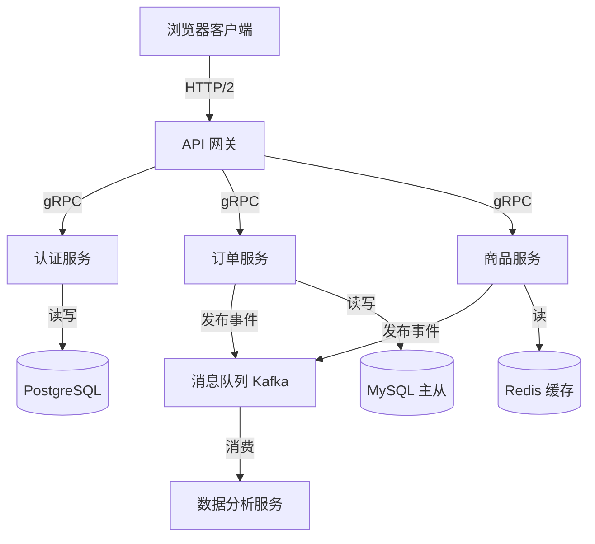
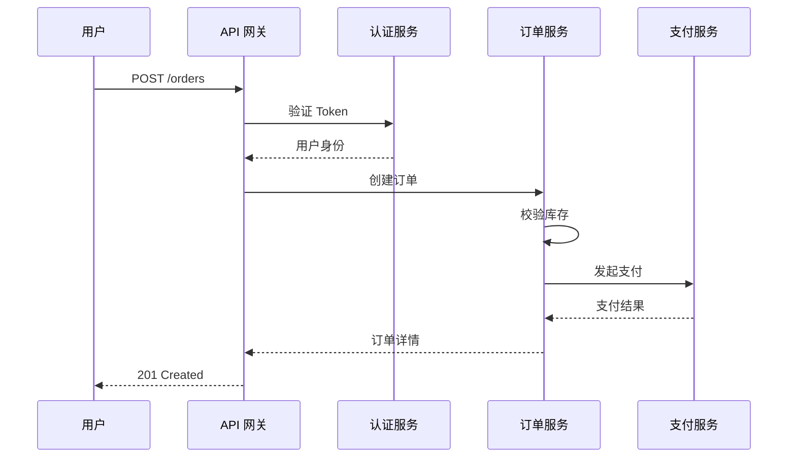
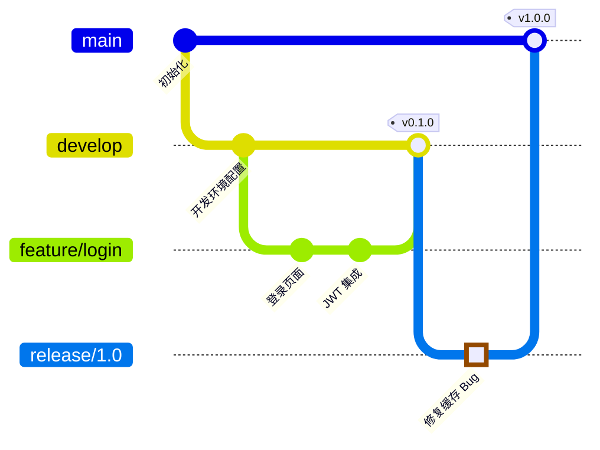
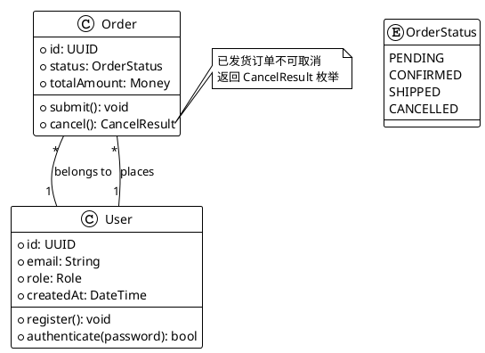
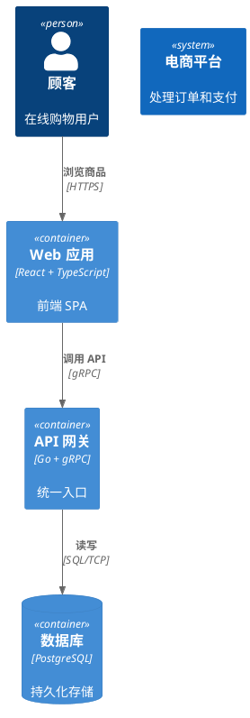

# 第18组: 文档与知识管理

> 从个人笔记到团队知识库，从 API 文档到架构图表——现代知识工作的全链路工具链。

---

### 171. Obsidian

**前世今生**

Obsidian 由 Shida Li（李时达）和 Erica Xu 于 2020 年创立，两位创始人曾在加拿大滑铁卢大学攻读计算机科学。Obsidian 的核心理念是"你的数据永远属于你自己"——所有笔记以纯 Markdown 文件存储在本地磁盘，不依赖任何私有格式或云端锁定。这一设计哲学直接回应了 Notion、Evernote 等云笔记工具的数据可移植性问题。Obsidian 引入了双向链接（bi-directional linking）和图谱视图（graph view）两大杀手级功能，让用户像 Roam Research 一样构建网状知识结构。凭借开放的插件生态（社区插件超过 1500 个），Obsidian 从单纯的笔记工具演变为可编程的知识管理操作系统，被学术界、软件工程师和写作者广泛采用。截至 2025 年，Obsidian 拥有超过 100 万活跃用户，是目前最受欢迎的本地优先知识管理工具。

**使用方法与案例**

**安装方式:**
- macOS: `brew install --cask obsidian` 或从 https://obsidian.md 下载 dmg
- Linux: 下载 AppImage 或使用 `flatpak install flathub md.obsidian.Obsidian`
- Windows: `winget install Obsidian.Obsidian` 或 `scoop install obsidian`，也可从官网下载 exe

**基础用法:**
```markdown
# 创建双向链接
在笔记中使用 [[另一篇笔记]] 即可创建链接。

# 嵌入其他笔记内容
![[被嵌入的笔记]]

# 使用标签
#project/active  #area/health
```

**实战案例一: 技术笔记体系搭建**

构建一个按 MOC（Map of Content）组织技术笔记的体系：

```markdown
<!-- 00-Inbox/临时笔记.md -->
# 遇到的 Bug 记录
[[Python]] 中 `asyncio.gather` 的异常处理方式...
#bug #python

<!-- 02-Areas/Python/Python MOC.md -->
# Python 知识地图
## 核心概念
- [[Python 异步编程]]
- [[Python 类型系统]]
## 常见问题
- [[asyncio 异常处理]]
```

使用 Dataview 插件自动聚合笔记：
```dataview
TABLE file.ctime as "创建时间"
FROM #python
SORT file.ctime DESC
```

**实战案例二: 日记+PARA 工作流**

配置日记模板（Template 插件），每天自动生成日记：

```markdown
<!-- 模板: daily-note -->
# {{date:YYYY-MM-DD}}
## 今日目标
- [ ] 
## 工作日志
## 学习笔记
## 复盘
```

配合 Periodic Notes 插件实现周/月/季度回顾。

**进阶技巧:**
- **Templater 插件**: 使用 JavaScript 脚本生成动态模板，如自动从 API 拉取天气信息
- **Git 版本控制**: 使用 Obsidian Git 插件自动提交到 GitHub，实现多设备同步和版本历史
- **Excalidraw 集成**: 在笔记中嵌入手绘风格图表，支持双链引用
- **Canvas**: Obsidian 内置的无限画布，可将笔记、图片、PDF 拖入可视化布局

---

### 172. Logseq

**前世今生**

Logseq 由华人开发者秦天（Tienson Qin）于 2020 年开源发布，灵感来源于 Roam Research 的大纲式笔记理念。与 Obsidian 的文档优先不同，Logseq 采用"块优先"（block-first）架构——笔记的最小单位不是页面，而是每个大纲节点（block）。块可以被单独引用、嵌入和重组，天然支持自底向上的知识构建。Logseq 同样采用本地 Markdown/Org-mode 文件存储，数据完全归属用户。2022 年获得 A 轮融资后，Logseq 团队加速了数据库版本的开发，引入 DB-Schema 架构以支持更大规模的查询性能。作为 AGPL 协议下的开源项目，Logseq 在隐私敏感的研究者和开发者中拥有忠实用户群，其社区插件生态虽不及 Obsidian 庞大，但涵盖白板（Whiteboard）、PDF 标注等独特功能。

**使用方法与案例**

**安装方式:**
- macOS: `brew install --cask logseq`
- Linux: `flatpak install flathub com.logseq.Logseq` 或下载 AppImage
- Windows: `winget install Logseq.Logseq` 或 `scoop install logseq`

**基础用法:**
```markdown
# 大纲式写作
- 父节点
  - 子节点（Tab 缩进）
    - 孙节点
# 块引用
- 引用某个块: ((block-id))
# 页面引用
- 链接到页面: [[页面名]]
```

**实战案例一: 会议纪要+行动项追踪**

```
<!-- journals/2026-07-05.md -->
- 10:00 周例会 #meeting
  - 讨论: Q3 技术方案评审
    - 结论: 采用微服务拆分方案
      - TODO 编写拆分方案 PRD [[项目拆分 PRD]]
        deadline:: 2026-07-12
        assignee:: [[张三]]
    - TODO 评估基础设施成本
      SCHEDULED: <2026-07-08 Mon>
```

使用 `/Draw` 创建白板，将会议讨论要点可视化排布。使用 Query 功能汇总所有 TODO：

```clojure
;; 高级查询 - 汇总所有未完成任务
{:title "待完成任务"
 :query [:find (pull ?b [*])
         :where
         [?b :block/marker ?marker]
         [(contains? #{"TODO" "DOING"} ?marker)]]
 :result-transform (fn [result] ... )}
```

**实战案例二: 读书笔记与知识提炼**

```markdown
- 《系统设计面试》
  - 第 3 章: 设计短链系统
    - 核心需求: 高写入 QPS、短链生成算法
    - 方案对比:
      - 哈希+Base62: [[短链哈希方案]]
      - 自增 ID: [[短链自增方案]]
    - 我的思考: 基于 Snowflake 的变体更适合分布式 [[分布式 ID 生成]]
```

使用 Logseq 的 PDF 标注功能直接在 PDF 上高亮，标注内容自动同步到笔记中。

**进阶技巧:**
- **Zotero 集成**: 通过 logseq-zotero 插件管理论文引用
- **Flashcards**: 使用 `#card` 标签将笔记块自动转为间隔重复卡片
- **命名空间**: 使用 `namespace/subpage` 格式组织层级知识，如 `math/linear-algebra/eigenvalues`

---

### 173. Notion

**前世今生**

Notion 由 Ivan Zhao（赵伊凡）和 Simon Last 于 2013 年在旧金山创立，2016 年发布 1.0 正式版。其核心理念是将文档、数据库、看板、日历、Wiki 融合为统一的"乐高式"工作空间——用户通过 Block 的自由组合，像搭积木一样构建任意信息结构。Notion 的革命性创新在于将关系型数据库的能力以可视化、非技术用户可理解的方式呈现，让项目管理、CRM、知识库等场景无需编码即可实现。经历 2018 年融资困难险些倒闭后，Notion 通过社区驱动的模板生态和口碑传播实现爆发式增长。2020 年估值突破 20 亿美元，2021 年达到 100 亿美元。Notion 于 2023 年推出 AI 功能，2025 年发布 Notion Mail 和 Notion Calendar，从协作工具向全方位生产力平台演化。但其云端优先的架构也让部分用户对数据主权存有顾虑。

**使用方法与案例**

**安装方式:**
- macOS: `brew install --cask notion` 或从 notion.so 下载
- Linux: 使用官方 Snap 包或 Web 版
- Windows: `winget install Notion.Notion` 或 `scoop install notion`

**实战案例一: 工程团队 Wiki 搭建**

构建包含以下模块的团队知识库：

```
📁 团队 Wiki
├── 📄 新人入职指南（含 30/60/90 天计划表）
├── 📁 技术文档
│   ├── 📄 架构决策记录 (ADR)
│   ├── 📄 API 设计规范
│   └── 📄 部署流程图
├── 📁 Sprint 管理
│   ├── 📊 任务看板 (Board View)
│   ├── 📅 Sprint 日历 (Calendar View)
│   └── 📈 迭代回顾模板
└── 📁 值班手册
    └── 📄 On-Call 故障响应流程
```

数据库关联示例——将 ADR 与 Sprint 关联：

| 属性 | 类型 | 说明 |
|------|------|------|
| 标题 | Title | ADR-001: 选择 gRPC 作为服务间通信协议 |
| 状态 | Select | 已采纳 / 已拒绝 / 待定 |
| 关联 Sprint | Relation | → Sprint 数据库 |
| 决策日期 | Date | 2026-06-15 |

**实战案例二: 个人 OKR + 周报系统**

```markdown
# Q3 目标 O1: 提升系统可观测性
## KR1: 将 P99 延迟降低 30%
- 项目: [分布式追踪系统搭建]
  - 数据库关联: {Sprint Tasks}
  - Timeline 视图: 显示甘特图进度
```

使用 Notion 的公式字段自动计算进度百分比，使用 `if(prop("Done"), ...)` 生成完成度指示。

**进阶技巧:**
- **Notion API**: 通过 REST API 实现自动化，如 GitHub Action 自动创建发布记录
  ```python
  import requests
  headers = {"Authorization": "Bearer secret_xxx",
             "Notion-Version": "2022-06-28"}
  requests.post("https://api.notion.com/v1/pages", ...)
  ```
- **Synced Block**: 在多页面间同步内容块，一处修改处处更新
- **Button 属性**: 一键触发自动化操作（2024 年新增）

---

### 174. Docusaurus

**前世今生**

Docusaurus 由 Meta（Facebook）于 2017 年开源，最初为解决 Facebook 内部开源项目文档维护成本高的问题——工程师们需要维护 Jekyll 站点，配置繁琐且难以统一。Docusaurus 以 React 为基础，使用 Markdown 编写内容，构建时生成纯静态 HTML，兼具开发体验和加载性能。2019 年发布 v2 版本，底层重构为单页应用架构，支持 MDX（Markdown + JSX）、版本化文档、国际化（i18n）和 Algolia 搜索集成。Docusaurus 的哲学是"写文档应该是愉快的"——它内置了博客、文档、独立页面三种模板，零配置即可启动。由于 Meta 自身的品牌背书和活跃的社区，Docusaurus 迅速成为 React 生态文档站的首选方案，替代了 GitBook、VuePress 等老牌工具。截至 2025 年，超过 7000 个项目使用 Docusaurus 构建文档站，包括 Jest、React Native、Supabase 等知名项目。

**使用方法与案例**

**安装方式:**
```bash
# 跨平台通用，需 Node.js >= 18
npx create-docusaurus@latest my-docs classic
cd my-docs
npm start  # 启动开发服务器
```

**实战案例一: 技术中台文档站**

项目结构：
```
my-docs/
├── docs/
│   ├── intro.md
│   ├── guides/
│   │   ├── getting-started.md
│   │   └── deployment.md
│   └── api/
│       └── reference.md
├── blog/
│   └── 2026-07-01-release-v2.md
├── docusaurus.config.js
└── sidebars.js
```

配置多版本文档（sidebar.js）：
```javascript
module.exports = {
  docs: [
    { type: 'doc', id: 'intro', label: '介绍' },
    {
      type: 'category',
      label: '开发指南',
      items: ['guides/getting-started', 'guides/deployment'],
    },
    {
      type: 'category',
      label: 'API 参考',
      items: [
        { type: 'autogenerated', dirName: 'api' },
      ],
    },
  ],
};
```

**实战案例二: 使用 MDX 嵌入交互组件**

```mdx
import { Chart } from '@site/src/components/Chart';

# 性能基准测试

<Chart
  data={{
    labels: ['QPS', 'P99延迟(ms)', '内存(MB)'],
    datasets: [{ label: 'v1.0', data: [1200, 45, 256] },
               { label: 'v2.0', data: [3200, 12, 198] }]
  }}
/>

升级到 v2.0 后，QPS 提升 **167%**。
```

**进阶技巧:**
- **版本化**: 使用 `npm run docusaurus docs:version v2.0.0` 冻结文档快照
- **国际化**: 配置 `i18n` 字段实现中英文双语文档站
- **Algolia DocSearch**: 申请免费搜索集成，为文档站添加全文搜索
- **CI/CD 部署**: GitHub Actions 自动构建并部署到 GitHub Pages 或 Vercel

```yaml
# .github/workflows/deploy.yml
- name: Build
  run: npm ci && npm run build
- name: Deploy to GitHub Pages
  uses: peaceiris/actions-gh-pages@v3
  with:
    github_token: ${{ secrets.GITHUB_TOKEN }}
    publish_dir: ./build
```

---

### 175. Mermaid

**前世今生**

Mermaid 由瑞典开发者 Knut Sveidqvist 于 2014 年创建，核心理念是"像写 Markdown 一样画图"——用纯文本语法描述图表，由 JavaScript 引擎渲染为 SVG。Sveidqvist 在一次项目汇报中因为反复修改 Visio 图表而沮丧，决定构建一个文本驱动的图表替代方案。最初 Mermaid 只是一个简单的流程图工具，经过十年发展，已支持流程图、时序图、甘特图、类图、状态图、饼图、Git 图、思维导图等十余种图表类型。2019 年 GitHub 宣布在 Markdown 中原生支持 Mermaid 渲染，这成为 Mermaid 历史上最重要的转折点——开发者无需任何额外工具即可在 README、Issue、PR 中嵌入可渲染的图表。此后 GitLab、Notion、Obsidian 等平台相继集成，Mermaid 已成为"基础设施级"的图表标准，月下载量超过 400 万次。

**使用方法与案例**

**安装方式:**
```bash
# npm 全局安装 CLI
npm install -g @mermaid-js/mermaid-cli

# macOS 也可用 brew
brew install mermaid-cli
```

**实战案例一: 系统架构流程图**

````markdown

````

**实战案例二: 时序图——微服务调用链**

````markdown

````

**实战案例三: Git 分支策略可视化**

````markdown

````

**进阶技巧:**
- **主题定制**: 使用 `%%{init: {'theme': 'dark'}}%%` 切换暗色主题
- **CSS 注入**: 通过 `%%{init: {'themeCSS': '...'}}%%` 自定义样式
- **VS Code 插件**: 安装 `Markdown Preview Mermaid Support` 实现实时预览
- **程序化生成**: 用 Python/Node.js 动态生成 Mermaid 图表，集成到 CI 流水线

---

### 176. PlantUML

**前世今生**

PlantUML 由法国开发者 Arnaud Roques 于 2009 年创建，比 Mermaid 早了五年。其核心理念是用纯文本定义 UML 图——开发者编写 `.puml` 文件，通过 PlantUML 引擎（Java 编写）渲染为 PNG/SVG。PlantUML 最初聚焦于标准 UML 图（类图、用例图、活动图、组件图、部署图等），后来扩展支持思维导图、甘特图、架构图等非 UML 类型。与 Mermaid 的轻量定位不同，PlantUML 是"重量级选手"——渲染引擎功能极其强大，支持精确的布局控制、皮肤系统、样式主题，生成的图表质量接近专业绘图工具。在企业级软件架构文档中，PlantUML 几乎是事实标准，尤其在 Java 和 C++ 生态中广泛用于自动生成设计文档。PlantUML 的缺点是依赖 Java 运行时（JRE）和 Graphviz，部署成本高于纯 JavaScript 方案。

**使用方法与案例**

**安装方式:**
```bash
# macOS
brew install plantuml graphviz

# Linux (Ubuntu/Debian)
sudo apt install plantuml graphviz

# Windows
scoop install plantuml
# 或下载 plantuml.jar + 安装 Java JRE + Graphviz
```

**实战案例一: 领域模型类图**



**实战案例二: C4 架构图**



**进阶技巧:**
- **CI 集成**: 在 GitHub Actions 中自动渲染 `.puml` 文件为 PNG 图片
  ```yaml
  - name: Render PlantUML
    run: java -jar plantuml.jar -tsvg docs/**/*.puml
  ```
- **VS Code 插件**: PlantUML 插件支持实时预览、导出、语法高亮
- **主题库**: `!theme` 指令支持 20+ 内置主题，也支持自定义样式文件
- **Sprinte 嵌入**: 使用 `!includeurl` 引用远程 `.puml` 文件实现架构图复用

---

### 177. OpenAPI

**前世今生**

OpenAPI 规范的前身是 Tony Tam 于 2010 年创建的 Swagger 规范——一种用 JSON 描述 REST API 的标准格式。2015 年，SmartBear 公司将 Swagger 规范捐赠给 Linux 基金会，并更名为 OpenAPI Initiative（OAI），由 Google、IBM、Microsoft 等共同治理。OpenAPI 3.0（2017 年发布）是一次重大重构，大幅增强了组件复用、安全方案、链接关系等特性；3.1 版本（2021 年）则实现了与 JSON Schema 2020-12 的完全兼容。OpenAPI 规范的价值在于"API 契约优先"——用机器可读的格式定义 API 的端点、参数、请求体、响应格式，实现了自动化文档生成、客户端 SDK 生成、Mock 服务器搭建、契约测试等全流程自动化。目前 OpenAPI 是 REST API 描述的事实标准，被 AWS、Google Cloud、Azure 等主要云厂商的 API 网关原生支持。

**使用方法与案例**

**安装方式（工具链）:**
```bash
# OpenAPI CLI 工具（Redocly）
npm install -g @redocly/cli

# 代码生成器
npm install -g @openapitools/openapi-generator-cli
```

**实战案例一: 设计用户 API**

```yaml
openapi: "3.1.0"
info:
  title: 用户管理 API
  version: "1.0.0"
  description: 提供用户注册、登录、信息管理功能

paths:
  /users:
    post:
      summary: 创建用户
      operationId: createUser
      requestBody:
        required: true
        content:
          application/json:
            schema:
              $ref: '#/components/schemas/CreateUserRequest'
      responses:
        '201':
          description: 用户创建成功
          content:
            application/json:
              schema:
                $ref: '#/components/schemas/User'

components:
  schemas:
    CreateUserRequest:
      type: object
      required: [email, password]
      properties:
        email:
          type: string
          format: email
          example: "user@example.com"
        password:
          type: string
          minLength: 8
          format: password
    User:
      type: object
      properties:
        id:
          type: string
          format: uuid
        email:
          type: string
        createdAt:
          type: string
          format: date-time
```

**实战案例二: 自动生成客户端 SDK**

```bash
# 生成 TypeScript Axios 客户端
openapi-generator-cli generate \
  -i api-spec.yaml \
  -g typescript-axios \
  -o ./generated/client

# 生成 Go 服务端 stub
openapi-generator-cli generate \
  -i api-spec.yaml \
  -g go-gin-server \
  -o ./generated/server
```

**进阶技巧:**
- **API 设计审查**: 使用 `redocly lint api.yaml` 检查规范和最佳实践
- **契约测试**: 结合 Dredd 或 Schemathesis 自动验证实现是否符合 OpenAPI 定义
- **Mock 服务器**: Prism CLI 根据 OpenAPI 规范自动生成 Mock API

```bash
npm install -g @stoplight/prism-cli
prism mock api-spec.yaml  # 启动 Mock 服务器
```

---

### 178. Swagger

**前世今生**

Swagger 由 Tony Tam 于 2010 年在 Wordnik（在线词典平台）创建，最初是为了解决内部 API 文档混乱的问题。Tam 设计了一种用 JSON 描述 REST API 的标准格式，并配套开发了可视化的 API 浏览器——Swagger UI，让开发者可以直接在浏览器中查看和测试 API。2015 年 Swagger 规范捐赠给 Linux 基金会并更名为 OpenAPI 规范，但 Swagger 品牌保留了完整的工具链生态：Swagger UI（交互式文档）、Swagger Editor（在线编辑）、Swagger Codegen（代码生成）、Swagger Inspector（API 测试）。Swagger 工具链是 API-first 开发的早期推动者，其交互式文档风格（"Try it out" 按钮）已成为行业标配。虽然 OpenAPI 已成为规范名称，但"Swagger"在日常交流中仍被广泛用作 OpenAPI 的同义词。Swagger 工具集被集成到 Postman、Insomnia、Apifox 等主流 API 平台中。

**使用方法与案例**

**安装方式:**
```bash
# Swagger Editor（本地运行）
docker pull swaggerapi/swagger-editor
docker run -p 8080:8080 swaggerapi/swagger-editor

# Swagger UI
docker pull swaggerapi/swagger-ui
docker run -p 8080:8080 -e SWAGGER_JSON=/api.yaml \
  -v $(pwd)/api.yaml:/api.yaml swaggerapi/swagger-ui

# 或在 Node.js 项目中集成
npm install swagger-ui-express
```

**实战案例一: 在 Express 应用集成 Swagger UI**

```javascript
const express = require('express');
const swaggerUi = require('swagger-ui-express');
const swaggerJsdoc = require('swagger-jsdoc');

const app = express();

const options = {
  definition: {
    openapi: '3.0.0',
    info: {
      title: '订单服务 API',
      version: '1.0.0',
      description: '电商平台订单管理微服务',
    },
    servers: [{ url: 'http://localhost:3000' }],
  },
  apis: ['./routes/*.js'], // 从 JSDoc 注释自动生成
};

const swaggerSpec = swaggerJsdoc(options);

// 挂载 Swagger UI 到 /api-docs
app.use('/api-docs', swaggerUi.serve, swaggerUi.setup(swaggerSpec));

app.listen(3000, () => {
  console.log('API Docs: http://localhost:3000/api-docs');
});
```

```javascript
// routes/orders.js - 用 JSDoc 注释定义 API
/**
 * @openapi
 * /orders:
 *   post:
 *     summary: 创建订单
 *     tags: [Orders]
 *     requestBody:
 *       required: true
 *       content:
 *         application/json:
 *           schema:
 *             type: object
 *             required: [productId, quantity]
 *             properties:
 *               productId: { type: string }
 *               quantity: { type: integer, minimum: 1 }
 *     responses:
 *       201:
 *         description: 订单创建成功
 */
app.post('/orders', (req, res) => { /* ... */ });
```

**实战案例二: 自动化 API 测试**

使用 Swagger Inspector 或 Newman 基于 Swagger/OpenAPI 定义运行集成测试：

```bash
# 使用 Dredd 做契约测试
npm install -g dredd
dredd api-spec.yaml http://localhost:3000 --hookfiles=./hooks.js
```

**进阶技巧:**
- **多环境切换**: Swagger UI 的 `servers` 下拉可实现开发/测试/生产环境切换
- **认证集成**: 配置 Bearer Token 或 OAuth2，直接在 Swagger UI 中完成授权后测试受保护端点
- **Swagger Hub**: SmartBear 的云端协作平台，支持团队协作设计 API、版本管理、Mock 服务

---

### 179. Storybook

**前世今生**

Storybook 由斯里兰卡裔开发者 Arunoda Susiripala（也是 Next.js 早期贡献者）于 2016 年创建，最初是为了解决 React 组件在隔离环境中开发和测试的需求。在传统开发流程中，前端组件深嵌于页面层级中，要看到某个按钮或表单组件的所有状态（loading、error、empty、disabled...）需要手动构造各种页面场景，效率极低。Storybook 提出"组件驱动开发"（CDD）理念——每个组件有独立的"故事"（Story），可在浏览器中单独预览、交互测试、快照测试。2017 年 Storybook 从 React 专属扩展为框架无关，支持 Vue、Angular、Svelte、Web Components 等。2021 年 Chromatic（Storybook 的商业化公司）推出视觉回归测试和 UI 审查工作流。截至 2025 年，Storybook 月下载量超过 2000 万次，被 GitHub、Airbnb、Shopify 等数万团队用于组件库开发，是前端组件文档的事实标准。

**使用方法与案例**

**安装方式:**
```bash
# 自动检测框架并初始化
npx storybook@latest init

# 运行
npm run storybook  # 启动开发服务器，默认 http://localhost:6006
npm run build-storybook  # 构建静态站点
```

**实战案例一: 设计系统组件库**

```tsx
// Button.stories.tsx
import type { Meta, StoryObj } from '@storybook/react';
import { Button } from './Button';

const meta: Meta<typeof Button> = {
  title: 'Design System/Button',
  component: Button,
  argTypes: {
    variant: { control: 'select', options: ['primary', 'secondary', 'danger'] },
    size: { control: 'radio', options: ['sm', 'md', 'lg'] },
    disabled: { control: 'boolean' },
  },
};

export default meta;
type Story = StoryObj<typeof Button>;

export const Primary: Story = {
  args: { variant: 'primary', children: '确认提交', size: 'md' },
};

export const Loading: Story = {
  args: { variant: 'primary', children: '提交中...', loading: true },
};

export const AllVariants: Story = {
  render: () => (
    <div style={{ display: 'flex', gap: 16 }}>
      <Button variant="primary">主要按钮</Button>
      <Button variant="secondary">次要按钮</Button>
      <Button variant="danger">危险操作</Button>
      <Button variant="primary" disabled>禁用状态</Button>
    </div>
  ),
};
```

**实战案例二: 页面级集成测试**

```tsx
// CheckoutPage.stories.tsx
import { within, userEvent, expect } from '@storybook/test';

export const SuccessfulPayment: Story = {
  play: async ({ canvasElement }) => {
    const canvas = within(canvasElement);

    // 填写表单
    await userEvent.type(canvas.getByLabelText('卡号'), '4242424242424242');
    await userEvent.type(canvas.getByLabelText('有效期'), '12/28');
    await userEvent.type(canvas.getByLabelText('CVV'), '123');

    // 点击支付
    await userEvent.click(canvas.getByRole('button', { name: '支付' }));

    // 断言成功提示出现
    await expect(
      canvas.getByText('支付成功')
    ).toBeInTheDocument();
  },
};
```

**进阶技巧:**
- **Chromatic 视觉回归**: 每次 PR 自动截图对比，检测 UI 像素级变更
  ```bash
  npx chromatic --project-token=YOUR_TOKEN
  ```
- **Addons 生态**: `@storybook/addon-a11y` 自动检测无障碍问题，`@storybook/addon-designs` 嵌入 Figma 设计稿
- **AutoDocs**: Storybook 7+ 自动从 TypeScript 类型和 JSDoc 生成属性文档表格
- **Mock Service Worker 集成**: `msw-storybook-addon` 拦截网络请求，模拟各种 API 响应状态

---

### 180. draw.io (diagrams.net)

**前世今生**

draw.io 由瑞士软件工程师 Gaudenz Alder 于 2012 年创建。Alder 当时在开发 JGraph（一个 Java 图形库），发现市场上的图表工具（Visio、Lucidchart、Gliffy）要么价格昂贵，要么数据锁定。他的解决方案是 draw.io——一个完全开源的在线图表工具，核心引擎基于 JavaScript（将 JGraph 的 Java 代码重写为 JS），所有数据存储在用户侧（浏览器本地或用户指定的云存储），服务器端零数据留存。2013 年 Alder 将其集成到 Google Drive 和 Dropbox，获得爆发式增长。2019 年 draw.io 推出了 Jira/Confluence 深度集成版。2020 年更名为 diagrams.net（原域名仍可用），但品牌已深入人心。目前 draw.io 是世界上使用最广泛的免费图表工具，GitHub 上超过 50k stars，被数百万用户用于架构图、流程图、UML、网络拓扑图和 ER 图绘制，是技术文档不可或缺的伴侣。

**使用方法与案例**

**安装方式:**
```bash
# 桌面版（Electron 封装）
# macOS
brew install --cask drawio
# Windows
winget install JGraph.Draw
# 或 scoop install drawio
# Linux
flatpak install flathub com.jgraph.drawio.desktop
# 也可直接使用网页版: https://app.diagrams.net
```

**实战案例一: 微服务架构图绘制**

在 draw.io 中：
1. 从左侧 Shape 面板选择 "AWS / GCP / Kubernetes" 形状集
2. 拖入 API Gateway、微服务容器、数据库图标
3. 使用 Connector 工具绘制数据流方向
4. 右键 → Edit Data 为每个组件添加元数据（IP、端口、负责人）
5. 导出为 `.drawio` 源文件（可 Git 版本控制）+ `.png` 预览（嵌入文档）

**自动生成架构图（程序化方式）:**

```xml
<!-- architecture.drawio -->
<mxfile host="app.diagrams.net">
  <diagram name="微服务架构">
    <mxGraphModel>
      <root>
        <mxCell id="0"/>
        <mxCell id="1" parent="0"/>
        <!-- API 网关 -->
        <mxCell id="2" value="API Gateway (Kong)"
          style="rounded=1;fillColor=#dae8fc;strokeColor=#6c8ebf;"
          vertex="1" parent="1">
          <mxGeometry x="200" y="40" width="120" height="60"/>
        </mxCell>
        <!-- 连接线 -->
        <mxCell id="3" value="gRPC"
          style="edgeStyle=orthogonalEdgeStyle;"
          edge="1" parent="1" source="2" target="4">
          <mxGeometry relative="1"/>
        </mxCell>
      </root>
    </mxGraphModel>
  </diagram>
</mxfile>
```

**实战案例二: CI/CD 自动生成架构图**

结合 Python 脚本动态生成 `.drawio` 文件：

```python
# 使用 python-drawio 库
from drawio import Diagram, Node, Edge

diagram = Diagram("基础架构拓扑")

# 创建节点
web = Node("Web 服务器", x=100, y=50, width=80, height=40,
           style="rounded=1;fillColor=#d5e8d4;strokeColor=#82b366;")
db = Node("MySQL 主库", x=300, y=50, width=80, height=40,
          style="shape=cylinder3;fillColor=#f8cecc;strokeColor=#b85450;")

diagram.add_nodes(web, db)
diagram.add_edge(Edge(web, db, label="TCP:3306"))

diagram.save("topology.drawio")
```

**进阶技巧:**
- **图层管理**: 使用图层分离不同关注点（网络层、应用层、数据层）
- **自定义形状**: 导入 SVG 作为自定义形状，构建企业级图标库
- **VS Code 集成**: 安装 `hediet.vscode-drawio` 插件，在编辑器中直接编辑 `.drawio` 文件
- **PlantUML/Mermaid 互转**: draw.io 支持从 PlantUML 文本导入和从 Mermaid 代码生成图表
- **离线使用**: 桌面版完全离线可用，适合涉密环境

---

> **本组小结**: 文档与知识管理工具链涵盖了从个人笔记（Obsidian、Logseq）、团队协作（Notion）、技术文档站点（Docusaurus）、图表绘制（Mermaid、PlantUML、draw.io）、API 规范（OpenAPI/Swagger）到前端组件文档（Storybook）的完整生态。选择工具的核心理念：数据主权优先选 Obsidian/Logseq；团队协作优先选 Notion；文档即代码优先选 Docusaurus + Mermaid + OpenAPI 组合。图表的"文本即图表"理念（Mermaid/PlantUML）正在重塑技术写作的范式。
