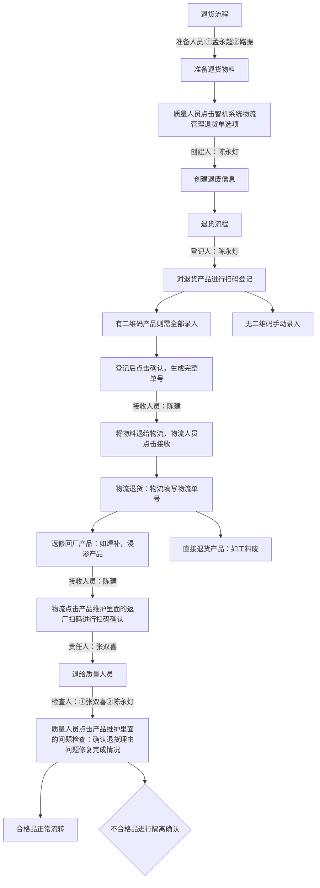

## 退货流程图渲染

### 退货流程

```mermaid
graph TD
    A[退货流程] -->| 准备人员:①孟永超②路振 | B[准备退货物料]
    B --> C[质量人员点击智机系统物流管理退货单选项]
    C -->| 创建人：陈永灯 | D[创建退废信息]
    D --> E[①归属地②产品名称③退货理由④备注信息等等]
    E[退货流程] -->| 登记人：陈永灯 | F[对退货产品进行扫码登记]
    F --> G[有二维码产品则需全部录入]
    F --> H[无二维码手动录入]
    G --> I[登记后点击确认，生成完整单号]
    I -->| 接收人员：陈建 | J[将物料退给物流，物流人员点击接收]
    J --> K[物流退货：物流填写物流单号]
    K --> L[返修回厂产品：如焊补，浸渗产品]
    K --> M[直接退货产品：如工料废]
    L -->| 接收人员：陈建 | N[物流点击产品维护里面的返厂扫码进行扫码确认]
    N -->| 责任人：张双喜 | O[退给质量人员]
    O -->| 检查人：①张双喜②陈永灯 | P[质量人员点击产品维护里面的问题检查：确认退货理由问题修复完成情况]
    P --> Q[合格品正常流转]
    P --> R{不合格品进行隔离确认}
```

