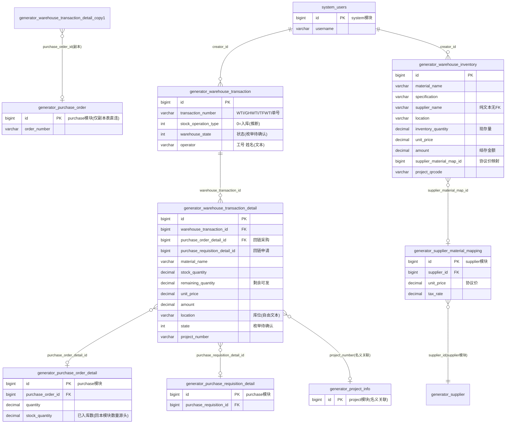

# 仓储模块 · fuadmin 数据字典
> 域: 01-供应链域 | 表数: 13 | 用途: Agent基础文件 | 生成: 2026-07-23

# warehouse-仓储 · 模块概述

## 业务定位
仓储模块是治通供应链域的库存执行模块，覆盖“采购到货入库 → 领料/发货出库 → 库存台账 → 库位（location 自由文本）”全链路，是 purchase 采购模块到货入库的落点。系统按多站点分表：无后缀=治通现役站点（样本 location=智机仓库），`_gh`=广汇、`_tf`=TF铸造（泰峰）、`_zt`=治通同构分表（0 行未启用，仅占位）。

## 上下游
- **上游**：purchase 采购模块——入库明细通过 `purchase_order_detail_id`（有索引）与 `purchase_requisition_detail_id` 回链采购订单明细与申请明细；`supplier_material_map_id` 打通 supplier 模块的供应商-物料协议价映射。
- **下游**：库存表 `generator_warehouse_inventory` 按“物料+规格+供应商+库位”记现存量（`inventory_quantity`）、最近单价与结存金额，供采购安全库存核对与项目成本归集；出库明细的 `project_number/project_name` 支撑项目维度核算。

## 核心流程
采购到货 → 创建出入库单头 `warehouse_transaction`（单号 WTI/GHWTI/TFWTI 前缀，`stock_operation_type` 样本仅见 0）+ 明细 `warehouse_transaction_detail`（数量/单价/税额/项目/领用人）→ 明细 `state` 与单头 `warehouse_state` 推进（枚举待确认）→ 过账后库存表按维度记账。三站点独立单据与台账；`_copy1` 明细副本表（挂 `purchase_order_id` 订单头、字段更短）为旧版备份，新业务勿用。

# warehouse-仓储 · 上岗指南

## 2.1 核心实体表（TOP8）

| 表 | 一句话定义 |
|---|---|
| generator_warehouse_inventory | 治通现役库存台账（物料+规格+供应商+库位的现存量/单价/金额） |
| generator_warehouse_transaction | 出入库单头（WTI 单号，操作类型、仓库状态、经手人） |
| generator_warehouse_transaction_detail | 出入库明细（物料/数量/价税/项目/领用人，回链采购订单明细） |
| generator_warehouse_inventory_gh | 广汇站点库存台账（location=广汇仓库） |
| generator_warehouse_inventory_tf | 泰峰（TF铸造）站点库存台账（location=泰峰仓库） |
| generator_warehouse_transaction_gh / _tf | 广汇/泰峰出入库单头（GHWTI/TFWTI 单号前缀） |
| generator_warehouse_transaction_detail_gh / _tf | 广汇/泰峰出入库明细（结构与主表同构） |
| generator_warehouse_inventory_zt / transaction_zt（及明细） | 治通同构分表，0 行未启用，仅占位勿统计 |

## 2.2 核心业务流

1. 采购到货后创建单头 `warehouse_transaction`：`transaction_number`=WTI+日期+序号（广汇 GHWTI、泰峰 TFWTI），`stock_operation_type` 样本仅见 0（推断=入库），`operator` 格式“工号 姓名”。
2. 写入明细 `warehouse_transaction_detail`：`stock_quantity`/`unit_price`/`tax_rate`/`amount` 记价税，`purchase_order_detail_id`（带索引）回链采购订单明细，`purchase_requisition_detail_id` 回链申请明细；`location` 落库位。
3. 状态推进：明细 `state`（治通样本 6、广汇/泰峰样本 3）、单头 `warehouse_state`（样本 1/2）——枚举含义待确认。
4. 过账记账：库存表 `inventory` 按“material_name+specification+supplier_name+location”维度登记 `inventory_quantity`（现存量）、`unit_price`（最近单价）、`amount`（结存金额）；样本可见入库后数量为 0 的台账行（即“曾入库现已发完”）。
5. 出库/领用：明细 `recipient`（领用人）、`applicant`（申请人，“工号 姓名”文本）、`project_number/project_name`（项目归集）、`remaining_quantity`（该明细行剩余可发数）。
6. 三站点独立核算：治通（智机仓库）、广汇、泰峰各自一套单据与库存，跨站点统计需 UNION。

## 2.3 典型查询场景

**场景1：某物料全站点现存库存（UNION 分表）**
```sql
SELECT '治通' site, material_name, specification, location, inventory_quantity, unit, unit_price
FROM generator_warehouse_inventory WHERE material_name LIKE '%轴承%'
UNION ALL
SELECT '广汇', material_name, specification, location, inventory_quantity, unit, unit_price
FROM generator_warehouse_inventory_gh WHERE material_name LIKE '%轴承%'
UNION ALL
SELECT '泰峰', material_name, specification, location, inventory_quantity, unit, unit_price
FROM generator_warehouse_inventory_tf WHERE material_name LIKE '%轴承%';
```

**场景2：入库单全貌（头+明细）**
```sql
SELECT t.transaction_number, t.operator, t.warehouse_state,
       d.material_name, d.specification, d.stock_quantity, d.unit,
       d.unit_price, d.amount, d.supplier_name, d.location, d.state
FROM generator_warehouse_transaction t
JOIN generator_warehouse_transaction_detail d ON d.warehouse_transaction_id = t.id
WHERE t.transaction_number = 'WTI202509130001';
```

**场景3：时间段入库金额按供应商汇总**
```sql
SELECT supplier_name, COUNT(*) AS line_cnt, SUM(amount) AS total_amount
FROM generator_warehouse_transaction_detail
WHERE stock_date BETWEEN '2025-09-01' AND '2025-09-30'
GROUP BY supplier_name ORDER BY total_amount DESC;
```

**场景4：项目维度领料/出库成本归集**
```sql
SELECT project_number, project_name, SUM(amount) AS project_amount
FROM generator_warehouse_transaction_detail
WHERE project_number <> ''
GROUP BY project_number, project_name
ORDER BY project_amount DESC;
```

**场景5：入库明细溯源采购订单**
```sql
SELECT d.id, d.material_name, d.stock_quantity, d.stock_date,
       pod.id AS po_detail_id, pod.purchase_order_id
FROM generator_warehouse_transaction_detail d
LEFT JOIN generator_purchase_order_detail pod ON pod.id = d.purchase_order_detail_id
WHERE d.warehouse_transaction_id = 6;
```

**场景6：库位分布与占用**
```sql
SELECT location, COUNT(DISTINCT material_name) AS material_kinds,
       SUM(inventory_quantity * unit_price) AS stock_value
FROM generator_warehouse_inventory
GROUP BY location ORDER BY stock_value DESC;
```

**场景7：零库存/待补货清单（含安全库存核对思路）**
```sql
SELECT material_name, specification, supplier_name, inventory_quantity, unit
FROM generator_warehouse_inventory
WHERE inventory_quantity <= 0
ORDER BY material_name;
-- 注：安全库存在 purchase 模块 generator_purchase_material.safety_stock，
--     可按 material_name+specification 名义对碰（无 FK，需人工核对）。
```

**场景8：某经手人的出入库单**
```sql
SELECT transaction_number, stock_operation_type, warehouse_state, create_datetime
FROM generator_warehouse_transaction
WHERE operator LIKE '22530%'
ORDER BY create_datetime DESC;
```

## 2.4 避坑提示

- **站点分表**：无后缀=治通（样本 location=智机仓库/仓库）、`_gh`=广汇、`_tf`=泰峰、`_zt`=治通同构分表。`_zt` 三张表全部 0 行，**统计时务必排除**，不要当作治通业务数据。
- **`_copy1` 副本表**：`transaction_detail_copy1` 与主表数据重叠（样本同 id 同内容），但结构不同——挂 `purchase_order_id`（订单头）而非 `purchase_order_detail_id`，且 `material_name/specification` 字段长度更短（varchar(50)）。疑似改版前备份，**新业务查询勿用**，语义待确认。
- **枚举待确认**：`stock_operation_type`（样本仅见 0）、`warehouse_state`（样本 1/2）、明细 `state`（样本 3/6，站点间取值不一致）均无字典注释，上线前需对照 `system_dict_item` 或代码确认。
- **库存表与单据无 FK**：`inventory` 没有指向 `transaction_detail` 的外键，推断按“物料+规格+供应商+库位”快照式记账；对账需按维度自行汇总单据核对，勿假设有触发器级一致。
- **库位是自由文本**：`location` 取值如“仓库/智机仓库/广汇仓库/泰峰仓库”，无库位主数据表，库位管理属弱模式，分组统计注意同义值清洗。
- **供应商纯文本**：`supplier_name` 无 FK（样本带“（广汇）”站点后缀），正式主数据在 supplier 模块；`supplier_material_map_id`（_gh/_tf/_zt 有索引）是打通协议价的正路。
- **人员字段是文本**：`operator`/`applicant`/`recipient` 格式“工号 姓名”（如“14075 张治民”），按人统计需 `SUBSTRING_INDEX(col,' ',1)` 取工号再关联 system_users。
- **单价精度**：`unit_price` 为 decimal(15,4)、`amount` 为 decimal(13,2)，含税口径由 `tax_rate`（样本 13.00）决定，汇总前先确认金额是否含税。

## 3 数据字典

### generator_warehouse_inventory（约 1243 行）
业务定义: 治通现役库存台账，按物料+供应商+库位记现存量与金额 ｜ 表注释: -

| 字段 | 类型 | 可空 | 键 | 原始注释 | 推断语义 | 置信度 |
|---|---|---|---|---|---|---|
| id | bigint | N | PRI | - | 主键ID | high |
| remark | varchar(255) | Y | - | - | 备注 | high |
| modifier | varchar(255) | Y | - | - | 最后修改人姓名 | high |
| belong_dept | int | Y | - | - | 所属部门ID | mid |
| update_datetime | datetime(6) | Y | - | - | 最后更新时间 | high |
| create_datetime | datetime(6) | Y | - | - | 创建时间 | high |
| sort | int | Y | - | - | 排序号 | high |
| supplier_name | varchar(50) | Y | - | - | 名称[推断] | high |
| amount | decimal(13,2) | Y | - | - | 金额[推断] | high |
| tax_rate | decimal(6,2) | Y | - | - | 比率/百分比[推断] | high |
| unit_price | decimal(15,4) | Y | - | - | 单价[推断] | high |
| location | varchar(50) | Y | - | - | 库位/位置[推断] | mid |
| inventory_quantity | decimal(13,2) | Y | - | - | 数量[推断] | high |
| unit | varchar(10) | Y | - | - | 计量单位[推断] | high |
| material_subcategory | varchar(50) | Y | - | - | 分类[推断] | mid |
| config_requirement | varchar(255) | Y | - | - | 文本字段[推断-待确认] | low |
| specification | varchar(255) | Y | - | - | 规格/型号[推断] | mid |
| material_name | varchar(255) | Y | - | - | 名称[推断] | high |
| project_qrcode | varchar(50) | Y | - | - | 文本字段[推断-待确认] | low |
| creator_id | bigint | Y | MUL | - | 创建人ID → system_users.id | high |
| brand | varchar(20) | Y | - | - | 品牌[推断] | high |
| supplier_material_map_id | bigint | Y | - | - | 关联ID（目标表待确认）[推断] | low |

### generator_warehouse_inventory_gh（约 118 行）
业务定义: 广汇站点库存台账（结构同治通主表） ｜ 表注释: -

| 字段 | 类型 | 可空 | 键 | 原始注释 | 推断语义 | 置信度 |
|---|---|---|---|---|---|---|
| id | bigint | N | PRI | - | 主键ID | high |
| remark | varchar(255) | Y | - | - | 备注 | high |
| modifier | varchar(255) | Y | - | - | 最后修改人姓名 | high |
| belong_dept | int | Y | - | - | 所属部门ID | mid |
| update_datetime | datetime(6) | Y | - | - | 最后更新时间 | high |
| create_datetime | datetime(6) | Y | - | - | 创建时间 | high |
| sort | int | Y | - | - | 排序号 | high |
| supplier_name | varchar(50) | Y | - | - | 名称[推断] | high |
| amount | decimal(13,2) | Y | - | - | 金额[推断] | high |
| tax_rate | decimal(6,2) | Y | - | - | 比率/百分比[推断] | high |
| unit_price | decimal(15,4) | Y | - | - | 单价[推断] | high |
| location | varchar(50) | Y | - | - | 库位/位置[推断] | mid |
| inventory_quantity | decimal(13,2) | Y | - | - | 数量[推断] | high |
| unit | varchar(10) | Y | - | - | 计量单位[推断] | high |
| material_subcategory | varchar(50) | Y | - | - | 分类[推断] | mid |
| brand | varchar(20) | Y | - | - | 品牌[推断] | high |
| config_requirement | varchar(255) | Y | - | - | 文本字段[推断-待确认] | low |
| specification | varchar(255) | Y | - | - | 规格/型号[推断] | mid |
| material_name | varchar(255) | Y | - | - | 名称[推断] | high |
| project_qrcode | varchar(50) | Y | - | - | 文本字段[推断-待确认] | low |
| creator_id | bigint | Y | MUL | - | 创建人ID → system_users.id | high |
| supplier_material_map_id | bigint | Y | MUL | - | 关联ID（目标表待确认）[推断] | low |

### generator_warehouse_inventory_tf（约 27 行）
业务定义: 泰峰（TF铸造）站点库存台账 ｜ 表注释: -

| 字段 | 类型 | 可空 | 键 | 原始注释 | 推断语义 | 置信度 |
|---|---|---|---|---|---|---|
| id | bigint | N | PRI | - | 主键ID | high |
| remark | varchar(255) | Y | - | - | 备注 | high |
| modifier | varchar(255) | Y | - | - | 最后修改人姓名 | high |
| belong_dept | int | Y | - | - | 所属部门ID | mid |
| update_datetime | datetime(6) | Y | - | - | 最后更新时间 | high |
| create_datetime | datetime(6) | Y | - | - | 创建时间 | high |
| sort | int | Y | - | - | 排序号 | high |
| supplier_name | varchar(50) | Y | - | - | 名称[推断] | high |
| amount | decimal(13,2) | Y | - | - | 金额[推断] | high |
| tax_rate | decimal(6,2) | Y | - | - | 比率/百分比[推断] | high |
| unit_price | decimal(15,4) | Y | - | - | 单价[推断] | high |
| location | varchar(50) | Y | - | - | 库位/位置[推断] | mid |
| inventory_quantity | decimal(13,2) | Y | - | - | 数量[推断] | high |
| unit | varchar(10) | Y | - | - | 计量单位[推断] | high |
| material_subcategory | varchar(50) | Y | - | - | 分类[推断] | mid |
| brand | varchar(20) | Y | - | - | 品牌[推断] | high |
| config_requirement | varchar(255) | Y | - | - | 文本字段[推断-待确认] | low |
| specification | varchar(255) | Y | - | - | 规格/型号[推断] | mid |
| material_name | varchar(255) | Y | - | - | 名称[推断] | high |
| project_qrcode | varchar(50) | Y | - | - | 文本字段[推断-待确认] | low |
| creator_id | bigint | Y | MUL | - | 创建人ID → system_users.id | high |
| supplier_material_map_id | bigint | Y | MUL | - | 关联ID（目标表待确认）[推断] | low |

### generator_warehouse_inventory_zt（约 0 行）
业务定义: 治通同构库存分表，0行未启用 ｜ 表注释: -

| 字段 | 类型 | 可空 | 键 | 原始注释 | 推断语义 | 置信度 |
|---|---|---|---|---|---|---|
| id | bigint | N | PRI | - | 主键ID | high |
| remark | varchar(255) | Y | - | - | 备注 | high |
| modifier | varchar(255) | Y | - | - | 最后修改人姓名 | high |
| belong_dept | int | Y | - | - | 所属部门ID | mid |
| update_datetime | datetime(6) | Y | - | - | 最后更新时间 | high |
| create_datetime | datetime(6) | Y | - | - | 创建时间 | high |
| sort | int | Y | - | - | 排序号 | high |
| supplier_name | varchar(50) | Y | - | - | 名称[推断] | high |
| amount | decimal(13,2) | Y | - | - | 金额[推断] | high |
| tax_rate | decimal(6,2) | Y | - | - | 比率/百分比[推断] | high |
| unit_price | decimal(15,4) | Y | - | - | 单价[推断] | high |
| location | varchar(50) | Y | - | - | 库位/位置[推断] | mid |
| inventory_quantity | decimal(13,2) | Y | - | - | 数量[推断] | high |
| unit | varchar(10) | Y | - | - | 计量单位[推断] | high |
| material_subcategory | varchar(50) | Y | - | - | 分类[推断] | mid |
| brand | varchar(20) | Y | - | - | 品牌[推断] | high |
| config_requirement | varchar(255) | Y | - | - | 文本字段[推断-待确认] | low |
| specification | varchar(255) | Y | - | - | 规格/型号[推断] | mid |
| material_name | varchar(255) | Y | - | - | 名称[推断] | high |
| project_qrcode | varchar(50) | Y | - | - | 文本字段[推断-待确认] | low |
| creator_id | bigint | Y | MUL | - | 创建人ID → system_users.id | high |
| supplier_material_map_id | bigint | Y | MUL | - | 关联ID（目标表待确认）[推断] | low |

### generator_warehouse_transaction（约 151 行）
业务定义: 出入库单头（WTI单号，操作类型/仓库状态/经手人） ｜ 表注释: -

| 字段 | 类型 | 可空 | 键 | 原始注释 | 推断语义 | 置信度 |
|---|---|---|---|---|---|---|
| id | bigint | N | PRI | - | 主键ID | high |
| remark | varchar(255) | Y | - | - | 备注 | high |
| modifier | varchar(255) | Y | - | - | 最后修改人姓名 | high |
| belong_dept | int | Y | - | - | 所属部门ID | mid |
| update_datetime | datetime(6) | Y | - | - | 最后更新时间 | high |
| create_datetime | datetime(6) | Y | - | - | 创建时间 | high |
| sort | int | Y | - | - | 排序号 | high |
| stock_operation_type | int | Y | - | - | 类型[推断] | mid |
| transaction_number | varchar(50) | Y | - | - | 编号/代码[推断] | mid |
| creator_id | bigint | Y | MUL | - | 创建人ID → system_users.id | high |
| operator | varchar(20) | Y | - | - | 操作人[推断] | high |
| warehouse_state | int | Y | - | - | 状态（枚举值待确认）[推断] | mid |

### generator_warehouse_transaction_detail（约 286 行）
业务定义: 出入库明细，物料数量金额并回链采购订单明细 ｜ 表注释: -

| 字段 | 类型 | 可空 | 键 | 原始注释 | 推断语义 | 置信度 |
|---|---|---|---|---|---|---|
| id | bigint | N | PRI | - | 主键ID | high |
| remark | varchar(255) | Y | - | - | 备注 | high |
| modifier | varchar(255) | Y | - | - | 最后修改人姓名 | high |
| belong_dept | int | Y | - | - | 所属部门ID | mid |
| update_datetime | datetime(6) | Y | - | - | 最后更新时间 | high |
| create_datetime | datetime(6) | Y | - | - | 创建时间 | high |
| sort | int | Y | - | - | 排序号 | high |
| picture | json | Y | - | - | 图片路径[推断] | mid |
| state | int | Y | - | - | 状态（枚举值待确认）[推断] | mid |
| remaining_quantity | decimal(13,2) | Y | - | - | 数量[推断] | high |
| recipient | varchar(20) | Y | - | - | 接收人[推断] | high |
| project_name | varchar(50) | Y | - | - | 名称[推断] | high |
| project_number | varchar(50) | Y | - | - | 编号/代码[推断] | mid |
| stock_date | date | Y | - | - | 日期[推断] | high |
| supplier_name | varchar(50) | Y | - | - | 名称[推断] | high |
| amount | decimal(13,2) | Y | - | - | 金额[推断] | high |
| tax_rate | decimal(6,2) | Y | - | - | 比率/百分比[推断] | high |
| unit_price | decimal(15,4) | Y | - | - | 单价[推断] | high |
| material_subcategory | varchar(50) | Y | - | - | 分类[推断] | mid |
| stock_quantity | decimal(13,2) | Y | - | - | 数量[推断] | high |
| unit | varchar(10) | Y | - | - | 计量单位[推断] | high |
| config_requirement | varchar(255) | Y | - | - | 文本字段[推断-待确认] | low |
| specification | varchar(255) | Y | - | - | 规格/型号[推断] | mid |
| material_name | varchar(255) | Y | - | - | 名称[推断] | high |
| creator_id | bigint | Y | MUL | - | 创建人ID → system_users.id | high |
| warehouse_transaction_id | bigint | Y | MUL | - | 关联ID → generator_warehouse_transaction.id[推断] | mid |
| location | varchar(50) | Y | - | - | 库位/位置[推断] | mid |
| purchase_requisition_detail_id | bigint | Y | - | - | 关联ID → generator_purchase_requisition_detail.id[推断] | mid |
| brand | varchar(20) | Y | - | - | 品牌[推断] | high |
| applicant | varchar(20) | Y | - | - | 文本字段[推断-待确认] | low |
| purchase_order_detail_id | bigint | Y | MUL | - | 关联ID → generator_purchase_order_detail.id[推断] | mid |

### generator_warehouse_transaction_detail_copy1（约 233 行）
业务定义: 出入库明细旧版备份副本，新业务勿用 ｜ 表注释: -

| 字段 | 类型 | 可空 | 键 | 原始注释 | 推断语义 | 置信度 |
|---|---|---|---|---|---|---|
| id | bigint | N | PRI | - | 主键ID | high |
| remark | varchar(255) | Y | - | - | 备注 | high |
| modifier | varchar(255) | Y | - | - | 最后修改人姓名 | high |
| belong_dept | int | Y | - | - | 所属部门ID | mid |
| update_datetime | datetime(6) | Y | - | - | 最后更新时间 | high |
| create_datetime | datetime(6) | Y | - | - | 创建时间 | high |
| sort | int | Y | - | - | 排序号 | high |
| picture | json | Y | - | - | 图片路径[推断] | mid |
| state | int | Y | - | - | 状态（枚举值待确认）[推断] | mid |
| remaining_quantity | decimal(13,2) | Y | - | - | 数量[推断] | high |
| recipient | varchar(20) | Y | - | - | 接收人[推断] | high |
| project_name | varchar(50) | Y | - | - | 名称[推断] | high |
| project_number | varchar(50) | Y | - | - | 编号/代码[推断] | mid |
| stock_date | date | Y | - | - | 日期[推断] | high |
| supplier_name | varchar(50) | Y | - | - | 名称[推断] | high |
| amount | decimal(13,2) | Y | - | - | 金额[推断] | high |
| tax_rate | decimal(6,2) | Y | - | - | 比率/百分比[推断] | high |
| unit_price | decimal(15,4) | Y | - | - | 单价[推断] | high |
| material_subcategory | varchar(50) | Y | - | - | 分类[推断] | mid |
| stock_quantity | decimal(13,2) | Y | - | - | 数量[推断] | high |
| unit | varchar(10) | Y | - | - | 计量单位[推断] | high |
| config_requirement | varchar(255) | Y | - | - | 文本字段[推断-待确认] | low |
| specification | varchar(50) | Y | - | - | 规格/型号[推断] | mid |
| material_name | varchar(50) | Y | - | - | 名称[推断] | high |
| creator_id | bigint | Y | MUL | - | 创建人ID → system_users.id | high |
| purchase_order_id | bigint | Y | MUL | - | 关联ID → generator_purchase_order.id[推断] | mid |
| warehouse_transaction_id | bigint | Y | MUL | - | 关联ID → generator_warehouse_transaction.id[推断] | mid |
| location | varchar(50) | Y | - | - | 库位/位置[推断] | mid |
| purchase_requisition_detail_id | bigint | Y | - | - | 关联ID → generator_purchase_requisition_detail.id[推断] | mid |
| brand | varchar(20) | Y | - | - | 品牌[推断] | high |
| applicant | varchar(20) | Y | - | - | 文本字段[推断-待确认] | low |

### generator_warehouse_transaction_detail_gh（约 126 行）
业务定义: 广汇站点出入库明细 ｜ 表注释: -

| 字段 | 类型 | 可空 | 键 | 原始注释 | 推断语义 | 置信度 |
|---|---|---|---|---|---|---|
| id | bigint | N | PRI | - | 主键ID | high |
| remark | varchar(255) | Y | - | - | 备注 | high |
| modifier | varchar(255) | Y | - | - | 最后修改人姓名 | high |
| belong_dept | int | Y | - | - | 所属部门ID | mid |
| update_datetime | datetime(6) | Y | - | - | 最后更新时间 | high |
| create_datetime | datetime(6) | Y | - | - | 创建时间 | high |
| sort | int | Y | - | - | 排序号 | high |
| picture | json | Y | - | - | 图片路径[推断] | mid |
| state | int | Y | - | - | 状态（枚举值待确认）[推断] | mid |
| remaining_quantity | decimal(13,2) | Y | - | - | 数量[推断] | high |
| location | varchar(50) | Y | - | - | 库位/位置[推断] | mid |
| recipient | varchar(20) | Y | - | - | 接收人[推断] | high |
| applicant | varchar(20) | Y | - | - | 文本字段[推断-待确认] | low |
| project_name | varchar(50) | Y | - | - | 名称[推断] | high |
| project_number | varchar(50) | Y | - | - | 编号/代码[推断] | mid |
| stock_date | date | Y | - | - | 日期[推断] | high |
| supplier_name | varchar(50) | Y | - | - | 名称[推断] | high |
| amount | decimal(13,2) | Y | - | - | 金额[推断] | high |
| tax_rate | decimal(6,2) | Y | - | - | 比率/百分比[推断] | high |
| unit_price | decimal(15,4) | Y | - | - | 单价[推断] | high |
| material_subcategory | varchar(50) | Y | - | - | 分类[推断] | mid |
| stock_quantity | decimal(13,2) | Y | - | - | 数量[推断] | high |
| unit | varchar(10) | Y | - | - | 计量单位[推断] | high |
| brand | varchar(20) | Y | - | - | 品牌[推断] | high |
| config_requirement | varchar(255) | Y | - | - | 文本字段[推断-待确认] | low |
| specification | varchar(255) | Y | - | - | 规格/型号[推断] | mid |
| material_name | varchar(255) | Y | - | - | 名称[推断] | high |
| purchase_requisition_detail_id | bigint | Y | - | - | 关联ID → generator_purchase_requisition_detail.id[推断] | mid |
| creator_id | bigint | Y | MUL | - | 创建人ID → system_users.id | high |
| warehouse_transaction_id | bigint | Y | MUL | - | 关联ID → generator_warehouse_transaction.id[推断] | mid |
| purchase_order_detail_id | bigint | Y | MUL | - | 关联ID → generator_purchase_order_detail.id[推断] | mid |

### generator_warehouse_transaction_detail_tf（约 27 行）
业务定义: 泰峰站点出入库明细 ｜ 表注释: -

| 字段 | 类型 | 可空 | 键 | 原始注释 | 推断语义 | 置信度 |
|---|---|---|---|---|---|---|
| id | bigint | N | PRI | - | 主键ID | high |
| remark | varchar(255) | Y | - | - | 备注 | high |
| modifier | varchar(255) | Y | - | - | 最后修改人姓名 | high |
| belong_dept | int | Y | - | - | 所属部门ID | mid |
| update_datetime | datetime(6) | Y | - | - | 最后更新时间 | high |
| create_datetime | datetime(6) | Y | - | - | 创建时间 | high |
| sort | int | Y | - | - | 排序号 | high |
| picture | json | Y | - | - | 图片路径[推断] | mid |
| state | int | Y | - | - | 状态（枚举值待确认）[推断] | mid |
| remaining_quantity | decimal(13,2) | Y | - | - | 数量[推断] | high |
| location | varchar(50) | Y | - | - | 库位/位置[推断] | mid |
| recipient | varchar(20) | Y | - | - | 接收人[推断] | high |
| applicant | varchar(20) | Y | - | - | 文本字段[推断-待确认] | low |
| project_name | varchar(50) | Y | - | - | 名称[推断] | high |
| project_number | varchar(50) | Y | - | - | 编号/代码[推断] | mid |
| stock_date | date | Y | - | - | 日期[推断] | high |
| supplier_name | varchar(50) | Y | - | - | 名称[推断] | high |
| amount | decimal(13,2) | Y | - | - | 金额[推断] | high |
| tax_rate | decimal(6,2) | Y | - | - | 比率/百分比[推断] | high |
| unit_price | decimal(15,4) | Y | - | - | 单价[推断] | high |
| material_subcategory | varchar(50) | Y | - | - | 分类[推断] | mid |
| stock_quantity | decimal(13,2) | Y | - | - | 数量[推断] | high |
| unit | varchar(10) | Y | - | - | 计量单位[推断] | high |
| brand | varchar(20) | Y | - | - | 品牌[推断] | high |
| config_requirement | varchar(255) | Y | - | - | 文本字段[推断-待确认] | low |
| specification | varchar(255) | Y | - | - | 规格/型号[推断] | mid |
| material_name | varchar(255) | Y | - | - | 名称[推断] | high |
| purchase_requisition_detail_id | bigint | Y | - | - | 关联ID → generator_purchase_requisition_detail.id[推断] | mid |
| creator_id | bigint | Y | MUL | - | 创建人ID → system_users.id | high |
| warehouse_transaction_id | bigint | Y | MUL | - | 关联ID → generator_warehouse_transaction.id[推断] | mid |
| purchase_order_detail_id | bigint | Y | MUL | - | 关联ID → generator_purchase_order_detail.id[推断] | mid |

### generator_warehouse_transaction_detail_zt（约 0 行）
业务定义: 治通同构明细分表，0行未启用 ｜ 表注释: -

| 字段 | 类型 | 可空 | 键 | 原始注释 | 推断语义 | 置信度 |
|---|---|---|---|---|---|---|
| id | bigint | N | PRI | - | 主键ID | high |
| remark | varchar(255) | Y | - | - | 备注 | high |
| modifier | varchar(255) | Y | - | - | 最后修改人姓名 | high |
| belong_dept | int | Y | - | - | 所属部门ID | mid |
| update_datetime | datetime(6) | Y | - | - | 最后更新时间 | high |
| create_datetime | datetime(6) | Y | - | - | 创建时间 | high |
| sort | int | Y | - | - | 排序号 | high |
| picture | json | Y | - | - | 图片路径[推断] | mid |
| state | int | Y | - | - | 状态（枚举值待确认）[推断] | mid |
| remaining_quantity | decimal(13,2) | Y | - | - | 数量[推断] | high |
| location | varchar(50) | Y | - | - | 库位/位置[推断] | mid |
| recipient | varchar(20) | Y | - | - | 接收人[推断] | high |
| applicant | varchar(20) | Y | - | - | 文本字段[推断-待确认] | low |
| project_name | varchar(50) | Y | - | - | 名称[推断] | high |
| project_number | varchar(50) | Y | - | - | 编号/代码[推断] | mid |
| stock_date | date | Y | - | - | 日期[推断] | high |
| supplier_name | varchar(50) | Y | - | - | 名称[推断] | high |
| amount | decimal(13,2) | Y | - | - | 金额[推断] | high |
| tax_rate | decimal(6,2) | Y | - | - | 比率/百分比[推断] | high |
| unit_price | decimal(15,4) | Y | - | - | 单价[推断] | high |
| material_subcategory | varchar(50) | Y | - | - | 分类[推断] | mid |
| stock_quantity | decimal(13,2) | Y | - | - | 数量[推断] | high |
| unit | varchar(10) | Y | - | - | 计量单位[推断] | high |
| brand | varchar(20) | Y | - | - | 品牌[推断] | high |
| config_requirement | varchar(255) | Y | - | - | 文本字段[推断-待确认] | low |
| specification | varchar(255) | Y | - | - | 规格/型号[推断] | mid |
| material_name | varchar(255) | Y | - | - | 名称[推断] | high |
| purchase_requisition_detail_id | bigint | Y | - | - | 关联ID → generator_purchase_requisition_detail.id[推断] | mid |
| creator_id | bigint | Y | MUL | - | 创建人ID → system_users.id | high |
| warehouse_transaction_id | bigint | Y | MUL | - | 关联ID → generator_warehouse_transaction.id[推断] | mid |
| purchase_order_detail_id | bigint | Y | MUL | - | 关联ID → generator_purchase_order_detail.id[推断] | mid |

### generator_warehouse_transaction_gh（约 50 行）
业务定义: 广汇站点出入库单头（GHWTI单号） ｜ 表注释: -

| 字段 | 类型 | 可空 | 键 | 原始注释 | 推断语义 | 置信度 |
|---|---|---|---|---|---|---|
| id | bigint | N | PRI | - | 主键ID | high |
| remark | varchar(255) | Y | - | - | 备注 | high |
| modifier | varchar(255) | Y | - | - | 最后修改人姓名 | high |
| belong_dept | int | Y | - | - | 所属部门ID | mid |
| update_datetime | datetime(6) | Y | - | - | 最后更新时间 | high |
| create_datetime | datetime(6) | Y | - | - | 创建时间 | high |
| sort | int | Y | - | - | 排序号 | high |
| stock_operation_type | int | Y | - | - | 类型[推断] | mid |
| transaction_number | varchar(50) | Y | - | - | 编号/代码[推断] | mid |
| warehouse_state | int | Y | - | - | 状态（枚举值待确认）[推断] | mid |
| operator | varchar(20) | Y | - | - | 操作人[推断] | high |
| creator_id | bigint | Y | MUL | - | 创建人ID → system_users.id | high |

### generator_warehouse_transaction_tf（约 20 行）
业务定义: 泰峰站点出入库单头（TFWTI单号） ｜ 表注释: -

| 字段 | 类型 | 可空 | 键 | 原始注释 | 推断语义 | 置信度 |
|---|---|---|---|---|---|---|
| id | bigint | N | PRI | - | 主键ID | high |
| remark | varchar(255) | Y | - | - | 备注 | high |
| modifier | varchar(255) | Y | - | - | 最后修改人姓名 | high |
| belong_dept | int | Y | - | - | 所属部门ID | mid |
| update_datetime | datetime(6) | Y | - | - | 最后更新时间 | high |
| create_datetime | datetime(6) | Y | - | - | 创建时间 | high |
| sort | int | Y | - | - | 排序号 | high |
| stock_operation_type | int | Y | - | - | 类型[推断] | mid |
| transaction_number | varchar(50) | Y | - | - | 编号/代码[推断] | mid |
| warehouse_state | int | Y | - | - | 状态（枚举值待确认）[推断] | mid |
| operator | varchar(20) | Y | - | - | 操作人[推断] | high |
| creator_id | bigint | Y | MUL | - | 创建人ID → system_users.id | high |

### generator_warehouse_transaction_zt（约 0 行）
业务定义: 治通同构单头分表，0行未启用 ｜ 表注释: -

| 字段 | 类型 | 可空 | 键 | 原始注释 | 推断语义 | 置信度 |
|---|---|---|---|---|---|---|
| id | bigint | N | PRI | - | 主键ID | high |
| remark | varchar(255) | Y | - | - | 备注 | high |
| modifier | varchar(255) | Y | - | - | 最后修改人姓名 | high |
| belong_dept | int | Y | - | - | 所属部门ID | mid |
| update_datetime | datetime(6) | Y | - | - | 最后更新时间 | high |
| create_datetime | datetime(6) | Y | - | - | 创建时间 | high |
| sort | int | Y | - | - | 排序号 | high |
| stock_operation_type | int | Y | - | - | 类型[推断] | mid |
| transaction_number | varchar(50) | Y | - | - | 编号/代码[推断] | mid |
| warehouse_state | int | Y | - | - | 状态（枚举值待确认）[推断] | mid |
| operator | varchar(20) | Y | - | - | 操作人[推断] | high |
| creator_id | bigint | Y | MUL | - | 创建人ID → system_users.id | high |

# warehouse-仓储 · ER 关系图

聚焦主流程核心实体；站点分表（_gh/_tf/_zt）与 `_copy1` 副本不进图（结构与主表同构或近同构）。跨模块实体用括号标注所属模块。



## 关系说明与置信度

- **FK 证据（索引命名规范，高置信）**：`transaction_detail.warehouse_transaction_id → transaction.id`（两表索引同名 `_e6482a00`，站点分表同样成对）；`transaction_detail.purchase_order_detail_id`（带 MUL 索引）→ purchase 模块订单明细；`detail_copy1.purchase_order_id`（带索引）→ purchase 订单头。
- **命名+结构佐证（中高置信，推断）**：`inventory.supplier_material_map_id → generator_supplier_material_mapping.id`（supplier 模块枢纽表，_gh/_tf/_zt 库存表该列均带 MUL 索引；主表无索引但同构同义）。
- **命名推断（中置信）**：`transaction_detail.purchase_requisition_detail_id → purchase_requisition_detail.id`（命名推断，无索引）。
- **名义关联（中低置信，待确认）**：`detail.project_number/project_name` 与 project 模块按编号文本对碰；`supplier_name` 与 supplier 主数据按名称对碰（无外键）。
- **人员文本（中置信）**：`operator`/`applicant`/`recipient` 为“工号 姓名”文本，需截取工号关联 system_users；`creator_id`/`modifier` 按框架惯例指向 system_users。
- **库存记账方向（推断，待确认）**：`inventory` 无指向单据的外键，推断按“物料+规格+供应商+库位”维度快照记账，与 purchase 模块 `order_detail.stock_quantity`（已入库数）同源联动。

# warehouse-仓储 · 跨模块接口表

| 本模块表.字段 | → 目标模块.表.字段 | 依据 | 置信度 |
|---|---|---|---|
| warehouse_transaction_detail.purchase_order_detail_id | → purchase（采购）.generator_purchase_order_detail.id | 带 MUL 索引 + 命名即目标表名；样本值 162/164 | 高 |
| warehouse_transaction_detail.purchase_requisition_detail_id | → purchase.generator_purchase_requisition_detail.id | 命名推断（无索引） | 中高 |
| warehouse_transaction_detail_copy1.purchase_order_id | → purchase.generator_purchase_order.id | 带 MUL 索引；但为副本表，现役链路待确认 | 高（副本）/中（现役） |
| warehouse_inventory.supplier_material_map_id | → supplier（供应商）.generator_supplier_material_mapping.id | _gh/_tf/_zt 该列带 MUL 索引 + 命名即映射表 | 高 |
| warehouse_transaction_detail.supplier_name | → supplier.generator_supplier（名称列） | 样本值一致（如“无锡市天山铸造材料有限公司”），本侧纯文本无 FK | 中 |
| warehouse_transaction_detail.project_number / project_name | → project（项目）.generator_project_info（编号/名称） | 字段语义项目归集；样本未见值，目标列待确认 | 中（推断，待确认） |
| warehouse_inventory.project_qrcode | → qrcode（二维码追溯）模块 / project 项目二维码 | 命名推断，样本未见值 | 低（待确认） |
| purchase_order_detail.stock_quantity | ← 本模块入库明细.stock_quantity 累计回写（反向联动） | 字段语义“已入库数”，入库后回写采购侧 | 中（推断，待确认） |
| 入库前质检 | → inspection（质量检验）.generator_quality_inspection | 业务常识（到货先检后入），无字段级证据 | 低（待确认） |
| transaction.operator / detail.applicant / detail.recipient | → system（用户权限）.system_users（工号前缀） | 样本格式“工号 姓名”（如“22184 杨小青”），纯文本需截取 | 中 |
| 所有表.creator_id / modifier | → system.system_users.id / username | 框架惯例 + creator_id 索引（样本 modifier=姓名文本） | 高 |
| 枚举值（state/warehouse_state/stock_operation_type） | → system.system_dict / system_dict_item | int 枚举无注释，按框架惯例字典在 system 模块 | 中（待确认） |

## 说明

- **最实的接口是 purchase 方向**：入库明细 → 采购订单明细有显式索引（`purchase_order_detail_id`），是“采购下单 → 到货入库”链路的锚点；采购侧 `stock_quantity`（已入库数）应为本模块回写，构成双向闭环（回写方向为推断）。
- **supplier 方向走映射表**：库存/明细的 `supplier_material_map_id` 接 supplier 模块的供应商-物料映射（唯一键 supplier_id+purchase_material_id），可同时带出协议价与税率；`supplier_name` 纯文本仅作展示与模糊对碰。
- **inspection 质检为业务推断**：机加企业惯例“到货→质检→入库”，但骨架中无字段级关联证据，是否存在质检拦截链路需代码层确认。
- **与 logistics 模块分工**：warehouse 管采购件/原材料/五金耗材的库存（location=内部仓库）；logistics 管成品收发与客户结算库存（仓库结余/客户结余）。两者库存口径不同，勿混用。
- **枚举依赖**：`state`、`warehouse_state`、`stock_operation_type` 预计定义在 system 模块字典表，取值待确认。

## 6 字段备注改进建议

（待 enrich 补充）

## 相关页面
- [[fuadmin数据字典总览]]
- [[付款模块-fuadmin数据字典]]
- [[供应商模块-fuadmin数据字典]]
- [[物流模块-fuadmin数据字典]]
- [[结算模块-fuadmin数据字典]]
- [[质量检验模块-fuadmin数据字典]]
- [[退货模块-fuadmin数据字典]]
- [[采购模块-fuadmin数据字典]]
