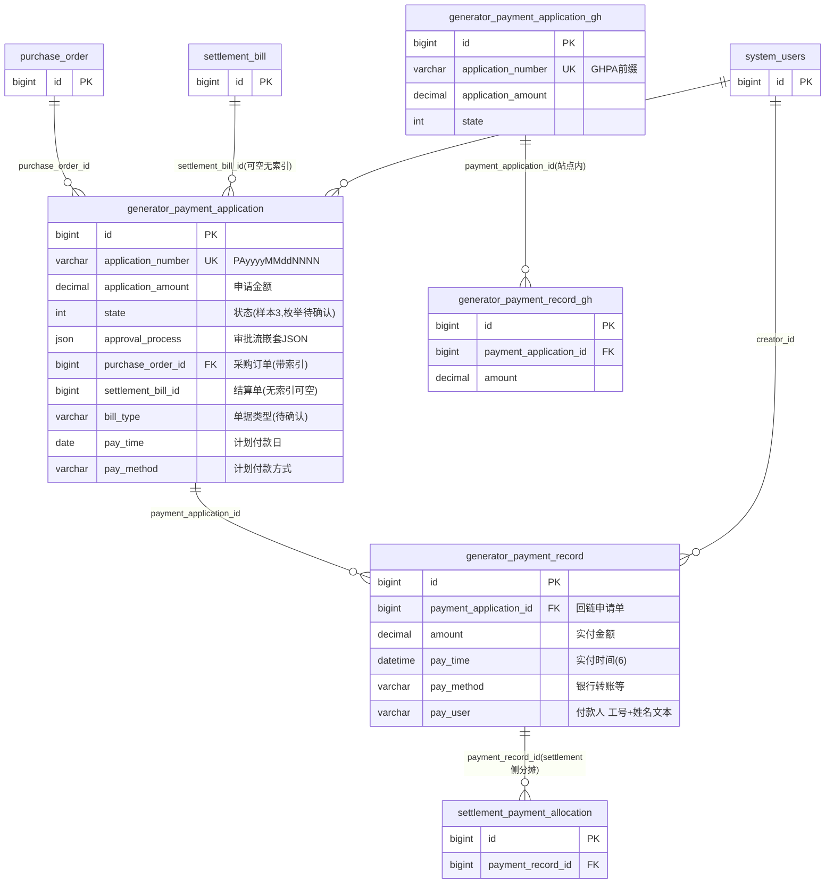

# 付款模块 · fuadmin 数据字典
> 域: 01-供应链域 | 表数: 8 | 用途: Agent基础文件 | 生成: 2026-07-23

# payment-付款 · 概述

付款模块承载对供应商的应付支付流程，以"申请-审批-实付"两段式运转：`generator_payment_application`（~928 行，单号 PA 前缀唯一）发起付款申请并内嵌 `approval_process` JSON 审批流，`generator_payment_record`（~262 行）登记实际付款（金额/时间/方式/付款人）并回链申请单，支持一笔申请分多次实付。申请单双回链：`purchase_order_id`（带索引）直连采购订单，`settlement_bill_id`（可空无索引）回链 settlement 结算单——后者已证实为"结算→付款"衔接点，但 settlement 模块 24 表建成未启用（0 行），当前实际主链路走采购订单直连。站点分表中仅 `_gh`（广汇，GHPA 前缀）在用（申请 13 行/记录 12 行），`_tf/_zt` 0 行未启用。付款核销不落在本模块，而是经 settlement 的 `payment_allocation → invoice_payment_allocation` 两级分摊完成。

# payment-付款 · 上岗指南

## 2.1 核心实体表（TOP8）

| 表 | 一句话定义 |
|---|---|
| generator_payment_application | 付款申请单头：application_number 唯一（PAyyyyMMddNNNN），application_amount 申请金额，state 状态，approval_process JSON 审批流，双回链 purchase_order_id / settlement_bill_id |
| generator_payment_record | 付款记录（实付）：amount 实付金额，pay_time/pay_method/pay_user，payment_application_id 回链申请单，支持一申请多实付 |
| generator_payment_application_gh | 广汇站点付款申请分表（GHPA 前缀单号，~13 行在用） |
| generator_payment_record_gh | 广汇站点付款记录分表（~12 行在用） |
| generator_payment_application_tf | TF 铸造站点申请分表（同构，0 行未启用） |
| generator_payment_application_zt | 治通站点申请分表（同构，0 行未启用） |
| generator_payment_record_tf | TF 铸造站点记录分表（同构，0 行未启用） |
| generator_payment_record_zt | 治通站点记录分表（同构，0 行未启用） |

> 说明：8 表 = 2 组逻辑实体 × 4 站点分表；主表+`_gh` 在用，`_tf/_zt` 未启用。`bill_type`、`state` 枚举取值待代码/字典确认。

## 2.2 核心业务流

1. **发起申请**：基于采购订单（`purchase_order_id`，带索引）或结算单（`settlement_bill_id`，可空无索引，settlement 未启用故多为空）创建 `payment_application`，生成唯一单号 PA/GHPA 前缀，`bill_type` 标记单据类型（推断如货款/费用，取值待确认），`pay_method`/`pay_time` 可预填计划付款方式与日期。
2. **审批**：`approval_process` JSON 记录审批链（样本为 `[["to":["工号 姓名"],"role":"审核",...]]` 嵌套结构），`state` 随审批流转（样本见 3，推断为"审批通过/待付款"，枚举待确认）。
3. **实付登记**：财务付款后写 `payment_record`（`amount`、`pay_time` 精确到微秒、`pay_method` 如银行转账、`pay_user` 付款人"工号 姓名"文本），`payment_application_id` 回链申请单；样本显示申请 200.00 → 实付 200.00，支持一笔申请拆多笔实付（部分付款）。
4. **核销（跨模块）**：实付后由 settlement 模块 `settlement_payment_allocation`（按结算明细行分摊）→ `settlement_invoice_payment_allocation`（按发票明细行细分）完成两级核销；**该链路已证实但 settlement 0 行未启用**，当前实际核销口径以采购订单直连为准（推断）。
5. **站点并行**：广汇业务走 `_gh` 分表（单号 GHPA 前缀、belong_dept=16），与主表并行记账；跨站点资金报表需 UNION。

## 2.3 典型查询场景

**场景1：某采购订单的付款申请与实付进度**
```sql
SELECT a.application_number, a.application_amount, a.state,
       IFNULL(SUM(r.amount),0) AS paid_amount,
       a.application_amount - IFNULL(SUM(r.amount),0) AS unpaid
FROM generator_payment_application a
LEFT JOIN generator_payment_record r ON r.payment_application_id = a.id
WHERE a.purchase_order_id = 8
GROUP BY a.id;
```

**场景2：已审批未付清申请清单（资金计划）**
```sql
SELECT a.application_number, a.application_amount, a.pay_time, a.pay_method,
       IFNULL(SUM(r.amount),0) AS paid_amount
FROM generator_payment_application a
LEFT JOIN generator_payment_record r ON r.payment_application_id = a.id
WHERE a.state = 3  -- 推断为审批通过，枚举待确认
GROUP BY a.id
HAVING paid_amount < a.application_amount
ORDER BY a.pay_time;
```

**场景3：按月付款实付汇总（含广汇 UNION）**
```sql
SELECT DATE_FORMAT(pay_time,'%Y-%m') ym, '主站点' site, SUM(amount) total
FROM generator_payment_record GROUP BY ym
UNION ALL
SELECT DATE_FORMAT(pay_time,'%Y-%m'), '广汇', SUM(amount)
FROM generator_payment_record_gh GROUP BY DATE_FORMAT(pay_time,'%Y-%m')
ORDER BY ym DESC;
```

**场景4：结算单→付款申请回链（settlement 启用后核销主线）**
```sql
SELECT a.application_number, a.application_amount, a.state, a.settlement_bill_id
FROM generator_payment_application a
WHERE a.settlement_bill_id IS NOT NULL;
```

**场景5：一笔申请的多笔实付流水（部分付款核对）**
```sql
SELECT r.id, r.amount, r.pay_time, r.pay_method, r.pay_user
FROM generator_payment_record r
WHERE r.payment_application_id = 1
ORDER BY r.pay_time;
```

**场景6：审批流 JSON 提取审批人（MySQL 5.7 可用 JSON_EXTRACT）**
```sql
SELECT application_number,
       JSON_EXTRACT(approval_process, '$[0][0].to') AS approvers,
       JSON_EXTRACT(approval_process, '$[0][0].role') AS role
FROM generator_payment_application
WHERE application_number = 'PA202508290001';
```

**场景7：某时间段各付款方式金额分布**
```sql
SELECT pay_method, COUNT(*) cnt, SUM(amount) total
FROM generator_payment_record
WHERE pay_time >= '2025-08-01' AND pay_time < '2025-09-01'
GROUP BY pay_method;
```

## 2.4 避坑提示

- **核销链不在本模块**："某发票/结算单已付多少"必须走 settlement 的 `payment_allocation → invoice_payment_allocation` 两级分摊 JOIN，**勿**用 `SUM(payment_record.amount)` 直接对发票——口径必错；且 settlement 0 行未启用，当前该链路实际无数据，报表口径需与财务确认。
- **`settlement_bill_id` 无索引且大量为空**：按结算单反查申请时全表扫描，且 NULL 不代表异常——settlement 未启用期间申请单只挂 `purchase_order_id`。
- **申请金额 ≠ 实付金额**：一笔申请可零笔/多笔 `payment_record`，"应付未付"统计用 `application_amount - SUM(record.amount)` 差额口径，勿只看申请单 state。
- **state 枚举无注释**：样本只见 3（推断审批通过），`bill_type` 无样本值；写过滤条件前对照 `system_dict_item` 或后端代码确认。
- **`_gh` 分表在用**：广汇 13+12 行真实业务数据，跨站点资金统计必须 UNION 主表与 `_gh`；`_tf/_zt` 0 行可忽略但建议保留 UNION 结构防开闸。
- **approval_process 是嵌套 JSON**：`[["to":[...],"role":"审核",...]]` 多层数组结构，MySQL 5.7 无 JSON_TABLE，完整审批链解析建议程序侧处理。
- **pay_user 是"工号 姓名"文本**：对 `system_users` 只能按工号前缀对碰，且存在离职/改名风险；`pay_time` 在申请表是 date（计划）、在记录表是 datetime(6)（实际），两字段语义不同勿混。
- **单号唯一约束跨表独立**：主表 PA 前缀、`_gh` GHPA 前缀各自 UNIQUE，合并报表时单号不冲突，但勿假设全局统一序列。

## 3 数据字典

### generator_payment_application（约 928 行）
业务定义: 付款申请单：PA单号唯一，金额/审批流JSON，回链采购订单与结算单 ｜ 表注释: -

| 字段 | 类型 | 可空 | 键 | 原始注释 | 推断语义 | 置信度 |
|---|---|---|---|---|---|---|
| id | bigint | N | PRI | - | 主键ID | high |
| remark | varchar(255) | Y | - | - | 备注 | high |
| modifier | varchar(255) | Y | - | - | 最后修改人姓名 | high |
| belong_dept | int | Y | - | - | 所属部门ID | mid |
| update_datetime | datetime(6) | Y | - | - | 最后更新时间 | high |
| create_datetime | datetime(6) | Y | - | - | 创建时间 | high |
| sort | int | Y | - | - | 排序号 | high |
| application_number | varchar(50) | Y | UNI | - | 编号/代码[推断] | mid |
| application_amount | decimal(13,2) | Y | - | - | 金额[推断] | high |
| state | int | Y | - | - | 状态（枚举值待确认）[推断] | mid |
| approval_process | json | Y | - | - | 工序[推断] | mid |
| creator_id | bigint | Y | MUL | - | 创建人ID → system_users.id | high |
| purchase_order_id | bigint | Y | MUL | - | 关联ID → generator_purchase_order.id[推断] | mid |
| pay_method | varchar(50) | Y | - | - | 文本字段[推断-待确认] | low |
| pay_time | date | Y | - | - | 时间[推断] | high |
| bill_type | varchar(30) | Y | - | - | 类型[推断] | mid |
| settlement_bill_id | bigint | Y | - | - | 关联ID → generator_settlement_bill.id[推断] | mid |

### generator_payment_application_gh（约 13 行）
业务定义: 付款申请单广汇站点分表（GHPA前缀，在用~13行） ｜ 表注释: -

| 字段 | 类型 | 可空 | 键 | 原始注释 | 推断语义 | 置信度 |
|---|---|---|---|---|---|---|
| id | bigint | N | PRI | - | 主键ID | high |
| remark | varchar(255) | Y | - | - | 备注 | high |
| modifier | varchar(255) | Y | - | - | 最后修改人姓名 | high |
| belong_dept | int | Y | - | - | 所属部门ID | mid |
| update_datetime | datetime(6) | Y | - | - | 最后更新时间 | high |
| create_datetime | datetime(6) | Y | - | - | 创建时间 | high |
| sort | int | Y | - | - | 排序号 | high |
| application_number | varchar(50) | Y | UNI | - | 编号/代码[推断] | mid |
| application_amount | decimal(13,2) | Y | - | - | 金额[推断] | high |
| state | int | Y | - | - | 状态（枚举值待确认）[推断] | mid |
| approval_process | json | Y | - | - | 工序[推断] | mid |
| pay_time | date | Y | - | - | 时间[推断] | high |
| pay_method | varchar(50) | Y | - | - | 文本字段[推断-待确认] | low |
| creator_id | bigint | Y | MUL | - | 创建人ID → system_users.id | high |
| purchase_order_id | bigint | Y | MUL | - | 关联ID → generator_purchase_order.id[推断] | mid |
| bill_type | varchar(30) | Y | - | - | 类型[推断] | mid |
| settlement_bill_id | bigint | Y | - | - | 关联ID → generator_settlement_bill.id[推断] | mid |

### generator_payment_application_tf（约 0 行）
业务定义: 付款申请单TF铸造站点分表（同构，0行未启用） ｜ 表注释: -

| 字段 | 类型 | 可空 | 键 | 原始注释 | 推断语义 | 置信度 |
|---|---|---|---|---|---|---|
| id | bigint | N | PRI | - | 主键ID | high |
| remark | varchar(255) | Y | - | - | 备注 | high |
| modifier | varchar(255) | Y | - | - | 最后修改人姓名 | high |
| belong_dept | int | Y | - | - | 所属部门ID | mid |
| update_datetime | datetime(6) | Y | - | - | 最后更新时间 | high |
| create_datetime | datetime(6) | Y | - | - | 创建时间 | high |
| sort | int | Y | - | - | 排序号 | high |
| application_number | varchar(50) | Y | UNI | - | 编号/代码[推断] | mid |
| application_amount | decimal(13,2) | Y | - | - | 金额[推断] | high |
| state | int | Y | - | - | 状态（枚举值待确认）[推断] | mid |
| approval_process | json | Y | - | - | 工序[推断] | mid |
| pay_time | date | Y | - | - | 时间[推断] | high |
| pay_method | varchar(50) | Y | - | - | 文本字段[推断-待确认] | low |
| creator_id | bigint | Y | MUL | - | 创建人ID → system_users.id | high |
| purchase_order_id | bigint | Y | MUL | - | 关联ID → generator_purchase_order.id[推断] | mid |
| bill_type | varchar(30) | Y | - | - | 类型[推断] | mid |
| settlement_bill_id | bigint | Y | - | - | 关联ID → generator_settlement_bill.id[推断] | mid |

### generator_payment_application_zt（约 0 行）
业务定义: 付款申请单治通站点分表（同构，0行未启用） ｜ 表注释: -

| 字段 | 类型 | 可空 | 键 | 原始注释 | 推断语义 | 置信度 |
|---|---|---|---|---|---|---|
| id | bigint | N | PRI | - | 主键ID | high |
| remark | varchar(255) | Y | - | - | 备注 | high |
| modifier | varchar(255) | Y | - | - | 最后修改人姓名 | high |
| belong_dept | int | Y | - | - | 所属部门ID | mid |
| update_datetime | datetime(6) | Y | - | - | 最后更新时间 | high |
| create_datetime | datetime(6) | Y | - | - | 创建时间 | high |
| sort | int | Y | - | - | 排序号 | high |
| application_number | varchar(50) | Y | UNI | - | 编号/代码[推断] | mid |
| application_amount | decimal(13,2) | Y | - | - | 金额[推断] | high |
| state | int | Y | - | - | 状态（枚举值待确认）[推断] | mid |
| approval_process | json | Y | - | - | 工序[推断] | mid |
| pay_time | date | Y | - | - | 时间[推断] | high |
| pay_method | varchar(50) | Y | - | - | 文本字段[推断-待确认] | low |
| creator_id | bigint | Y | MUL | - | 创建人ID → system_users.id | high |
| purchase_order_id | bigint | Y | MUL | - | 关联ID → generator_purchase_order.id[推断] | mid |
| bill_type | varchar(30) | Y | - | - | 类型[推断] | mid |
| settlement_bill_id | bigint | Y | - | - | 关联ID → generator_settlement_bill.id[推断] | mid |

### generator_payment_record（约 262 行）
业务定义: 付款记录：实付金额/时间/方式/付款人，回链付款申请单 ｜ 表注释: -

| 字段 | 类型 | 可空 | 键 | 原始注释 | 推断语义 | 置信度 |
|---|---|---|---|---|---|---|
| id | bigint | N | PRI | - | 主键ID | high |
| remark | varchar(255) | Y | - | - | 备注 | high |
| modifier | varchar(255) | Y | - | - | 最后修改人姓名 | high |
| belong_dept | int | Y | - | - | 所属部门ID | mid |
| update_datetime | datetime(6) | Y | - | - | 最后更新时间 | high |
| create_datetime | datetime(6) | Y | - | - | 创建时间 | high |
| sort | int | Y | - | - | 排序号 | high |
| amount | decimal(13,2) | Y | - | - | 金额[推断] | high |
| pay_time | datetime(6) | Y | - | - | 时间[推断] | high |
| pay_method | varchar(50) | Y | - | - | 文本字段[推断-待确认] | low |
| pay_user | varchar(50) | Y | - | - | 用户[推断] | mid |
| creator_id | bigint | Y | MUL | - | 创建人ID → system_users.id | high |
| payment_application_id | bigint | Y | MUL | - | 关联ID → generator_payment_application.id[推断] | mid |

### generator_payment_record_gh（约 12 行）
业务定义: 付款记录广汇站点分表（在用~12行） ｜ 表注释: -

| 字段 | 类型 | 可空 | 键 | 原始注释 | 推断语义 | 置信度 |
|---|---|---|---|---|---|---|
| id | bigint | N | PRI | - | 主键ID | high |
| remark | varchar(255) | Y | - | - | 备注 | high |
| modifier | varchar(255) | Y | - | - | 最后修改人姓名 | high |
| belong_dept | int | Y | - | - | 所属部门ID | mid |
| update_datetime | datetime(6) | Y | - | - | 最后更新时间 | high |
| create_datetime | datetime(6) | Y | - | - | 创建时间 | high |
| sort | int | Y | - | - | 排序号 | high |
| amount | decimal(13,2) | Y | - | - | 金额[推断] | high |
| pay_time | datetime(6) | Y | - | - | 时间[推断] | high |
| pay_method | varchar(50) | Y | - | - | 文本字段[推断-待确认] | low |
| pay_user | varchar(50) | Y | - | - | 用户[推断] | mid |
| creator_id | bigint | Y | MUL | - | 创建人ID → system_users.id | high |
| payment_application_id | bigint | Y | MUL | - | 关联ID → generator_payment_application.id[推断] | mid |

### generator_payment_record_tf（约 0 行）
业务定义: 付款记录TF铸造站点分表（同构，0行未启用） ｜ 表注释: -

| 字段 | 类型 | 可空 | 键 | 原始注释 | 推断语义 | 置信度 |
|---|---|---|---|---|---|---|
| id | bigint | N | PRI | - | 主键ID | high |
| remark | varchar(255) | Y | - | - | 备注 | high |
| modifier | varchar(255) | Y | - | - | 最后修改人姓名 | high |
| belong_dept | int | Y | - | - | 所属部门ID | mid |
| update_datetime | datetime(6) | Y | - | - | 最后更新时间 | high |
| create_datetime | datetime(6) | Y | - | - | 创建时间 | high |
| sort | int | Y | - | - | 排序号 | high |
| amount | decimal(13,2) | Y | - | - | 金额[推断] | high |
| pay_time | datetime(6) | Y | - | - | 时间[推断] | high |
| pay_method | varchar(50) | Y | - | - | 文本字段[推断-待确认] | low |
| pay_user | varchar(50) | Y | - | - | 用户[推断] | mid |
| creator_id | bigint | Y | MUL | - | 创建人ID → system_users.id | high |
| payment_application_id | bigint | Y | MUL | - | 关联ID → generator_payment_application.id[推断] | mid |

### generator_payment_record_zt（约 0 行）
业务定义: 付款记录治通站点分表（同构，0行未启用） ｜ 表注释: -

| 字段 | 类型 | 可空 | 键 | 原始注释 | 推断语义 | 置信度 |
|---|---|---|---|---|---|---|
| id | bigint | N | PRI | - | 主键ID | high |
| remark | varchar(255) | Y | - | - | 备注 | high |
| modifier | varchar(255) | Y | - | - | 最后修改人姓名 | high |
| belong_dept | int | Y | - | - | 所属部门ID | mid |
| update_datetime | datetime(6) | Y | - | - | 最后更新时间 | high |
| create_datetime | datetime(6) | Y | - | - | 创建时间 | high |
| sort | int | Y | - | - | 排序号 | high |
| amount | decimal(13,2) | Y | - | - | 金额[推断] | high |
| pay_time | datetime(6) | Y | - | - | 时间[推断] | high |
| pay_method | varchar(50) | Y | - | - | 文本字段[推断-待确认] | low |
| pay_user | varchar(50) | Y | - | - | 用户[推断] | mid |
| creator_id | bigint | Y | MUL | - | 创建人ID → system_users.id | high |
| payment_application_id | bigint | Y | MUL | - | 关联ID → generator_payment_application.id[推断] | mid |

# payment-付款 · ER 图



## 推断说明

- **已证实**：`record.payment_application_id`、`application.purchase_order_id` 带 MUL 索引；`application.settlement_bill_id` 字段真实存在（可空无索引）；`_gh` 分表内部 record→application 回链同构带索引。
- **推断**：`purchase_order`、`settlement_bill`、`settlement_payment_allocation` 为跨模块表（purchase / settlement 模块），此处仅画出衔接端；`payment_record → settlement_payment_allocation` 的核销边由 settlement 侧字段名+已证实的两级分摊链路推断，settlement 0 行未启用。
- **1:N 关系**：一申请对多实付（部分付款场景）由 record 侧 FK 设计推断，样本为 1:1 全额付款。
- **省略**：`_tf/_zt` 四张分表（0 行）结构同主表，图中未画出；`pay_user`/`creator_id` 到 system_users 的关联为框架惯例（文本/索引）。

# payment-付款 · 跨模块接口表

| 本模块表.字段 | → 目标模块.表.字段 | 依据 | 置信度 |
|---|---|---|---|
| payment_application.purchase_order_id | → purchase（采购）.generator_purchase_order.id | 命名+MUL索引；purchase 模块存在该表 | 高（推断） |
| payment_application.settlement_bill_id | → settlement（结算）.generator_settlement_bill.id | **已证实**：字段真实存在（可空无索引）；settlement enrich 交叉确认 | 高 |
| payment_record.id | ← settlement.generator_settlement_payment_allocation.payment_record_id（核销分摊回指） | settlement 侧字段+唯一约束已证实；两级分摊链第一级 | 高（推断，settlement 0 行未启用） |
| payment_record.id | ← settlement.generator_settlement_invoice_payment_allocation（间接，经 payment_allocation 二级细分到发票） | settlement 已证实链路；勿跳级直挂 | 高（推断） |
| record.pay_user / application 审批人(JSON) | → system（用户权限）.system_users（"工号 姓名"文本对碰） | 样本格式 "22172 唐玉"；无 FK | 中 |
| application.approval_process | → system 审批流引擎/用户集合（JSON 嵌套含角色与"工号 姓名"） | 样本结构 `[[{"to":[...],"role":"审核"}]]` | 中 |
| 所有表.creator_id | → system.system_users.id | 框架惯例+MUL索引（员工主表） | 高 |
| 所有表.belong_dept | → system.system_dept.id（推断；_gh 样本=16） | 框架惯例 int 部门号 | 中（待确认） |
| 所有表.modifier | → system_users 姓名文本（最近修改人，框架惯例） | 样本为纯姓名 | 中 |

## 说明

- **最实的两条边**：① `payment_application.purchase_order_id`（带索引）是当前实际主链路——"采购订单→付款申请→实付"；② `payment_application.settlement_bill_id` 已证实存在，是"结算单→付款"设计链路，但 settlement 24 表 0 行未启用，当前该字段大量为空。
- **purchase 方向**：申请单直挂采购订单头，是三方衔接点（purchase→payment 回写付款进度、payment→purchase 取供应商/金额基数的推断方向）；purchase 侧未见回指字段，付款进度需从本模块反查聚合。
- **settlement 方向两级分摊（勿跳级）**：核销链为 `payment_record → settlement_payment_allocation(结算明细级) → settlement_invoice_payment_allocation(发票明细级)`；跨模块取"发票已付"必须两级 JOIN，直接对 `payment_record` 求和会口径错配。settlement 启用前此链无数据。
- **system_users 方向三种形态**：FK 级（creator_id）、"工号 姓名"文本级（pay_user）、JSON 审批流级（approval_process 内嵌 to/role），人员维度统计需分别处理。
- **站点分表**：`_gh`（GHPA 前缀，belong_dept=16）在用 13+12 行，跨模块接口结构同主表；`_tf/_zt` 0 行未启用。

## 6 字段备注改进建议

（本模块为小型/过渡性模块，业务语义与归属建议见同域《零散模块总览》或域内相关主模块文档）

## 相关页面
- [[fuadmin数据字典总览]]
- [[仓储模块-fuadmin数据字典]]
- [[供应商模块-fuadmin数据字典]]
- [[物流模块-fuadmin数据字典]]
- [[结算模块-fuadmin数据字典]]
- [[退货模块-fuadmin数据字典]]
- [[采购模块-fuadmin数据字典]]
