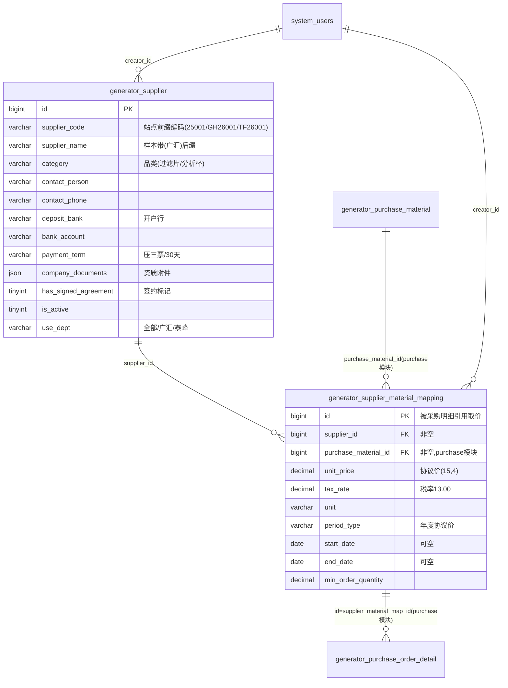

# 供应商模块 · fuadmin 数据字典
> 域: 01-供应链域 | 表数: 8 | 用途: Agent基础文件 | 生成: 2026-07-23

# supplier-供应商 · 模块概述

## 业务定位
供应商模块是治通供应链域的供应商主数据中心：以 `generator_supplier` 管理供应商档案（编码/名称/联系人/开户行/付款条款/资质文件 JSON/签约标记），以 `generator_supplier_material_mapping` 维护“供应商×采购物料”协议价（单价/税率/单位/协议期/起订量，`unique(supplier_id, purchase_material_id)`）。**mapping 是打通采购协议价的关键枢纽**——采购订单明细通过 `supplier_material_map_id` 直接引用本表取价，形成“物料—供应商—协议价”闭环。供应商资质以 `company_documents`+`has_signed_agreement` 记录；**无独立评价表**，mapping 上的脏注释残留视图名 `generator_summary_qualified_inspections_view`，推断供应商绩效/合格评价走质量检验域汇总视图（待确认）。

## 上下游
- **上游**：purchase 模块 `generator_purchase_material`（采购物料）被 mapping 的 `purchase_material_id`（非空带索引）引用；供应商建档由 system_users 人员维护（creator_id）。
- **下游**：purchase 模块 `generator_purchase_order_detail.supplier_material_map_id` 引用 mapping 取协议价；`purchase_order.supplier_name` 存供应商名文本快照。

## 站点分表格局
`_gh`（广汇，43+183 行）/`_tf`（泰峰，42+54 行）/`_zt`（治通老站，1467+2.3 万行，2017 年遗留数据）三组站点同构分表与主表（210+806 行）结构一致、数据各自独立；主表与分表是并集还是迁移关系待确认，跨站统计需 UNION 且勿主分混算。

# supplier-供应商 · 上岗指南

## 2.1 核心实体表（TOP6）

| 表 | 一句话定义 |
|---|---|
| generator_supplier | 供应商主档（210 行：编码/名称/联系人/银行/付款条款/资质 JSON/签约标记） |
| generator_supplier_material_mapping | 供应商×物料协议价映射（806 行，unique(supplier_id,purchase_material_id)，采购取价枢纽） |
| generator_supplier_zt | 治通老站供应商主档（1467 行，2017 遗留，supplier_code=联系人姓名） |
| generator_supplier_material_mapping_zt | 老站协议价映射（2.3 万行，unit_price 多为 0，脏数据占比高） |
| generator_supplier_gh / _tf | 广汇/泰峰站点供应商主档（43/42 行，编码前缀 GH26xxx/TF26xxx） |
| generator_supplier_material_mapping_gh / _tf | 站点协议价映射（183/54 行，period_type=年度协议价） |

## 2.2 核心业务流

1. **供应商录入**：在 `generator_supplier`（或站点分表）建档——`supplier_code` 按站点前缀编号（主表 25001、广汇 GH26001、泰峰 TF26001），`use_dept` 标使用部门（全部/广汇/泰峰），`is_active` 控制启用，`category`（过滤片/分析杯）、`business_scope`、`represented_brands` 补业务画像。
2. **资质/评价**：`company_documents` JSON 存证照附件（样本多为 `[]`），`has_signed_agreement` 标记是否签协议，`payment_term` 记付款条款（压三票/压两票/30 天），`deposit_bank`+`bank_account` 记收款账户。**评价无独立表**——脏注释残留 `generator_summary_qualified_inspections_view`，推断由质量检验域合格汇总视图承担（待确认），勿在本模块找评价表。
3. **物料映射（协议价）**：`generator_supplier_material_mapping` 建供应商×物料价格——`unit_price`（4 位小数）、`tax_rate`（13.00）、`unit`、`period_type`（年度协议价）、`start_date`~`end_date`、`min_order_quantity`；unique(supplier_id, purchase_material_id) 防重复报价。
4. **采购下单取价**：purchase 模块 `generator_purchase_order_detail.supplier_material_map_id` 直接引用 mapping.id 带出协议价；`purchase_order.supplier_name` 仅存供应商名文本快照（样本带“（广汇）”站点后缀）。

## 2.3 典型查询场景

**场景1：供应商档案总览（按编码）**
```sql
SELECT supplier_code, supplier_name, category, contact_person, contact_phone,
       payment_term, has_signed_agreement, is_active, use_dept
FROM generator_supplier
ORDER BY supplier_code;
```

**场景2：某物料的全部供应商协议价对比**
```sql
SELECT m.supplier_id, s.supplier_name, m.unit_price, m.tax_rate, m.unit,
       m.period_type, m.start_date, m.end_date, m.min_order_quantity
FROM generator_supplier_material_mapping m
LEFT JOIN generator_supplier s ON s.id = m.supplier_id
WHERE m.purchase_material_id = 9
ORDER BY m.unit_price;
```

**场景3：某供应商的协议价清单（含有效期）**
```sql
SELECT m.purchase_material_id, m.unit_price, m.unit, m.period_type,
       m.start_date, m.end_date,
       CASE WHEN m.end_date IS NULL OR m.end_date >= CURDATE()
            THEN '有效' ELSE '已过期' END AS price_status
FROM generator_supplier_material_mapping m
WHERE m.supplier_id = 27
ORDER BY m.end_date;
```

**场景4：协议价 90 天内到期预警**
```sql
SELECT s.supplier_name, m.purchase_material_id, m.unit_price, m.end_date
FROM generator_supplier_material_mapping m
JOIN generator_supplier s ON s.id = m.supplier_id
WHERE m.end_date IS NOT NULL
  AND m.end_date BETWEEN CURDATE() AND DATE_ADD(CURDATE(), INTERVAL 90 DAY)
ORDER BY m.end_date;
```

**场景5：未签约/停用供应商清单**
```sql
SELECT supplier_code, supplier_name, category, is_active, has_signed_agreement
FROM generator_supplier
WHERE has_signed_agreement = 0 OR is_active = 0
ORDER BY supplier_code;
```

**场景6：全站点供应商合并统计（UNION 站点分表）**
```sql
SELECT 'gh' AS site, COUNT(*) AS cnt FROM generator_supplier_gh WHERE is_active = 1
UNION ALL
SELECT 'tf', COUNT(*) FROM generator_supplier_tf WHERE is_active = 1
UNION ALL
SELECT 'zt', COUNT(*) FROM generator_supplier_zt WHERE is_active = 1
UNION ALL
SELECT 'main', COUNT(*) FROM generator_supplier WHERE is_active = 1;
```

**场景7：zt 老站脏数据体检（零价映射）**
```sql
SELECT COUNT(*) AS zero_price_cnt,
       SUM(CASE WHEN unit_price = 0 THEN 1 ELSE 0 END) / COUNT(*) AS zero_ratio
FROM generator_supplier_material_mapping_zt;
```

**场景8：按联系人/电话反查供应商**
```sql
SELECT supplier_code, supplier_name, contact_person, contact_phone, use_dept
FROM generator_supplier
WHERE contact_person LIKE '%王秀阳%' OR contact_phone LIKE '%1345169%';
```

## 2.4 避坑提示

- **站点分表各自独立**：`_gh`/`_tf`/`_zt` 与主表同构但数据不重叠口径待确认——主表与分表是“并集”还是“迁移中”关系**未证实**；跨站统计用 UNION，**严禁主表+分表无差别混算**（防重复或漏数）。
- **zt 是 2017 遗留脏数据**：`supplier_zt.supplier_code` 填的是联系人姓名（朱汉卿/王杰）而非编码；`mapping_zt` 大量 `unit_price=0`、`unit=Unit(s)`、`min_order_quantity=0`，统计分析前先做数据质量过滤。
- **mapping 脏注释不可信**：表注释残留 `'fuadmin.generator_summary_qualified_inspections_view' is not BASE TABLE`，是视图/迁移残留，既不代表本表是视图，也不代表评价功能在本模块——评价链路待确认。
- **supplier_code 无唯一索引**：编码唯一性靠业务约定（站点前缀），SQL 关联用 `id`，别把 code 当唯一键 join。
- **company_documents 是 JSON**：样本多为 `[]`，解析按数组处理，勿当文本 LIKE。
- **协议期字段可空**：`start_date`/`end_date` 均可空（主表样本两行皆空），有效期判断必须先判 NULL；“有效协议价”口径（当前日期落入区间 or end_date 为空）需与业务确认。
- **枚举待确认**：`period_type`（年度协议价）、`payment_term`（压三票/压两票/30天）、`category`、`use_dept` 均为自由文本/枚举无字典注释，对照 system_dict_item 确认取值。
- **与 purchase 对碰注意名称后缀**：`purchase_order.supplier_name` 样本带“（广汇）”后缀，与本模块 supplier_name 匹配时注意全半角括号差异；规范关联应走 `supplier_material_map_id → mapping.id → supplier_id` 链路。

## 3 数据字典

### generator_supplier（约 210 行）
业务定义: 供应商主档：编码/名称/联系人/银行/付款条款/资质JSON ｜ 表注释: -

| 字段 | 类型 | 可空 | 键 | 原始注释 | 推断语义 | 置信度 |
|---|---|---|---|---|---|---|
| id | bigint | N | PRI | - | 主键ID | high |
| remark | varchar(255) | Y | - | - | 备注 | high |
| modifier | varchar(255) | Y | - | - | 最后修改人姓名 | high |
| belong_dept | int | Y | - | - | 所属部门ID | mid |
| update_datetime | datetime(6) | Y | - | - | 最后更新时间 | high |
| create_datetime | datetime(6) | Y | - | - | 创建时间 | high |
| sort | int | Y | - | - | 排序号 | high |
| is_active | tinyint(1) | Y | - | - | 标志位（布尔）[推断] | mid |
| company_documents | json | Y | - | - | 待确认 | low |
| represented_brands | varchar(255) | Y | - | - | 文本字段[推断-待确认] | low |
| has_signed_agreement | tinyint(1) | Y | - | - | 数值字段[推断-待确认] | low |
| payment_term | varchar(50) | Y | - | - | 文本字段[推断-待确认] | low |
| category | varchar(50) | Y | - | - | 分类[推断] | mid |
| business_scope | varchar(255) | Y | - | - | 文本字段[推断-待确认] | low |
| contact_phone | varchar(50) | Y | - | - | 联系电话[推断] | high |
| contact_person | varchar(20) | Y | - | - | 联系人[推断] | high |
| address | varchar(255) | Y | - | - | 地址[推断] | high |
| deposit_bank | varchar(50) | Y | - | - | 文本字段[推断-待确认] | low |
| bank_account | varchar(50) | Y | - | - | 文本字段[推断-待确认] | low |
| supplier_name | varchar(50) | Y | - | - | 名称[推断] | high |
| use_dept | varchar(30) | Y | - | - | 部门[推断] | high |
| creator_id | bigint | Y | MUL | - | 创建人ID → system_users.id | high |
| supplier_code | varchar(50) | Y | - | - | 编号/代码[推断] | mid |
| email | varchar(50) | Y | - | - | 电子邮箱[推断] | high |

### generator_supplier_gh（约 43 行）
业务定义: 供应商主档·广汇站点分表（GH26xxx编码） ｜ 表注释: -

| 字段 | 类型 | 可空 | 键 | 原始注释 | 推断语义 | 置信度 |
|---|---|---|---|---|---|---|
| id | bigint | N | PRI | - | 主键ID | high |
| remark | varchar(255) | Y | - | - | 备注 | high |
| modifier | varchar(255) | Y | - | - | 最后修改人姓名 | high |
| belong_dept | int | Y | - | - | 所属部门ID | mid |
| update_datetime | datetime(6) | Y | - | - | 最后更新时间 | high |
| create_datetime | datetime(6) | Y | - | - | 创建时间 | high |
| sort | int | Y | - | - | 排序号 | high |
| is_active | tinyint(1) | Y | - | - | 标志位（布尔）[推断] | mid |
| company_documents | json | Y | - | - | 待确认 | low |
| represented_brands | varchar(255) | Y | - | - | 文本字段[推断-待确认] | low |
| has_signed_agreement | tinyint(1) | Y | - | - | 数值字段[推断-待确认] | low |
| payment_term | varchar(50) | Y | - | - | 文本字段[推断-待确认] | low |
| category | varchar(50) | Y | - | - | 分类[推断] | mid |
| business_scope | varchar(255) | Y | - | - | 文本字段[推断-待确认] | low |
| email | varchar(50) | Y | - | - | 电子邮箱[推断] | high |
| contact_phone | varchar(50) | Y | - | - | 联系电话[推断] | high |
| contact_person | varchar(20) | Y | - | - | 联系人[推断] | high |
| address | varchar(255) | Y | - | - | 地址[推断] | high |
| deposit_bank | varchar(50) | Y | - | - | 文本字段[推断-待确认] | low |
| bank_account | varchar(50) | Y | - | - | 文本字段[推断-待确认] | low |
| supplier_name | varchar(50) | Y | - | - | 名称[推断] | high |
| supplier_code | varchar(50) | Y | - | - | 编号/代码[推断] | mid |
| use_dept | varchar(30) | Y | - | - | 部门[推断] | high |
| creator_id | bigint | Y | MUL | - | 创建人ID → system_users.id | high |

### generator_supplier_material_mapping（约 806 行）
业务定义: 供应商×物料协议价映射（单价/税率/协议期/起订量） ｜ 表注释: [脏注释-待清理] 'fuadmin.generator_summary_qualified_inspections_view' is not BASE TABLE

| 字段 | 类型 | 可空 | 键 | 原始注释 | 推断语义 | 置信度 |
|---|---|---|---|---|---|---|
| id | bigint | N | PRI | - | 主键ID | high |
| remark | varchar(255) | Y | - | - | 备注 | high |
| modifier | varchar(255) | Y | - | - | 最后修改人姓名 | high |
| belong_dept | int | Y | - | - | 所属部门ID | mid |
| update_datetime | datetime(6) | Y | - | - | 最后更新时间 | high |
| create_datetime | datetime(6) | Y | - | - | 创建时间 | high |
| sort | int | Y | - | - | 排序号 | high |
| unit_price | decimal(15,4) | Y | - | - | 单价[推断] | high |
| tax_rate | decimal(6,2) | Y | - | - | 比率/百分比[推断] | high |
| period_type | varchar(50) | Y | - | - | 类型[推断] | mid |
| unit | varchar(10) | Y | - | - | 计量单位[推断] | high |
| start_date | date | Y | - | - | 日期[推断] | high |
| end_date | date | Y | - | - | 日期[推断] | high |
| min_order_quantity | decimal(13,2) | Y | - | - | 数量[推断] | high |
| creator_id | bigint | Y | MUL | - | 创建人ID → system_users.id | high |
| purchase_material_id | bigint | N | MUL | - | 关联ID → generator_purchase_material.id[推断] | mid |
| supplier_id | bigint | N | MUL | - | 关联ID → generator_supplier.id[推断] | mid |

### generator_supplier_material_mapping_gh（约 183 行）
业务定义: 协议价映射·广汇站点分表（年度协议价） ｜ 表注释: -

| 字段 | 类型 | 可空 | 键 | 原始注释 | 推断语义 | 置信度 |
|---|---|---|---|---|---|---|
| id | bigint | N | PRI | - | 主键ID | high |
| remark | varchar(255) | Y | - | - | 备注 | high |
| modifier | varchar(255) | Y | - | - | 最后修改人姓名 | high |
| belong_dept | int | Y | - | - | 所属部门ID | mid |
| update_datetime | datetime(6) | Y | - | - | 最后更新时间 | high |
| create_datetime | datetime(6) | Y | - | - | 创建时间 | high |
| sort | int | Y | - | - | 排序号 | high |
| unit_price | decimal(15,4) | Y | - | - | 单价[推断] | high |
| tax_rate | decimal(6,2) | Y | - | - | 比率/百分比[推断] | high |
| period_type | varchar(50) | Y | - | - | 类型[推断] | mid |
| unit | varchar(10) | Y | - | - | 计量单位[推断] | high |
| start_date | date | Y | - | - | 日期[推断] | high |
| end_date | date | Y | - | - | 日期[推断] | high |
| min_order_quantity | decimal(13,2) | Y | - | - | 数量[推断] | high |
| creator_id | bigint | Y | MUL | - | 创建人ID → system_users.id | high |
| purchase_material_id | bigint | N | MUL | - | 关联ID → generator_purchase_material.id[推断] | mid |
| supplier_id | bigint | N | MUL | - | 关联ID → generator_supplier.id[推断] | mid |

### generator_supplier_material_mapping_tf（约 54 行）
业务定义: 协议价映射·泰峰站点分表（年度协议价） ｜ 表注释: -

| 字段 | 类型 | 可空 | 键 | 原始注释 | 推断语义 | 置信度 |
|---|---|---|---|---|---|---|
| id | bigint | N | PRI | - | 主键ID | high |
| remark | varchar(255) | Y | - | - | 备注 | high |
| modifier | varchar(255) | Y | - | - | 最后修改人姓名 | high |
| belong_dept | int | Y | - | - | 所属部门ID | mid |
| update_datetime | datetime(6) | Y | - | - | 最后更新时间 | high |
| create_datetime | datetime(6) | Y | - | - | 创建时间 | high |
| sort | int | Y | - | - | 排序号 | high |
| unit_price | decimal(15,4) | Y | - | - | 单价[推断] | high |
| tax_rate | decimal(6,2) | Y | - | - | 比率/百分比[推断] | high |
| period_type | varchar(50) | Y | - | - | 类型[推断] | mid |
| unit | varchar(10) | Y | - | - | 计量单位[推断] | high |
| start_date | date | Y | - | - | 日期[推断] | high |
| end_date | date | Y | - | - | 日期[推断] | high |
| min_order_quantity | decimal(13,2) | Y | - | - | 数量[推断] | high |
| creator_id | bigint | Y | MUL | - | 创建人ID → system_users.id | high |
| purchase_material_id | bigint | N | MUL | - | 关联ID → generator_purchase_material.id[推断] | mid |
| supplier_id | bigint | N | MUL | - | 关联ID → generator_supplier.id[推断] | mid |

### generator_supplier_material_mapping_zt（约 23060 行）
业务定义: 协议价映射·治通老站分表（2.3万行遗留，多零价） ｜ 表注释: -

| 字段 | 类型 | 可空 | 键 | 原始注释 | 推断语义 | 置信度 |
|---|---|---|---|---|---|---|
| id | bigint | N | PRI | - | 主键ID | high |
| remark | varchar(255) | Y | - | - | 备注 | high |
| modifier | varchar(255) | Y | - | - | 最后修改人姓名 | high |
| belong_dept | int | Y | - | - | 所属部门ID | mid |
| update_datetime | datetime(6) | Y | - | - | 最后更新时间 | high |
| create_datetime | datetime(6) | Y | - | - | 创建时间 | high |
| sort | int | Y | - | - | 排序号 | high |
| unit_price | decimal(15,4) | Y | - | - | 单价[推断] | high |
| tax_rate | decimal(6,2) | Y | - | - | 比率/百分比[推断] | high |
| period_type | varchar(50) | Y | - | - | 类型[推断] | mid |
| unit | varchar(10) | Y | - | - | 计量单位[推断] | high |
| start_date | date | Y | - | - | 日期[推断] | high |
| end_date | date | Y | - | - | 日期[推断] | high |
| min_order_quantity | decimal(13,2) | Y | - | - | 数量[推断] | high |
| creator_id | bigint | Y | MUL | - | 创建人ID → system_users.id | high |
| purchase_material_id | bigint | N | MUL | - | 关联ID → generator_purchase_material.id[推断] | mid |
| supplier_id | bigint | N | MUL | - | 关联ID → generator_supplier.id[推断] | mid |

### generator_supplier_tf（约 42 行）
业务定义: 供应商主档·泰峰站点分表（TF26xxx编码） ｜ 表注释: -

| 字段 | 类型 | 可空 | 键 | 原始注释 | 推断语义 | 置信度 |
|---|---|---|---|---|---|---|
| id | bigint | N | PRI | - | 主键ID | high |
| remark | varchar(255) | Y | - | - | 备注 | high |
| modifier | varchar(255) | Y | - | - | 最后修改人姓名 | high |
| belong_dept | int | Y | - | - | 所属部门ID | mid |
| update_datetime | datetime(6) | Y | - | - | 最后更新时间 | high |
| create_datetime | datetime(6) | Y | - | - | 创建时间 | high |
| sort | int | Y | - | - | 排序号 | high |
| is_active | tinyint(1) | Y | - | - | 标志位（布尔）[推断] | mid |
| company_documents | json | Y | - | - | 待确认 | low |
| represented_brands | varchar(255) | Y | - | - | 文本字段[推断-待确认] | low |
| has_signed_agreement | tinyint(1) | Y | - | - | 数值字段[推断-待确认] | low |
| payment_term | varchar(50) | Y | - | - | 文本字段[推断-待确认] | low |
| category | varchar(50) | Y | - | - | 分类[推断] | mid |
| business_scope | varchar(255) | Y | - | - | 文本字段[推断-待确认] | low |
| email | varchar(50) | Y | - | - | 电子邮箱[推断] | high |
| contact_phone | varchar(50) | Y | - | - | 联系电话[推断] | high |
| contact_person | varchar(20) | Y | - | - | 联系人[推断] | high |
| address | varchar(255) | Y | - | - | 地址[推断] | high |
| deposit_bank | varchar(50) | Y | - | - | 文本字段[推断-待确认] | low |
| bank_account | varchar(50) | Y | - | - | 文本字段[推断-待确认] | low |
| supplier_name | varchar(50) | Y | - | - | 名称[推断] | high |
| supplier_code | varchar(50) | Y | - | - | 编号/代码[推断] | mid |
| use_dept | varchar(30) | Y | - | - | 部门[推断] | high |
| creator_id | bigint | Y | MUL | - | 创建人ID → system_users.id | high |

### generator_supplier_zt（约 1467 行）
业务定义: 供应商主档·治通老站分表（2017遗留，code=联系人名） ｜ 表注释: -

| 字段 | 类型 | 可空 | 键 | 原始注释 | 推断语义 | 置信度 |
|---|---|---|---|---|---|---|
| id | bigint | N | PRI | - | 主键ID | high |
| remark | varchar(255) | Y | - | - | 备注 | high |
| modifier | varchar(255) | Y | - | - | 最后修改人姓名 | high |
| belong_dept | int | Y | - | - | 所属部门ID | mid |
| update_datetime | datetime(6) | Y | - | - | 最后更新时间 | high |
| create_datetime | datetime(6) | Y | - | - | 创建时间 | high |
| sort | int | Y | - | - | 排序号 | high |
| is_active | tinyint(1) | Y | - | - | 标志位（布尔）[推断] | mid |
| company_documents | json | Y | - | - | 待确认 | low |
| represented_brands | varchar(255) | Y | - | - | 文本字段[推断-待确认] | low |
| has_signed_agreement | tinyint(1) | Y | - | - | 数值字段[推断-待确认] | low |
| payment_term | varchar(50) | Y | - | - | 文本字段[推断-待确认] | low |
| category | varchar(50) | Y | - | - | 分类[推断] | mid |
| business_scope | varchar(255) | Y | - | - | 文本字段[推断-待确认] | low |
| email | varchar(50) | Y | - | - | 电子邮箱[推断] | high |
| contact_phone | varchar(50) | Y | - | - | 联系电话[推断] | high |
| contact_person | varchar(20) | Y | - | - | 联系人[推断] | high |
| address | varchar(255) | Y | - | - | 地址[推断] | high |
| deposit_bank | varchar(50) | Y | - | - | 文本字段[推断-待确认] | low |
| bank_account | varchar(50) | Y | - | - | 文本字段[推断-待确认] | low |
| supplier_name | varchar(50) | Y | - | - | 名称[推断] | high |
| supplier_code | varchar(50) | Y | - | - | 编号/代码[推断] | mid |
| use_dept | varchar(30) | Y | - | - | 部门[推断] | high |
| creator_id | bigint | Y | MUL | - | 创建人ID → system_users.id | high |

# supplier-供应商 · ER 关系图

本模块仅两组核心实体（供应商主档、协议价映射）；`_gh`/`_tf`/`_zt` 站点分表不进图（与主表同构）。跨模块实体用括号标注所属模块。评价相关无独立实体（脏注释指向质量检验汇总视图，待确认）。



## 关系说明与置信度

- **索引+非空佐证（高置信）**：`mapping.supplier_id → supplier.id` 与 `mapping.purchase_material_id → purchase.generator_purchase_material.id`——两列均非空、带索引，且有组合唯一键 `unique(supplier_id, purchase_material_id)`；purchase 模块文档互证。
- **跨模块引用闭环（高置信）**：`purchase.generator_purchase_order_detail.supplier_material_map_id → mapping.id`——字段名即映射表名，purchase 模块 ER 已互证，构成“物料—供应商—协议价—采购明细”取价链路。
- **站点分表内部引用（中置信，推断）**：`mapping_gh.supplier_id → supplier_gh.id`、`mapping_tf.supplier_id → supplier_tf.id`（站点内自闭环，样本 gh 两侧 id 均从 1 起可对上）；`mapping_zt` 两侧 id（supplier_id=53/60、purchase_material_id=2155/2156）指向老站体系，是否仍对应 supplier_zt 待确认。
- **名义关联（中置信）**：`purchase_order.supplier_name` 为纯文本快照，与 `supplier.supplier_name` 按名对碰（注意“（广汇）”后缀）。
- **creator_id**：全部 8 表按框架惯例指向 system_users.id；`modifier` 为姓名文本（样本：王亚丽/赵菡/郭新杰）。
- **无评价实体**：供应商资质=company_documents+has_signed_agreement 两字段；绩效/合格评价推断由质量检验域视图承担（mapping 脏注释残留视图名，待确认）。

# supplier-供应商 · 跨模块接口表

| 本模块表.字段 | → 目标模块.表.字段 | 依据 | 置信度 |
|---|---|---|---|
| mapping.purchase_material_id | → purchase（采购）.generator_purchase_material.id | 列非空+索引，purchase 侧文档互证 | 高 |
| mapping.id | ← purchase.generator_purchase_order_detail.supplier_material_map_id（被引用） | 字段名即映射表名，构成采购取价闭环 | 高 |
| mapping.supplier_id | → 本模块 supplier.id（内部，非跨模块） | 列非空+索引+组合唯一键 | 高 |
| mapping_gh.supplier_id / mapping_tf.supplier_id | → 本模块 supplier_gh.id / supplier_tf.id（站点内闭环） | 站点同构分表推断，样本 id 可对上 | 中（推断） |
| mapping_zt.supplier_id / purchase_material_id | → supplier_zt / 老物料体系 | 2017 遗留数据，id 口径与现役不同 | 低（待确认） |
| supplier.supplier_name | ← purchase.generator_purchase_order.supplier_name（文本快照） | 样本值一致（带“（广汇）”后缀），对方无 FK | 中（文本对碰） |
| supplier.creator_id / mapping.creator_id（全 8 表） | → system（用户权限）.system_users.id | 框架惯例 + creator_id 索引 | 高 |
| 所有表.modifier | → system.system_users.name（文本） | 样本=王亚丽/赵菡/郭新杰，姓名非 FK | 中 |
| （评价链路，无本模块字段） | → inspection（质量检验）域 合格检验汇总视图 generator_summary_qualified_inspections_view | mapping 表脏注释残留视图名 | 低（待确认，勿当本模块表） |
| supplier.category / payment_term / period_type | → system.system_dict_item（枚举字典） | 自由文本枚举无注释（压三票/年度协议价） | 低（取值待确认） |

## 说明

- **最实接口是 purchase 双向闭环**：`purchase_material.id → mapping.purchase_material_id`（物料进协议价）与 `mapping.id ← purchase_order_detail.supplier_material_map_id`（协议价进采购明细）方向相反、互为依托，是本模块存在意义的核心链路。
- **system 方向**：creator_id/modifier 全表覆盖，zt 老站数据部分 creator_id 为空（2017 遗留），join 时注意 NULL。
- **inspection 方向仅线索**：脏注释残留 `generator_summary_qualified_inspections_view` 暗示曾有“合格检验汇总视图”挂在 mapping 表位置（迁移残留），供应商质量评价大概率在质量检验域实现，本模块无评价表。
- **主表 vs 站点分表关系未证实**：`_gh`/`_tf`/`_zt` 与主表是并集还是迁移关系待确认；跨模块引用方（purchase）当前只对主表口径有样本证据。

## 6 字段备注改进建议

（本模块为小型/过渡性模块，业务语义与归属建议见同域《零散模块总览》或域内相关主模块文档）

## 相关页面
- [[fuadmin数据字典总览]]
- [[仓储模块-fuadmin数据字典]]
- [[付款模块-fuadmin数据字典]]
- [[物流模块-fuadmin数据字典]]
- [[结算模块-fuadmin数据字典]]
- [[退货模块-fuadmin数据字典]]
- [[采购模块-fuadmin数据字典]]
