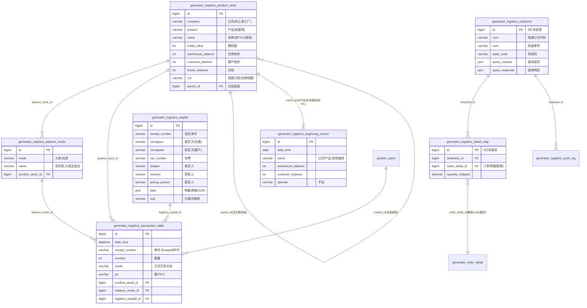

# 物流模块 · fuadmin 数据字典
> 域: 01-供应链域 | 表数: 11 | 用途: Agent基础文件 | 生成: 2026-07-23

# logistics-物流 · 模块概述

## 业务定位
物流模块是治通供应链域的成品流转执行模块，覆盖“成品台账 → 收发流水 → 送货单 → 客户签收”链路：对内管理成品/毛坯的仓库结余与客户结余（代管/寄售口径，`cut`=仓库结算），对外以送货单记录发货方（治通）→ 收货方（如烟台上汽、南昌麦格纳）的运输信息（车牌、发货人、收货人、扫描件）。与 warehouse 模块分工明确：warehouse 管采购件/原材料库存，logistics 管成品收发与客户结算库存。

## 上下游
- **上游**：`product_stock` 产品台账按“公司/产品/名称”三级建档（unique 三元组，期初 `Initial_value`），`balance_mode` 为每个台账配置收发方式（如 毛坯收入/成品发出）；`beginning_record`（3.3 万行）为期初/结余记录（推断含台账初始化与快照，语义待确认）。
- **下游**：收发流水 `transaction_table`（3.5 万行）以 `product_stock_id`/`balance_mode_id`/`logistics_waybill_id` 三个 FK 挂台账、方式与送货单；`po` 字段与 `detail_map.order_detail_id`（0 行未启用）指向订单域。

## 核心流程
建产品台账（期初值）→ 配置收发方式 → 期初录入 → 日常收发流水（数量 `number`、单号 `receipt_number`、方式名 `mode` 冗余文本）驱动台账 `warehouse_balance`/`customer_balance`/`frozen_balance` 增减 → 出库随附送货单 `waybill`（同 `receipt_number`，`data/columns` JSON 存明细表格，`img` 存扫描件）。另有 `shipment`（com+num 快递查询风格）、`push_log`、`detail_map` 三张 0 行表，为新一代快递跟踪/拆单映射结构，尚未启用（推断）；`_copy1` 三表为副本，查询勿双计。

# logistics-物流 · 上岗指南

## 2.1 核心实体表（TOP8）

| 表 | 一句话定义 |
|---|---|
| generator_logistics_product_stock | 产品台账（公司/产品/名称三级唯一，仓库结余+客户结余+冻结+期初值） |
| generator_logistics_transaction_table | 收发流水台账（3.5 万行，数量/单号/PO，挂台账/方式/送货单三 FK） |
| generator_logistics_waybill | 送货单（1.5 万行，发货方→收货方、车牌、明细 JSON、扫描件 img） |
| generator_logistics_balance_mode | 收发方式目录（mode=入库/出库，name=毛坯收入/成品发出，按台账配置） |
| generator_logistics_beginning_record | 期初/结余记录（3.3 万行，name 为“公司/产品/名称”路径，语义待确认） |
| generator_logistics_shipment | 快递发货跟踪（com+num 快递查询风格字段，0 行未启用） |
| generator_logistics_detail_map | 发货-订单明细映射（shipment_id+order_detail_id 唯一，0 行未启用） |
| generator_logistics_push_log | 快递查询推送日志（raw_payload/process_result，0 行未启用） |

## 2.2 核心业务流

1. 建产品台账 `product_stock`：`company`（如上海工厂）/`product`（如差壳）/`name`（如 TS11差壳）三级唯一（`unique_LogisticsProductStock`），`Initial_value` 录期初，`cut`=仓库结算，`is_active` 控制启用；`parent_id` 支持台账层级。
2. 配置收发方式 `balance_mode`：按台账（`product_stock_id`）定义入库/出库业务名（样本：毛坯收入=入库、成品发出=出库），`unique(product_stock_id,name)`。
3. 期初录入 `beginning_record`：`warehouse_balance`/`customer_balance`/`frozen_balance` 三口径，`operate`=手动，`name` 为“上海工厂/差壳/DCT380差壳”路径式文本。
4. 日常收发流水 `transaction_table`：`number`=数量、`receipt_number`=单号（如 20240512-TS11）、`mode`=方式名冗余文本（如“成品发出(出库)(仓库结算)”）、`po`=客户 PO；三个 FK（`product_stock_id`/`balance_mode_id`/`logistics_waybill_id`）落账，台账结余随之增减（样本可见 warehouse_balance=-178 的负结余）。
5. 出库开送货单 `waybill`：`receipt_number` 与流水一致，`consignor`（治通）→ `consignee`（烟台上汽/南昌麦格纳等客户），`car_number` 车牌、`shipper`/`receiver`/`pickup_person` 人名，`data`/`columns` JSON 存送货明细表格，`img` 存扫描件相对路径，`type`=出库、`variety`=产品。
6. （未启用新链路）`shipment` 按 com+num 跟踪快递、`push_log` 记录推送、`detail_map` 把发货拆到订单明细——三表 0 行，推断为下一代结构。

## 2.3 典型查询场景

**场景1：某产品台账当前结余**
```sql
SELECT company, product, name, warehouse_balance, customer_balance,
       frozen_balance, Initial_value, is_active
FROM generator_logistics_product_stock
WHERE company = '上海工厂' AND product = '差壳'
ORDER BY name;
```

**场景2：某台账时间段收发流水**
```sql
SELECT t.date_time, t.receipt_number, t.mode, t.number, t.po, t.table_remark
FROM generator_logistics_transaction_table t
WHERE t.product_stock_id = 7
  AND t.date_time BETWEEN '2024-05-01' AND '2024-05-31'
ORDER BY t.date_time;
```

**场景3：月度成品发出汇总（按收货客户）**
```sql
SELECT w.consignee, COUNT(DISTINCT w.receipt_number) AS waybill_cnt,
       SUM(t.number) AS ship_qty
FROM generator_logistics_transaction_table t
JOIN generator_logistics_waybill w ON w.id = t.logistics_waybill_id
WHERE t.mode LIKE '%发出%' AND t.date_time >= '2024-05-01'
GROUP BY w.consignee ORDER BY ship_qty DESC;
```

**场景4：送货单与流水对碰（单号一致性核查）**
```sql
SELECT w.receipt_number, w.consignee, w.car_number, w.receiver, COUNT(t.id) AS flow_cnt
FROM generator_logistics_waybill w
LEFT JOIN generator_logistics_transaction_table t
  ON t.logistics_waybill_id = w.id
WHERE w.type = '出库'
GROUP BY w.id, w.receipt_number, w.consignee, w.car_number, w.receiver
HAVING flow_cnt = 0;   -- 无流水的送货单
```

**场景5：负结余/异常结余预警**
```sql
SELECT company, product, name, warehouse_balance, customer_balance
FROM generator_logistics_product_stock
WHERE warehouse_balance < 0 OR customer_balance < 0
ORDER BY warehouse_balance;
```

**场景6：按车牌追溯发货记录**
```sql
SELECT receipt_number, date_time, consignor, consignee, shipper, receiver, car_number
FROM generator_logistics_waybill
WHERE car_number LIKE '%沪DL1161%'
ORDER BY date_time DESC;
```

**场景7：客户结余 vs 仓库结余（代管/寄售口径）**
```sql
SELECT name, warehouse_balance, customer_balance,
       warehouse_balance + customer_balance AS total_balance
FROM generator_logistics_product_stock
WHERE is_active = 1
ORDER BY total_balance DESC;
```

**场景8：收发方式使用分布**
```sql
SELECT b.mode, b.name AS mode_name, COUNT(t.id) AS flow_cnt, SUM(t.number) AS qty
FROM generator_logistics_balance_mode b
LEFT JOIN generator_logistics_transaction_table t ON t.balance_mode_id = b.id
GROUP BY b.mode, b.name
ORDER BY flow_cnt DESC;
```

## 2.4 避坑提示

- **三张 `_copy1` 副本表**：`product_stock_copy1`（81 行）、`transaction_table_copy1`（3.35 万行）、`waybill_copy1`（1.4 万行）与主表数据高度重叠（样本同 id 同内容），疑似迁移/改版备份——**统计报表严禁主副同查，会重复计数**，副本语义待确认。
- **三张 0 行新表**：`shipment`/`push_log`/`detail_map` 无数据。`shipment` 字段（com/num/state_code/to_text/query_request/query_response）是典型快递查询 API 风格（com=快递公司代码、num=快递单号），与 `waybill`（线下送货单）是两套发货跟踪体系，启用状态待确认。
- **`mode` 是冗余文本**：流水表 `mode`（如“成品发出(出库)(仓库结算)”）由 balance_mode 拼接冗余，规范关联必须走 `balance_mode_id` FK；按文本 LIKE 统计注意格式变动风险。
- **`remark` 非业务备注**：流水表 `remark` 是操作叙述长文本（“新增操作: 单号…人员:[22186 閤明勇] 出库…”），业务备注用 `table_remark`。
- **结余为 int**：`warehouse_balance`/`customer_balance`/`frozen_balance` 均为 int（件数口径），存在负值（样本 -178），勿假设非负；`Initial_value` 首字母大写是历史命名，SQL 注意大小写。
- **`beginning_record` 语义待确认**：3.3 万行对“期初”而言偏多，name 为“公司/产品/名称”路径式文本而非 FK，推断含期初初始化+周期性结余快照，统计前先与业务确认口径。
- **送货单明细在 JSON 里**：`waybill.data`/`columns` 存表格 JSON、`img` 存扫描件相对路径，均非关系化；要明细汇总需解析 JSON 或走流水表。
- **枚举待确认**：`waybill.type`（样本=出库）、`variety`（样本=产品）、`balance_mode.mode`（入库/出库）、`cut`（仓库结算）均无字典注释，对照 system_dict_item 确认。
- **与 warehouse 模块别混**：本模块 `code`（如 10411242）是产品编码口径，与 warehouse 的物料/库位体系不同源；两边“库存”口径不同（成品客户结算 vs 采购件现存量）。

## 3 数据字典

### generator_logistics_balance_mode（约 884 行）
业务定义: 收发方式目录（入库/出库×业务名），按产品台账配置 ｜ 表注释: -

| 字段 | 类型 | 可空 | 键 | 原始注释 | 推断语义 | 置信度 |
|---|---|---|---|---|---|---|
| id | bigint | N | PRI | - | 主键ID | high |
| remark | varchar(255) | Y | - | - | 备注 | high |
| modifier | varchar(255) | Y | - | - | 最后修改人姓名 | high |
| belong_dept | int | Y | - | - | 所属部门ID | mid |
| update_datetime | datetime(6) | Y | - | - | 最后更新时间 | high |
| create_datetime | datetime(6) | Y | - | - | 创建时间 | high |
| sort | int | Y | - | - | 排序号 | high |
| mode | varchar(10) | Y | - | - | 文本字段[推断-待确认] | low |
| name | varchar(60) | Y | - | - | 名称[推断] | high |
| creator_id | bigint | Y | MUL | - | 创建人ID → system_users.id | high |
| product_stock_id | bigint | Y | MUL | - | 关联ID → generator_logistics_product_stock.id[推断] | mid |

### generator_logistics_beginning_record（约 33491 行）
业务定义: 期初/结余记录（推断台账初始化与快照，语义待确认） ｜ 表注释: -

| 字段 | 类型 | 可空 | 键 | 原始注释 | 推断语义 | 置信度 |
|---|---|---|---|---|---|---|
| id | bigint | N | PRI | - | 主键ID | high |
| remark | varchar(255) | Y | - | - | 备注 | high |
| modifier | varchar(255) | Y | - | - | 最后修改人姓名 | high |
| belong_dept | int | Y | - | - | 所属部门ID | mid |
| update_datetime | datetime(6) | Y | - | - | 最后更新时间 | high |
| create_datetime | datetime(6) | Y | - | - | 创建时间 | high |
| sort | int | Y | - | - | 排序号 | high |
| date_time | date | Y | - | - | 时间[推断] | high |
| operate | varchar(20) | Y | - | - | 比率/百分比[推断] | high |
| frozen_balance | int | Y | - | - | 数值字段[推断-待确认] | low |
| customer_balance | int | Y | - | - | 客户[推断] | high |
| warehouse_balance | int | Y | - | - | 仓库[推断] | mid |
| type | varchar(30) | Y | - | - | 类型[推断] | mid |
| name | varchar(255) | Y | - | - | 名称[推断] | high |
| creator_id | bigint | Y | MUL | - | 创建人ID → system_users.id | high |
| code | varchar(255) | Y | - | - | 编号/代码[推断] | mid |

### generator_logistics_detail_map（约 0 行）
业务定义: 发货-订单明细映射（0行，新结构未启用） ｜ 表注释: -

| 字段 | 类型 | 可空 | 键 | 原始注释 | 推断语义 | 置信度 |
|---|---|---|---|---|---|---|
| id | bigint | N | PRI | - | 主键ID | high |
| remark | varchar(255) | Y | - | - | 备注 | high |
| modifier | varchar(255) | Y | - | - | 最后修改人姓名 | high |
| belong_dept | int | Y | - | - | 所属部门ID | mid |
| update_datetime | datetime(6) | Y | - | - | 最后更新时间 | high |
| create_datetime | datetime(6) | Y | - | - | 创建时间 | high |
| sort | int | Y | - | - | 排序号 | high |
| quantity_shipped | decimal(13,2) | Y | - | - | 数值（小数）[推断-待确认] | low |
| unit | varchar(10) | Y | - | - | 计量单位[推断] | high |
| creator_id | bigint | Y | MUL | - | 创建人ID → system_users.id | high |
| order_detail_id | bigint | Y | MUL | - | 关联ID → generator_purchase_order_detail.id[推断] | mid |
| shipment_id | bigint | Y | MUL | - | 关联ID → generator_logistics_shipment.id[推断] | mid |

### generator_logistics_product_stock（约 82 行）
业务定义: 产品台账：公司/产品/名称三级，仓库+客户+冻结结余 ｜ 表注释: -

| 字段 | 类型 | 可空 | 键 | 原始注释 | 推断语义 | 置信度 |
|---|---|---|---|---|---|---|
| id | bigint | N | PRI | - | 主键ID | high |
| remark | varchar(255) | Y | - | - | 备注 | high |
| modifier | varchar(255) | Y | - | - | 最后修改人姓名 | high |
| belong_dept | int | Y | - | - | 所属部门ID | mid |
| update_datetime | datetime(6) | Y | - | - | 最后更新时间 | high |
| create_datetime | datetime(6) | Y | - | - | 创建时间 | high |
| sort | int | Y | - | - | 排序号 | high |
| cut | varchar(10) | Y | - | - | 文本字段[推断-待确认] | low |
| customer_balance | int | Y | - | - | 客户[推断] | high |
| warehouse_balance | int | Y | - | - | 仓库[推断] | mid |
| name | varchar(100) | Y | - | - | 名称[推断] | high |
| product | varchar(100) | Y | - | - | 产品[推断] | high |
| company | varchar(100) | Y | MUL | - | 文本字段[推断-待确认] | low |
| creator_id | bigint | Y | MUL | - | 创建人ID → system_users.id | high |
| is_active | tinyint(1) | N | - | - | 标志位（布尔）[推断] | mid |
| frozen_balance | int | Y | - | - | 数值字段[推断-待确认] | low |
| code | varchar(255) | Y | - | - | 编号/代码[推断] | mid |
| customer_name | varchar(100) | Y | - | - | 名称[推断] | high |
| report_format | json | Y | - | - | 待确认 | low |
| Initial_value | int | N | - | - | 数值字段[推断-待确认] | low |
| parent_id | bigint | Y | MUL | - | 关联ID（目标表待确认）[推断] | low |

### generator_logistics_product_stock_copy1（约 81 行）
业务定义: 产品台账副本表，与主表重叠勿双计 ｜ 表注释: -

| 字段 | 类型 | 可空 | 键 | 原始注释 | 推断语义 | 置信度 |
|---|---|---|---|---|---|---|
| id | bigint | N | PRI | - | 主键ID | high |
| remark | varchar(255) | Y | - | - | 备注 | high |
| modifier | varchar(255) | Y | - | - | 最后修改人姓名 | high |
| belong_dept | int | Y | - | - | 所属部门ID | mid |
| update_datetime | datetime(6) | Y | - | - | 最后更新时间 | high |
| create_datetime | datetime(6) | Y | - | - | 创建时间 | high |
| sort | int | Y | - | - | 排序号 | high |
| cut | varchar(10) | Y | - | - | 文本字段[推断-待确认] | low |
| customer_balance | int | Y | - | - | 客户[推断] | high |
| warehouse_balance | int | Y | - | - | 仓库[推断] | mid |
| name | varchar(100) | Y | - | - | 名称[推断] | high |
| product | varchar(100) | Y | - | - | 产品[推断] | high |
| company | varchar(100) | Y | MUL | - | 文本字段[推断-待确认] | low |
| creator_id | bigint | Y | MUL | - | 创建人ID → system_users.id | high |
| is_active | tinyint(1) | N | - | - | 标志位（布尔）[推断] | mid |
| frozen_balance | int | Y | - | - | 数值字段[推断-待确认] | low |
| code | varchar(255) | Y | - | - | 编号/代码[推断] | mid |
| customer_name | varchar(100) | Y | - | - | 名称[推断] | high |
| report_format | json | Y | - | - | 待确认 | low |
| Initial_value | int | N | - | - | 数值字段[推断-待确认] | low |
| parent_id | bigint | Y | MUL | - | 关联ID（目标表待确认）[推断] | low |

### generator_logistics_push_log（约 0 行）
业务定义: 快递查询推送日志（0行，未启用） ｜ 表注释: -

| 字段 | 类型 | 可空 | 键 | 原始注释 | 推断语义 | 置信度 |
|---|---|---|---|---|---|---|
| id | bigint | N | PRI | - | 主键ID | high |
| remark | varchar(255) | Y | - | - | 备注 | high |
| modifier | varchar(255) | Y | - | - | 最后修改人姓名 | high |
| belong_dept | int | Y | - | - | 所属部门ID | mid |
| update_datetime | datetime(6) | Y | - | - | 最后更新时间 | high |
| create_datetime | datetime(6) | Y | - | - | 创建时间 | high |
| sort | int | Y | - | - | 排序号 | high |
| status | varchar(20) | Y | - | - | 状态（枚举值待确认）[推断] | mid |
| raw_payload | json | Y | - | - | 待确认 | low |
| process_result | varchar(255) | Y | - | - | 工序[推断] | mid |
| creator_id | bigint | Y | MUL | - | 创建人ID → system_users.id | high |
| shipment_id | bigint | Y | MUL | - | 关联ID → generator_logistics_shipment.id[推断] | mid |

### generator_logistics_shipment（约 0 行）
业务定义: 快递发货跟踪（com+num快递查询风格，0行未启用） ｜ 表注释: -

| 字段 | 类型 | 可空 | 键 | 原始注释 | 推断语义 | 置信度 |
|---|---|---|---|---|---|---|
| id | bigint | N | PRI | - | 主键ID | high |
| remark | varchar(255) | Y | - | - | 备注 | high |
| modifier | varchar(255) | Y | - | - | 最后修改人姓名 | high |
| belong_dept | int | Y | - | - | 所属部门ID | mid |
| update_datetime | datetime(6) | Y | - | - | 最后更新时间 | high |
| create_datetime | datetime(6) | Y | - | - | 创建时间 | high |
| sort | int | Y | - | - | 排序号 | high |
| number | varchar(50) | Y | - | - | 编号/代码[推断] | mid |
| expected_arrival_dt | date | Y | - | - | 日期时间[推断] | mid |
| query_response | json | Y | - | - | 待确认 | low |
| query_request | json | Y | - | - | 待确认 | low |
| delivery_man_phone | varchar(100) | Y | - | - | 联系电话[推断] | high |
| delivery_man_name | varchar(20) | Y | - | - | 名称[推断] | high |
| pickup_man_phone | varchar(100) | Y | - | - | 联系电话[推断] | high |
| pickup_man_name | varchar(20) | Y | - | - | 名称[推断] | high |
| state_code | varchar(8) | Y | MUL | - | 编号/代码[推断] | mid |
| to_text | varchar(150) | Y | - | - | 文本字段[推断-待确认] | low |
| phone | varchar(20) | Y | - | - | 联系电话[推断] | high |
| num | varchar(50) | Y | - | - | 文本字段[推断-待确认] | low |
| com | varchar(50) | Y | MUL | - | 文本字段[推断-待确认] | low |
| creator_id | bigint | Y | MUL | - | 创建人ID → system_users.id | high |

### generator_logistics_transaction_table（约 35471 行）
业务定义: 收发流水台账（3.5万行），挂台账/方式/送货单三FK ｜ 表注释: -

| 字段 | 类型 | 可空 | 键 | 原始注释 | 推断语义 | 置信度 |
|---|---|---|---|---|---|---|
| id | bigint | N | PRI | - | 主键ID | high |
| remark | longtext | Y | - | - | 备注 | high |
| modifier | varchar(255) | Y | - | - | 最后修改人姓名 | high |
| belong_dept | int | Y | - | - | 所属部门ID | mid |
| update_datetime | datetime(6) | Y | - | - | 最后更新时间 | high |
| create_datetime | datetime(6) | Y | - | - | 创建时间 | high |
| sort | int | Y | - | - | 排序号 | high |
| date_time | datetime(6) | Y | - | - | 时间[推断] | high |
| receipt_number | varchar(255) | Y | - | - | 编号/代码[推断] | mid |
| number | int | Y | - | - | 编号/代码[推断] | mid |
| mode | varchar(80) | Y | - | - | 文本字段[推断-待确认] | low |
| name | varchar(80) | Y | - | - | 名称[推断] | high |
| product | varchar(80) | Y | - | - | 产品[推断] | high |
| company | varchar(80) | Y | - | - | 文本字段[推断-待确认] | low |
| creator_id | bigint | Y | MUL | - | 创建人ID → system_users.id | high |
| product_stock_id | bigint | Y | MUL | - | 关联ID → generator_logistics_product_stock.id[推断] | mid |
| po | varchar(255) | Y | - | - | 文本字段[推断-待确认] | low |
| logistics_waybill_id | bigint | Y | MUL | - | 关联ID → generator_logistics_waybill.id[推断] | mid |
| code | varchar(255) | Y | - | - | 编号/代码[推断] | mid |
| balance_mode_id | bigint | Y | MUL | - | 关联ID → generator_logistics_balance_mode.id[推断] | mid |
| table_remark | varchar(255) | Y | - | - | 文本字段[推断-待确认] | low |

### generator_logistics_transaction_table_copy1（约 33529 行）
业务定义: 收发流水副本表，与主表重叠勿双计 ｜ 表注释: -

| 字段 | 类型 | 可空 | 键 | 原始注释 | 推断语义 | 置信度 |
|---|---|---|---|---|---|---|
| id | bigint | N | PRI | - | 主键ID | high |
| remark | longtext | Y | - | - | 备注 | high |
| modifier | varchar(255) | Y | - | - | 最后修改人姓名 | high |
| belong_dept | int | Y | - | - | 所属部门ID | mid |
| update_datetime | datetime(6) | Y | - | - | 最后更新时间 | high |
| create_datetime | datetime(6) | Y | - | - | 创建时间 | high |
| sort | int | Y | - | - | 排序号 | high |
| date_time | datetime(6) | Y | - | - | 时间[推断] | high |
| receipt_number | varchar(255) | Y | - | - | 编号/代码[推断] | mid |
| number | int | Y | - | - | 编号/代码[推断] | mid |
| mode | varchar(80) | Y | - | - | 文本字段[推断-待确认] | low |
| name | varchar(80) | Y | - | - | 名称[推断] | high |
| product | varchar(80) | Y | - | - | 产品[推断] | high |
| company | varchar(80) | Y | - | - | 文本字段[推断-待确认] | low |
| creator_id | bigint | Y | MUL | - | 创建人ID → system_users.id | high |
| product_stock_id | bigint | Y | MUL | - | 关联ID → generator_logistics_product_stock.id[推断] | mid |
| po | varchar(255) | Y | - | - | 文本字段[推断-待确认] | low |
| logistics_waybill_id | bigint | Y | MUL | - | 关联ID → generator_logistics_waybill.id[推断] | mid |
| code | varchar(255) | Y | - | - | 编号/代码[推断] | mid |
| balance_mode_id | bigint | Y | MUL | - | 关联ID → generator_logistics_balance_mode.id[推断] | mid |
| table_remark | varchar(255) | Y | - | - | 文本字段[推断-待确认] | low |

### generator_logistics_waybill（约 15347 行）
业务定义: 送货单（1.5万行）：收发双方/车牌/明细JSON/扫描件 ｜ 表注释: -

| 字段 | 类型 | 可空 | 键 | 原始注释 | 推断语义 | 置信度 |
|---|---|---|---|---|---|---|
| id | bigint | N | PRI | - | 主键ID | high |
| remark | varchar(255) | Y | - | - | 备注 | high |
| modifier | varchar(255) | Y | - | - | 最后修改人姓名 | high |
| belong_dept | int | Y | - | - | 所属部门ID | mid |
| update_datetime | datetime(6) | Y | - | - | 最后更新时间 | high |
| create_datetime | datetime(6) | Y | - | - | 创建时间 | high |
| sort | int | Y | - | - | 排序号 | high |
| data | json | Y | - | - | 待确认 | low |
| columns | json | Y | - | - | 待确认 | low |
| date_time | datetime(6) | Y | - | - | 时间[推断] | high |
| img | varchar(255) | Y | - | - | 文本字段[推断-待确认] | low |
| receiver | varchar(80) | Y | - | - | 文本字段[推断-待确认] | low |
| pickup_person | varchar(80) | Y | - | - | 文本字段[推断-待确认] | low |
| shipper | varchar(80) | Y | - | - | 文本字段[推断-待确认] | low |
| car_number | varchar(80) | Y | - | - | 编号/代码[推断] | mid |
| consignor | varchar(100) | Y | - | - | 文本字段[推断-待确认] | low |
| consignee | varchar(100) | Y | - | - | 文本字段[推断-待确认] | low |
| receipt_number | varchar(30) | Y | - | - | 编号/代码[推断] | mid |
| variety | varchar(10) | Y | - | - | 文本字段[推断-待确认] | low |
| type | varchar(10) | Y | - | - | 类型[推断] | mid |
| creator_id | bigint | Y | MUL | - | 创建人ID → system_users.id | high |

### generator_logistics_waybill_copy1（约 13963 行）
业务定义: 送货单副本表，与主表重叠勿双计 ｜ 表注释: -

| 字段 | 类型 | 可空 | 键 | 原始注释 | 推断语义 | 置信度 |
|---|---|---|---|---|---|---|
| id | bigint | N | PRI | - | 主键ID | high |
| remark | varchar(255) | Y | - | - | 备注 | high |
| modifier | varchar(255) | Y | - | - | 最后修改人姓名 | high |
| belong_dept | int | Y | - | - | 所属部门ID | mid |
| update_datetime | datetime(6) | Y | - | - | 最后更新时间 | high |
| create_datetime | datetime(6) | Y | - | - | 创建时间 | high |
| sort | int | Y | - | - | 排序号 | high |
| data | json | Y | - | - | 待确认 | low |
| columns | json | Y | - | - | 待确认 | low |
| date_time | datetime(6) | Y | - | - | 时间[推断] | high |
| img | varchar(255) | Y | - | - | 文本字段[推断-待确认] | low |
| receiver | varchar(80) | Y | - | - | 文本字段[推断-待确认] | low |
| pickup_person | varchar(80) | Y | - | - | 文本字段[推断-待确认] | low |
| shipper | varchar(80) | Y | - | - | 文本字段[推断-待确认] | low |
| car_number | varchar(80) | Y | - | - | 编号/代码[推断] | mid |
| consignor | varchar(100) | Y | - | - | 文本字段[推断-待确认] | low |
| consignee | varchar(100) | Y | - | - | 文本字段[推断-待确认] | low |
| receipt_number | varchar(30) | Y | - | - | 编号/代码[推断] | mid |
| variety | varchar(10) | Y | - | - | 文本字段[推断-待确认] | low |
| type | varchar(10) | Y | - | - | 类型[推断] | mid |
| creator_id | bigint | Y | MUL | - | 创建人ID → system_users.id | high |

# logistics-物流 · ER 关系图

聚焦主流程核心实体；三张 `_copy1` 副本表不进图（与主表同构，数据重叠）。跨模块实体用括号标注所属模块。注意：本模块**没有独立的车辆/司机/签收人实体**——车牌、发货人、收货人、提货人均为 `waybill` 的文本字段；`shipment`（0 行）才是新一代快递跟踪实体。



## 关系说明与置信度

- **索引佐证（高置信，Django 自动 FK 索引）**：`transaction_table.product_stock_id → product_stock.id`；`transaction_table.balance_mode_id → balance_mode.id`；`transaction_table.logistics_waybill_id → waybill.id`；`balance_mode.product_stock_id → product_stock.id`；`detail_map.shipment_id → shipment.id`（另有 unique `uq_detail_map_ship_order(shipment_id,order_detail_id)`）；`push_log.shipment_id → shipment.id`；`product_stock.parent_id → product_stock.id`（自关联层级）。
- **样本佐证（高置信，非 FK）**：`transaction_table.receipt_number = waybill.receipt_number`（样本同号 20240512-TS11、2013062405007），送货单与流水按单号冗余双挂；`transaction_table.mode` 为 balance_mode 拼接冗余文本（“成品发出(出库)(仓库结算)”）。
- **命名+样本路径推断（中置信）**：`beginning_record.name`（“上海工厂/差壳/DCT380差壳”）= `product_stock.company/product/name` 三级路径拼接，无 FK 纯文本关联；该表 3.3 万行对“期初”偏多，推断含期初初始化+周期快照（语义待确认）。
- **低置信推断（待确认）**：`detail_map.order_detail_id → order（订单）模块订单明细表.id`（命名推断，且 detail_map/shipment/push_log 均 0 行未启用，目标表名待确认）。
- **车辆/司机/签收不是实体**：`car_number`（沪DL1161）、`shipper`（陈建）、`receiver`（丁红）、`pickup_person` 均为 waybill 文本列，人员未与 system_users 关联（含外部司机/客户签收人，勿强行 join）。
- **creator_id**：全部 11 表按框架惯例指向 system_users.id；`modifier` 为姓名文本（样本：閤明勇）。

# logistics-物流 · 跨模块接口表

| 本模块表.字段 | → 目标模块.表.字段 | 依据 | 置信度 |
|---|---|---|---|
| transaction_table.po | → order（订单）域 客户PO/订单号字段 | 字段语义=客户PO，上岗指南已标注指向订单域 | 中（目标表.字段待确认） |
| detail_map.order_detail_id | → order（订单）域 订单明细表.id（表名待确认） | 命名推断 + uq_detail_map_ship_order 唯一约束 | 中（0行未启用，待确认） |
| product_stock.code / transaction_table.code | → product（产品）域 产品主数据编码 | 样本 10411242 为产品编码风格 | 低（目标表待确认） |
| waybill.consignee | → customer（客户）域 客户主数据名称 | 样本=烟台上汽/南昌麦格纳，纯文本无FK | 中（文本对碰） |
| product_stock.customer_name | → customer（客户）域 客户主数据名称 | 字段语义=客户名，纯文本 | 低（待确认） |
| waybill.shipper / receiver / pickup_person | → （无固定目标）人名文本 | 样本=陈建/丁红/苏海秀，含外部司机与客户签收人 | 低（勿强行关联 system_users） |
| 所有表.creator_id | → system（用户权限）.system_users.id | 框架惯例 + creator_id 索引 | 高 |
| 所有表.modifier | → system.system_users.name（文本） | 样本=閤明勇，姓名字段非FK | 中 |
| transaction_table.remark 内嵌工号 | → system.system_users（工号前缀，如“22186 閤明勇”） | 操作叙述长文本中“人员:[工号 姓名]”格式 | 低（需正则截取） |
| beginning_record.name | → 本模块 product_stock.company/product/name（内部路径拼接，非跨模块） | 样本“上海工厂/差壳/DCT380差壳” | 中 |
| transaction_table.receipt_number | → 本模块 waybill.receipt_number（内部按号关联，非跨模块） | 样本同号 20240512-TS11；另有 waybill_id FK 双挂 | 高 |
| waybill.img | → 静态文件存储（/static/YYYYMMDD/...） | 样本为相对路径，签收扫描件 | 高（文件引用，非表关联） |
| shipment.com / num | → 外部快递查询 API（第三方服务） | com=快递公司代码、num=单号，快递鸟风格字段 | 中（0行未启用） |

## 说明

- **已证实外键**：本模块对外的显式 FK 为 0；全部跨模块关联均基于命名/样本/框架惯例推断。模块内三 FK（product_stock_id/balance_mode_id/logistics_waybill_id）见 04-ER.md。
- **订单域方向最实**：`po`（文本）与 `detail_map.order_detail_id`（FK 风格，0 行）两代结构都指向订单域——现役链路靠 po 文本，新链路（shipment→detail_map→order_detail）尚未启用。
- **客户域仅文本对碰**：waybill.consignee、product_stock.customer_name 都是纯文本，客户主数据在 customer 模块，join 需按名称匹配（注意简称/全称差异）。
- **与 warehouse 模块边界**：本模块 code 是产品编码口径（成品），warehouse 是采购件/原材料口径，两边“库存”语义不同源，勿跨模块直接对账。
- **枚举依赖**：waybill.type（出库）、variety（产品）、balance_mode.mode（入库/出库）、product_stock.cut（仓库结算）预计定义在 system 模块 system_dict/system_dict_item，取值待确认。
- **副本表警示**：三张 `_copy1` 与主表高度重叠，任何跨模块对碰统计都须先排除副本，避免重复计数。

## 6 字段备注改进建议

（本模块为小型/过渡性模块，业务语义与归属建议见同域《零散模块总览》或域内相关主模块文档）

## 相关页面
- [[fuadmin数据字典总览]]
- [[仓储模块-fuadmin数据字典]]
- [[付款模块-fuadmin数据字典]]
- [[供应商模块-fuadmin数据字典]]
- [[结算模块-fuadmin数据字典]]
- [[订单模块-fuadmin数据字典]]
- [[退货模块-fuadmin数据字典]]
- [[采购模块-fuadmin数据字典]]
