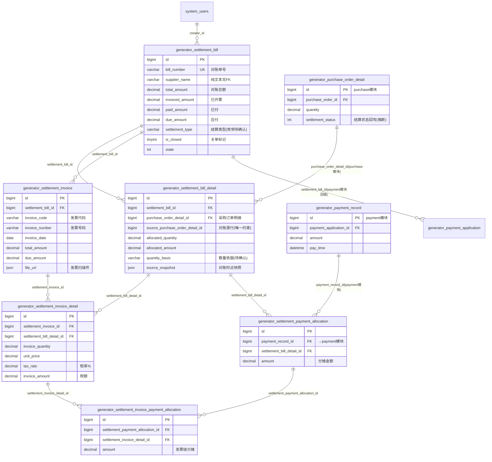

# 结算模块 · fuadmin 数据字典
> 域: 01-供应链域 | 表数: 24 | 用途: Agent基础文件 | 生成: 2026-07-23

# settlement-结算 · 模块概述

## 业务定位
结算模块是治通供应链域的"对账—开票—应付—付款"衔接中枢：以采购订单明细为源头生成结算单（对账单），登记供应商发票，再通过两级分摊把付款记录核销到结算明细行，形成应付账款闭环。全部 24 张表均为 6 组逻辑实体 × 4 站点分表（无后缀=治通现役、`_gh`=广汇、`_tf`=TF铸造、`_zt`=治通同构分表），且当前全模块 0 行——属已建成未启用的新功能，结构即最新设计意图。

## 上下游
- **上游**：purchase 采购模块——结算明细 `purchase_order_detail_id`/`source_purchase_order_detail_id` 直挂采购订单明细行，`source_snapshot` JSON 留存对账时点快照，`quantity_basis` 记录结算数量依据（按订单数/按入库数等待确认）。
- **下游**：payment 付款模块——付款申请表 `generator_payment_application.settlement_bill_id` 回链结算单头（已证实），付款记录 `payment_record` 经 `settlement_payment_allocation` 分摊到结算明细行，再经 `settlement_invoice_payment_allocation` 细分到发票明细行，实现"一笔付款→多张发票→多行明细"的逐级核销。

## 核心流程
采购到货对账 → 创建结算单头（`bill_number` 唯一、供应商、四项金额：总额/已开票/已付/应付）+ 结算明细（按采购订单明细行分摊数量金额）→ 供应商开票登记 `settlement_invoice`（发票代码/号码/日期/附件）+ 发票明细（数量、单价、税率、税额，回链结算明细）→ 付款申请（payment 模块，关联结算单）→ 付款记录生成 `payment_allocation`（按结算明细分摊）→ `invoice_payment_allocation` 再分摊到发票明细行 → 单头 `invoiced_amount`/`paid_amount`/`due_amount` 滚动回写，`is_closed` 关单结清。

# settlement-结算 · 上岗指南

## 2.1 核心实体表（TOP8）

| 表 | 一句话定义 |
|---|---|
| generator_settlement_bill | 结算单（对账单）头：bill_number 唯一、供应商、总额/已开票/已付/应付四项金额、关单标记 |
| generator_settlement_bill_detail | 结算单明细：按采购订单明细行分摊数量与金额，source_snapshot 存对账时点快照 |
| generator_settlement_invoice | 发票登记头：发票代码/号码/开票日期/金额/附件，挂结算单 |
| generator_settlement_invoice_detail | 发票明细：开票数量、单价、税率、税额，回链结算明细行 |
| generator_settlement_payment_allocation | 付款分摊：payment_record 一笔付款按结算明细行拆账 |
| generator_settlement_invoice_payment_allocation | 发票级付款分摊：把付款分摊再细分到发票明细行 |
| generator_settlement_bill_gh / _tf / _zt | 广汇/TF铸造/治通同构站点结算单分表（结构同主表） |
| generator_settlement_invoice_gh / _tf / _zt | 三站点发票登记分表（结构同主表） |

> 说明：24 表 = 6 组逻辑实体 × 4 站点分表；全模块当前 0 行（未启用），字段即最新设计，枚举取值待代码/字典确认。

## 2.2 核心业务流

1. **对账**：采购到货后按供应商创建 `settlement_bill`（单头：供应商、`total_amount`）+ `settlement_bill_detail`（每行挂 `purchase_order_detail_id`，`allocated_quantity`/`allocated_amount` 为本次结算数量金额，`quantity_basis` 记数量依据，`source_snapshot` JSON 冻结对账时点数据，防源单改数）。唯一约束 `uniq_settle_bill_source_detail` 保证同一结算单内同一采购明细行不重复对账。
2. **开票**：供应商发票登记到 `settlement_invoice`（`invoice_code`+`invoice_number`、`invoice_date`、`file_url` JSON 附件），发票明细 `settlement_invoice_detail` 按结算明细行开票（`invoice_quantity`/`unit_price`/`tax_rate`/`invoice_amount`），`uniq_settle_invoice_detail` 防重。单头 `invoiced_amount` 累计已开票。
3. **应付**：单头 `due_amount`（应付）与 `invoiced_amount` 对照，形成对供应商的应付账款视图。
4. **付款衔接**：payment 模块 `payment_application.settlement_bill_id` 回链结算单发起付款申请；实付后 `payment_record` 经 `settlement_payment_allocation`（唯一约束 payment_record+结算明细行）分摊到结算明细；再经 `settlement_invoice_payment_allocation` 细分到发票明细行，支撑按发票核销。
5. **结清**：`paid_amount` 滚动累计，`paid_amount=due_amount` 后 `is_closed=1` 关单（推断）。

## 2.3 典型查询场景

**场景1：某供应商应付账款总览**
```sql
SELECT bill_number, supplier_name, total_amount, invoiced_amount,
       paid_amount, due_amount, is_closed, state
FROM generator_settlement_bill
WHERE supplier_name LIKE '%凯央%' AND is_closed = 0
ORDER BY create_datetime DESC;
```

**场景2：结算单全貌（头+明细+溯源采购订单行）**
```sql
SELECT b.bill_number, d.allocated_quantity, d.allocated_amount, d.quantity_basis,
       d.purchase_order_detail_id, d.source_snapshot
FROM generator_settlement_bill b
JOIN generator_settlement_bill_detail d ON d.settlement_bill_id = b.id
WHERE b.bill_number = 'JS202607010001';  -- 单号前缀规则待确认
```

**场景3：发票核销进度（结算单→发票→发票明细）**
```sql
SELECT i.invoice_number, i.invoice_date, i.total_amount,
       idt.invoice_quantity, idt.unit_price, idt.tax_rate, idt.invoice_amount
FROM generator_settlement_invoice i
JOIN generator_settlement_invoice_detail idt ON idt.settlement_invoice_id = i.id
WHERE i.settlement_bill_id = 1001;
```

**场景4：一笔付款核销到了哪些结算明细行**
```sql
SELECT pa.payment_record_id, pa.amount, pa.settlement_bill_detail_id
FROM generator_settlement_payment_allocation pa
WHERE pa.payment_record_id = 262;
```

**场景5：发票级付款分摊（按发票追已付/未付）**
```sql
SELECT idt.settlement_invoice_id, idt.id AS invoice_detail_id,
       idt.invoice_amount, IFNULL(SUM(ipa.amount),0) AS paid_alloc
FROM generator_settlement_invoice_detail idt
LEFT JOIN generator_settlement_invoice_payment_allocation ipa
       ON ipa.settlement_invoice_detail_id = idt.id
GROUP BY idt.id
HAVING paid_alloc < idt.invoice_amount;
```

**场景6：逾期未关单结算单（账龄粗查）**
```sql
SELECT supplier_name, bill_number, due_amount, paid_amount,
       DATEDIFF(NOW(), create_datetime) AS age_days
FROM generator_settlement_bill
WHERE is_closed = 0 AND due_amount > IFNULL(paid_amount,0)
ORDER BY age_days DESC;
```

**场景7：跨站点合并应付（UNION 分表）**
```sql
SELECT '治通' site, SUM(due_amount) due, SUM(paid_amount) paid FROM generator_settlement_bill
UNION ALL SELECT '广汇', SUM(due_amount), SUM(paid_amount) FROM generator_settlement_bill_gh
UNION ALL SELECT 'TF铸造', SUM(due_amount), SUM(paid_amount) FROM generator_settlement_bill_tf
UNION ALL SELECT '治通分表', SUM(due_amount), SUM(paid_amount) FROM generator_settlement_bill_zt;
```

## 2.4 避坑提示

- **站点分表**：6 组实体各有 `_gh`(广汇)/`_tf`(TF铸造/泰峰)/`_zt`(治通同构) 三张分表，结构与主表完全一致；跨站点统计必须 UNION，**禁止**只查主表当全量。`_zt` 在其他模块多为老数据/空表，启用状态待确认。
- **全模块 0 行**：当前 24 表均无数据，所有状态枚举（`state`、`settlement_type`、`quantity_basis`、发票 `state`）**取值无样本**，上线前必须对照 `system_dict_item` 或后端代码确认；`bill_number` 单号前缀规则同样待确认。
- **双重 ID 易混**：明细表 `purchase_order_detail_id`（挂采购订单明细，带索引）与 `source_purchase_order_detail_id`（对账源行，进唯一约束）并存，语义差别细微（推断前者为当前有效行、后者为对账时点原始行），写 SQL 前确认代码实际赋值。
- **snapshot 是 JSON 冻结**：`source_snapshot` 存对账时点采购行快照，对账金额应以结算明细 `allocated_amount` 为准，**不要**回查采购表现值对账（源单可能已改）。
- **两级分摊勿跳级**：核销链条为 `payment_record → payment_allocation(按结算明细) → invoice_payment_allocation(按发票明细)`；统计"某发票已付多少"必须走第二级，直接 SUM 第一级会按结算明细口径虚高/错配。
- **唯一约束即业务规则**：`uniq_settle_bill_source_detail`、`uniq_settle_invoice_detail`、`uniq_settle_payment_detail`、`uniq_settle_invoice_payment_detail` 四组唯一约束保证一行源单只对一次账、一行明细只开一次票、一笔付款一行只摊一次——写数仓同步时需按此做幂等。
- **金额口径**：单头四项金额（total/invoiced/paid/due）为冗余汇总，与明细行求和可能因四舍五入有尾差；报表以单头字段为准、明细用于钻取（推断，待代码确认回写时机）。

## 3 数据字典

### generator_settlement_bill（约 0 行）
业务定义: 结算单头（治通现役）：对账单号、供应商、总额/已开票/已付/应付、关单标记 ｜ 表注释: -

| 字段 | 类型 | 可空 | 键 | 原始注释 | 推断语义 | 置信度 |
|---|---|---|---|---|---|---|
| id | bigint | N | PRI | - | 主键ID | high |
| remark | varchar(255) | Y | - | - | 备注 | high |
| modifier | varchar(255) | Y | - | - | 最后修改人姓名 | high |
| belong_dept | int | Y | - | - | 所属部门ID | mid |
| update_datetime | datetime(6) | Y | - | - | 最后更新时间 | high |
| create_datetime | datetime(6) | Y | - | - | 创建时间 | high |
| sort | int | Y | - | - | 排序号 | high |
| bill_number | varchar(50) | Y | UNI | - | 编号/代码[推断] | mid |
| supplier_name | varchar(50) | Y | - | - | 名称[推断] | high |
| total_amount | decimal(13,2) | Y | - | - | 金额[推断] | high |
| invoiced_amount | decimal(13,2) | Y | - | - | 金额[推断] | high |
| paid_amount | decimal(13,2) | Y | - | - | 金额[推断] | high |
| due_amount | decimal(13,2) | Y | - | - | 金额[推断] | high |
| settlement_type | varchar(30) | Y | - | - | 类型[推断] | mid |
| state | int | Y | - | - | 状态（枚举值待确认）[推断] | mid |
| is_closed | tinyint(1) | N | - | - | 标志位（布尔）[推断] | mid |
| creator_id | bigint | Y | MUL | - | 创建人ID → system_users.id | high |

### generator_settlement_bill_detail（约 0 行）
业务定义: 结算单明细：按采购订单明细行分摊结算数量/金额，含对账时点快照 ｜ 表注释: -

| 字段 | 类型 | 可空 | 键 | 原始注释 | 推断语义 | 置信度 |
|---|---|---|---|---|---|---|
| id | bigint | N | PRI | - | 主键ID | high |
| remark | varchar(255) | Y | - | - | 备注 | high |
| modifier | varchar(255) | Y | - | - | 最后修改人姓名 | high |
| belong_dept | int | Y | - | - | 所属部门ID | mid |
| update_datetime | datetime(6) | Y | - | - | 最后更新时间 | high |
| create_datetime | datetime(6) | Y | - | - | 创建时间 | high |
| sort | int | Y | - | - | 排序号 | high |
| source_purchase_order_detail_id | bigint | Y | - | - | 关联ID（目标表待确认）[推断] | low |
| allocated_quantity | decimal(13,2) | Y | - | - | 数量[推断] | high |
| allocated_amount | decimal(13,2) | Y | - | - | 金额[推断] | high |
| quantity_basis | varchar(30) | Y | - | - | 文本字段[推断-待确认] | low |
| source_snapshot | json | Y | - | - | 待确认 | low |
| creator_id | bigint | Y | MUL | - | 创建人ID → system_users.id | high |
| purchase_order_detail_id | bigint | Y | MUL | - | 关联ID → generator_purchase_order_detail.id[推断] | mid |
| settlement_bill_id | bigint | Y | MUL | - | 关联ID → generator_settlement_bill.id[推断] | mid |

### generator_settlement_bill_detail_gh（约 0 行）
业务定义: 广汇站点结算单明细分表，结构同主明细表 ｜ 表注释: -

| 字段 | 类型 | 可空 | 键 | 原始注释 | 推断语义 | 置信度 |
|---|---|---|---|---|---|---|
| id | bigint | N | PRI | - | 主键ID | high |
| remark | varchar(255) | Y | - | - | 备注 | high |
| modifier | varchar(255) | Y | - | - | 最后修改人姓名 | high |
| belong_dept | int | Y | - | - | 所属部门ID | mid |
| update_datetime | datetime(6) | Y | - | - | 最后更新时间 | high |
| create_datetime | datetime(6) | Y | - | - | 创建时间 | high |
| sort | int | Y | - | - | 排序号 | high |
| source_purchase_order_detail_id | bigint | Y | - | - | 关联ID（目标表待确认）[推断] | low |
| allocated_quantity | decimal(13,2) | Y | - | - | 数量[推断] | high |
| allocated_amount | decimal(13,2) | Y | - | - | 金额[推断] | high |
| quantity_basis | varchar(30) | Y | - | - | 文本字段[推断-待确认] | low |
| source_snapshot | json | Y | - | - | 待确认 | low |
| creator_id | bigint | Y | MUL | - | 创建人ID → system_users.id | high |
| purchase_order_detail_id | bigint | Y | MUL | - | 关联ID → generator_purchase_order_detail.id[推断] | mid |
| settlement_bill_id | bigint | Y | MUL | - | 关联ID → generator_settlement_bill.id[推断] | mid |

### generator_settlement_bill_detail_tf（约 0 行）
业务定义: TF铸造站点结算单明细分表，结构同主明细表 ｜ 表注释: -

| 字段 | 类型 | 可空 | 键 | 原始注释 | 推断语义 | 置信度 |
|---|---|---|---|---|---|---|
| id | bigint | N | PRI | - | 主键ID | high |
| remark | varchar(255) | Y | - | - | 备注 | high |
| modifier | varchar(255) | Y | - | - | 最后修改人姓名 | high |
| belong_dept | int | Y | - | - | 所属部门ID | mid |
| update_datetime | datetime(6) | Y | - | - | 最后更新时间 | high |
| create_datetime | datetime(6) | Y | - | - | 创建时间 | high |
| sort | int | Y | - | - | 排序号 | high |
| source_purchase_order_detail_id | bigint | Y | - | - | 关联ID（目标表待确认）[推断] | low |
| allocated_quantity | decimal(13,2) | Y | - | - | 数量[推断] | high |
| allocated_amount | decimal(13,2) | Y | - | - | 金额[推断] | high |
| quantity_basis | varchar(30) | Y | - | - | 文本字段[推断-待确认] | low |
| source_snapshot | json | Y | - | - | 待确认 | low |
| creator_id | bigint | Y | MUL | - | 创建人ID → system_users.id | high |
| purchase_order_detail_id | bigint | Y | MUL | - | 关联ID → generator_purchase_order_detail.id[推断] | mid |
| settlement_bill_id | bigint | Y | MUL | - | 关联ID → generator_settlement_bill.id[推断] | mid |

### generator_settlement_bill_detail_zt（约 0 行）
业务定义: 治通同构分表结算单明细（0行，待确认） ｜ 表注释: -

| 字段 | 类型 | 可空 | 键 | 原始注释 | 推断语义 | 置信度 |
|---|---|---|---|---|---|---|
| id | bigint | N | PRI | - | 主键ID | high |
| remark | varchar(255) | Y | - | - | 备注 | high |
| modifier | varchar(255) | Y | - | - | 最后修改人姓名 | high |
| belong_dept | int | Y | - | - | 所属部门ID | mid |
| update_datetime | datetime(6) | Y | - | - | 最后更新时间 | high |
| create_datetime | datetime(6) | Y | - | - | 创建时间 | high |
| sort | int | Y | - | - | 排序号 | high |
| source_purchase_order_detail_id | bigint | Y | - | - | 关联ID（目标表待确认）[推断] | low |
| allocated_quantity | decimal(13,2) | Y | - | - | 数量[推断] | high |
| allocated_amount | decimal(13,2) | Y | - | - | 金额[推断] | high |
| quantity_basis | varchar(30) | Y | - | - | 文本字段[推断-待确认] | low |
| source_snapshot | json | Y | - | - | 待确认 | low |
| creator_id | bigint | Y | MUL | - | 创建人ID → system_users.id | high |
| purchase_order_detail_id | bigint | Y | MUL | - | 关联ID → generator_purchase_order_detail.id[推断] | mid |
| settlement_bill_id | bigint | Y | MUL | - | 关联ID → generator_settlement_bill.id[推断] | mid |

### generator_settlement_bill_gh（约 0 行）
业务定义: 广汇站点结算单头分表，结构同主表 ｜ 表注释: -

| 字段 | 类型 | 可空 | 键 | 原始注释 | 推断语义 | 置信度 |
|---|---|---|---|---|---|---|
| id | bigint | N | PRI | - | 主键ID | high |
| remark | varchar(255) | Y | - | - | 备注 | high |
| modifier | varchar(255) | Y | - | - | 最后修改人姓名 | high |
| belong_dept | int | Y | - | - | 所属部门ID | mid |
| update_datetime | datetime(6) | Y | - | - | 最后更新时间 | high |
| create_datetime | datetime(6) | Y | - | - | 创建时间 | high |
| sort | int | Y | - | - | 排序号 | high |
| bill_number | varchar(50) | Y | UNI | - | 编号/代码[推断] | mid |
| supplier_name | varchar(50) | Y | - | - | 名称[推断] | high |
| total_amount | decimal(13,2) | Y | - | - | 金额[推断] | high |
| invoiced_amount | decimal(13,2) | Y | - | - | 金额[推断] | high |
| paid_amount | decimal(13,2) | Y | - | - | 金额[推断] | high |
| due_amount | decimal(13,2) | Y | - | - | 金额[推断] | high |
| settlement_type | varchar(30) | Y | - | - | 类型[推断] | mid |
| state | int | Y | - | - | 状态（枚举值待确认）[推断] | mid |
| is_closed | tinyint(1) | N | - | - | 标志位（布尔）[推断] | mid |
| creator_id | bigint | Y | MUL | - | 创建人ID → system_users.id | high |

### generator_settlement_bill_tf（约 0 行）
业务定义: TF铸造站点结算单头分表，结构同主表 ｜ 表注释: -

| 字段 | 类型 | 可空 | 键 | 原始注释 | 推断语义 | 置信度 |
|---|---|---|---|---|---|---|
| id | bigint | N | PRI | - | 主键ID | high |
| remark | varchar(255) | Y | - | - | 备注 | high |
| modifier | varchar(255) | Y | - | - | 最后修改人姓名 | high |
| belong_dept | int | Y | - | - | 所属部门ID | mid |
| update_datetime | datetime(6) | Y | - | - | 最后更新时间 | high |
| create_datetime | datetime(6) | Y | - | - | 创建时间 | high |
| sort | int | Y | - | - | 排序号 | high |
| bill_number | varchar(50) | Y | UNI | - | 编号/代码[推断] | mid |
| supplier_name | varchar(50) | Y | - | - | 名称[推断] | high |
| total_amount | decimal(13,2) | Y | - | - | 金额[推断] | high |
| invoiced_amount | decimal(13,2) | Y | - | - | 金额[推断] | high |
| paid_amount | decimal(13,2) | Y | - | - | 金额[推断] | high |
| due_amount | decimal(13,2) | Y | - | - | 金额[推断] | high |
| settlement_type | varchar(30) | Y | - | - | 类型[推断] | mid |
| state | int | Y | - | - | 状态（枚举值待确认）[推断] | mid |
| is_closed | tinyint(1) | N | - | - | 标志位（布尔）[推断] | mid |
| creator_id | bigint | Y | MUL | - | 创建人ID → system_users.id | high |

### generator_settlement_bill_zt（约 0 行）
业务定义: 治通同构分表结算单头（0行，启用状态待确认） ｜ 表注释: -

| 字段 | 类型 | 可空 | 键 | 原始注释 | 推断语义 | 置信度 |
|---|---|---|---|---|---|---|
| id | bigint | N | PRI | - | 主键ID | high |
| remark | varchar(255) | Y | - | - | 备注 | high |
| modifier | varchar(255) | Y | - | - | 最后修改人姓名 | high |
| belong_dept | int | Y | - | - | 所属部门ID | mid |
| update_datetime | datetime(6) | Y | - | - | 最后更新时间 | high |
| create_datetime | datetime(6) | Y | - | - | 创建时间 | high |
| sort | int | Y | - | - | 排序号 | high |
| bill_number | varchar(50) | Y | UNI | - | 编号/代码[推断] | mid |
| supplier_name | varchar(50) | Y | - | - | 名称[推断] | high |
| total_amount | decimal(13,2) | Y | - | - | 金额[推断] | high |
| invoiced_amount | decimal(13,2) | Y | - | - | 金额[推断] | high |
| paid_amount | decimal(13,2) | Y | - | - | 金额[推断] | high |
| due_amount | decimal(13,2) | Y | - | - | 金额[推断] | high |
| settlement_type | varchar(30) | Y | - | - | 类型[推断] | mid |
| state | int | Y | - | - | 状态（枚举值待确认）[推断] | mid |
| is_closed | tinyint(1) | N | - | - | 标志位（布尔）[推断] | mid |
| creator_id | bigint | Y | MUL | - | 创建人ID → system_users.id | high |

### generator_settlement_invoice（约 0 行）
业务定义: 发票登记头：发票代码/号码/开票日期/金额/扫描件附件，挂结算单 ｜ 表注释: -

| 字段 | 类型 | 可空 | 键 | 原始注释 | 推断语义 | 置信度 |
|---|---|---|---|---|---|---|
| id | bigint | N | PRI | - | 主键ID | high |
| remark | varchar(255) | Y | - | - | 备注 | high |
| modifier | varchar(255) | Y | - | - | 最后修改人姓名 | high |
| belong_dept | int | Y | - | - | 所属部门ID | mid |
| update_datetime | datetime(6) | Y | - | - | 最后更新时间 | high |
| create_datetime | datetime(6) | Y | - | - | 创建时间 | high |
| sort | int | Y | - | - | 排序号 | high |
| invoice_code | varchar(50) | Y | - | - | 单号/编号[推断] | high |
| invoice_number | varchar(50) | Y | - | - | 单号/编号[推断] | high |
| invoice_date | date | Y | - | - | 日期[推断] | high |
| total_amount | decimal(13,2) | Y | - | - | 金额[推断] | high |
| due_amount | decimal(13,2) | Y | - | - | 金额[推断] | high |
| state | int | Y | - | - | 状态（枚举值待确认）[推断] | mid |
| file_url | json | Y | - | - | 路径/链接[推断] | mid |
| creator_id | bigint | Y | MUL | - | 创建人ID → system_users.id | high |
| settlement_bill_id | bigint | Y | MUL | - | 关联ID → generator_settlement_bill.id[推断] | mid |

### generator_settlement_invoice_detail（约 0 行）
业务定义: 发票明细：开票数量、单价、税率、税额，回链结算明细行 ｜ 表注释: -

| 字段 | 类型 | 可空 | 键 | 原始注释 | 推断语义 | 置信度 |
|---|---|---|---|---|---|---|
| id | bigint | N | PRI | - | 主键ID | high |
| remark | varchar(255) | Y | - | - | 备注 | high |
| modifier | varchar(255) | Y | - | - | 最后修改人姓名 | high |
| belong_dept | int | Y | - | - | 所属部门ID | mid |
| update_datetime | datetime(6) | Y | - | - | 最后更新时间 | high |
| create_datetime | datetime(6) | Y | - | - | 创建时间 | high |
| sort | int | Y | - | - | 排序号 | high |
| invoice_quantity | decimal(13,2) | Y | - | - | 数量[推断] | high |
| unit_price | decimal(15,4) | Y | - | - | 单价[推断] | high |
| tax_rate | decimal(6,2) | Y | - | - | 比率/百分比[推断] | high |
| invoice_amount | decimal(13,2) | Y | - | - | 金额[推断] | high |
| creator_id | bigint | Y | MUL | - | 创建人ID → system_users.id | high |
| settlement_bill_detail_id | bigint | Y | MUL | - | 关联ID → generator_settlement_bill_detail.id[推断] | mid |
| settlement_invoice_id | bigint | Y | MUL | - | 关联ID → generator_settlement_invoice.id[推断] | mid |

### generator_settlement_invoice_detail_gh（约 0 行）
业务定义: 广汇站点发票明细分表，结构同主明细表 ｜ 表注释: -

| 字段 | 类型 | 可空 | 键 | 原始注释 | 推断语义 | 置信度 |
|---|---|---|---|---|---|---|
| id | bigint | N | PRI | - | 主键ID | high |
| remark | varchar(255) | Y | - | - | 备注 | high |
| modifier | varchar(255) | Y | - | - | 最后修改人姓名 | high |
| belong_dept | int | Y | - | - | 所属部门ID | mid |
| update_datetime | datetime(6) | Y | - | - | 最后更新时间 | high |
| create_datetime | datetime(6) | Y | - | - | 创建时间 | high |
| sort | int | Y | - | - | 排序号 | high |
| invoice_quantity | decimal(13,2) | Y | - | - | 数量[推断] | high |
| unit_price | decimal(15,4) | Y | - | - | 单价[推断] | high |
| tax_rate | decimal(6,2) | Y | - | - | 比率/百分比[推断] | high |
| invoice_amount | decimal(13,2) | Y | - | - | 金额[推断] | high |
| creator_id | bigint | Y | MUL | - | 创建人ID → system_users.id | high |
| settlement_bill_detail_id | bigint | Y | MUL | - | 关联ID → generator_settlement_bill_detail.id[推断] | mid |
| settlement_invoice_id | bigint | Y | MUL | - | 关联ID → generator_settlement_invoice.id[推断] | mid |

### generator_settlement_invoice_detail_tf（约 0 行）
业务定义: TF铸造站点发票明细分表，结构同主明细表 ｜ 表注释: -

| 字段 | 类型 | 可空 | 键 | 原始注释 | 推断语义 | 置信度 |
|---|---|---|---|---|---|---|
| id | bigint | N | PRI | - | 主键ID | high |
| remark | varchar(255) | Y | - | - | 备注 | high |
| modifier | varchar(255) | Y | - | - | 最后修改人姓名 | high |
| belong_dept | int | Y | - | - | 所属部门ID | mid |
| update_datetime | datetime(6) | Y | - | - | 最后更新时间 | high |
| create_datetime | datetime(6) | Y | - | - | 创建时间 | high |
| sort | int | Y | - | - | 排序号 | high |
| invoice_quantity | decimal(13,2) | Y | - | - | 数量[推断] | high |
| unit_price | decimal(15,4) | Y | - | - | 单价[推断] | high |
| tax_rate | decimal(6,2) | Y | - | - | 比率/百分比[推断] | high |
| invoice_amount | decimal(13,2) | Y | - | - | 金额[推断] | high |
| creator_id | bigint | Y | MUL | - | 创建人ID → system_users.id | high |
| settlement_bill_detail_id | bigint | Y | MUL | - | 关联ID → generator_settlement_bill_detail.id[推断] | mid |
| settlement_invoice_id | bigint | Y | MUL | - | 关联ID → generator_settlement_invoice.id[推断] | mid |

### generator_settlement_invoice_detail_zt（约 0 行）
业务定义: 治通同构分表发票明细（0行，待确认） ｜ 表注释: -

| 字段 | 类型 | 可空 | 键 | 原始注释 | 推断语义 | 置信度 |
|---|---|---|---|---|---|---|
| id | bigint | N | PRI | - | 主键ID | high |
| remark | varchar(255) | Y | - | - | 备注 | high |
| modifier | varchar(255) | Y | - | - | 最后修改人姓名 | high |
| belong_dept | int | Y | - | - | 所属部门ID | mid |
| update_datetime | datetime(6) | Y | - | - | 最后更新时间 | high |
| create_datetime | datetime(6) | Y | - | - | 创建时间 | high |
| sort | int | Y | - | - | 排序号 | high |
| invoice_quantity | decimal(13,2) | Y | - | - | 数量[推断] | high |
| unit_price | decimal(15,4) | Y | - | - | 单价[推断] | high |
| tax_rate | decimal(6,2) | Y | - | - | 比率/百分比[推断] | high |
| invoice_amount | decimal(13,2) | Y | - | - | 金额[推断] | high |
| creator_id | bigint | Y | MUL | - | 创建人ID → system_users.id | high |
| settlement_bill_detail_id | bigint | Y | MUL | - | 关联ID → generator_settlement_bill_detail.id[推断] | mid |
| settlement_invoice_id | bigint | Y | MUL | - | 关联ID → generator_settlement_invoice.id[推断] | mid |

### generator_settlement_invoice_gh（约 0 行）
业务定义: 广汇站点发票登记分表，结构同主表 ｜ 表注释: -

| 字段 | 类型 | 可空 | 键 | 原始注释 | 推断语义 | 置信度 |
|---|---|---|---|---|---|---|
| id | bigint | N | PRI | - | 主键ID | high |
| remark | varchar(255) | Y | - | - | 备注 | high |
| modifier | varchar(255) | Y | - | - | 最后修改人姓名 | high |
| belong_dept | int | Y | - | - | 所属部门ID | mid |
| update_datetime | datetime(6) | Y | - | - | 最后更新时间 | high |
| create_datetime | datetime(6) | Y | - | - | 创建时间 | high |
| sort | int | Y | - | - | 排序号 | high |
| invoice_code | varchar(50) | Y | - | - | 单号/编号[推断] | high |
| invoice_number | varchar(50) | Y | - | - | 单号/编号[推断] | high |
| invoice_date | date | Y | - | - | 日期[推断] | high |
| total_amount | decimal(13,2) | Y | - | - | 金额[推断] | high |
| due_amount | decimal(13,2) | Y | - | - | 金额[推断] | high |
| state | int | Y | - | - | 状态（枚举值待确认）[推断] | mid |
| file_url | json | Y | - | - | 路径/链接[推断] | mid |
| creator_id | bigint | Y | MUL | - | 创建人ID → system_users.id | high |
| settlement_bill_id | bigint | Y | MUL | - | 关联ID → generator_settlement_bill.id[推断] | mid |

### generator_settlement_invoice_payment_allocation（约 0 行）
业务定义: 发票级付款分摊：把付款分摊再细分到发票明细行，按发票核销 ｜ 表注释: -

| 字段 | 类型 | 可空 | 键 | 原始注释 | 推断语义 | 置信度 |
|---|---|---|---|---|---|---|
| id | bigint | N | PRI | - | 主键ID | high |
| remark | varchar(255) | Y | - | - | 备注 | high |
| modifier | varchar(255) | Y | - | - | 最后修改人姓名 | high |
| belong_dept | int | Y | - | - | 所属部门ID | mid |
| update_datetime | datetime(6) | Y | - | - | 最后更新时间 | high |
| create_datetime | datetime(6) | Y | - | - | 创建时间 | high |
| sort | int | Y | - | - | 排序号 | high |
| amount | decimal(13,2) | Y | - | - | 金额[推断] | high |
| creator_id | bigint | Y | MUL | - | 创建人ID → system_users.id | high |
| settlement_invoice_detail_id | bigint | Y | MUL | - | 关联ID → generator_settlement_invoice_detail.id[推断] | mid |
| settlement_payment_allocation_id | bigint | Y | MUL | - | 关联ID → generator_settlement_payment_allocation.id[推断] | mid |

### generator_settlement_invoice_payment_allocation_gh（约 0 行）
业务定义: 广汇站点发票级付款分摊分表，结构同主表 ｜ 表注释: -

| 字段 | 类型 | 可空 | 键 | 原始注释 | 推断语义 | 置信度 |
|---|---|---|---|---|---|---|
| id | bigint | N | PRI | - | 主键ID | high |
| remark | varchar(255) | Y | - | - | 备注 | high |
| modifier | varchar(255) | Y | - | - | 最后修改人姓名 | high |
| belong_dept | int | Y | - | - | 所属部门ID | mid |
| update_datetime | datetime(6) | Y | - | - | 最后更新时间 | high |
| create_datetime | datetime(6) | Y | - | - | 创建时间 | high |
| sort | int | Y | - | - | 排序号 | high |
| amount | decimal(13,2) | Y | - | - | 金额[推断] | high |
| creator_id | bigint | Y | MUL | - | 创建人ID → system_users.id | high |
| settlement_invoice_detail_id | bigint | Y | MUL | - | 关联ID → generator_settlement_invoice_detail.id[推断] | mid |
| settlement_payment_allocation_id | bigint | Y | MUL | - | 关联ID → generator_settlement_payment_allocation.id[推断] | mid |

### generator_settlement_invoice_payment_allocation_tf（约 0 行）
业务定义: TF铸造站点发票级付款分摊分表，结构同主表 ｜ 表注释: -

| 字段 | 类型 | 可空 | 键 | 原始注释 | 推断语义 | 置信度 |
|---|---|---|---|---|---|---|
| id | bigint | N | PRI | - | 主键ID | high |
| remark | varchar(255) | Y | - | - | 备注 | high |
| modifier | varchar(255) | Y | - | - | 最后修改人姓名 | high |
| belong_dept | int | Y | - | - | 所属部门ID | mid |
| update_datetime | datetime(6) | Y | - | - | 最后更新时间 | high |
| create_datetime | datetime(6) | Y | - | - | 创建时间 | high |
| sort | int | Y | - | - | 排序号 | high |
| amount | decimal(13,2) | Y | - | - | 金额[推断] | high |
| creator_id | bigint | Y | MUL | - | 创建人ID → system_users.id | high |
| settlement_invoice_detail_id | bigint | Y | MUL | - | 关联ID → generator_settlement_invoice_detail.id[推断] | mid |
| settlement_payment_allocation_id | bigint | Y | MUL | - | 关联ID → generator_settlement_payment_allocation.id[推断] | mid |

### generator_settlement_invoice_payment_allocation_zt（约 0 行）
业务定义: 治通同构分表发票级付款分摊（0行，待确认） ｜ 表注释: -

| 字段 | 类型 | 可空 | 键 | 原始注释 | 推断语义 | 置信度 |
|---|---|---|---|---|---|---|
| id | bigint | N | PRI | - | 主键ID | high |
| remark | varchar(255) | Y | - | - | 备注 | high |
| modifier | varchar(255) | Y | - | - | 最后修改人姓名 | high |
| belong_dept | int | Y | - | - | 所属部门ID | mid |
| update_datetime | datetime(6) | Y | - | - | 最后更新时间 | high |
| create_datetime | datetime(6) | Y | - | - | 创建时间 | high |
| sort | int | Y | - | - | 排序号 | high |
| amount | decimal(13,2) | Y | - | - | 金额[推断] | high |
| creator_id | bigint | Y | MUL | - | 创建人ID → system_users.id | high |
| settlement_invoice_detail_id | bigint | Y | MUL | - | 关联ID → generator_settlement_invoice_detail.id[推断] | mid |
| settlement_payment_allocation_id | bigint | Y | MUL | - | 关联ID → generator_settlement_payment_allocation.id[推断] | mid |

### generator_settlement_invoice_tf（约 0 行）
业务定义: TF铸造站点发票登记分表，结构同主表 ｜ 表注释: -

| 字段 | 类型 | 可空 | 键 | 原始注释 | 推断语义 | 置信度 |
|---|---|---|---|---|---|---|
| id | bigint | N | PRI | - | 主键ID | high |
| remark | varchar(255) | Y | - | - | 备注 | high |
| modifier | varchar(255) | Y | - | - | 最后修改人姓名 | high |
| belong_dept | int | Y | - | - | 所属部门ID | mid |
| update_datetime | datetime(6) | Y | - | - | 最后更新时间 | high |
| create_datetime | datetime(6) | Y | - | - | 创建时间 | high |
| sort | int | Y | - | - | 排序号 | high |
| invoice_code | varchar(50) | Y | - | - | 单号/编号[推断] | high |
| invoice_number | varchar(50) | Y | - | - | 单号/编号[推断] | high |
| invoice_date | date | Y | - | - | 日期[推断] | high |
| total_amount | decimal(13,2) | Y | - | - | 金额[推断] | high |
| due_amount | decimal(13,2) | Y | - | - | 金额[推断] | high |
| state | int | Y | - | - | 状态（枚举值待确认）[推断] | mid |
| file_url | json | Y | - | - | 路径/链接[推断] | mid |
| creator_id | bigint | Y | MUL | - | 创建人ID → system_users.id | high |
| settlement_bill_id | bigint | Y | MUL | - | 关联ID → generator_settlement_bill.id[推断] | mid |

### generator_settlement_invoice_zt（约 0 行）
业务定义: 治通同构分表发票登记（0行，待确认） ｜ 表注释: -

| 字段 | 类型 | 可空 | 键 | 原始注释 | 推断语义 | 置信度 |
|---|---|---|---|---|---|---|
| id | bigint | N | PRI | - | 主键ID | high |
| remark | varchar(255) | Y | - | - | 备注 | high |
| modifier | varchar(255) | Y | - | - | 最后修改人姓名 | high |
| belong_dept | int | Y | - | - | 所属部门ID | mid |
| update_datetime | datetime(6) | Y | - | - | 最后更新时间 | high |
| create_datetime | datetime(6) | Y | - | - | 创建时间 | high |
| sort | int | Y | - | - | 排序号 | high |
| invoice_code | varchar(50) | Y | - | - | 单号/编号[推断] | high |
| invoice_number | varchar(50) | Y | - | - | 单号/编号[推断] | high |
| invoice_date | date | Y | - | - | 日期[推断] | high |
| total_amount | decimal(13,2) | Y | - | - | 金额[推断] | high |
| due_amount | decimal(13,2) | Y | - | - | 金额[推断] | high |
| state | int | Y | - | - | 状态（枚举值待确认）[推断] | mid |
| file_url | json | Y | - | - | 路径/链接[推断] | mid |
| creator_id | bigint | Y | MUL | - | 创建人ID → system_users.id | high |
| settlement_bill_id | bigint | Y | MUL | - | 关联ID → generator_settlement_bill.id[推断] | mid |

### generator_settlement_payment_allocation（约 0 行）
业务定义: 付款分摊：一笔付款记录按结算明细行拆账核销 ｜ 表注释: -

| 字段 | 类型 | 可空 | 键 | 原始注释 | 推断语义 | 置信度 |
|---|---|---|---|---|---|---|
| id | bigint | N | PRI | - | 主键ID | high |
| remark | varchar(255) | Y | - | - | 备注 | high |
| modifier | varchar(255) | Y | - | - | 最后修改人姓名 | high |
| belong_dept | int | Y | - | - | 所属部门ID | mid |
| update_datetime | datetime(6) | Y | - | - | 最后更新时间 | high |
| create_datetime | datetime(6) | Y | - | - | 创建时间 | high |
| sort | int | Y | - | - | 排序号 | high |
| amount | decimal(13,2) | Y | - | - | 金额[推断] | high |
| creator_id | bigint | Y | MUL | - | 创建人ID → system_users.id | high |
| payment_record_id | bigint | Y | MUL | - | 关联ID → generator_payment_record.id[推断] | mid |
| settlement_bill_detail_id | bigint | Y | MUL | - | 关联ID → generator_settlement_bill_detail.id[推断] | mid |

### generator_settlement_payment_allocation_gh（约 0 行）
业务定义: 广汇站点付款分摊分表，结构同主表 ｜ 表注释: -

| 字段 | 类型 | 可空 | 键 | 原始注释 | 推断语义 | 置信度 |
|---|---|---|---|---|---|---|
| id | bigint | N | PRI | - | 主键ID | high |
| remark | varchar(255) | Y | - | - | 备注 | high |
| modifier | varchar(255) | Y | - | - | 最后修改人姓名 | high |
| belong_dept | int | Y | - | - | 所属部门ID | mid |
| update_datetime | datetime(6) | Y | - | - | 最后更新时间 | high |
| create_datetime | datetime(6) | Y | - | - | 创建时间 | high |
| sort | int | Y | - | - | 排序号 | high |
| amount | decimal(13,2) | Y | - | - | 金额[推断] | high |
| creator_id | bigint | Y | MUL | - | 创建人ID → system_users.id | high |
| payment_record_id | bigint | Y | MUL | - | 关联ID → generator_payment_record.id[推断] | mid |
| settlement_bill_detail_id | bigint | Y | MUL | - | 关联ID → generator_settlement_bill_detail.id[推断] | mid |

### generator_settlement_payment_allocation_tf（约 0 行）
业务定义: TF铸造站点付款分摊分表，结构同主表 ｜ 表注释: -

| 字段 | 类型 | 可空 | 键 | 原始注释 | 推断语义 | 置信度 |
|---|---|---|---|---|---|---|
| id | bigint | N | PRI | - | 主键ID | high |
| remark | varchar(255) | Y | - | - | 备注 | high |
| modifier | varchar(255) | Y | - | - | 最后修改人姓名 | high |
| belong_dept | int | Y | - | - | 所属部门ID | mid |
| update_datetime | datetime(6) | Y | - | - | 最后更新时间 | high |
| create_datetime | datetime(6) | Y | - | - | 创建时间 | high |
| sort | int | Y | - | - | 排序号 | high |
| amount | decimal(13,2) | Y | - | - | 金额[推断] | high |
| creator_id | bigint | Y | MUL | - | 创建人ID → system_users.id | high |
| payment_record_id | bigint | Y | MUL | - | 关联ID → generator_payment_record.id[推断] | mid |
| settlement_bill_detail_id | bigint | Y | MUL | - | 关联ID → generator_settlement_bill_detail.id[推断] | mid |

### generator_settlement_payment_allocation_zt（约 0 行）
业务定义: 治通同构分表付款分摊（0行，待确认） ｜ 表注释: -

| 字段 | 类型 | 可空 | 键 | 原始注释 | 推断语义 | 置信度 |
|---|---|---|---|---|---|---|
| id | bigint | N | PRI | - | 主键ID | high |
| remark | varchar(255) | Y | - | - | 备注 | high |
| modifier | varchar(255) | Y | - | - | 最后修改人姓名 | high |
| belong_dept | int | Y | - | - | 所属部门ID | mid |
| update_datetime | datetime(6) | Y | - | - | 最后更新时间 | high |
| create_datetime | datetime(6) | Y | - | - | 创建时间 | high |
| sort | int | Y | - | - | 排序号 | high |
| amount | decimal(13,2) | Y | - | - | 金额[推断] | high |
| creator_id | bigint | Y | MUL | - | 创建人ID → system_users.id | high |
| payment_record_id | bigint | Y | MUL | - | 关联ID → generator_payment_record.id[推断] | mid |
| settlement_bill_detail_id | bigint | Y | MUL | - | 关联ID → generator_settlement_bill_detail.id[推断] | mid |

# settlement-结算 · ER 关系图

聚焦 6 组逻辑实体的主表；站点分表（_gh/_tf/_zt）与主表同构不进图。跨模块实体用括号标注所属模块。



## 关系说明与置信度

- **索引+唯一约束佐证（高置信）**：模块内全部 `*_id` 列均有 MUL 索引，且四组唯一约束（bill+source_detail、invoice+bill_detail、payment_record+bill_detail、payment_alloc+invoice_detail）直接证实四条 FK 边。
- **跨模块命名推断（高置信，推断）**：`bill_detail.purchase_order_detail_id → purchase.generator_purchase_order_detail.id`（purchase 模块存在同名主键表）；`payment_allocation.payment_record_id → payment.generator_payment_record.id`（payment 模块存在该表，~262 行）。
- **已证实回链（高置信）**：payment 模块 `generator_payment_application.settlement_bill_id` 字段存在于骨架（无索引，可空），方向为 付款申请 → 结算单。
- **双 ID 语义（中置信，待确认）**：`purchase_order_detail_id` 与 `source_purchase_order_detail_id` 并存，推断前者为采购明细当前行、后者为对账时点原始行（配合 `source_snapshot` 冻结）；唯一约束建在 source 侧。
- **金额回写（推断）**：单头 `invoiced_amount`/`paid_amount` 由发票/付款分摊回写，`is_closed` 在 `paid=due` 后置位——触发时机待代码确认。
- **creator_id**：全部表按框架惯例指向 system_users.id。

# settlement-结算 · 跨模块接口表

| 本模块表.字段 | → 目标模块.表.字段 | 依据 | 置信度 |
|---|---|---|---|
| settlement_bill_detail.purchase_order_detail_id | → purchase（采购）.generator_purchase_order_detail.id | 命名+索引；purchase 模块存在同名主键表 | 高（推断） |
| settlement_bill_detail.source_purchase_order_detail_id | → purchase.generator_purchase_order_detail.id（对账时点原始行） | 命名+唯一约束；与 source_snapshot 配套 | 高（推断，语义待确认） |
| settlement_bill_detail.source_snapshot | → purchase 订单明细行 JSON 快照（非关联字段） | 字段语义：对账时点冻结，防源单改数 | 中（推断） |
| purchase.generator_purchase_order_detail.settlement_status | ← 本模块回写（结算占用/完成状态） | purchase 骨架存在该 int 字段，语义"结算状态" | 中（推断，待确认） |
| settlement_payment_allocation.payment_record_id | → payment（付款）.generator_payment_record.id | 命名+索引；payment 模块存在该表（~262行） | 高（推断） |
| payment.generator_payment_application.settlement_bill_id | → 本模块 settlement_bill.id（回链） | **已证实**：payment 骨架含该字段（可空无索引） | 高 |
| payment.generator_payment_application.purchase_order_id | → purchase 订单头（付款申请另一条回链，三方衔接点） | payment 骨架含该字段带索引 | 高（推断） |
| settlement_bill.supplier_name | → supplier（供应商）.generator_supplier 名称列 | 纯文本无FK，与 purchase_order 同一惯例，仅能按名对碰 | 中 |
| settlement_invoice.file_url | → system（系统）附件存储 /static/ 路径 | JSON 数组存附件 URL，框架惯例 | 中 |
| 所有表.creator_id | → system（用户权限）.system_users.id | 框架惯例 + creator_id 索引 | 高 |
| 所有表.belong_dept | → system.system_dept.id（推断） | 框架惯例 int 部门号 | 中（待确认） |

## 说明

- **最实的两条边**：① payment 模块 `payment_application.settlement_bill_id` 在骨架中真实存在，证实"结算单→付款申请"衔接链路；② 模块内四组唯一约束证实了内部 FK 网。
- **purchase 方向**：本模块是 purchase 的下游，`purchase_order_detail_id` 是打通"采购订单→对账→开票→付款"全链追溯的枢纽；反向 `purchase_order_detail.settlement_status` 为回写状态位（推断）。
- **payment 方向两级分摊**：付款核销不是单表关联，而是 `payment_record → payment_allocation(结算明细级) → invoice_payment_allocation(发票明细级)`，跨模块取数必须两级 JOIN，勿跳级直挂发票。
- **供应商弱关联**：`supplier_name` 纯文本，供应商主数据在 supplier 模块，按名称模糊对碰（样本惯例名称带站点后缀如"（广汇）"）。
- **全模块 0 行**：所有枚举（state、settlement_type、quantity_basis、发票 state）无样本，预计定义于 system 模块 `system_dict_item`，取值待确认；启用前建议先与后端确认 `bill_number` 单号生成规则。

## 6 字段备注改进建议

（本模块为小型/过渡性模块，业务语义与归属建议见同域《零散模块总览》或域内相关主模块文档）

## 相关页面
- [[fuadmin数据字典总览]]
- [[仓储模块-fuadmin数据字典]]
- [[付款模块-fuadmin数据字典]]
- [[供应商模块-fuadmin数据字典]]
- [[物流模块-fuadmin数据字典]]
- [[退货模块-fuadmin数据字典]]
- [[采购模块-fuadmin数据字典]]
