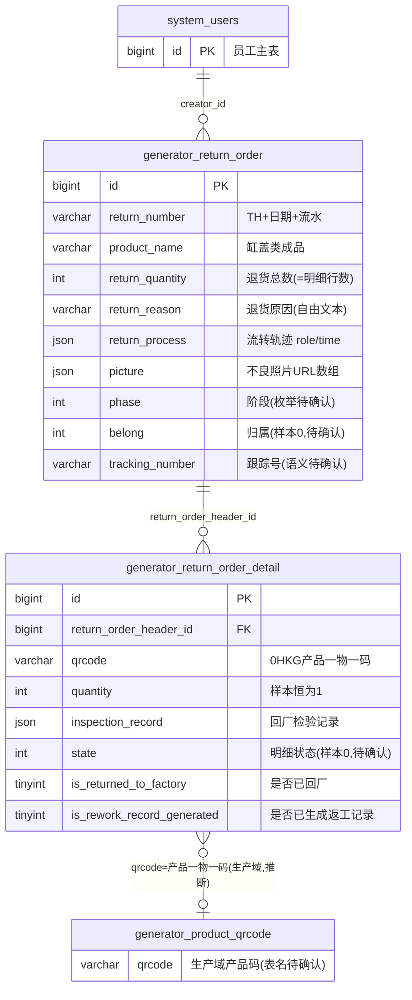

# 退货模块 · fuadmin 数据字典
> 域: 01-供应链域 | 表数: 2 | 用途: Agent基础文件 | 生成: 2026-07-23

# return-退货 · 模块概述

## 业务定位
退货模块是治通供应链域面向**质量退货/客户退货**的逆向物流登记模块：外检（出厂检验）发现不良后创建退货单头，按产品一物一码逐件登记退货明细，跟踪"退货创建 → 退回工厂 → 检验确认 → 生成返工"的回流闭环。样本典型场景为缸盖类机加产品（EVO缸盖、CSS375T-H缸盖）因"焊补"等质量原因退回，单号规则 TH+日期+流水（如 TH2026070601）。

## 上下游
- **上游**：质量/生产域——退货明细 `qrcode`（0HKG 开头）指向机加产品一物一码，退货原因（`return_reason`=焊补）源于检验不良；`inspection_record` JSON 留存退货后的检验记录。
- **下游**：`is_returned_to_factory` 标记货物是否已退回工厂（衔接仓储收货，推断）；`is_rework_record_generated` 标记是否已生成返工记录（衔接生产域返工单，推断）；`return_process` JSON 记录多角色流转轨迹（样本首角色为"外检创建人"）。

## 核心流程
外检发现不良 → 创建退货单头（TH 单号、产品、数量、原因、照片附件 `picture`、跟踪号 `tracking_number`）→ 逐件扫码登记明细（`qrcode` 一物一码、每行 quantity=1）→ 货物回厂（`is_returned_to_factory=1`）→ 回厂检验（明细 `inspection_record` JSON 填充、`state` 推进）→ 确认后生成返工记录（`is_rework_record_generated=1`，流向生产返工）。单头 `phase` 为阶段标记（样本值 2，枚举待确认），23 张单头对应 1087 行明细（平均约 47 件/单）。

# return-退货 · 上岗指南

## 2.1 核心实体表（全量 2 表）

| 表 | 一句话定义 |
|---|---|
| generator_return_order | 退货单头：TH 单号、产品、退货数量、原因（如焊补）、流程轨迹 JSON、照片附件、跟踪号 |
| generator_return_order_detail | 退货明细：按产品 qrcode 一物一码逐件登记，含检验记录、回厂/返工两个状态标记 |

## 2.2 核心业务流

1. **创建退货单**：外检（出厂检验）发现质量不良，创建 `return_order` 单头——`return_number`=TH+日期+流水、`product_name`（缸盖类成品）、`return_quantity` 退货总数、`return_reason`（样本：焊补）、`picture` JSON 不良照片、`tracking_number` 跟踪号（样本 0004878，语义待确认：批次/物流单号）；`return_process` JSON 记录流转轨迹（首节点 role="外检创建人"）。
2. **逐件登记明细**：`return_order_detail` 按产品二维码 `qrcode`（0HKG 开头一物一码）逐件登记，每行 `quantity=1`，单头数量=明细行数汇总。
3. **货物回厂**：实物退回工厂后置 `is_returned_to_factory=1`（衔接仓储收货，推断）。
4. **回厂检验**：检验结果写入明细 `inspection_record` JSON（样本多为空数组 []，表示未检），明细 `state` 推进（样本 0，枚举待确认）。
5. **生成返工**：检验确认可返修后生成生产返工记录，`is_rework_record_generated=1`（衔接生产域，推断）。
6. 单头 `phase` 标记整体阶段（样本值 2，枚举待确认），`belong`（样本 0）归属字段语义待确认。

## 2.3 典型查询场景

**场景1：某退货单全貌（头+逐件明细）**
```sql
SELECT o.return_number, o.product_name, o.return_reason, o.return_quantity,
       d.qrcode, d.state, d.is_returned_to_factory, d.is_rework_record_generated
FROM generator_return_order o
JOIN generator_return_order_detail d ON d.return_order_header_id = o.id
WHERE o.return_number = 'TH2026070601';
```

**场景2：按产品二维码追溯退货记录**
```sql
SELECT o.return_number, o.return_reason, o.create_datetime, d.state
FROM generator_return_order_detail d
JOIN generator_return_order o ON o.id = d.return_order_header_id
WHERE d.qrcode = '0HKG26184192822412543466';
```

**场景3：退货原因分布（质量分析）**
```sql
SELECT return_reason, COUNT(*) AS order_cnt, SUM(return_quantity) AS qty
FROM generator_return_order
GROUP BY return_reason ORDER BY qty DESC;
```

**场景4：未回厂/未检验的在途退货（待办清单）**
```sql
SELECT o.return_number, o.product_name, d.qrcode
FROM generator_return_order_detail d
JOIN generator_return_order o ON o.id = d.return_order_header_id
WHERE d.is_returned_to_factory = 0
   OR d.inspection_record = JSON_ARRAY();
```

**场景5：已回厂但未生成返工单的积压**
```sql
SELECT o.return_number, COUNT(*) AS pending_items
FROM generator_return_order o
JOIN generator_return_order_detail d ON d.return_order_header_id = o.id
WHERE d.is_returned_to_factory = 1 AND d.is_rework_record_generated = 0
GROUP BY o.return_number;
```

**场景6：按产品统计月度退货量**
```sql
SELECT product_name, DATE_FORMAT(create_datetime,'%Y-%m') AS ym,
       SUM(return_quantity) AS qty, COUNT(*) AS orders
FROM generator_return_order
GROUP BY product_name, ym ORDER BY ym DESC, qty DESC;
```

**场景7：数量校验（单头 vs 明细行数）**
```sql
SELECT o.return_number, o.return_quantity, COUNT(d.id) AS detail_rows,
       o.return_quantity - COUNT(d.id) AS diff
FROM generator_return_order o
LEFT JOIN generator_return_order_detail d ON d.return_order_header_id = o.id
GROUP BY o.id HAVING diff <> 0;
```

## 2.4 避坑提示

- **明细逐件粒度**：detail 是"一物一码一行"（样本 quantity 恒为 1），单头 `return_quantity` 是汇总——统计件数用 `COUNT(detail.id)` 与单头核对，勿直接 SUM(detail.quantity) 当唯一口径。
- **枚举待确认**：`phase`（样本仅见 2）、明细 `state`（样本仅见 0）、`belong`（样本仅见 0）、`return_reason`（自由文本 varchar(50)，样本"焊补"）均无字典注释，上线前对照 `system_dict_item` 或代码确认。
- **JSON 字段判空**：`inspection_record` 空值是 `[]` 而非 NULL，判"未检验"用 `JSON_LENGTH(inspection_record)=0` 或 `= JSON_ARRAY()`，勿用 IS NULL。
- **`return_process` 是轨迹不是状态**：JSON 数组按时间追加节点（role/time），当前阶段以 `phase` 为准；解析轨迹用 `JSON_EXTRACT`。
- **tracking_number 语义待确认**：样本为 6 位数字（0004878），可能是跟踪号/批次号/物流单号，非 FK。
- **脏注释**：两表 comment 均为 `'...view' is not BASE TABLE`，dump 修复残留，无业务含义，忽略。
- **qrcode 跨域**：`0HKG` 前缀为机加产品码规则（推断指向生产域产品一物一码），按码追溯需先确认生产域产品码表归属。
- **采购退货辨析**：本模块样本均为缸盖成品质量退货（销退/客户退货方向）；若存在"采购退货"（退回供应商），当前表无 supplier 字段，推断不落在本模块或语义待确认。

## 3 数据字典

### generator_return_order（约 23 行）
业务定义: 退货单头：TH单号、产品、退货数量、原因（焊补等）、流程轨迹JSON、照片、跟踪号 ｜ 表注释: [脏注释-待清理] 'fuadmin.generator_machined_number_view' is not BASE TABLE

| 字段 | 类型 | 可空 | 键 | 原始注释 | 推断语义 | 置信度 |
|---|---|---|---|---|---|---|
| id | bigint | N | PRI | - | 主键ID | high |
| remark | varchar(255) | Y | - | - | 备注 | high |
| modifier | varchar(255) | Y | - | - | 最后修改人姓名 | high |
| belong_dept | int | Y | - | - | 所属部门ID | mid |
| update_datetime | datetime(6) | Y | - | - | 最后更新时间 | high |
| create_datetime | datetime(6) | Y | - | - | 创建时间 | high |
| sort | int | Y | - | - | 排序号 | high |
| return_process | json | Y | - | - | 工序[推断] | mid |
| picture | json | Y | - | - | 图片路径[推断] | mid |
| phase | int | Y | - | - | 数值字段[推断-待确认] | low |
| return_quantity | int | Y | - | - | 数量[推断] | high |
| return_reason | varchar(50) | Y | - | - | 文本字段[推断-待确认] | low |
| product_name | varchar(50) | Y | - | - | 名称[推断] | high |
| belong | int | Y | - | - | 数值字段[推断-待确认] | low |
| tracking_number | varchar(100) | Y | - | - | 编号/代码[推断] | mid |
| return_number | varchar(20) | Y | - | - | 单号/编号[推断] | high |
| creator_id | bigint | Y | MUL | - | 创建人ID → system_users.id | high |

### generator_return_order_detail（约 1087 行）
业务定义: 退货明细：按产品qrcode一物一码逐件登记，含检验记录、回厂与返工状态标记 ｜ 表注释: [脏注释-待清理] 'fuadmin.generator_machined_number_view' is not BASE TABLE

| 字段 | 类型 | 可空 | 键 | 原始注释 | 推断语义 | 置信度 |
|---|---|---|---|---|---|---|
| id | bigint | N | PRI | - | 主键ID | high |
| remark | varchar(255) | Y | - | - | 备注 | high |
| modifier | varchar(255) | Y | - | - | 最后修改人姓名 | high |
| belong_dept | int | Y | - | - | 所属部门ID | mid |
| update_datetime | datetime(6) | Y | - | - | 最后更新时间 | high |
| create_datetime | datetime(6) | Y | - | - | 创建时间 | high |
| sort | int | Y | - | - | 排序号 | high |
| inspection_record | json | Y | - | - | 规格/型号[推断] | mid |
| picture | json | Y | - | - | 图片路径[推断] | mid |
| state | int | Y | - | - | 状态（枚举值待确认）[推断] | mid |
| is_returned_to_factory | tinyint(1) | Y | - | - | 标志位（布尔）[推断] | mid |
| quantity | int | Y | - | - | 数量[推断] | high |
| qrcode | varchar(255) | Y | - | - | 文本字段[推断-待确认] | low |
| creator_id | bigint | Y | MUL | - | 创建人ID → system_users.id | high |
| return_order_header_id | bigint | Y | MUL | - | 关联ID（目标表待确认）[推断] | low |
| is_rework_record_generated | tinyint(1) | Y | - | - | 标志位（布尔）[推断] | mid |

# return-退货 · ER 关系图

模块仅 2 张表，全部入图；跨模块关联以括号标注所属域/模块。



## 关系说明与置信度

- **FK 证据（高置信）**：`detail.return_order_header_id → order.id`（MUL 索引 + 样本 id=502/503 挂 header_id=6 与样本单头吻合）。
- **样本佐证（中置信，推断）**：明细 `qrcode`（0HKG 前缀）指向生产域机加产品一物一码，目标表名待确认；单头 `product_name` 为纯文本（EVO缸盖/CSS375T-H缸盖），非产品主数据 FK。
- **弱关联标记（推断）**：`is_returned_to_factory` 衔接仓储收货回写、`is_rework_record_generated` 衔接生产域返工单生成——均为状态标记而非外键，回写链路需代码确认。
- **creator_id**：按框架惯例指向 system_users.id（样本 creator_id=592/265）。
- **belong_dept**：int 部门号，推断指向 system_dept.id（样本 12/14 部门不同，创建部门与检验部门分离）。

# return-退货 · 跨模块接口表

| 本模块表.字段 | → 目标模块.表.字段 | 依据 | 置信度 |
|---|---|---|---|
| return_order_detail.qrcode | → 02-生产铸造域 产品一物一码表.qrcode（0HKG 前缀机加产品码） | 样本码 0HKG26184192822412543466 为生产追溯风格，目标表名待确认 | 中（推断） |
| return_order_detail.is_rework_record_generated | → 02-生产铸造域 返工单/返工记录（生成后置位） | 字段语义"是否已生成返工记录"，状态标记非FK | 中（推断，待确认） |
| return_order_detail.inspection_record | → 03-质量技术域 检验记录（JSON 内嵌或回链） | 字段语义"回厂检验记录"，JSON 数组结构 | 中（推断，待确认） |
| return_order_detail.is_returned_to_factory | → warehouse（仓储）入库/收货回写 | 字段语义"是否已退回工厂"，退货入库状态标记 | 中（推断，待确认） |
| return_order.return_reason | → 03-质量技术域 不良原因字典（焊补等） | 自由文本 varchar(50)，样本"焊补"为典型机加缺陷，未字典化 | 低-中（推断） |
| return_order.product_name | → 生产域产品主数据（纯文本，无FK） | 样本 EVO缸盖/CSS375T-H缸盖，仅能按名对碰 | 中 |
| return_order.tracking_number | → 物流/批次跟踪（语义待确认，样本 0004878） | 6位数字编号，无明确指向 | 低（待确认） |
| return_order.picture | → system（系统）附件存储 /static/ 路径 | JSON URL 数组，框架惯例（样本 /static/20260706/...） | 高 |
| 两表.creator_id | → system（用户权限）.system_users.id | 框架惯例 + creator_id 索引（样本 592/265） | 高 |
| 两表.belong_dept | → system.system_dept.id | 框架惯例 int 部门号（样本 12/14） | 中（待确认） |

## 说明

- **无外键模块**：本模块内部仅 `detail.return_order_header_id` 一条 FK 边；对生产/质量/仓储三个方向全部是 **qrcode 关联或布尔状态标记**，无任何显式跨模块外键——逆向追溯链（退货件→原生产批次→返工单）需代码层确认回写逻辑。
- **与 settlement/purchase 的关系**：样本均为缸盖成品质量退货（销退方向），无 supplier/采购单字段；**采购退货（退回供应商）不落在本模块**（推断），若存在应在 purchase/settlement 侧以红冲或负单处理，待确认。
- **qrcode 是关键枢纽**：一物一码打通"生产产出→出厂检验→客户退货→回厂返工"全链质量追溯，建议优先确认 0HKG 码段对应的生产域码表。
- **JSON 字段三处**：`return_process`(轨迹)、`picture`(照片)、`inspection_record`(检验)——空值均为 `[]`，查询用 `JSON_LENGTH()=0` 判空。

## 6 字段备注改进建议

（本模块为小型/过渡性模块，业务语义与归属建议见同域《零散模块总览》或域内相关主模块文档）

## 相关页面
- [[fuadmin数据字典总览]]
- [[仓储模块-fuadmin数据字典]]
- [[付款模块-fuadmin数据字典]]
- [[供应商模块-fuadmin数据字典]]
- [[物流模块-fuadmin数据字典]]
- [[结算模块-fuadmin数据字典]]
- [[采购模块-fuadmin数据字典]]
