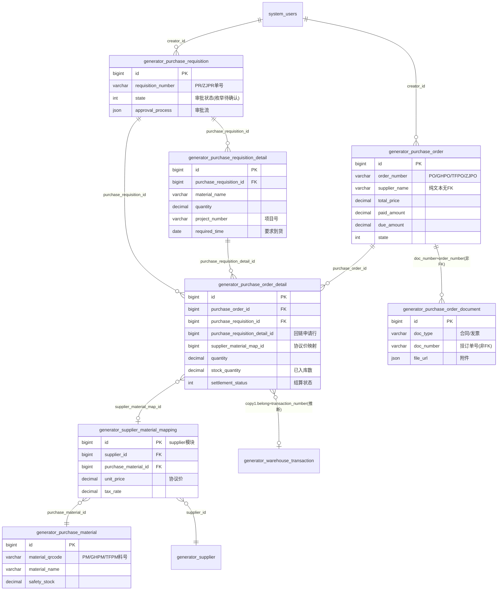

# 采购模块 · fuadmin 数据字典
> 域: 01-供应链域 | 表数: 43 | 用途: Agent基础文件 | 生成: 2026-07-23

# purchase-采购 · 模块概述

## 业务定位
采购模块是治通供应链域的源头执行模块，覆盖“采购申请 → 采购订单 → 订单明细 → 采购单据（合同/发票）”全链路，并为仓储入库与对账结算提供源头数据。系统按多站点分表：无后缀表为治通现役站点，`_gh`=广汇、`_tf`=TF铸造（泰峰）、`_zt`=治通同构分表（除物料表存 2017 年前后老系统迁移数据外基本为空）。

## 上下游
- **上游**：采购申请单（`generator_purchase_requisition`，PR/ZJPR 单号）由需求部门发起，经审批流（`approval_process` JSON）后转采购；采购物料主数据（`generator_purchase_material`）与供应商-物料价格映射（supplier 模块 `generator_supplier_material_mapping`）为下单提供料号与协议价。
- **下游**：订单明细的 `stock_quantity`（已入库数）对接 warehouse 仓储模块入库（明细副本表 `belong` 字段挂 PMSI 开头的入库单号，推断）；`settlement_status`（结算状态）与采购单据表的合同/发票对接 settlement 结算模块；订单头记录供应商开户行/账号、`paid_amount`/`due_amount` 支撑付款进度跟踪。

## 核心流程
采购申请单+申请明细（审批）→ 采购订单+订单明细（按供应商汇总下单，回链申请单/申请明细行）→ 采购单据登记合同与发票（按订单号 `doc_number` 关联）→ 到货入库（明细 `stock_quantity` 累计、副本表记录入库单号）→ 对账结算付款（`settlement_status`、`paid_amount` 回写）。全部 27 张现役表均带历史快照（16 张 `historical*` 表），记录每次增删改的操作人、原因与操作标签。

# purchase-采购 · 上岗指南

## 2.1 核心实体表（TOP8）

| 表 | 一句话定义 |
|---|---|
| generator_purchase_requisition | 采购申请单头（治通现役），PR/ZJPR 单号，含审批流与状态 |
| generator_purchase_requisition_detail | 采购申请明细，记录物料/数量/项目/要求到货时间 |
| generator_purchase_order | 采购订单头（治通现役），PO 单号，供应商、金额、付款进度 |
| generator_purchase_order_detail | 采购订单明细，回链申请行与供应商物料映射，含入库/结算状态 |
| generator_purchase_order_document | 采购单据（合同/发票扫描件），按 doc_number 挂订单号 |
| generator_purchase_material | 采购物料主数据（治通现役），PM 二维码料号、品牌、安全库存 |
| generator_purchase_order_gh / _tf | 广汇/TF铸造站点采购订单（站点分表，结构同主表） |
| generator_historicalpurchaseorder | 采购订单历史快照（16 张快照表的代表，见 2.4） |

## 2.2 核心业务流

1. 需求部门创建 `purchase_requisition`（申请单头）+ `purchase_requisition_detail`（申请明细），进入审批流（`state` 推进，样本可见 1→3）。
2. 审批通过后，采购员按供应商汇总生成 `purchase_order`（订单头，含 `supplier_name`、银行账户、`order_belong` 站点归属）+ `purchase_order_detail`（订单明细，`purchase_requisition_id`/`purchase_requisition_detail_id` 回链申请，`supplier_material_map_id` 带出协议价税）。
3. 订单经审批（`approval_process` JSON 记录多级审核，样本审批人为“某某”工号 10000）后生效，`state` 样本值最高 3。
4. 合同、发票等凭据登记到 `purchase_order_document`（`doc_type`=合同/发票，`doc_number` 填订单号，`file_url` JSON 存附件）。
5. 供应商到货，仓储入库后回写订单明细 `stock_quantity`（累计入库数）；`order_detail_copy1.belong` 可见 PMSI 开头的入库单号（推断为入库回写痕迹）。
6. 对账结算：订单明细 `settlement_status` 标记结算进度，订单头 `paid_amount`/`due_amount` 跟踪已付/应付。
7. 全程每次增删改自动写入对应 `historical*` 快照表（`history_type`：+新增 / ~修改 / -删除）。

## 2.3 典型查询场景

**场景1：某采购订单的全貌（头+明细）**
```sql
SELECT o.order_number, o.supplier_name, o.total_price, o.paid_amount, o.due_amount,
       d.material_name, d.specification, d.quantity, d.unit, d.unit_price, d.amount, d.state
FROM generator_purchase_order o
JOIN generator_purchase_order_detail d ON d.purchase_order_id = o.id
WHERE o.order_number = 'PO202509090001';
```

**场景2：从订单明细溯源到采购申请**
```sql
SELECT d.id, d.material_name, r.requisition_number, rd.required_time, rd.project_name
FROM generator_purchase_order_detail d
LEFT JOIN generator_purchase_requisition r ON r.id = d.purchase_requisition_id
LEFT JOIN generator_purchase_requisition_detail rd ON rd.id = d.purchase_requisition_detail_id
WHERE d.purchase_order_id = 29;
```

**场景3：供应商应付账款清单**
```sql
SELECT supplier_name, COUNT(*) AS order_cnt,
       SUM(total_price) AS total, SUM(paid_amount) AS paid, SUM(due_amount) AS due
FROM generator_purchase_order
WHERE state = 3
GROUP BY supplier_name ORDER BY due DESC;
```

**场景4：查某订单的合同/发票凭据**
```sql
SELECT doc_type, doc_number, total_amount, signing_date, due_amount, state
FROM generator_purchase_order_document
WHERE doc_number = 'TFPO2026070705';
```

**场景5：项目维度的采购成本归集**
```sql
SELECT d.project_number, d.project_name, SUM(d.amount) AS project_amount
FROM generator_purchase_order_detail d
WHERE d.project_number <> '' GROUP BY d.project_number, d.project_name
ORDER BY project_amount DESC;
```

**场景6：入库进度（已入库/未入库）**
```sql
SELECT o.order_number, d.material_name, d.quantity, d.stock_quantity,
       d.quantity - IFNULL(d.stock_quantity,0) AS pending_qty
FROM generator_purchase_order_detail d
JOIN generator_purchase_order o ON o.id = d.purchase_order_id
WHERE d.quantity > IFNULL(d.stock_quantity,0);
```

**场景7：审计某订单的变更历史**
```sql
SELECT history_id, history_date, history_change_reason, history_type, operation_label
FROM generator_historicalpurchaseorder
WHERE id = 1048 ORDER BY history_id;
```

**场景8：跨站点合并订单额（UNION 分表）**
```sql
SELECT '治通' site, SUM(total_price) amt FROM generator_purchase_order
UNION ALL SELECT '广汇', SUM(total_price) FROM generator_purchase_order_gh
UNION ALL SELECT 'TF铸造', SUM(total_price) FROM generator_purchase_order_tf;
```

## 2.4 避坑提示

- **站点分表**：主流程按站点拆表——无后缀=治通现役、`_gh`=广汇、`_tf`=TF铸造（泰峰，样本 `order_belong`=泰峰）、`_zt`=治通同构分表。注意 `_zt` 订单/申请表均为 0 行，仅 `purchase_material_zt`（约1.95万行）存 2017 年前后老系统迁移的物料数据，**不要**当作现役治通业务表统计。
- **`_copy1` 副本表**：`purchase_order_copy1`、`purchase_order_detail_copy1`、`purchase_order_document_copy1` 与主表数据高度重叠（样本同 id 同内容），且 `detail_copy1` 多出 `belong`（PMSI 开头单号，推断为入库单号）/`practical_date` 字段——疑似迁移/改版前的备份副本，**新业务查询勿用**，语义待确认。
- **历史快照边界**：16 张 `historical*` 表与现役表同构，额外含 `history_id`(PK)/`history_date`/`history_change_reason`/`history_type`(+、~、-)/`history_user_id`（FK→system_users）/`operation_id`/`operation_label`。同一业务 id 多行=多次变更，审计按 `id + history_id` 排序；**统计报表严禁直接 SUM 快照表**（会重复计），快照只用于追溯。
- **供应商无 FK**：订单头 `supplier_name` 是纯文本（样本如“上海凯央五金机电有限公司（广汇）”），无 supplier_id 外键；正式供应商主数据在 supplier 模块，关联只能靠名称模糊或经 `supplier_material_map_id` 间接打通。
- **枚举待确认**：`state`（样本见 0/1/2/3，推断 3≈审批通过）、`order_type`（0/1）、`settlement_status`（样本仅见 0）、`requisition_state`、`requisition_reason`、`requisition_type`（样本仅见 0）、`doc_type`（样本见 合同/发票）——均为 int/varchar 无字典注释，上线前需对照 `system_dict_item` 或代码确认。
- **脏注释**：多张表 comment 为 `'...view' is not BASE TABLE`，是 dump 修复残留，无业务含义，忽略即可。
- **applicant 是文本**：明细表 `applicant` 格式为“工号 姓名”（如“21061 某某”），非外键；按人统计需 `SUBSTRING_INDEX(applicant,' ',1)` 取工号再关联 system_users。

## 3 数据字典

### generator_purchase_material（约 723 行）
业务定义: 采购物料主数据（治通现役）：PM二维码料号、品牌、安全库存、标准价 ｜ 表注释: [脏注释-待清理] 'fuadmin.generator_machined_number_view' is not BASE TABLE

| 字段 | 类型 | 可空 | 键 | 原始注释 | 推断语义 | 置信度 |
|---|---|---|---|---|---|---|
| id | bigint | N | PRI | - | 主键ID | high |
| remark | varchar(255) | Y | - | - | 备注 | high |
| modifier | varchar(255) | Y | - | - | 最后修改人姓名 | high |
| belong_dept | int | Y | - | - | 所属部门ID | mid |
| update_datetime | datetime(6) | Y | - | - | 最后更新时间 | high |
| create_datetime | datetime(6) | Y | - | - | 创建时间 | high |
| sort | int | Y | - | - | 排序号 | high |
| stock_unit | varchar(10) | Y | - | - | 计量单位[推断] | high |
| safety_stock | decimal(13,2) | Y | - | - | 数值（小数）[推断-待确认] | low |
| cost | decimal(15,4) | Y | - | - | 金额[推断] | high |
| standard_price | decimal(15,4) | Y | - | - | 单价[推断] | high |
| processing_product | varchar(50) | Y | - | - | 加工产品[推断] | mid |
| product_type | varchar(50) | Y | - | - | 类型[推断] | mid |
| specification | varchar(255) | Y | - | - | 规格/型号[推断] | mid |
| material_name | varchar(255) | Y | - | - | 名称[推断] | high |
| material_qrcode | varchar(50) | Y | - | - | 物料[推断] | high |
| creator_id | bigint | Y | MUL | - | 创建人ID → system_users.id | high |
| brand | varchar(20) | Y | - | - | 品牌[推断] | high |
| internal_category | varchar(50) | Y | - | - | 分类[推断] | mid |
| material_attachments | json | Y | - | - | 物料[推断] | high |

### generator_purchase_material_gh（约 176 行）
业务定义: 广汇站点采购物料主数据，GHPM料号 ｜ 表注释: -

| 字段 | 类型 | 可空 | 键 | 原始注释 | 推断语义 | 置信度 |
|---|---|---|---|---|---|---|
| id | bigint | N | PRI | - | 主键ID | high |
| remark | varchar(255) | Y | - | - | 备注 | high |
| modifier | varchar(255) | Y | - | - | 最后修改人姓名 | high |
| belong_dept | int | Y | - | - | 所属部门ID | mid |
| update_datetime | datetime(6) | Y | - | - | 最后更新时间 | high |
| create_datetime | datetime(6) | Y | - | - | 创建时间 | high |
| sort | int | Y | - | - | 排序号 | high |
| stock_unit | varchar(10) | Y | - | - | 计量单位[推断] | high |
| safety_stock | decimal(13,2) | Y | - | - | 数值（小数）[推断-待确认] | low |
| cost | decimal(15,4) | Y | - | - | 金额[推断] | high |
| standard_price | decimal(15,4) | Y | - | - | 单价[推断] | high |
| internal_category | varchar(50) | Y | - | - | 分类[推断] | mid |
| processing_product | varchar(50) | Y | - | - | 加工产品[推断] | mid |
| product_type | varchar(50) | Y | - | - | 类型[推断] | mid |
| brand | varchar(20) | Y | - | - | 品牌[推断] | high |
| specification | varchar(255) | Y | - | - | 规格/型号[推断] | mid |
| material_name | varchar(255) | Y | - | - | 名称[推断] | high |
| material_qrcode | varchar(50) | Y | - | - | 物料[推断] | high |
| creator_id | bigint | Y | MUL | - | 创建人ID → system_users.id | high |
| material_attachments | json | Y | - | - | 物料[推断] | high |

### generator_purchase_material_tf（约 54 行）
业务定义: TF铸造站点采购物料主数据，TFPM料号 ｜ 表注释: -

| 字段 | 类型 | 可空 | 键 | 原始注释 | 推断语义 | 置信度 |
|---|---|---|---|---|---|---|
| id | bigint | N | PRI | - | 主键ID | high |
| remark | varchar(255) | Y | - | - | 备注 | high |
| modifier | varchar(255) | Y | - | - | 最后修改人姓名 | high |
| belong_dept | int | Y | - | - | 所属部门ID | mid |
| update_datetime | datetime(6) | Y | - | - | 最后更新时间 | high |
| create_datetime | datetime(6) | Y | - | - | 创建时间 | high |
| sort | int | Y | - | - | 排序号 | high |
| stock_unit | varchar(10) | Y | - | - | 计量单位[推断] | high |
| safety_stock | decimal(13,2) | Y | - | - | 数值（小数）[推断-待确认] | low |
| cost | decimal(15,4) | Y | - | - | 金额[推断] | high |
| standard_price | decimal(15,4) | Y | - | - | 单价[推断] | high |
| internal_category | varchar(50) | Y | - | - | 分类[推断] | mid |
| processing_product | varchar(50) | Y | - | - | 加工产品[推断] | mid |
| product_type | varchar(50) | Y | - | - | 类型[推断] | mid |
| brand | varchar(20) | Y | - | - | 品牌[推断] | high |
| specification | varchar(255) | Y | - | - | 规格/型号[推断] | mid |
| material_name | varchar(255) | Y | - | - | 名称[推断] | high |
| material_qrcode | varchar(50) | Y | - | - | 物料[推断] | high |
| creator_id | bigint | Y | MUL | - | 创建人ID → system_users.id | high |
| material_attachments | json | Y | - | - | 物料[推断] | high |

### generator_purchase_material_zt（约 19554 行）
业务定义: 治通老系统迁移物料库（约1.95万行，2017年数据，非现役业务） ｜ 表注释: -

| 字段 | 类型 | 可空 | 键 | 原始注释 | 推断语义 | 置信度 |
|---|---|---|---|---|---|---|
| id | bigint | N | PRI | - | 主键ID | high |
| remark | varchar(255) | Y | - | - | 备注 | high |
| modifier | varchar(255) | Y | - | - | 最后修改人姓名 | high |
| belong_dept | int | Y | - | - | 所属部门ID | mid |
| update_datetime | datetime(6) | Y | - | - | 最后更新时间 | high |
| create_datetime | datetime(6) | Y | - | - | 创建时间 | high |
| sort | int | Y | - | - | 排序号 | high |
| stock_unit | varchar(10) | Y | - | - | 计量单位[推断] | high |
| safety_stock | decimal(13,2) | Y | - | - | 数值（小数）[推断-待确认] | low |
| cost | decimal(15,4) | Y | - | - | 金额[推断] | high |
| standard_price | decimal(15,4) | Y | - | - | 单价[推断] | high |
| internal_category | varchar(50) | Y | - | - | 分类[推断] | mid |
| processing_product | varchar(50) | Y | - | - | 加工产品[推断] | mid |
| product_type | varchar(50) | Y | - | - | 类型[推断] | mid |
| brand | varchar(20) | Y | - | - | 品牌[推断] | high |
| specification | varchar(255) | Y | - | - | 规格/型号[推断] | mid |
| material_name | varchar(255) | Y | - | - | 名称[推断] | high |
| material_qrcode | varchar(50) | Y | - | - | 物料[推断] | high |
| creator_id | bigint | Y | MUL | - | 创建人ID → system_users.id | high |
| material_attachments | json | Y | - | - | 物料[推断] | high |

### generator_purchase_order（约 1013 行）
业务定义: 采购订单头（治通现役）：PO单号、供应商、金额、付款条件与已付/应付 ｜ 表注释: [脏注释-待清理] 'fuadmin.generator_machined_number_view' is not BASE TABLE

| 字段 | 类型 | 可空 | 键 | 原始注释 | 推断语义 | 置信度 |
|---|---|---|---|---|---|---|
| id | bigint | N | PRI | - | 主键ID | high |
| remark | varchar(255) | Y | - | - | 备注 | high |
| modifier | varchar(255) | Y | - | - | 最后修改人姓名 | high |
| belong_dept | int | Y | - | - | 所属部门ID | mid |
| update_datetime | datetime(6) | Y | - | - | 最后更新时间 | high |
| create_datetime | datetime(6) | Y | - | - | 创建时间 | high |
| sort | int | Y | - | - | 排序号 | high |
| state | int | Y | - | - | 状态（枚举值待确认）[推断] | mid |
| approval_process | json | Y | - | - | 审批流程（JSON）[推断] | high |
| order_number | varchar(50) | Y | - | - | 单号/编号[推断] | high |
| creator_id | bigint | Y | MUL | - | 创建人ID → system_users.id | high |
| total_price | decimal(13,2) | Y | - | - | 单价[推断] | high |
| bank_account | varchar(50) | Y | - | - | 文本字段[推断-待确认] | low |
| deposit_bank | varchar(50) | Y | - | - | 文本字段[推断-待确认] | low |
| due_amount | decimal(13,2) | Y | - | - | 应付金额[推断] | high |
| paid_amount | decimal(13,2) | Y | - | - | 金额[推断] | high |
| payment_term | varchar(50) | Y | - | - | 文本字段[推断-待确认] | low |
| supplier_name | varchar(50) | Y | - | - | 名称[推断] | high |
| order_belong | varchar(30) | Y | - | - | 订单归属站点[推断] | mid |
| order_type | int | Y | - | - | 类型[推断] | mid |

### generator_purchase_order_copy1（约 678 行）
业务定义: 采购订单备份副本，与主表数据重叠，疑为迁移残留，勿用于业务查询 ｜ 表注释: -

| 字段 | 类型 | 可空 | 键 | 原始注释 | 推断语义 | 置信度 |
|---|---|---|---|---|---|---|
| id | bigint | N | PRI | - | 主键ID | high |
| remark | varchar(255) | Y | - | - | 备注 | high |
| modifier | varchar(255) | Y | - | - | 最后修改人姓名 | high |
| belong_dept | int | Y | - | - | 所属部门ID | mid |
| update_datetime | datetime(6) | Y | - | - | 最后更新时间 | high |
| create_datetime | datetime(6) | Y | - | - | 创建时间 | high |
| sort | int | Y | - | - | 排序号 | high |
| state | int | Y | - | - | 状态（枚举值待确认）[推断] | mid |
| approval_process | json | Y | - | - | 审批流程（JSON）[推断] | high |
| order_number | varchar(50) | Y | - | - | 单号/编号[推断] | high |
| creator_id | bigint | Y | MUL | - | 创建人ID → system_users.id | high |
| total_price | decimal(13,2) | Y | - | - | 单价[推断] | high |
| bank_account | varchar(50) | Y | - | - | 文本字段[推断-待确认] | low |
| deposit_bank | varchar(50) | Y | - | - | 文本字段[推断-待确认] | low |
| due_amount | decimal(13,2) | Y | - | - | 应付金额[推断] | high |
| paid_amount | decimal(13,2) | Y | - | - | 金额[推断] | high |
| payment_term | varchar(50) | Y | - | - | 文本字段[推断-待确认] | low |
| supplier_name | varchar(50) | Y | - | - | 名称[推断] | high |
| order_belong | varchar(30) | Y | - | - | 订单归属站点[推断] | mid |

### generator_purchase_order_detail（约 2630 行）
业务定义: 采购订单明细：回链申请行与供应商物料映射，含入库数/结算状态 ｜ 表注释: [脏注释-待清理] 'fuadmin.generator_machined_number_view' is not BASE TABLE

| 字段 | 类型 | 可空 | 键 | 原始注释 | 推断语义 | 置信度 |
|---|---|---|---|---|---|---|
| id | bigint | N | PRI | - | 主键ID | high |
| remark | varchar(255) | Y | - | - | 备注 | high |
| modifier | varchar(255) | Y | - | - | 最后修改人姓名 | high |
| belong_dept | int | Y | - | - | 所属部门ID | mid |
| update_datetime | datetime(6) | Y | - | - | 最后更新时间 | high |
| create_datetime | datetime(6) | Y | - | - | 创建时间 | high |
| sort | int | Y | - | - | 排序号 | high |
| picture | json | Y | - | - | 图片路径[推断] | mid |
| predict_date | date | Y | - | - | 日期[推断] | high |
| amount | decimal(13,2) | Y | - | - | 金额[推断] | high |
| tax_rate | decimal(6,2) | Y | - | - | 比率/百分比[推断] | high |
| unit_price | decimal(15,4) | Y | - | - | 单价[推断] | high |
| applicant | varchar(20) | Y | - | - | 文本字段[推断-待确认] | low |
| project_name | varchar(50) | Y | - | - | 名称[推断] | high |
| project_number | varchar(50) | Y | - | - | 编号/代码[推断] | mid |
| material_subcategory | varchar(50) | Y | - | - | 分类[推断] | mid |
| material_category | varchar(20) | Y | - | - | 分类[推断] | mid |
| quantity | decimal(13,2) | Y | - | - | 数量[推断] | high |
| unit | varchar(10) | Y | - | - | 计量单位[推断] | high |
| config_requirement | varchar(255) | Y | - | - | 文本字段[推断-待确认] | low |
| specification | varchar(255) | Y | - | - | 规格/型号[推断] | mid |
| material_name | varchar(255) | Y | - | - | 名称[推断] | high |
| creator_id | bigint | Y | MUL | - | 创建人ID → system_users.id | high |
| purchase_order_id | bigint | Y | MUL | - | 关联ID → generator_purchase_order.id[推断] | mid |
| purchase_requisition_id | bigint | Y | MUL | - | 关联ID → generator_purchase_requisition.id[推断] | mid |
| state | int | Y | - | - | 状态（枚举值待确认）[推断] | mid |
| approval_comment | varchar(255) | Y | - | - | 文本字段[推断-待确认] | low |
| predict_days | smallint unsigned | Y | - | - | 待确认 | low |
| delivery_address | varchar(255) | Y | - | - | 地址[推断] | high |
| purchase_requisition_detail_id | bigint | Y | - | - | 关联ID → generator_purchase_requisition_detail.id[推断] | mid |
| brand | varchar(20) | Y | - | - | 品牌[推断] | high |
| operation_reason | varchar(255) | Y | - | - | 操作原因[推断] | mid |
| supplier_material_map_id | bigint | Y | MUL | - | 关联ID（目标表待确认）[推断] | low |
| stock_quantity | decimal(13,2) | Y | - | - | 数量[推断] | high |
| settlement_status | int | Y | - | - | 状态（枚举值待确认）[推断] | mid |

### generator_purchase_order_detail_copy1（约 1763 行）
业务定义: 订单明细副本，多出入库单号belong/实到日期字段，疑为入库回写迁移残留 ｜ 表注释: -

| 字段 | 类型 | 可空 | 键 | 原始注释 | 推断语义 | 置信度 |
|---|---|---|---|---|---|---|
| id | bigint | N | PRI | - | 主键ID | high |
| remark | varchar(255) | Y | - | - | 备注 | high |
| modifier | varchar(255) | Y | - | - | 最后修改人姓名 | high |
| belong_dept | int | Y | - | - | 所属部门ID | mid |
| update_datetime | datetime(6) | Y | - | - | 最后更新时间 | high |
| create_datetime | datetime(6) | Y | - | - | 创建时间 | high |
| sort | int | Y | - | - | 排序号 | high |
| picture | json | Y | - | - | 图片路径[推断] | mid |
| belong | varchar(50) | Y | - | - | 文本字段[推断-待确认] | low |
| practical_date | date | Y | - | - | 日期[推断] | high |
| predict_date | date | Y | - | - | 日期[推断] | high |
| amount | decimal(13,2) | Y | - | - | 金额[推断] | high |
| tax_rate | decimal(6,2) | Y | - | - | 比率/百分比[推断] | high |
| unit_price | decimal(15,4) | Y | - | - | 单价[推断] | high |
| applicant | varchar(20) | Y | - | - | 文本字段[推断-待确认] | low |
| project_name | varchar(50) | Y | - | - | 名称[推断] | high |
| project_number | varchar(50) | Y | - | - | 编号/代码[推断] | mid |
| material_subcategory | varchar(50) | Y | - | - | 分类[推断] | mid |
| material_category | varchar(20) | Y | - | - | 分类[推断] | mid |
| quantity | decimal(13,2) | Y | - | - | 数量[推断] | high |
| unit | varchar(10) | Y | - | - | 计量单位[推断] | high |
| config_requirement | varchar(255) | Y | - | - | 文本字段[推断-待确认] | low |
| specification | varchar(50) | Y | - | - | 规格/型号[推断] | mid |
| material_name | varchar(50) | Y | - | - | 名称[推断] | high |
| creator_id | bigint | Y | MUL | - | 创建人ID → system_users.id | high |
| purchase_order_id | bigint | Y | MUL | - | 关联ID → generator_purchase_order.id[推断] | mid |
| purchase_requisition_id | bigint | Y | MUL | - | 关联ID → generator_purchase_requisition.id[推断] | mid |
| state | int | Y | - | - | 状态（枚举值待确认）[推断] | mid |
| approval_comment | varchar(255) | Y | - | - | 文本字段[推断-待确认] | low |
| predict_days | smallint unsigned | Y | - | - | 待确认 | low |
| delivery_address | varchar(255) | Y | - | - | 地址[推断] | high |
| purchase_requisition_detail_id | bigint | Y | - | - | 关联ID → generator_purchase_requisition_detail.id[推断] | mid |
| brand | varchar(20) | Y | - | - | 品牌[推断] | high |
| operation_reason | varchar(255) | Y | - | - | 操作原因[推断] | mid |
| supplier_material_map_id | bigint | Y | MUL | - | 关联ID（目标表待确认）[推断] | low |

### generator_purchase_order_detail_gh（约 176 行）
业务定义: 广汇站点采购订单明细，结构同主明细表 ｜ 表注释: -

| 字段 | 类型 | 可空 | 键 | 原始注释 | 推断语义 | 置信度 |
|---|---|---|---|---|---|---|
| id | bigint | N | PRI | - | 主键ID | high |
| remark | varchar(255) | Y | - | - | 备注 | high |
| modifier | varchar(255) | Y | - | - | 最后修改人姓名 | high |
| belong_dept | int | Y | - | - | 所属部门ID | mid |
| update_datetime | datetime(6) | Y | - | - | 最后更新时间 | high |
| create_datetime | datetime(6) | Y | - | - | 创建时间 | high |
| sort | int | Y | - | - | 排序号 | high |
| delivery_address | varchar(255) | Y | - | - | 地址[推断] | high |
| picture | json | Y | - | - | 图片路径[推断] | mid |
| approval_comment | varchar(255) | Y | - | - | 文本字段[推断-待确认] | low |
| operation_reason | varchar(255) | Y | - | - | 操作原因[推断] | mid |
| state | int | Y | - | - | 状态（枚举值待确认）[推断] | mid |
| predict_date | date | Y | - | - | 日期[推断] | high |
| predict_days | smallint unsigned | Y | - | - | 待确认 | low |
| amount | decimal(13,2) | Y | - | - | 金额[推断] | high |
| tax_rate | decimal(6,2) | Y | - | - | 比率/百分比[推断] | high |
| unit_price | decimal(15,4) | Y | - | - | 单价[推断] | high |
| applicant | varchar(20) | Y | - | - | 文本字段[推断-待确认] | low |
| project_name | varchar(50) | Y | - | - | 名称[推断] | high |
| project_number | varchar(50) | Y | - | - | 编号/代码[推断] | mid |
| material_subcategory | varchar(50) | Y | - | - | 分类[推断] | mid |
| material_category | varchar(20) | Y | - | - | 分类[推断] | mid |
| quantity | decimal(13,2) | Y | - | - | 数量[推断] | high |
| unit | varchar(10) | Y | - | - | 计量单位[推断] | high |
| brand | varchar(20) | Y | - | - | 品牌[推断] | high |
| config_requirement | varchar(255) | Y | - | - | 文本字段[推断-待确认] | low |
| specification | varchar(255) | Y | - | - | 规格/型号[推断] | mid |
| material_name | varchar(255) | Y | - | - | 名称[推断] | high |
| purchase_requisition_detail_id | bigint | Y | - | - | 关联ID → generator_purchase_requisition_detail.id[推断] | mid |
| creator_id | bigint | Y | MUL | - | 创建人ID → system_users.id | high |
| purchase_order_id | bigint | Y | MUL | - | 关联ID → generator_purchase_order.id[推断] | mid |
| purchase_requisition_id | bigint | Y | MUL | - | 关联ID → generator_purchase_requisition.id[推断] | mid |
| supplier_material_map_id | bigint | Y | MUL | - | 关联ID（目标表待确认）[推断] | low |
| stock_quantity | decimal(13,2) | Y | - | - | 数量[推断] | high |
| settlement_status | int | Y | - | - | 状态（枚举值待确认）[推断] | mid |

### generator_purchase_order_detail_tf（约 46 行）
业务定义: TF铸造站点采购订单明细，结构同主明细表 ｜ 表注释: -

| 字段 | 类型 | 可空 | 键 | 原始注释 | 推断语义 | 置信度 |
|---|---|---|---|---|---|---|
| id | bigint | N | PRI | - | 主键ID | high |
| remark | varchar(255) | Y | - | - | 备注 | high |
| modifier | varchar(255) | Y | - | - | 最后修改人姓名 | high |
| belong_dept | int | Y | - | - | 所属部门ID | mid |
| update_datetime | datetime(6) | Y | - | - | 最后更新时间 | high |
| create_datetime | datetime(6) | Y | - | - | 创建时间 | high |
| sort | int | Y | - | - | 排序号 | high |
| delivery_address | varchar(255) | Y | - | - | 地址[推断] | high |
| picture | json | Y | - | - | 图片路径[推断] | mid |
| approval_comment | varchar(255) | Y | - | - | 文本字段[推断-待确认] | low |
| operation_reason | varchar(255) | Y | - | - | 操作原因[推断] | mid |
| state | int | Y | - | - | 状态（枚举值待确认）[推断] | mid |
| predict_date | date | Y | - | - | 日期[推断] | high |
| predict_days | smallint unsigned | Y | - | - | 待确认 | low |
| amount | decimal(13,2) | Y | - | - | 金额[推断] | high |
| tax_rate | decimal(6,2) | Y | - | - | 比率/百分比[推断] | high |
| unit_price | decimal(15,4) | Y | - | - | 单价[推断] | high |
| applicant | varchar(20) | Y | - | - | 文本字段[推断-待确认] | low |
| project_name | varchar(50) | Y | - | - | 名称[推断] | high |
| project_number | varchar(50) | Y | - | - | 编号/代码[推断] | mid |
| material_subcategory | varchar(50) | Y | - | - | 分类[推断] | mid |
| material_category | varchar(20) | Y | - | - | 分类[推断] | mid |
| quantity | decimal(13,2) | Y | - | - | 数量[推断] | high |
| unit | varchar(10) | Y | - | - | 计量单位[推断] | high |
| brand | varchar(20) | Y | - | - | 品牌[推断] | high |
| config_requirement | varchar(255) | Y | - | - | 文本字段[推断-待确认] | low |
| specification | varchar(255) | Y | - | - | 规格/型号[推断] | mid |
| material_name | varchar(255) | Y | - | - | 名称[推断] | high |
| purchase_requisition_detail_id | bigint | Y | - | - | 关联ID → generator_purchase_requisition_detail.id[推断] | mid |
| creator_id | bigint | Y | MUL | - | 创建人ID → system_users.id | high |
| purchase_order_id | bigint | Y | MUL | - | 关联ID → generator_purchase_order.id[推断] | mid |
| purchase_requisition_id | bigint | Y | MUL | - | 关联ID → generator_purchase_requisition.id[推断] | mid |
| supplier_material_map_id | bigint | Y | MUL | - | 关联ID（目标表待确认）[推断] | low |
| stock_quantity | decimal(13,2) | Y | - | - | 数量[推断] | high |
| settlement_status | int | Y | - | - | 状态（枚举值待确认）[推断] | mid |

### generator_purchase_order_detail_zt（约 0 行）
业务定义: 治通同构分表采购订单明细（当前0行，语义待确认） ｜ 表注释: -

| 字段 | 类型 | 可空 | 键 | 原始注释 | 推断语义 | 置信度 |
|---|---|---|---|---|---|---|
| id | bigint | N | PRI | - | 主键ID | high |
| remark | varchar(255) | Y | - | - | 备注 | high |
| modifier | varchar(255) | Y | - | - | 最后修改人姓名 | high |
| belong_dept | int | Y | - | - | 所属部门ID | mid |
| update_datetime | datetime(6) | Y | - | - | 最后更新时间 | high |
| create_datetime | datetime(6) | Y | - | - | 创建时间 | high |
| sort | int | Y | - | - | 排序号 | high |
| delivery_address | varchar(255) | Y | - | - | 地址[推断] | high |
| picture | json | Y | - | - | 图片路径[推断] | mid |
| approval_comment | varchar(255) | Y | - | - | 文本字段[推断-待确认] | low |
| operation_reason | varchar(255) | Y | - | - | 操作原因[推断] | mid |
| state | int | Y | - | - | 状态（枚举值待确认）[推断] | mid |
| predict_date | date | Y | - | - | 日期[推断] | high |
| predict_days | smallint unsigned | Y | - | - | 待确认 | low |
| amount | decimal(13,2) | Y | - | - | 金额[推断] | high |
| tax_rate | decimal(6,2) | Y | - | - | 比率/百分比[推断] | high |
| unit_price | decimal(15,4) | Y | - | - | 单价[推断] | high |
| applicant | varchar(20) | Y | - | - | 文本字段[推断-待确认] | low |
| project_name | varchar(50) | Y | - | - | 名称[推断] | high |
| project_number | varchar(50) | Y | - | - | 编号/代码[推断] | mid |
| material_subcategory | varchar(50) | Y | - | - | 分类[推断] | mid |
| material_category | varchar(20) | Y | - | - | 分类[推断] | mid |
| quantity | decimal(13,2) | Y | - | - | 数量[推断] | high |
| unit | varchar(10) | Y | - | - | 计量单位[推断] | high |
| brand | varchar(20) | Y | - | - | 品牌[推断] | high |
| config_requirement | varchar(255) | Y | - | - | 文本字段[推断-待确认] | low |
| specification | varchar(255) | Y | - | - | 规格/型号[推断] | mid |
| material_name | varchar(255) | Y | - | - | 名称[推断] | high |
| purchase_requisition_detail_id | bigint | Y | - | - | 关联ID → generator_purchase_requisition_detail.id[推断] | mid |
| creator_id | bigint | Y | MUL | - | 创建人ID → system_users.id | high |
| purchase_order_id | bigint | Y | MUL | - | 关联ID → generator_purchase_order.id[推断] | mid |
| purchase_requisition_id | bigint | Y | MUL | - | 关联ID → generator_purchase_requisition.id[推断] | mid |
| supplier_material_map_id | bigint | Y | MUL | - | 关联ID（目标表待确认）[推断] | low |
| stock_quantity | decimal(13,2) | Y | - | - | 数量[推断] | high |
| settlement_status | int | Y | - | - | 状态（枚举值待确认）[推断] | mid |

### generator_purchase_order_document（约 1633 行）
业务定义: 采购单据登记：合同/发票扫描件，按doc_number挂订单号 ｜ 表注释: [脏注释-待清理] 'fuadmin.generator_machined_number_view' is not BASE TABLE

| 字段 | 类型 | 可空 | 键 | 原始注释 | 推断语义 | 置信度 |
|---|---|---|---|---|---|---|
| id | bigint | N | PRI | - | 主键ID | high |
| remark | varchar(255) | Y | - | - | 备注 | high |
| modifier | varchar(255) | Y | - | - | 最后修改人姓名 | high |
| belong_dept | int | Y | - | - | 所属部门ID | mid |
| update_datetime | datetime(6) | Y | - | - | 最后更新时间 | high |
| create_datetime | datetime(6) | Y | - | - | 创建时间 | high |
| sort | int | Y | - | - | 排序号 | high |
| doc_type | varchar(20) | Y | - | - | 类型[推断] | mid |
| doc_number | varchar(255) | Y | - | - | 单据编号[推断] | high |
| total_amount | decimal(13,2) | Y | - | - | 金额[推断] | high |
| file_url | json | Y | - | - | 路径/链接[推断] | mid |
| creator_id | bigint | Y | MUL | - | 创建人ID → system_users.id | high |
| signing_date | date | Y | - | - | 日期[推断] | high |
| due_amount | decimal(13,2) | Y | - | - | 应付金额[推断] | high |
| state | int | Y | - | - | 状态（枚举值待确认）[推断] | mid |

### generator_purchase_order_document_copy1（约 1040 行）
业务定义: 采购单据备份副本，与主表数据重叠，疑为迁移残留 ｜ 表注释: -

| 字段 | 类型 | 可空 | 键 | 原始注释 | 推断语义 | 置信度 |
|---|---|---|---|---|---|---|
| id | bigint | N | PRI | - | 主键ID | high |
| remark | varchar(255) | Y | - | - | 备注 | high |
| modifier | varchar(255) | Y | - | - | 最后修改人姓名 | high |
| belong_dept | int | Y | - | - | 所属部门ID | mid |
| update_datetime | datetime(6) | Y | - | - | 最后更新时间 | high |
| create_datetime | datetime(6) | Y | - | - | 创建时间 | high |
| sort | int | Y | - | - | 排序号 | high |
| doc_type | varchar(20) | Y | - | - | 类型[推断] | mid |
| doc_number | varchar(255) | Y | - | - | 单据编号[推断] | high |
| total_amount | decimal(13,2) | Y | - | - | 金额[推断] | high |
| file_url | json | Y | - | - | 路径/链接[推断] | mid |
| creator_id | bigint | Y | MUL | - | 创建人ID → system_users.id | high |

### generator_purchase_order_document_gh（约 70 行）
业务定义: 广汇站点采购单据登记，结构同主表 ｜ 表注释: -

| 字段 | 类型 | 可空 | 键 | 原始注释 | 推断语义 | 置信度 |
|---|---|---|---|---|---|---|
| id | bigint | N | PRI | - | 主键ID | high |
| remark | varchar(255) | Y | - | - | 备注 | high |
| modifier | varchar(255) | Y | - | - | 最后修改人姓名 | high |
| belong_dept | int | Y | - | - | 所属部门ID | mid |
| update_datetime | datetime(6) | Y | - | - | 最后更新时间 | high |
| create_datetime | datetime(6) | Y | - | - | 创建时间 | high |
| sort | int | Y | - | - | 排序号 | high |
| doc_type | varchar(20) | Y | - | - | 类型[推断] | mid |
| doc_number | varchar(255) | Y | - | - | 单据编号[推断] | high |
| total_amount | decimal(13,2) | Y | - | - | 金额[推断] | high |
| file_url | json | Y | - | - | 路径/链接[推断] | mid |
| signing_date | date | Y | - | - | 日期[推断] | high |
| due_amount | decimal(13,2) | Y | - | - | 应付金额[推断] | high |
| state | int | Y | - | - | 状态（枚举值待确认）[推断] | mid |
| creator_id | bigint | Y | MUL | - | 创建人ID → system_users.id | high |

### generator_purchase_order_document_tf（约 23 行）
业务定义: TF铸造站点采购单据登记，含签订日期与到期金额 ｜ 表注释: -

| 字段 | 类型 | 可空 | 键 | 原始注释 | 推断语义 | 置信度 |
|---|---|---|---|---|---|---|
| id | bigint | N | PRI | - | 主键ID | high |
| remark | varchar(255) | Y | - | - | 备注 | high |
| modifier | varchar(255) | Y | - | - | 最后修改人姓名 | high |
| belong_dept | int | Y | - | - | 所属部门ID | mid |
| update_datetime | datetime(6) | Y | - | - | 最后更新时间 | high |
| create_datetime | datetime(6) | Y | - | - | 创建时间 | high |
| sort | int | Y | - | - | 排序号 | high |
| doc_type | varchar(20) | Y | - | - | 类型[推断] | mid |
| doc_number | varchar(255) | Y | - | - | 单据编号[推断] | high |
| total_amount | decimal(13,2) | Y | - | - | 金额[推断] | high |
| file_url | json | Y | - | - | 路径/链接[推断] | mid |
| signing_date | date | Y | - | - | 日期[推断] | high |
| due_amount | decimal(13,2) | Y | - | - | 应付金额[推断] | high |
| state | int | Y | - | - | 状态（枚举值待确认）[推断] | mid |
| creator_id | bigint | Y | MUL | - | 创建人ID → system_users.id | high |

### generator_purchase_order_document_zt（约 0 行）
业务定义: 治通同构分表采购单据（当前0行，语义待确认） ｜ 表注释: -

| 字段 | 类型 | 可空 | 键 | 原始注释 | 推断语义 | 置信度 |
|---|---|---|---|---|---|---|
| id | bigint | N | PRI | - | 主键ID | high |
| remark | varchar(255) | Y | - | - | 备注 | high |
| modifier | varchar(255) | Y | - | - | 最后修改人姓名 | high |
| belong_dept | int | Y | - | - | 所属部门ID | mid |
| update_datetime | datetime(6) | Y | - | - | 最后更新时间 | high |
| create_datetime | datetime(6) | Y | - | - | 创建时间 | high |
| sort | int | Y | - | - | 排序号 | high |
| doc_type | varchar(20) | Y | - | - | 类型[推断] | mid |
| doc_number | varchar(255) | Y | - | - | 单据编号[推断] | high |
| total_amount | decimal(13,2) | Y | - | - | 金额[推断] | high |
| file_url | json | Y | - | - | 路径/链接[推断] | mid |
| signing_date | date | Y | - | - | 日期[推断] | high |
| due_amount | decimal(13,2) | Y | - | - | 应付金额[推断] | high |
| state | int | Y | - | - | 状态（枚举值待确认）[推断] | mid |
| creator_id | bigint | Y | MUL | - | 创建人ID → system_users.id | high |

### generator_purchase_order_gh（约 73 行）
业务定义: 广汇站点采购订单头，结构同主表，GHPO单号 ｜ 表注释: -

| 字段 | 类型 | 可空 | 键 | 原始注释 | 推断语义 | 置信度 |
|---|---|---|---|---|---|---|
| id | bigint | N | PRI | - | 主键ID | high |
| remark | varchar(255) | Y | - | - | 备注 | high |
| modifier | varchar(255) | Y | - | - | 最后修改人姓名 | high |
| belong_dept | int | Y | - | - | 所属部门ID | mid |
| update_datetime | datetime(6) | Y | - | - | 最后更新时间 | high |
| create_datetime | datetime(6) | Y | - | - | 创建时间 | high |
| sort | int | Y | - | - | 排序号 | high |
| order_belong | varchar(30) | Y | - | - | 订单归属站点[推断] | mid |
| total_price | decimal(13,2) | Y | - | - | 单价[推断] | high |
| state | int | Y | - | - | 状态（枚举值待确认）[推断] | mid |
| approval_process | json | Y | - | - | 审批流程（JSON）[推断] | high |
| order_number | varchar(50) | Y | - | - | 单号/编号[推断] | high |
| supplier_name | varchar(50) | Y | - | - | 名称[推断] | high |
| payment_term | varchar(50) | Y | - | - | 文本字段[推断-待确认] | low |
| deposit_bank | varchar(50) | Y | - | - | 文本字段[推断-待确认] | low |
| bank_account | varchar(50) | Y | - | - | 文本字段[推断-待确认] | low |
| paid_amount | decimal(13,2) | Y | - | - | 金额[推断] | high |
| due_amount | decimal(13,2) | Y | - | - | 应付金额[推断] | high |
| creator_id | bigint | Y | MUL | - | 创建人ID → system_users.id | high |
| order_type | int | Y | - | - | 类型[推断] | mid |

### generator_purchase_order_tf（约 27 行）
业务定义: TF铸造站点采购订单头，结构同主表，TFPO单号 ｜ 表注释: -

| 字段 | 类型 | 可空 | 键 | 原始注释 | 推断语义 | 置信度 |
|---|---|---|---|---|---|---|
| id | bigint | N | PRI | - | 主键ID | high |
| remark | varchar(255) | Y | - | - | 备注 | high |
| modifier | varchar(255) | Y | - | - | 最后修改人姓名 | high |
| belong_dept | int | Y | - | - | 所属部门ID | mid |
| update_datetime | datetime(6) | Y | - | - | 最后更新时间 | high |
| create_datetime | datetime(6) | Y | - | - | 创建时间 | high |
| sort | int | Y | - | - | 排序号 | high |
| order_belong | varchar(30) | Y | - | - | 订单归属站点[推断] | mid |
| total_price | decimal(13,2) | Y | - | - | 单价[推断] | high |
| state | int | Y | - | - | 状态（枚举值待确认）[推断] | mid |
| approval_process | json | Y | - | - | 审批流程（JSON）[推断] | high |
| order_number | varchar(50) | Y | - | - | 单号/编号[推断] | high |
| supplier_name | varchar(50) | Y | - | - | 名称[推断] | high |
| payment_term | varchar(50) | Y | - | - | 文本字段[推断-待确认] | low |
| deposit_bank | varchar(50) | Y | - | - | 文本字段[推断-待确认] | low |
| bank_account | varchar(50) | Y | - | - | 文本字段[推断-待确认] | low |
| paid_amount | decimal(13,2) | Y | - | - | 金额[推断] | high |
| due_amount | decimal(13,2) | Y | - | - | 应付金额[推断] | high |
| creator_id | bigint | Y | MUL | - | 创建人ID → system_users.id | high |
| order_type | int | Y | - | - | 类型[推断] | mid |

### generator_purchase_order_zt（约 0 行）
业务定义: 治通同构分表采购订单头（当前0行，语义待确认） ｜ 表注释: -

| 字段 | 类型 | 可空 | 键 | 原始注释 | 推断语义 | 置信度 |
|---|---|---|---|---|---|---|
| id | bigint | N | PRI | - | 主键ID | high |
| remark | varchar(255) | Y | - | - | 备注 | high |
| modifier | varchar(255) | Y | - | - | 最后修改人姓名 | high |
| belong_dept | int | Y | - | - | 所属部门ID | mid |
| update_datetime | datetime(6) | Y | - | - | 最后更新时间 | high |
| create_datetime | datetime(6) | Y | - | - | 创建时间 | high |
| sort | int | Y | - | - | 排序号 | high |
| order_belong | varchar(30) | Y | - | - | 订单归属站点[推断] | mid |
| total_price | decimal(13,2) | Y | - | - | 单价[推断] | high |
| state | int | Y | - | - | 状态（枚举值待确认）[推断] | mid |
| approval_process | json | Y | - | - | 审批流程（JSON）[推断] | high |
| order_number | varchar(50) | Y | - | - | 单号/编号[推断] | high |
| supplier_name | varchar(50) | Y | - | - | 名称[推断] | high |
| payment_term | varchar(50) | Y | - | - | 文本字段[推断-待确认] | low |
| deposit_bank | varchar(50) | Y | - | - | 文本字段[推断-待确认] | low |
| bank_account | varchar(50) | Y | - | - | 文本字段[推断-待确认] | low |
| paid_amount | decimal(13,2) | Y | - | - | 金额[推断] | high |
| due_amount | decimal(13,2) | Y | - | - | 应付金额[推断] | high |
| creator_id | bigint | Y | MUL | - | 创建人ID → system_users.id | high |
| order_type | int | Y | - | - | 类型[推断] | mid |

### generator_purchase_requisition（约 380 行）
业务定义: 采购申请单头（治通现役），PR/ZJPR单号，含审批流与申请类型/事由 ｜ 表注释: -

| 字段 | 类型 | 可空 | 键 | 原始注释 | 推断语义 | 置信度 |
|---|---|---|---|---|---|---|
| id | bigint | N | PRI | - | 主键ID | high |
| remark | varchar(255) | Y | - | - | 备注 | high |
| modifier | varchar(255) | Y | - | - | 最后修改人姓名 | high |
| belong_dept | int | Y | - | - | 所属部门ID | mid |
| update_datetime | datetime(6) | Y | - | - | 最后更新时间 | high |
| create_datetime | datetime(6) | Y | - | - | 创建时间 | high |
| sort | int | Y | - | - | 排序号 | high |
| requisition_reason | int | Y | - | - | 原因[推断] | mid |
| state | int | Y | - | - | 状态（枚举值待确认）[推断] | mid |
| approval_process | json | Y | - | - | 审批流程（JSON）[推断] | high |
| requisition_number | varchar(50) | Y | - | - | 编号/代码[推断] | mid |
| creator_id | bigint | Y | MUL | - | 创建人ID → system_users.id | high |
| requisition_type | int | Y | - | - | 类型[推断] | mid |

### generator_purchase_requisition_detail（约 2810 行）
业务定义: 采购申请明细：物料、数量、项目归属、要求到货时间、审批意见 ｜ 表注释: -

| 字段 | 类型 | 可空 | 键 | 原始注释 | 推断语义 | 置信度 |
|---|---|---|---|---|---|---|
| id | bigint | N | PRI | - | 主键ID | high |
| remark | varchar(255) | Y | - | - | 备注 | high |
| modifier | varchar(255) | Y | - | - | 最后修改人姓名 | high |
| belong_dept | int | Y | - | - | 所属部门ID | mid |
| update_datetime | datetime(6) | Y | - | - | 最后更新时间 | high |
| create_datetime | datetime(6) | Y | - | - | 创建时间 | high |
| sort | int | Y | - | - | 排序号 | high |
| picture | json | Y | - | - | 图片路径[推断] | mid |
| project_name | varchar(50) | Y | - | - | 名称[推断] | high |
| project_number | varchar(50) | Y | - | - | 编号/代码[推断] | mid |
| material_subcategory | varchar(50) | Y | - | - | 分类[推断] | mid |
| material_category | varchar(20) | Y | - | - | 分类[推断] | mid |
| quantity | decimal(13,2) | Y | - | - | 数量[推断] | high |
| unit | varchar(10) | Y | - | - | 计量单位[推断] | high |
| config_requirement | varchar(255) | Y | - | - | 文本字段[推断-待确认] | low |
| specification | varchar(255) | Y | - | - | 规格/型号[推断] | mid |
| material_name | varchar(255) | Y | - | - | 名称[推断] | high |
| creator_id | bigint | Y | MUL | - | 创建人ID → system_users.id | high |
| purchase_requisition_id | bigint | Y | MUL | - | 关联ID → generator_purchase_requisition.id[推断] | mid |
| required_time | date | Y | - | - | 时间[推断] | high |
| approval_comment | varchar(255) | Y | - | - | 文本字段[推断-待确认] | low |
| delivery_address | varchar(255) | Y | - | - | 地址[推断] | high |
| brand | varchar(20) | Y | - | - | 品牌[推断] | high |
| requisition_state | int | Y | - | - | 状态（枚举值待确认）[推断] | mid |
| operation_reason | varchar(255) | Y | - | - | 操作原因[推断] | mid |

### generator_purchase_requisition_detail_gh（约 0 行）
业务定义: 广汇站点采购申请明细（当前0行未启用） ｜ 表注释: -

| 字段 | 类型 | 可空 | 键 | 原始注释 | 推断语义 | 置信度 |
|---|---|---|---|---|---|---|
| id | bigint | N | PRI | - | 主键ID | high |
| remark | varchar(255) | Y | - | - | 备注 | high |
| modifier | varchar(255) | Y | - | - | 最后修改人姓名 | high |
| belong_dept | int | Y | - | - | 所属部门ID | mid |
| update_datetime | datetime(6) | Y | - | - | 最后更新时间 | high |
| create_datetime | datetime(6) | Y | - | - | 创建时间 | high |
| sort | int | Y | - | - | 排序号 | high |
| operation_reason | varchar(255) | Y | - | - | 操作原因[推断] | mid |
| requisition_state | int | Y | - | - | 状态（枚举值待确认）[推断] | mid |
| delivery_address | varchar(255) | Y | - | - | 地址[推断] | high |
| required_time | date | Y | - | - | 时间[推断] | high |
| picture | json | Y | - | - | 图片路径[推断] | mid |
| approval_comment | varchar(255) | Y | - | - | 文本字段[推断-待确认] | low |
| project_name | varchar(50) | Y | - | - | 名称[推断] | high |
| project_number | varchar(50) | Y | - | - | 编号/代码[推断] | mid |
| material_subcategory | varchar(50) | Y | - | - | 分类[推断] | mid |
| material_category | varchar(20) | Y | - | - | 分类[推断] | mid |
| quantity | decimal(13,2) | Y | - | - | 数量[推断] | high |
| unit | varchar(10) | Y | - | - | 计量单位[推断] | high |
| brand | varchar(20) | Y | - | - | 品牌[推断] | high |
| config_requirement | varchar(255) | Y | - | - | 文本字段[推断-待确认] | low |
| specification | varchar(255) | Y | - | - | 规格/型号[推断] | mid |
| material_name | varchar(255) | Y | - | - | 名称[推断] | high |
| creator_id | bigint | Y | MUL | - | 创建人ID → system_users.id | high |
| purchase_requisition_id | bigint | Y | MUL | - | 关联ID → generator_purchase_requisition.id[推断] | mid |

### generator_purchase_requisition_detail_tf（约 0 行）
业务定义: TF铸造站点采购申请明细（当前0行未启用） ｜ 表注释: -

| 字段 | 类型 | 可空 | 键 | 原始注释 | 推断语义 | 置信度 |
|---|---|---|---|---|---|---|
| id | bigint | N | PRI | - | 主键ID | high |
| remark | varchar(255) | Y | - | - | 备注 | high |
| modifier | varchar(255) | Y | - | - | 最后修改人姓名 | high |
| belong_dept | int | Y | - | - | 所属部门ID | mid |
| update_datetime | datetime(6) | Y | - | - | 最后更新时间 | high |
| create_datetime | datetime(6) | Y | - | - | 创建时间 | high |
| sort | int | Y | - | - | 排序号 | high |
| operation_reason | varchar(255) | Y | - | - | 操作原因[推断] | mid |
| requisition_state | int | Y | - | - | 状态（枚举值待确认）[推断] | mid |
| delivery_address | varchar(255) | Y | - | - | 地址[推断] | high |
| required_time | date | Y | - | - | 时间[推断] | high |
| picture | json | Y | - | - | 图片路径[推断] | mid |
| approval_comment | varchar(255) | Y | - | - | 文本字段[推断-待确认] | low |
| project_name | varchar(50) | Y | - | - | 名称[推断] | high |
| project_number | varchar(50) | Y | - | - | 编号/代码[推断] | mid |
| material_subcategory | varchar(50) | Y | - | - | 分类[推断] | mid |
| material_category | varchar(20) | Y | - | - | 分类[推断] | mid |
| quantity | decimal(13,2) | Y | - | - | 数量[推断] | high |
| unit | varchar(10) | Y | - | - | 计量单位[推断] | high |
| brand | varchar(20) | Y | - | - | 品牌[推断] | high |
| config_requirement | varchar(255) | Y | - | - | 文本字段[推断-待确认] | low |
| specification | varchar(255) | Y | - | - | 规格/型号[推断] | mid |
| material_name | varchar(255) | Y | - | - | 名称[推断] | high |
| creator_id | bigint | Y | MUL | - | 创建人ID → system_users.id | high |
| purchase_requisition_id | bigint | Y | MUL | - | 关联ID → generator_purchase_requisition.id[推断] | mid |

### generator_purchase_requisition_detail_zt（约 0 行）
业务定义: 治通同构分表采购申请明细（当前0行，语义待确认） ｜ 表注释: -

| 字段 | 类型 | 可空 | 键 | 原始注释 | 推断语义 | 置信度 |
|---|---|---|---|---|---|---|
| id | bigint | N | PRI | - | 主键ID | high |
| remark | varchar(255) | Y | - | - | 备注 | high |
| modifier | varchar(255) | Y | - | - | 最后修改人姓名 | high |
| belong_dept | int | Y | - | - | 所属部门ID | mid |
| update_datetime | datetime(6) | Y | - | - | 最后更新时间 | high |
| create_datetime | datetime(6) | Y | - | - | 创建时间 | high |
| sort | int | Y | - | - | 排序号 | high |
| operation_reason | varchar(255) | Y | - | - | 操作原因[推断] | mid |
| requisition_state | int | Y | - | - | 状态（枚举值待确认）[推断] | mid |
| delivery_address | varchar(255) | Y | - | - | 地址[推断] | high |
| required_time | date | Y | - | - | 时间[推断] | high |
| picture | json | Y | - | - | 图片路径[推断] | mid |
| approval_comment | varchar(255) | Y | - | - | 文本字段[推断-待确认] | low |
| project_name | varchar(50) | Y | - | - | 名称[推断] | high |
| project_number | varchar(50) | Y | - | - | 编号/代码[推断] | mid |
| material_subcategory | varchar(50) | Y | - | - | 分类[推断] | mid |
| material_category | varchar(20) | Y | - | - | 分类[推断] | mid |
| quantity | decimal(13,2) | Y | - | - | 数量[推断] | high |
| unit | varchar(10) | Y | - | - | 计量单位[推断] | high |
| brand | varchar(20) | Y | - | - | 品牌[推断] | high |
| config_requirement | varchar(255) | Y | - | - | 文本字段[推断-待确认] | low |
| specification | varchar(255) | Y | - | - | 规格/型号[推断] | mid |
| material_name | varchar(255) | Y | - | - | 名称[推断] | high |
| creator_id | bigint | Y | MUL | - | 创建人ID → system_users.id | high |
| purchase_requisition_id | bigint | Y | MUL | - | 关联ID → generator_purchase_requisition.id[推断] | mid |

### generator_purchase_requisition_gh（约 0 行）
业务定义: 广汇站点采购申请单头，结构同主表（当前0行未启用） ｜ 表注释: -

| 字段 | 类型 | 可空 | 键 | 原始注释 | 推断语义 | 置信度 |
|---|---|---|---|---|---|---|
| id | bigint | N | PRI | - | 主键ID | high |
| remark | varchar(255) | Y | - | - | 备注 | high |
| modifier | varchar(255) | Y | - | - | 最后修改人姓名 | high |
| belong_dept | int | Y | - | - | 所属部门ID | mid |
| update_datetime | datetime(6) | Y | - | - | 最后更新时间 | high |
| create_datetime | datetime(6) | Y | - | - | 创建时间 | high |
| sort | int | Y | - | - | 排序号 | high |
| requisition_reason | int | Y | - | - | 原因[推断] | mid |
| state | int | Y | - | - | 状态（枚举值待确认）[推断] | mid |
| approval_process | json | Y | - | - | 审批流程（JSON）[推断] | high |
| requisition_number | varchar(50) | Y | - | - | 编号/代码[推断] | mid |
| creator_id | bigint | Y | MUL | - | 创建人ID → system_users.id | high |
| requisition_type | int | Y | - | - | 类型[推断] | mid |

### generator_purchase_requisition_tf（约 0 行）
业务定义: TF铸造站点采购申请单头，结构同主表（当前0行未启用） ｜ 表注释: -

| 字段 | 类型 | 可空 | 键 | 原始注释 | 推断语义 | 置信度 |
|---|---|---|---|---|---|---|
| id | bigint | N | PRI | - | 主键ID | high |
| remark | varchar(255) | Y | - | - | 备注 | high |
| modifier | varchar(255) | Y | - | - | 最后修改人姓名 | high |
| belong_dept | int | Y | - | - | 所属部门ID | mid |
| update_datetime | datetime(6) | Y | - | - | 最后更新时间 | high |
| create_datetime | datetime(6) | Y | - | - | 创建时间 | high |
| sort | int | Y | - | - | 排序号 | high |
| requisition_reason | int | Y | - | - | 原因[推断] | mid |
| state | int | Y | - | - | 状态（枚举值待确认）[推断] | mid |
| approval_process | json | Y | - | - | 审批流程（JSON）[推断] | high |
| requisition_number | varchar(50) | Y | - | - | 编号/代码[推断] | mid |
| creator_id | bigint | Y | MUL | - | 创建人ID → system_users.id | high |
| requisition_type | int | Y | - | - | 类型[推断] | mid |

### generator_purchase_requisition_zt（约 0 行）
业务定义: 治通同构分表采购申请单头（当前0行，语义待确认） ｜ 表注释: -

| 字段 | 类型 | 可空 | 键 | 原始注释 | 推断语义 | 置信度 |
|---|---|---|---|---|---|---|
| id | bigint | N | PRI | - | 主键ID | high |
| remark | varchar(255) | Y | - | - | 备注 | high |
| modifier | varchar(255) | Y | - | - | 最后修改人姓名 | high |
| belong_dept | int | Y | - | - | 所属部门ID | mid |
| update_datetime | datetime(6) | Y | - | - | 最后更新时间 | high |
| create_datetime | datetime(6) | Y | - | - | 创建时间 | high |
| sort | int | Y | - | - | 排序号 | high |
| requisition_reason | int | Y | - | - | 原因[推断] | mid |
| state | int | Y | - | - | 状态（枚举值待确认）[推断] | mid |
| approval_process | json | Y | - | - | 审批流程（JSON）[推断] | high |
| requisition_number | varchar(50) | Y | - | - | 编号/代码[推断] | mid |
| creator_id | bigint | Y | MUL | - | 创建人ID → system_users.id | high |
| requisition_type | int | Y | - | - | 类型[推断] | mid |

### generator_historicalpurchaseorder（约 2465 行）
业务定义: 采购订单历史快照：同构+审计列，操作人关联system_users ｜ 表注释: -

| 字段 | 类型 | 可空 | 键 | 原始注释 | 推断语义 | 置信度 |
|---|---|---|---|---|---|---|
| id | bigint | N | MUL | - | 主键ID | high |
| remark | varchar(255) | Y | - | - | 备注 | high |
| modifier | varchar(255) | Y | - | - | 最后修改人姓名 | high |
| belong_dept | int | Y | - | - | 所属部门ID | mid |
| update_datetime | datetime(6) | Y | - | - | 最后更新时间 | high |
| create_datetime | datetime(6) | Y | - | - | 创建时间 | high |
| sort | int | Y | - | - | 排序号 | high |
| order_belong | varchar(30) | Y | - | - | 订单归属站点[推断] | mid |
| total_price | decimal(13,2) | Y | - | - | 单价[推断] | high |
| state | int | Y | - | - | 状态（枚举值待确认）[推断] | mid |
| order_type | int | Y | - | - | 类型[推断] | mid |
| approval_process | json | Y | - | - | 审批流程（JSON）[推断] | high |
| order_number | varchar(50) | Y | - | - | 单号/编号[推断] | high |
| supplier_name | varchar(50) | Y | - | - | 名称[推断] | high |
| payment_term | varchar(50) | Y | - | - | 文本字段[推断-待确认] | low |
| deposit_bank | varchar(50) | Y | - | - | 文本字段[推断-待确认] | low |
| bank_account | varchar(50) | Y | - | - | 文本字段[推断-待确认] | low |
| paid_amount | decimal(13,2) | Y | - | - | 金额[推断] | high |
| due_amount | decimal(13,2) | Y | - | - | 应付金额[推断] | high |
| history_id | int | N | PRI | - | 关联ID（目标表待确认）[推断] | low |
| history_date | datetime(6) | N | MUL | - | 日期[推断] | high |
| history_change_reason | varchar(100) | Y | - | - | 原因[推断] | mid |
| history_type | varchar(1) | N | - | - | 快照操作类型（+新增/~修改/-删除）[推断] | high |
| creator_id | bigint | Y | MUL | - | 创建人ID → system_users.id | high |
| history_user_id | bigint | Y | MUL | - | 关联ID（目标表待确认）[推断] | low |
| operation_id | varchar(36) | Y | MUL | - | 关联ID（目标表待确认）[推断] | low |
| operation_label | varchar(100) | Y | - | - | 文本字段[推断-待确认] | low |

关联: history_user_id → system_users.id

### generator_historicalpurchaseorderdetail（约 4039 行）
业务定义: 采购订单明细历史快照：同构+审计列，追溯行级变更 ｜ 表注释: -

| 字段 | 类型 | 可空 | 键 | 原始注释 | 推断语义 | 置信度 |
|---|---|---|---|---|---|---|
| id | bigint | N | MUL | - | 主键ID | high |
| remark | varchar(255) | Y | - | - | 备注 | high |
| modifier | varchar(255) | Y | - | - | 最后修改人姓名 | high |
| belong_dept | int | Y | - | - | 所属部门ID | mid |
| update_datetime | datetime(6) | Y | - | - | 最后更新时间 | high |
| create_datetime | datetime(6) | Y | - | - | 创建时间 | high |
| sort | int | Y | - | - | 排序号 | high |
| delivery_address | varchar(255) | Y | - | - | 地址[推断] | high |
| picture | json | Y | - | - | 图片路径[推断] | mid |
| approval_comment | varchar(255) | Y | - | - | 文本字段[推断-待确认] | low |
| operation_reason | varchar(255) | Y | - | - | 操作原因[推断] | mid |
| state | int | Y | - | - | 状态（枚举值待确认）[推断] | mid |
| predict_date | date | Y | - | - | 日期[推断] | high |
| predict_days | smallint unsigned | Y | - | - | 待确认 | low |
| amount | decimal(13,2) | Y | - | - | 金额[推断] | high |
| tax_rate | decimal(6,2) | Y | - | - | 比率/百分比[推断] | high |
| unit_price | decimal(15,4) | Y | - | - | 单价[推断] | high |
| applicant | varchar(20) | Y | - | - | 文本字段[推断-待确认] | low |
| project_name | varchar(50) | Y | - | - | 名称[推断] | high |
| project_number | varchar(50) | Y | - | - | 编号/代码[推断] | mid |
| material_subcategory | varchar(50) | Y | - | - | 分类[推断] | mid |
| material_category | varchar(20) | Y | - | - | 分类[推断] | mid |
| quantity | decimal(13,2) | Y | - | - | 数量[推断] | high |
| stock_quantity | decimal(13,2) | Y | - | - | 数量[推断] | high |
| unit | varchar(10) | Y | - | - | 计量单位[推断] | high |
| brand | varchar(20) | Y | - | - | 品牌[推断] | high |
| config_requirement | varchar(255) | Y | - | - | 文本字段[推断-待确认] | low |
| specification | varchar(50) | Y | - | - | 规格/型号[推断] | mid |
| material_name | varchar(50) | Y | - | - | 名称[推断] | high |
| purchase_requisition_detail_id | bigint | Y | - | - | 关联ID → generator_purchase_requisition_detail.id[推断] | mid |
| history_id | int | N | PRI | - | 关联ID（目标表待确认）[推断] | low |
| history_date | datetime(6) | N | MUL | - | 日期[推断] | high |
| history_change_reason | varchar(100) | Y | - | - | 原因[推断] | mid |
| history_type | varchar(1) | N | - | - | 快照操作类型（+新增/~修改/-删除）[推断] | high |
| creator_id | bigint | Y | MUL | - | 创建人ID → system_users.id | high |
| history_user_id | bigint | Y | MUL | - | 关联ID（目标表待确认）[推断] | low |
| purchase_order_id | bigint | Y | MUL | - | 关联ID → generator_purchase_order.id[推断] | mid |
| purchase_requisition_id | bigint | Y | MUL | - | 关联ID → generator_purchase_requisition.id[推断] | mid |
| supplier_material_map_id | bigint | Y | MUL | - | 关联ID（目标表待确认）[推断] | low |
| operation_id | varchar(36) | Y | MUL | - | 关联ID（目标表待确认）[推断] | low |
| operation_label | varchar(100) | Y | - | - | 文本字段[推断-待确认] | low |
| settlement_status | int | Y | - | - | 状态（枚举值待确认）[推断] | mid |

关联: history_user_id → system_users.id

### generator_historicalpurchaseorderdetailgh（约 1161 行）
业务定义: 广汇订单明细历史快照：同构+审计列 ｜ 表注释: -

| 字段 | 类型 | 可空 | 键 | 原始注释 | 推断语义 | 置信度 |
|---|---|---|---|---|---|---|
| id | bigint | N | MUL | - | 主键ID | high |
| remark | varchar(255) | Y | - | - | 备注 | high |
| modifier | varchar(255) | Y | - | - | 最后修改人姓名 | high |
| belong_dept | int | Y | - | - | 所属部门ID | mid |
| update_datetime | datetime(6) | Y | - | - | 最后更新时间 | high |
| create_datetime | datetime(6) | Y | - | - | 创建时间 | high |
| sort | int | Y | - | - | 排序号 | high |
| delivery_address | varchar(255) | Y | - | - | 地址[推断] | high |
| picture | json | Y | - | - | 图片路径[推断] | mid |
| approval_comment | varchar(255) | Y | - | - | 文本字段[推断-待确认] | low |
| operation_reason | varchar(255) | Y | - | - | 操作原因[推断] | mid |
| state | int | Y | - | - | 状态（枚举值待确认）[推断] | mid |
| predict_date | date | Y | - | - | 日期[推断] | high |
| predict_days | smallint unsigned | Y | - | - | 待确认 | low |
| amount | decimal(13,2) | Y | - | - | 金额[推断] | high |
| tax_rate | decimal(6,2) | Y | - | - | 比率/百分比[推断] | high |
| unit_price | decimal(15,4) | Y | - | - | 单价[推断] | high |
| applicant | varchar(20) | Y | - | - | 文本字段[推断-待确认] | low |
| project_name | varchar(50) | Y | - | - | 名称[推断] | high |
| project_number | varchar(50) | Y | - | - | 编号/代码[推断] | mid |
| material_subcategory | varchar(50) | Y | - | - | 分类[推断] | mid |
| material_category | varchar(20) | Y | - | - | 分类[推断] | mid |
| quantity | decimal(13,2) | Y | - | - | 数量[推断] | high |
| stock_quantity | decimal(13,2) | Y | - | - | 数量[推断] | high |
| unit | varchar(10) | Y | - | - | 计量单位[推断] | high |
| brand | varchar(20) | Y | - | - | 品牌[推断] | high |
| config_requirement | varchar(255) | Y | - | - | 文本字段[推断-待确认] | low |
| specification | varchar(50) | Y | - | - | 规格/型号[推断] | mid |
| material_name | varchar(50) | Y | - | - | 名称[推断] | high |
| purchase_requisition_detail_id | bigint | Y | - | - | 关联ID → generator_purchase_requisition_detail.id[推断] | mid |
| history_id | int | N | PRI | - | 关联ID（目标表待确认）[推断] | low |
| history_date | datetime(6) | N | MUL | - | 日期[推断] | high |
| history_change_reason | varchar(100) | Y | - | - | 原因[推断] | mid |
| history_type | varchar(1) | N | - | - | 快照操作类型（+新增/~修改/-删除）[推断] | high |
| creator_id | bigint | Y | MUL | - | 创建人ID → system_users.id | high |
| history_user_id | bigint | Y | MUL | - | 关联ID（目标表待确认）[推断] | low |
| purchase_order_id | bigint | Y | MUL | - | 关联ID → generator_purchase_order.id[推断] | mid |
| purchase_requisition_id | bigint | Y | MUL | - | 关联ID → generator_purchase_requisition.id[推断] | mid |
| supplier_material_map_id | bigint | Y | MUL | - | 关联ID（目标表待确认）[推断] | low |
| operation_id | varchar(36) | Y | MUL | - | 关联ID（目标表待确认）[推断] | low |
| operation_label | varchar(100) | Y | - | - | 文本字段[推断-待确认] | low |
| settlement_status | int | Y | - | - | 状态（枚举值待确认）[推断] | mid |

关联: history_user_id → system_users.id

### generator_historicalpurchaseorderdetailtf（约 206 行）
业务定义: TF订单明细历史快照：同构+审计列 ｜ 表注释: -

| 字段 | 类型 | 可空 | 键 | 原始注释 | 推断语义 | 置信度 |
|---|---|---|---|---|---|---|
| id | bigint | N | MUL | - | 主键ID | high |
| remark | varchar(255) | Y | - | - | 备注 | high |
| modifier | varchar(255) | Y | - | - | 最后修改人姓名 | high |
| belong_dept | int | Y | - | - | 所属部门ID | mid |
| update_datetime | datetime(6) | Y | - | - | 最后更新时间 | high |
| create_datetime | datetime(6) | Y | - | - | 创建时间 | high |
| sort | int | Y | - | - | 排序号 | high |
| delivery_address | varchar(255) | Y | - | - | 地址[推断] | high |
| picture | json | Y | - | - | 图片路径[推断] | mid |
| approval_comment | varchar(255) | Y | - | - | 文本字段[推断-待确认] | low |
| operation_reason | varchar(255) | Y | - | - | 操作原因[推断] | mid |
| state | int | Y | - | - | 状态（枚举值待确认）[推断] | mid |
| predict_date | date | Y | - | - | 日期[推断] | high |
| predict_days | smallint unsigned | Y | - | - | 待确认 | low |
| amount | decimal(13,2) | Y | - | - | 金额[推断] | high |
| tax_rate | decimal(6,2) | Y | - | - | 比率/百分比[推断] | high |
| unit_price | decimal(15,4) | Y | - | - | 单价[推断] | high |
| applicant | varchar(20) | Y | - | - | 文本字段[推断-待确认] | low |
| project_name | varchar(50) | Y | - | - | 名称[推断] | high |
| project_number | varchar(50) | Y | - | - | 编号/代码[推断] | mid |
| material_subcategory | varchar(50) | Y | - | - | 分类[推断] | mid |
| material_category | varchar(20) | Y | - | - | 分类[推断] | mid |
| quantity | decimal(13,2) | Y | - | - | 数量[推断] | high |
| stock_quantity | decimal(13,2) | Y | - | - | 数量[推断] | high |
| unit | varchar(10) | Y | - | - | 计量单位[推断] | high |
| brand | varchar(20) | Y | - | - | 品牌[推断] | high |
| config_requirement | varchar(255) | Y | - | - | 文本字段[推断-待确认] | low |
| specification | varchar(50) | Y | - | - | 规格/型号[推断] | mid |
| material_name | varchar(50) | Y | - | - | 名称[推断] | high |
| purchase_requisition_detail_id | bigint | Y | - | - | 关联ID → generator_purchase_requisition_detail.id[推断] | mid |
| history_id | int | N | PRI | - | 关联ID（目标表待确认）[推断] | low |
| history_date | datetime(6) | N | MUL | - | 日期[推断] | high |
| history_change_reason | varchar(100) | Y | - | - | 原因[推断] | mid |
| history_type | varchar(1) | N | - | - | 快照操作类型（+新增/~修改/-删除）[推断] | high |
| creator_id | bigint | Y | MUL | - | 创建人ID → system_users.id | high |
| history_user_id | bigint | Y | MUL | - | 关联ID（目标表待确认）[推断] | low |
| purchase_order_id | bigint | Y | MUL | - | 关联ID → generator_purchase_order.id[推断] | mid |
| purchase_requisition_id | bigint | Y | MUL | - | 关联ID → generator_purchase_requisition.id[推断] | mid |
| supplier_material_map_id | bigint | Y | MUL | - | 关联ID（目标表待确认）[推断] | low |
| operation_id | varchar(36) | Y | MUL | - | 关联ID（目标表待确认）[推断] | low |
| operation_label | varchar(100) | Y | - | - | 文本字段[推断-待确认] | low |
| settlement_status | int | Y | - | - | 状态（枚举值待确认）[推断] | mid |

关联: history_user_id → system_users.id

### generator_historicalpurchaseorderdetailzt（约 0 行）
业务定义: 治通分表订单明细历史快照：同构+审计列（0行） ｜ 表注释: -

| 字段 | 类型 | 可空 | 键 | 原始注释 | 推断语义 | 置信度 |
|---|---|---|---|---|---|---|
| id | bigint | N | MUL | - | 主键ID | high |
| remark | varchar(255) | Y | - | - | 备注 | high |
| modifier | varchar(255) | Y | - | - | 最后修改人姓名 | high |
| belong_dept | int | Y | - | - | 所属部门ID | mid |
| update_datetime | datetime(6) | Y | - | - | 最后更新时间 | high |
| create_datetime | datetime(6) | Y | - | - | 创建时间 | high |
| sort | int | Y | - | - | 排序号 | high |
| delivery_address | varchar(255) | Y | - | - | 地址[推断] | high |
| picture | json | Y | - | - | 图片路径[推断] | mid |
| approval_comment | varchar(255) | Y | - | - | 文本字段[推断-待确认] | low |
| operation_reason | varchar(255) | Y | - | - | 操作原因[推断] | mid |
| state | int | Y | - | - | 状态（枚举值待确认）[推断] | mid |
| predict_date | date | Y | - | - | 日期[推断] | high |
| predict_days | smallint unsigned | Y | - | - | 待确认 | low |
| amount | decimal(13,2) | Y | - | - | 金额[推断] | high |
| tax_rate | decimal(6,2) | Y | - | - | 比率/百分比[推断] | high |
| unit_price | decimal(15,4) | Y | - | - | 单价[推断] | high |
| applicant | varchar(20) | Y | - | - | 文本字段[推断-待确认] | low |
| project_name | varchar(50) | Y | - | - | 名称[推断] | high |
| project_number | varchar(50) | Y | - | - | 编号/代码[推断] | mid |
| material_subcategory | varchar(50) | Y | - | - | 分类[推断] | mid |
| material_category | varchar(20) | Y | - | - | 分类[推断] | mid |
| quantity | decimal(13,2) | Y | - | - | 数量[推断] | high |
| stock_quantity | decimal(13,2) | Y | - | - | 数量[推断] | high |
| unit | varchar(10) | Y | - | - | 计量单位[推断] | high |
| brand | varchar(20) | Y | - | - | 品牌[推断] | high |
| config_requirement | varchar(255) | Y | - | - | 文本字段[推断-待确认] | low |
| specification | varchar(50) | Y | - | - | 规格/型号[推断] | mid |
| material_name | varchar(50) | Y | - | - | 名称[推断] | high |
| purchase_requisition_detail_id | bigint | Y | - | - | 关联ID → generator_purchase_requisition_detail.id[推断] | mid |
| history_id | int | N | PRI | - | 关联ID（目标表待确认）[推断] | low |
| history_date | datetime(6) | N | MUL | - | 日期[推断] | high |
| history_change_reason | varchar(100) | Y | - | - | 原因[推断] | mid |
| history_type | varchar(1) | N | - | - | 快照操作类型（+新增/~修改/-删除）[推断] | high |
| creator_id | bigint | Y | MUL | - | 创建人ID → system_users.id | high |
| history_user_id | bigint | Y | MUL | - | 关联ID（目标表待确认）[推断] | low |
| purchase_order_id | bigint | Y | MUL | - | 关联ID → generator_purchase_order.id[推断] | mid |
| purchase_requisition_id | bigint | Y | MUL | - | 关联ID → generator_purchase_requisition.id[推断] | mid |
| supplier_material_map_id | bigint | Y | MUL | - | 关联ID（目标表待确认）[推断] | low |
| operation_id | varchar(36) | Y | MUL | - | 关联ID（目标表待确认）[推断] | low |
| operation_label | varchar(100) | Y | - | - | 文本字段[推断-待确认] | low |
| settlement_status | int | Y | - | - | 状态（枚举值待确认）[推断] | mid |

关联: history_user_id → system_users.id

### generator_historicalpurchaseordergh（约 919 行）
业务定义: 广汇采购订单历史快照：同构+审计列 ｜ 表注释: -

| 字段 | 类型 | 可空 | 键 | 原始注释 | 推断语义 | 置信度 |
|---|---|---|---|---|---|---|
| id | bigint | N | MUL | - | 主键ID | high |
| remark | varchar(255) | Y | - | - | 备注 | high |
| modifier | varchar(255) | Y | - | - | 最后修改人姓名 | high |
| belong_dept | int | Y | - | - | 所属部门ID | mid |
| update_datetime | datetime(6) | Y | - | - | 最后更新时间 | high |
| create_datetime | datetime(6) | Y | - | - | 创建时间 | high |
| sort | int | Y | - | - | 排序号 | high |
| order_belong | varchar(30) | Y | - | - | 订单归属站点[推断] | mid |
| total_price | decimal(13,2) | Y | - | - | 单价[推断] | high |
| state | int | Y | - | - | 状态（枚举值待确认）[推断] | mid |
| order_type | int | Y | - | - | 类型[推断] | mid |
| approval_process | json | Y | - | - | 审批流程（JSON）[推断] | high |
| order_number | varchar(50) | Y | - | - | 单号/编号[推断] | high |
| supplier_name | varchar(50) | Y | - | - | 名称[推断] | high |
| payment_term | varchar(50) | Y | - | - | 文本字段[推断-待确认] | low |
| deposit_bank | varchar(50) | Y | - | - | 文本字段[推断-待确认] | low |
| bank_account | varchar(50) | Y | - | - | 文本字段[推断-待确认] | low |
| paid_amount | decimal(13,2) | Y | - | - | 金额[推断] | high |
| due_amount | decimal(13,2) | Y | - | - | 应付金额[推断] | high |
| history_id | int | N | PRI | - | 关联ID（目标表待确认）[推断] | low |
| history_date | datetime(6) | N | MUL | - | 日期[推断] | high |
| history_change_reason | varchar(100) | Y | - | - | 原因[推断] | mid |
| history_type | varchar(1) | N | - | - | 快照操作类型（+新增/~修改/-删除）[推断] | high |
| creator_id | bigint | Y | MUL | - | 创建人ID → system_users.id | high |
| history_user_id | bigint | Y | MUL | - | 关联ID（目标表待确认）[推断] | low |
| operation_id | varchar(36) | Y | MUL | - | 关联ID（目标表待确认）[推断] | low |
| operation_label | varchar(100) | Y | - | - | 文本字段[推断-待确认] | low |

关联: history_user_id → system_users.id

### generator_historicalpurchaseordertf（约 250 行）
业务定义: TF采购订单历史快照：同构+审计列 ｜ 表注释: -

| 字段 | 类型 | 可空 | 键 | 原始注释 | 推断语义 | 置信度 |
|---|---|---|---|---|---|---|
| id | bigint | N | MUL | - | 主键ID | high |
| remark | varchar(255) | Y | - | - | 备注 | high |
| modifier | varchar(255) | Y | - | - | 最后修改人姓名 | high |
| belong_dept | int | Y | - | - | 所属部门ID | mid |
| update_datetime | datetime(6) | Y | - | - | 最后更新时间 | high |
| create_datetime | datetime(6) | Y | - | - | 创建时间 | high |
| sort | int | Y | - | - | 排序号 | high |
| order_belong | varchar(30) | Y | - | - | 订单归属站点[推断] | mid |
| total_price | decimal(13,2) | Y | - | - | 单价[推断] | high |
| state | int | Y | - | - | 状态（枚举值待确认）[推断] | mid |
| order_type | int | Y | - | - | 类型[推断] | mid |
| approval_process | json | Y | - | - | 审批流程（JSON）[推断] | high |
| order_number | varchar(50) | Y | - | - | 单号/编号[推断] | high |
| supplier_name | varchar(50) | Y | - | - | 名称[推断] | high |
| payment_term | varchar(50) | Y | - | - | 文本字段[推断-待确认] | low |
| deposit_bank | varchar(50) | Y | - | - | 文本字段[推断-待确认] | low |
| bank_account | varchar(50) | Y | - | - | 文本字段[推断-待确认] | low |
| paid_amount | decimal(13,2) | Y | - | - | 金额[推断] | high |
| due_amount | decimal(13,2) | Y | - | - | 应付金额[推断] | high |
| history_id | int | N | PRI | - | 关联ID（目标表待确认）[推断] | low |
| history_date | datetime(6) | N | MUL | - | 日期[推断] | high |
| history_change_reason | varchar(100) | Y | - | - | 原因[推断] | mid |
| history_type | varchar(1) | N | - | - | 快照操作类型（+新增/~修改/-删除）[推断] | high |
| creator_id | bigint | Y | MUL | - | 创建人ID → system_users.id | high |
| history_user_id | bigint | Y | MUL | - | 关联ID（目标表待确认）[推断] | low |
| operation_id | varchar(36) | Y | MUL | - | 关联ID（目标表待确认）[推断] | low |
| operation_label | varchar(100) | Y | - | - | 文本字段[推断-待确认] | low |

关联: history_user_id → system_users.id

### generator_historicalpurchaseorderzt（约 0 行）
业务定义: 治通分表采购订单历史快照：同构+审计列（0行） ｜ 表注释: -

| 字段 | 类型 | 可空 | 键 | 原始注释 | 推断语义 | 置信度 |
|---|---|---|---|---|---|---|
| id | bigint | N | MUL | - | 主键ID | high |
| remark | varchar(255) | Y | - | - | 备注 | high |
| modifier | varchar(255) | Y | - | - | 最后修改人姓名 | high |
| belong_dept | int | Y | - | - | 所属部门ID | mid |
| update_datetime | datetime(6) | Y | - | - | 最后更新时间 | high |
| create_datetime | datetime(6) | Y | - | - | 创建时间 | high |
| sort | int | Y | - | - | 排序号 | high |
| order_belong | varchar(30) | Y | - | - | 订单归属站点[推断] | mid |
| total_price | decimal(13,2) | Y | - | - | 单价[推断] | high |
| state | int | Y | - | - | 状态（枚举值待确认）[推断] | mid |
| order_type | int | Y | - | - | 类型[推断] | mid |
| approval_process | json | Y | - | - | 审批流程（JSON）[推断] | high |
| order_number | varchar(50) | Y | - | - | 单号/编号[推断] | high |
| supplier_name | varchar(50) | Y | - | - | 名称[推断] | high |
| payment_term | varchar(50) | Y | - | - | 文本字段[推断-待确认] | low |
| deposit_bank | varchar(50) | Y | - | - | 文本字段[推断-待确认] | low |
| bank_account | varchar(50) | Y | - | - | 文本字段[推断-待确认] | low |
| paid_amount | decimal(13,2) | Y | - | - | 金额[推断] | high |
| due_amount | decimal(13,2) | Y | - | - | 应付金额[推断] | high |
| history_id | int | N | PRI | - | 关联ID（目标表待确认）[推断] | low |
| history_date | datetime(6) | N | MUL | - | 日期[推断] | high |
| history_change_reason | varchar(100) | Y | - | - | 原因[推断] | mid |
| history_type | varchar(1) | N | - | - | 快照操作类型（+新增/~修改/-删除）[推断] | high |
| creator_id | bigint | Y | MUL | - | 创建人ID → system_users.id | high |
| history_user_id | bigint | Y | MUL | - | 关联ID（目标表待确认）[推断] | low |
| operation_id | varchar(36) | Y | MUL | - | 关联ID（目标表待确认）[推断] | low |
| operation_label | varchar(100) | Y | - | - | 文本字段[推断-待确认] | low |

关联: history_user_id → system_users.id

### generator_historicalpurchaserequisition（约 303 行）
业务定义: 采购申请单历史快照：同构+审计列，记录审批编辑轨迹 ｜ 表注释: -

| 字段 | 类型 | 可空 | 键 | 原始注释 | 推断语义 | 置信度 |
|---|---|---|---|---|---|---|
| id | bigint | N | MUL | - | 主键ID | high |
| remark | varchar(255) | Y | - | - | 备注 | high |
| modifier | varchar(255) | Y | - | - | 最后修改人姓名 | high |
| belong_dept | int | Y | - | - | 所属部门ID | mid |
| update_datetime | datetime(6) | Y | - | - | 最后更新时间 | high |
| create_datetime | datetime(6) | Y | - | - | 创建时间 | high |
| sort | int | Y | - | - | 排序号 | high |
| requisition_reason | int | Y | - | - | 原因[推断] | mid |
| state | int | Y | - | - | 状态（枚举值待确认）[推断] | mid |
| requisition_type | int | Y | - | - | 类型[推断] | mid |
| approval_process | json | Y | - | - | 审批流程（JSON）[推断] | high |
| requisition_number | varchar(50) | Y | - | - | 编号/代码[推断] | mid |
| history_id | int | N | PRI | - | 关联ID（目标表待确认）[推断] | low |
| history_date | datetime(6) | N | MUL | - | 日期[推断] | high |
| history_change_reason | varchar(100) | Y | - | - | 原因[推断] | mid |
| history_type | varchar(1) | N | - | - | 快照操作类型（+新增/~修改/-删除）[推断] | high |
| creator_id | bigint | Y | MUL | - | 创建人ID → system_users.id | high |
| history_user_id | bigint | Y | MUL | - | 关联ID（目标表待确认）[推断] | low |
| operation_id | varchar(36) | Y | MUL | - | 关联ID（目标表待确认）[推断] | low |
| operation_label | varchar(100) | Y | - | - | 文本字段[推断-待确认] | low |

关联: history_user_id → system_users.id

### generator_historicalpurchaserequisitiondetail（约 1250 行）
业务定义: 申请明细历史快照：同构+审计列 ｜ 表注释: -

| 字段 | 类型 | 可空 | 键 | 原始注释 | 推断语义 | 置信度 |
|---|---|---|---|---|---|---|
| id | bigint | N | MUL | - | 主键ID | high |
| remark | varchar(255) | Y | - | - | 备注 | high |
| modifier | varchar(255) | Y | - | - | 最后修改人姓名 | high |
| belong_dept | int | Y | - | - | 所属部门ID | mid |
| update_datetime | datetime(6) | Y | - | - | 最后更新时间 | high |
| create_datetime | datetime(6) | Y | - | - | 创建时间 | high |
| sort | int | Y | - | - | 排序号 | high |
| operation_reason | varchar(255) | Y | - | - | 操作原因[推断] | mid |
| requisition_state | int | Y | - | - | 状态（枚举值待确认）[推断] | mid |
| delivery_address | varchar(255) | Y | - | - | 地址[推断] | high |
| required_time | date | Y | - | - | 时间[推断] | high |
| picture | json | Y | - | - | 图片路径[推断] | mid |
| approval_comment | varchar(255) | Y | - | - | 文本字段[推断-待确认] | low |
| project_name | varchar(50) | Y | - | - | 名称[推断] | high |
| project_number | varchar(50) | Y | - | - | 编号/代码[推断] | mid |
| material_subcategory | varchar(50) | Y | - | - | 分类[推断] | mid |
| material_category | varchar(20) | Y | - | - | 分类[推断] | mid |
| quantity | decimal(13,2) | Y | - | - | 数量[推断] | high |
| unit | varchar(10) | Y | - | - | 计量单位[推断] | high |
| brand | varchar(20) | Y | - | - | 品牌[推断] | high |
| config_requirement | varchar(255) | Y | - | - | 文本字段[推断-待确认] | low |
| specification | varchar(50) | Y | - | - | 规格/型号[推断] | mid |
| material_name | varchar(50) | Y | - | - | 名称[推断] | high |
| history_id | int | N | PRI | - | 关联ID（目标表待确认）[推断] | low |
| history_date | datetime(6) | N | MUL | - | 日期[推断] | high |
| history_change_reason | varchar(100) | Y | - | - | 原因[推断] | mid |
| history_type | varchar(1) | N | - | - | 快照操作类型（+新增/~修改/-删除）[推断] | high |
| creator_id | bigint | Y | MUL | - | 创建人ID → system_users.id | high |
| history_user_id | bigint | Y | MUL | - | 关联ID（目标表待确认）[推断] | low |
| purchase_requisition_id | bigint | Y | MUL | - | 关联ID → generator_purchase_requisition.id[推断] | mid |
| operation_id | varchar(36) | Y | MUL | - | 关联ID（目标表待确认）[推断] | low |
| operation_label | varchar(100) | Y | - | - | 文本字段[推断-待确认] | low |

关联: history_user_id → system_users.id

### generator_historicalpurchaserequisitiondetailgh（约 0 行）
业务定义: 广汇申请明细历史快照：同构+审计列（0行） ｜ 表注释: -

| 字段 | 类型 | 可空 | 键 | 原始注释 | 推断语义 | 置信度 |
|---|---|---|---|---|---|---|
| id | bigint | N | MUL | - | 主键ID | high |
| remark | varchar(255) | Y | - | - | 备注 | high |
| modifier | varchar(255) | Y | - | - | 最后修改人姓名 | high |
| belong_dept | int | Y | - | - | 所属部门ID | mid |
| update_datetime | datetime(6) | Y | - | - | 最后更新时间 | high |
| create_datetime | datetime(6) | Y | - | - | 创建时间 | high |
| sort | int | Y | - | - | 排序号 | high |
| operation_reason | varchar(255) | Y | - | - | 操作原因[推断] | mid |
| requisition_state | int | Y | - | - | 状态（枚举值待确认）[推断] | mid |
| delivery_address | varchar(255) | Y | - | - | 地址[推断] | high |
| required_time | date | Y | - | - | 时间[推断] | high |
| picture | json | Y | - | - | 图片路径[推断] | mid |
| approval_comment | varchar(255) | Y | - | - | 文本字段[推断-待确认] | low |
| project_name | varchar(50) | Y | - | - | 名称[推断] | high |
| project_number | varchar(50) | Y | - | - | 编号/代码[推断] | mid |
| material_subcategory | varchar(50) | Y | - | - | 分类[推断] | mid |
| material_category | varchar(20) | Y | - | - | 分类[推断] | mid |
| quantity | decimal(13,2) | Y | - | - | 数量[推断] | high |
| unit | varchar(10) | Y | - | - | 计量单位[推断] | high |
| brand | varchar(20) | Y | - | - | 品牌[推断] | high |
| config_requirement | varchar(255) | Y | - | - | 文本字段[推断-待确认] | low |
| specification | varchar(50) | Y | - | - | 规格/型号[推断] | mid |
| material_name | varchar(50) | Y | - | - | 名称[推断] | high |
| history_id | int | N | PRI | - | 关联ID（目标表待确认）[推断] | low |
| history_date | datetime(6) | N | MUL | - | 日期[推断] | high |
| history_change_reason | varchar(100) | Y | - | - | 原因[推断] | mid |
| history_type | varchar(1) | N | - | - | 快照操作类型（+新增/~修改/-删除）[推断] | high |
| creator_id | bigint | Y | MUL | - | 创建人ID → system_users.id | high |
| history_user_id | bigint | Y | MUL | - | 关联ID（目标表待确认）[推断] | low |
| purchase_requisition_id | bigint | Y | MUL | - | 关联ID → generator_purchase_requisition.id[推断] | mid |
| operation_id | varchar(36) | Y | MUL | - | 关联ID（目标表待确认）[推断] | low |
| operation_label | varchar(100) | Y | - | - | 文本字段[推断-待确认] | low |

关联: history_user_id → system_users.id

### generator_historicalpurchaserequisitiondetailtf（约 0 行）
业务定义: TF申请明细历史快照：同构+审计列（0行） ｜ 表注释: -

| 字段 | 类型 | 可空 | 键 | 原始注释 | 推断语义 | 置信度 |
|---|---|---|---|---|---|---|
| id | bigint | N | MUL | - | 主键ID | high |
| remark | varchar(255) | Y | - | - | 备注 | high |
| modifier | varchar(255) | Y | - | - | 最后修改人姓名 | high |
| belong_dept | int | Y | - | - | 所属部门ID | mid |
| update_datetime | datetime(6) | Y | - | - | 最后更新时间 | high |
| create_datetime | datetime(6) | Y | - | - | 创建时间 | high |
| sort | int | Y | - | - | 排序号 | high |
| operation_reason | varchar(255) | Y | - | - | 操作原因[推断] | mid |
| requisition_state | int | Y | - | - | 状态（枚举值待确认）[推断] | mid |
| delivery_address | varchar(255) | Y | - | - | 地址[推断] | high |
| required_time | date | Y | - | - | 时间[推断] | high |
| picture | json | Y | - | - | 图片路径[推断] | mid |
| approval_comment | varchar(255) | Y | - | - | 文本字段[推断-待确认] | low |
| project_name | varchar(50) | Y | - | - | 名称[推断] | high |
| project_number | varchar(50) | Y | - | - | 编号/代码[推断] | mid |
| material_subcategory | varchar(50) | Y | - | - | 分类[推断] | mid |
| material_category | varchar(20) | Y | - | - | 分类[推断] | mid |
| quantity | decimal(13,2) | Y | - | - | 数量[推断] | high |
| unit | varchar(10) | Y | - | - | 计量单位[推断] | high |
| brand | varchar(20) | Y | - | - | 品牌[推断] | high |
| config_requirement | varchar(255) | Y | - | - | 文本字段[推断-待确认] | low |
| specification | varchar(50) | Y | - | - | 规格/型号[推断] | mid |
| material_name | varchar(50) | Y | - | - | 名称[推断] | high |
| history_id | int | N | PRI | - | 关联ID（目标表待确认）[推断] | low |
| history_date | datetime(6) | N | MUL | - | 日期[推断] | high |
| history_change_reason | varchar(100) | Y | - | - | 原因[推断] | mid |
| history_type | varchar(1) | N | - | - | 快照操作类型（+新增/~修改/-删除）[推断] | high |
| creator_id | bigint | Y | MUL | - | 创建人ID → system_users.id | high |
| history_user_id | bigint | Y | MUL | - | 关联ID（目标表待确认）[推断] | low |
| purchase_requisition_id | bigint | Y | MUL | - | 关联ID → generator_purchase_requisition.id[推断] | mid |
| operation_id | varchar(36) | Y | MUL | - | 关联ID（目标表待确认）[推断] | low |
| operation_label | varchar(100) | Y | - | - | 文本字段[推断-待确认] | low |

关联: history_user_id → system_users.id

### generator_historicalpurchaserequisitiondetailzt（约 0 行）
业务定义: 治通分表申请明细历史快照：同构+审计列（0行） ｜ 表注释: -

| 字段 | 类型 | 可空 | 键 | 原始注释 | 推断语义 | 置信度 |
|---|---|---|---|---|---|---|
| id | bigint | N | MUL | - | 主键ID | high |
| remark | varchar(255) | Y | - | - | 备注 | high |
| modifier | varchar(255) | Y | - | - | 最后修改人姓名 | high |
| belong_dept | int | Y | - | - | 所属部门ID | mid |
| update_datetime | datetime(6) | Y | - | - | 最后更新时间 | high |
| create_datetime | datetime(6) | Y | - | - | 创建时间 | high |
| sort | int | Y | - | - | 排序号 | high |
| operation_reason | varchar(255) | Y | - | - | 操作原因[推断] | mid |
| requisition_state | int | Y | - | - | 状态（枚举值待确认）[推断] | mid |
| delivery_address | varchar(255) | Y | - | - | 地址[推断] | high |
| required_time | date | Y | - | - | 时间[推断] | high |
| picture | json | Y | - | - | 图片路径[推断] | mid |
| approval_comment | varchar(255) | Y | - | - | 文本字段[推断-待确认] | low |
| project_name | varchar(50) | Y | - | - | 名称[推断] | high |
| project_number | varchar(50) | Y | - | - | 编号/代码[推断] | mid |
| material_subcategory | varchar(50) | Y | - | - | 分类[推断] | mid |
| material_category | varchar(20) | Y | - | - | 分类[推断] | mid |
| quantity | decimal(13,2) | Y | - | - | 数量[推断] | high |
| unit | varchar(10) | Y | - | - | 计量单位[推断] | high |
| brand | varchar(20) | Y | - | - | 品牌[推断] | high |
| config_requirement | varchar(255) | Y | - | - | 文本字段[推断-待确认] | low |
| specification | varchar(50) | Y | - | - | 规格/型号[推断] | mid |
| material_name | varchar(50) | Y | - | - | 名称[推断] | high |
| history_id | int | N | PRI | - | 关联ID（目标表待确认）[推断] | low |
| history_date | datetime(6) | N | MUL | - | 日期[推断] | high |
| history_change_reason | varchar(100) | Y | - | - | 原因[推断] | mid |
| history_type | varchar(1) | N | - | - | 快照操作类型（+新增/~修改/-删除）[推断] | high |
| creator_id | bigint | Y | MUL | - | 创建人ID → system_users.id | high |
| history_user_id | bigint | Y | MUL | - | 关联ID（目标表待确认）[推断] | low |
| purchase_requisition_id | bigint | Y | MUL | - | 关联ID → generator_purchase_requisition.id[推断] | mid |
| operation_id | varchar(36) | Y | MUL | - | 关联ID（目标表待确认）[推断] | low |
| operation_label | varchar(100) | Y | - | - | 文本字段[推断-待确认] | low |

关联: history_user_id → system_users.id

### generator_historicalpurchaserequisitiongh（约 0 行）
业务定义: 广汇申请单历史快照：同构+审计列（0行） ｜ 表注释: -

| 字段 | 类型 | 可空 | 键 | 原始注释 | 推断语义 | 置信度 |
|---|---|---|---|---|---|---|
| id | bigint | N | MUL | - | 主键ID | high |
| remark | varchar(255) | Y | - | - | 备注 | high |
| modifier | varchar(255) | Y | - | - | 最后修改人姓名 | high |
| belong_dept | int | Y | - | - | 所属部门ID | mid |
| update_datetime | datetime(6) | Y | - | - | 最后更新时间 | high |
| create_datetime | datetime(6) | Y | - | - | 创建时间 | high |
| sort | int | Y | - | - | 排序号 | high |
| requisition_reason | int | Y | - | - | 原因[推断] | mid |
| state | int | Y | - | - | 状态（枚举值待确认）[推断] | mid |
| requisition_type | int | Y | - | - | 类型[推断] | mid |
| approval_process | json | Y | - | - | 审批流程（JSON）[推断] | high |
| requisition_number | varchar(50) | Y | - | - | 编号/代码[推断] | mid |
| history_id | int | N | PRI | - | 关联ID（目标表待确认）[推断] | low |
| history_date | datetime(6) | N | MUL | - | 日期[推断] | high |
| history_change_reason | varchar(100) | Y | - | - | 原因[推断] | mid |
| history_type | varchar(1) | N | - | - | 快照操作类型（+新增/~修改/-删除）[推断] | high |
| creator_id | bigint | Y | MUL | - | 创建人ID → system_users.id | high |
| history_user_id | bigint | Y | MUL | - | 关联ID（目标表待确认）[推断] | low |
| operation_id | varchar(36) | Y | MUL | - | 关联ID（目标表待确认）[推断] | low |
| operation_label | varchar(100) | Y | - | - | 文本字段[推断-待确认] | low |

关联: history_user_id → system_users.id

### generator_historicalpurchaserequisitiontf（约 0 行）
业务定义: TF申请单历史快照：同构+审计列（0行） ｜ 表注释: -

| 字段 | 类型 | 可空 | 键 | 原始注释 | 推断语义 | 置信度 |
|---|---|---|---|---|---|---|
| id | bigint | N | MUL | - | 主键ID | high |
| remark | varchar(255) | Y | - | - | 备注 | high |
| modifier | varchar(255) | Y | - | - | 最后修改人姓名 | high |
| belong_dept | int | Y | - | - | 所属部门ID | mid |
| update_datetime | datetime(6) | Y | - | - | 最后更新时间 | high |
| create_datetime | datetime(6) | Y | - | - | 创建时间 | high |
| sort | int | Y | - | - | 排序号 | high |
| requisition_reason | int | Y | - | - | 原因[推断] | mid |
| state | int | Y | - | - | 状态（枚举值待确认）[推断] | mid |
| requisition_type | int | Y | - | - | 类型[推断] | mid |
| approval_process | json | Y | - | - | 审批流程（JSON）[推断] | high |
| requisition_number | varchar(50) | Y | - | - | 编号/代码[推断] | mid |
| history_id | int | N | PRI | - | 关联ID（目标表待确认）[推断] | low |
| history_date | datetime(6) | N | MUL | - | 日期[推断] | high |
| history_change_reason | varchar(100) | Y | - | - | 原因[推断] | mid |
| history_type | varchar(1) | N | - | - | 快照操作类型（+新增/~修改/-删除）[推断] | high |
| creator_id | bigint | Y | MUL | - | 创建人ID → system_users.id | high |
| history_user_id | bigint | Y | MUL | - | 关联ID（目标表待确认）[推断] | low |
| operation_id | varchar(36) | Y | MUL | - | 关联ID（目标表待确认）[推断] | low |
| operation_label | varchar(100) | Y | - | - | 文本字段[推断-待确认] | low |

关联: history_user_id → system_users.id

### generator_historicalpurchaserequisitionzt（约 0 行）
业务定义: 治通分表申请单历史快照：同构+审计列（0行） ｜ 表注释: -

| 字段 | 类型 | 可空 | 键 | 原始注释 | 推断语义 | 置信度 |
|---|---|---|---|---|---|---|
| id | bigint | N | MUL | - | 主键ID | high |
| remark | varchar(255) | Y | - | - | 备注 | high |
| modifier | varchar(255) | Y | - | - | 最后修改人姓名 | high |
| belong_dept | int | Y | - | - | 所属部门ID | mid |
| update_datetime | datetime(6) | Y | - | - | 最后更新时间 | high |
| create_datetime | datetime(6) | Y | - | - | 创建时间 | high |
| sort | int | Y | - | - | 排序号 | high |
| requisition_reason | int | Y | - | - | 原因[推断] | mid |
| state | int | Y | - | - | 状态（枚举值待确认）[推断] | mid |
| requisition_type | int | Y | - | - | 类型[推断] | mid |
| approval_process | json | Y | - | - | 审批流程（JSON）[推断] | high |
| requisition_number | varchar(50) | Y | - | - | 编号/代码[推断] | mid |
| history_id | int | N | PRI | - | 关联ID（目标表待确认）[推断] | low |
| history_date | datetime(6) | N | MUL | - | 日期[推断] | high |
| history_change_reason | varchar(100) | Y | - | - | 原因[推断] | mid |
| history_type | varchar(1) | N | - | - | 快照操作类型（+新增/~修改/-删除）[推断] | high |
| creator_id | bigint | Y | MUL | - | 创建人ID → system_users.id | high |
| history_user_id | bigint | Y | MUL | - | 关联ID（目标表待确认）[推断] | low |
| operation_id | varchar(36) | Y | MUL | - | 关联ID（目标表待确认）[推断] | low |
| operation_label | varchar(100) | Y | - | - | 文本字段[推断-待确认] | low |

关联: history_user_id → system_users.id

# purchase-采购 · ER 关系图

聚焦主流程核心实体；站点分表（_gh/_tf/_zt）、`_copy1` 副本与 16 张 `historical*` 快照不进图（结构分别与主表同构）。跨模块实体用括号标注所属模块。



## 关系说明与置信度

- **FK 证据（索引名含 `fk_generator`，高置信）**：`order_detail.purchase_order_id → purchase_order.id`；`order_detail.purchase_requisition_id → purchase_requisition.id`；`requisition_detail.purchase_requisition_id → purchase_requisition.id`。
- **命名+跨模块表结构佐证（高置信，推断）**：`order_detail.supplier_material_map_id → generator_supplier_material_mapping.id`（supplier 模块，该表 unique(supplier_id, purchase_material_id)，且 `purchase_material_id` 非空指向本模块物料表）；`supplier_material_mapping.purchase_material_id → purchase_material.id`、`supplier_id → generator_supplier.id`。
- **样本佐证（中置信，推断）**：`document.doc_number` 取值与 `order.order_number` 完全一致（如 PO202509240004、TFPO2026070705），为按单号关联而非外键；`order_detail.purchase_requisition_detail_id → requisition_detail.id`（命名推断）。
- **低置信推断（待确认）**：`order_detail_copy1.belong`（PMSI 开头单号）疑似挂 warehouse 模块 `generator_warehouse_transaction.transaction_number`（入库单号），现役明细表无此列，仅副本表可见。
- **名义关联**：`order.supplier_name` 为纯文本，与 `generator_supplier` 无外键，仅能按名称模糊对碰（样本供应商名带“（广汇）”站点后缀）。
- **creator_id / modifier**：全部表 `creator_id` 按框架惯例指向 system_users；历史快照表 `history_user_id` 有显式 FK → system_users.id。

# purchase-采购 · 跨模块接口表

| 本模块表.字段 | → 目标模块.表.字段 | 依据 | 置信度 |
|---|---|---|---|
| purchase_order_detail.supplier_material_map_id | → supplier（供应商）.generator_supplier_material_mapping.id | naming（字段名即映射表名）+ 索引命名 | 高 |
| purchase_material.id | → supplier.generator_supplier_material_mapping.purchase_material_id | 对方表该列非空且有索引，语义为采购物料 | 高 |
| purchase_order.supplier_name | → supplier.generator_supplier.supplier_name（列名待确认） | 样本值一致（如“上海凯央五金机电有限公司（广汇）”），但本侧为纯文本无FK | 中 |
| purchase_order_detail_copy1.belong | → warehouse（仓储）.generator_warehouse_transaction.transaction_number | 样本值 PMSI202511140009 为入库风格单号，warehouse 交易表有 transaction_number | 中（推断，待确认） |
| purchase_order_detail.stock_quantity | → warehouse.generator_warehouse_transaction_detail（入库回写来源） | 字段语义“已入库数”，入库后累计回写 | 中（推断，待确认） |
| purchase_order_detail.settlement_status | → settlement（结算）.generator_settlement_bill_detail（结算占用状态） | 字段语义“结算状态”，与结算模块对账联动 | 中（推断，待确认） |
| purchase_order.paid_amount / due_amount | → settlement.generator_settlement_payment_allocation / payment（付款）模块 | 订单头付款进度跟踪，供付款核销取数 | 中（推断，待确认） |
| purchase_order_document.doc_number | → 本模块 purchase_order.order_number（内部按号关联，非跨模块） | 样本 doc_number=PO/TFPO 订单号 | 高 |
| purchase_requisition_detail.project_number / project_name | → order-project 域 project（项目）模块项目主数据 | 样本值 ZJ2538-02-011 项目编号格式 | 中（推断，目标表待确认） |
| 所有现役表.creator_id | → system（用户权限）.system_users.id | 框架惯例 + creator_id 索引 | 高 |
| 16张 historical*.history_user_id | → system.system_users.id | 显式 FK（骨架 FK 行） | 高（已证实） |
| purchase_order_detail.applicant | → system.system_users（工号前缀，如“21061 某某”） | 样本格式“工号 姓名”，纯文本需截取工号关联 | 中 |
| purchase_material.creator_id 等 zt 表 | → system.system_users.id（zt 老数据部分 creator_id 为空） | 框架惯例 | 高 |

## 说明

- **已证实接口**：仅 `historical*.history_user_id → system_users.id` 在骨架中有显式 FK 声明；其余均基于命名/样本/框架惯例推断。
- **supplier 方向最实**：`supplier_material_mapping` 表结构（unique(supplier_id, purchase_material_id)、两列均非空带索引）与采购明细的 `supplier_material_map_id` 形成闭环，是打通“物料—供应商—协议价”的关键枢纽。
- **warehouse / settlement 方向为弱关联**：本模块只有状态/数量字段（`stock_quantity`、`settlement_status`），无指向入库单/结算单的显式外键；`belong` 线索仅存在于 `_copy1` 副本表，需代码层确认回写链路。
- **枚举依赖**：`state`、`order_type`、`settlement_status`、`requisition_type` 等 int 枚举预计定义在 system 模块 `system_dict`/`system_dict_item`，取值待确认。

## 6 字段备注改进建议

（待 enrich 补充）

## 相关页面
- [[fuadmin数据字典总览]]
- [[仓储模块-fuadmin数据字典]]
- [[付款模块-fuadmin数据字典]]
- [[供应商模块-fuadmin数据字典]]
- [[物流模块-fuadmin数据字典]]
- [[结算模块-fuadmin数据字典]]
- [[退货模块-fuadmin数据字典]]
