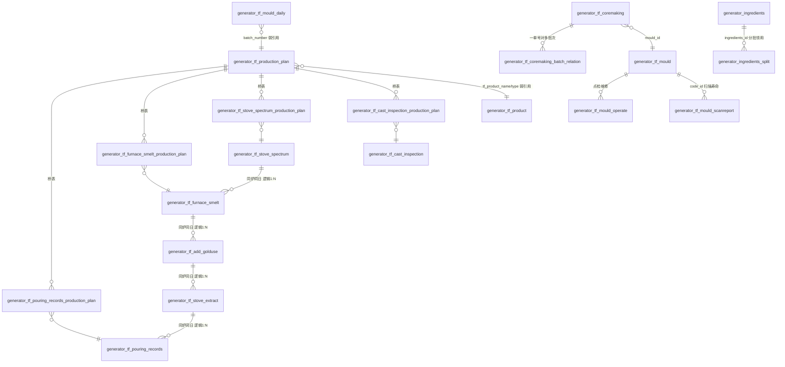

# TF铸造模块 · fuadmin 数据字典
> 域: 02-生产铸造域 | 表数: 31 | 用途: Agent基础文件 | 生成: 2026-07-23

# tf-TF铸造 模块概述

TF铸造模块覆盖铸造产线「制芯 → 造型 → 熔炼配料 → 浇铸 → 打箱/后处理检验」全流程，是治通MES中数据量最大、IoT采集最多的生产执行模块（31表，炉台功率采集表达86万行）。模块以「批次」为核心管理单元：生产计划单（generator_tf_production_plan）按批次号下达，熔炼、加合金、出炉、浇铸、金相、抗拉等炉前/炉后记录通过 7 张 `*_production_plan` 桥表与批次多对多关联；制芯环节另以 `generator_tf_coremaking_batch_relation` 维护「一单号对多批次」的批次号关联。上游对接生产计划/排程与产品主数据（tf_product、product-产品），下游为质量域提供金相、抗拉强度、硬度等材质检验证据，并把不良结果回流 bad-不良品模块。模块同时承载模具台账与寿命管理（mould/mould_daily/mould_scanreport）、炉料辅料库存与分批领用（ingredients/ingredients_split），以及电炉功率、倾转浇包角度、铁水转运车三类 IoT 采集数据。

# tf-TF铸造 上岗指南

## 2.1 核心实体表（TOP 8）

| # | 表 | 角色 | 一句话 |
|---|----|------|--------|
| 1 | generator_tf_production_plan | 批次计划单 | 铸造生产计划/批次单：批次号、产品、计划/实际产量、状态 |
| 2 | generator_tf_coremaking | 制芯主表 | 砂芯生产记录：芯号、模具、验收、异常申报 |
| 3 | generator_tf_coremaking_batch_relation | 批次关联锚点 | 制芯管理-批次号关联表（一批次对一单号，一单号对多批次） |
| 4 | generator_tf_pouring_records | 浇铸记录 | 浇铸温度、浇包数、不良数，按日期+炉号+序号唯一 |
| 5 | generator_tf_furnace_smelt | 熔炼光谱 | 炉前光谱成分（C/Si/Mn/Cu/Sn/Cr/P/S/Mg），按状态分段 |
| 6 | generator_tf_stove_spectrum | 炉料配料 | 生铁/废钢/回炉料/增碳剂/合金配比（每炉一条） |
| 7 | generator_tf_mould_daily | 造型日报 | 造型机台日报：模具号、批次、砂型硬度、压力、滤网 |
| 8 | generator_ingredients(+_split) | 炉料库存 | 炉料/辅料入库主表 + 分批拆分领用（条码级） |

> 配套：7 张 `*_production_plan` 桥表把加合金/熔炼/出炉/配料/浇铸/快金相/抗拉/铸件检验记录挂到批次单上，是跨表追溯的高速公路。

## 2.2 核心业务流

```
计划下达 (tf_production_plan: 批次号 batch_number)
  → 制芯 (tf_coremaking + coremaking_batch_relation 批次关联)
  → 造型 (tf_mould_daily: 砂型硬度/上下模/压力)
  → 熔炼 (tf_stove_spectrum 配料 → tf_furnace_smelt 光谱 → tf_add_golduse 球化/孕育 → tf_stove_extract 出炉)
  → 炉前快检 (tf_rapid_goldtest 球化率)
  → 浇铸 (tf_pouring_records + IoT: tilt_information 倾转角度 / transfer_cart 转运称重)
  → 打箱后处理 → 材质检验 (tf_cast_inspection 金相硬度 / tf_tensile_strength 抗拉)
```

旁路：模具生命周期（tf_mould 台账 → tf_mould_operate 点检维修 → tf_mould_scanreport 扫描寿命）；炉况日报 tf_furnace_situation；电炉功率采集 tf_furnace_power_display；炉料库存 ingredients / ingredients_split。

## 2.3 典型查询场景（含 SQL）

**① 某日批次计划与达成率**
```sql
SELECT batch_number, tf_product_name, tf_product_type, heat_number,
       planned_production, actual_production, batch_status
FROM generator_tf_production_plan
WHERE date = '2024-10-06' ORDER BY serial_number;
```

**② 某批次浇铸温度明细（经桥表）**
```sql
SELECT p.batch_number, r.furnace_number, r.number,
       r.first_temper, r.last_temper, r.pouring_temper, r.bad_number
FROM generator_tf_pouring_records r
JOIN generator_tf_pouring_records_production_plan bp ON bp.tfpouringrecords_id = r.id
JOIN generator_tf_production_plan p ON p.id = bp.productionplan_id
WHERE p.batch_number = 'RA5-2-333333' ORDER BY r.number;
```

**③ 批次→熔炼光谱成分追溯（材质复盘）**
```sql
SELECT p.batch_number, s.state, s.spectrum_C, s.spectrum_Si, s.spectrum_Mn,
       s.spectrum_Cu, s.spectrum_Mg, s.spectrum_S
FROM generator_tf_furnace_smelt s
JOIN generator_tf_furnace_smelt_production_plan bp ON bp.tffurnacesmelt_id = s.id
JOIN generator_tf_production_plan p ON p.id = bp.productionplan_id
WHERE p.batch_number = 'RA5-2-333333' ORDER BY s.state;
```

**④ 制芯单→批次号关联（一单号对多批次）**
```sql
SELECT c.id AS coremaking_id, c.core_number, c.tf_product_name,
       r.batch_number
FROM generator_tf_coremaking c
JOIN generator_tf_coremaking_batch_relation r ON r.coremaking_id = c.id
WHERE c.id = 284;
```

**⑤ 某炉某日的配料单（炉料配比）**
```sql
SELECT pig_iron, scrap, return_material, carburizers,
       si_iron, mn_iron, cu, sn, ferrochrome
FROM generator_tf_stove_spectrum
WHERE date_only = '2024-10-06' AND furnace_number = 1;
```

**⑥ 批次材质检验证据链（金相 + 抗拉）**
```sql
SELECT p.batch_number,
       ci.ball_rate, ci.pearlite, ci.measured_hardness, ci.type,
       ts.resist_strength, ts.most_strength, ts.elongation
FROM generator_tf_production_plan p
LEFT JOIN generator_tf_cast_inspection_production_plan cib ON cib.productionplan_id = p.id
LEFT JOIN generator_tf_cast_inspection ci ON ci.id = cib.tfcastinspection_id
LEFT JOIN generator_tf_tensile_strength_production_plan tsb ON tsb.productionplan_id = p.id
LEFT JOIN generator_tf_tensile_strength ts ON ts.id = tsb.tftensilestrength_id
WHERE p.batch_number = 'RA5-2-333333';
```

**⑦ 模具寿命监控（台账累计 vs 扫描报告）**
```sql
SELECT m.mould_number, m.code, m.type, m.product_name, m.sum_count,
       (SELECT MAX(sr.sum_count) FROM generator_tf_mould_scanreport sr WHERE sr.code_id = m.id) AS scan_latest
FROM generator_tf_mould m ORDER BY m.sum_count DESC LIMIT 20;
```

**⑧ 电炉功率曲线（IoT 采集）**
```sql
SELECT date, total_instantaneous_power, total_power
FROM generator_tf_furnace_power_display
WHERE date BETWEEN '2024-11-15 22:00:00' AND '2024-11-15 23:00:00'
ORDER BY date;
```

## 2.4 避坑提示

1. **批次-单号多对多边界**：锚点语义在 `coremaking_batch_relation` 注释——「一批次对一单号，一单号对多批次」。制芯批次号 ≠ `tf_production_plan.batch_number`（批次计划单号）；前者经 `batch_number` 字符串与主页关联，join 前先确认口径。
2. **同构桥表陷阱**：7 张 `*_production_plan` 结构完全一致（`tfX_id + productionplan_id`，联合唯一），行数高度趋同（≈8005/16010），说明同一批次挂在多条炉次记录上；误把桥表当业务表统计会重复计数。
3. **唯一键即粒度**：加合金/浇铸/出炉按 `(date_only, furnace_number, number)` 唯一；熔炼光谱按 `(date_only, furnace_number, state)`；金相/配料/抗拉按 `(date_only, furnace_number)`——upsert 与去重以此为准。
4. **furnace_number 类型不一致**：多数表为 int，但 `furnace_situation` 是 varchar（值如 'B'/'C'）、`tensile_strength` 是 decimal(13,4)、`tilt_information` 是 varchar——跨表 join 需 CAST，否则隐式转换踩坑。
5. **IoT 表数据质量差**：`tilt_information`、`transfer_cart` 样本大量为空白 padded 字符串，`furnace_power_display` 功率也是 varchar 定长填充——取值前 `TRIM` + 空串判空。
6. **tfdl 语义待确认**：仅 9 行，`input_2/3/4` 无注释（疑为电耗/产量统计录入），使用前必须找业务确认。
7. **迁移掩码字段**：`_MASK_FROM_V2/_MASK_TO_V2` 为 V2 数据迁移痕迹，无业务含义，建模忽略。
8. **人员字段冗余**：`modifier/handlers/checkout_u` 等存的是「工号+姓名」字符串（已脱敏），关联员工请走 `creator_id → system_users.id`，别解析字符串。

## 3 数据字典

### generator_tf_add_golduse（约 16127 行）
业务定义: 炉前球化剂/孕育剂加入量记录（盖包数、孕育、球化） ｜ 表注释: -

| 字段 | 类型 | 可空 | 键 | 原始注释 | 推断语义 | 置信度 |
|---|---|---|---|---|---|---|
| id | bigint | N | PRI | - | 主键ID | high |
| remark | varchar(255) | Y | - | - | 备注 | high |
| modifier | varchar(255) | Y | - | - | 最后修改人姓名 | high |
| belong_dept | int | Y | - | - | 所属部门ID | mid |
| update_datetime | datetime(6) | Y | - | - | 最后更新时间 | high |
| create_datetime | datetime(6) | Y | - | - | 创建时间 | high |
| sort | int | Y | - | - | 排序号 | high |
| cover | int | Y | - | - | 数值字段[推断-待确认] | low |
| pregnanter | decimal(5,2) | Y | - | - | 数值（小数）[推断-待确认] | low |
| baller | decimal(5,2) | Y | - | - | 数值（小数）[推断-待确认] | low |
| date_time | datetime(6) | Y | - | - | 时间[推断] | high |
| number | int | Y | - | - | 编号/代码[推断] | mid |
| furnace_number | int | Y | - | - | 编号/代码[推断] | mid |
| creator_id | bigint | Y | MUL | - | 创建人ID → system_users.id | high |
| date_only | date | Y | MUL | - | 日期时间[推断] | mid |

### generator_tf_add_golduse_production_plan（约 16010 行）
业务定义: 加合金记录与生产批次计划的多对多桥表 ｜ 表注释: -

| 字段 | 类型 | 可空 | 键 | 原始注释 | 推断语义 | 置信度 |
|---|---|---|---|---|---|---|
| id | bigint | N | PRI | - | 主键ID | high |
| tfaddgolduse_id | bigint | N | MUL | - | 关联ID（目标表待确认）[推断] | low |
| productionplan_id | bigint | N | MUL | - | 关联ID（目标表待确认）[推断] | low |

### generator_tf_cast_inspection（约 8052 行）
业务定义: 铸件金相与硬度检验记录（碳化物/珠光体/球化率） ｜ 表注释: -

| 字段 | 类型 | 可空 | 键 | 原始注释 | 推断语义 | 置信度 |
|---|---|---|---|---|---|---|
| id | bigint | N | PRI | - | 主键ID | high |
| remark | varchar(255) | Y | - | - | 备注 | high |
| modifier | varchar(255) | Y | - | - | 最后修改人姓名 | high |
| belong_dept | int | Y | - | - | 所属部门ID | mid |
| update_datetime | datetime(6) | Y | - | - | 最后更新时间 | high |
| create_datetime | datetime(6) | Y | - | - | 创建时间 | high |
| sort | int | Y | - | - | 排序号 | high |
| inspectors | varchar(30) | Y | - | - | 检验员[推断] | mid |
| carbide | decimal(5,2) | Y | - | - | 数值（小数）[推断-待确认] | low |
| pearlite | decimal(5,2) | Y | - | - | 数值（小数）[推断-待确认] | low |
| ball_rate | decimal(5,2) | Y | - | - | 比率/百分比[推断] | high |
| type | varchar(30) | Y | - | - | 类型[推断] | mid |
| measured_hardness | int | Y | - | - | 硬度[推断] | mid |
| creator_id | bigint | Y | MUL | - | 创建人ID → system_users.id | high |
| furnace_number | int | Y | - | - | 编号/代码[推断] | mid |
| date_only | date | Y | MUL | - | 日期时间[推断] | mid |
| date_time | datetime(6) | Y | - | - | 时间[推断] | high |

### generator_tf_cast_inspection_production_plan（约 8005 行）
业务定义: 铸件检验记录与生产批次计划的多对多桥表 ｜ 表注释: -

| 字段 | 类型 | 可空 | 键 | 原始注释 | 推断语义 | 置信度 |
|---|---|---|---|---|---|---|
| id | bigint | N | PRI | - | 主键ID | high |
| tfcastinspection_id | bigint | N | MUL | - | 关联ID（目标表待确认）[推断] | low |
| productionplan_id | bigint | N | MUL | - | 关联ID（目标表待确认）[推断] | low |

### generator_tf_coremaking（约 1347 行）
业务定义: 制芯管理主表：砂芯生产、验收、异常申报 ｜ 表注释: -

| 字段 | 类型 | 可空 | 键 | 原始注释 | 推断语义 | 置信度 |
|---|---|---|---|---|---|---|
| id | bigint | N | PRI | - | 主键ID | high |
| remark | varchar(255) | Y | - | - | 备注 | high |
| modifier | varchar(255) | Y | - | - | 最后修改人姓名 | high |
| belong_dept | int | Y | - | - | 所属部门ID | mid |
| update_datetime | datetime(6) | Y | - | - | 最后更新时间 | high |
| create_datetime | datetime(6) | Y | - | - | 创建时间 | high |
| sort | int | Y | - | - | 排序号 | high |
| use_log | json | Y | - | - | 待确认 | low |
| bake_log | json | Y | - | - | 待确认 | low |
| remaining_qty | int | Y | - | - | 数量[推断] | high |
| checkout_time | datetime(6) | Y | - | - | 时间[推断] | high |
| chromatism | int | Y | - | - | 数值字段[推断-待确认] | low |
| bad_seam | varchar(20) | Y | - | - | 文本字段[推断-待确认] | low |
| checkout_u | varchar(30) | Y | - | - | 文本字段[推断-待确认] | low |
| temper | int | Y | - | - | 数值字段[推断-待确认] | low |
| handlers | varchar(30) | Y | - | - | 文本字段[推断-待确认] | low |
| number | int | Y | - | - | 编号/代码[推断] | mid |
| crusting | int | Y | - | - | 数值字段[推断-待确认] | low |
| incrustation | int | Y | - | - | 工位/站点[推断] | mid |
| date_time | date | Y | - | - | 时间[推断] | high |
| sand_count_id | bigint | Y | MUL | - | 关联ID（目标表待确认）[推断] | low |
| device_code | varchar(50) | Y | - | - | 编号/代码[推断] | mid |
| tf_product_name | varchar(30) | Y | - | - | 名称[推断] | high |
| core_number | varchar(50) | Y | - | - | 编号/代码[推断] | mid |
| creator_id | bigint | Y | MUL | - | 创建人ID → system_users.id | high |
| production_date | varchar(60) | Y | - | - | 日期[推断] | high |
| mould_id | bigint | Y | MUL | - | 关联ID → generator_tf_mould.id[推断] | mid |
| _MASK_FROM_V2 | timestamp | N | MUL | - | 待确认 | low |
| exception_declaration | varchar(255) | Y | - | - | 文本字段[推断-待确认] | low |
| picture | json | Y | - | - | 图片路径[推断] | mid |

### generator_tf_coremaking_batch_relation（约 1307 行）
业务定义: 制芯-批次号关联表（一批次对一单号，一单号对多批次） ｜ 表注释: 制芯管理-批次号关联表（一批次对一单号，一单号对多批次）

| 字段 | 类型 | 可空 | 键 | 原始注释 | 推断语义 | 置信度 |
|---|---|---|---|---|---|---|
| id | bigint | N | PRI | 主键ID | 主键ID（原注释） | high |
| batch_number | varchar(120) | N | UNI | 批次号（与主页关联） | 批次号（与主页关联）（原注释） | high |
| coremaking_id | bigint | N | MUL | 关联制芯管理主表ID | 关联制芯管理主表ID（原注释） | high |
| create_datetime | datetime | N | - | 创建时间（继承CoreModel） | 创建时间（继承CoreModel）（原注释） | high |

### generator_tf_furnace_power_display（约 864008 行）
业务定义: 电炉A/B/C/D四路瞬时功率IoT采集展示 ｜ 表注释: -

| 字段 | 类型 | 可空 | 键 | 原始注释 | 推断语义 | 置信度 |
|---|---|---|---|---|---|---|
| id | bigint | N | PRI | - | 主键ID | high |
| remark | varchar(255) | Y | - | - | 备注 | high |
| modifier | varchar(255) | Y | - | - | 最后修改人姓名 | high |
| belong_dept | int | Y | - | - | 所属部门ID | mid |
| update_datetime | datetime(6) | Y | - | - | 最后更新时间 | high |
| create_datetime | datetime(6) | Y | - | - | 创建时间 | high |
| sort | int | Y | - | - | 排序号 | high |
| Instantaneous_power_of_furnace_D | varchar(255) | Y | - | - | 熔炉[推断] | mid |
| Instantaneous_power_of_furnace_C | varchar(255) | Y | - | - | 熔炉[推断] | mid |
| Instantaneous_power_of_furnace_B | varchar(255) | Y | - | - | 熔炉[推断] | mid |
| Instantaneous_power_of_furnace_A | varchar(255) | Y | - | - | 熔炉[推断] | mid |
| total_instantaneous_power | varchar(255) | Y | - | - | 累计/合计[推断] | high |
| date | datetime(6) | Y | - | - | 日期[推断] | high |
| creator_id | bigint | Y | MUL | - | 创建人ID → system_users.id | high |
| _MASK_TO_V2 | bigint | Y | MUL | - | 数值字段[推断-待确认] | low |
| total_power | varchar(255) | Y | - | - | 累计/合计[推断] | high |

### generator_tf_furnace_situation（约 1152 行）
业务定义: 炉况日报：炉壁厚度/深度测量与异常生产情况 ｜ 表注释: -

| 字段 | 类型 | 可空 | 键 | 原始注释 | 推断语义 | 置信度 |
|---|---|---|---|---|---|---|
| id | bigint | N | PRI | - | 主键ID | high |
| remark | varchar(255) | Y | - | - | 备注 | high |
| modifier | varchar(255) | Y | - | - | 最后修改人姓名 | high |
| belong_dept | int | Y | - | - | 所属部门ID | mid |
| update_datetime | datetime(6) | Y | - | - | 最后更新时间 | high |
| create_datetime | datetime(6) | Y | - | - | 创建时间 | high |
| sort | int | Y | - | - | 排序号 | high |
| abnormal_production_situation | varchar(255) | Y | - | - | 产品[推断] | high |
| furnace_information | varchar(255) | Y | - | - | 熔炉[推断] | mid |
| date | date | Y | - | - | 日期[推断] | high |
| creator_id | bigint | Y | MUL | - | 创建人ID → system_users.id | high |
| furnace_number | varchar(10) | Y | - | - | 编号/代码[推断] | mid |
| wall_thickness | double | Y | - | - | 数值（小数）[推断-待确认] | low |
| depth | double | Y | - | - | 部门[推断] | high |

### generator_tf_furnace_smelt（约 15951 行）
业务定义: 炉前熔炼光谱成分记录（按state分段多次检测） ｜ 表注释: -

| 字段 | 类型 | 可空 | 键 | 原始注释 | 推断语义 | 置信度 |
|---|---|---|---|---|---|---|
| id | bigint | N | PRI | - | 主键ID | high |
| remark | varchar(255) | Y | - | - | 备注 | high |
| modifier | varchar(255) | Y | - | - | 最后修改人姓名 | high |
| belong_dept | int | Y | - | - | 所属部门ID | mid |
| update_datetime | datetime(6) | Y | - | - | 最后更新时间 | high |
| create_datetime | datetime(6) | Y | - | - | 创建时间 | high |
| sort | int | Y | - | - | 排序号 | high |
| carbon_Si | decimal(6,3) | Y | - | - | 数值（小数）[推断-待确认] | low |
| carbon_C | decimal(6,3) | Y | - | - | 数值（小数）[推断-待确认] | low |
| spectrum_Sn | decimal(6,3) | Y | - | - | 光谱Sn含量（%）[推断] | mid |
| spectrum_Mg | decimal(6,3) | Y | - | - | 光谱Mg含量（%）[推断] | mid |
| spectrum_Cu | decimal(6,3) | Y | - | - | 光谱Cu含量（%）[推断] | mid |
| spectrum_Mn | decimal(6,3) | Y | - | - | 光谱Mn含量（%）[推断] | mid |
| spectrum_Si | decimal(6,3) | Y | - | - | 光谱Si含量（%）[推断] | mid |
| spectrum_C | decimal(6,3) | Y | - | - | 光谱C含量（%）[推断] | mid |
| date_time | datetime(6) | Y | - | - | 时间[推断] | high |
| state | int | Y | - | - | 状态（枚举值待确认）[推断] | mid |
| furnace_number | int | Y | - | - | 编号/代码[推断] | mid |
| creator_id | bigint | Y | MUL | - | 创建人ID → system_users.id | high |
| date_only | date | Y | MUL | - | 日期时间[推断] | mid |
| spectrum_Cr | decimal(6,3) | Y | - | - | 光谱Cr含量（%）[推断] | mid |
| spectrum_P | decimal(6,3) | Y | - | - | 光谱P含量（%）[推断] | mid |
| spectrum_S | decimal(6,3) | Y | - | - | 光谱S含量（%）[推断] | mid |

### generator_tf_furnace_smelt_production_plan（约 16367 行）
业务定义: 熔炼光谱记录与生产批次计划的多对多桥表 ｜ 表注释: -

| 字段 | 类型 | 可空 | 键 | 原始注释 | 推断语义 | 置信度 |
|---|---|---|---|---|---|---|
| id | bigint | N | PRI | - | 主键ID | high |
| tffurnacesmelt_id | bigint | N | MUL | - | 关联ID（目标表待确认）[推断] | low |
| productionplan_id | bigint | N | MUL | - | 关联ID（目标表待确认）[推断] | low |

### generator_tf_mould（约 39 行）
业务定义: 铸造模具台账（芯盒/外模），累计使用次数 ｜ 表注释: -

| 字段 | 类型 | 可空 | 键 | 原始注释 | 推断语义 | 置信度 |
|---|---|---|---|---|---|---|
| id | bigint | N | PRI | - | 主键ID | high |
| remark | varchar(255) | Y | - | - | 备注 | high |
| modifier | varchar(255) | Y | - | - | 最后修改人姓名 | high |
| belong_dept | int | Y | - | - | 所属部门ID | mid |
| update_datetime | datetime(6) | Y | - | - | 最后更新时间 | high |
| create_datetime | datetime(6) | Y | - | - | 创建时间 | high |
| sort | int | Y | - | - | 排序号 | high |
| sum_count | int | Y | - | - | 数量[推断] | high |
| entry_time | date | Y | - | - | 录入时间[推断] | mid |
| manufacturers | varchar(255) | Y | - | - | 文本字段[推断-待确认] | low |
| code | varchar(255) | Y | - | - | 编号/代码[推断] | mid |
| type | varchar(255) | Y | - | - | 类型[推断] | mid |
| product_name | varchar(255) | Y | - | - | 名称[推断] | high |
| mould_number | varchar(255) | Y | - | - | 编号/代码[推断] | mid |
| creator_id | bigint | Y | MUL | - | 创建人ID → system_users.id | high |

### generator_tf_mould_daily（约 8712 行）
业务定义: 造型日报：模具号、批次、砂型硬度、压力、滤网 ｜ 表注释: -

| 字段 | 类型 | 可空 | 键 | 原始注释 | 推断语义 | 置信度 |
|---|---|---|---|---|---|---|
| id | bigint | N | PRI | - | 主键ID | high |
| remark | varchar(255) | Y | - | - | 备注 | high |
| modifier | varchar(255) | Y | - | - | 最后修改人姓名 | high |
| belong_dept | int | Y | - | - | 所属部门ID | mid |
| update_datetime | datetime(6) | Y | - | - | 最后更新时间 | high |
| create_datetime | datetime(6) | Y | - | - | 创建时间 | high |
| sort | int | Y | - | - | 排序号 | high |
| mould_confirmation | int | Y | - | - | 模具[推断] | high |
| stop_statistics | longtext | Y | - | - | 待确认 | low |
| updown_model | int | Y | - | - | 规格/型号[推断] | mid |
| mould_number | int | Y | - | - | 编号/代码[推断] | mid |
| batch_number | varchar(30) | Y | - | - | 单号/编号[推断] | high |
| tf_product_type | varchar(30) | Y | - | - | 类型[推断] | mid |
| time | int | Y | - | - | 时间[推断] | high |
| tf_product_name | varchar(30) | Y | - | - | 名称[推断] | high |
| serial_number | int | Y | - | - | 单号/编号[推断] | high |
| mould_worker | varchar(50) | Y | - | - | 模具[推断] | high |
| work_date | datetime(6) | Y | - | - | 日期[推断] | high |
| classes | varchar(30) | Y | - | - | 文本字段[推断-待确认] | low |
| creator_id | bigint | Y | MUL | - | 创建人ID → system_users.id | high |
| mold_release | decimal(8,2) | Y | - | - | 模具[推断] | high |
| strainer | decimal(8,2) | Y | - | - | 数值（小数）[推断-待确认] | low |
| hardness_down | int | Y | - | - | 硬度[推断] | mid |
| hardness_up | int | Y | - | - | 硬度上限[推断] | mid |
| height_down | int | Y | - | - | 数值字段[推断-待确认] | low |
| height_up | int | Y | - | - | 数值字段[推断-待确认] | low |
| press_down | decimal(4,2) | Y | - | - | 数值（小数）[推断-待确认] | low |
| press_up | decimal(4,2) | Y | - | - | 数值（小数）[推断-待确认] | low |
| strainer_filter | varchar(50) | Y | - | - | 文本字段[推断-待确认] | low |
| _MASK_TO_V2 | bigint | Y | MUL | - | 数值字段[推断-待确认] | low |

### generator_tf_mould_operate（约 3596 行）
业务定义: 模具点检/维修操作记录（含照片） ｜ 表注释: -

| 字段 | 类型 | 可空 | 键 | 原始注释 | 推断语义 | 置信度 |
|---|---|---|---|---|---|---|
| id | bigint | N | PRI | - | 主键ID | high |
| remark | varchar(255) | Y | - | - | 备注 | high |
| modifier | varchar(255) | Y | - | - | 最后修改人姓名 | high |
| belong_dept | int | Y | - | - | 所属部门ID | mid |
| update_datetime | datetime(6) | Y | - | - | 最后更新时间 | high |
| create_datetime | datetime(6) | Y | - | - | 创建时间 | high |
| sort | int | Y | - | - | 排序号 | high |
| number | varchar(255) | Y | - | - | 编号/代码[推断] | mid |
| date_time | varchar(255) | Y | - | - | 时间[推断] | high |
| type | varchar(255) | Y | - | - | 类型[推断] | mid |
| mould_id | bigint | Y | MUL | - | 关联ID → generator_tf_mould.id[推断] | mid |
| creator_id | bigint | Y | MUL | - | 创建人ID → system_users.id | high |
| img | varchar(255) | Y | - | - | 文本字段[推断-待确认] | low |

### generator_tf_mould_scanreport（约 67 行）
业务定义: 模具扫描报告：寿命次数与报告文件存档 ｜ 表注释: -

| 字段 | 类型 | 可空 | 键 | 原始注释 | 推断语义 | 置信度 |
|---|---|---|---|---|---|---|
| id | bigint | N | PRI | - | 主键ID | high |
| remark | varchar(255) | Y | - | - | 备注 | high |
| modifier | varchar(255) | Y | - | - | 最后修改人姓名 | high |
| belong_dept | int | Y | - | - | 所属部门ID | mid |
| update_datetime | datetime(6) | Y | - | - | 最后更新时间 | high |
| create_datetime | datetime(6) | Y | - | - | 创建时间 | high |
| sort | int | Y | - | - | 排序号 | high |
| scan_report | varchar(255) | Y | - | - | 文本字段[推断-待确认] | low |
| scan_date | date | Y | - | - | 日期[推断] | high |
| code_id | bigint | Y | MUL | - | 关联ID → generator_job_code.id[推断] | mid |
| creator_id | bigint | Y | MUL | - | 创建人ID → system_users.id | high |
| sum_count | int | Y | - | - | 数量[推断] | high |

### generator_tf_pouring_records（约 15771 行）
业务定义: 浇铸记录：首末浇温、浇包数、不良数 ｜ 表注释: -

| 字段 | 类型 | 可空 | 键 | 原始注释 | 推断语义 | 置信度 |
|---|---|---|---|---|---|---|
| id | bigint | N | PRI | - | 主键ID | high |
| remark | varchar(255) | Y | - | - | 备注 | high |
| modifier | varchar(255) | Y | - | - | 最后修改人姓名 | high |
| belong_dept | int | Y | - | - | 所属部门ID | mid |
| update_datetime | datetime(6) | Y | - | - | 最后更新时间 | high |
| create_datetime | datetime(6) | Y | - | - | 创建时间 | high |
| sort | int | Y | - | - | 排序号 | high |
| bad_number | int | Y | - | - | 编号/代码[推断] | mid |
| last_temper | int | Y | - | - | 数值字段[推断-待确认] | low |
| first_temper | int | Y | - | - | 数值字段[推断-待确认] | low |
| pouring_temper | int | Y | - | - | 数值字段[推断-待确认] | low |
| pouring_number | int | Y | - | - | 编号/代码[推断] | mid |
| number | int | Y | - | - | 编号/代码[推断] | mid |
| date_time | datetime(6) | Y | - | - | 时间[推断] | high |
| furnace_number | int | Y | - | - | 编号/代码[推断] | mid |
| creator_id | bigint | Y | MUL | - | 创建人ID → system_users.id | high |
| date_only | date | Y | MUL | - | 日期时间[推断] | mid |

### generator_tf_pouring_records_production_plan（约 16010 行）
业务定义: 浇铸记录与生产批次计划的多对多桥表 ｜ 表注释: -

| 字段 | 类型 | 可空 | 键 | 原始注释 | 推断语义 | 置信度 |
|---|---|---|---|---|---|---|
| id | bigint | N | PRI | - | 主键ID | high |
| tfpouringrecords_id | bigint | N | MUL | - | 关联ID（目标表待确认）[推断] | low |
| productionplan_id | bigint | N | MUL | - | 关联ID（目标表待确认）[推断] | low |

### generator_tf_product（约 21 行）
业务定义: 铸造产品主数据：牌号、单重、硬度范围 ｜ 表注释: -

| 字段 | 类型 | 可空 | 键 | 原始注释 | 推断语义 | 置信度 |
|---|---|---|---|---|---|---|
| id | bigint | N | PRI | - | 主键ID | high |
| remark | varchar(255) | Y | - | - | 备注 | high |
| modifier | varchar(255) | Y | - | - | 最后修改人姓名 | high |
| belong_dept | int | Y | - | - | 所属部门ID | mid |
| update_datetime | datetime(6) | Y | - | - | 最后更新时间 | high |
| create_datetime | datetime(6) | Y | - | - | 创建时间 | high |
| sort | int | Y | - | - | 排序号 | high |
| is_active | int | Y | - | - | 标志位（布尔）[推断] | mid |
| weight | decimal(10,2) | Y | - | - | 重量[推断] | high |
| code | varchar(30) | Y | - | - | 编号/代码[推断] | mid |
| type | varchar(30) | Y | - | - | 类型[推断] | mid |
| name | varchar(30) | Y | - | - | 名称[推断] | high |
| creator_id | bigint | Y | MUL | - | 创建人ID → system_users.id | high |
| number | int | Y | - | - | 编号/代码[推断] | mid |
| rigidity_range | varchar(40) | Y | - | - | 文本字段[推断-待确认] | low |

### generator_tf_production_plan（约 8089 行）
业务定义: 铸造生产批次计划单：批次号、计划/实际产量、状态 ｜ 表注释: -

| 字段 | 类型 | 可空 | 键 | 原始注释 | 推断语义 | 置信度 |
|---|---|---|---|---|---|---|
| id | bigint | N | PRI | - | 主键ID | high |
| modifier | varchar(255) | Y | - | - | 最后修改人姓名 | high |
| belong_dept | int | Y | - | - | 所属部门ID | mid |
| update_datetime | datetime(6) | Y | - | - | 最后更新时间 | high |
| create_datetime | datetime(6) | Y | - | - | 创建时间 | high |
| sort | int | Y | - | - | 排序号 | high |
| planned_production | int | Y | - | - | 产品[推断] | high |
| remark | varchar(255) | Y | - | - | 备注 | high |
| batch_number | varchar(30) | Y | - | - | 单号/编号[推断] | high |
| serial_number | int | Y | - | - | 单号/编号[推断] | high |
| date | date | Y | - | - | 日期[推断] | high |
| creator_id | bigint | Y | MUL | - | 创建人ID → system_users.id | high |
| production_number | varchar(255) | Y | - | - | 编号/代码[推断] | mid |
| actual_production | int | Y | - | - | 实际值[推断] | high |
| batch_status | int | Y | - | - | 状态（枚举值待确认）[推断] | mid |
| error | int | Y | - | - | 数值字段[推断-待确认] | low |
| explain | varchar(255) | Y | - | - | 文本字段[推断-待确认] | low |
| first_temper | int | Y | - | - | 数值字段[推断-待确认] | low |
| last_temper | int | Y | - | - | 数值字段[推断-待确认] | low |
| mode_clean | int | Y | - | - | 数值字段[推断-待确认] | low |
| quality_signature | varchar(30) | Y | - | - | 质量签名[推断] | mid |
| responser | varchar(30) | Y | - | - | 文本字段[推断-待确认] | low |
| tf_product_name | varchar(30) | Y | - | - | 名称[推断] | high |
| tf_product_type | varchar(30) | Y | - | - | 类型[推断] | mid |
| heat_number | varchar(50) | Y | - | - | 编号/代码[推断] | mid |
| filter_size | varchar(20) | Y | - | - | 尺寸[推断] | mid |
| _MASK_FROM_V2 | timestamp | N | MUL | - | 待确认 | low |

### generator_tf_rapid_goldtest（约 7807 行）
业务定义: 炉前快速金相检测（一次/二次球化率） ｜ 表注释: -

| 字段 | 类型 | 可空 | 键 | 原始注释 | 推断语义 | 置信度 |
|---|---|---|---|---|---|---|
| id | bigint | N | PRI | - | 主键ID | high |
| remark | varchar(255) | Y | - | - | 备注 | high |
| modifier | varchar(255) | Y | - | - | 最后修改人姓名 | high |
| belong_dept | int | Y | - | - | 所属部门ID | mid |
| update_datetime | datetime(6) | Y | - | - | 最后更新时间 | high |
| create_datetime | datetime(6) | Y | - | - | 创建时间 | high |
| sort | int | Y | - | - | 排序号 | high |
| two_ball | decimal(4,3) | Y | - | - | 数值（小数）[推断-待确认] | low |
| one_ball | decimal(4,3) | Y | - | - | 数值（小数）[推断-待确认] | low |
| size | varchar(30) | Y | - | - | 尺寸[推断] | mid |
| date_time | datetime(6) | Y | - | - | 时间[推断] | high |
| furnace_number | int | Y | - | - | 编号/代码[推断] | mid |
| creator_id | bigint | Y | MUL | - | 创建人ID → system_users.id | high |
| date_only | date | Y | MUL | - | 日期时间[推断] | mid |

### generator_tf_rapid_goldtest_production_plan（约 8005 行）
业务定义: 快速金相记录与生产批次计划的多对多桥表 ｜ 表注释: -

| 字段 | 类型 | 可空 | 键 | 原始注释 | 推断语义 | 置信度 |
|---|---|---|---|---|---|---|
| id | bigint | N | PRI | - | 主键ID | high |
| tfrapidgoldtest_id | bigint | N | MUL | - | 关联ID（目标表待确认）[推断] | low |
| productionplan_id | bigint | N | MUL | - | 关联ID（目标表待确认）[推断] | low |

### generator_tf_stove_extract（约 16045 行）
业务定义: 出炉记录：出铁时间、球化处理时间、出铁量、温度 ｜ 表注释: -

| 字段 | 类型 | 可空 | 键 | 原始注释 | 推断语义 | 置信度 |
|---|---|---|---|---|---|---|
| id | bigint | N | PRI | - | 主键ID | high |
| remark | varchar(255) | Y | - | - | 备注 | high |
| modifier | varchar(255) | Y | - | - | 最后修改人姓名 | high |
| belong_dept | int | Y | - | - | 所属部门ID | mid |
| update_datetime | datetime(6) | Y | - | - | 最后更新时间 | high |
| create_datetime | datetime(6) | Y | - | - | 创建时间 | high |
| sort | int | Y | - | - | 排序号 | high |
| pour_time | datetime(6) | Y | - | - | 时间[推断] | high |
| ball_time | int | Y | - | - | 时间[推断] | high |
| sum | int | Y | - | - | 数值字段[推断-待确认] | low |
| temper | int | Y | - | - | 数值字段[推断-待确认] | low |
| date_time | datetime(6) | Y | - | - | 时间[推断] | high |
| number | int | Y | - | - | 编号/代码[推断] | mid |
| furnace_number | int | Y | - | - | 编号/代码[推断] | mid |
| creator_id | bigint | Y | MUL | - | 创建人ID → system_users.id | high |
| date_only | date | Y | MUL | - | 日期时间[推断] | mid |

### generator_tf_stove_extract_production_plan（约 16010 行）
业务定义: 出炉记录与生产批次计划的多对多桥表 ｜ 表注释: -

| 字段 | 类型 | 可空 | 键 | 原始注释 | 推断语义 | 置信度 |
|---|---|---|---|---|---|---|
| id | bigint | N | PRI | - | 主键ID | high |
| tfstoveextract_id | bigint | N | MUL | - | 关联ID（目标表待确认）[推断] | low |
| productionplan_id | bigint | N | MUL | - | 关联ID（目标表待确认）[推断] | low |

### generator_tf_stove_spectrum（约 7755 行）
业务定义: 炉料配料单：生铁/废钢/回炉料/合金配比（每炉一条） ｜ 表注释: -

| 字段 | 类型 | 可空 | 键 | 原始注释 | 推断语义 | 置信度 |
|---|---|---|---|---|---|---|
| id | bigint | N | PRI | - | 主键ID | high |
| remark | varchar(255) | Y | - | - | 备注 | high |
| modifier | varchar(255) | Y | - | - | 最后修改人姓名 | high |
| belong_dept | int | Y | - | - | 所属部门ID | mid |
| update_datetime | datetime(6) | Y | - | - | 最后更新时间 | high |
| create_datetime | datetime(6) | Y | - | - | 创建时间 | high |
| sort | int | Y | - | - | 排序号 | high |
| sn | decimal(8,3) | Y | - | - | 序列号[推断] | high |
| cu | decimal(8,3) | Y | - | - | 数值（小数）[推断-待确认] | low |
| sic | decimal(8,3) | Y | - | - | 数值（小数）[推断-待确认] | low |
| mn_iron | decimal(8,3) | Y | - | - | 数值（小数）[推断-待确认] | low |
| si_iron | decimal(8,3) | Y | - | - | 数值（小数）[推断-待确认] | low |
| carburizers | decimal(8,3) | Y | - | - | 数值（小数）[推断-待确认] | low |
| scrap | decimal(8,3) | Y | - | - | 数值（小数）[推断-待确认] | low |
| pig_iron | decimal(8,3) | Y | - | - | 数值（小数）[推断-待确认] | low |
| return_material | decimal(8,3) | Y | - | - | 物料[推断] | high |
| iron | varchar(30) | Y | - | - | 文本字段[推断-待确认] | low |
| date_time | datetime(6) | Y | - | - | 时间[推断] | high |
| furnace_number | int | Y | - | - | 编号/代码[推断] | mid |
| creator_id | bigint | Y | MUL | - | 创建人ID → system_users.id | high |
| date_only | date | Y | MUL | - | 日期时间[推断] | mid |
| ferrochrome | decimal(8,3) | Y | - | - | 数值（小数）[推断-待确认] | low |
| iron_sulfide | decimal(8,3) | Y | - | - | 数值（小数）[推断-待确认] | low |

### generator_tf_stove_spectrum_production_plan（约 8005 行）
业务定义: 炉料配料单与生产批次计划的多对多桥表 ｜ 表注释: -

| 字段 | 类型 | 可空 | 键 | 原始注释 | 推断语义 | 置信度 |
|---|---|---|---|---|---|---|
| id | bigint | N | PRI | - | 主键ID | high |
| tfstovespectrum_id | bigint | N | MUL | - | 关联ID（目标表待确认）[推断] | low |
| productionplan_id | bigint | N | MUL | - | 关联ID（目标表待确认）[推断] | low |

### generator_tf_tensile_strength（约 7919 行）
业务定义: 抗拉强度试验记录：抗拉/屈服强度、延伸率 ｜ 表注释: -

| 字段 | 类型 | 可空 | 键 | 原始注释 | 推断语义 | 置信度 |
|---|---|---|---|---|---|---|
| id | bigint | N | PRI | - | 主键ID | high |
| remark | varchar(255) | Y | - | - | 备注 | high |
| modifier | varchar(255) | Y | - | - | 最后修改人姓名 | high |
| belong_dept | int | Y | - | - | 所属部门ID | mid |
| update_datetime | datetime(6) | Y | - | - | 最后更新时间 | high |
| create_datetime | datetime(6) | Y | - | - | 创建时间 | high |
| sort | int | Y | - | - | 排序号 | high |
| inspetion_person | varchar(255) | Y | - | - | 文本字段[推断-待确认] | low |
| elongation | decimal(13,4) | Y | - | - | 数值（小数）[推断-待确认] | low |
| most_strength | int | Y | - | - | 数值字段[推断-待确认] | low |
| resist_strength | int | Y | - | - | 数值字段[推断-待确认] | low |
| furnace_number | decimal(13,4) | Y | - | - | 编号/代码[推断] | mid |
| creator_id | bigint | Y | MUL | - | 创建人ID → system_users.id | high |
| date_only | date | Y | MUL | - | 日期时间[推断] | mid |
| date_time | datetime(6) | Y | - | - | 时间[推断] | high |

### generator_tf_tensile_strength_production_plan（约 8005 行）
业务定义: 抗拉试验记录与生产批次计划的多对多桥表 ｜ 表注释: -

| 字段 | 类型 | 可空 | 键 | 原始注释 | 推断语义 | 置信度 |
|---|---|---|---|---|---|---|
| id | bigint | N | PRI | - | 主键ID | high |
| tftensilestrength_id | bigint | N | MUL | - | 关联ID（目标表待确认）[推断] | low |
| productionplan_id | bigint | N | MUL | - | 关联ID（目标表待确认）[推断] | low |

### generator_tf_tilt_information（约 6147 行）
业务定义: 倾转浇包角度传感器IoT采集（角度/批次/炉号） ｜ 表注释: -

| 字段 | 类型 | 可空 | 键 | 原始注释 | 推断语义 | 置信度 |
|---|---|---|---|---|---|---|
| id | bigint | N | PRI | - | 主键ID | high |
| remark | varchar(255) | Y | - | - | 备注 | high |
| modifier | varchar(255) | Y | - | - | 最后修改人姓名 | high |
| belong_dept | int | Y | - | - | 所属部门ID | mid |
| update_datetime | datetime(6) | Y | - | - | 最后更新时间 | high |
| create_datetime | datetime(6) | Y | - | - | 创建时间 | high |
| sort | int | Y | - | - | 排序号 | high |
| angle_sensor_value | varchar(255) | Y | - | - | 文本字段[推断-待确认] | low |
| batch_number | varchar(255) | Y | - | - | 单号/编号[推断] | high |
| furnace_number | varchar(255) | Y | - | - | 编号/代码[推断] | mid |
| time | datetime(6) | Y | - | - | 时间[推断] | high |
| creator_id | bigint | Y | MUL | - | 创建人ID → system_users.id | high |
| _MASK_TO_V2 | bigint | Y | MUL | - | 数值字段[推断-待确认] | low |

### generator_tf_transfer_cart（约 13062 行）
业务定义: 铁水转运车称重与包次IoT采集记录 ｜ 表注释: -

| 字段 | 类型 | 可空 | 键 | 原始注释 | 推断语义 | 置信度 |
|---|---|---|---|---|---|---|
| id | bigint | N | PRI | - | 主键ID | high |
| remark | varchar(255) | Y | - | - | 备注 | high |
| modifier | varchar(255) | Y | - | - | 最后修改人姓名 | high |
| belong_dept | int | Y | - | - | 所属部门ID | mid |
| update_datetime | datetime(6) | Y | - | - | 最后更新时间 | high |
| create_datetime | datetime(6) | Y | - | - | 创建时间 | high |
| sort | int | Y | - | - | 排序号 | high |
| weight | varchar(255) | Y | - | - | 重量[推断] | high |
| package_count | varchar(255) | Y | - | - | 包数[推断] | high |
| batch_number | varchar(255) | Y | - | - | 单号/编号[推断] | high |
| furnace_number | varchar(255) | Y | - | - | 编号/代码[推断] | mid |
| time | datetime(6) | Y | - | - | 时间[推断] | high |
| creator_id | bigint | Y | MUL | - | 创建人ID → system_users.id | high |
| _MASK_TO_V2 | bigint | Y | MUL | - | 数值字段[推断-待确认] | low |

### generator_ingredients（约 660 行）
业务定义: 炉料/辅料库存主表：入库申请、厂商、预警配置 ｜ 表注释: -

| 字段 | 类型 | 可空 | 键 | 原始注释 | 推断语义 | 置信度 |
|---|---|---|---|---|---|---|
| id | bigint | N | PRI | - | 主键ID | high |
| remark | varchar(255) | Y | - | - | 备注 | high |
| modifier | varchar(255) | Y | - | - | 最后修改人姓名 | high |
| belong_dept | int | Y | - | - | 所属部门ID | mid |
| update_datetime | datetime(6) | Y | - | - | 最后更新时间 | high |
| create_datetime | datetime(6) | Y | - | - | 创建时间 | high |
| sort | int | Y | - | - | 排序号 | high |
| is_active | int | Y | - | - | 标志位（布尔）[推断] | mid |
| unit | varchar(20) | Y | - | - | 计量单位[推断] | high |
| number | decimal(10,2) | Y | - | - | 编号/代码[推断] | mid |
| manufacturer | varchar(30) | Y | - | - | 文本字段[推断-待确认] | low |
| stock_time | datetime(6) | Y | - | - | 时间[推断] | high |
| apply_time | datetime(6) | Y | - | - | 时间[推断] | high |
| i_class | varchar(20) | Y | - | - | 文本字段[推断-待确认] | low |
| name | varchar(30) | Y | - | - | 名称[推断] | high |
| ingredients_number | varchar(50) | Y | - | - | 编号/代码[推断] | mid |
| creator_id | bigint | Y | MUL | - | 创建人ID → system_users.id | high |
| use_dept | varchar(30) | Y | - | - | 部门[推断] | high |
| code | varchar(30) | Y | - | - | 编号/代码[推断] | mid |
| stock_code | varchar(40) | Y | - | - | 编号/代码[推断] | mid |
| alarm | json | Y | - | - | 待确认 | low |
| alarm_btn | tinyint(1) | Y | - | - | 数值字段[推断-待确认] | low |
| percentage | decimal(5,2) | Y | - | - | 比率/百分比[推断] | high |
| warning | json | Y | - | - | 待确认 | low |
| warning_btn | tinyint(1) | Y | - | - | 数值字段[推断-待确认] | low |
| PO | varchar(30) | Y | - | - | 文本字段[推断-待确认] | low |
| unit_price | decimal(11,4) | Y | - | - | 单价[推断] | high |
| grouping | tinyint(1) | Y | - | - | 数值字段[推断-待确认] | low |
| parent_id | bigint | Y | MUL | - | 关联ID（目标表待确认）[推断] | low |
| site | varchar(20) | Y | - | - | 站点[推断] | mid |

### generator_tfdl（约 9 行）
业务定义: 铸造电量/产量统计录入（input_2/3/4语义待确认） ｜ 表注释: -

| 字段 | 类型 | 可空 | 键 | 原始注释 | 推断语义 | 置信度 |
|---|---|---|---|---|---|---|
| id | bigint | N | PRI | - | 主键ID | high |
| remark | varchar(255) | Y | - | - | 备注 | high |
| modifier | varchar(255) | Y | - | - | 最后修改人姓名 | high |
| belong_dept | int | Y | - | - | 所属部门ID | mid |
| update_datetime | datetime(6) | Y | - | - | 最后更新时间 | high |
| create_datetime | datetime(6) | Y | - | - | 创建时间 | high |
| sort | int | Y | - | - | 排序号 | high |
| input_4 | varchar(255) | Y | - | - | 文本字段[推断-待确认] | low |
| input_3 | varchar(255) | Y | - | - | 文本字段[推断-待确认] | low |
| input_2 | varchar(255) | Y | - | - | 文本字段[推断-待确认] | low |
| date_picker_1 | date | Y | - | - | 日期时间[推断] | mid |
| creator_id | bigint | Y | MUL | - | 创建人ID → system_users.id | high |

### generator_ingredients_split（约 1849 行）
业务定义: 辅料分批拆分领用记录（条码级状态流转） ｜ 表注释: -

| 字段 | 类型 | 可空 | 键 | 原始注释 | 推断语义 | 置信度 |
|---|---|---|---|---|---|---|
| id | bigint | N | PRI | - | 主键ID | high |
| remark | varchar(255) | Y | - | - | 备注 | high |
| modifier | varchar(255) | Y | - | - | 最后修改人姓名 | high |
| belong_dept | int | Y | - | - | 所属部门ID | mid |
| update_datetime | datetime(6) | Y | - | - | 最后更新时间 | high |
| create_datetime | datetime(6) | Y | - | - | 创建时间 | high |
| sort | int | Y | - | - | 排序号 | high |
| stock | json | Y | - | - | 待确认 | low |
| entirety | int | Y | - | - | 数值字段[推断-待确认] | low |
| in_warehouse_user | varchar(20) | Y | - | - | 仓库[推断] | mid |
| in_warehouse_time | datetime(6) | Y | - | - | 时间[推断] | high |
| state | int | Y | - | - | 状态（枚举值待确认）[推断] | mid |
| unit | varchar(20) | Y | - | - | 计量单位[推断] | high |
| number | decimal(10,2) | Y | - | - | 编号/代码[推断] | mid |
| i_class | varchar(50) | Y | - | - | 文本字段[推断-待确认] | low |
| name | varchar(30) | Y | - | - | 名称[推断] | high |
| creator_id | bigint | Y | MUL | - | 创建人ID → system_users.id | high |
| ingredients_id | bigint | Y | MUL | - | 关联ID → generator_ingredients.id[推断] | mid |
| stock_dept | varchar(20) | Y | - | - | 部门[推断] | high |
| stock_time | datetime(6) | Y | - | - | 时间[推断] | high |
| stock_user | varchar(20) | Y | - | - | 用户[推断] | mid |
| index | varchar(30) | Y | - | - | 文本字段[推断-待确认] | low |
| bar_code | varchar(50) | Y | - | - | 编号/代码[推断] | mid |
| send_time | datetime(6) | Y | - | - | 时间[推断] | high |

# tf-TF铸造 ER 图（核心实体）



## 推断关系说明（依据与置信度）

| 关系 | 依据 | 置信度 |
|------|------|--------|
| 批次计划 ↔ 7类炉次记录（多对多，经桥表） | 桥表外键列 `tfX_id`/`productionplan_id` + 联合唯一索引 + 行数对应 | 高（结构确证） |
| coremaking 1:N batch_relation | 已知注释「一批次对一单号，一单号对多批次」+ `coremaking_id` 外键 | 高（注释锚点） |
| coremaking → mould（mould_id） | FK 索引 `generator_tf_coremaking_mould_id_*` | 高（结构确证） |
| mould 1:N mould_operate / mould_scanreport | `mould_id`、`code_id` FK 索引；scanreport.sum_count 与 mould.sum_count 同语义 | 高/中（code_id 指向 mould 为推断） |
| ingredients 1:N ingredients_split | `ingredients_id` FK + 联合唯一 `(ingredients_id, index)` | 高（结构确证） |
| production_plan → tf_product（按 name+type 弱引用） | 无外键，仅冗余 `tf_product_name/tf_product_type` 字符串 | 中（待确认） |
| 炉内流程链 stove_spectrum→smelt→add_golduse→stove_extract→pouring_records | 共享 `(date_only, furnace_number[, number/state])` 唯一键粒度，无显式外键 | 中（按唯一键与业务时序推断） |
| mould_daily → production_plan（batch_number 弱引用） | 同名字符串字段，样本值形态一致（如 RA4-3-4444） | 中（待确认） |

> 注：制芯批次（coremaking_batch_relation.batch_number，如 S2K-1-666666）与生产批次计划单号（production_plan.batch_number，如 RA5-2-333333）编码规则不同，二者间直接映射关系**待确认**。

# tf-TF铸造 对外接口（跨模块字段映射）

| 本模块表.字段 | → 目标模块.表.字段 | 依据 | 置信度 |
|---|---|---|---|
| 全表.creator_id | → system-用户权限.system_users.id | Django FK 索引 `*_creator_id_*`，全模块统一 | 高 |
| 全表.belong_dept | → system-用户权限.system_dept.id | int 部门字段，django-vue-admin 通用约定 | 中（无显式FK，待确认） |
| tf_production_plan.tf_product_name / tf_product_type | → 本模块.generator_tf_product.name / type | 无外键，冗余字符串；tf_product 为本地产号主数据（21行） | 高（模块内） |
| generator_tf_product.name | → product-产品.generator_product.name（或关联字段） | 铸造产号（DCT300/DCT380）应与全厂产品主数据对齐 | 中（待确认映射键） |
| *_production_plan.productionplan_id（7张桥表） | → 本模块.generator_tf_production_plan.id | FK 索引 + 联合唯一 + 行数对应 | 高 |
| coremaking_batch_relation.batch_number | → 本模块.tf_production_plan.batch_number | 注释「与主页关联」；但样本编码规则不同（S2K-* vs RA5-*） | 低（口径待确认） |
| coremaking_batch_relation.coremaking_id | → 本模块.generator_tf_coremaking.id | FK 索引 idx_coremaking_id | 高 |
| coremaking.mould_id / mould_operate.mould_id / mould_scanreport.code_id | → 本模块.generator_tf_mould.id | FK 索引（scanreport.code_id 为推断） | 高 / 高 / 中 |
| ingredients_split.ingredients_id | → 本模块.generator_ingredients.id | FK + 联合唯一 (ingredients_id, index) | 高 |
| ingredients.ingredients_number / stock_code | → warehouse-仓储 / purchase-采购 入库单号（待确认目标表） | 字段语义为入库单号；site=泰峰 区分厂区 | 低（待确认） |
| tf_cast_inspection / tf_tensile_strength（检验结论） | → inspection-质量检验.generator_quality_inspection（待确认） | 材质检验证据可能被质量域汇总引用 | 低（方向性推断） |
| tf_production_plan.batch_number | → bad-不良品.generator_bad_product_record（待确认） | 浇铸不良 bad_number 应回流不良品记录 | 低（待确认） |
| mould_daily.classes（班次） | → shift-班次 模块班次定义（待确认表） | 样本值「夜班」与班次模块对应 | 低（待确认） |
| coremaking.sand_count_id | → 制砂/混砂相关表（目标模块未识别） | FK 索引存在但目标表不在本模块清单 | 待确认 |

## 说明

- **高置信度**接口均由数据库 FK 索引结构确证，可直接用于 join。
- **中/低置信度**为语义推断：tf 模块大量采用「冗余字符串快照」替代外键（tf_product_name、handlers、batch_number 等），跨模块 join 前务必与业务确认编码口径。
- 人员字符串字段（`handlers`/`checkout_u`/`mould_worker`/`inspectors` 等，样本已脱敏）内含工号前缀，理论上可解析关联 `system_users`，但建议仅作展示用途，关联走 `creator_id`。

## 6 字段备注改进建议

（待 enrich 补充）

## 相关页面
- [[fuadmin数据字典总览]]
- [[不良品与返工模块-fuadmin数据字典]]
- [[二维码追溯模块-fuadmin数据字典]]
- [[新排程模块-fuadmin数据字典]]
- [[班次模块-fuadmin数据字典]]
- [[生产模块-fuadmin数据字典]]
- [[生产计划模块-fuadmin数据字典]]
