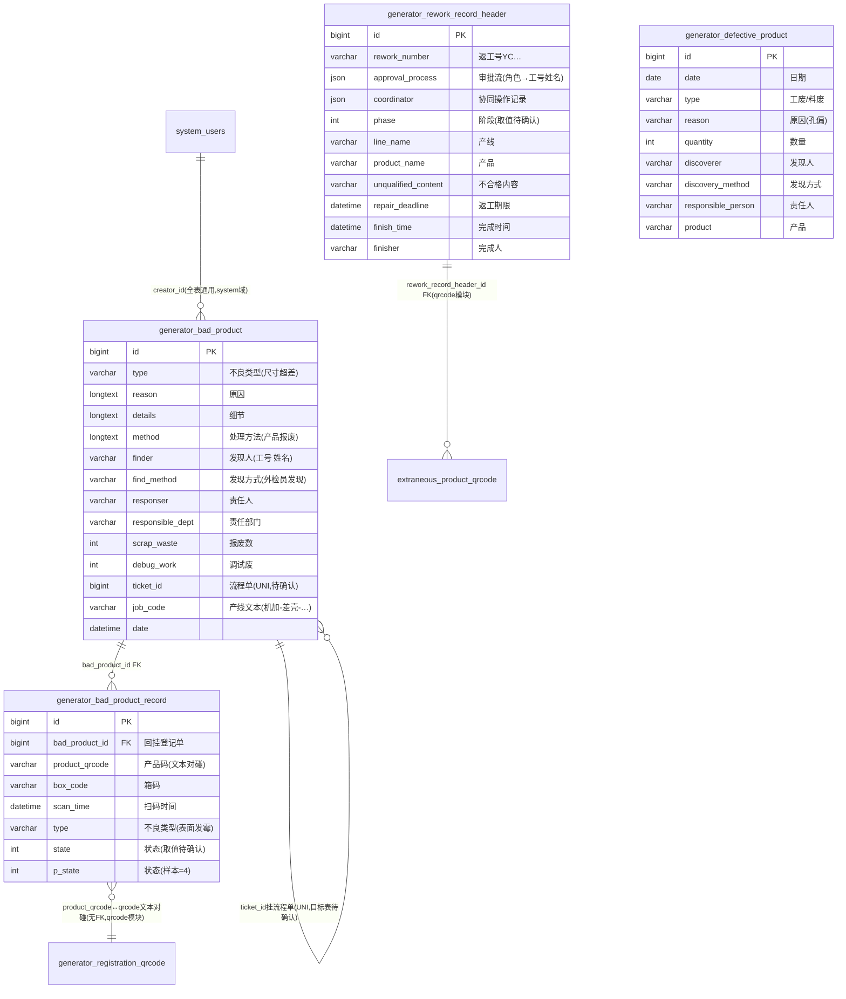

# 不良品模块 · fuadmin 数据字典
> 域: 02-生产铸造域 | 表数: 4 | 用途: Agent基础文件 | 生成: 2026-07-23

# bad-不良品 · 模块概述

## 业务定位
不良品模块是治通生产铸造域的不合格品控制中枢，覆盖“不良登记 → 逐件扫码 → 分类统计 → 返工流向”链路：`generator_bad_product`（1.6 万行）按单登记不良（类型如尺寸超差、原因、发现人/发现方式、责任人/责任部门、调试废与报废数、处理方法如产品报废），`generator_bad_product_record`（1 万行）按产品二维码逐件扫码落明细（scan_time、type、job_code=返修），`generator_defective_product`（2 千行）以工废/料废口径做轻量日报式汇总，`generator_rework_record_header`（1.6 千行）管理返工单（返工号 YC…、审批流 JSON、产线/产品、不合格内容、返工期限、完成人/完成时间），支撑 IATF16949 不合格品控制与可追溯处置。

## 上下游
- **上游**：qrcode 模块的产品码注册（record.product_qrcode 文本对碰）与生产产线（job_code=“机加-差壳-DCTECO-1线”文本）；发现方式（外检员/操作工/巡检发现）指向 inspection 检验环节（语义关联）。
- **下游**：返工单 `rework_record_header` 被 qrcode 模块 `extraneous_product_qrcode.rework_record_header_id` 回挂——返工完成后逐件换码（旧码→新码）重新入注册链，形成“不良→返工→换码”闭环；责任部门/责任人对接 system_users 与部门主数据。

## 核心流程
发现不良（外检/操作工/巡检）→ `bad_product` 登记（type/reason/details/method/responser/responsible_dept，ticket_id 唯一约束挂流程单）→ `bad_product_record` 逐件扫码（product_qrcode+scan_time，bad_product_id FK 回挂登记单）→ 处置分流：报废（method=产品报废，scrap_waste 计数）或返工 → 返工建 `rework_record_header`（approval_process 审批流 JSON、coordinator 协同记录、repair_deadline、finish_time/finisher）→ 返工后实物经 qrcode 模块 extraneous_product_qrcode 换码回流；`defective_product` 按日按工废/料废独立汇总，与 bad_product 口径互补（疑似车间快报与正式登记两套并行，待确认）。

# bad-不良品 · 上岗指南

## 2.1 核心实体表（全4表）

| 表 | 一句话定义 |
|---|---|
| generator_bad_product | 不良品登记主表（1.6万行，类型/原因/发现人/责任人/处理方法/报废数，ticket_id唯一） |
| generator_bad_product_record | 不良品逐件扫码记录（1万行，产品码+扫描时间，FK回挂登记单） |
| generator_defective_product | 不良轻量日报（2千行，工废/料废×原因×责任人，按日汇总） |
| generator_rework_record_header | 返工记录头（1.6千行，返工号YC…+审批流JSON+期限+完成信息） |

## 2.2 核心业务流

1. **登记**：发现人（finder）经发现方式（find_method=外检员发现/操作工发现/巡检发现）上报，`generator_bad_product` 落一单：`type` 不良类型（尺寸超差）、`reason` 原因（外径单点小，作业员未检测出）、`details` 细节、method 处理方法（产品报废/不合格品报废）、`responser`/`responsible_dept` 责任归属、`debug_work`/`debug_data` 调试废品数、`scrap_waste` 报废数、`job_code` 产线文本（机加-差壳-DCTECO-1线）、`picture` 照片 JSON、`ticket_id` 唯一挂流程单。
2. **逐件扫码**：`generator_bad_product_record` 每件一行（product_qrcode+box_code+scan_time），`bad_product_id` FK 回挂登记单，`type`（表面发霉）/`job_code`（返修）冗余文本，`state`/`p_state` 状态机（取值待确认，样本 p_state=4）。
3. **分类快报**：`generator_defective_product` 按日登记：`type`=工废/料废、`quantity` 数量、`reason`（尺寸超差/孔偏）、`discoverer`/`discovery_method`、`responsible_person`、`product`——比 bad_product 轻量，推断为车间日报口径，两表并行（统计时勿混用，待确认口径分工）。
4. **返工**：可返工的不良建 `generator_rework_record_header`：`rework_number`（YC202505220002）、`approval_process` 审批流 JSON（按角色 to 工号姓名）、`coordinator` 协同操作记录 JSON、`phase` 阶段、`category` 类别、`line_name`/`product_name`、`unqualified_content` 不合格内容、`repair_deadline` 返工期限、`finish_time`/`finisher` 完成信息、`picture`/`finished_picture` 前后照片。
5. **回流**：返工完成后的实物经 qrcode 模块 `extraneous_product_qrcode` 逐件换码（rework_record_header_id 回挂本表），新码重新进入注册/发货链——跨模块闭环见 05-接口.md。

## 2.3 典型查询场景

**场景1：不良登记月度汇总（按类型）**
```sql
SELECT DATE_FORMAT(date, '%Y-%m') ym, type, COUNT(*) 单数,
       SUM(scrap_waste) 报废件数, SUM(debug_work) 调试废
FROM generator_bad_product
WHERE date >= '2025-01-01'
GROUP BY ym, type
ORDER BY ym DESC, 单数 DESC;
```

**场景2：某登记单的逐件明细（单件追溯）**
```sql
SELECT r.product_qrcode, r.box_code, r.scan_time, r.type, r.job_code, r.state
FROM generator_bad_product_record r
WHERE r.bad_product_id = 2
ORDER BY r.scan_time;
```

**场景3：责任部门不良排行（质量例会）**
```sql
SELECT responsible_dept, COUNT(*) 不良单数, SUM(scrap_waste) 报废件数
FROM generator_bad_product
WHERE date BETWEEN '2025-06-01' AND '2025-06-30'
GROUP BY responsible_dept
ORDER BY 不良单数 DESC;
```

**场景4：返工率统计（返工单完成/逾期）**
```sql
SELECT DATE_FORMAT(create_datetime, '%Y-%m') ym,
       COUNT(*) 返工单数,
       SUM(CASE WHEN finish_time IS NOT NULL THEN 1 ELSE 0 END) 已完成,
       SUM(CASE WHEN finish_time IS NULL AND repair_deadline < NOW() THEN 1 ELSE 0 END) 逾期未完
FROM generator_rework_record_header
GROUP BY ym ORDER BY ym DESC;
-- 返工率=返工单数/产量，产量需关联 production 模块生产跟踪单（跨模块）
```

**场景5：工废/料废日报（defective_product 口径）**
```sql
SELECT date, type, product, reason, SUM(quantity) 数量
FROM generator_defective_product
WHERE date >= '2025-08-01'
GROUP BY date, type, product, reason
ORDER BY date DESC, 数量 DESC;
```

**场景6：返工换码闭环核查（返工单→换码件数）**
```sql
SELECT h.rework_number, h.product_name, h.line_name, h.finish_time,
       COUNT(x.id) 已换码件数
FROM generator_rework_record_header h
LEFT JOIN extraneous_product_qrcode x ON x.rework_record_header_id = h.id
WHERE h.create_datetime >= '2025-01-01'
GROUP BY h.id
ORDER BY h.create_datetime DESC;
```

**场景7：按产品码反查不良记录（客诉/退货追溯）**
```sql
SELECT b.id, b.date, b.type, b.reason, b.method, b.responser, r.scan_time
FROM generator_bad_product_record r
JOIN generator_bad_product b ON b.id = r.bad_product_id
WHERE r.product_qrcode = 'V210126#SR40661121#P5511700270#';
```

## 2.4 避坑

- **两套登记口径并行**：bad_product（正式登记，含处理方法/责任部门）与 defective_product（轻量日报，工废/料废）数据重叠口径不同，统计不良总量时**勿直接相加**；分工待确认（推断 defective 为车间快报、bad_product 为质量正式单）。
- **state/p_state 枚举未文档化**：record 的 state=1/p_state=4、rework header 的 phase/category 取值均无语义注释，用值前先抽样核对或找业务确认。
- **责任人字段是文本**：finder/responser/discoverer/responsible_person 多为“工号 姓名”（如 `14003 潘利飞`），关联 system_users 需截取工号；另有纯姓名样本（responsible_worker=郑翔翥），格式不统一。
- **ticket_id 唯一约束**：bad_product.ticket_id UNI，挂流程单/审批单（目标表待确认，推断指向系统审批流）；为空不影响登记。
- **JSON 字段多**：approval_process/coordinator/message 为审批流与协同 JSON（含嵌套 to/role/operations 结构），解析成本高，避免在大表全量查询中 JSON_EXTRACT。
- **_MASK_FROM_V2 为脱敏迁移时间戳**，无业务含义；record/bad_product 间用 bad_product_id FK，勿用 product_name+date 猜关联。
- **换码闭环在 qrcode 模块**：返工后实物处置（旧码→新码）不在本模块，查返工后流向必须 join extraneous_product_qrcode。

## 3 数据字典

### generator_bad_product（约 16317 行）
业务定义: 不良品登记主表（类型/原因/责任/处理方法/报废数，1.6万行） ｜ 表注释: -

| 字段 | 类型 | 可空 | 键 | 原始注释 | 推断语义 | 置信度 |
|---|---|---|---|---|---|---|
| id | bigint | N | PRI | - | 主键ID | high |
| remark | varchar(255) | Y | - | - | 备注 | high |
| modifier | varchar(255) | Y | - | - | 最后修改人姓名 | high |
| belong_dept | int | Y | - | - | 所属部门ID | mid |
| update_datetime | datetime(6) | Y | - | - | 最后更新时间 | high |
| create_datetime | datetime(6) | Y | - | - | 创建时间 | high |
| sort | int | Y | - | - | 排序号 | high |
| method | longtext | Y | - | - | 待确认 | low |
| reason | longtext | Y | - | - | 待确认 | low |
| responser | varchar(255) | Y | - | - | 文本字段[推断-待确认] | low |
| find_method | varchar(20) | Y | - | - | 文本字段[推断-待确认] | low |
| finder | varchar(20) | Y | - | - | 文本字段[推断-待确认] | low |
| debug_work | int | Y | - | - | 数值字段[推断-待确认] | low |
| debug_data | int | Y | - | - | 数值字段[推断-待确认] | low |
| details | longtext | Y | - | - | 待确认 | low |
| picture | json | Y | - | - | 图片路径[推断] | mid |
| type | varchar(20) | Y | - | - | 类型[推断] | mid |
| code | varchar(255) | Y | - | - | 编号/代码[推断] | mid |
| date | datetime(6) | Y | - | - | 日期[推断] | high |
| job_code | varchar(255) | Y | - | - | 编号/代码[推断] | mid |
| creator_id | bigint | Y | MUL | - | 创建人ID → system_users.id | high |
| product_name | varchar(50) | Y | - | - | 名称[推断] | high |
| scrap_waste | int | Y | - | - | 数值字段[推断-待确认] | low |
| ticket_id | bigint | Y | UNI | - | 关联ID → generator_users_ticket.id[推断] | mid |
| responsible_dept | varchar(255) | Y | - | - | 部门[推断] | high |

### generator_bad_product_record（约 10010 行）
业务定义: 不良品逐件扫码记录（产品码+扫描时间，1万行） ｜ 表注释: -

| 字段 | 类型 | 可空 | 键 | 原始注释 | 推断语义 | 置信度 |
|---|---|---|---|---|---|---|
| id | bigint | N | PRI | - | 主键ID | high |
| remark | varchar(255) | Y | - | - | 备注 | high |
| modifier | varchar(255) | Y | - | - | 最后修改人姓名 | high |
| belong_dept | int | Y | - | - | 所属部门ID | mid |
| update_datetime | datetime(6) | Y | - | - | 最后更新时间 | high |
| create_datetime | datetime(6) | Y | - | - | 创建时间 | high |
| sort | int | Y | - | - | 排序号 | high |
| box_code | varchar(255) | Y | - | - | 箱码[推断] | mid |
| state | int | Y | - | - | 状态（枚举值待确认）[推断] | mid |
| type | varchar(20) | Y | - | - | 类型[推断] | mid |
| job_code | varchar(255) | Y | - | - | 编号/代码[推断] | mid |
| product_name | varchar(20) | Y | - | - | 名称[推断] | high |
| product_qrcode | varchar(50) | Y | - | - | 产品[推断] | high |
| creator_id | bigint | Y | MUL | - | 创建人ID → system_users.id | high |
| scan_time | datetime | Y | - | - | 时间[推断] | high |
| p_state | int | Y | - | - | 状态（枚举值待确认）[推断] | mid |
| bad_product_id | bigint | Y | MUL | - | 关联ID → generator_bad_product.id[推断] | mid |
| _MASK_FROM_V2 | timestamp | N | MUL | - | 待确认 | low |

### generator_defective_product（约 2069 行）
业务定义: 不良轻量日报（工废/料废×原因×责任人，2千行） ｜ 表注释: -

| 字段 | 类型 | 可空 | 键 | 原始注释 | 推断语义 | 置信度 |
|---|---|---|---|---|---|---|
| id | bigint | N | PRI | - | 主键ID | high |
| remark | varchar(255) | Y | - | - | 备注 | high |
| modifier | varchar(255) | Y | - | - | 最后修改人姓名 | high |
| belong_dept | int | Y | - | - | 所属部门ID | mid |
| update_datetime | datetime(6) | Y | - | - | 最后更新时间 | high |
| create_datetime | datetime(6) | Y | - | - | 创建时间 | high |
| sort | int | Y | - | - | 排序号 | high |
| quantity | int | Y | - | - | 数量[推断] | high |
| reason | varchar(30) | Y | - | - | 文本字段[推断-待确认] | low |
| discoverer | varchar(30) | Y | - | - | 文本字段[推断-待确认] | low |
| discovery_method | varchar(30) | Y | - | - | 文本字段[推断-待确认] | low |
| responsible_person | varchar(30) | Y | - | - | 文本字段[推断-待确认] | low |
| type | varchar(30) | Y | - | - | 类型[推断] | mid |
| product | varchar(30) | Y | - | - | 产品[推断] | high |
| date | date | Y | - | - | 日期[推断] | high |
| creator_id | bigint | Y | MUL | - | 创建人ID → system_users.id | high |

### generator_rework_record_header（约 1641 行）
业务定义: 返工记录头（返工号+审批流JSON+期限+完成，1.6千行） ｜ 表注释: -

| 字段 | 类型 | 可空 | 键 | 原始注释 | 推断语义 | 置信度 |
|---|---|---|---|---|---|---|
| id | bigint | N | PRI | - | 主键ID | high |
| remark | varchar(255) | Y | - | - | 备注 | high |
| modifier | varchar(255) | Y | - | - | 最后修改人姓名 | high |
| belong_dept | int | Y | - | - | 所属部门ID | mid |
| update_datetime | datetime(6) | Y | - | - | 最后更新时间 | high |
| create_datetime | datetime(6) | Y | - | - | 创建时间 | high |
| sort | int | Y | - | - | 排序号 | high |
| approval_process | json | Y | - | - | 审批流程（JSON）[推断] | high |
| picture | json | Y | - | - | 图片路径[推断] | mid |
| phase | int | Y | - | - | 数值字段[推断-待确认] | low |
| exception_record_datetime | datetime | Y | - | - | 时间[推断] | high |
| line_name | varchar(40) | Y | - | - | 名称[推断] | high |
| product_name | varchar(50) | Y | - | - | 名称[推断] | high |
| rework_number | varchar(50) | Y | - | - | 编号/代码[推断] | mid |
| creator_id | bigint | Y | MUL | - | 创建人ID → system_users.id | high |
| responsible_worker | varchar(20) | Y | - | - | 文本字段[推断-待确认] | low |
| coordinator | json | Y | - | - | 待确认 | low |
| message | json | Y | - | - | 年龄[推断] | high |
| finished_picture | json | Y | - | - | 图片路径[推断] | mid |
| category | int | Y | - | - | 分类[推断] | mid |
| unqualified_content | varchar(255) | Y | - | - | 质量判定[推断] | mid |
| repair_deadline | datetime | Y | - | - | 产线[推断] | mid |
| _MASK_FROM_V2 | timestamp | N | MUL | - | 待确认 | low |
| belong | int | Y | - | - | 数值字段[推断-待确认] | low |
| quantity_limit | int | Y | - | - | 数值字段[推断-待确认] | low |
| finish_time | datetime(6) | Y | - | - | 时间[推断] | high |
| finisher | varchar(20) | Y | - | - | 文本字段[推断-待确认] | low |

# bad-不良品 · ER 关系图

4 张表本模块内仅 1 个已证实 FK（record→bad_product）；返工单与 qrcode 模块的换码记录构成跨模块闭环。defective_product 与其他表无 FK，为独立日报口径。



## 推断说明

- **已证实 FK 仅 2 个**：record.bad_product_id→bad_product.id（索引+命名）；extraneous_product_qrcode.rework_record_header_id→rework_record_header.id（qrcode 模块 skeleton 声明）。其余均为文本/语义关联。
- **defective_product 完全独立**：无任何 FK，与其他三表靠 date/product/reason 语义重叠，推断为车间快报口径，与 bad_product 正式登记并行（分工待确认）。
- **ticket_id 唯一约束**：推断挂系统审批流/流程单（框架常见 ticket 模式），目标表待确认，置信中。
- **record.product_qrcode → qrcode 模块注册码**为文本对碰：退货/不良/换码三处共用同一码格式 `V210126#SR…#P…#`。
- **state/p_state/phase/category 枚举取值均无注释**，图中标注“待确认”。

# bad-不良品 · 跨模块接口表

| 本模块表.字段 | → 目标模块.表.字段 | 依据 | 置信度 |
|---|---|---|---|
| generator_rework_record_header.id | → qrcode(追溯).extraneous_product_qrcode.rework_record_header_id | qrcode skeleton FK 声明（反向被引用） | 高（已证实FK，本表为被挂方） |
| generator_bad_product_record.product_qrcode | → qrcode(追溯).generator_registration_qrcode.qrcode / sendout.part_qr_codes | 同一产品码格式 `V210126#SR…#P…#`，文本对碰 | 中（文本对碰） |
| generator_bad_product_record.product_qrcode | → return(退货).退货明细.产品二维码字段 | 锚点：退货按0HKG二维码一物一码逐件登记，码同源——不良件可核查是否已发货/退货 | 中（文本对碰） |
| generator_bad_product.product_name / record.product_name | → product(产品).generator_product.名称 | 样本 MP缸体/DCTECO差壳/LP缸体，纯文本 | 中（文本对碰） |
| generator_bad_product.job_code / record.job_code | → production(生产).generator_job_code.作业代码 | 样本“机加-差壳-DCTECO-1线”“返修”为产线/作业文本 | 中（文本对碰，目标字段待确认） |
| rework_record_header.line_name | → production.generator_production_line.产线名 | 样本“机加-缸盖-GS61…-OP05-1”为产线文本 | 中（文本对碰） |
| bad_product.find_method / defective.discovery_method | → inspection(检验).generator_quality_inspection | “外检员发现/巡检发现”语义指向检验环节，无字段级关联 | 低（语义关联，待确认） |
| bad_product.ticket_id | → system(系统).审批流/流程单表.id | ticket_id UNI 唯一约束，框架流程单惯例 | 中（目标表待确认） |
| 所有表.creator_id | → system(系统).system_users.id | 框架惯例 + creator_id 索引 | 高 |
| finder/responser/discoverer/responsible_person/responsible_worker/finisher | → system.system_users(工号/姓名文本) | 样本“14003 潘利飞”工号+姓名；另有纯姓名（郑翔翥），格式不统一 | 中（需截取工号） |
| rework_record_header.approval_process / coordinator | → system.system_users(审批人) + system_users_role(角色) | JSON 内含 “to”:[“工号 姓名”]、“role”:“生产部负责人” | 中（JSON解析，非FK） |
| bad_product.responsible_dept / 所有表.belong_dept | → system(系统).部门主数据.id/名称 | responsible_dept=生产部为文本；belong_dept 为 int | 中（待确认部门表） |
| bad_product.picture / rework.picture / finished_picture | → 静态文件存储(/static/YYYYMMDD/…) | 样本为相对路径，不良与返工完成照片 | 高（文件引用，非表关联） |

## 说明

- **本模块实体 FK 极少**：对外无主动 FK，唯一跨模块实体接口是 rework_record_header **被** qrcode 模块 extraneous_product_qrcode 回挂（返工→换码闭环）。其余跨模块关联全部文本对碰。
- **码是最大公约数**：bad_product_record.product_qrcode 向上对碰 qrcode 注册/发货链（何时生产、随哪箱发走），向下对碰 return 退货登记（是否客退）——客诉场景“不良→退货→发货→注册”四环全靠产品码文本串联。
- **两套登记口径**：bad_product（正式单，ticket_id 挂流程）与 defective_product（工废/料废日报）并行，对外报表需先确认用哪套，勿相加。
- **枚举待确认**：state/p_state（record）、phase/category（rework header）取值无语义文档，跨模块对接前先与业务核对。

## 6 字段备注改进建议

（待 enrich 补充）

## 相关页面
- [[TF铸造模块-fuadmin数据字典]]
- [[fuadmin数据字典总览]]
- [[二维码追溯模块-fuadmin数据字典]]
- [[新排程模块-fuadmin数据字典]]
- [[班次模块-fuadmin数据字典]]
- [[生产模块-fuadmin数据字典]]
- [[生产计划模块-fuadmin数据字典]]
