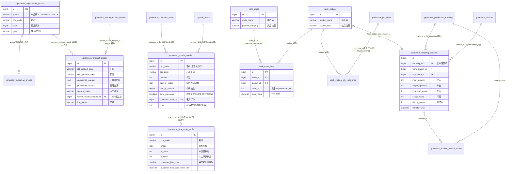

# 二维码追溯模块 · fuadmin 数据字典
> 域: 02-生产铸造域 | 表数: 13 | 用途: Agent基础文件 | 生成: 2026-07-23

# qrcode-二维码追溯 · 模块概述

## 业务定位
二维码追溯模块是治通生产铸造域的“一物一码”质量追溯核心，覆盖“注册码 → 追溯流转 → 发货扫码 → 箱码验证 → 异常码处理”全链路：产品二维码（形如 `V210126#SR42360001#P5511700270#`，供应商#序列号#产品号三段式）在 `generator_registration_qrcode` 注册启用，随后沿 track_route/track_station 定义的追溯路线经 `generator_tracking_transfer` 记录工序间投入/产出/三类废品（工废 industrial_waste、料废 scrap_waste、调试废 debug_waste），发货环节由 `generator_qrcode_sendout`（3.9 万行现役主表）按箱码+客户订单扫码校验，`generator_box_code_verify`（9 千行）以拍照+AI 识别做箱码复核并绑定客户箱码，异常件经 `generator_exception_qrcode` 登记、`extraneous_product_qrcode`（3.5 万行）做旧码→新码换码处理并回挂 bad 模块返工单，满足 IATF16949 单件追溯要求。

## 上下游
- **上游**：product 模块产品主数据（`product_name` 文本对碰）、production 模块 `generator_production_tracking` 生产跟踪单（tracking_id FK）与 `generator_devices` 设备；客户订单来自订单域 `generator_customer_order`（sendout.customer_order_id FK）。
- **下游**：return 退货模块按 0HKG 二维码逐件登记退货（码文本对碰）；bad 不良品模块的 `generator_rework_record_header` 被 `extraneous_product_qrcode.rework_record_header_id` 回挂，形成“异常→返工→换码”闭环；检验模块的检验数据以 JSON 落在 `qrcode_in.Inspection_data`（0 行未启用）。

## 核心流程
产品码注册（registration_qrcode，state 启用）→ 产线按追溯路线/站点流转（tracking_transfer 记录 from_station→to_station、投入/产出、三废，配套 waste_record 废料处理；当前 0 行，推断为新一代结构未启用或已归档）→ 发货扫码（sendout：箱码+件数+客户订单，`part_qr_codes` JSON 存箱内件码，`error_message` 落校验失败原因如“箱码长度错误应为17位”）→ 箱码复核（box_code_verify：拍照 image+AI 状态 ai_state+人工 p_state 双重确认，绑定 customer_box_code）→ 异常处理（exception_qrcode 登记异常码；extraneous_product_qrcode 换码：old→new、unqualified_content→processed_content、人工确认，关联返工单）。历史出入库表 qrcode_in/qrcode_out 均 0 行，已被 sendout 链路替代（推断）。

# qrcode-二维码追溯 · 上岗指南

## 2.1 核心实体表（TOP8）

| 表 | 一句话定义 |
|---|---|
| generator_qrcode_sendout | 发货扫码主表（3.9万行，箱码+产品码+客户订单FK，error_message落校验失败） |
| generator_box_code_verify | 箱码复核（9千行，拍照image+AI识别ai_state+人工p_state，绑定客户箱码） |
| extraneous_product_qrcode | 异常件换码记录（3.5万行，旧码→新码，回挂返工单rework_record_header_id） |
| generator_registration_qrcode | 产品码注册启用（码+箱码+state开关） |
| generator_exception_qrcode | 异常二维码登记（type=产品+码文本，仅15行） |
| generator_tracking_transfer | 追溯工序流转（from/to站点+投入产出+三废，0行未启用/已归档） |
| track_route / track_route_step | 追溯路线与步骤定义（route-step-station三级，0行） |
| track_station(+job_code_map) | 追溯站点定义及其与作业代码映射（0行） |

## 2.2 核心业务流

1. **注册**：产品码 `V210126#SR…#P5511…#`（供应商#序列号#产品号）在 `generator_registration_qrcode` 登记并置 `state=1`，可同时绑箱码（样本 PD05305420020017）。
2. **流转**：按 track_route（路线）→ track_route_step（步序，unique(route_id,step_no)，is_first/is_last）→ track_station（站点）定义的路线，`generator_tracking_transfer` 记录 tracking_id（→production 跟踪单）在 from_station→to_station 间的投入/产出与工废/料废/调试废，`generator_tracking_waste_record` 记录废料处理。**该链路当前 0 行，推断未启用或数据已归档，勿当作现役数据源。**
3. **发货**：`generator_qrcode_sendout` 每箱一行（box_code+bar_code+number+type），`customer_order_id` 挂客户订单，`part_qr_codes` JSON 存箱内每件产品码，`part_qr_verified` 校验标志；校验失败时 `error_message` 记录原因（样本：“箱码长度错误，应为17位，实际16位；箱码前缀无法识别对应产品”），失败行仍落库（type=0）。
4. **箱码复核**：`generator_box_code_verify` 对每箱拍照（image JSON+image_md5），AI 识别（ai_state）+人工确认（p_state）双轨，`product_qr_verified` 标记件码核验结果；客户要求时用 `customer_box_code` 绑定客户箱码（含 binder/绑定时间）。
5. **异常处理**：异常码先入 `generator_exception_qrcode`（type=产品）；实际换码走 `extraneous_product_qrcode`：old_product_code→new_product_code，`unqualified_content`/`processed_content` JSON 记录不合格内容与处理结果，`operate_state`=人工确认，`rework_record_header_id` 回挂 bad 模块返工单，`cc_user`/production_manager/quality_directer 走完签。
6. **历史表**：qrcode_in/qrcode_out 为早期入库/出库扫码（含 Inspection_data JSON、收发双方/车牌），均 0 行，已被 sendout 链路替代（推断）。

## 2.3 典型查询场景

**场景1：单件码全链追溯（注册→发货→箱验证→换码）**
```sql
SELECT '注册' src, id, qrcode, box_code, state, create_datetime
  FROM generator_registration_qrcode WHERE qrcode = 'V210126#SR42360001#P5511700270#'
UNION ALL
SELECT '换码', id, old_product_code, new_product_code, operate_state, create_datetime
  FROM extraneous_product_qrcode
 WHERE old_product_code = 'V210126#SR42360001#P5511700270#'
    OR new_product_code = 'V210126#SR42360001#P5511700270#';
-- 发货环节在 sendout.part_qr_codes(JSON) 内，用 JSON_SEARCH 定位：
SELECT id, box_code, product_name, number, create_datetime
FROM generator_qrcode_sendout
WHERE JSON_SEARCH(part_qr_codes, 'one', 'V210126#SR42360001#P5511700270#') IS NOT NULL;
```

**场景2：按箱码查发货与复核状态**
```sql
SELECT s.box_code, s.product_name, s.bar_code, s.number, s.type,
       s.part_qr_verified, s.error_message, s.customer_order_id,
       v.p_state, v.ai_state, v.product_qr_verified, v.customer_box_code
FROM generator_qrcode_sendout s
LEFT JOIN generator_box_code_verify v ON v.box_code = s.box_code
WHERE s.box_code = 'UMPXX202507274007';
-- 注意：box_code 关联为文本对碰，存在大小写差异（样本 umpxx20257285001），建议 UPPER() 对齐
```

**场景3：发货校验失败清单（异常箱码筛查）**
```sql
SELECT DATE(create_datetime) d, box_code, product_name, error_message, user
FROM generator_qrcode_sendout
WHERE error_message IS NOT NULL AND error_message <> ''
  AND create_datetime >= '2025-07-01'
ORDER BY create_datetime DESC;
```

**场景4：换码率统计（按月/产品线）**
```sql
SELECT DATE_FORMAT(create_datetime, '%Y-%m') ym, line_name,
       COUNT(*) AS 换码件数,
       SUM(CASE WHEN operate_state='人工确认' THEN 1 ELSE 0 END) AS 人工确认件数
FROM extraneous_product_qrcode
WHERE is_active = 1
GROUP BY ym, line_name
ORDER BY ym DESC, 换码件数 DESC;
```

**场景5：异常码登记与处理闭环核查**
```sql
SELECT e.qrcode, e.type, e.create_datetime AS 登记时间,
       x.new_product_code, x.operate_state, x.rework_record_header_id
FROM generator_exception_qrcode e
LEFT JOIN extraneous_product_qrcode x
  ON x.old_product_code = e.qrcode OR x.new_product_code = e.qrcode
ORDER BY e.create_datetime DESC;
```

**场景6：客户箱码绑定核对（应绑未绑）**
```sql
SELECT v.box_code, v.product_name, v.number, v.create_datetime
FROM generator_box_code_verify v
WHERE (v.customer_box_code IS NULL OR v.customer_box_code = '')
  AND v.create_datetime >= '2025-12-01';
```

**场景7：流转三废汇总（track 链路启用后）**
```sql
SELECT tracking_id, from_station_id, to_station_id,
       SUM(input_quantity) 投入, SUM(output_quantity) 产出,
       SUM(industrial_waste) 工废, SUM(scrap_waste) 料废, SUM(debug_waste) 调试废
FROM generator_tracking_transfer
GROUP BY tracking_id, from_station_id, to_station_id;
```

## 2.4 避坑

- **现役表只有 4 张**：sendout(3.9万)、box_code_verify(9千)、extraneous(3.5万)、registration/exception 小表在用；qrcode_in/out、track_* 五表、tracking_transfer/waste_record 全部 0 行——分析历史发货勿查 in/out，追溯路线勿指望 track 链路有数。
- **码关联全是文本对碰**：registration/extraneous/exception 之间、以及与 sendout.part_qr_codes(JSON) 之间均无 FK，产品码格式 `V210126#SR…#P…#` 注意 `#` 结尾；箱码存在**大小写不一致**（UMPXX… vs umpxx…），join 前统一 UPPER()。
- **校验失败行也落库**：sendout 中 error_message 非空的行是失败记录，统计发货量时应排除或单独列示，type 字段含义（0/1）待确认（样本 0=失败、1=成功，推断）。
- **JSON 字段多**：part_qr_codes、Inspection_data、image、cc、cc_user、rework_defects 均为 JSON；JSON_SEARCH/JSON_EXTRACT 注意 MySQL 版本与性能，大表全表 JSON 扫描会很慢。
- **换码≠报废**：extraneous_product_qrcode 记录的是“码”层面的异常处理（如二维码损坏重打），state/is_active 语义待确认；实物不良走 bad 模块，两模块经 rework_record_header_id 衔接。
- **脱敏字段**：`_MASK_FROM_V2` 为脱敏迁移时间戳，无业务含义；人名多为“工号 姓名”文本（如 `18107 冯方明`），关联 system_users 需截取工号。

## 3 数据字典

### generator_qrcode_in（约 0 行）
业务定义: 入库扫码登记（箱码+数量+检验数据JSON，0行未启用） ｜ 表注释: -

| 字段 | 类型 | 可空 | 键 | 原始注释 | 推断语义 | 置信度 |
|---|---|---|---|---|---|---|
| id | bigint | N | PRI | - | 主键ID | high |
| remark | varchar(255) | Y | - | - | 备注 | high |
| modifier | varchar(255) | Y | - | - | 最后修改人姓名 | high |
| belong_dept | int | Y | - | - | 所属部门ID | mid |
| update_datetime | datetime(6) | Y | - | - | 最后更新时间 | high |
| create_datetime | datetime(6) | Y | - | - | 创建时间 | high |
| sort | int | Y | - | - | 排序号 | high |
| Inspection_data | json | Y | - | - | 待确认 | low |
| certigier | varchar(100) | Y | - | - | 文本字段[推断-待确认] | low |
| state | int | Y | - | - | 状态（枚举值待确认）[推断] | mid |
| boxstate | varchar(10) | Y | - | - | 状态（枚举值待确认）[推断] | mid |
| number | int | Y | - | - | 编号/代码[推断] | mid |
| box_code | varchar(255) | Y | - | - | 箱码[推断] | mid |
| user | varchar(20) | Y | - | - | 用户[推断] | mid |
| entry_time | datetime(6) | Y | - | - | 录入时间[推断] | mid |
| creator_id | bigint | Y | MUL | - | 创建人ID → system_users.id | high |

### generator_qrcode_out（约 0 行）
业务定义: 出库扫码登记（发货方/收货方/车牌，0行未启用） ｜ 表注释: -

| 字段 | 类型 | 可空 | 键 | 原始注释 | 推断语义 | 置信度 |
|---|---|---|---|---|---|---|
| id | bigint | N | PRI | - | 主键ID | high |
| remark | varchar(255) | Y | - | - | 备注 | high |
| modifier | varchar(255) | Y | - | - | 最后修改人姓名 | high |
| belong_dept | int | Y | - | - | 所属部门ID | mid |
| update_datetime | datetime(6) | Y | - | - | 最后更新时间 | high |
| create_datetime | datetime(6) | Y | - | - | 创建时间 | high |
| sort | int | Y | - | - | 排序号 | high |
| certigier | varchar(100) | Y | - | - | 文本字段[推断-待确认] | low |
| consignor | varchar(100) | Y | - | - | 发货方[推断] | mid |
| consignee | varchar(100) | Y | - | - | 文本字段[推断-待确认] | low |
| car_number | varchar(20) | Y | - | - | 编号/代码[推断] | mid |
| number | int | Y | - | - | 编号/代码[推断] | mid |
| box_code | varchar(255) | Y | - | - | 箱码[推断] | mid |
| user | varchar(20) | Y | - | - | 用户[推断] | mid |
| out_time | datetime(6) | Y | - | - | 时间[推断] | high |
| creator_id | bigint | Y | MUL | - | 创建人ID → system_users.id | high |

### generator_qrcode_sendout（约 39588 行）
业务定义: 发货扫码主表（箱码+件码JSON+客户订单，3.9万行） ｜ 表注释: -

| 字段 | 类型 | 可空 | 键 | 原始注释 | 推断语义 | 置信度 |
|---|---|---|---|---|---|---|
| id | bigint | N | PRI | - | 主键ID | high |
| remark | varchar(255) | Y | - | - | 备注 | high |
| modifier | varchar(255) | Y | - | - | 最后修改人姓名 | high |
| belong_dept | int | Y | - | - | 所属部门ID | mid |
| update_datetime | datetime(6) | Y | - | - | 最后更新时间 | high |
| create_datetime | datetime(6) | Y | - | - | 创建时间 | high |
| sort | int | Y | - | - | 排序号 | high |
| user | varchar(20) | N | - | - | 用户[推断] | mid |
| box_code | varchar(255) | N | - | - | 箱码[推断] | mid |
| product_name | varchar(20) | N | - | - | 名称[推断] | high |
| bar_code | varchar(30) | N | - | - | 编号/代码[推断] | mid |
| number | int | N | - | - | 编号/代码[推断] | mid |
| type | int | N | - | - | 类型[推断] | mid |
| creator_id | bigint | Y | MUL | - | 创建人ID → system_users.id | high |
| customer_order_id | bigint | Y | MUL | - | 关联ID → generator_customer_order.id[推断] | mid |
| error_message | longtext | Y | - | - | 年龄[推断] | high |
| check_number | int | Y | - | - | 编号/代码[推断] | mid |
| part_qr_codes | json | Y | - | - | 待确认 | low |
| part_qr_verified | tinyint(1) | Y | - | - | 数值字段[推断-待确认] | low |

### generator_box_code_verify（约 9071 行）
业务定义: 箱码复核（拍照AI识别+人工确认+客户箱码绑定，9千行） ｜ 表注释: -

| 字段 | 类型 | 可空 | 键 | 原始注释 | 推断语义 | 置信度 |
|---|---|---|---|---|---|---|
| id | bigint | N | PRI | - | 主键ID | high |
| remark | varchar(255) | Y | - | - | 备注 | high |
| modifier | varchar(255) | Y | - | - | 最后修改人姓名 | high |
| belong_dept | int | Y | - | - | 所属部门ID | mid |
| update_datetime | datetime(6) | Y | - | - | 最后更新时间 | high |
| create_datetime | datetime(6) | Y | - | - | 创建时间 | high |
| sort | int | Y | - | - | 排序号 | high |
| image | json | Y | - | - | 图片路径[推断] | mid |
| cc | json | Y | - | - | 待确认 | low |
| product_qr | varchar(50) | Y | - | - | 产品[推断] | high |
| product_qr_verified | int | Y | - | - | 产品[推断] | high |
| p_state | int | Y | - | - | 状态（枚举值待确认）[推断] | mid |
| ai_state | int | Y | - | - | AI复核状态（枚举待确认）[推断] | mid |
| number | int | Y | - | - | 编号/代码[推断] | mid |
| product_name | varchar(20) | Y | - | - | 名称[推断] | high |
| box_code | varchar(50) | Y | - | - | 箱码[推断] | mid |
| creator_id | bigint | Y | MUL | - | 创建人ID → system_users.id | high |
| flag | tinyint(1) | Y | - | - | 数值字段[推断-待确认] | low |
| image_md5 | json | Y | - | - | 图片路径[推断] | mid |
| customer_box_code | varchar(500) | Y | - | - | 编号/代码[推断] | mid |
| customer_box_code_bind_time | datetime(6) | Y | - | - | 时间[推断] | high |
| customer_box_code_binder | varchar(100) | Y | - | - | 客户[推断] | high |

### generator_exception_qrcode（约 15 行）
业务定义: 异常二维码登记表（type+码文本，15行） ｜ 表注释: -

| 字段 | 类型 | 可空 | 键 | 原始注释 | 推断语义 | 置信度 |
|---|---|---|---|---|---|---|
| id | bigint | N | PRI | - | 主键ID | high |
| remark | varchar(255) | Y | - | - | 备注 | high |
| modifier | varchar(255) | Y | - | - | 最后修改人姓名 | high |
| belong_dept | int | Y | - | - | 所属部门ID | mid |
| update_datetime | datetime(6) | Y | - | - | 最后更新时间 | high |
| create_datetime | datetime(6) | Y | - | - | 创建时间 | high |
| sort | int | Y | - | - | 排序号 | high |
| type | varchar(20) | Y | - | - | 类型[推断] | mid |
| qrcode | varchar(255) | Y | - | - | 文本字段[推断-待确认] | low |
| creator_id | bigint | Y | MUL | - | 创建人ID → system_users.id | high |

### extraneous_product_qrcode（约 35082 行）
业务定义: 异常件换码处理记录（旧码→新码，挂返工单，3.5万行） ｜ 表注释: -

| 字段 | 类型 | 可空 | 键 | 原始注释 | 推断语义 | 置信度 |
|---|---|---|---|---|---|---|
| id | bigint | N | PRI | - | 主键ID | high |
| state | int | Y | - | - | 状态（枚举值待确认）[推断] | mid |
| unqualified_content | varchar(255) | Y | - | - | 质量判定[推断] | mid |
| processed_content | varchar(255) | Y | - | - | 内容[推断] | mid |
| remark | varchar(255) | Y | - | - | 备注 | high |
| new_product_code | varchar(255) | Y | - | - | 编号/代码[推断] | mid |
| old_product_code | varchar(255) | Y | - | - | 编号/代码[推断] | mid |
| product_name | varchar(50) | Y | - | - | 名称[推断] | high |
| userinfo | varchar(50) | Y | - | - | 用户[推断] | mid |
| is_active | tinyint(1) | Y | - | - | 标志位（布尔）[推断] | mid |
| update_datetime | datetime(6) | Y | - | - | 最后更新时间 | high |
| create_datetime | datetime(6) | Y | - | - | 创建时间 | high |
| system_user | tinyint(1) | Y | - | - | 用户[推断] | mid |
| box_code | varchar(100) | Y | - | - | 箱码[推断] | mid |
| img | json | Y | - | - | 待确认 | low |
| operate_state | varchar(50) | Y | - | - | 状态（枚举值待确认）[推断] | mid |
| creator_id | bigint | Y | MUL | - | 创建人ID → system_users.id | high |
| line_name | varchar(40) | Y | - | - | 名称[推断] | high |
| phase | int | Y | - | - | 数值字段[推断-待确认] | low |
| belong_dept | int | Y | - | - | 所属部门ID | mid |
| modifier | varchar(255) | Y | - | - | 最后修改人姓名 | high |
| picture | json | Y | - | - | 图片路径[推断] | mid |
| exception_record_datetime | datetime | Y | - | - | 时间[推断] | high |
| cc_user | json | Y | - | - | 用户[推断] | mid |
| production_manager | varchar(30) | Y | - | - | 产品[推断] | high |
| quality_directer | varchar(30) | Y | - | - | 文本字段[推断-待确认] | low |
| rework_record_header_id | bigint | Y | MUL | - | 关联ID → generator_rework_record_header.id[推断] | mid |
| temporary_state | int | Y | - | - | 状态（枚举值待确认）[推断] | mid |
| rework_defects | json | Y | - | - | 待确认 | low |
| rework_datetime | datetime | Y | - | - | 时间[推断] | high |
| worker | varchar(20) | Y | - | - | 文本字段[推断-待确认] | low |
| _MASK_FROM_V2 | timestamp | N | MUL | - | 待确认 | low |
| belong | int | Y | - | - | 数值字段[推断-待确认] | low |

### generator_registration_qrcode（约 7 行）
业务定义: 产品二维码注册启用（码+箱码+state开关） ｜ 表注释: -

| 字段 | 类型 | 可空 | 键 | 原始注释 | 推断语义 | 置信度 |
|---|---|---|---|---|---|---|
| id | bigint | N | PRI | - | 主键ID | high |
| remark | varchar(255) | Y | - | - | 备注 | high |
| modifier | varchar(255) | Y | - | - | 最后修改人姓名 | high |
| belong_dept | int | Y | - | - | 所属部门ID | mid |
| update_datetime | datetime(6) | Y | - | - | 最后更新时间 | high |
| create_datetime | datetime(6) | Y | - | - | 创建时间 | high |
| sort | int | Y | - | - | 排序号 | high |
| state | tinyint(1) | Y | - | - | 状态（枚举值待确认）[推断] | mid |
| type | varchar(20) | Y | - | - | 类型[推断] | mid |
| qrcode | varchar(255) | Y | - | - | 文本字段[推断-待确认] | low |
| box_code | varchar(255) | Y | - | - | 箱码[推断] | mid |
| creator_id | bigint | Y | MUL | - | 创建人ID → system_users.id | high |

### track_route（约 0 行）
业务定义: 追溯路线定义（路线名+产品类别，0行未启用） ｜ 表注释: -

| 字段 | 类型 | 可空 | 键 | 原始注释 | 推断语义 | 置信度 |
|---|---|---|---|---|---|---|
| id | bigint | N | PRI | - | 主键ID | high |
| remark | varchar(255) | Y | - | - | 备注 | high |
| modifier | varchar(255) | Y | - | - | 最后修改人姓名 | high |
| belong_dept | int | Y | - | - | 所属部门ID | mid |
| update_datetime | datetime(6) | Y | - | - | 最后更新时间 | high |
| create_datetime | datetime(6) | Y | - | - | 创建时间 | high |
| sort | int | Y | - | - | 排序号 | high |
| route_name | varchar(100) | N | - | - | 名称[推断] | high |
| product_category | varchar(30) | Y | - | - | 分类[推断] | mid |
| is_active | tinyint(1) | N | - | - | 标志位（布尔）[推断] | mid |
| creator_id | bigint | Y | MUL | - | 创建人ID → system_users.id | high |

### track_route_step（约 0 行）
业务定义: 追溯路线步骤（route+station+步序+计划工时，0行） ｜ 表注释: -

| 字段 | 类型 | 可空 | 键 | 原始注释 | 推断语义 | 置信度 |
|---|---|---|---|---|---|---|
| id | bigint | N | PRI | - | 主键ID | high |
| remark | varchar(255) | Y | - | - | 备注 | high |
| modifier | varchar(255) | Y | - | - | 最后修改人姓名 | high |
| belong_dept | int | Y | - | - | 所属部门ID | mid |
| update_datetime | datetime(6) | Y | - | - | 最后更新时间 | high |
| create_datetime | datetime(6) | Y | - | - | 创建时间 | high |
| sort | int | Y | - | - | 排序号 | high |
| step_no | int | N | - | - | 编号/代码[推断] | mid |
| is_first | tinyint(1) | N | - | - | 标志位（布尔）[推断] | mid |
| is_last | tinyint(1) | N | - | - | 标志位（布尔）[推断] | mid |
| plan_hours | decimal(6,2) | Y | - | - | 计划值[推断] | mid |
| site | varchar(20) | Y | - | - | 站点[推断] | mid |
| creator_id | bigint | Y | MUL | - | 创建人ID → system_users.id | high |
| route_id | bigint | N | MUL | - | 关联ID → track_route.id[推断] | mid |
| station_id | bigint | N | MUL | - | 关联ID → track_station.id[推断] | mid |

关联: route_id → track_route.id; station_id → track_station.id

### track_station（约 0 行）
业务定义: 追溯站点定义（站点名+类型+产品类别，0行） ｜ 表注释: -

| 字段 | 类型 | 可空 | 键 | 原始注释 | 推断语义 | 置信度 |
|---|---|---|---|---|---|---|
| id | bigint | N | PRI | - | 主键ID | high |
| remark | varchar(255) | Y | - | - | 备注 | high |
| modifier | varchar(255) | Y | - | - | 最后修改人姓名 | high |
| belong_dept | int | Y | - | - | 所属部门ID | mid |
| update_datetime | datetime(6) | Y | - | - | 最后更新时间 | high |
| create_datetime | datetime(6) | Y | - | - | 创建时间 | high |
| sort | int | Y | - | - | 排序号 | high |
| station_name | varchar(100) | N | - | - | 名称[推断] | high |
| product_category | varchar(30) | Y | - | - | 分类[推断] | mid |
| station_type | varchar(30) | Y | - | - | 类型[推断] | mid |
| is_active | tinyint(1) | N | - | - | 标志位（布尔）[推断] | mid |
| creator_id | bigint | Y | MUL | - | 创建人ID → system_users.id | high |

### track_station_job_code_map（约 0 行）
业务定义: 站点-作业代码映射（station_id+job_code_id唯一，0行） ｜ 表注释: -

| 字段 | 类型 | 可空 | 键 | 原始注释 | 推断语义 | 置信度 |
|---|---|---|---|---|---|---|
| id | bigint | N | PRI | - | 主键ID | high |
| remark | varchar(255) | Y | - | - | 备注 | high |
| modifier | varchar(255) | Y | - | - | 最后修改人姓名 | high |
| belong_dept | int | Y | - | - | 所属部门ID | mid |
| update_datetime | datetime(6) | Y | - | - | 最后更新时间 | high |
| create_datetime | datetime(6) | Y | - | - | 创建时间 | high |
| sort | int | Y | - | - | 排序号 | high |
| creator_id | bigint | Y | MUL | - | 创建人ID → system_users.id | high |
| job_code_id | bigint | N | MUL | - | 关联ID → generator_job_code.id[推断] | mid |
| station_id | bigint | N | MUL | - | 关联ID → track_station.id[推断] | mid |

关联: station_id → track_station.id

### generator_tracking_transfer（约 0 行）
业务定义: 追溯工序流转（投入/产出/工废料废调试废，0行） ｜ 表注释: -

| 字段 | 类型 | 可空 | 键 | 原始注释 | 推断语义 | 置信度 |
|---|---|---|---|---|---|---|
| id | bigint | N | PRI | - | 主键ID | high |
| remark | longtext | Y | - | - | 备注 | high |
| modifier | varchar(255) | Y | - | - | 最后修改人姓名 | high |
| belong_dept | int | Y | - | - | 所属部门ID | mid |
| update_datetime | datetime(6) | Y | - | - | 最后更新时间 | high |
| create_datetime | datetime(6) | Y | - | - | 创建时间 | high |
| sort | int | Y | - | - | 排序号 | high |
| from_sequence | int | Y | - | - | 数值字段[推断-待确认] | low |
| to_sequence | int | Y | - | - | 数值字段[推断-待确认] | low |
| input_quantity | int | N | - | - | 数量[推断] | high |
| output_quantity | int | N | - | - | 数量[推断] | high |
| industrial_waste | int | N | - | - | 数值字段[推断-待确认] | low |
| scrap_waste | int | N | - | - | 数值字段[推断-待确认] | low |
| debug_waste | int | N | - | - | 数值字段[推断-待确认] | low |
| operator | varchar(50) | Y | - | - | 操作人[推断] | high |
| operator_id | int | Y | - | - | 关联ID（目标表待确认）[推断] | low |
| transfer_time | datetime(6) | N | - | - | 时间[推断] | high |
| shift | varchar(10) | Y | - | - | 班次[推断] | high |
| site | varchar(20) | Y | - | - | 站点[推断] | mid |
| creator_id | bigint | Y | MUL | - | 创建人ID → system_users.id | high |
| device_id | bigint | Y | MUL | - | 关联ID → generator_devices.id[推断] | mid |
| tracking_id | bigint | N | MUL | - | 关联ID → generator_production_tracking.id[推断] | mid |
| from_station_id | bigint | Y | MUL | - | 关联ID（目标表待确认）[推断] | low |
| to_station_id | bigint | Y | MUL | - | 关联ID（目标表待确认）[推断] | low |

关联: device_id → generator_devices.id; from_station_id → track_station.id; to_station_id → track_station.id; tracking_id → generator_production_tracking.id

### generator_tracking_waste_record（约 0 行）
业务定义: 流转废料处理记录（类型+数量+处理状态，0行） ｜ 表注释: -

| 字段 | 类型 | 可空 | 键 | 原始注释 | 推断语义 | 置信度 |
|---|---|---|---|---|---|---|
| id | bigint | N | PRI | - | 主键ID | high |
| remark | varchar(255) | Y | - | - | 备注 | high |
| modifier | varchar(255) | Y | - | - | 最后修改人姓名 | high |
| belong_dept | int | Y | - | - | 所属部门ID | mid |
| update_datetime | datetime(6) | Y | - | - | 最后更新时间 | high |
| create_datetime | datetime(6) | Y | - | - | 创建时间 | high |
| sort | int | Y | - | - | 排序号 | high |
| waste_type | varchar(20) | N | - | - | 类型[推断] | mid |
| quantity | int | N | - | - | 数量[推断] | high |
| handle_status | varchar(20) | N | - | - | 状态（枚举值待确认）[推断] | mid |
| handle_time | datetime(6) | Y | - | - | 时间[推断] | high |
| handler | varchar(50) | Y | - | - | 文本字段[推断-待确认] | low |
| creator_id | bigint | Y | MUL | - | 创建人ID → system_users.id | high |
| tracking_id | bigint | N | MUL | - | 关联ID → generator_production_tracking.id[推断] | mid |
| transfer_id | bigint | N | MUL | - | 关联ID → generator_tracking_transfer.id[推断] | mid |

关联: tracking_id → generator_production_tracking.id; transfer_id → generator_tracking_transfer.id

# qrcode-二维码追溯 · ER 关系图

聚焦“注册→流转→发货→复核→异常”主链路。跨模块实体用括号标注所属模块。注意：产品码/箱码的关联（registration、exception、extraneous、sendout.part_qr_codes）**全部是文本对碰，无数据库外键**，图中以虚线语义关系标注。



## 推断说明

- **已证实 FK**：track_route_step(route_id/station_id)、track_station_job_code_map(station_id)、tracking_transfer(tracking_id/from_station_id/to_station_id/device_id)、tracking_waste_record(tracking_id/transfer_id)、sendout(customer_order_id)、extraneous(rework_record_header_id)——均来自 skeleton 的 FK/索引声明。
- **文本对碰（图中标"无FK"）**：registration↔exception↔extraneous 的码关联、sendout↔box_code_verify 的箱码关联，均按字段语义与样本码格式推断；box_code 存在大小写差异，关联需 UPPER()。
- **track_station_job_code_map.job_code_id → generator_job_code.id** 为命名推断（无 FK 声明），置信中。
- **qrcode_in/qrcode_out 未入图**：0 行历史表，与现役链路无 FK，仅语义上为 sendout 前身。
- **track 链路五表 0 行**：推断为新一代追溯结构未启用或数据已归档，图中结构来自 DDL 而非数据验证，启用状态待确认。

# qrcode-二维码追溯 · 跨模块接口表

| 本模块表.字段 | → 目标模块.表.字段 | 依据 | 置信度 |
|---|---|---|---|
| generator_qrcode_sendout.customer_order_id | → order(订单域).generator_customer_order.id | skeleton FK 声明 + 样本 customer_order_id=8 | 高（已证实FK） |
| generator_tracking_transfer.tracking_id | → production(生产).generator_production_tracking.id | skeleton FK 声明 | 高（已证实FK，0行未启用） |
| generator_tracking_transfer.device_id | → production(设备).generator_devices.id | skeleton FK 声明 | 高（已证实FK） |
| generator_tracking_waste_record.tracking_id | → production.generator_production_tracking.id | skeleton FK 声明 | 高（已证实FK） |
| track_station_job_code_map.job_code_id | → production.generator_job_code.id | 命名推断（无FK声明，索引存在） | 中（待确认） |
| extraneous_product_qrcode.rework_record_header_id | → bad(不良品).generator_rework_record_header.id | skeleton FK 声明（索引+FK命名） | 高（已证实FK） |
| generator_qrcode_sendout.bar_code / product_name | → product(产品).generator_product.条码/名称 | 样本 bar_code=5511695971、product_name=MP缸体，纯文本 | 中（文本对碰，目标字段待确认） |
| registration_qrcode.qrcode、exception_qrcode.qrcode、extraneous.old/new_product_code | → return(退货).退货明细.产品二维码字段 | 锚点：退货模块按0HKG二维码一物一码逐件登记，码格式同源 | 中（文本对碰） |
| generator_qrcode_in.Inspection_data | → inspection(检验).generator_quality_inspection | 字段语义=检验数据JSON，0行未启用 | 低（待确认） |
| bad_product_record 等不良扫码 | ← bad(不良品).generator_bad_product_record.product_qrcode | 不良逐件扫码与注册码文本对碰（bad→qrcode 反向核查） | 中（文本对碰） |
| 所有表.creator_id | → system(系统).system_users.id | 框架惯例 + creator_id 索引 | 高 |
| 所有表.modifier / user / worker / userinfo | → system.system_users(工号/姓名文本) | 样本“18107 冯方明”“21316 陈建”，工号+姓名文本 | 中（需截取工号关联） |
| extraneous.cc_user / production_manager / quality_directer | → system.system_users | cc_user 为 JSON 数组，经理/总监为文本 | 低-中（JSON需解析） |
| box_code_verify.image / image_md5 | → 静态文件存储(/static/YYYYMMDD/…) | 样本为相对路径，复核照片 | 高（文件引用，非表关联） |

## 说明

- **已证实外键 8 个**：sendout→customer_order、tracking_transfer→(production_tracking/devices/track_station×2)、waste_record→(tracking/transfer)、route_step→(route/station)、station_job_code_map→station、extraneous→rework_record_header。跨模块的实体 FK 集中在 customer_order、production_tracking、devices、rework_record_header 四处。
- **与 bad 模块的闭环**：extraneous_product_qrcode.rework_record_header_id 是两模块唯一实体级接口——bad 侧判定可返工后建返工单，qrcode 侧逐件换码并回挂该返工单，构成“不良→返工→换码→重新注册”的 IATF 追溯闭环。
- **与 return 模块仅码文本对碰**：退货按二维码逐件登记，退货明细中的产品码可回查本模块 registration（是否注册）、sendout（何时发货、随哪箱）、box_code_verify（复核照片），是客诉追溯的主路径。
- **track 链路（route/step/station/job_code_map/transfer/waste_record）全部 0 行**：FK 结构完整但无数据，推断为新一代过程追溯结构未启用；现役追溯依赖 sendout+extraneous 的码链，勿混淆两代结构。
- **码与箱码关联均文本**：产品码格式 `V210126#SR…#P…#`（三段#分隔），箱码 17 位（sendout.error_message 证实长度校验）；跨表 join 注意 `#` 结尾与箱码大小写不一致问题。

## 6 字段备注改进建议

（待 enrich 补充）

## 相关页面
- [[TF铸造模块-fuadmin数据字典]]
- [[fuadmin数据字典总览]]
- [[不良品与返工模块-fuadmin数据字典]]
- [[新排程模块-fuadmin数据字典]]
- [[班次模块-fuadmin数据字典]]
- [[生产模块-fuadmin数据字典]]
- [[生产计划模块-fuadmin数据字典]]
