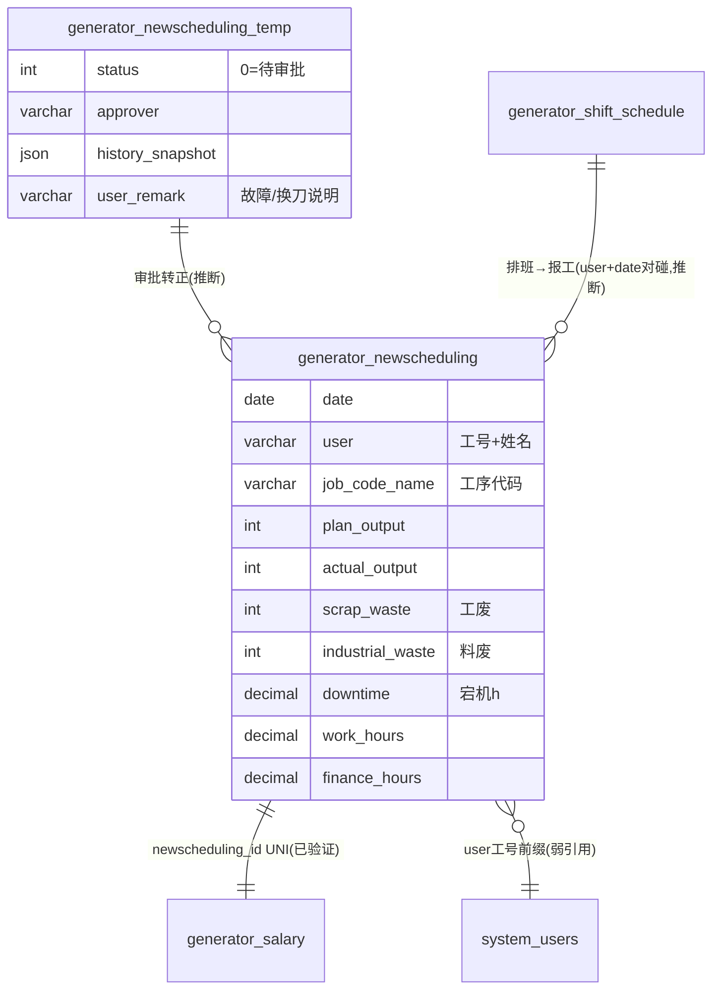

# 新排程模块 · fuadmin 数据字典
> 域: 02-生产铸造域 | 表数: 2 | 用途: Agent基础文件 | 生成: 2026-07-23

# newscheduling-新排程 · 模块概述

**newscheduling 是生产报工的核心数据表**，承载"人×机×工序×日"维度的产量、工时与废品原始记录，是计件工资核算与生产统计的直接数据源。`generator_newscheduling`（约24.6万行）为正式报工单，`generator_newscheduling_temp`（约4.3万行）为报工暂存/审批暂存区（含用户备注、审批人、审批时间与历史快照 JSON）。上游衔接 plan 生产计划与 shift 班次排班，下游被人力域工资模块引用（`salary.newscheduling_id` 带 UNIQUE 索引，已验证一一对应），同时是"报工统计"简报（计划/实产/完成率/工废/料废/宕机）的底层字段来源。

# newscheduling-新排程 · 上岗指南

## 2.1 核心实体

| 表 | 一句话定义 |
|---|---|
| generator_newscheduling | 生产报工正式单：人×日×工序的产量/工时/工废/料废/宕机（24.6万行，核心表） |
| generator_newscheduling_temp | 报工暂存与审批区：含员工备注（故障/换刀说明）、审批人、历史快照 |

## 2.2 核心业务流

1. 班次执行：员工按 shift 排班上机，对应设备（`device_code`）与工序（`job_code_name`，格式"机加-缸盖-GS61...-OP05-1"）。
2. 班后报工：写入 `newscheduling_temp`（产量 actual_output、工时 work_hours、工废 scrap_waste、料废 industrial_waste、宕机 downtime、备注 user_remark——样本可见"OP50换刀尺寸超差，机床故障，调试3小时"）。
3. 审批转正：班长审批（`approver`/`approve_time`，`history_snapshot` JSON 留存修改痕迹），数据进入正式表 `newscheduling`（样本 status="冻结"=已归档锁定）。
4. 工资联动：人力域 salary 表按 `newscheduling_id` 逐条引用报工单核算计件工资（UNIQUE 约束保证一单对应一条工资记录）。
5. 财务口径：`finance_hours` 与 `work_hours` 并存——财务结算工时与报工工时可能不同[推断-中]。

## 2.3 典型查询场景

**场景1：某产线某日产量与达成率**
```sql
SELECT date, job_code_name, SUM(plan_output), SUM(actual_output),
       ROUND(SUM(actual_output)/NULLIF(SUM(plan_output),0)*100,1) AS 达成率
FROM generator_newscheduling
WHERE date='2026-07-15' AND job_code_name LIKE '机加-缸盖%'
GROUP BY date, job_code_name;
```

**场景2：工废/料废 TOP 工序（质量溯源入口）**
```sql
SELECT job_code_name, SUM(scrap_waste) AS 工废, SUM(industrial_waste) AS 料废
FROM generator_newscheduling
WHERE date >= DATE_SUB(CURDATE(), INTERVAL 30 DAY)
GROUP BY job_code_name ORDER BY 工废+料废 DESC LIMIT 10;
```

**场景3：宕机时间分析（设备效率）**
```sql
SELECT device_code, SUM(downtime) AS 宕机小时, COUNT(*) AS 报工次数
FROM generator_newscheduling
WHERE downtime > 0 AND date >= '2026-07-01'
GROUP BY device_code ORDER BY 宕机小时 DESC;
```

**场景4：员工计件工资核算依据**
```sql
SELECT user, SUM(actual_output) AS 产量, SUM(work_hours) AS 工时, SUM(finance_hours) AS 财务工时
FROM generator_newscheduling
WHERE user LIKE '21578%' AND date BETWEEN '2026-07-01' AND '2026-07-31'
GROUP BY user;
```

**场景5：未审批报工积压**
```sql
SELECT date, site, dept, user, job_code_name, actual_output, user_remark
FROM generator_newscheduling_temp
WHERE status=0 AND approver IS NULL
ORDER BY date DESC;
```

## 2.4 避坑提示

- ⚠️ **`scrap_waste`=工废、`industrial_waste`=料废**——与"报工统计"列映射（E=工废、F=料废）一致，两者经济责任不同（工废考核操作者，料废考核来料），统计时不可合并[推断-高，样本+列名互证]。
- ⚠️ `user` 字段是"工号+姓名"拼接字符串（如"21578 某某"），**无 FK**，关联 system_users 需按工号前缀拆分对碰——全库人员弱引用惯例。
- ⚠️ `right`/`left` 两字段语义不明（样本均为 0）[待确认]，勿臆测为左右件。
- ⚠️ 正式表 status 样本值="冻结"，temp 表 status=0（数值）——两表状态类型不同（varchar vs int），UNION 时需统一。
- ⚠️ `downtime` 单位 decimal(6,1) 按小时计（样本 3.0/3.5 与备注"调试3小时"互证）[推断-高]。
- ⚠️ temp 表的 `history_snapshot` JSON 是审批修改留痕，审计追溯用，常规统计勿解析。

## 3 数据字典

### generator_newscheduling（约 246180 行）
业务定义: 生产报工正式单（人×日×工序：产量/工时/工废/料废/宕机，工资核算数据源） ｜ 表注释: -

| 字段 | 类型 | 可空 | 键 | 原始注释 | 推断语义 | 置信度 |
|---|---|---|---|---|---|---|
| id | bigint | N | PRI | - | 主键ID | high |
| remark | varchar(255) | Y | - | - | 备注 | high |
| modifier | varchar(255) | Y | - | - | 最后修改人姓名 | high |
| belong_dept | int | Y | - | - | 所属部门ID | mid |
| update_datetime | datetime(6) | Y | - | - | 最后更新时间 | high |
| create_datetime | datetime(6) | Y | - | - | 创建时间 | high |
| sort | int | Y | - | - | 排序号 | high |
| status | varchar(10) | Y | - | - | 状态（枚举值待确认）[推断] | mid |
| leader | varchar(20) | Y | - | - | 文本字段[推断-待确认] | low |
| scrap_waste | int | Y | - | - | 数值字段[推断-待确认] | low |
| industrial_waste | int | Y | - | - | 数值字段[推断-待确认] | low |
| device_code | varchar(30) | Y | - | - | 编号/代码[推断] | mid |
| train_user | varchar(30) | Y | - | - | 用户[推断] | mid |
| right | int | Y | - | - | 数值字段[推断-待确认] | low |
| left | int | Y | - | - | 数值字段[推断-待确认] | low |
| actual_output | int | Y | - | - | 实际值[推断] | high |
| plan_output | int | Y | - | - | 计划值[推断] | mid |
| work_hours | decimal(13,2) | Y | - | - | 数值（小数）[推断-待确认] | low |
| work_state | varchar(20) | Y | - | - | 状态（枚举值待确认）[推断] | mid |
| job_code_name | varchar(80) | Y | - | - | 名称[推断] | high |
| day_night | varchar(20) | Y | - | - | 文本字段[推断-待确认] | low |
| working_system | varchar(20) | Y | - | - | 文本字段[推断-待确认] | low |
| user | varchar(20) | Y | - | - | 用户[推断] | mid |
| dept | varchar(20) | Y | - | - | 部门[推断] | high |
| site | varchar(20) | Y | - | - | 站点[推断] | mid |
| creator_id | bigint | Y | MUL | - | 创建人ID → system_users.id | high |
| date | date | Y | - | - | 日期[推断] | high |
| product_name | varchar(50) | Y | - | - | 名称[推断] | high |
| downtime | decimal(6,1) | Y | - | - | 时间[推断] | high |
| finance_hours | decimal(13,2) | Y | - | - | 数值（小数）[推断-待确认] | low |

### generator_newscheduling_temp（约 42987 行）
业务定义: 报工暂存与审批区（含员工备注/审批人/历史快照，审批后转正式表） ｜ 表注释: -

| 字段 | 类型 | 可空 | 键 | 原始注释 | 推断语义 | 置信度 |
|---|---|---|---|---|---|---|
| id | bigint | N | PRI | - | 主键ID | high |
| remark | varchar(255) | Y | - | - | 备注 | high |
| modifier | varchar(255) | Y | - | - | 最后修改人姓名 | high |
| belong_dept | int | Y | - | - | 所属部门ID | mid |
| update_datetime | datetime(6) | Y | - | - | 最后更新时间 | high |
| create_datetime | datetime(6) | Y | - | - | 创建时间 | high |
| sort | int | Y | - | - | 排序号 | high |
| date | date | Y | - | - | 日期[推断] | high |
| site | varchar(20) | Y | - | - | 站点[推断] | mid |
| dept | varchar(20) | Y | - | - | 部门[推断] | high |
| user | varchar(50) | Y | - | - | 用户[推断] | mid |
| day_night | varchar(20) | Y | - | - | 文本字段[推断-待确认] | low |
| job_code_name | varchar(80) | Y | - | - | 名称[推断] | high |
| product_name | varchar(50) | Y | - | - | 名称[推断] | high |
| actual_output | int | Y | - | - | 实际值[推断] | high |
| work_hours | decimal(13,2) | Y | - | - | 数值（小数）[推断-待确认] | low |
| industrial_waste | int | Y | - | - | 数值字段[推断-待确认] | low |
| scrap_waste | int | Y | - | - | 数值字段[推断-待确认] | low |
| user_remark | varchar(255) | Y | - | - | 用户[推断] | mid |
| status | int | Y | - | - | 状态（枚举值待确认）[推断] | mid |
| creator_id | bigint | Y | MUL | - | 创建人ID → system_users.id | high |
| approve_time | datetime(6) | Y | - | - | 时间[推断] | high |
| approver | varchar(50) | Y | - | - | 审核人[推断] | mid |
| history_snapshot | json | Y | - | - | 待确认 | low |
| downtime | decimal(6,1) | Y | - | - | 时间[推断] | high |

## 4 模块ER图



推断关系说明：temp→正式表按字段同构+审批字段推断（高）；salary 联动为 UNIQUE 索引已验证（高）；shift→报工按 user+date 对碰（中）。

## 5 跨模块接口

| 本模块表.字段 | →目标模块.表.字段 | 依据 | 置信度 |
|---|---|---|---|
| generator_newscheduling.id | →hr-人力能力.generator_salary.newscheduling_id | sample(UNI索引) | high |
| generator_newscheduling.user | →system-用户权限.system_users.username(工号前缀) | naming | mid |
| generator_newscheduling.device_code | →device-设备装置.generator_devices.internal_code | naming | mid |
| generator_newscheduling.job_code_name | →hr-人力能力.generator_job_code(工号代码) | naming | mid |
| generator_newscheduling.creator_id | →system-用户权限.system_users.id | naming | high |
| generator_newscheduling_temp.approver | →system-用户权限.system_users(姓名字符串) | naming | low |

## 6 字段备注改进建议

（本模块为小型/过渡性模块，业务语义与归属建议见同域《零散模块总览》或域内相关主模块文档）

## 相关页面
- [[TF铸造模块-fuadmin数据字典]]
- [[fuadmin数据字典总览]]
- [[不良品与返工模块-fuadmin数据字典]]
- [[二维码追溯模块-fuadmin数据字典]]
- [[班次模块-fuadmin数据字典]]
- [[生产模块-fuadmin数据字典]]
- [[生产计划模块-fuadmin数据字典]]
