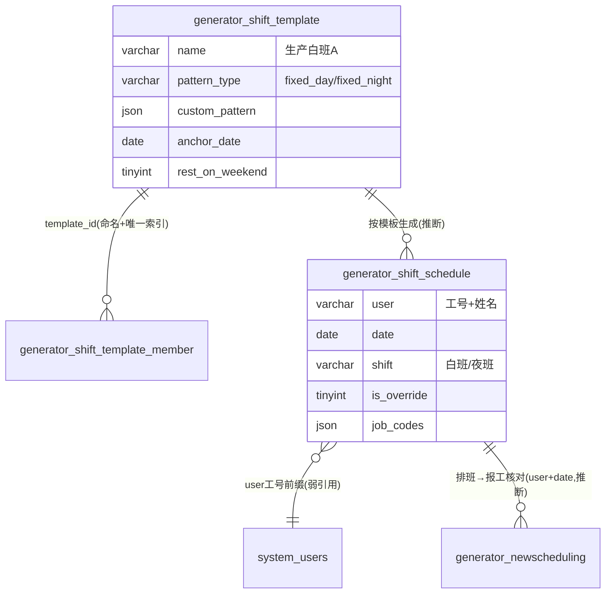

# 班次模块 · fuadmin 数据字典
> 域: 02-生产铸造域 | 表数: 3 | 用途: Agent基础文件 | 生成: 2026-07-23

# shift-班次 · 模块概述

班次模块管理"谁、哪天、上什么班"：template 定义轮班模式（固定白班/夜班/自定义 JSON），template_member 挂接员工，schedule 落为每日排班实例（2.1万条，site+user+date 唯一，支持 is_override 手工调班标记）。下游被 newscheduling 报工（day_night 核对）与 hr 人力（出勤核算）消费，是生产人力调度的基础模块。人员以"工号+姓名"字符串弱引用，无硬外键。

# shift-班次 · 上岗指南

## 2.1 核心实体

| 表 | 一句话定义 |
|---|---|
| generator_shift_schedule | 每日排班实例（人×日×班次，2.1万行，site+user+date唯一） |
| generator_shift_template | 排班模板（fixed_day/fixed_night/自定义JSON模式，13条） |
| generator_shift_template_member | 模板成员表（template_id+user联合唯一，140条） |

## 2.2 核心业务流

1. 定义模板：如"生产白班A"（pattern_type=fixed_day）、"生产夜班B"（fixed_night），支持 custom_pattern JSON 轮班模式与 anchor_date 锚定推算。
2. 挂成员：template_member 把员工挂到模板（按 site 分站点）。
3. 生成排班：按模板批量生成 schedule 实例（user/date/shift 白班|夜班）。
4. 手工调班：直接改 schedule 实例并置 `is_override=1`。
5. 下游消费：newscheduling 报工的 day_night 应与 schedule.shift 一致（可按 user+date 对碰校验）。

## 2.3 典型查询场景

**场景1：某人当月排班**
```sql
SELECT date, shift, is_override FROM generator_shift_schedule
WHERE user LIKE '15020%' AND date BETWEEN '2026-07-01' AND '2026-07-31' ORDER BY date;
```

**场景2：今日夜班人员名单**
```sql
SELECT user, dept FROM generator_shift_schedule
WHERE date=CURDATE() AND shift='夜班' AND site='治通';
```

**场景3：手工调班审计**
```sql
SELECT date, user, shift, modifier, update_datetime FROM generator_shift_schedule
WHERE is_override=1 ORDER BY update_datetime DESC LIMIT 50;
```

**场景4：模板成员覆盖检查（有模板未排班/排班无模板）**
```sql
SELECT m.user FROM generator_shift_template_member m
LEFT JOIN generator_shift_schedule s ON s.user=m.user AND s.date>=CURDATE()
WHERE m.template_id=5 AND s.id IS NULL;
```

## 2.4 避坑提示

- ⚠️ `user` 为"工号+姓名"拼接字符串无 FK，关联 system_users 需按工号前缀拆分（全库人员弱引用惯例）。
- ⚠️ `shift` 字段为自由文本（样本：白班/夜班），勿假定枚举封闭，统计建议 GROUP BY 先看分布。
- ⚠️ `is_override=1` 的记录是人工干预结果，按模板重算排班时会覆盖，做排班还原需排除。
- ⚠️ `job_codes` JSON 为空数组居多（样本=[]），与 hr 域 job_code 的绑定关系待确认。
- ⚠️ schedule 按 site 分站点数据共存（治通/广汇等），统计注意 site 过滤。

## 3 数据字典

### generator_shift_schedule（约 20980 行）
业务定义: 每日排班实例表（人×日×白班/夜班，site+user+date唯一，支持手工调班标记） ｜ 表注释: -

| 字段 | 类型 | 可空 | 键 | 原始注释 | 推断语义 | 置信度 |
|---|---|---|---|---|---|---|
| id | bigint | N | PRI | - | 主键ID | high |
| remark | varchar(255) | Y | - | - | 备注 | high |
| modifier | varchar(255) | Y | - | - | 最后修改人姓名 | high |
| belong_dept | int | Y | - | - | 所属部门ID | mid |
| update_datetime | datetime(6) | Y | - | - | 最后更新时间 | high |
| create_datetime | datetime(6) | Y | - | - | 创建时间 | high |
| sort | int | Y | - | - | 排序号 | high |
| site | varchar(20) | N | MUL | - | 站点[推断] | mid |
| dept | varchar(20) | Y | - | - | 部门[推断] | high |
| user | varchar(50) | N | - | - | 用户[推断] | mid |
| date | date | N | - | - | 日期[推断] | high |
| shift | varchar(10) | N | - | - | 班次[推断] | high |
| job_codes | json | Y | - | - | 待确认 | low |
| is_override | tinyint(1) | N | - | - | 标志位（布尔）[推断] | mid |
| creator_id | bigint | Y | MUL | - | 创建人ID → system_users.id | high |

### generator_shift_template（约 13 行）
业务定义: 排班模板表（固定白/夜班或自定义JSON轮班模式，锚定日期推算） ｜ 表注释: -

| 字段 | 类型 | 可空 | 键 | 原始注释 | 推断语义 | 置信度 |
|---|---|---|---|---|---|---|
| id | bigint | N | PRI | - | 主键ID | high |
| remark | varchar(255) | Y | - | - | 备注 | high |
| modifier | varchar(255) | Y | - | - | 最后修改人姓名 | high |
| belong_dept | int | Y | - | - | 所属部门ID | mid |
| update_datetime | datetime(6) | Y | - | - | 最后更新时间 | high |
| create_datetime | datetime(6) | Y | - | - | 创建时间 | high |
| sort | int | Y | - | - | 排序号 | high |
| site | varchar(20) | N | - | - | 站点[推断] | mid |
| name | varchar(30) | N | - | - | 名称[推断] | high |
| pattern_type | varchar(20) | N | - | - | 类型[推断] | mid |
| custom_pattern | json | Y | - | - | 待确认 | low |
| anchor_date | date | Y | - | - | 日期[推断] | high |
| rest_on_weekend | tinyint(1) | N | - | - | 数值字段[推断-待确认] | low |
| creator_id | bigint | Y | MUL | - | 创建人ID → system_users.id | high |
| dept | varchar(20) | Y | - | - | 部门[推断] | high |

### generator_shift_template_member（约 140 行）
业务定义: 排班模板成员表（template_id+user联合唯一） ｜ 表注释: -

| 字段 | 类型 | 可空 | 键 | 原始注释 | 推断语义 | 置信度 |
|---|---|---|---|---|---|---|
| id | bigint | N | PRI | - | 主键ID | high |
| remark | varchar(255) | Y | - | - | 备注 | high |
| modifier | varchar(255) | Y | - | - | 最后修改人姓名 | high |
| belong_dept | int | Y | - | - | 所属部门ID | mid |
| update_datetime | datetime(6) | Y | - | - | 最后更新时间 | high |
| create_datetime | datetime(6) | Y | - | - | 创建时间 | high |
| sort | int | Y | - | - | 排序号 | high |
| user | varchar(50) | N | - | - | 用户[推断] | mid |
| site | varchar(20) | N | - | - | 站点[推断] | mid |
| dept | varchar(20) | Y | - | - | 部门[推断] | high |
| creator_id | bigint | Y | MUL | - | 创建人ID → system_users.id | high |
| template_id | bigint | N | MUL | - | 关联ID → generator_shift_template.id[推断] | mid |

## 4 模块ER图



推断关系：template→member 为命名+联合唯一索引（高）；template→schedule 生成关系（中）；schedule→newscheduling 为业务对碰（中）。

## 5 跨模块接口

| 本模块表.字段 | →目标模块.表.字段 | 依据 | 置信度 |
|---|---|---|---|
| generator_shift_schedule.user | →system-用户权限.system_users.username(工号前缀) | naming | mid |
| generator_shift_template_member.template_id | →generator_shift_template.id | naming+唯一索引 | high |
| generator_shift_template_member.user | →system-用户权限.system_users(工号前缀) | naming | mid |
| generator_shift_schedule.user+date | →02域.generator_newscheduling.user+date(报工核对) | naming | mid |
| generator_shift_schedule.creator_id | →system-用户权限.system_users.id | naming | high |

## 6 字段备注改进建议

（本模块为小型/过渡性模块，业务语义与归属建议见同域《零散模块总览》或域内相关主模块文档）

## 相关页面
- [[TF铸造模块-fuadmin数据字典]]
- [[fuadmin数据字典总览]]
- [[不良品与返工模块-fuadmin数据字典]]
- [[二维码追溯模块-fuadmin数据字典]]
- [[新排程模块-fuadmin数据字典]]
- [[生产模块-fuadmin数据字典]]
- [[生产计划模块-fuadmin数据字典]]
