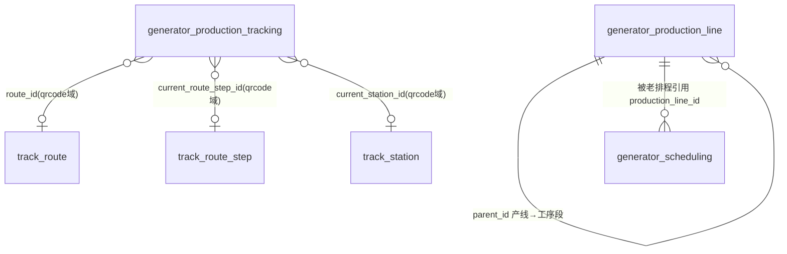

# 生产模块 · fuadmin 数据字典
> 域: 02-生产铸造域 | 表数: 3 | 用途: Agent基础文件 | 生成: 2026-07-23

# production-生产 模块概述

production 是生产执行的基础数据模块：`generator_production_line` 维护产线主数据（树形结构，parent_id 构成"产线→工序段"层级，如 CSS50T缸盖 → CSS50T缸盖-05-20），被 plan 模块老排程、newscheduling 新排程共同引用。`generator_production_knife_issue` 是刀具领用发放台账（2.1 万行，历史导入数据），记录厂区/领用人/柜号/层号/刀具型号/供应商/条码，是机加刀具消耗的追溯依据。`generator_production_tracking` 是新一代生产跟踪单（按工艺路线 route/站点 station 流转），当前 0 行、尚未启用——实际追溯仍走 qrcode 模块与 TF 批次桥表。

# production-生产 上岗指南

## 2.1 核心实体 TOP3

| 表 | 定义 |
|---|---|
| generator_production_line | 产线主数据(166行)：name 唯一，parent_id 自引用成树（产线→工序段），type=机加/铸造，status=启用/停用，process_state=正常 |
| generator_production_knife_issue | 刀具领用台账(2.1万行)：厂区+领用人+柜号/层号+型号+供应商+条码+领用时间 |
| generator_production_tracking | 生产跟踪单(0行未启用)：tracking_number 唯一，沿 route→route_step→station 流转，记录计划/实际起止日期 |

## 2.2 业务流

```
建产线档案(production_line, 树形: 产线 → 工序段)
   → 排程引用：generator_scheduling.production_line_id(老) / newscheduling按产线名(新,弱关联)
   → 刀具保障：库房按柜/层位发放刀具，扫码登记 knife_issue(条码=单把刀唯一)
   → (规划中)批次跟踪：production_tracking 沿 track_route/track_station 流转 ← 当前0行未启用
```

## 2.3 查询场景

**① 产线树（含工序段）**
```sql
SELECT p.id, p.name 产线, c.id 子id, c.name 工序段, c.status, c.process_state
FROM generator_production_line p
LEFT JOIN generator_production_line c ON c.parent_id = p.id
WHERE p.parent_id IS NULL ORDER BY p.id, c.id;
```

**② 某人刀具领用明细**
```sql
SELECT `time`, factory_name, receiver_name, model_number, supplier_name,
       cabinet_number, layer_number, barcode
FROM generator_production_knife_issue
WHERE receiver_name LIKE '%潘利飞%' ORDER BY `time` DESC LIMIT 100;
```

**③ 按型号统计刀具消耗（月度）**
```sql
SELECT model_number, supplier_name, COUNT(*) 领用把数
FROM generator_production_knife_issue
WHERE `time` >= '2021-11-01' AND `time` < '2021-12-01'
GROUP BY model_number, supplier_name ORDER BY 领用把数 DESC;
```

**④ 供应商刀具领用排行**
```sql
SELECT supplier_name, COUNT(DISTINCT barcode) 条码数, COUNT(*) 记录数
FROM generator_production_knife_issue
GROUP BY supplier_name ORDER BY 记录数 DESC LIMIT 20;
```

**⑤ 启用中的机加产线清单**
```sql
SELECT id, name, `type`, status, process_state
FROM generator_production_line
WHERE status = '启用' AND `type` = '机加' AND parent_id IS NULL;
```

**⑥ 跟踪单流转状态（新流程验证用，当前返回空）**
```sql
SELECT tracking_number, product_name, total_quantity, current_quantity,
       process_status, status FROM generator_production_tracking LIMIT 20;
```

## 2.4 避坑

1. **`production_tracking` 是空表**：0 行意味着新追溯流程未上线，追溯需求一律走 qrcode 模块（track_route/track_station）与 TF 桥表，勿在此表上做统计结论。
2. **`_MASK_TO_V2` 脱敏列**：knife_issue 上的 `bigint` 脱敏列，原始含义（疑似人员 id）已不可知，分析时直接忽略，勿当 FK join。
3. **knife_issue 是历史导入数据**：`create_datetime` 统一为 2025-11-29（批量导入），真实业务时间看 `time` 字段（样本为 2021 年），按时间过滤务必用 `time`。
4. **产线树两级**：父行=产线、子行=工序段（parent_id 自引用），统计"产线级"数据记得过滤 `parent_id IS NULL`，否则工序段重复计入。
5. **name 有 UNI 但仅单行级**：产线改名会产生历史断点，老排程 `production_line_id` 指向的是 id 不是名，改名安全；但 newscheduling 侧按名弱关联，改名会断链（待确认）。
6. **`time`/`type` 是列名**：SQL 中建议反引号 `` `time` ``、`` `type` ``，避免与函数/关键字混淆。

## 3 数据字典

### generator_production_knife_issue（约 21764 行）
业务定义: 刀具领用发放台账：厂区/领用人/柜层位/型号/供应商/条码 ｜ 表注释: -

| 字段 | 类型 | 可空 | 键 | 原始注释 | 推断语义 | 置信度 |
|---|---|---|---|---|---|---|
| id | bigint | N | PRI | - | 主键ID | high |
| remark | varchar(255) | Y | - | - | 备注 | high |
| modifier | varchar(255) | Y | - | - | 最后修改人姓名 | high |
| belong_dept | int | Y | - | - | 所属部门ID | mid |
| update_datetime | datetime(6) | Y | - | - | 最后更新时间 | high |
| create_datetime | datetime(6) | Y | - | - | 创建时间 | high |
| sort | int | Y | - | - | 排序号 | high |
| remarks | varchar(255) | Y | - | - | 文本字段[推断-待确认] | low |
| factory_name | varchar(255) | Y | - | - | 名称[推断] | high |
| receiver_name | varchar(255) | Y | - | - | 名称[推断] | high |
| layer_number | varchar(255) | Y | - | - | 编号/代码[推断] | mid |
| cabinet_number | varchar(255) | Y | - | - | 编号/代码[推断] | mid |
| model_number | varchar(255) | Y | - | - | 编号/代码[推断] | mid |
| supplier_name | varchar(255) | Y | - | - | 名称[推断] | high |
| barcode | varchar(255) | Y | - | - | 文本字段[推断-待确认] | low |
| time | datetime(6) | Y | - | - | 时间[推断] | high |
| creator_id | bigint | Y | MUL | - | 创建人ID → system_users.id | high |
| _MASK_TO_V2 | bigint | Y | MUL | - | 数值字段[推断-待确认] | low |

### generator_production_line（约 166 行）
业务定义: 产线主数据：树形(产线→工序段)，名称唯一，含类型与状态 ｜ 表注释: -

| 字段 | 类型 | 可空 | 键 | 原始注释 | 推断语义 | 置信度 |
|---|---|---|---|---|---|---|
| id | bigint | N | PRI | - | 主键ID | high |
| remark | varchar(255) | Y | - | - | 备注 | high |
| modifier | varchar(255) | Y | - | - | 最后修改人姓名 | high |
| belong_dept | int | Y | - | - | 所属部门ID | mid |
| update_datetime | datetime(6) | Y | - | - | 最后更新时间 | high |
| create_datetime | datetime(6) | Y | - | - | 创建时间 | high |
| sort | int | Y | - | - | 排序号 | high |
| status | varchar(255) | Y | - | - | 状态（枚举值待确认）[推断] | mid |
| process_state | varchar(255) | Y | - | - | 状态（枚举值待确认）[推断] | mid |
| type | varchar(255) | Y | - | - | 类型[推断] | mid |
| name | varchar(255) | Y | UNI | - | 名称[推断] | high |
| creator_id | bigint | Y | MUL | - | 创建人ID → system_users.id | high |
| parent_id | bigint | Y | MUL | - | 关联ID（目标表待确认）[推断] | low |

### generator_production_tracking（约 0 行）
业务定义: 生产跟踪单：按工艺路线流转的批次跟踪(0行,未启用) ｜ 表注释: -

| 字段 | 类型 | 可空 | 键 | 原始注释 | 推断语义 | 置信度 |
|---|---|---|---|---|---|---|
| id | bigint | N | PRI | - | 主键ID | high |
| remark | longtext | Y | - | - | 备注 | high |
| modifier | varchar(255) | Y | - | - | 最后修改人姓名 | high |
| belong_dept | int | Y | - | - | 所属部门ID | mid |
| update_datetime | datetime(6) | Y | - | - | 最后更新时间 | high |
| create_datetime | datetime(6) | Y | - | - | 创建时间 | high |
| sort | int | Y | - | - | 排序号 | high |
| tracking_number | varchar(50) | N | UNI | - | 编号/代码[推断] | mid |
| product_name | varchar(100) | Y | - | - | 名称[推断] | high |
| total_quantity | int | N | - | - | 数量[推断] | high |
| current_quantity | int | N | - | - | 数量[推断] | high |
| current_sequence | int | N | - | - | 数值字段[推断-待确认] | low |
| process_status | varchar(20) | N | - | - | 状态（枚举值待确认）[推断] | mid |
| status | varchar(20) | N | - | - | 状态（枚举值待确认）[推断] | mid |
| source_type | varchar(20) | Y | - | - | 类型[推断] | mid |
| source_id | int | Y | - | - | 关联ID（目标表待确认）[推断] | low |
| source_number | varchar(50) | Y | - | - | 编号/代码[推断] | mid |
| plan_start_date | date | Y | - | - | 日期[推断] | high |
| plan_end_date | date | Y | - | - | 日期[推断] | high |
| actual_start_date | date | Y | - | - | 日期[推断] | high |
| actual_end_date | date | Y | - | - | 日期[推断] | high |
| site | varchar(20) | Y | - | - | 站点[推断] | mid |
| creator_id | bigint | Y | MUL | - | 创建人ID → system_users.id | high |
| product_id | bigint | Y | MUL | - | 关联ID → generator_bad_product.id[推断] | mid |
| current_route_step_id | bigint | Y | MUL | - | 关联ID（目标表待确认）[推断] | low |
| current_station_id | bigint | Y | MUL | - | 关联ID（目标表待确认）[推断] | low |
| route_id | bigint | Y | MUL | - | 关联ID → track_route.id[推断] | mid |

# production-生产 ER 关系

> 全景"计划-生产-班次-排程"关系图见 **plan-生产计划/04-ER.md**。本模块补充点如下：



## 本模块补充点

1. **产线树**：`generator_production_line.parent_id` 自引用，父=产线（如 CSS50T缸盖）、子=工序段（如 CSS50T缸盖-05-20），name 全局唯一。
2. **knife_issue 无外链**：刀具台账全是字符串字段（厂区/领用人/型号/供应商均为 varchar 快照），唯一疑似外链的 `_MASK_TO_V2` 已脱敏，视为独立事实表。
3. **tracking 外向 qrcode 域**：`route_id`/`current_route_step_id`/`current_station_id` 三张 FK 指向 qrcode 模块的 track_route / track_route_step / track_station，但表 0 行，属预留接口。

# production-生产 跨模块接口

| 方向 | 接口 | 说明 |
|---|---|---|
| ← plan | `generator_scheduling.production_line_id` → `generator_production_line.id` | 老排程按产线落计划（硬 FK，本模块是被引用方） |
| ← newscheduling | 新排程按产线名/产品名字符串弱关联 | 无 FK，改名有断链风险（待确认） |
| → qrcode | `production_tracking.route_id` → `track_route.id`；`current_route_step_id` → `track_route_step.id`；`current_station_id` → `track_station.id` | 新跟踪单预留的工艺路线接口（表 0 行，未启用） |
| → hr 域 | 产线与岗位/设备：`generator_jobcode_devices`（hr）按设备/岗位关联产线 | 排程-产线-人 三方对齐时的中间件（待确认字段级映射） |
| → system_users | 各表 `creator_id` → `system_users.id` | 创建人 |
| ← tf-TF铸造 | TF 铸造产线（熔炼/浇铸）与机加产线同存于 production_line，按 `type` 区分 | 跨工序产出衔接以产线+产品名对齐 |

## 关键提醒

- 刀具台账（knife_issue）为独立快照表：供应商、领用人都是字符串，若需与 supplier 域/hr 域对齐，只能按名称模糊匹配，注意重名。
- `production_tracking` 的 `source_type`/`source_id`/`source_number` 是通用来源挂接设计（可挂计划单、订单等），启用后将成为 plan→qrcode 的衔接点，当前勿依赖。

## 6 字段备注改进建议

（本模块为小型/过渡性模块，业务语义与归属建议见同域《零散模块总览》或域内相关主模块文档）

## 相关页面
- [[TF铸造模块-fuadmin数据字典]]
- [[fuadmin数据字典总览]]
- [[不良品与返工模块-fuadmin数据字典]]
- [[二维码追溯模块-fuadmin数据字典]]
- [[新排程模块-fuadmin数据字典]]
- [[班次模块-fuadmin数据字典]]
- [[生产计划模块-fuadmin数据字典]]
- [[质量检验模块-fuadmin数据字典]]
