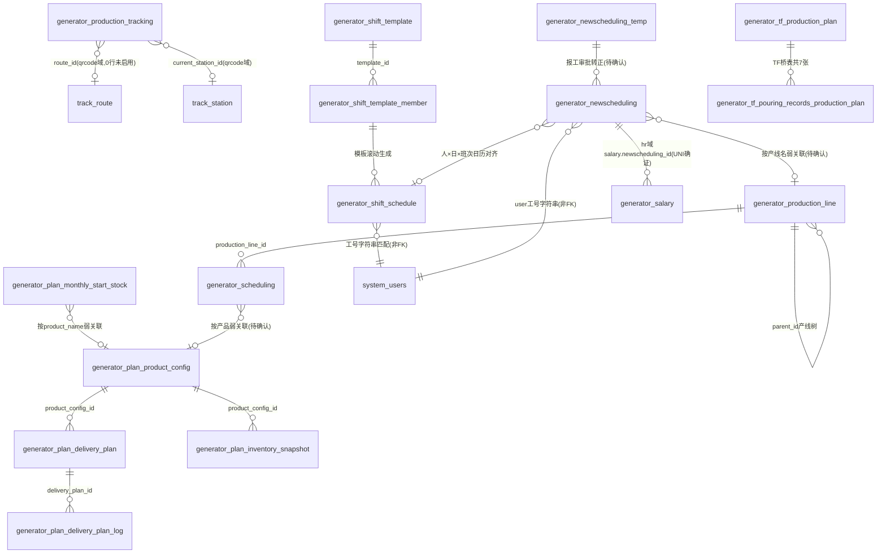

# 生产计划模块 · fuadmin 数据字典
> 域: 02-生产铸造域 | 表数: 6 | 用途: Agent基础文件 | 生成: 2026-07-23

# plan-生产计划 模块概述

plan 是生产铸造域的计划中枢：以 `generator_plan_product_config` 建立"产品×客户"主数据（件号、箱容量、日产能、厂区），以 `generator_plan_delivery_plan` 按日/周/月周期登记客户交付需求，并用 `generator_plan_inventory_snapshot`（六类存量日快照）与 `generator_plan_monthly_start_stock`（月初期初）完成"需求—库存—产能"平衡测算。

计划下达后进入执行层：`generator_scheduling`（老排程，2024 年数据）把计划落到"产线×人员×日期×班次"，新数据则流向 newscheduling 模块（新排程，按人按班记录实际产出）；shift 模块提供人员班次日历，production 模块提供产线主数据与刀具保障。所有交付计划的数量变更都在 `generator_plan_delivery_plan_log` 留痕（含新旧值、操作人、计划快照），可完整回溯计划调整历史。

# plan-生产计划 上岗指南

## 2.1 核心实体 TOP6

| 表 | 定义 |
|---|---|
| generator_plan_product_config | 产品×客户主数据：件号、箱容量、日产能、厂区(site)、联系人，UNI(product_name+customer_name) |
| generator_plan_delivery_plan | 客户交付计划：period_type(day/week/month)×plan_date×需求数，UNI(产品+周期+日期) |
| generator_plan_delivery_plan_log | 计划变更日志：快照"产品/周期/日期"+old/new需求值+操作人，全量留痕 |
| generator_plan_inventory_snapshot | 库存日快照：成品/毛坯/在制/报废/返修/客存六类存量，按产品按日 |
| generator_plan_monthly_start_stock | 月初期初：产品×年月的期初库存+预计总需求，UNI(product_name+year+month) |
| generator_scheduling | 老排程(2024年)：产线×人员×日期×早/晚班的计划/实际产出、工时、停机，UNI(部门+工号+产线+日期+班次) |

## 2.2 业务流

```
建产品主数据(product_config, 产品×客户)
   → 录交付需求(delivery_plan, 按日/周/月; 变更自动写log)
   → 每日盘点录库存快照(inventory_snapshot 六类存量) + 月初录期初(monthly_start_stock)
   → 计划员做"需求-库存-产能"平衡(daily_capacity 日产能)
   → 下达执行：老口径 generator_scheduling(2024) / 新口径 newscheduling 模块
   → TF铸造按 generator_tf_production_plan 批次投产，7张桥表回写追溯
```

## 2.3 查询场景

**① 某产品某月交付计划汇总**
```sql
SELECT p.product_name, p.customer_name, d.period_type, d.plan_date, d.demand_qty
FROM generator_plan_delivery_plan d
JOIN generator_plan_product_config p ON p.id = d.product_config_id
WHERE p.product_name = 'PFI缸体' AND d.year = 2026 AND d.month = 6
ORDER BY d.plan_date;
```

**② 计划变更追踪（谁改了需求）**
```sql
SELECT plan_snapshot, action, old_value, new_value, operator, operate_time
FROM generator_plan_delivery_plan_log
WHERE plan_snapshot LIKE 'PFI缸体%' ORDER BY operate_time DESC LIMIT 50;
```

**③ 各产品最新库存快照（六类存量）**
```sql
SELECT s.product_config_id, p.product_name, s.snapshot_date,
       s.finished_stock, s.blank_stock, s.in_process_qty,
       s.scrap_stock, s.repair_stock, s.customer_stock
FROM generator_plan_inventory_snapshot s
JOIN generator_plan_product_config p ON p.id = s.product_config_id
JOIN (SELECT product_config_id, MAX(snapshot_date) md
      FROM generator_plan_inventory_snapshot GROUP BY product_config_id) t
  ON t.product_config_id = s.product_config_id AND t.md = s.snapshot_date;
```

**④ 计划达成率（交付需求 vs 新排程实际产出，按产品名+日期弱关联）**
```sql
SELECT d.plan_date, p.product_name, SUM(d.demand_qty) 计划需求,
       IFNULL(n.实际产出,0) 实际产出
FROM generator_plan_delivery_plan d
JOIN generator_plan_product_config p ON p.id = d.product_config_id
LEFT JOIN (SELECT product_name, `date`, SUM(actual_output) 实际产出
           FROM generator_newscheduling GROUP BY product_name, `date`) n
  ON n.product_name = p.product_name AND n.`date` = d.plan_date
WHERE d.period_type = 'day' AND d.plan_date BETWEEN '2026-06-01' AND '2026-06-30'
GROUP BY d.plan_date, p.product_name;
```

**⑤ 老排程产线日产出（2024 历史口径）**
```sql
SELECT s.`date`, l.name 产线, s.day_night,
       SUM(s.plan_output) 计划, SUM(s.actual_output) 实际, SUM(s.downtime) 停机分钟
FROM generator_scheduling s
JOIN generator_production_line l ON l.id = s.production_line_id
WHERE s.`date` BETWEEN '2024-04-01' AND '2024-04-30'
GROUP BY s.`date`, l.name, s.day_night ORDER BY s.`date`;
```

**⑥ 月初期初与当月需求平衡检查**
```sql
SELECT m.product_name, m.year, m.month, m.start_stock, m.expected_total_demand,
       (m.start_stock - m.expected_total_demand) 缺口
FROM generator_plan_monthly_start_stock m
WHERE m.year = 2026 AND m.month = 6;
```

## 2.4 避坑

1. **新老排程双轨**：`generator_scheduling` 是 2024 年老口径（按产线），2024 年后实际执行数据在 `generator_newscheduling`（按人）。跨期统计勿混用，先确认业务方要哪套口径。
2. **同产品多客户**：`product_config` UNI 是(产品名+客户名)，同一 PFI缸体 有宝鸡吉利/义乌吉利两行，按 product_name 查会漏客户维度。
3. **库存快照无唯一约束**：同产品同 `snapshot_date` 可多条，取数必须按"最新快照日+最大id"去重，勿直接按日 join。
4. **period_type 三值**：day/week/month 共存，同产品同日期只能各一条（UNI）；按月汇总时只取 period_type='day' 的记录，否则重复计。
5. **delivery_plan 与 newscheduling 无硬外键**：计划→实际只能按 product_name+date 弱关联，产品名写法不一致时（如"GL31 FE缸盖"多空格）会漏匹配，必要时先清洗。
6. **`code_id`/`train_user_code_id` 指向待确认**：疑似 hr 域 `generator_job_code` 与人员工号，join 前先用样本值验证。

## 3 数据字典

### generator_plan_delivery_plan（约 520 行）
业务定义: 客户交付计划表：按产品×周期(日/周/月)×日期登记需求数量 ｜ 表注释: -

| 字段 | 类型 | 可空 | 键 | 原始注释 | 推断语义 | 置信度 |
|---|---|---|---|---|---|---|
| id | bigint | N | PRI | - | 主键ID | high |
| remark | varchar(255) | Y | - | - | 备注 | high |
| modifier | varchar(255) | Y | - | - | 最后修改人姓名 | high |
| belong_dept | int | Y | - | - | 所属部门ID | mid |
| update_datetime | datetime(6) | Y | - | - | 最后更新时间 | high |
| create_datetime | datetime(6) | Y | - | - | 创建时间 | high |
| sort | int | Y | - | - | 排序号 | high |
| period_type | varchar(10) | N | - | - | 类型[推断] | mid |
| plan_date | date | N | - | - | 日期[推断] | high |
| year | int | N | - | - | 数值字段[推断-待确认] | low |
| month | int | Y | - | - | 数值字段[推断-待确认] | low |
| demand_qty | int | N | - | - | 数量[推断] | high |
| creator_id | bigint | Y | MUL | - | 创建人ID → system_users.id | high |
| customer_order_id | bigint | Y | MUL | - | 关联ID → generator_customer_order.id[推断] | mid |
| product_config_id | bigint | N | MUL | - | 关联ID → generator_plan_product_config.id[推断] | mid |

### generator_plan_delivery_plan_log（约 707 行）
业务定义: 交付计划变更日志：记录新旧需求值、操作人与计划快照 ｜ 表注释: -

| 字段 | 类型 | 可空 | 键 | 原始注释 | 推断语义 | 置信度 |
|---|---|---|---|---|---|---|
| id | bigint | N | PRI | - | 主键ID | high |
| plan_snapshot | varchar(200) | N | - | - | 计划值[推断] | mid |
| action | varchar(20) | N | - | - | 文本字段[推断-待确认] | low |
| old_value | int | Y | - | - | 数值字段[推断-待确认] | low |
| new_value | int | Y | - | - | 数值字段[推断-待确认] | low |
| operator | varchar(50) | N | - | - | 操作人[推断] | high |
| operate_time | datetime(6) | N | - | - | 时间[推断] | high |
| remark | varchar(255) | Y | - | - | 备注 | high |
| delivery_plan_id | bigint | Y | MUL | - | 关联ID → generator_plan_delivery_plan.id[推断] | mid |

### generator_plan_inventory_snapshot（约 799 行）
业务定义: 产品库存日快照：成品/毛坯/在制/报废/返修/客存六类存量 ｜ 表注释: -

| 字段 | 类型 | 可空 | 键 | 原始注释 | 推断语义 | 置信度 |
|---|---|---|---|---|---|---|
| id | bigint | N | PRI | - | 主键ID | high |
| remark | varchar(255) | Y | - | - | 备注 | high |
| modifier | varchar(255) | Y | - | - | 最后修改人姓名 | high |
| belong_dept | int | Y | - | - | 所属部门ID | mid |
| update_datetime | datetime(6) | Y | - | - | 最后更新时间 | high |
| create_datetime | datetime(6) | Y | - | - | 创建时间 | high |
| sort | int | Y | - | - | 排序号 | high |
| snapshot_date | date | N | - | - | 日期[推断] | high |
| finished_stock | int | N | - | - | 数值字段[推断-待确认] | low |
| scrap_stock | int | N | - | - | 数值字段[推断-待确认] | low |
| blank_stock | int | N | - | - | 数值字段[推断-待确认] | low |
| in_process_qty | int | N | - | - | 数量[推断] | high |
| creator_id | bigint | Y | MUL | - | 创建人ID → system_users.id | high |
| product_config_id | bigint | N | MUL | - | 关联ID → generator_plan_product_config.id[推断] | mid |
| repair_stock | int | N | - | - | 数值字段[推断-待确认] | low |
| customer_stock | int | N | - | - | 客户[推断] | high |

### generator_plan_monthly_start_stock（约 4 行）
业务定义: 月初期初库存表：按产品×年月登记期初量与预计总需求 ｜ 表注释: -

| 字段 | 类型 | 可空 | 键 | 原始注释 | 推断语义 | 置信度 |
|---|---|---|---|---|---|---|
| id | bigint | N | PRI | - | 主键ID | high |
| remark | varchar(255) | Y | - | - | 备注 | high |
| modifier | varchar(255) | Y | - | - | 最后修改人姓名 | high |
| belong_dept | int | Y | - | - | 所属部门ID | mid |
| update_datetime | datetime(6) | Y | - | - | 最后更新时间 | high |
| create_datetime | datetime(6) | Y | - | - | 创建时间 | high |
| sort | int | Y | - | - | 排序号 | high |
| product_name | varchar(50) | N | MUL | - | 名称[推断] | high |
| year | int | N | - | - | 数值字段[推断-待确认] | low |
| month | int | N | - | - | 数值字段[推断-待确认] | low |
| start_stock | int | N | - | - | 开始（时间/范围）[推断] | mid |
| expected_total_demand | int | N | - | - | 数值字段[推断-待确认] | low |
| creator_id | bigint | Y | MUL | - | 创建人ID → system_users.id | high |

### generator_plan_product_config（约 46 行）
业务定义: 产品×客户主数据：件号、箱容量、日产能、厂区与联系人 ｜ 表注释: -

| 字段 | 类型 | 可空 | 键 | 原始注释 | 推断语义 | 置信度 |
|---|---|---|---|---|---|---|
| id | bigint | N | PRI | - | 主键ID | high |
| remark | varchar(255) | Y | - | - | 备注 | high |
| modifier | varchar(255) | Y | - | - | 最后修改人姓名 | high |
| belong_dept | int | Y | - | - | 所属部门ID | mid |
| update_datetime | datetime(6) | Y | - | - | 最后更新时间 | high |
| create_datetime | datetime(6) | Y | - | - | 创建时间 | high |
| sort | int | Y | - | - | 排序号 | high |
| product_name | varchar(50) | N | MUL | - | 名称[推断] | high |
| customer_name | varchar(50) | N | - | - | 名称[推断] | high |
| part_number | varchar(50) | Y | - | - | 编号/代码[推断] | mid |
| box_capacity | int | Y | - | - | 数值字段[推断-待确认] | low |
| daily_capacity | int | Y | - | - | 数值字段[推断-待确认] | low |
| production_line | varchar(50) | Y | - | - | 产线[推断] | mid |
| contact_person | varchar(50) | Y | - | - | 联系人[推断] | high |
| is_active | tinyint(1) | N | - | - | 标志位（布尔）[推断] | mid |
| creator_id | bigint | Y | MUL | - | 创建人ID → system_users.id | high |
| site | varchar(20) | N | - | - | 站点[推断] | mid |

### generator_scheduling（约 4379 行）
业务定义: 老排程表：按产线×人员×日期×班次记录计划/实际产出与工时 ｜ 表注释: -

| 字段 | 类型 | 可空 | 键 | 原始注释 | 推断语义 | 置信度 |
|---|---|---|---|---|---|---|
| id | bigint | N | PRI | - | 主键ID | high |
| remark | varchar(255) | Y | - | - | 备注 | high |
| modifier | varchar(255) | Y | - | - | 最后修改人姓名 | high |
| belong_dept | int | Y | MUL | - | 所属部门ID | mid |
| update_datetime | datetime(6) | Y | - | - | 最后更新时间 | high |
| create_datetime | datetime(6) | Y | - | - | 创建时间 | high |
| sort | int | Y | - | - | 排序号 | high |
| actual_output | int | Y | - | - | 实际产量[推断] | high |
| work_hours | decimal(13,1) | Y | - | - | 工时/小时[推断] | mid |
| date | date | Y | - | - | 日期[推断] | high |
| day_night | varchar(255) | Y | - | - | 文本字段[推断-待确认] | low |
| work_state | varchar(255) | Y | - | - | 状态（枚举值待确认）[推断] | mid |
| code_id | bigint | Y | MUL | - | 关联ID → generator_job_code.id[推断] | mid |
| creator_id | bigint | Y | MUL | - | 创建人ID → system_users.id | high |
| production_line_id | bigint | Y | MUL | - | 关联ID → generator_production_line.id[推断] | mid |
| train_user_code_id | bigint | Y | MUL | - | 关联ID（目标表待确认）[推断] | low |
| plan_output | int | Y | - | - | 计划产量[推断] | high |
| downtime | int | Y | - | - | 时间[推断] | high |

# 生产铸造域 ER 总图（plan / production / shift / newscheduling 四模块合画）

> 本图为"计划 → 生产 → 班次 → 排程"全景关系图，其余三个模块的 04-ER.md 均引用本图。
> 虚线含义：跨模块/跨域引用、字符串弱关联（非真实 FK）在备注中说明。



## 读图要点

1. **计划链**：`product_config`(产品×客户主数据) 1→N `delivery_plan`(需求) 1→N `delivery_plan_log`(变更留痕)；库存侧由 `inventory_snapshot`(日快照) + `monthly_start_stock`(月初期初) 补齐。
2. **执行链**：`production_line`(产线树) 被 `generator_scheduling`(老排程) 以 `production_line_id` 引用；新数据走 `newscheduling_temp`(报工待审) → `generator_newscheduling`(主表)。
3. **人员链**：`shift_template` + `template_member` 滚动生成 `shift_schedule`(人×日×班次日历，UNI(site,user,date))，与 `newscheduling` 按"人+日期+白/夜班"对齐。
4. **计件锚点**：hr 域 `generator_salary.newscheduling_id` → `generator_newscheduling.id`（UNI 索引确证），是排程到工资的唯一硬外键。
5. **TF 追溯**：`generator_tf_production_plan` 下挂 7 张 `*_production_plan` 桥表（浇铸/熔炼/光谱/拉伸/快检/加金/炉前），是批次追溯主通道，详见 tf 模块文档。
6. **注意**：`shift_schedule.user`、`newscheduling.user` 均为 `"工号 姓名"` 拼接字符串（如 `15020 饶官军`），并非 FK，关联 `system_users` 需按工号拆分匹配。

# plan-生产计划 跨模块接口

## 出向（本模块被谁用 / 引用谁）

| 方向 | 接口 | 说明 |
|---|---|---|
| → production | `generator_scheduling.production_line_id` → `generator_production_line.id` | 老排程引用产线主数据（硬 FK） |
| → hr 域 | `generator_scheduling.code_id` → `generator_job_code.id`（待确认） | 工号/岗位代码引用，样本 code_id=56 |
| → 订单域(04) | `delivery_plan.customer_order_id` → 客户订单表 | 需求可挂到具体客户订单（可空） |
| → system_users | 各表 `creator_id` → `system_users.id` | 创建人；`modifier` 为姓名字符串 |
| ← tf-TF铸造 | `generator_tf_production_plan` 及 7 张 `*_production_plan` 桥表 | TF 批次按生产计划投产，批次追溯主通道（熔炼/浇铸/光谱/拉伸/快检/加金/炉前各一张桥表） |
| ← qrcode | 追溯链按 product_name 弱关联计划产品 | 二维码出入库与交付计划无硬 FK，按产品+日期对齐 |

## 入向（谁依赖本模块数据）

- **newscheduling 新排程**：`delivery_plan` 的日需求是排程 `plan_output` 的来源口径（弱关联，无 FK）。
- **salary(hr 域)**：计件工资最终锚在 `generator_newscheduling`，计划达成分析需 plan+newscheduling 联查。
- **bad-不良品**：`inventory_snapshot.scrap_stock` 与不良品域数据口径需对齐（待确认是否同源）。

## 关键提醒

- `delivery_plan.customer_order_id`、`inventory_snapshot` 各 stock 字段均为 int，无单位字段，默认"件"。
- 跨域联查统一锚点：产品用 `product_config.id`/`product_name`，人员用工号字符串，日期用 `plan_date`/`date`。

## 6 字段备注改进建议

（待 enrich 补充）

## 相关页面
- [[TF铸造模块-fuadmin数据字典]]
- [[fuadmin数据字典总览]]
- [[不良品与返工模块-fuadmin数据字典]]
- [[二维码追溯模块-fuadmin数据字典]]
- [[新排程模块-fuadmin数据字典]]
- [[班次模块-fuadmin数据字典]]
- [[生产模块-fuadmin数据字典]]
