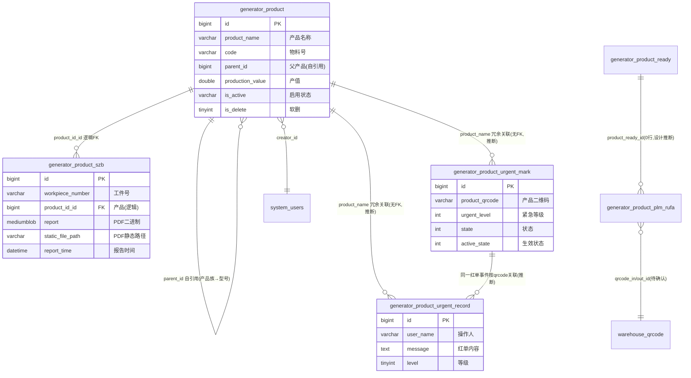

# 产品模块 · fuadmin 数据字典
> 域: 03-质量技术域 | 表数: 6 | 用途: Agent基础文件 | 生成: 2026-07-23

# product-产品 · 概述

product 模块是**产品主数据 + 产品级过程档案 + 红单拦截**域，共 6 表。`generator_product`（69行）是产品主数据：product_name（MP缸体/GS62HEV缸盖）、code（物料号 5511695971）、parent_id 自引用构成产品族层级、production_value 产值、is_active/is_delete 双状态软删。`generator_product_szb`（15.2万行）是产品随工本/过程报告存档：按 workpiece_number（工件号）+ report_time 存 PDF（report mediumblob 或 static_file_path 路径），product_id_id 逻辑外键回挂主数据。`generator_product_urgent_mark`（3886行）与 `generator_product_urgent_record`（2055行）构成红单（致命异常）拦截与处理记录：按 product_qrcode 标记 urgent_level（如“断刀拦截”“二维码明暗码不一致”）。`generator_product_plm_rufa`、`generator_product_ready` 两表 0 行，疑为 PLM 二维码出入库/产品准备的待上线功能，语义待确认。

# product-产品 · 上岗指南

## 2.1 核心实体表（TOP6）

| 表 | 一句话定义 |
|---|---|
| generator_product | 产品主数据（69行）：product_name、code 物料号、parent_id 层级、production_value 产值、is_active/is_delete |
| generator_product_szb | 随工本PDF存档（15.2万行）：workpiece_number 工件号、report_time、report blob / static_file_path |
| generator_product_urgent_mark | 紧急拦截标记（3886行）：product_qrcode + urgent_level + state/active_state |
| generator_product_urgent_record | 红单处理记录（2055行）：user_name 操作人、message 红单内容、level 等级 |
| generator_product_plm_rufa | PLM二维码出入库关联（0行，待上线/待确认） |
| generator_product_ready | 产品准备登记（0行，语义待确认） |

## 2.2 核心业务流

1. **产品建档**：在 `generator_product` 登记 product_name（MP缸体）、code（客户物料号 5511695971）、material_number；parent_id 自引用形成“产品族→具体型号”层级（如 id=16 为族，MP/LP 缸体挂其下）；production_value 记产值/单价，remark 记价格变更史，history 长文本记变更履历。
2. **生产建档**：工件下线后生成工件号 workpiece_number（415561126）与二维码，过程检验文件（随工本/记录单）扫描成 PDF 写入 `generator_product_szb`——report mediumblob 存二进制，同时 static_file_path 存 `SZB_PDF/2024-04-12/37.pdf` 静态路径。
3. **异常拦截**：检出致命异常（断刀拦截、二维码明暗码不一致）时写 `generator_product_urgent_mark`——product_qrcode + urgent_level（1=红色致命，推断）+ active_state/state 控制拦截生效。
4. **红单处理**：处理动作落 `generator_product_urgent_record`——user_name（“工号 姓名(角色)”）、message（“红单产品【MP缸体】等级：红色(致命)…”）、level 等级。
5. **PLM 出入库**（待上线）：`generator_product_plm_rufa` 设计为 qrcode ↔ qrcode_in_id/qrcode_out_id 出入库扫码关联，当前 0 行。

## 2.3 典型查询场景

**场景1：产品层级树（族→型号）**
```sql
SELECT p.id, p.product_name, p.code, p.is_active,
       parent.product_name AS family_name
FROM generator_product p
LEFT JOIN generator_product parent ON parent.id = p.parent_id
WHERE p.is_delete = 0
ORDER BY p.parent_id, p.sort;
```

**场景2：某产品的随工本数量与最新归档**
```sql
SELECT COUNT(*) AS szb_cnt, MAX(report_time) AS last_report
FROM generator_product_szb
WHERE product_id_id = 1;
```

**场景3：红单拦截 TOP 产品（近90天）**
```sql
SELECT product_name, COUNT(*) AS mark_cnt
FROM generator_product_urgent_mark
WHERE create_datetime >= DATE_SUB(NOW(), INTERVAL 90 DAY)
GROUP BY product_name
ORDER BY mark_cnt DESC
LIMIT 10;
```

**场景4：当前生效中的拦截标记（未解除）**
```sql
SELECT product_name, product_qrcode, urgent_level, remark, create_datetime
FROM generator_product_urgent_mark
WHERE state = 1 AND active_state = 1
ORDER BY create_datetime DESC;
```

**场景5：红单处理月报（按等级）**
```sql
SELECT DATE_FORMAT(create_datetime, '%Y-%m') AS ym, level, COUNT(*) AS cnt
FROM generator_product_urgent_record
GROUP BY ym, level
ORDER BY ym DESC;
```

**场景6：按工件号查随工本PDF路径**
```sql
SELECT workpiece_number, product_name, report_time, static_file_path
FROM generator_product_szb
WHERE workpiece_number = '415561126';
```

## 2.4 避坑指南

- **双软删字段**：`is_active` 是 varchar（'启用'/疑'停用'）、`is_delete` 是 tinyint（0/1），查询有效产品要**两个都过滤**。
- **PDF 双存储**：`product_szb.report` 是 mediumblob 二进制，`static_file_path` 是静态文件路径——**优先用 static_file_path**，避免把 15 万行 blob 拉爆内存。
- **_MASK_TO_V2 / _MUSID_SYNC_V2 / _MASK_FROM_V2 是 V2 同步字段**（疑似新旧系统迁移掩码/同步ID），业务查询勿用。
- **product_name 全是冗余字符串**：urgent_mark/urgent_record/szb 都不挂 product.id（szb 有 product_id_id），跨表关联用名称 LIKE，改名会断链。
- **urgent_mark 的 state vs active_state 语义**：样本均为 1，差异待确认；建议先按“双1=生效”过滤。
- **urgent_record.level=1 对应“红色(致命)”**（从 message 文本推断），level 字典待确认。
- **product_plm_rufa / product_ready 均为 0 行空表**：勿在报表中依赖，语义待确认。

## 3 数据字典

### generator_product（约 69 行）
业务定义: 产品主数据：物料号/名称/父子层级/产值/重量/启停用软删 ｜ 表注释: -

| 字段 | 类型 | 可空 | 键 | 原始注释 | 推断语义 | 置信度 |
|---|---|---|---|---|---|---|
| id | bigint | N | PRI | - | 主键ID | high |
| remark | varchar(255) | Y | - | - | 备注 | high |
| modifier | varchar(255) | Y | - | - | 最后修改人姓名 | high |
| belong_dept | int | Y | - | - | 所属部门ID | mid |
| update_datetime | datetime(6) | Y | - | - | 最后更新时间 | high |
| create_datetime | datetime(6) | Y | - | - | 创建时间 | high |
| sort | int | Y | - | - | 排序号 | high |
| product_name | varchar(255) | Y | - | - | 名称[推断] | high |
| creator_id | bigint | Y | MUL | - | 创建人ID → system_users.id | high |
| parent_id | bigint | Y | MUL | - | 关联ID（目标表待确认）[推断] | low |
| code | varchar(60) | Y | - | - | 编号/代码[推断] | mid |
| is_active | varchar(20) | Y | - | - | 标志位（布尔）[推断] | mid |
| material_number | varchar(80) | Y | - | - | 编号/代码[推断] | mid |
| production_value | double | Y | - | - | 产品[推断] | high |
| name | varchar(255) | Y | - | - | 名称[推断] | high |
| history | longtext | Y | - | - | 待确认 | low |
| weight | double | Y | - | - | 重量[推断] | high |
| is_delete | tinyint(1) | Y | - | - | 逻辑删除标志 | high |

### generator_product_plm_rufa（约 0 行）
业务定义: PLM产品二维码出入库关联（0行空表，疑待上线） ｜ 表注释: -

| 字段 | 类型 | 可空 | 键 | 原始注释 | 推断语义 | 置信度 |
|---|---|---|---|---|---|---|
| id | bigint | N | PRI | - | 主键ID | high |
| remark | varchar(255) | Y | - | - | 备注 | high |
| modifier | varchar(255) | Y | - | - | 最后修改人姓名 | high |
| belong_dept | int | Y | - | - | 所属部门ID | mid |
| update_datetime | datetime(6) | Y | - | - | 最后更新时间 | high |
| create_datetime | datetime(6) | Y | - | - | 创建时间 | high |
| sort | int | Y | - | - | 排序号 | high |
| qrcode | varchar(255) | Y | - | - | 文本字段[推断-待确认] | low |
| creator_id | bigint | Y | MUL | - | 创建人ID → system_users.id | high |
| product_ready_id | bigint | Y | MUL | - | 关联ID → generator_product_ready.id[推断] | mid |
| qrcode_in_id | bigint | Y | MUL | - | 关联ID → generator_qrcode_in.id[推断] | mid |
| qrcode_out_id | bigint | Y | MUL | - | 关联ID → generator_qrcode_out.id[推断] | mid |

### generator_product_ready（约 0 行）
业务定义: 产品准备信息登记（0行空表，语义待确认） ｜ 表注释: -

| 字段 | 类型 | 可空 | 键 | 原始注释 | 推断语义 | 置信度 |
|---|---|---|---|---|---|---|
| id | bigint | N | PRI | - | 主键ID | high |
| remark | varchar(255) | Y | - | - | 备注 | high |
| modifier | varchar(255) | Y | - | - | 最后修改人姓名 | high |
| belong_dept | int | Y | - | - | 所属部门ID | mid |
| update_datetime | datetime(6) | Y | - | - | 最后更新时间 | high |
| create_datetime | datetime(6) | Y | - | - | 创建时间 | high |
| sort | int | Y | - | - | 排序号 | high |
| number | int | Y | - | - | 编号/代码[推断] | mid |
| name | varchar(30) | Y | - | - | 名称[推断] | high |
| product | varchar(30) | Y | - | - | 产品[推断] | high |
| company | varchar(20) | Y | - | - | 文本字段[推断-待确认] | low |
| creator_id | bigint | Y | MUL | - | 创建人ID → system_users.id | high |

### generator_product_szb（约 151966 行）
业务定义: 产品随工本PDF存档（15.2万行）：工件号+报告时间+文件路径 ｜ 表注释: -

| 字段 | 类型 | 可空 | 键 | 原始注释 | 推断语义 | 置信度 |
|---|---|---|---|---|---|---|
| id | bigint | N | PRI | - | 主键ID | high |
| remark | varchar(255) | Y | - | - | 备注 | high |
| modifier | varchar(255) | Y | - | - | 最后修改人姓名 | high |
| belong_dept | int | Y | - | - | 所属部门ID | mid |
| update_datetime | datetime | Y | - | - | 最后更新时间 | high |
| create_datetime | datetime | Y | - | - | 创建时间 | high |
| sort | int | Y | - | - | 排序号 | high |
| report_time | datetime(6) | Y | - | - | 时间[推断] | high |
| workpiece_number | varchar(255) | Y | - | - | 编号/代码[推断] | mid |
| product_name | varchar(255) | Y | - | - | 名称[推断] | high |
| creator_id | bigint | Y | MUL | - | 创建人ID → system_users.id | high |
| product_id_id | bigint | Y | MUL | - | 关联ID（目标表待确认）[推断] | low |
| report | mediumblob | Y | - | - | 待确认 | low |
| _MASK_TO_V2 | bigint | Y | MUL | - | 数值字段[推断-待确认] | low |
| _MUSID_SYNC_V2 | int unsigned | Y | MUL | - | 数值字段[推断-待确认] | low |
| static_file_path | varchar(50) | Y | - | - | 路径/链接[推断] | mid |

### generator_product_urgent_mark（约 3886 行）
业务定义: 产品紧急拦截标记（红单）：按二维码+等级+状态 ｜ 表注释: -

| 字段 | 类型 | 可空 | 键 | 原始注释 | 推断语义 | 置信度 |
|---|---|---|---|---|---|---|
| id | bigint | N | PRI | - | 主键ID | high |
| remark | varchar(255) | Y | - | - | 备注 | high |
| modifier | varchar(255) | Y | - | - | 最后修改人姓名 | high |
| belong_dept | int | Y | - | - | 所属部门ID | mid |
| update_datetime | datetime(6) | Y | - | - | 最后更新时间 | high |
| create_datetime | datetime(6) | Y | - | - | 创建时间 | high |
| sort | int | Y | - | - | 排序号 | high |
| urgent_level | int | Y | - | - | 等级[推断] | mid |
| product_name | varchar(50) | Y | - | - | 名称[推断] | high |
| product_qrcode | varchar(255) | Y | - | - | 产品[推断] | high |
| creator_id | bigint | Y | MUL | - | 创建人ID → system_users.id | high |
| active_state | int | Y | - | - | 状态（枚举值待确认）[推断] | mid |
| state | int | Y | - | - | 状态（枚举值待确认）[推断] | mid |
| _MASK_FROM_V2 | timestamp | Y | MUL | - | 待确认 | low |

### generator_product_urgent_record（约 2055 行）
业务定义: 红单产品处理记录：操作人+消息内容+等级 ｜ 表注释: -

| 字段 | 类型 | 可空 | 键 | 原始注释 | 推断语义 | 置信度 |
|---|---|---|---|---|---|---|
| id | bigint | N | PRI | - | 主键ID | high |
| remark | varchar(255) | Y | - | - | 备注 | high |
| user_name | varchar(55) | Y | - | 操作人 | 操作人（原注释） | high |
| update_datetime | datetime | Y | - | - | 最后更新时间 | high |
| create_datetime | datetime | Y | - | - | 创建时间 | high |
| product_name | varchar(50) | Y | - | 产品名称 | 产品名称（原注释） | high |
| product_qrcode | varchar(255) | Y | - | 产品二维码 | 产品二维码（原注释） | high |
| message | text | Y | - | - | 年龄[推断] | high |
| level | tinyint | Y | - | - | 等级[推断] | mid |

# product-产品 · ER 关系图



**推断说明**：
- `generator_product.parent_id` 自引用：样本 MP/LP 缸体的 parent_id=16，构成两级产品族层级（推断，层级深度待确认）。
- `product_szb.product_id_id → generator_product.id`：Django 双下划线命名（product_id_id），有索引无物理约束，逻辑 FK。
- urgent_mark / urgent_record 与 product 之间只有 product_name / product_qrcode 冗余字符串关联，无 id 外键。
- urgent_mark → urgent_record 的“标记→处理记录”按 product_qrcode 关联为业务流程推断，无字段直接相连。
- plm_rufa 的 qrcode_in_id / qrcode_out_id 目标表不在本模块（疑仓储扫码表，待确认）；product_ready_id → product_ready 同为 0 行设计关系。

# product-产品 · 跨模块接口

## 一图速览

```
                    product(主数据69行)
                    ┌────┴────┐
   product_id_id逻辑FK│         │product_name冗余字符串
                    ▼         ▼
            product_szb(15.2万)  urgent_mark/urgent_record(红单)
                    │                │
   workpiece_number │                │ product_qrcode
                    ▼                ▼
   production(生产工单/工件)    warehouse(出入库扫码,待确认) / 质量快速响应(待确认)
                    │
                    ▼
            system_users(creator/user_name)
```

## 1. 被引用（上游依赖本模块）

| 来源模块 | 说明 | 类型 |
|---|---|---|
| 02-生产铸造域 production | 生产工单/工件按 product_name 或物料号 code 引用产品主数据（推断，生产域各表普遍存在 product_name 冗余） | 逻辑关联 |
| 03-质量技术域 measuring | cmm_inspection_log.product_name 引用产品名（样本“GS62 HEV”） | 逻辑（冗余字符串） |
| 03-质量技术域 inspection | qualityrapid_response.product_name 引用产品名 | 逻辑（冗余字符串） |
| 04-订单项目域 | 订单按 code 物料号关联产品（推断，待确认） | 逻辑 |

## 2. 本模块外联（下游引用）

| 本模块表.字段 | 目标模块/表 | 类型 | 说明 |
|---|---|---|---|
| *.creator_id / modifier | 05-人事系统域 system_users | 逻辑FK | 审计字段 |
| urgent_record.user_name | system_users | 逻辑（工号+姓名+角色） | 样本“21274 赵飞(一般用户)” |
| product_szb.workpiece_number | 02-生产铸造域 工件/工单表 | 逻辑（推断） | 工件号 415561126，疑与生产报工/追溯表关联 |
| product_urgent_mark.product_qrcode | warehouse 扫码/追溯 | 逻辑（待确认） | 二维码如 OHKG.../V210126#S609...#P5511695971#（明暗码含物料号 code） |
| product_plm_rufa.qrcode_in_id / qrcode_out_id | warehouse 出入库扫码表 | 逻辑（0行，待确认） | PLM 出入库扫码关联设计 |

## 3. 与 tf（铸造）/ warehouse 的关系

- **tf（铸造域）**：未发现表级字段直连；产品上溯毛坯靠 workpiece_number 或二维码编码规则（推断），待确认。
- **warehouse**：产品二维码（product_qrcode）是仓储出入库与红单拦截的公共键——**明暗码格式 `V210126#S609258057#P5511695971#` 内嵌物料号 code**（P5511695971 ↔ generator_product.code），可作为解析关联的抓手（推断自样本，解析规则待确认）。

## 4. 集成要点

- **按产品名关联一律用 product_name 等值或 LIKE**：本域跨表几乎全是冗余字符串，无 id 通道（szb 除外）。
- **二维码解析**：明暗码中 `#P<code>#` 段可提取物料号回挂 generator_product.code（推断，建议先用样本验证）。
- **szb 取文件**：用 static_file_path 拼静态服务前缀，不要 SELECT report blob。
- **同步字段忽略**：_MASK_TO_V2/_MUSID_SYNC_V2/_MASK_FROM_V2 为 V2 迁移同步字段，集成时排除。

## 6 字段备注改进建议

（待 enrich 补充）

## 相关页面
- [[fuadmin数据字典总览]]
- [[刀具模块-fuadmin数据字典]]
- [[工具工装模块-fuadmin数据字典]]
- [[工艺技术模块-fuadmin数据字典]]
- [[工装夹具模块-fuadmin数据字典]]
- [[测量计量模块-fuadmin数据字典]]
- [[维修保养模块-fuadmin数据字典]]
- [[设备模块-fuadmin数据字典]]
- [[设备装置模块-fuadmin数据字典]]
- [[质量检验模块-fuadmin数据字典]]
