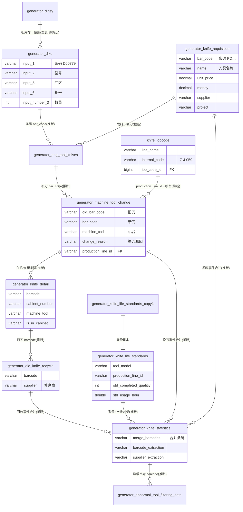

# 刀具模块 · fuadmin 数据字典
> 域: 03-质量技术域 | 表数: 14 | 用途: Agent基础文件 | 生成: 2026-07-23

# knife-刀具 · 概述

knife 模块是治通 MES 的刀具全生命周期管理域，覆盖**库存（djkc/eng_tool_knives 入柜）→ 领用/发料（knife_requisition）→ 上机换刀（machine_tool_change）→ 在机明细（knife_detail）→ 旧刀回收（old_knife_recycle）→ 修磨/再利用**的完整闭环，是老板关注的刀具成本管控核心数据源。模块以刀具条码（bar_code）为主键线索贯穿全程，`generator_knife_life_standards` 定义各型号×产线的寿命标准（标准加工件数/标准使用小时），`generator_knife_statistics` 每日把发料、换刀、领刀、回收、入柜多路事件合并成宽表用于对标分析与成本核算，`generator_abnormal_tool_filtering_data` 自动推送数据不一致的异常刀具（如"工程部领刀记录缺失"）供人工核销。数据分两地/多厂区（外冈、广德等，factory 字段），与 FANUC 机台（machine_tool，如 GH-J-049 / Z-J-059）和产线（production_line，如 GS6-12-OP30-1）挂钩。注意 `dj*`（刀具拼音首字母）老表与 `knife_*` 正式表存在职能重叠，现役口径以哪套为准**待确认**。

# knife-刀具 · 上岗指南

## 2.1 核心实体表（TOP8）

| 表 | 一句话定义 |
|---|---|
| generator_djkc | 刀具库存表（dj=刀具拼音首字母），条码/型号/厂区/柜号/分层数量 |
| generator_knife_requisition | 刀具领用/发料单（3.7万行），名称、条码、单价金额、项目、供应商 |
| generator_machine_tool_change | 换刀记录主表（2.7万行），新旧刀条码、换刀原因、机台、班次 |
| generator_knife_detail | 刀具柜在柜/在机明细（1.1万行），装/拆/放/回收四组人员+时间 |
| generator_old_knife_recycle | 旧刀回收记录（9千行），回收后送修磨或报废 |
| generator_eng_tool_knives | 工程部领刀记录（1.6万行），入柜前的领用环节 |
| generator_knife_life_standards | 刀具寿命标准：型号×产线的标准件数与标准小时 |
| generator_knife_statistics | 每日刀具汇总宽表（2.6万行），多路事件合并供对标分析 |

辅助：`generator_abnormal_tool_filtering_data`（异常推送）、`knife_jobcode`（机台/工位对照）、`generator_djgsy`/`generator_djgkcsl`/`generator_daily_tool_summary`（当前空表）。

## 2.2 核心业务流

1. **入库存**：新刀登记入 `generator_djkc`（条码如 D00779、型号、厂区=广德/外冈、柜号如 201），刀片类经采购领用进入 `generator_knife_requisition`（classes=刀具 / subclass=刀片，含 unit_price×number=money，记 PO 号）。
2. **领刀**：工程部领刀记 `generator_eng_tool_knives`（knife_leader、柜号、层数）；生产领用走 `knife_requisition`（use_dept=生产部，material_handler 发料人）。
3. **上机换刀**：机台操作工在 `generator_machine_tool_change` 登记：old_bar_code 换下、bar_code 换上、change_reason（磨损等）、working_shift（白班/夜班）、status=已完成；`knife_jobcode` 把 production_line_id（DCTeco-OP30-2）翻译成机台内部码（Z-J-059）。
4. **在机/在柜跟踪**：`generator_knife_detail` 以条码跟踪每把刀所在柜号、机台、产线，记录装刀/拆刀/放刀/回收的人员与时间，is_in_cabinet 标记是否在柜。
5. **旧刀回收**：`generator_old_knife_recycle` 登记回收（admin、柜号层号、型号、供应商），回收后供应商为"签诚修磨"等记送修磨，修磨回来重新入柜循环；彻底损耗的进入报废（见 tool 模块 tool_scrap，口径待确认）。
6. **寿命对标与成本**：`generator_knife_life_standards` 按 型号×产线 定 std_completed_quatitiy / std_usage_hour；`generator_knife_statistics` 每日合并发料、换刀、领刀、回收、入柜事件成一行（merge_barcodes 关联条码，has_material_record 标是否有发料记录），供"标准 vs 实际"寿命与单件刀具成本分析。
7. **异常闭环**：`generator_abnormal_tool_filtering_data` 自动比对推送异常（如 pushed_exception_item="工程部领刀(未出现在工程部领刀)"），人工核销 is_resolved。

## 2.3 典型查询场景

**场景1：刀具库存预警（库存量低于阈值，按型号）**
```sql
SELECT input_2 AS model, input_5 AS factory, input_6 AS cabinet,
       SUM(IFNULL(input_number_3,0)) AS qty
FROM generator_djkc
GROUP BY input_2, input_5, input_6
HAVING qty <= 5          -- 阈值按安全库存调整
ORDER BY qty ASC;
```

**场景2：单台设备某月刀具消耗（换刀次数×机型）**
```sql
SELECT machine_tool, model, COUNT(*) AS change_cnt
FROM generator_machine_tool_change
WHERE machine_tool = 'Z-J-059'
  AND date_time >= '2024-04-01' AND date_time < '2024-05-01'
  AND status = '已完成'
GROUP BY machine_tool, model
ORDER BY change_cnt DESC;
```

**场景3：换刀原因 TOP（异常磨损分析入口）**
```sql
SELECT change_reason, COUNT(*) AS cnt,
       COUNT(DISTINCT machine_tool) AS machine_cnt
FROM generator_machine_tool_change
WHERE date_time >= '2024-01-01'
GROUP BY change_reason
ORDER BY cnt DESC LIMIT 10;
```

**场景4：某月刀具采购/领用成本汇总（老板视角）**
```sql
SELECT month_time, project, subclass, supplier,
       SUM(number) AS qty, SUM(money) AS amount
FROM generator_knife_requisition
WHERE date_time >= '2024-01-01' AND date_time < '2024-02-01'
GROUP BY month_time, project, subclass, supplier
ORDER BY amount DESC;
```

**场景5：刀具寿命达标率（实际加工量 vs 标准）**
```sql
SELECT s.combined_tool_model AS model, s.combined_production_line AS line,
       s.online_tool_processing_quantity AS actual_qty,
       l.std_completed_quatitiy AS std_qty,
       ROUND(s.online_tool_processing_quantity / l.std_completed_quatitiy * 100, 1) AS reach_pct
FROM generator_knife_statistics s
JOIN generator_knife_life_standards l
  ON l.tool_model = s.combined_tool_model
 AND l.production_line_id = s.combined_production_line
WHERE s.online_tool_processing_quantity IS NOT NULL
ORDER BY reach_pct ASC LIMIT 50;   -- 最差50条，找异常短命刀
```
（注：statistics 列名以实际宽表为准，关联键为推断，待确认）

**场景6：未核销的异常刀具清单**
```sql
SELECT barcode, pushed_exception_item, push_datetime
FROM generator_abnormal_tool_filtering_data
WHERE is_resolved = 0
ORDER BY push_datetime DESC;
```

**场景7：单把刀全生命周期追溯（按条码）**
```sql
SELECT '发料' AS stage, date_time AS t, name AS info FROM generator_knife_requisition WHERE bar_code = 'DA0792005'
UNION ALL
SELECT '换刀', date_time, CONCAT(machine_tool, ' / ', change_reason) FROM generator_machine_tool_change WHERE bar_code = 'DA0792005' OR old_bar_code = 'DA0792005'
UNION ALL
SELECT '回收', time, CONCAT(factory, ' / 柜', cabinet_number) FROM generator_old_knife_recycle WHERE barcode = 'DA0792005'
ORDER BY t;
```

**场景8：修磨供应商往返统计（修磨成本线索）**
```sql
SELECT supplier, COUNT(*) AS recycle_cnt
FROM generator_old_knife_recycle
WHERE supplier LIKE '%修磨%'
GROUP BY supplier ORDER BY recycle_cnt DESC;
```

## 2.4 避坑指南

- **dj\* 老表 vs knife 正式表重叠**：`generator_djkc`（库存）、`generator_djgsy`（使用，空表）、`generator_djgkcsl`（库存数量，空表）与 `generator_knife_detail`/`generator_knife_statistics` 职能重叠。`djgsy`/`djgkcsl`/`daily_tool_summary` 当前 0 行，疑似 V2 迁移后停用或尚未启用，**现役口径以哪套为准待确认**——写报表前先查行数与最新 create_datetime。
- **时间字段是字符串**：`knife_detail` 的 knife_mounting_time 等是 varchar（格式 '2025/6/9 14:38:00'），不能直接当 datetime 比较，需 STR_TO_DATE；`knife_life_standards` 样本出现 '0000-00-00' 脏时间。
- **布尔存字符串**：`new_knife_quantity=False`、`is_in_cabinet='否'` 存的是文本，筛选注意。
- **条码口径不统一**：发料表 bar_code 含前缀 PD0519733（料号+序号），而刀柄条码是 D00779/DA0792005，刀片与整刀是两套编码体系，跨表关联前先做条码清洗（statistics 表 barcode_extraction 即系统内提取结果，如 D237）。
- **_MASK_TO_V2 / _MUSID_SYNC_V2 / _MASK_FROM_V2** 为新旧系统同步痕迹字段，勿用于业务逻辑。
- **knife_statistics 是超宽表**（60+列），一行=一把刀一天的合并事件，字段大面积为空属正常；列名 old/new 后缀表示换刀前/后状态。
- **copy1 后缀表**（knife_life_standards_copy1）是备份/历史表，别当现役主数据。
- 人名为明文（脱敏样本除外），对外报表注意隐私。

## 3 数据字典

### generator_knife_detail（约 11106 行）
业务定义: 刀具柜在柜/在机刀具明细台账，记录装刀/拆刀/放刀/回收人员时间 ｜ 表注释: -

| 字段 | 类型 | 可空 | 键 | 原始注释 | 推断语义 | 置信度 |
|---|---|---|---|---|---|---|
| id | bigint | N | PRI | - | 主键ID | high |
| remark | varchar(255) | Y | - | - | 备注 | high |
| modifier | varchar(255) | Y | - | - | 最后修改人姓名 | high |
| belong_dept | int | Y | - | - | 所属部门ID | mid |
| update_datetime | datetime(6) | Y | - | - | 最后更新时间 | high |
| create_datetime | datetime(6) | Y | - | - | 创建时间 | high |
| sort | int | Y | - | - | 排序号 | high |
| remarks | varchar(255) | Y | - | - | 文本字段[推断-待确认] | low |
| cabinet_number | varchar(255) | Y | - | - | 编号/代码[推断] | mid |
| machine_tool | varchar(255) | Y | - | - | 刀具/工具[推断] | mid |
| production_line | varchar(255) | Y | - | - | 产线[推断] | mid |
| is_in_cabinet | varchar(255) | Y | - | - | 标志位（布尔）[推断] | mid |
| new_knife_quantity | varchar(255) | Y | - | - | 数量[推断] | high |
| used_knife_layer_count | varchar(255) | Y | - | - | 数量[推断] | high |
| new_knife_layer_count | varchar(255) | Y | - | - | 数量[推断] | high |
| new_knife_column_count | varchar(255) | Y | - | - | 数量[推断] | high |
| online_knife_processing_volume | varchar(255) | Y | - | - | 工序[推断] | mid |
| offline_knife_processing_volume | varchar(255) | Y | - | - | 工序[推断] | mid |
| knife_recycling_person | varchar(255) | Y | - | - | 刀具/工具[推断] | mid |
| knife_recycling_time | varchar(255) | Y | - | - | 时间[推断] | high |
| knife_dismounting_person | varchar(255) | Y | - | - | 刀具/工具[推断] | mid |
| knife_dismounting_time | varchar(255) | Y | - | - | 时间[推断] | high |
| knife_mounting_person | varchar(255) | Y | - | - | 刀具/工具[推断] | mid |
| knife_mounting_time | varchar(255) | Y | - | - | 时间[推断] | high |
| knife_placing_person | varchar(255) | Y | - | - | 刀具/工具[推断] | mid |
| knife_placing_time | varchar(255) | Y | - | - | 时间[推断] | high |
| model | varchar(255) | Y | - | - | 规格/型号[推断] | mid |
| barcode | varchar(255) | Y | - | - | 文本字段[推断-待确认] | low |
| creator_id | bigint | Y | MUL | - | 创建人ID → system_users.id | high |
| knife_usage_hours | varchar(255) | Y | - | - | 刀具/工具[推断] | mid |
| used_knife_quantity | varchar(255) | Y | - | - | 数量[推断] | high |
| _MASK_TO_V2 | bigint | Y | MUL | - | 数值字段[推断-待确认] | low |
| _MUSID_SYNC_V2 | int unsigned | Y | MUL | - | 数值字段[推断-待确认] | low |

### generator_knife_life_standards（约 38 行）
业务定义: 刀具寿命标准：型号×产线的标准加工件数与标准使用小时 ｜ 表注释: -

| 字段 | 类型 | 可空 | 键 | 原始注释 | 推断语义 | 置信度 |
|---|---|---|---|---|---|---|
| id | bigint | N | PRI | - | 主键ID | high |
| remark | varchar(255) | Y | - | - | 备注 | high |
| modifier | varchar(255) | Y | - | - | 最后修改人姓名 | high |
| belong_dept | int | Y | - | - | 所属部门ID | mid |
| update_datetime | datetime(6) | Y | - | - | 最后更新时间 | high |
| create_datetime | datetime(6) | Y | - | - | 创建时间 | high |
| sort | int | Y | - | - | 排序号 | high |
| tool_model | varchar(100) | Y | - | - | 规格/型号[推断] | mid |
| production | varchar(20) | Y | - | - | 产品[推断] | high |
| std_completed_quatitiy | int | Y | - | - | 数值字段[推断-待确认] | low |
| std_usage_hour | double | Y | - | - | 数值（小数）[推断-待确认] | low |
| production_line_id | varchar(100) | Y | - | - | 关联ID → generator_production_line.id[推断] | mid |
| bar_code | varchar(100) | Y | - | - | 编号/代码[推断] | mid |
| creator_id | bigint | Y | MUL | - | 创建人ID → system_users.id | high |

### generator_knife_life_standards_copy1（约 89 行）
业务定义: 刀具寿命标准历史副本/备份表，结构同主表 ｜ 表注释: -

| 字段 | 类型 | 可空 | 键 | 原始注释 | 推断语义 | 置信度 |
|---|---|---|---|---|---|---|
| id | bigint | N | PRI | - | 主键ID | high |
| remark | varchar(255) | Y | - | - | 备注 | high |
| modifier | varchar(255) | Y | - | - | 最后修改人姓名 | high |
| belong_dept | int | Y | - | - | 所属部门ID | mid |
| update_datetime | datetime(6) | Y | - | - | 最后更新时间 | high |
| create_datetime | datetime(6) | Y | - | - | 创建时间 | high |
| sort | int | Y | - | - | 排序号 | high |
| tool_model | varchar(100) | Y | - | - | 规格/型号[推断] | mid |
| production | varchar(20) | Y | - | - | 产品[推断] | high |
| std_completed_quatitiy | int | Y | - | - | 数值字段[推断-待确认] | low |
| std_usage_hour | double | Y | - | - | 数值（小数）[推断-待确认] | low |
| production_line_id | varchar(100) | Y | - | - | 关联ID → generator_production_line.id[推断] | mid |
| bar_code | varchar(100) | Y | - | - | 编号/代码[推断] | mid |
| creator_id | bigint | Y | MUL | - | 创建人ID → system_users.id | high |

### generator_knife_requisition（约 36808 行）
业务定义: 刀具领用/发料单，含名称条码、单价金额、项目、供应商 ｜ 表注释: -

| 字段 | 类型 | 可空 | 键 | 原始注释 | 推断语义 | 置信度 |
|---|---|---|---|---|---|---|
| id | bigint | N | PRI | - | 主键ID | high |
| remark | varchar(255) | Y | - | - | 备注 | high |
| modifier | varchar(255) | Y | - | - | 最后修改人姓名 | high |
| belong_dept | int | Y | - | - | 所属部门ID | mid |
| update_datetime | datetime(6) | Y | - | - | 最后更新时间 | high |
| create_datetime | datetime(6) | Y | - | - | 创建时间 | high |
| sort | int | Y | - | - | 排序号 | high |
| newbar_code | varchar(20) | Y | - | - | 编号/代码[推断] | mid |
| trade_in | varchar(20) | Y | - | - | 文本字段[推断-待确认] | low |
| use_dept | varchar(20) | Y | - | - | 部门[推断] | high |
| dept | varchar(20) | Y | - | - | 部门[推断] | high |
| material_handler | varchar(20) | Y | - | - | 物料[推断] | high |
| money | decimal(10,3) | Y | - | - | 金额[推断] | high |
| unit_price | decimal(10,3) | Y | - | - | 单价[推断] | high |
| number | int | Y | - | - | 编号/代码[推断] | mid |
| unit | varchar(10) | Y | - | - | 计量单位[推断] | high |
| name | varchar(80) | Y | - | - | 名称[推断] | high |
| bar_code | varchar(20) | Y | - | - | 编号/代码[推断] | mid |
| subclass | varchar(20) | Y | - | - | 文本字段[推断-待确认] | low |
| classes | varchar(20) | Y | - | - | 文本字段[推断-待确认] | low |
| project | varchar(20) | Y | - | - | 文本字段[推断-待确认] | low |
| supplier | varchar(50) | Y | - | - | 供应商[推断] | high |
| date_time | date | Y | - | - | 时间[推断] | high |
| creator_id | bigint | Y | MUL | - | 创建人ID → system_users.id | high |
| month_time | varchar(20) | Y | - | - | 时间[推断] | high |
| PO | varchar(20) | Y | - | - | 文本字段[推断-待确认] | low |
| abnormal_info | json | Y | - | - | 待确认 | low |
| _MASK_FROM_V2 | timestamp | N | MUL | - | 待确认 | low |

### generator_knife_statistics（约 26479 行）
业务定义: 每日刀具汇总宽表，合并发料/换刀/领刀/回收/入柜多路事件 ｜ 表注释: -

| 字段 | 类型 | 可空 | 键 | 原始注释 | 推断语义 | 置信度 |
|---|---|---|---|---|---|---|
| id | bigint | N | PRI | - | 主键ID | high |
| remark | varchar(255) | Y | - | - | 备注 | high |
| modifier | varchar(255) | Y | - | - | 最后修改人姓名 | high |
| belong_dept | int | Y | - | - | 所属部门ID | mid |
| update_datetime | datetime(6) | Y | - | - | 最后更新时间 | high |
| create_datetime | datetime(6) | Y | - | - | 创建时间 | high |
| sort | int | Y | - | - | 排序号 | high |
| combined_production_line | varchar(100) | Y | - | - | 产线[推断] | mid |
| combined_tool_model | varchar(80) | Y | - | - | 规格/型号[推断] | mid |
| online_tool_processing_quantity | int | Y | - | - | 数量[推断] | high |
| offline_tool_processing_quantity | int | Y | - | - | 数量[推断] | high |
| tool_usage_hours | double | Y | - | - | 刀具/工具[推断] | mid |
| line_number | varchar(10) | Y | - | - | 编号/代码[推断] | mid |
| blade_change_time_old | datetime(6) | Y | - | - | 日期时间[推断] | mid |
| installed_new_blade_barcode | varchar(255) | Y | - | - | 文本字段[推断-待确认] | low |
| blade_model_old | varchar(80) | Y | - | - | 文本字段[推断-待确认] | low |
| old_blade_barcode_after_change | varchar(255) | Y | - | - | 文本字段[推断-待确认] | low |
| blade_change_production_line_old | varchar(100) | Y | - | - | 产品[推断] | high |
| blade_change_machine_old | varchar(50) | Y | - | - | 设备[推断] | mid |
| blade_changer_old | varchar(20) | Y | - | - | 文本字段[推断-待确认] | low |
| blade_change_factory_old | varchar(20) | Y | - | - | 文本字段[推断-待确认] | low |
| blade_change_time_new | datetime(6) | Y | - | - | 日期时间[推断] | mid |
| new_blade_barcode_after_change | varchar(255) | Y | - | - | 文本字段[推断-待确认] | low |
| blade_model_new | varchar(80) | Y | - | - | 文本字段[推断-待确认] | low |
| removed_old_blade_barcode | varchar(255) | Y | - | - | 文本字段[推断-待确认] | low |
| blade_change_production_line_new | varchar(100) | Y | - | - | 产品[推断] | high |
| blade_change_machine_new | varchar(50) | Y | - | - | 设备[推断] | mid |
| blade_changer_new | varchar(20) | Y | - | - | 文本字段[推断-待确认] | low |
| blade_change_factory_new | varchar(20) | Y | - | - | 文本字段[推断-待确认] | low |
| return_time | datetime(6) | Y | - | - | 时间[推断] | high |
| return_barcode | varchar(255) | Y | - | - | 单号/编号[推断] | high |
| return_model | varchar(80) | Y | - | - | 规格/型号[推断] | mid |
| return_factory | varchar(20) | Y | - | - | 文本字段[推断-待确认] | low |
| production_department_knife_receiving_time | datetime(6) | Y | - | - | 时间[推断] | high |
| production_department_knife_barcode | varchar(255) | Y | - | - | 产品[推断] | high |
| production_department_knife_model | varchar(80) | Y | - | - | 规格/型号[推断] | mid |
| production_department_knife_receiving_layer | int | Y | - | - | 产品[推断] | high |
| production_department_knife_receiver | varchar(20) | Y | - | - | 产品[推断] | high |
| production_department_knife_receiving_factory | varchar(20) | Y | - | - | 产品[推断] | high |
| engineering_department_knife_receiving_time | datetime(6) | Y | - | - | 时间[推断] | high |
| engineering_department_knife_barcode | varchar(255) | Y | - | - | 刀具/工具[推断] | mid |
| engineering_department_knife_model | varchar(80) | Y | - | - | 规格/型号[推断] | mid |
| engineering_department_knife_receiver | varchar(20) | Y | - | - | 刀具/工具[推断] | mid |
| engineering_department_knife_receiving_factory | varchar(20) | Y | - | - | 刀具/工具[推断] | mid |
| input_time_old | datetime(6) | Y | - | - | 日期时间[推断] | mid |
| installed_new_knife_barcode | varchar(255) | Y | - | - | 刀具/工具[推断] | mid |
| update_time_old | datetime(6) | Y | - | - | 日期时间[推断] | mid |
| shift_old | varchar(20) | Y | - | - | 班次[推断] | high |
| knife_change_reason_old | varchar(255) | Y | - | - | 刀具/工具[推断] | mid |
| knife_model_old | varchar(80) | Y | - | - | 刀具/工具[推断] | mid |
| old_knife_barcode_after_change | varchar(255) | Y | - | - | 刀具/工具[推断] | mid |
| knife_change_production_line_old | varchar(100) | Y | - | - | 产品[推断] | high |
| machine_knife_changer_old | varchar(20) | Y | - | - | 刀具/工具[推断] | mid |
| knife_change_factory_old | varchar(20) | Y | - | - | 刀具/工具[推断] | mid |
| input_time_new | datetime(6) | Y | - | - | 日期时间[推断] | mid |
| new_knife_barcode_after_change | varchar(255) | Y | - | - | 刀具/工具[推断] | mid |
| update_time_new | datetime(6) | Y | - | - | 日期时间[推断] | mid |
| shift_new | varchar(20) | Y | - | - | 班次[推断] | high |
| knife_change_reason_new | varchar(255) | Y | - | - | 刀具/工具[推断] | mid |
| knife_model_new | varchar(80) | Y | - | - | 刀具/工具[推断] | mid |
| removed_old_knife_barcode | varchar(255) | Y | - | - | 刀具/工具[推断] | mid |
| knife_change_production_line_new | varchar(100) | Y | - | - | 产品[推断] | high |
| machine_knife_changer_new | varchar(20) | Y | - | - | 刀具/工具[推断] | mid |
| knife_change_factory_new | varchar(20) | Y | - | - | 刀具/工具[推断] | mid |
| tool_cabinet_old_knife_recycling_time | datetime(6) | Y | - | - | 时间[推断] | high |
| tool_cabinet_old_knife_recycling_barcode | varchar(255) | Y | - | - | 刀具/工具[推断] | mid |
| tool_cabinet_old_knife_recycling_model | varchar(80) | Y | - | - | 规格/型号[推断] | mid |
| tool_cabinet_old_knife_recycling_layer | int | Y | - | - | 刀具/工具[推断] | mid |
| tool_cabinet_old_knife_recycling_admin | varchar(20) | Y | - | - | 刀具/工具[推断] | mid |
| tool_cabinet_old_knife_recycling_factory | varchar(20) | Y | - | - | 刀具/工具[推断] | mid |
| tool_cabinet_knife_storage_time | datetime(6) | Y | - | - | 时间[推断] | high |
| tool_cabinet_knife_storage_barcode | varchar(255) | Y | - | - | 仓库[推断] | mid |
| tool_cabinet_knife_storage_model | varchar(80) | Y | - | - | 规格/型号[推断] | mid |
| tool_cabinet_knife_storage_layer | int | Y | - | - | 仓库[推断] | mid |
| tool_cabinet_knife_receiver | varchar(20) | Y | - | - | 刀具/工具[推断] | mid |
| tool_cabinet_knife_storage_factory | varchar(20) | Y | - | - | 仓库[推断] | mid |
| material_issue_date | datetime(6) | Y | - | - | 日期[推断] | high |
| project | varchar(20) | Y | - | - | 文本字段[推断-待确认] | low |
| sub_category | varchar(20) | Y | - | - | 分类[推断] | mid |
| barcode | varchar(20) | Y | - | - | 文本字段[推断-待确认] | low |
| has_material_record | varchar(255) | Y | - | - | 物料[推断] | high |
| cabinet_number | varchar(10) | Y | - | - | 编号/代码[推断] | mid |
| supplier | varchar(50) | Y | - | - | 供应商[推断] | high |
| material_name | varchar(80) | Y | - | - | 名称[推断] | high |
| unit | varchar(10) | Y | - | - | 计量单位[推断] | high |
| quantity | int | Y | - | - | 数量[推断] | high |
| unit_price | decimal(10,3) | Y | - | - | 单价[推断] | high |
| amount | decimal(10,3) | Y | - | - | 金额[推断] | high |
| material_receiver | varchar(20) | Y | - | - | 物料[推断] | high |
| department | varchar(20) | Y | - | - | 部门[推断] | high |
| use_department | varchar(20) | Y | - | - | 部门[推断] | high |
| creator_id | bigint | Y | MUL | - | 创建人ID → system_users.id | high |
| barcode_extraction | varchar(20) | Y | - | - | 文本字段[推断-待确认] | low |
| supplier_extraction | varchar(50) | Y | - | - | 供应商[推断] | high |
| merge_barcodes | varchar(50) | Y | - | - | 文本字段[推断-待确认] | low |
| merge_time | varchar(50) | Y | - | - | 时间[推断] | high |
| _MASK_FROM_V2 | timestamp | N | MUL | - | 待确认 | low |

### generator_djgkcsl（约 0 行）
业务定义: 刀具柜库存数量表（型号×条码×数量），当前空表待确认 ｜ 表注释: -

| 字段 | 类型 | 可空 | 键 | 原始注释 | 推断语义 | 置信度 |
|---|---|---|---|---|---|---|
| id | bigint | N | PRI | - | 主键ID | high |
| remark | varchar(255) | Y | - | - | 备注 | high |
| modifier | varchar(255) | Y | - | - | 最后修改人姓名 | high |
| belong_dept | int | Y | - | - | 所属部门ID | mid |
| update_datetime | datetime(6) | Y | - | - | 最后更新时间 | high |
| create_datetime | datetime(6) | Y | - | - | 创建时间 | high |
| sort | int | Y | - | - | 排序号 | high |
| 数量 | decimal(13,4) | Y | - | - | 数值（小数）[推断-待确认] | low |
| 型号 | varchar(255) | Y | - | - | 文本字段[推断-待确认] | low |
| 条码 | varchar(255) | Y | - | - | 文本字段[推断-待确认] | low |
| creator_id | bigint | Y | MUL | - | 创建人ID → system_users.id | high |

### generator_djgsy（约 0 行）
业务定义: 刀具柜使用记录（新旧刀条码、上下机时间、换刀原因），空表 ｜ 表注释: -

| 字段 | 类型 | 可空 | 键 | 原始注释 | 推断语义 | 置信度 |
|---|---|---|---|---|---|---|
| id | bigint | N | PRI | - | 主键ID | high |
| remark | varchar(255) | Y | - | - | 备注 | high |
| modifier | varchar(255) | Y | - | - | 最后修改人姓名 | high |
| belong_dept | int | Y | - | - | 所属部门ID | mid |
| update_datetime | datetime | Y | - | - | 最后更新时间 | high |
| create_datetime | datetime | Y | - | - | 创建时间 | high |
| sort | int | Y | - | - | 排序号 | high |
| machine_tool | varchar(255) | Y | - | - | 刀具/工具[推断] | mid |
| number_of_layers | varchar(255) | Y | - | - | 文本字段[推断-待确认] | low |
| algorithm_detection_quantity | varchar(255) | Y | - | - | 数量[推断] | high |
| external_inspection_quantity | varchar(255) | Y | - | - | 数量[推断] | high |
| old_knife_barcode | varchar(255) | Y | - | - | 刀具/工具[推断] | mid |
| new_knife_barcode | varchar(255) | Y | - | - | 刀具/工具[推断] | mid |
| time_end | varchar(255) | Y | - | - | 文本字段[推断-待确认] | low |
| time_on | varchar(255) | Y | - | - | 文本字段[推断-待确认] | low |
| operator | varchar(255) | Y | - | - | 操作人[推断] | high |
| action | varchar(255) | Y | - | - | 文本字段[推断-待确认] | low |
| creator_id | bigint | Y | MUL | - | 创建人ID → system_users.id | high |
| _MASK_TO_V2 | bigint | Y | MUL | - | 数值字段[推断-待确认] | low |
| CREATE_DATE | datetime | Y | - | - | 日期时间[推断] | mid |
| CABINET_NUM | varchar(255) | Y | - | - | 文本字段[推断-待确认] | low |
| _MUSID_SYNC_V2 | int unsigned | Y | MUL | - | 数值字段[推断-待确认] | low |
| reason_for_replacement | varchar(255) | Y | - | - | 文本字段[推断-待确认] | low |
| tool_model | varchar(255) | Y | - | - | 规格/型号[推断] | mid |

### generator_djkc（约 4066 行）
业务定义: 刀具库存表（dj=刀具），条码/型号/厂区/柜号/分层数量 ｜ 表注释: -

| 字段 | 类型 | 可空 | 键 | 原始注释 | 推断语义 | 置信度 |
|---|---|---|---|---|---|---|
| id | bigint | N | PRI | - | 主键ID | high |
| remark | varchar(255) | Y | - | - | 备注 | high |
| modifier | varchar(255) | Y | - | - | 最后修改人姓名 | high |
| belong_dept | int | Y | - | - | 所属部门ID | mid |
| update_datetime | datetime | Y | - | - | 最后更新时间 | high |
| create_datetime | datetime | Y | - | - | 创建时间 | high |
| sort | int | Y | - | - | 排序号 | high |
| input_number_3 | int | Y | - | - | 数值字段[推断-待确认] | low |
| input_2 | varchar(255) | Y | - | - | 文本字段[推断-待确认] | low |
| input_1 | varchar(255) | Y | - | - | 文本字段[推断-待确认] | low |
| creator_id | bigint | Y | MUL | - | 创建人ID → system_users.id | high |
| input_number_2 | int | Y | - | - | 数值字段[推断-待确认] | low |
| input_number_1 | int | Y | - | - | 数值字段[推断-待确认] | low |
| input_5 | varchar(255) | Y | - | - | 文本字段[推断-待确认] | low |
| input_6 | varchar(255) | Y | - | - | 文本字段[推断-待确认] | low |
| _MASK_TO_V2 | bigint | Y | MUL | - | 数值字段[推断-待确认] | low |
| _MUSID_SYNC_V2 | int unsigned | Y | MUL | - | 数值字段[推断-待确认] | low |

### generator_abnormal_tool_filtering_data（约 18484 行）
业务定义: 异常刀具筛选推送表，条码级数据一致性异常及核销状态 ｜ 表注释: -

| 字段 | 类型 | 可空 | 键 | 原始注释 | 推断语义 | 置信度 |
|---|---|---|---|---|---|---|
| id | bigint | N | PRI | - | 主键ID | high |
| remark | varchar(255) | Y | - | - | 备注 | high |
| modifier | varchar(255) | Y | - | - | 最后修改人姓名 | high |
| belong_dept | int | Y | - | - | 所属部门ID | mid |
| update_datetime | datetime(6) | Y | - | - | 最后更新时间 | high |
| create_datetime | datetime(6) | Y | - | - | 创建时间 | high |
| sort | int | Y | - | - | 排序号 | high |
| barcode | varchar(255) | Y | - | - | 文本字段[推断-待确认] | low |
| creator_id | bigint | Y | MUL | - | 创建人ID → system_users.id | high |
| is_resolved | tinyint(1) | N | - | - | 标志位（布尔）[推断] | mid |
| push_datetime | datetime(6) | Y | - | - | 时间[推断] | high |
| pushed_exception_item | varchar(255) | Y | - | - | 文本字段[推断-待确认] | low |

### generator_daily_tool_summary（约 0 行）
业务定义: 每日刀具汇总表（日期×型号×条码），当前空表待确认 ｜ 表注释: -

| 字段 | 类型 | 可空 | 键 | 原始注释 | 推断语义 | 置信度 |
|---|---|---|---|---|---|---|
| id | bigint | N | PRI | - | 主键ID | high |
| remark | varchar(255) | Y | - | - | 备注 | high |
| modifier | varchar(255) | Y | - | - | 最后修改人姓名 | high |
| belong_dept | int | Y | - | - | 所属部门ID | mid |
| update_datetime | datetime(6) | Y | - | - | 最后更新时间 | high |
| create_datetime | datetime(6) | Y | - | - | 创建时间 | high |
| sort | int | Y | - | - | 排序号 | high |
| date_time | date | Y | - | - | 时间[推断] | high |
| model | varchar(255) | Y | - | - | 规格/型号[推断] | mid |
| bar_code | varchar(255) | Y | - | - | 编号/代码[推断] | mid |
| creator_id | bigint | Y | MUL | - | 创建人ID → system_users.id | high |

### generator_eng_tool_knives（约 15947 行）
业务定义: 工程部领刀记录，含厂区、柜号、层数、型号、供应商、条码 ｜ 表注释: -

| 字段 | 类型 | 可空 | 键 | 原始注释 | 推断语义 | 置信度 |
|---|---|---|---|---|---|---|
| id | bigint | N | PRI | - | 主键ID | high |
| remark | varchar(255) | Y | - | - | 备注 | high |
| modifier | varchar(255) | Y | - | - | 最后修改人姓名 | high |
| belong_dept | int | Y | - | - | 所属部门ID | mid |
| update_datetime | datetime(6) | Y | - | - | 最后更新时间 | high |
| create_datetime | datetime(6) | Y | - | - | 创建时间 | high |
| sort | int | Y | - | - | 排序号 | high |
| remarks | varchar(255) | Y | - | - | 文本字段[推断-待确认] | low |
| factory | varchar(255) | Y | - | - | 文本字段[推断-待确认] | low |
| knife_leader | varchar(255) | Y | - | - | 刀具/工具[推断] | mid |
| number_of_layers | varchar(255) | Y | - | - | 文本字段[推断-待确认] | low |
| cabinet_number | varchar(255) | Y | - | - | 编号/代码[推断] | mid |
| model | varchar(255) | Y | - | - | 规格/型号[推断] | mid |
| supplier | varchar(255) | Y | - | - | 供应商[推断] | high |
| bar_code | varchar(255) | Y | - | - | 编号/代码[推断] | mid |
| time | datetime(6) | Y | - | - | 时间[推断] | high |
| creator_id | bigint | Y | MUL | - | 创建人ID → system_users.id | high |
| _MASK_TO_V2 | bigint | Y | MUL | - | 数值字段[推断-待确认] | low |
| _MUSID_SYNC_V2 | int unsigned | Y | MUL | - | 数值字段[推断-待确认] | low |

### knife_jobcode（约 389 行）
业务定义: 机台/工位对照表，产线工位名与内部机台编码映射 ｜ 表注释: -

| 字段 | 类型 | 可空 | 键 | 原始注释 | 推断语义 | 置信度 |
|---|---|---|---|---|---|---|
| id | bigint | N | PRI | - | 主键ID | high |
| line_name | varchar(255) | Y | - | - | 名称[推断] | high |
| name | varchar(255) | Y | - | - | 名称[推断] | high |
| internal_code | varchar(255) | Y | - | - | 编号/代码[推断] | mid |
| is_auto | int | N | - | - | 标志位（布尔）[推断] | mid |
| job_code_id | bigint | N | MUL | - | 关联ID → generator_job_code.id[推断] | mid |
| eng_name | varchar(255) | Y | - | - | 名称[推断] | high |

### generator_machine_tool_change（约 26984 行）
业务定义: 换刀记录主表，新旧刀条码、换刀原因、机台、班次、状态 ｜ 表注释: -

| 字段 | 类型 | 可空 | 键 | 原始注释 | 推断语义 | 置信度 |
|---|---|---|---|---|---|---|
| id | bigint | N | PRI | - | 主键ID | high |
| remark | varchar(255) | Y | - | - | 备注 | high |
| modifier | varchar(255) | Y | - | - | 最后修改人姓名 | high |
| belong_dept | int | Y | - | - | 所属部门ID | mid |
| update_datetime | datetime | Y | - | - | 最后更新时间 | high |
| create_datetime | datetime | Y | - | - | 创建时间 | high |
| sort | int | Y | - | - | 排序号 | high |
| remarks | varchar(255) | Y | - | - | 文本字段[推断-待确认] | low |
| factory | varchar(255) | Y | - | - | 文本字段[推断-待确认] | low |
| cabinet_id | varchar(255) | Y | - | - | 关联ID（目标表待确认）[推断] | low |
| tool_changer | varchar(255) | Y | - | - | 刀具/工具[推断] | mid |
| tool_order | varchar(255) | Y | - | - | 刀具/工具[推断] | mid |
| machine_tool | varchar(255) | Y | - | - | 刀具/工具[推断] | mid |
| production_line_id | varchar(255) | Y | - | - | 关联ID → generator_production_line.id[推断] | mid |
| old_tool_supplier | varchar(255) | Y | - | - | 供应商[推断] | high |
| old_bar_code | varchar(255) | Y | - | - | 编号/代码[推断] | mid |
| model | varchar(255) | Y | - | - | 规格/型号[推断] | mid |
| new_tool_supplier | varchar(255) | Y | - | - | 供应商[推断] | high |
| change_reason | varchar(255) | Y | - | - | 文本字段[推断-待确认] | low |
| working_shift | varchar(255) | Y | - | - | 班次[推断] | high |
| update_time | datetime | Y | - | - | 时间[推断] | high |
| status | varchar(255) | Y | - | - | 状态（枚举值待确认）[推断] | mid |
| inspector | varchar(255) | Y | - | - | 规格/型号[推断] | mid |
| tool_change_qrcode | varchar(255) | Y | - | - | 刀具/工具[推断] | mid |
| processing_quantity_machine | varchar(255) | Y | - | - | 工序[推断] | mid |
| processing_data_worker | varchar(255) | Y | - | - | 工序[推断] | mid |
| bar_code | varchar(255) | Y | - | - | 编号/代码[推断] | mid |
| date_time | datetime | Y | - | - | 时间[推断] | high |
| creator_id | bigint | Y | MUL | - | 创建人ID → system_users.id | high |
| _MASK_TO_V2 | bigint | Y | MUL | - | 数值字段[推断-待确认] | low |
| _MUSID_SYNC_V2 | int unsigned | Y | MUL | - | 数值字段[推断-待确认] | low |
| _MASK_FROM_V2 | timestamp | N | MUL | - | 待确认 | low |

### generator_old_knife_recycle（约 9362 行）
业务定义: 旧刀回收记录，回收人、柜号层号、型号、供应商、条码 ｜ 表注释: -

| 字段 | 类型 | 可空 | 键 | 原始注释 | 推断语义 | 置信度 |
|---|---|---|---|---|---|---|
| id | bigint | N | PRI | - | 主键ID | high |
| remark | varchar(255) | Y | - | - | 备注 | high |
| modifier | varchar(255) | Y | - | - | 最后修改人姓名 | high |
| belong_dept | int | Y | - | - | 所属部门ID | mid |
| update_datetime | datetime(6) | Y | - | - | 最后更新时间 | high |
| create_datetime | datetime(6) | Y | - | - | 创建时间 | high |
| sort | int | Y | - | - | 排序号 | high |
| remarks | varchar(255) | Y | - | - | 文本字段[推断-待确认] | low |
| factory | varchar(255) | Y | - | - | 文本字段[推断-待确认] | low |
| admin | varchar(255) | Y | - | - | 文本字段[推断-待确认] | low |
| layer_number | varchar(255) | Y | - | - | 编号/代码[推断] | mid |
| cabinet_number | varchar(255) | Y | - | - | 编号/代码[推断] | mid |
| model | varchar(255) | Y | - | - | 规格/型号[推断] | mid |
| supplier | varchar(255) | Y | - | - | 供应商[推断] | high |
| barcode | varchar(255) | Y | - | - | 文本字段[推断-待确认] | low |
| time | datetime(6) | Y | - | - | 时间[推断] | high |
| creator_id | bigint | Y | MUL | - | 创建人ID → system_users.id | high |
| _MASK_TO_V2 | bigint | Y | MUL | - | 数值字段[推断-待确认] | low |
| _MUSID_SYNC_V2 | int unsigned | Y | MUL | - | 数值字段[推断-待确认] | low |

# knife-刀具 · ER 关系图



> **推断声明**：本模块表间无外键约束（仅 creator_id 索引），全部关联均按字段名/样本值推断——条码（bar_code/barcode）是事实上的贯穿键；`knife_jobcode.job_code_id` 疑指外部工位主表（待确认）；dj* 空表关系为结构推断。

# knife-刀具 · 跨模块接口

## 出向依赖（knife → 外部）

| 外部表（域/模块） | 关联方式 | 说明 |
|---|---|---|
| system_users（05-人事系统域/system-用户权限） | creator_id → system_users.id | 全部 knife 表的 Django 审计外键；modifier/creator 存姓名冗余 |
| generator_production_line（02-生产铸造域/production-生产） | production_line / production_line_id（字符串，推断） | 换刀记录、寿命标准、在机明细均引用产线，如 "GS6-12-OP30-1"、"DCTeco-OP30-2" |
| generator_devices（03-质量技术域/device-设备装置） | machine_tool（字符串，推断） | 机台内部编码 GH-J-049 / Z-J-059，经 knife_jobcode.internal_code 翻译 |
| generator_supplier / generator_supplier_gh 等（01-供应链域/supplier-供应商） | supplier / supplier_extraction（字符串，推断） | 领用单供应商（上海艾什…）、修磨商（签诚修磨）；statistics 表 supplier_extraction 为提取后简称 |
| 采购/物料（01-供应链域） | PO 字段（推断） | knife_requisition.PO 回指采购订单号，刀具成本可回溯采购价 |

## 入向服务（外部 → knife）

| 消费方 | 消费内容 |
|---|---|
| production-生产 | 换刀停机、刀具寿命达标情况影响产线 OEE 与排产 |
| purchase-采购 / finance 口径 | knife_requisition.money 汇总 = 刀具采购成本；knife_statistics 单件分摊 = 单件刀具成本（老板核心指标） |
| maintenance-维修保养 | 异常换刀（change_reason 非磨损）可作为设备异常信号 |
| measuring-测量计量 | 刀具异常磨损 → 触发工件尺寸复测（推断的业务联动，无表级证据） |

## 同步痕迹字段（勿当业务接口）

- `_MASK_TO_V2` / `_MUSID_SYNC_V2`：老系统 → 新系统（V2）同步的目标 ID/序号
- `_MASK_FROM_V2`（timestamp）：从 V2 回流的时间戳
- 说明 knife 域处于新旧系统并行迁移期，`dj*` 空表疑为 V2 侧新结构（待确认）

## 6 字段备注改进建议

（本模块为小型/过渡性模块，业务语义与归属建议见同域《零散模块总览》或域内相关主模块文档）

## 相关页面
- [[fuadmin数据字典总览]]
- [[产品模块-fuadmin数据字典]]
- [[工具工装模块-fuadmin数据字典]]
- [[工艺技术模块-fuadmin数据字典]]
- [[工装夹具模块-fuadmin数据字典]]
- [[测量计量模块-fuadmin数据字典]]
- [[维修保养模块-fuadmin数据字典]]
- [[设备模块-fuadmin数据字典]]
- [[设备装置模块-fuadmin数据字典]]
- [[质量检验模块-fuadmin数据字典]]
