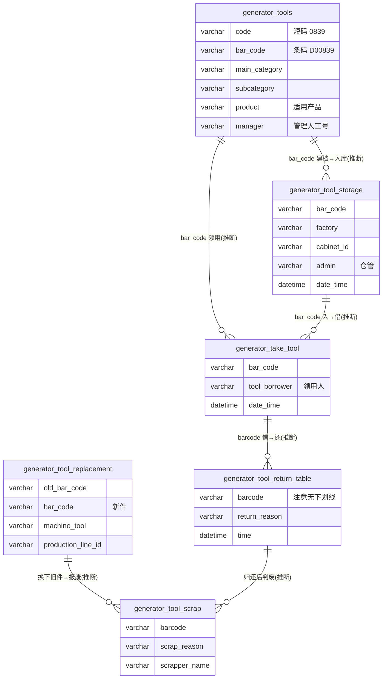

# 工具工装模块 · fuadmin 数据字典
> 域: 03-质量技术域 | 表数: 6 | 用途: Agent基础文件 | 生成: 2026-07-23

# tool-工具工装 · 概述

tool 模块是工具/工装（含刀片、铣刀、镗刀等消耗性工具）的**台账 + 流转流水**管理域，围绕一把工具的条码（bar_code）记录其"入库（tool_storage）→ 领用（take_tool）→ 归还（tool_return_table）→ 更换（tool_replacement）→ 报废（tool_scrap）"五段旅程。`generator_tools` 是工具主数据台账（1.5 千行，含编码、分类 main_category/subcategory、适用产品、管理人），五张流水表合计约 14 万行，按厂区（factory=外冈等）与刀柜（cabinet_id）归集。与 knife 模块的边界：knife 管"上机切削刀具全生命周期与成本对标"，tool 管"通用工具仓的借还流转"，两者供应商/条码体系相通但台账分立（口径划分待确认）。模块是纯流水结构、无审批状态字段，管理人/操作人均为姓名字符串。

# tool-工具工装 · 上岗指南

## 2.1 核心实体表（TOP6）

| 表 | 一句话定义 |
|---|---|
| generator_tools | 工具主数据台账（1.5千行）：code/bar_code、分类、型号、适用产品、管理人 |
| generator_tool_storage | 入库流水（5万行）：入柜时间、厂区、柜号、admin |
| generator_take_tool | 领用流水（4.4万行）：tool_borrower 领用人 |
| generator_tool_return_table | 归还流水（3.5万行）：return_reason、仓库 admin |
| generator_tool_scrap | 报废流水（1.7万行）：scrapper_name、scrap_reason（磨损等） |
| generator_tool_replacement | 更换流水（1.3万行）：机台/产线、新旧供应商与条码 |

## 2.2 核心业务流

1. **建档**：新工具在 `generator_tools` 建台账——code（0839 短码）、bar_code（D00839）、main_category（刀具/刀盘）×subcategory（铣刀/镗刀）、product（GS62 HEV）、manager（管理人员工号 CZRY0009）。
2. **入库**：采购/修磨回厂登记 `generator_tool_storage`（admin 仓管、factory、cabinet_id、date_time）。
3. **领用**：车间借出登记 `generator_take_tool`（tool_borrower，如谢红桥），同条码可多次领还循环。
4. **归还**：归还登记 `generator_tool_return_table`（admin=仓库，return_reason）。
5. **更换**：上机工具损坏/到期，登记 `generator_tool_replacement`（machine_tool、production_line_id、old_bar_code→bar_code、新旧供应商）。
6. **报废**：彻底不可用登记 `generator_tool_scrap`（scrapper_name、scrap_reason=磨损），条码生命周期终结。

**库存口径（推断）**：当前在库 = 入库 − 领用 + 归还 − 报废（按 bar_code 逐把滚动计算，无现成库存快照表）。

## 2.3 典型查询场景

**场景1：某把工具的完整流转轨迹**
```sql
SELECT '入库' AS stage, date_time AS t, admin AS person FROM generator_tool_storage WHERE bar_code = 'D00839'
UNION ALL SELECT '领用', date_time, tool_borrower FROM generator_take_tool WHERE bar_code = 'D00839'
UNION ALL SELECT '归还', time, admin FROM generator_tool_return_table WHERE barcode = 'D00839'
UNION ALL SELECT '报废', time, scrapper_name FROM generator_tool_scrap WHERE barcode = 'D00839'
ORDER BY t;
```

**场景2：当前借出未还清单（超时催还）**
```sql
SELECT t.bar_code, t.model, t.tool_borrower, t.date_time AS borrow_time
FROM generator_take_tool t
LEFT JOIN generator_tool_return_table r ON r.barcode = t.bar_code AND r.time > t.date_time
WHERE r.id IS NULL
ORDER BY t.date_time ASC;
```

**场景3：报废原因 TOP（损耗结构分析）**
```sql
SELECT scrap_reason, COUNT(*) AS cnt, COUNT(DISTINCT model) AS model_cnt
FROM generator_tool_scrap
WHERE time >= '2024-01-01'
GROUP BY scrap_reason ORDER BY cnt DESC;
```

**场景4：按型号统计某月领用频次（高频消耗型号）**
```sql
SELECT model, COUNT(*) AS take_cnt, COUNT(DISTINCT tool_borrower) AS borrower_cnt
FROM generator_take_tool
WHERE date_time >= '2024-06-01' AND date_time < '2024-07-01'
GROUP BY model ORDER BY take_cnt DESC LIMIT 20;
```

**场景5：供应商维度报废量对比（质量评价输入）**
```sql
SELECT supplier, model, COUNT(*) AS scrap_cnt
FROM generator_tool_scrap
GROUP BY supplier, model
ORDER BY scrap_cnt DESC;
```

**场景6：台账与实际流转对账（有流转无台账的孤儿条码）**
```sql
SELECT DISTINCT s.bar_code
FROM generator_tool_storage s
LEFT JOIN generator_tools g ON g.bar_code = s.bar_code
WHERE g.id IS NULL;
```

**场景7：按柜位盘点某厂区库存（推断口径）**
```sql
SELECT st.cabinet_id, st.model, COUNT(DISTINCT st.bar_code) AS in_cnt
FROM generator_tool_storage st
WHERE st.factory = '外冈'
GROUP BY st.cabinet_id, st.model;   -- 未扣领用/报废，仅为入库侧
```

## 2.4 避坑指南

- **与 knife 模块边界模糊**：tool_replacement（机台换刀）与 knife 的 `generator_machine_tool_change` 字段几乎同构（factory/cabinet_id/tool_changer/machine_tool/old_bar_code/bar_code），且 tool_scrap 的"磨损"报废与 knife 旧刀回收衔接。两套并存，**现役口径以哪套为准待确认**，跨模块统计务必先按 create_datetime 判断活跃表。
- **字段名不一致**：条码列在三张表叫 `bar_code`、两张叫 `barcode`；时间列有 `date_time` / `time` 两种；join 前先核对。
- **纯流水无状态**：归还/报废不反写台账表，"当前状态"必须按条码滚动计算。
- **无单价金额**：成本在 knife_requisition / 采购域，本模块只管数量流转。
- **supplier 存简称**（京丞、杨歌尔、艾什），与供应商主数据是全称，关联需映射（推断）。
- **remarks 为 longtext**，可能藏非结构化关键信息，抽样阅读再决定是否纳入统计。

## 3 数据字典

### generator_tool_replacement（约 13446 行）
业务定义: 工具更换流水，机台/产线、新旧供应商与条码 ｜ 表注释: -

| 字段 | 类型 | 可空 | 键 | 原始注释 | 推断语义 | 置信度 |
|---|---|---|---|---|---|---|
| id | bigint | N | PRI | - | 主键ID | high |
| remark | varchar(255) | Y | - | - | 备注 | high |
| modifier | varchar(255) | Y | - | - | 最后修改人姓名 | high |
| belong_dept | int | Y | - | - | 所属部门ID | mid |
| update_datetime | datetime | Y | - | - | 最后更新时间 | high |
| create_datetime | datetime | Y | - | - | 创建时间 | high |
| sort | int | Y | - | - | 排序号 | high |
| _MASK_TO_V2 | bigint | Y | MUL | - | 数值字段[推断-待确认] | low |
| remarks | longtext | Y | - | - | 待确认 | low |
| factory | varchar(255) | Y | - | - | 文本字段[推断-待确认] | low |
| cabinet_id | varchar(255) | Y | - | - | 关联ID（目标表待确认）[推断] | low |
| tool_changer | varchar(255) | Y | - | - | 刀具/工具[推断] | mid |
| tool_order | varchar(255) | Y | - | - | 刀具/工具[推断] | mid |
| machine_tool | varchar(255) | Y | - | - | 刀具/工具[推断] | mid |
| production_line_id | varchar(255) | Y | - | - | 关联ID → generator_production_line.id[推断] | mid |
| old_tool_supplier | varchar(255) | Y | - | - | 供应商[推断] | high |
| old_bar_code | varchar(255) | Y | - | - | 编号/代码[推断] | mid |
| model | varchar(255) | Y | - | - | 规格/型号[推断] | mid |
| new_tool_supplier | varchar(255) | Y | - | - | 供应商[推断] | high |
| bar_code | varchar(255) | Y | - | - | 编号/代码[推断] | mid |
| date_time | datetime(6) | Y | - | - | 时间[推断] | high |
| creator_id | bigint | Y | MUL | - | 创建人ID → system_users.id | high |

### generator_tool_return_table（约 34790 行）
业务定义: 工具归还流水，归还原因、仓库管理员、柜号 ｜ 表注释: -

| 字段 | 类型 | 可空 | 键 | 原始注释 | 推断语义 | 置信度 |
|---|---|---|---|---|---|---|
| id | bigint | N | PRI | - | 主键ID | high |
| remark | varchar(255) | Y | - | - | 备注 | high |
| modifier | varchar(255) | Y | - | - | 最后修改人姓名 | high |
| belong_dept | int | Y | - | - | 所属部门ID | mid |
| update_datetime | datetime(6) | Y | - | - | 最后更新时间 | high |
| create_datetime | datetime(6) | Y | - | - | 创建时间 | high |
| sort | int | Y | - | - | 排序号 | high |
| remarks | varchar(255) | Y | - | - | 文本字段[推断-待确认] | low |
| factory_name | varchar(255) | Y | - | - | 名称[推断] | high |
| cabinet_number | varchar(255) | Y | - | - | 编号/代码[推断] | mid |
| admin | varchar(255) | Y | - | - | 文本字段[推断-待确认] | low |
| return_reason | varchar(255) | Y | - | - | 原因[推断] | mid |
| model_type | varchar(255) | Y | - | - | 类型[推断] | mid |
| supplier_name | varchar(255) | Y | - | - | 名称[推断] | high |
| barcode | varchar(255) | Y | - | - | 文本字段[推断-待确认] | low |
| time | datetime(6) | Y | - | - | 时间[推断] | high |
| creator_id | bigint | Y | MUL | - | 创建人ID → system_users.id | high |
| _MASK_TO_V2 | bigint | Y | MUL | - | 数值字段[推断-待确认] | low |

### generator_tool_scrap（约 16936 行）
业务定义: 工具报废流水，报废人、报废原因（磨损等） ｜ 表注释: -

| 字段 | 类型 | 可空 | 键 | 原始注释 | 推断语义 | 置信度 |
|---|---|---|---|---|---|---|
| id | bigint | N | PRI | - | 主键ID | high |
| remark | varchar(255) | Y | - | - | 备注 | high |
| modifier | varchar(255) | Y | - | - | 最后修改人姓名 | high |
| belong_dept | int | Y | - | - | 所属部门ID | mid |
| update_datetime | datetime(6) | Y | - | - | 最后更新时间 | high |
| create_datetime | datetime(6) | Y | - | - | 创建时间 | high |
| sort | int | Y | - | - | 排序号 | high |
| remarks | varchar(255) | Y | - | - | 文本字段[推断-待确认] | low |
| factory | varchar(255) | Y | - | - | 文本字段[推断-待确认] | low |
| cabinet_number | varchar(255) | Y | - | - | 编号/代码[推断] | mid |
| scrapper_name | varchar(255) | Y | - | - | 名称[推断] | high |
| model | varchar(255) | Y | - | - | 规格/型号[推断] | mid |
| supplier | varchar(255) | Y | - | - | 供应商[推断] | high |
| barcode | varchar(255) | Y | - | - | 文本字段[推断-待确认] | low |
| time | datetime(6) | Y | - | - | 时间[推断] | high |
| creator_id | bigint | Y | MUL | - | 创建人ID → system_users.id | high |
| scrap_reason | varchar(255) | Y | - | - | 报废原因[推断] | mid |
| _MASK_TO_V2 | bigint | Y | MUL | - | 数值字段[推断-待确认] | low |

### generator_tool_storage（约 50440 行）
业务定义: 工具入库流水，记录入柜时间、厂区、柜号、型号、供应商 ｜ 表注释: -

| 字段 | 类型 | 可空 | 键 | 原始注释 | 推断语义 | 置信度 |
|---|---|---|---|---|---|---|
| id | bigint | N | PRI | - | 主键ID | high |
| remark | varchar(255) | Y | - | - | 备注 | high |
| modifier | varchar(255) | Y | - | - | 最后修改人姓名 | high |
| belong_dept | int | Y | - | - | 所属部门ID | mid |
| update_datetime | datetime | Y | - | - | 最后更新时间 | high |
| create_datetime | datetime | Y | - | - | 创建时间 | high |
| sort | int | Y | - | - | 排序号 | high |
| _MASK_TO_V2 | bigint | Y | MUL | - | 数值字段[推断-待确认] | low |
| remarks | longtext | Y | - | - | 待确认 | low |
| factory | varchar(255) | Y | - | - | 文本字段[推断-待确认] | low |
| cabinet_id | varchar(255) | Y | - | - | 关联ID（目标表待确认）[推断] | low |
| admin | varchar(255) | Y | - | - | 文本字段[推断-待确认] | low |
| model | varchar(255) | Y | - | - | 规格/型号[推断] | mid |
| supplier_name | varchar(255) | Y | - | - | 名称[推断] | high |
| bar_code | varchar(255) | Y | - | - | 编号/代码[推断] | mid |
| date_time | datetime(6) | Y | - | - | 时间[推断] | high |
| creator_id | bigint | Y | MUL | - | 创建人ID → system_users.id | high |

### generator_tools（约 1478 行）
业务定义: 工具主数据台账：编码、条码、分类、型号、适用产品、管理人 ｜ 表注释: -

| 字段 | 类型 | 可空 | 键 | 原始注释 | 推断语义 | 置信度 |
|---|---|---|---|---|---|---|
| id | bigint | N | PRI | - | 主键ID | high |
| remark | varchar(255) | Y | - | - | 备注 | high |
| modifier | varchar(255) | Y | - | - | 最后修改人姓名 | high |
| belong_dept | int | Y | - | - | 所属部门ID | mid |
| update_datetime | datetime(6) | Y | - | - | 最后更新时间 | high |
| create_datetime | datetime(6) | Y | - | - | 创建时间 | high |
| sort | int | Y | - | - | 排序号 | high |
| factory | varchar(255) | Y | - | - | 文本字段[推断-待确认] | low |
| cabinet_id | varchar(255) | Y | - | - | 关联ID（目标表待确认）[推断] | low |
| code | varchar(255) | Y | - | - | 编号/代码[推断] | mid |
| manager | varchar(255) | Y | - | - | 文本字段[推断-待确认] | low |
| model | varchar(255) | Y | - | - | 规格/型号[推断] | mid |
| supplier_name | varchar(255) | Y | - | - | 名称[推断] | high |
| subcategory | varchar(255) | Y | - | - | 分类[推断] | mid |
| main_category | varchar(255) | Y | - | - | 分类[推断] | mid |
| product | varchar(255) | Y | - | - | 产品[推断] | high |
| bar_code | varchar(255) | Y | - | - | 编号/代码[推断] | mid |
| date_time | datetime(6) | Y | - | - | 时间[推断] | high |
| creator_id | bigint | Y | MUL | - | 创建人ID → system_users.id | high |
| _MASK_TO_V2 | varchar(255) | Y | - | - | 文本字段[推断-待确认] | low |

### generator_take_tool（约 44384 行）
业务定义: 工具领用/借出流水，领用人、型号、条码、时间 ｜ 表注释: -

| 字段 | 类型 | 可空 | 键 | 原始注释 | 推断语义 | 置信度 |
|---|---|---|---|---|---|---|
| id | bigint | N | PRI | - | 主键ID | high |
| remark | varchar(255) | Y | - | - | 备注 | high |
| modifier | varchar(255) | Y | - | - | 最后修改人姓名 | high |
| belong_dept | int | Y | - | - | 所属部门ID | mid |
| update_datetime | datetime | Y | - | - | 最后更新时间 | high |
| create_datetime | datetime | Y | - | - | 创建时间 | high |
| sort | int | Y | - | - | 排序号 | high |
| _MASK_TO_V2 | bigint | Y | MUL | - | 数值字段[推断-待确认] | low |
| remarks | longtext | Y | - | - | 待确认 | low |
| factory | varchar(255) | Y | - | - | 文本字段[推断-待确认] | low |
| cabinet_id | varchar(255) | Y | - | - | 关联ID（目标表待确认）[推断] | low |
| tool_borrower | varchar(255) | Y | - | - | 刀具/工具[推断] | mid |
| model | varchar(255) | Y | - | - | 规格/型号[推断] | mid |
| supplier_name | varchar(255) | Y | - | - | 名称[推断] | high |
| bar_code | varchar(255) | Y | - | - | 编号/代码[推断] | mid |
| date_time | datetime(6) | Y | - | - | 时间[推断] | high |
| creator_id | bigint | Y | MUL | - | 创建人ID → system_users.id | high |
| _MASK_FROM_V2 | timestamp | N | MUL | - | 待确认 | low |

# tool-工具工装 · ER 关系图



> **推断声明**：全模块无外键（仅 creator_id 索引），表间关联按条码字段名与样本值推断；库存关系为"流水滚动"语义而非物理外键。

# tool-工具工装 · 跨模块接口

## 出向依赖（tool → 外部）

| 外部表（域/模块） | 关联方式 | 说明 |
|---|---|---|
| system_users（05-人事系统域/system-用户权限） | creator_id → system_users.id | 全表审计外键；业务人员（borrower/admin/scrapper）均为姓名字符串，未外键化 |
| generator_devices（03-质量技术域/device-设备装置） | machine_tool（字符串，推断） | replacement 表机台编码，如 ZT-G1.5-05-456 |
| generator_production_line（02-生产铸造域/production-生产） | production_line_id（字符串，推断） | replacement 表产线引用 |
| generator_supplier*（01-供应链域/supplier-供应商） | supplier_name / supplier / new_tool_supplier（字符串，推断） | 存简称（京丞/杨歌尔/签诚），与主数据全称需映射 |

## 入向服务（外部 → tool）

| 消费方 | 消费内容 |
|---|---|
| knife-刀具 | 工具更换/报废与换刀记录互补，构成刀具损耗完整图景；条码体系相通（DA/PA/PZ 前缀） |
| purchase-采购 | 高频领用型号 + 报废速率 → 采购补货与安全库存输入 |
| equipment/maintenance | 异常报废（非磨损原因）可作为设备/工装故障信号 |

## 特别说明

- `generator_tool_replacement` 与 knife 模块 `generator_machine_tool_change` 字段高度同构，疑为同一业务的两代实现或按工具类型拆分，**待确认**；接口开发时勿重复统计。
- `_MASK_TO_V2` / `_MASK_FROM_V2` 为新旧系统同步痕迹，勿用于业务逻辑。

## 6 字段备注改进建议

（待 enrich 补充）

## 相关页面
- [[fuadmin数据字典总览]]
- [[产品模块-fuadmin数据字典]]
- [[刀具模块-fuadmin数据字典]]
- [[工艺技术模块-fuadmin数据字典]]
- [[工装夹具模块-fuadmin数据字典]]
- [[测量计量模块-fuadmin数据字典]]
- [[维修保养模块-fuadmin数据字典]]
- [[设备模块-fuadmin数据字典]]
- [[设备装置模块-fuadmin数据字典]]
- [[质量检验模块-fuadmin数据字典]]
