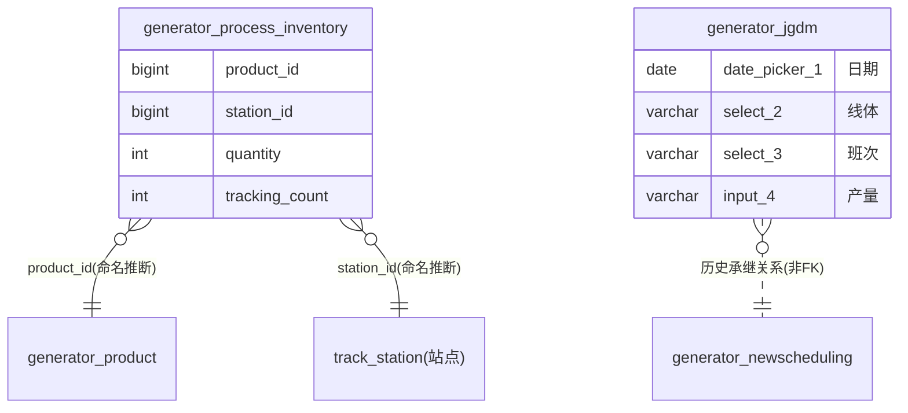

# 工艺技术模块 · fuadmin 数据字典
> 域: 03-质量技术域 | 表数: 2 | 用途: Agent基础文件 | 生成: 2026-07-23

# process-工艺技术 · 模块概述

两表性质迥异：`generator_jgdm`（450 行）是老系统加工日产记录（日期/线体/班次/产量，字段为表单控件命名 input_4/select_2/select_3），带 `_MASK_TO_V2`/`_MUSID_SYNC_V2` 迁移同步字段，属旧系统向现系统迁移的过渡表；`generator_process_inventory`（0 行）是设计中的工序在制品库存表（产品×工位唯一，数量/跟踪数），已建成未启用——在制品数量目前应走 newscheduling 报工口径推算。

# process-工艺技术 · 上岗指南

## 2.1 核心实体

| 表 | 一句话定义 |
|---|---|
| generator_jgdm | 老系统加工日产记录（线体×班次×日产量，450条，V2迁移痕迹） |
| generator_process_inventory | 工序在制品库存（product×station 联合唯一，0行未启用） |

## 2.2 核心业务流

jgdm 为老系统（V2 前）按"日期+线体+班次"登记的日产量流水（input_4=产量，样本 105/106），已随 V2 迁移停止更新（最新样本 2023-11），现役报工由 newscheduling 承接。process_inventory 设计为按产品×工位跟踪在制品数量（tracking_count 追溯数），尚未启用。

## 2.3 查询场景

```sql
-- 老系统日产趋势（历史口径）
SELECT date_picker_1 AS 日期, select_2 AS 线体, select_3 AS 班次, CAST(input_4 AS UNSIGNED) AS 产量
FROM generator_jgdm ORDER BY date_picker_1;
```

## 2.4 避坑提示

- ⚠️ **jgdm 字段名是表单控件名**（input_4/select_2/select_3/date_picker_1）——低代码平台自动生成，无语义命名，属整改重点。
- ⚠️ jgdm 最后数据 2023-11，已停更，**勿当现役产量源**；现役走 newscheduling。
- ⚠️ `_MASK_TO_V2`/`_MUSID_SYNC_V2` 为 V2 迁移同步字段（映射旧主键/同步标记），业务查询忽略。
- ⚠️ process_inventory 0 行未启用；在制品口径暂以 qrcode/track 模块为准。

## 3 数据字典

### generator_jgdm（约 450 行）
业务定义: 老系统加工日产记录（线体×班次×日产量，2023-11停更，V2迁移遗留） ｜ 表注释: -

| 字段 | 类型 | 可空 | 键 | 原始注释 | 推断语义 | 置信度 |
|---|---|---|---|---|---|---|
| id | int | N | PRI | - | 主键ID | high |
| remark | varchar(255) | Y | - | - | 备注 | high |
| modifier | varchar(255) | Y | - | - | 最后修改人姓名 | high |
| belong_dept | int | Y | - | - | 所属部门ID | mid |
| update_datetime | datetime(6) | Y | - | - | 最后更新时间 | high |
| create_datetime | datetime(6) | Y | - | - | 创建时间 | high |
| sort | int | Y | - | - | 排序号 | high |
| input_4 | varchar(255) | Y | - | - | 文本字段[推断-待确认] | low |
| select_3 | varchar(255) | Y | - | - | 文本字段[推断-待确认] | low |
| select_2 | varchar(255) | Y | - | - | 文本字段[推断-待确认] | low |
| date_picker_1 | date | Y | - | - | 日期时间[推断] | mid |
| creator_id | bigint | Y | MUL | - | 创建人ID → system_users.id | high |
| _MASK_TO_V2 | bigint | Y | MUL | - | 数值字段[推断-待确认] | low |
| _MUSID_SYNC_V2 | int unsigned | Y | MUL | - | 数值字段[推断-待确认] | low |

### generator_process_inventory（约 0 行）
业务定义: 工序在制品库存（产品×工位联合唯一，0行未启用） ｜ 表注释: -

| 字段 | 类型 | 可空 | 键 | 原始注释 | 推断语义 | 置信度 |
|---|---|---|---|---|---|---|
| id | bigint | N | PRI | - | 主键ID | high |
| remark | varchar(255) | Y | - | - | 备注 | high |
| modifier | varchar(255) | Y | - | - | 最后修改人姓名 | high |
| belong_dept | int | Y | - | - | 所属部门ID | mid |
| update_datetime | datetime(6) | Y | - | - | 最后更新时间 | high |
| create_datetime | datetime(6) | Y | - | - | 创建时间 | high |
| sort | int | Y | - | - | 排序号 | high |
| product_name | varchar(100) | Y | - | - | 名称[推断] | high |
| quantity | int | N | - | - | 数量[推断] | high |
| tracking_count | int | N | - | - | 数量[推断] | high |
| creator_id | bigint | Y | MUL | - | 创建人ID → system_users.id | high |
| product_id | bigint | Y | MUL | - | 关联ID → generator_bad_product.id[推断] | mid |
| station_name | varchar(100) | Y | - | - | 名称[推断] | high |
| station_id | bigint | Y | MUL | - | 关联ID → track_station.id[推断] | mid |

## 4 模块ER图


依据：inventory 两 FK 为命名+联合唯一索引推断（中）；jgdm→newscheduling 为业务承继非物理关联（说明性）。

## 5 跨模块接口

| 本模块表.字段 | →目标模块.表.字段 | 依据 | 置信度 |
|---|---|---|---|
| generator_process_inventory.product_id | →product-产品.generator_product.id | naming | mid |
| generator_process_inventory.station_id | →02域.track_station.id | naming | low |
| generator_jgdm._MASK_TO_V2 | →V2迁移映射(旧主键) | sample | mid |
| generator_jgdm.creator_id | →system-用户权限.system_users.id | naming | high |

## 6 字段备注改进建议

（待 enrich 补充）

## 相关页面
- [[fuadmin数据字典总览]]
- [[产品模块-fuadmin数据字典]]
- [[刀具模块-fuadmin数据字典]]
- [[工具工装模块-fuadmin数据字典]]
- [[工装夹具模块-fuadmin数据字典]]
- [[测量计量模块-fuadmin数据字典]]
- [[维修保养模块-fuadmin数据字典]]
- [[设备模块-fuadmin数据字典]]
- [[设备装置模块-fuadmin数据字典]]
- [[质量检验模块-fuadmin数据字典]]
