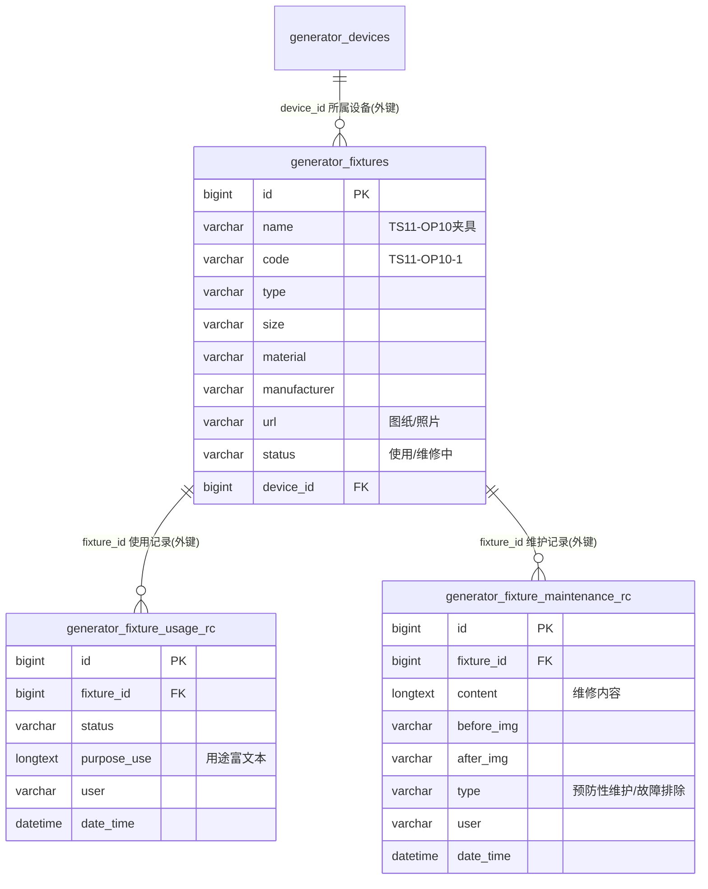

# 工装夹具模块 · fuadmin 数据字典
> 域: 03-质量技术域 | 表数: 3 | 用途: Agent基础文件 | 生成: 2026-07-23

# fixture-工装夹具 · 概述

fixture 模块是工装夹具的**台账 + 使用记录 + 维护记录**三表小域：`generator_fixtures` 登记夹具档案（名称/编码/类型/尺寸/材质/制造商/图纸照片 url/状态，并挂接所属设备 device_id），`generator_fixture_usage_rc` 记录每次领用（用途 purpose_use 富文本、使用人、状态如"使用/维修中"），`generator_fixture_maintenance_rc` 记录维修保养（内容、维修前后照片 before_img/after_img、类型=预防性维护/故障排除）。当前数据量极小（台账 5 行、使用 2 行、维护 4 行），疑似新上线试点或低频使用模块；使用与维护记录通过 fixture_id 真实外键回挂台账，是本批模块中唯一有物理外键的域。

# fixture-工装夹具 · 上岗指南

## 2.1 核心实体表（TOP3）

| 表 | 一句话定义 |
|---|---|
| generator_fixtures | 夹具台账（5行）：name/code、type、size、material、manufacturer、url 图纸照片、status、device_id |
| generator_fixture_usage_rc | 使用记录（2行）：fixture_id 外键、purpose_use 富文本用途、user、status（使用/维修中） |
| generator_fixture_maintenance_rc | 维护记录（4行）：fixture_id 外键、content、before_img/after_img、type（预防性维护/故障排除） |

## 2.2 核心业务流

1. **建档**：新夹具登记 `generator_fixtures`——name（TS11-OP10夹具）、code（TS11-OP10-1）、type、size（1000*500*850）、material、manufacturer（普锐斯/起亚）、url（图纸或照片静态路径）、device_id 挂所属设备，status 初始"使用"。
2. **领用**：使用人登记 `generator_fixture_usage_rc`（purpose_use 为格式化富文本：日期/使用人员/夹具名称/生产线），台账 status 联动为"使用"。
3. **维护/报修**：故障时登记 `generator_fixture_maintenance_rc`——type=故障排除（或计划性的预防性维护）、content 描述（夹具顶针损坏）、上传维修前后照片，usage_rc 侧 status 变"维修中"。
4. **复位**：修复后状态回"使用"，循环。

## 2.3 典型查询场景

**场景1：夹具台账全览（含所属设备）**
```sql
SELECT f.code, f.name, f.type, f.manufacturer, f.status, f.device_id
FROM generator_fixtures f
ORDER BY f.code;
```

**场景2：某夹具的使用历史**
```sql
SELECT u.date_time, u.user, u.status, u.purpose_use
FROM generator_fixture_usage_rc u
WHERE u.fixture_id = 2
ORDER BY u.date_time DESC;
```

**场景3：某夹具的维护历史（带照片凭证）**
```sql
SELECT m.date_time, m.type, m.content, m.before_img, m.after_img, m.user
FROM generator_fixture_maintenance_rc m
WHERE m.fixture_id = 2
ORDER BY m.date_time DESC;
```

**场景4：当前维修中的夹具**
```sql
SELECT f.code, f.name, u.date_time AS since, u.user
FROM generator_fixture_usage_rc u
JOIN generator_fixtures f ON f.id = u.fixture_id
WHERE u.status = '维修中';
```

**场景5：故障排除类维护频次（夹具可靠性排名）**
```sql
SELECT f.code, f.name, COUNT(*) AS repair_cnt
FROM generator_fixture_maintenance_rc m
JOIN generator_fixtures f ON f.id = m.fixture_id
WHERE m.type = '故障排除'
GROUP BY f.code, f.name
ORDER BY repair_cnt DESC;
```

## 2.4 避坑指南

- **数据量极小**（5/2/4 行），样本含演示数据痕迹（"张三/XYZ夹具/C生产线"），查询结论勿外推；上线口径**待确认**。
- **purpose_use 是富文本模板**（日期/使用人员/夹具名称/生产线多行文本），结构化统计需解析，且样本含测试内容。
- **图片存静态路径**（/static/20240430/…），迁移环境时注意附件可达性。
- **status 双写**：台账与使用记录各有 status，样本中不保证同步，以最新 usage_rc 为准（推断）。
- fixture_id / device_id 是**真实外键索引**，与本批其他模块（纯条码字符串关联）不同，join 可放心使用。

## 3 数据字典

### generator_fixture_maintenance_rc（约 4 行）
业务定义: 夹具维护记录：维修内容、前后照片、维护类型，外键回挂台账 ｜ 表注释: -

| 字段 | 类型 | 可空 | 键 | 原始注释 | 推断语义 | 置信度 |
|---|---|---|---|---|---|---|
| id | bigint | N | PRI | - | 主键ID | high |
| remark | varchar(255) | Y | - | - | 备注 | high |
| modifier | varchar(255) | Y | - | - | 最后修改人姓名 | high |
| belong_dept | int | Y | - | - | 所属部门ID | mid |
| update_datetime | datetime(6) | Y | - | - | 最后更新时间 | high |
| create_datetime | datetime(6) | Y | - | - | 创建时间 | high |
| sort | int | Y | - | - | 排序号 | high |
| content | longtext | Y | - | - | 内容[推断] | mid |
| after_img | varchar(255) | Y | - | - | 文本字段[推断-待确认] | low |
| before_img | varchar(255) | Y | - | - | 文本字段[推断-待确认] | low |
| user | varchar(255) | Y | - | - | 用户[推断] | mid |
| type | varchar(255) | Y | - | - | 类型[推断] | mid |
| date_time | datetime(6) | Y | - | - | 时间[推断] | high |
| creator_id | bigint | Y | MUL | - | 创建人ID → system_users.id | high |
| fixture_id | bigint | Y | MUL | - | 关联ID → generator_fixtures.id[推断] | mid |

### generator_fixture_usage_rc（约 2 行）
业务定义: 夹具使用记录：用途、使用人、使用状态，外键回挂台账 ｜ 表注释: -

| 字段 | 类型 | 可空 | 键 | 原始注释 | 推断语义 | 置信度 |
|---|---|---|---|---|---|---|
| id | bigint | N | PRI | - | 主键ID | high |
| remark | varchar(255) | Y | - | - | 备注 | high |
| modifier | varchar(255) | Y | - | - | 最后修改人姓名 | high |
| belong_dept | int | Y | - | - | 所属部门ID | mid |
| update_datetime | datetime(6) | Y | - | - | 最后更新时间 | high |
| create_datetime | datetime(6) | Y | - | - | 创建时间 | high |
| sort | int | Y | - | - | 排序号 | high |
| status | varchar(255) | Y | - | - | 状态（枚举值待确认）[推断] | mid |
| user | varchar(255) | Y | - | - | 用户[推断] | mid |
| purpose_use | longtext | Y | - | - | 待确认 | low |
| date_time | datetime(6) | Y | - | - | 时间[推断] | high |
| creator_id | bigint | Y | MUL | - | 创建人ID → system_users.id | high |
| fixture_id | bigint | Y | MUL | - | 关联ID → generator_fixtures.id[推断] | mid |

### generator_fixtures（约 5 行）
业务定义: 工装夹具台账：名称编码、类型尺寸材质、制造商、图纸照片、状态、所属设备 ｜ 表注释: -

| 字段 | 类型 | 可空 | 键 | 原始注释 | 推断语义 | 置信度 |
|---|---|---|---|---|---|---|
| id | bigint | N | PRI | - | 主键ID | high |
| remark | varchar(255) | Y | - | - | 备注 | high |
| modifier | varchar(255) | Y | - | - | 最后修改人姓名 | high |
| belong_dept | int | Y | - | - | 所属部门ID | mid |
| update_datetime | datetime(6) | Y | - | - | 最后更新时间 | high |
| create_datetime | datetime(6) | Y | - | - | 创建时间 | high |
| sort | int | Y | - | - | 排序号 | high |
| status | varchar(255) | Y | - | - | 状态（枚举值待确认）[推断] | mid |
| date_time | datetime(6) | Y | - | - | 时间[推断] | high |
| manufacturer | varchar(255) | Y | - | - | 文本字段[推断-待确认] | low |
| material | varchar(255) | Y | - | - | 物料[推断] | high |
| url | varchar(255) | Y | - | - | 路径/链接[推断] | mid |
| size | varchar(255) | Y | - | - | 文本字段[推断-待确认] | low |
| type | varchar(255) | Y | - | - | 类型[推断] | mid |
| name | varchar(255) | Y | - | - | 名称[推断] | high |
| code | varchar(255) | Y | - | - | 编号/代码[推断] | mid |
| creator_id | bigint | Y | MUL | - | 创建人ID → system_users.id | high |
| device_id | bigint | Y | MUL | - | 关联ID → generator_devices.id[推断] | mid |

# fixture-工装夹具 · ER 关系图



> **推断声明**：fixture_id / device_id 为物理外键（有索引），可信度高于本批其他模块；device_id 指向 `generator_devices`（device-设备装置模块）为按命名与外键惯例推断；usage_rc 与 maintenance_rc 之间无直接关联，通过台账汇合。

# fixture-工装夹具 · 跨模块接口

## 出向依赖（fixture → 外部）

| 外部表（域/模块） | 关联方式 | 说明 |
|---|---|---|
| generator_devices（03-质量技术域/device-设备装置） | generator_fixtures.device_id → generator_devices.id（外键，推断） | 夹具挂所属设备/装置 |
| system_users（05-人事系统域/system-用户权限） | creator_id → system_users.id | 审计外键；user 字段存"账号+姓名"字符串（如 "superadmin 超级管理员"） |

## 入向服务（外部 → fixture）

| 消费方 | 消费内容 |
|---|---|
| maintenance-维修保养 | 夹具维护记录（故障排除/预防性维护）与设备保养体系互补，可作为工装类保养计划输入 |
| production-生产 | usage_rc 的生产线信息（purpose_use 富文本内）反映夹具上产线使用情况（推断） |
| quality/inspection | 夹具状态（维修中）可作为尺寸异常的排查维度（推断，无表级证据） |

## 特别说明

- 模块当前数据量极小（台账 5 行），接口侧按"试点模块"对待，勿依赖其做全量约束。
- 图片/图纸为 /static/ 相对路径，跨系统引用需拼 base URL。

## 6 字段备注改进建议

（本模块为小型/过渡性模块，业务语义与归属建议见同域《零散模块总览》或域内相关主模块文档）

## 相关页面
- [[fuadmin数据字典总览]]
- [[产品模块-fuadmin数据字典]]
- [[刀具模块-fuadmin数据字典]]
- [[工具工装模块-fuadmin数据字典]]
- [[工艺技术模块-fuadmin数据字典]]
- [[测量计量模块-fuadmin数据字典]]
- [[维修保养模块-fuadmin数据字典]]
- [[设备模块-fuadmin数据字典]]
- [[设备装置模块-fuadmin数据字典]]
- [[质量检验模块-fuadmin数据字典]]
