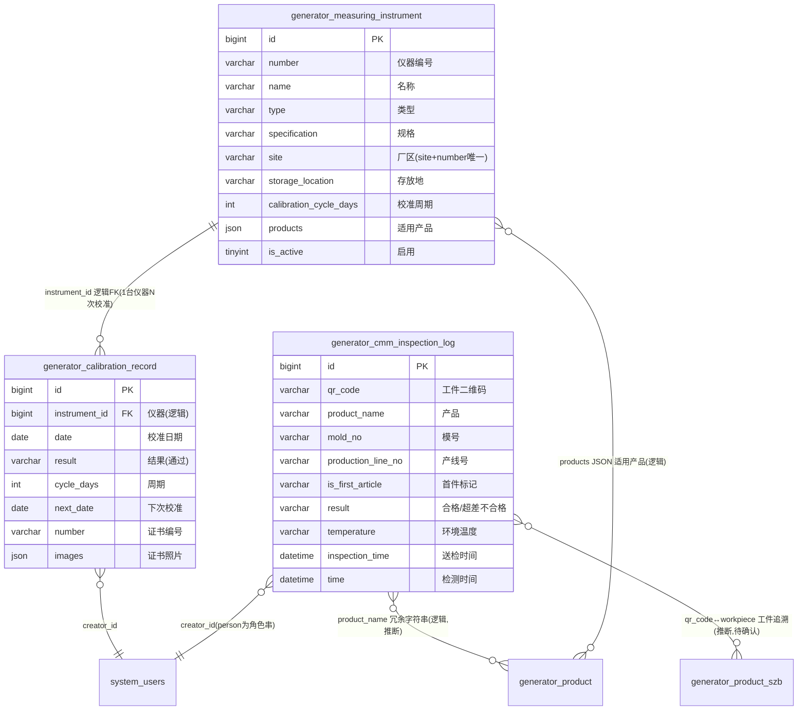

# 测量计量模块 · fuadmin 数据字典
> 域: 03-质量技术域 | 表数: 3 | 用途: Agent基础文件 | 生成: 2026-07-23

# measuring-测量计量 · 概述

measuring 模块是**测量仪器台账 + 周期校准 + CMM 三坐标检测**的计量闭环，共 3 表。`generator_measuring_instrument`（138行）是仪器台账：number 编号（GN52720A0600）、name（贯穿通止规）、type（通止规）、specification 规格（Φ10.84±0.16）、storage_location 存放地、site 厂区（广汇），site+number 唯一约束，products JSON 列适用产品，calibration_cycle_days 校准周期（182天）。`generator_calibration_record`（138行）是校准履历：instrument_id 逻辑外键回挂台账，date 校准日期 + cycle_days → next_date 下次校准，result（通过）、number 证书编号、images 证书照片。`generator_cmm_inspection_log`（3.77万行）是 CMM 三坐标检测日志：按 qr_code（工件码）记录 product_name、mold_no 模号、production_line_no 产线、is_first_article 首件标记、status/inspection_status（PQC）、result（合格/超差不合格）、temperature（20℃）、送检/检测双时间戳，是尺寸质量追溯的核心数据源。

# measuring-测量计量 · 上岗指南

## 2.1 核心实体表（TOP3）

| 表 | 一句话定义 |
|---|---|
| generator_measuring_instrument | 仪器台账（138行）：number 编号、name、type、specification 规格、site+number 唯一、calibration_cycle_days |
| generator_calibration_record | 校准履历（138行）：instrument_id、date、result、next_date、number 证书编号、images 证书照片 |
| generator_cmm_inspection_log | CMM三坐标日志（3.77万行）：qr_code 工件码、is_first_article、result、temperature、双时间戳 |

## 2.2 核心业务流

1. **仪器建档**：`generator_measuring_instrument` 登记 number（GN52720A0600）、name（贯穿通止规）、type、specification（Φ10.84±0.16）、storage_location（产线巡检）、site（广汇厂区，site+number 唯一）、products JSON 列适用产品、calibration_cycle_days（182天）、company（供应商 无锡格康特）。
2. **周期校准**：到期后在 `generator_calibration_record` 登记录——instrument_id 回挂台账、date 校准日期、result（通过）、cycle_days 回写周期、**next_date = date + cycle_days** 预存下次校准日、number 为校准证书编号（CD014-260883167）、images 存证书照片。
3. **CMM 送检**：产线工件（首件或抽检）送三坐标室——`generator_cmm_inspection_log` 记 inspection_time（送检时间）、inspection_person（送检员）、qr_code（工件码 FHKK51241095W426）、product_name、mold_no（模号）、production_line_no（产线号）、is_first_article（首件标记 + first_article_reason）。
4. **检测判定**：测量员检测后回填 time（检测时间）、person（测量员）、result（合格/超差不合格）、temperature（20℃ 恒温记录）、status/inspection_status（PQC 等检验节点）。
5. **超差联动**：超差不合格件按 qr_code 追溯工件，疑触发质量快速响应（跨模块，推断待确认）。

## 2.3 典型查询场景

**场景1：校准到期预警（30天内到期仪器清单）**
```sql
SELECT i.number, i.name, i.type, i.storage_location, c.next_date,
       DATEDIFF(c.next_date, CURDATE()) AS days_left
FROM generator_calibration_record c
JOIN generator_measuring_instrument i ON i.id = c.instrument_id
JOIN (SELECT instrument_id, MAX(date) AS last_date
      FROM generator_calibration_record GROUP BY instrument_id) latest
  ON latest.instrument_id = c.instrument_id AND latest.last_date = c.date
WHERE i.is_active = 1 AND c.next_date <= DATE_ADD(CURDATE(), INTERVAL 30 DAY)
ORDER BY c.next_date;
```

**场景2：逾期未校准仪器（已超期）**
```sql
SELECT i.number, i.name, i.storage_location, c.next_date,
       DATEDIFF(CURDATE(), c.next_date) AS overdue_days
FROM generator_calibration_record c
JOIN generator_measuring_instrument i ON i.id = c.instrument_id
WHERE c.next_date < CURDATE() AND i.is_active = 1
ORDER BY overdue_days DESC;
```

**场景3：CMM 检测合格率（按产品，近30天）**
```sql
SELECT product_name,
       COUNT(*) AS total,
       SUM(CASE WHEN result = '合格' THEN 1 ELSE 0 END) AS pass_cnt,
       ROUND(SUM(CASE WHEN result = '合格' THEN 1 ELSE 0 END) / COUNT(*) * 100, 2) AS pass_rate
FROM generator_cmm_inspection_log
WHERE time >= DATE_SUB(NOW(), INTERVAL 30 DAY)
GROUP BY product_name
ORDER BY pass_rate ASC;
```

**场景4：CMM 尺寸不合格趋势（按日+产线）**
```sql
SELECT DATE(time) AS d, production_line_no, mold_no,
       COUNT(*) AS total,
       SUM(CASE WHEN result = '超差不合格' THEN 1 ELSE 0 END) AS ng_cnt
FROM generator_cmm_inspection_log
WHERE time >= DATE_SUB(NOW(), INTERVAL 30 DAY)
GROUP BY d, production_line_no, mold_no
HAVING ng_cnt > 0
ORDER BY d DESC, ng_cnt DESC;
```

**场景5：首件检验记录（首件合格率）**
```sql
SELECT product_name, is_first_article, result, COUNT(*) AS cnt
FROM generator_cmm_inspection_log
WHERE is_first_article = '是'
GROUP BY product_name, is_first_article, result;
```

**场景6：仪器台账按厂区/类型盘点**
```sql
SELECT site, type, COUNT(*) AS cnt,
       SUM(CASE WHEN is_active = 1 THEN 1 ELSE 0 END) AS active_cnt
FROM generator_measuring_instrument
GROUP BY site, type
ORDER BY site, cnt DESC;
```

## 2.4 避坑指南

- **instrument_id 是逻辑 FK**：calibration_record 有索引但无物理外键，JOIN 前确认台账未被物理删除。
- **校准到期用 next_date，别现算**：记录里已预存 next_date（= date + cycle_days），直接过滤即可；但注意同一仪器多条履历时**必须取最新一条**（见场景1子查询），否则旧记录误报。
- **cmm_inspection_log 全 varchar**：temperature 带单位（'20℃'）、mold_no/production_line_no/is_first_article 都是字符串，做数值比较前先转换。
- **result 取值**：样本为 '合格' / '超差不合格'，是否还有第三值（如'让步接收'）待确认。
- **person / inspection_person 是角色串**：样本为“测量员”/“送检员”而非真实姓名，别指望关联员工表。
- **双时间戳语义**：inspection_time=送检时间，time=检测完成时间（样本送检 15:51 → 检测 16:12）；分析用 time。
- **_MASK_TO_V2/_MUSID_SYNC_V2 是 V2 同步字段**，业务查询忽略。
- **site+number 有唯一约束**：台账建档重复会报错，先查重。

## 3 数据字典

### generator_calibration_record（约 138 行）
业务定义: 仪器校准履历：校准日期/结果/周期/下次校准日期/证书 ｜ 表注释: -

| 字段 | 类型 | 可空 | 键 | 原始注释 | 推断语义 | 置信度 |
|---|---|---|---|---|---|---|
| id | bigint | N | PRI | - | 主键ID | high |
| remark | varchar(255) | Y | - | - | 备注 | high |
| modifier | varchar(255) | Y | - | - | 最后修改人姓名 | high |
| belong_dept | int | Y | - | - | 所属部门ID | mid |
| update_datetime | datetime(6) | Y | - | - | 最后更新时间 | high |
| create_datetime | datetime(6) | Y | - | - | 创建时间 | high |
| sort | int | Y | - | - | 排序号 | high |
| images | json | Y | - | - | 图片路径[推断] | mid |
| number | varchar(100) | Y | - | - | 编号/代码[推断] | mid |
| result | varchar(10) | Y | MUL | - | 文本字段[推断-待确认] | low |
| cycle_days | int unsigned | Y | - | - | 数值字段[推断-待确认] | low |
| next_date | date | Y | MUL | - | 日期[推断] | high |
| date | date | Y | - | - | 日期[推断] | high |
| creator_id | bigint | Y | MUL | - | 创建人ID → system_users.id | high |
| instrument_id | bigint | Y | MUL | - | 关联ID → generator_measuring_instrument.id[推断] | mid |

### generator_cmm_inspection_log（约 37743 行）
业务定义: CMM三坐标检测日志：工件码/首件/模号产线/判定结果 ｜ 表注释: -

| 字段 | 类型 | 可空 | 键 | 原始注释 | 推断语义 | 置信度 |
|---|---|---|---|---|---|---|
| id | bigint | N | PRI | - | 主键ID | high |
| remark | varchar(255) | Y | - | - | 备注 | high |
| modifier | varchar(255) | Y | - | - | 最后修改人姓名 | high |
| belong_dept | int | Y | - | - | 所属部门ID | mid |
| update_datetime | datetime(6) | Y | - | - | 最后更新时间 | high |
| create_datetime | datetime(6) | Y | - | - | 创建时间 | high |
| sort | int | Y | - | - | 排序号 | high |
| remarks | varchar(255) | Y | - | - | 文本字段[推断-待确认] | low |
| person | varchar(255) | Y | - | - | 文本字段[推断-待确认] | low |
| status | varchar(255) | Y | - | - | 状态（枚举值待确认）[推断] | mid |
| result | varchar(255) | Y | - | - | 文本字段[推断-待确认] | low |
| temperature | varchar(255) | Y | - | - | 温度[推断] | high |
| time | datetime(6) | Y | - | - | 时间[推断] | high |
| inspection_person | varchar(255) | Y | - | - | 文本字段[推断-待确认] | low |
| first_article_reason | varchar(255) | Y | - | - | 原因[推断] | mid |
| is_first_article | varchar(255) | Y | - | - | 标志位（布尔）[推断] | mid |
| inspection_status | varchar(255) | Y | - | - | 状态（枚举值待确认）[推断] | mid |
| mold_no | varchar(255) | Y | - | - | 编号/代码[推断] | mid |
| production_line_no | varchar(255) | Y | - | - | 编号/代码[推断] | mid |
| qr_code | varchar(255) | Y | - | - | 编号/代码[推断] | mid |
| product_name | varchar(255) | Y | - | - | 名称[推断] | high |
| inspection_time | datetime(6) | Y | - | - | 时间[推断] | high |
| creator_id | bigint | Y | MUL | - | 创建人ID → system_users.id | high |
| _MASK_TO_V2 | bigint | Y | MUL | - | 数值字段[推断-待确认] | low |
| _MUSID_SYNC_V2 | int unsigned | Y | MUL | - | 数值字段[推断-待确认] | low |

### generator_measuring_instrument（约 138 行）
业务定义: 测量仪器台账：编号/名称/类型/规格/存放地/校准周期 ｜ 表注释: -

| 字段 | 类型 | 可空 | 键 | 原始注释 | 推断语义 | 置信度 |
|---|---|---|---|---|---|---|
| id | bigint | N | PRI | - | 主键ID | high |
| remark | varchar(255) | Y | - | - | 备注 | high |
| modifier | varchar(255) | Y | - | - | 最后修改人姓名 | high |
| belong_dept | int | Y | - | - | 所属部门ID | mid |
| update_datetime | datetime(6) | Y | - | - | 最后更新时间 | high |
| create_datetime | datetime(6) | Y | - | - | 创建时间 | high |
| sort | int | Y | - | - | 排序号 | high |
| is_active | tinyint(1) | N | - | - | 标志位（布尔）[推断] | mid |
| images | json | Y | - | - | 图片路径[推断] | mid |
| calibration_cycle_days | int unsigned | N | - | - | 数值字段[推断-待确认] | low |
| specification | varchar(160) | Y | - | - | 规格/型号[推断] | mid |
| storage_location | varchar(50) | N | - | - | 仓库[推断] | mid |
| products | json | Y | - | - | 产品[推断] | high |
| type | varchar(30) | Y | MUL | - | 类型[推断] | mid |
| number | varchar(30) | Y | MUL | - | 编号/代码[推断] | mid |
| creator_id | bigint | Y | MUL | - | 创建人ID → system_users.id | high |
| company | varchar(50) | Y | - | - | 文本字段[推断-待确认] | low |
| name | varchar(30) | Y | - | - | 名称[推断] | high |
| site | varchar(30) | Y | MUL | - | 站点[推断] | mid |

# measuring-测量计量 · ER 关系图



**推断说明**：
- `calibration_record.instrument_id → measuring_instrument.id`：有复合索引 (instrument_id, date)，无物理外键，逻辑 FK（字段命名+样本 instrument_id=50/58 均在台账范围，较可信）。
- `cmm_inspection_log` 无外键：product_name 为冗余字符串关联 generator_product；qr_code（FHKK...）与 product_szb 工件号的对应关系为推断，待确认。
- `measuring_instrument.products` 是 JSON 数组（适用产品名列表），非关系字段。
- person/inspection_person 样本为角色串（“测量员”），未画入 system_users 人员关联。

# measuring-测量计量 · 跨模块接口

## 一图速览

```
measuring_instrument(台账138) ──instrument_id逻辑FK──> calibration_record(校准138)
        │ products JSON
        ▼
     product(适用产品,逻辑)
        
cmm_inspection_log(3.77万)
   ├──product_name──> product(逻辑,冗余)
   ├──qr_code──> production 工件/追溯(推断) ──超差──> inspection 快速响应(推断,待确认)
   └──mold_no/production_line_no──> production 模具/产线(推断)
        
*.creator_id ──> system_users
```

## 1. 被引用（上游依赖本模块）

| 来源模块 | 说明 | 类型 |
|---|---|---|
| （未发现表级引用） | 本模块为计量数据终端，主要作为数据源被查询而非被外键引用 | — |

## 2. 本模块外联（下游引用）

| 本模块表.字段 | 目标模块/表 | 类型 | 说明 |
|---|---|---|---|
| calibration_record.instrument_id | 本模块 measuring_instrument | 逻辑FK | 模块内自洽关联 |
| measuring_instrument.products | 03-质量技术域 generator_product | 逻辑（JSON名称列表） | 样本 `["GS61HEV缸盖", ...]` |
| cmm_inspection_log.product_name | generator_product | 逻辑（冗余字符串） | 样本“GS62 HEV”，注意与主数据命名可能含空格差异 |
| cmm_inspection_log.qr_code | 02-生产铸造域 工件/追溯表 或 product_szb.workpiece_number | 逻辑（推断，待确认） | 工件码 FHKK51241095W426，疑可串联工件全生命周期 |
| cmm_inspection_log.mold_no / production_line_no | 02-生产铸造域 模具/产线主数据 | 逻辑（推断） | 均为 varchar，关联前需确认目标表编码格式 |
| *.creator_id / modifier | 05-人事系统域 system_users | 逻辑FK | 审计字段；person/inspection_person 为角色串非人员 |

## 3. 与 tf / warehouse / inspection 的关系

- **inspection（质量检验）**：CMM result='超差不合格' 疑为 qualityrapid_response 触发源之一（业务推断，无字段直连，待确认）。
- **warehouse**：measuring_instrument.storage_location（如“产线巡检”）与库房库位无字段级关联，待确认。
- **tf（铸造域）**：未发现关联；CMM 主要服务机加后尺寸检测（推断）。

## 4. 集成要点

- **校准到期预警看板**：以“每台仪器最新一条 calibration_record.next_date”为准（需 MAX(date) 子查询），是本模块最高频对外数据服务。
- **工件追溯链**：qr_code 是 CMM 与生产/随工本域打通的候选键——建议先抽样验证 qr_code 与 product_szb.workpiece_number 或生产工件表的重合度再建视图。
- **全 varchar 警告**：cmm_inspection_log 无强类型字段，对外提供数据时先做清洗（温度去“℃”、模号转 int）。
- **结果字典**：result 样本仅见 '合格'/'超差不合格'，对外报表前先 `SELECT DISTINCT result` 核实全集。

## 6 字段备注改进建议

（待 enrich 补充）

## 相关页面
- [[fuadmin数据字典总览]]
- [[产品模块-fuadmin数据字典]]
- [[刀具模块-fuadmin数据字典]]
- [[工具工装模块-fuadmin数据字典]]
- [[工艺技术模块-fuadmin数据字典]]
- [[工装夹具模块-fuadmin数据字典]]
- [[维修保养模块-fuadmin数据字典]]
- [[设备模块-fuadmin数据字典]]
- [[设备装置模块-fuadmin数据字典]]
- [[质量检验模块-fuadmin数据字典]]
