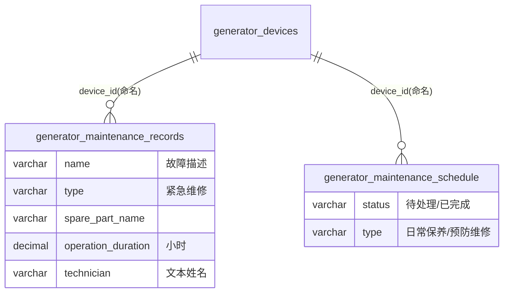

# 维修保养模块 · fuadmin 数据字典
> 域: 03-质量技术域 | 表数: 2 | 用途: Agent基础文件 | 生成: 2026-07-23

# maintenance-维修保养 · 模块概述

小型维保记录模块：maintenance_records 登记紧急维修（含备件更换与前后照片），maintenance_schedule 登记保养计划（日常保养/预防维修，待处理/已完成）。数据量极小（3+9 条），且与 equipment 模块的 maintenance_records（1377 条 BYDH 单号保养记录）语义重叠——判断本模块为早期/试点表，现役维保主力在 equipment 模块，统计请勿使用本模块以免漏数。

# maintenance-维修保养 · 上岗指南

## 2.1 核心实体

| 表 | 一句话定义 |
|---|---|
| generator_maintenance_records | 紧急维修记录（备件/技师/耗时/前后照片，仅3条，疑试点） |
| generator_maintenance_schedule | 保养计划（日常保养/预防维修，9条） |

## 2.2 业务流

计划登记（schedule，status=待处理）→ 执行 → status=已完成；紧急维修直接登 records（type=紧急维修，记录备件 spare_part_* 与技师）。

## 2.3 查询场景

```sql
-- 待处理保养计划
SELECT s.date_time, d.internal_code, s.type, s.description
FROM generator_maintenance_schedule s LEFT JOIN generator_devices d ON d.id=s.device_id
WHERE s.status='待处理';
```

## 2.4 避坑提示

- ⚠️ **数据量极小且与 equipment 模块重叠**：现役保养数据在 generator_equipment_maintenance_records（BYDH 单号），本模块疑为早期试点残留[推断-高]，任何统计勿用本模块。
- ⚠️ technician 为纯文本姓名无 FK。
- ⚠️ before_img/after_img 为静态文件路径（/static/YYYYMMDD/...）。

## 3 数据字典

### generator_maintenance_records（约 3 行）
业务定义: 紧急维修记录（备件/技师/耗时/前后照片，数据量极小疑试点） ｜ 表注释: -

| 字段 | 类型 | 可空 | 键 | 原始注释 | 推断语义 | 置信度 |
|---|---|---|---|---|---|---|
| id | bigint | N | PRI | - | 主键ID | high |
| remark | varchar(255) | Y | - | - | 备注 | high |
| modifier | varchar(255) | Y | - | - | 最后修改人姓名 | high |
| belong_dept | int | Y | - | - | 所属部门ID | mid |
| update_datetime | datetime(6) | Y | - | - | 最后更新时间 | high |
| create_datetime | datetime(6) | Y | - | - | 创建时间 | high |
| sort | int | Y | - | - | 排序号 | high |
| remarks | longtext | Y | - | - | 待确认 | low |
| duration | longtext | Y | - | - | 待确认 | low |
| date_time | datetime(6) | Y | - | - | 时间[推断] | high |
| after_img | varchar(255) | Y | - | - | 文本字段[推断-待确认] | low |
| before_img | varchar(255) | Y | - | - | 文本字段[推断-待确认] | low |
| spare_part_number | int | Y | - | - | 编号/代码[推断] | mid |
| spare_part_model | varchar(255) | Y | - | - | 规格/型号[推断] | mid |
| spare_part_name | varchar(255) | Y | - | - | 名称[推断] | high |
| operation_duration | decimal(13,1) | Y | - | - | 数值（小数）[推断-待确认] | low |
| technician | varchar(255) | Y | - | - | 文本字段[推断-待确认] | low |
| type | varchar(255) | Y | - | - | 类型[推断] | mid |
| name | varchar(255) | Y | - | - | 名称[推断] | high |
| creator_id | bigint | Y | MUL | - | 创建人ID → system_users.id | high |
| device_id | bigint | Y | MUL | - | 关联ID → generator_devices.id[推断] | mid |

### generator_maintenance_schedule（约 9 行）
业务定义: 设备保养计划（日常保养/预防维修，待处理/已完成状态） ｜ 表注释: -

| 字段 | 类型 | 可空 | 键 | 原始注释 | 推断语义 | 置信度 |
|---|---|---|---|---|---|---|
| id | bigint | N | PRI | - | 主键ID | high |
| remark | varchar(255) | Y | - | - | 备注 | high |
| modifier | varchar(255) | Y | - | - | 最后修改人姓名 | high |
| belong_dept | int | Y | - | - | 所属部门ID | mid |
| update_datetime | datetime(6) | Y | - | - | 最后更新时间 | high |
| create_datetime | datetime(6) | Y | - | - | 创建时间 | high |
| sort | int | Y | - | - | 排序号 | high |
| status | varchar(255) | Y | - | - | 状态（枚举值待确认）[推断] | mid |
| description | longtext | Y | - | - | 描述[推断] | mid |
| type | varchar(255) | Y | - | - | 类型[推断] | mid |
| date_time | datetime(6) | Y | - | - | 时间[推断] | high |
| creator_id | bigint | Y | MUL | - | 创建人ID → system_users.id | high |
| device_id | bigint | Y | MUL | - | 关联ID → generator_devices.id[推断] | mid |

## 4 模块ER图


依据：两表 device_id 命名+索引（高）。与 equipment_maintenance_records 重叠关系见概述。

## 5 跨模块接口

| 本模块表.字段 | →目标模块.表.字段 | 依据 | 置信度 |
|---|---|---|---|
| generator_maintenance_records.device_id | →device-设备装置.generator_devices.id | naming | high |
| generator_maintenance_schedule.device_id | →device-设备装置.generator_devices.id | naming | high |
| generator_maintenance_records.creator_id | →system-用户权限.system_users.id | naming | high |
| （语义重叠）generator_maintenance_records | ≈equipment-设备.generator_equipment_maintenance_records | sample | mid |

## 6 字段备注改进建议

（本模块为小型/过渡性模块，业务语义与归属建议见同域《零散模块总览》或域内相关主模块文档）

## 相关页面
- [[fuadmin数据字典总览]]
- [[产品模块-fuadmin数据字典]]
- [[刀具模块-fuadmin数据字典]]
- [[工具工装模块-fuadmin数据字典]]
- [[工艺技术模块-fuadmin数据字典]]
- [[工装夹具模块-fuadmin数据字典]]
- [[测量计量模块-fuadmin数据字典]]
- [[设备模块-fuadmin数据字典]]
- [[设备装置模块-fuadmin数据字典]]
- [[质量检验模块-fuadmin数据字典]]
