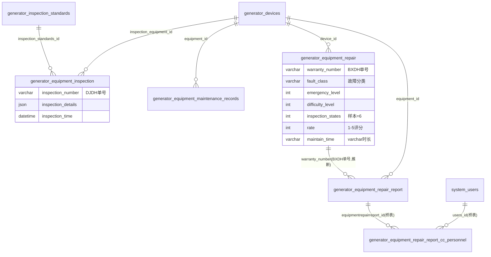

# 设备模块 · fuadmin 数据字典
> 域: 03-质量技术域 | 表数: 5 | 用途: Agent基础文件 | 生成: 2026-07-23

# equipment-设备 · 模块概述

设备模块覆盖设备全生命周期的执行记录：点检（DJDH 单号，1.3万条）、保养（BYDH 单号，1377条，含下次保养日期）、维修工单（BXDH 单号，5896条，含故障分类/难度/紧急度/评分与完整流转 history JSON）、维修报告（完工确认，718条）及抄送人桥表。所有记录锚定 generator_devices 设备台账（device-设备装置模块）与 inspection_standards 检验标准，是 OEE 损失分析、MTBF/MTTR 统计与 IATF 设备管理条款的证据数据源。

# equipment-设备 · 上岗指南

## 2.1 核心实体（TOP7）

| 表 | 一句话定义 |
|---|---|
| generator_equipment_repair | 设备维修工单（BXDH单号，故障分类/难度/紧急度/评分，5896条核心） |
| generator_equipment_inspection | 设备点检记录（DJDH单号，details JSON，1.3万条） |
| generator_equipment_maintenance_records | 保养记录（BYDH单号，含下次保养日期，1377条） |
| generator_equipment_repair_report | 维修报告/完工单（处理说明+质量确认，718条） |
| generator_equipment_repair_report_cc_personnel | 维修报告抄送人桥表（M2M，1934条） |
| → generator_devices | 【外部锚点】设备台账（device模块，internal_code如GH-J-004） |
| → generator_inspection_standards | 【外部锚点】点检标准（devices.type_id 硬FK） |

## 2.2 核心业务流

1. 计划性维护：保养记录（BYDH）登记 maintenance_date 与 next_maintenance_date，形成保养周期；点检（DJDH）按 inspection_standards 标准执行，details JSON 存逐项结果。
2. 故障报修：repair 工单（BXDH）登记 problem_description/fault_class（样本：水压异常）/emergency_level/difficulty_level，指定 direct_writer（直接处理人）与 cc_personnel（抄送）。
3. 维修执行：maintain_time/order_time 记录耗时（varchar 时长如"7 days, 8:21:31"），cooperate JSON 存协同人员。
4. 完工验收：repair_report 填写处理说明（"维修30分钟"）、problem_confirmation（有故障/无故障），quality_id 关联质量确认人，rate 为报修人评分（1-5）。
5. 状态闭环：inspection_states 推进（样本=6，已完成），is_active 标记工单激活状态。

## 2.3 典型查询场景

**场景1：设备维修工单台账（MTTR/MTBF 基础）**
```sql
SELECT r.warranty_number, d.internal_code, r.fault_class, r.repair_time, r.maintain_time, r.rate
FROM generator_equipment_repair r
JOIN generator_devices d ON d.id = r.device_id
WHERE r.repair_time >= '2026-01-01' ORDER BY r.repair_time DESC;
```

**场景2：故障分类 TOP（预防性维护输入）**
```sql
SELECT fault_class, COUNT(*) cnt, AVG(rate) avg_score
FROM generator_equipment_repair
WHERE fault_class IS NOT NULL AND repair_time >= DATE_SUB(CURDATE(), INTERVAL 90 DAY)
GROUP BY fault_class ORDER BY cnt DESC LIMIT 10;
```

**场景3：保养到期预警**
```sql
SELECT m.maintenance_order_number, m.equipment_id, m.next_maintenance_date, m.states
FROM generator_equipment_maintenance_records m
WHERE m.next_maintenance_date <= DATE_ADD(CURDATE(), INTERVAL 7 DAY)
  AND m.states <> 2 ORDER BY m.next_maintenance_date;
```

**场景4：点检执行率（按标准）**
```sql
SELECT i.inspection_standards_id, COUNT(*) 点检次数, COUNT(DISTINCT i.inspection_equipment_id) 覆盖设备
FROM generator_equipment_inspection i
WHERE i.inspection_time >= DATE_SUB(CURDATE(), INTERVAL 30 DAY)
GROUP BY i.inspection_standards_id;
```

**场景5：重复性故障筛查**
```sql
SELECT device_id, COUNT(*) cnt FROM generator_equipment_repair
WHERE repetition = 1 AND repair_time >= '2026-01-01'
GROUP BY device_id HAVING cnt >= 2 ORDER BY cnt DESC;
```

## 2.4 避坑提示

- ⚠️ **两套保养/维修表并存**：本模块 equipment_maintenance_records（1377条）与 maintenance 模块 maintenance_records（3条）语义重叠——前者为现役主力，后者疑为旧表/试验表[待确认]，统计只用本模块。
- ⚠️ 单号前缀即类型：DJDH=点检、BYDH=保养、BXDH=维修（拼音首字母），可按前缀路由。
- ⚠️ `maintain_time`/`order_time`/`stop_time` 是 varchar 存时长（"0:01:44"或"7 days, 8:21:31"），聚合需自行解析——不可直接 SUM。
- ⚠️ `inspection_states` 在 repair 表是 int（样本=6）、在 repair_report 表是 varchar（样本="已完成"）——同名字段两表类型不同[脏数据特征]。
- ⚠️ `rate` 在 repair 表为 int（1-5评分）、在 repair_report 为 varchar——同上注意。
- ⚠️ cc_personnel 字段在 repair 表是 varchar 存列表（"['21931 某某']"——Python repr 风格非标准 JSON！），解析需 ast.literal_eval 而非 json.loads；而抄送人桥表是规范 M2M，优先用桥表。
- ⚠️ details/history/fault_detail 等 JSON 大字段勿在列表查询中 SELECT *，按需提取。

## 3 数据字典

### generator_equipment_inspection（约 12993 行）
业务定义: 设备点检记录（DJDH单号，按点检标准逐项执行，details JSON存结果） ｜ 表注释: -

| 字段 | 类型 | 可空 | 键 | 原始注释 | 推断语义 | 置信度 |
|---|---|---|---|---|---|---|
| id | bigint | N | PRI | - | 主键ID | high |
| remark | varchar(255) | Y | - | - | 备注 | high |
| modifier | varchar(255) | Y | - | - | 最后修改人姓名 | high |
| belong_dept | int | Y | - | - | 所属部门ID | mid |
| update_datetime | datetime(6) | Y | - | - | 最后更新时间 | high |
| create_datetime | datetime(6) | Y | - | - | 创建时间 | high |
| sort | int | Y | - | - | 排序号 | high |
| inspection_details | json | Y | - | - | 规格/型号[推断] | mid |
| inspection_time | datetime(6) | Y | - | - | 时间[推断] | high |
| inspection_number | varchar(50) | Y | - | - | 编号/代码[推断] | mid |
| creator_id | bigint | Y | MUL | - | 创建人ID → system_users.id | high |
| inspection_equipment_id | bigint | Y | MUL | - | 关联ID（目标表待确认）[推断] | low |
| inspection_personnel_id | bigint | Y | MUL | - | 关联ID（目标表待确认）[推断] | low |
| inspection_standards_id | bigint | Y | MUL | - | 关联ID → generator_inspection_standards.id[推断] | mid |

### generator_equipment_maintenance_records（约 1377 行）
业务定义: 设备保养记录（BYDH单号，含本次/下次保养日期，周期维护依据） ｜ 表注释: -

| 字段 | 类型 | 可空 | 键 | 原始注释 | 推断语义 | 置信度 |
|---|---|---|---|---|---|---|
| id | bigint | N | PRI | - | 主键ID | high |
| remark | varchar(255) | Y | - | - | 备注 | high |
| modifier | varchar(255) | Y | - | - | 最后修改人姓名 | high |
| belong_dept | int | Y | - | - | 所属部门ID | mid |
| update_datetime | datetime(6) | Y | - | - | 最后更新时间 | high |
| create_datetime | datetime(6) | Y | - | - | 创建时间 | high |
| sort | int | Y | - | - | 排序号 | high |
| remarks | varchar(255) | Y | - | - | 文本字段[推断-待确认] | low |
| related_photos | varchar(255) | Y | - | - | 图片路径[推断] | mid |
| maintenance_details | json | Y | - | - | 待确认 | low |
| next_maintenance_date | date | Y | - | - | 日期[推断] | high |
| maintenance_date | date | Y | - | - | 日期[推断] | high |
| operator_id | bigint | Y | MUL | - | 关联ID（目标表待确认）[推断] | low |
| equipment_id | bigint | Y | MUL | - | 关联ID（目标表待确认）[推断] | low |
| maintenance_order_number | varchar(255) | Y | - | - | 编号/代码[推断] | mid |
| creator_id | bigint | Y | MUL | - | 创建人ID → system_users.id | high |
| last_maintenance_date | date | Y | - | - | 日期[推断] | high |
| maintenance_type | varchar(255) | Y | - | - | 类型[推断] | mid |
| states | int | Y | - | - | 数值字段[推断-待确认] | low |

### generator_equipment_repair（约 5896 行）
业务定义: 设备维修工单（BXDH单号，故障分类/难度/紧急度/评分/流转history） ｜ 表注释: -

| 字段 | 类型 | 可空 | 键 | 原始注释 | 推断语义 | 置信度 |
|---|---|---|---|---|---|---|
| id | bigint | N | PRI | - | 主键ID | high |
| remark | varchar(255) | Y | - | - | 备注 | high |
| modifier | varchar(255) | Y | - | - | 最后修改人姓名 | high |
| belong_dept | int | Y | - | - | 所属部门ID | mid |
| update_datetime | datetime(6) | Y | - | - | 最后更新时间 | high |
| create_datetime | datetime(6) | Y | - | - | 创建时间 | high |
| sort | int | Y | - | - | 排序号 | high |
| warranty_number | varchar(40) | Y | - | - | 编号/代码[推断] | mid |
| evaluate | varchar(255) | Y | - | - | 文本字段[推断-待确认] | low |
| problem_description | varchar(255) | Y | - | - | 描述[推断] | mid |
| cc_personnel | varchar(255) | Y | - | - | 文本字段[推断-待确认] | low |
| direct_time | datetime(6) | Y | - | - | 时间[推断] | high |
| repair_time | datetime(6) | Y | - | - | 时间[推断] | high |
| rate_time | datetime(6) | Y | - | - | 时间[推断] | high |
| malfunction | tinyint(1) | Y | - | - | 数值字段[推断-待确认] | low |
| repetition | tinyint(1) | Y | - | - | 数值字段[推断-待确认] | low |
| stop_time | varchar(20) | Y | - | - | 时间[推断] | high |
| maintain_time | varchar(20) | Y | - | - | 时间[推断] | high |
| order_time | varchar(20) | Y | - | - | 时间[推断] | high |
| inspection_states | int | Y | - | - | 规格/型号[推断] | mid |
| difficulty_level | int | Y | - | - | 等级[推断] | mid |
| emergency_level | int | Y | - | - | 等级[推断] | mid |
| is_active | int | Y | - | - | 标志位（布尔）[推断] | mid |
| rate | int | Y | - | - | 比率/百分比[推断] | high |
| mountings | json | Y | - | - | 待确认 | low |
| cooperate | json | Y | - | - | 比率/百分比[推断] | high |
| history | json | Y | - | - | 待确认 | low |
| fault_detail | json | Y | - | - | 待确认 | low |
| creator_id | bigint | Y | MUL | - | 创建人ID → system_users.id | high |
| device_id | bigint | Y | MUL | - | 关联ID → generator_devices.id[推断] | mid |
| direct_writer_id | bigint | Y | MUL | - | 关联ID（目标表待确认）[推断] | low |
| repair_applicant_id | bigint | Y | MUL | - | 关联ID（目标表待确认）[推断] | low |
| img | json | Y | - | - | 待确认 | low |
| message | json | Y | - | - | 年龄[推断] | high |
| cnc_personnel | varchar(40) | Y | - | - | 文本字段[推断-待确认] | low |
| fault_class | varchar(40) | Y | - | - | 文本字段[推断-待确认] | low |
| zl_personnel | varchar(255) | Y | - | - | 文本字段[推断-待确认] | low |
| after_img | json | Y | - | - | 待确认 | low |

### generator_equipment_repair_report（约 718 行）
业务定义: 设备维修报告（完工确认单，处理说明+质量确认+报修人评分） ｜ 表注释: -

| 字段 | 类型 | 可空 | 键 | 原始注释 | 推断语义 | 置信度 |
|---|---|---|---|---|---|---|
| id | bigint | N | PRI | - | 主键ID | high |
| remark | varchar(255) | Y | - | - | 备注 | high |
| modifier | varchar(255) | Y | - | - | 最后修改人姓名 | high |
| belong_dept | int | Y | - | - | 所属部门ID | mid |
| update_datetime | datetime(6) | Y | - | - | 最后更新时间 | high |
| create_datetime | datetime(6) | Y | - | - | 创建时间 | high |
| sort | int | Y | - | - | 排序号 | high |
| explanation_of_handling_situation | longtext | Y | - | - | 待确认 | low |
| fault_details | json | Y | - | - | 待确认 | low |
| repair_completion_date | datetime(6) | Y | - | - | 日期[推断] | high |
| problem_confirmation | varchar(255) | Y | - | - | 文本字段[推断-待确认] | low |
| maintenance_personnel_id | bigint | Y | MUL | - | 关联ID（目标表待确认）[推断] | low |
| related_photos | varchar(255) | Y | - | - | 图片路径[推断] | mid |
| problem_description | longtext | Y | - | - | 描述[推断] | mid |
| equipment_id | bigint | Y | MUL | - | 关联ID（目标表待确认）[推断] | low |
| repair_time | varchar(255) | Y | - | - | 时间[推断] | high |
| repair_applicant_id | bigint | Y | MUL | - | 关联ID（目标表待确认）[推断] | low |
| warranty_number | varchar(255) | Y | - | - | 编号/代码[推断] | mid |
| creator_id | bigint | Y | MUL | - | 创建人ID → system_users.id | high |
| inspection_states | varchar(255) | Y | - | - | 规格/型号[推断] | mid |
| history | varchar(1000) | Y | - | - | 文本字段[推断-待确认] | low |
| quality_id | bigint | Y | MUL | - | 关联ID（目标表待确认）[推断] | low |
| rate | varchar(255) | Y | - | - | 比率/百分比[推断] | high |

### generator_equipment_repair_report_cc_personnel（约 1934 行）
业务定义: 维修报告抄送人桥表（报告×人员M2M） ｜ 表注释: -

| 字段 | 类型 | 可空 | 键 | 原始注释 | 推断语义 | 置信度 |
|---|---|---|---|---|---|---|
| id | bigint | N | PRI | - | 主键ID | high |
| equipmentrepairreport_id | bigint | N | MUL | - | 关联ID（目标表待确认）[推断] | low |
| users_id | bigint | N | MUL | - | 关联ID → system_users.id[推断] | mid |

## 4 模块ER图



证据说明：→devices 的关联均有索引（高置信）；repair→report 按同号 warranty_number 推断（中）；桥表双索引唯一（高）。

## 5 跨模块接口

| 本模块表.字段 | →目标模块.表.字段 | 依据 | 置信度 |
|---|---|---|---|
| generator_equipment_inspection.inspection_equipment_id | →device-设备装置.generator_devices.id | naming+idx | high |
| generator_equipment_inspection.inspection_standards_id | →inspection-质量检验.generator_inspection_standards.id | naming+idx | high |
| generator_equipment_inspection.inspection_personnel_id | →system-用户权限.system_users.id | naming+idx | high |
| generator_equipment_maintenance_records.equipment_id | →device-设备装置.generator_devices.id | naming+idx | high |
| generator_equipment_maintenance_records.operator_id | →system-用户权限.system_users.id | naming+idx | high |
| generator_equipment_repair.device_id | →device-设备装置.generator_devices.id | naming+idx | high |
| generator_equipment_repair.repair_applicant_id | →system-用户权限.system_users.id | naming+idx | high |
| generator_equipment_repair.direct_writer_id | →system-用户权限.system_users.id | naming+idx | high |
| generator_equipment_repair_report.equipment_id | →device-设备装置.generator_devices.id | naming+idx | high |
| generator_equipment_repair_report.quality_id | →system-用户权限.system_users.id(质量确认人) | naming+idx | mid |
| generator_equipment_repair_report_cc_personnel.users_id | →system-用户权限.system_users.id | naming+idx | high |
| generator_equipment_repair.warranty_number | →本模块.generator_equipment_repair_report.warranty_number | sample(同BXDH单号) | mid |

## 6 字段备注改进建议

（本模块为小型/过渡性模块，业务语义与归属建议见同域《零散模块总览》或域内相关主模块文档）

## 相关页面
- [[fuadmin数据字典总览]]
- [[产品模块-fuadmin数据字典]]
- [[刀具模块-fuadmin数据字典]]
- [[工具工装模块-fuadmin数据字典]]
- [[工艺技术模块-fuadmin数据字典]]
- [[工装夹具模块-fuadmin数据字典]]
- [[测量计量模块-fuadmin数据字典]]
- [[维修保养模块-fuadmin数据字典]]
- [[设备装置模块-fuadmin数据字典]]
- [[质量检验模块-fuadmin数据字典]]
