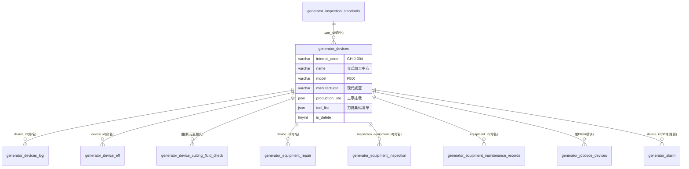

# 设备装置模块 · fuadmin 数据字典
> 域: 03-质量技术域 | 表数: 4 | 用途: Agent基础文件 | 生成: 2026-07-23

# device-设备装置 · 模块概述

设备装置模块是设备资产的"户口本"：generator_devices 台账主表登记 543 台设备的编码（internal_code 如 GH-J-004）、型号、制造商、产线工序挂载（JSON）与刀库配置（tool_list 条码级清单），并通过 type_id 硬外键绑定 inspection_standards 点检标准。配套状态日志、切削液检查与试验性效率表。所有设备执行记录（点检/保养/维修，见 equipment 模块）均锚定本表 id——"台账在本模块，执行在 equipment"。

# device-设备装置 · 上岗指南

## 2.1 核心实体

| 表 | 一句话定义 |
|---|---|
| generator_devices | 设备台账主表（543台，internal_code 编码，type_id→检验标准硬FK） |
| generator_devices_log | 设备状态日志（运行/暂停 按小时段，11条，疑似试点） |
| generator_device_eff | 设备效率记录（efficiency/downtime/runtime，仅2行，试验性） |
| generator_device_cutting_fluid_check | 切削液检查记录（inspection_content JSON，344条） |

## 2.2 核心业务流

1. 建账：设备入库登记 internal_code（如 GH-J-004=广汇-机加-004）、serial_code 出厂编号、model/manufacturer/到货日期、产线挂载（production_line JSON 挂工序）、刀库（tool_config + tool_list 条码级刀具清单）。
2. 定标：type_id → inspection_standards（硬FK）确定该设备类型适用的点检标准。
3. 执行：点检（equipment_inspection）、保养、维修全锚定本表 id。
4. 状态跟踪：devices_log 记录运行/暂停时段（样本按小时）；切削液定期检查。
5. 软删除：is_delete=1 标记退役，查询需过滤。

## 2.3 典型查询场景

**场景1：设备台账清单（按产线）**
```sql
SELECT internal_code, name, model, manufacturer, status, production_line
FROM generator_devices WHERE is_delete=0 AND dept_id=4 ORDER BY internal_code;
```

**场景2：设备刀具清单展开（与刀库核对）**
```sql
SELECT internal_code, JSON_EXTRACT(tool_list, '$[*].bar_code') AS 刀具条码
FROM generator_devices WHERE id=1;
```

**场景3：超期未保养设备（配合 equipment 模块）**
```sql
SELECT d.internal_code, d.last_maintenance
FROM generator_devices d
WHERE d.is_delete=0 AND (d.last_maintenance IS NULL OR d.last_maintenance < DATE_SUB(CURDATE(), INTERVAL 180 DAY));
```

**场景4：按制造商统计设备分布（备件/维保谈判依据）**
```sql
SELECT manufacturer, COUNT(*) 台数, GROUP_CONCAT(DISTINCT model) 型号
FROM generator_devices WHERE is_delete=0 GROUP BY manufacturer ORDER BY 台数 DESC;
```

## 2.4 避坑提示

- ⚠️ `internal_code` 编码规则"站点-类别-序号"（GH-J-004）[推断-高]，跨模块对碰（如 newscheduling.device_code）按此字段，勿用 name。
- ⚠️ `production_line`/`tool_list`/`history` 为 JSON，history 内存修改人记录（unicode 转义中文）。
- ⚠️ 样本 create_datetime 出现 "0000-00-00"——老数据迁移遗留，时间过滤会报错，需 NULLIF 处理。
- ⚠️ `device_eff` 仅 2 行（2024-04 试验数据），**不可用于效率统计**；设备效率应走 newscheduling 报工+宕机口径。
- ⚠️ 存在 device（本模块）与 equipment（执行记录模块）命名易混：台账在本模块，点检/保养/维修在 equipment 模块。
- ⚠️ `concentration_range` JSON 疑为切削液浓度上下限配置[推断-中]，与 cutting_fluid_check 联动。

## 3 数据字典

### generator_device_cutting_fluid_check（约 344 行）
业务定义: 切削液检查记录（JSON检查项，344条） ｜ 表注释: -

| 字段 | 类型 | 可空 | 键 | 原始注释 | 推断语义 | 置信度 |
|---|---|---|---|---|---|---|
| id | bigint | N | PRI | - | 主键ID | high |
| remark | varchar(255) | Y | - | - | 备注 | high |
| modifier | varchar(255) | Y | - | - | 最后修改人姓名 | high |
| belong_dept | int | Y | - | - | 所属部门ID | mid |
| update_datetime | datetime(6) | Y | - | - | 最后更新时间 | high |
| create_datetime | datetime(6) | Y | - | - | 创建时间 | high |
| sort | int | Y | - | - | 排序号 | high |
| inspection_content | json | Y | - | - | 内容[推断] | mid |
| creator_id | bigint | Y | MUL | - | 创建人ID → system_users.id | high |
| inspector_id | bigint | Y | MUL | - | 关联ID（目标表待确认）[推断] | low |

### generator_device_eff（约 2 行）
业务定义: 设备效率记录表（efficiency/停机/运行时长，仅2行试验性未启用） ｜ 表注释: -

| 字段 | 类型 | 可空 | 键 | 原始注释 | 推断语义 | 置信度 |
|---|---|---|---|---|---|---|
| id | bigint | N | PRI | - | 主键ID | high |
| remark | varchar(255) | Y | - | - | 备注 | high |
| modifier | varchar(255) | Y | - | - | 最后修改人姓名 | high |
| belong_dept | int | Y | - | - | 所属部门ID | mid |
| update_datetime | datetime(6) | Y | - | - | 最后更新时间 | high |
| create_datetime | datetime(6) | Y | - | - | 创建时间 | high |
| sort | int | Y | - | - | 排序号 | high |
| recommendations | longtext | Y | - | - | 待确认 | low |
| date_time | date | Y | - | - | 时间[推断] | high |
| production_count | int | Y | - | - | 数量[推断] | high |
| efficiency | decimal(13,2) | Y | - | - | 数值（小数）[推断-待确认] | low |
| downtime | decimal(13,1) | Y | - | - | 时间[推断] | high |
| runtime | decimal(13,1) | Y | - | - | 时间[推断] | high |
| creator_id | bigint | Y | MUL | - | 创建人ID → system_users.id | high |
| device_id | bigint | Y | MUL | - | 关联ID → generator_devices.id[推断] | mid |

### generator_devices（约 543 行）
业务定义: 设备台账主表（543台：编码/型号/产线挂载/刀库配置，type_id硬FK→检验标准） ｜ 表注释: -

| 字段 | 类型 | 可空 | 键 | 原始注释 | 推断语义 | 置信度 |
|---|---|---|---|---|---|---|
| id | bigint | N | PRI | - | 主键ID | high |
| remark | varchar(255) | Y | - | - | 备注 | high |
| modifier | varchar(255) | Y | - | - | 最后修改人姓名 | high |
| belong_dept | int | Y | - | - | 所属部门ID | mid |
| update_datetime | datetime(6) | Y | - | - | 最后更新时间 | high |
| create_datetime | datetime(6) | Y | - | - | 创建时间 | high |
| sort | int | Y | - | - | 排序号 | high |
| status | varchar(255) | Y | - | - | 状态（枚举值待确认）[推断] | mid |
| last_maintenance | date | Y | - | - | 日期时间[推断] | mid |
| ownership | varchar(255) | Y | - | - | IP地址[推断] | high |
| manager | varchar(255) | Y | - | - | 文本字段[推断-待确认] | low |
| production_line | varchar(255) | Y | - | - | 产线[推断] | mid |
| four_axis_config | varchar(255) | Y | - | - | 文本字段[推断-待确认] | low |
| tool_config | varchar(255) | Y | - | - | 刀具/工具[推断] | mid |
| power_parameters | varchar(255) | Y | - | - | 功率/电源[推断] | mid |
| manufacturer | varchar(255) | Y | - | - | 文本字段[推断-待确认] | low |
| manufacturing_date | date | Y | - | - | 日期[推断] | high |
| arrival_date | date | Y | - | - | 日期[推断] | high |
| type_id | bigint | Y | MUL | - | 关联ID → django_content_type.id[推断] | mid |
| internal_code | varchar(255) | Y | MUL | - | 编号/代码[推断] | mid |
| serial_code | varchar(255) | Y | - | - | 单号/编号[推断] | high |
| model | varchar(255) | Y | - | - | 规格/型号[推断] | mid |
| name | varchar(255) | Y | - | - | 名称[推断] | high |
| creator_id | bigint | Y | MUL | - | 创建人ID → system_users.id | high |
| dept_id | bigint | Y | MUL | - | 关联ID → system_dept.id[推断] | mid |
| is_delete | tinyint(1) | N | - | - | 逻辑删除标志 | high |
| history | json | Y | - | - | 待确认 | low |
| tool_list | json | Y | - | - | 刀具/工具[推断] | mid |
| concentration_range | json | Y | - | - | 待确认 | low |

关联: type_id → generator_inspection_standards.id

### generator_devices_log（约 11 行）
业务定义: 设备状态日志（运行/暂停时段记录，试点数据） ｜ 表注释: -

| 字段 | 类型 | 可空 | 键 | 原始注释 | 推断语义 | 置信度 |
|---|---|---|---|---|---|---|
| id | bigint | N | PRI | - | 主键ID | high |
| remark | varchar(255) | Y | - | - | 备注 | high |
| modifier | varchar(255) | Y | - | - | 最后修改人姓名 | high |
| belong_dept | int | Y | - | - | 所属部门ID | mid |
| update_datetime | datetime(6) | Y | - | - | 最后更新时间 | high |
| create_datetime | datetime(6) | Y | - | - | 创建时间 | high |
| sort | int | Y | - | - | 排序号 | high |
| description | longtext | Y | - | - | 描述[推断] | mid |
| status | varchar(255) | Y | - | - | 状态（枚举值待确认）[推断] | mid |
| date_time | datetime(6) | Y | - | - | 时间[推断] | high |
| device_id | bigint | Y | MUL | - | 关联ID → generator_devices.id[推断] | mid |
| creator_id | bigint | Y | MUL | - | 创建人ID → system_users.id | high |

## 4 模块ER图



依据：type_id 与 jobcode_devices 为硬外键（高）；repair/inspection/maintenance/alarm 锚定为命名+索引推断（高）；log/eff 为命名推断（高）；cutting_fluid_check 无直接 device 列，经 inspector/内容推断（低）。

## 5 跨模块接口

| 本模块表.字段 | →目标模块.表.字段 | 依据 | 置信度 |
|---|---|---|---|
| generator_devices.type_id | →inspection-质量检验.generator_inspection_standards.id | fk | high |
| generator_devices.id | →equipment-设备.generator_equipment_repair.device_id | naming | high |
| generator_devices.id | →equipment-设备.generator_equipment_inspection.inspection_equipment_id | naming | high |
| generator_devices.id | →equipment-设备.generator_equipment_maintenance_records.equipment_id | naming | high |
| generator_devices.id | →hr-人力能力.generator_jobcode_devices(FK) | fk | high |
| generator_devices.internal_code | →02域.generator_newscheduling.device_code | naming | mid |
| generator_devices.id | →06域.generator_alarm.device_id | naming | mid |
| generator_devices.dept_id | →system-用户权限.system_dept.id | naming | mid |

## 6 字段备注改进建议

（待 enrich 补充）

## 相关页面
- [[fuadmin数据字典总览]]
- [[产品模块-fuadmin数据字典]]
- [[刀具模块-fuadmin数据字典]]
- [[工具工装模块-fuadmin数据字典]]
- [[工艺技术模块-fuadmin数据字典]]
- [[工装夹具模块-fuadmin数据字典]]
- [[测量计量模块-fuadmin数据字典]]
- [[维修保养模块-fuadmin数据字典]]
- [[设备模块-fuadmin数据字典]]
- [[质量检验模块-fuadmin数据字典]]
