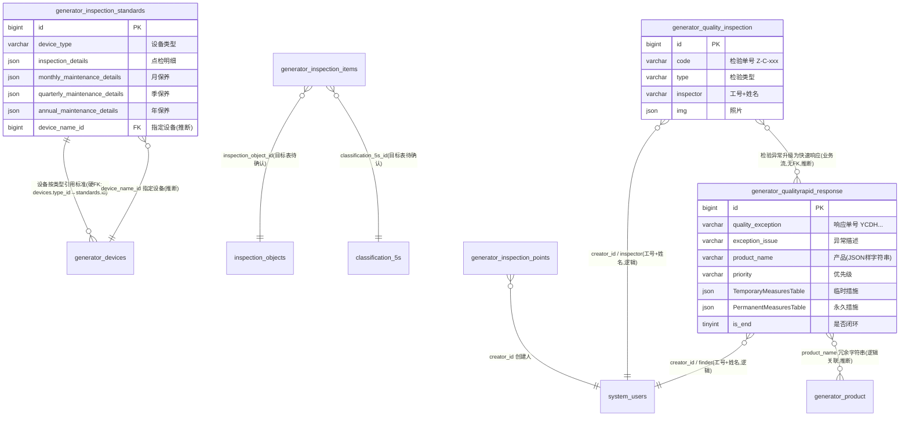

# 质量检验模块 · fuadmin 数据字典
> 域: 03-质量技术域 | 表数: 5 | 用途: Agent基础文件 | 生成: 2026-07-23

# inspection-质量检验 · 概述

inspection 模块是质量技术域的**检验标准 + 检验记录 + 质量快速响应**三件套，共 5 表。`generator_inspection_standards`（74行）按设备类型定义点检与月/季/年周期保养标准（JSON 明细），是设备模块 `generator_devices.type_id` 的硬外键目标；`generator_inspection_items`（7行）+ `generator_inspection_points`（21行）构成 5S 现场巡检的检查项与车间点位（带点位码 code）。`generator_quality_inspection`（15.8万行）是检验记录主表，按 code（如 Z-C-016）+ type + inspector（工号+姓名）记录检验并附照片 JSON。`generator_qualityrapid_response`（189行）是 IATF16949 风格的质量异常快速响应单：异常描述→临时措施→原因分析→永久措施→标准化，用 `is_end` 标记闭环，`quality_exception` 为单号（YCDH+日期+序号）。

# inspection-质量检验 · 上岗指南

## 2.1 核心实体表（TOP5）

| 表 | 一句话定义 |
|---|---|
| generator_quality_inspection | 检验记录主表（15.8万行）：code 检验单号、type 检验类型、inspector“工号 姓名”、img 照片JSON |
| generator_qualityrapid_response | 质量快速响应单（189行）：异常→临时措施→原因分析→永久措施→标准化，is_end 闭环 |
| generator_inspection_standards | 设备点检/保养标准（74行）：device_type + inspection_details 等 4 个 JSON 明细 |
| generator_inspection_items | 5S 检查项（7行）：inspection_item 检查内容 + inspection_standards 判定标准 |
| generator_inspection_points | 车间巡检点位（21行）：area 区域 + dot 点位 + code 点位码 |

## 2.2 核心业务流

1. **标准制定**：按设备类型在 `generator_inspection_standards` 配置点检明细（inspection_details JSON）与月/季/年保养明细；`generator_devices.type_id → generator_inspection_standards.id` 硬外键引用，设备按类型继承标准。
2. **5S 巡检配置**：`generator_inspection_items` 定义“检查内容+判定标准”，挂 inspection_object_id（检查对象）与 classification_5s_id（整理/整顿等分类）；`generator_inspection_points` 布设车间点位（区域+点位+唯一 code，疑用于扫码巡检）。
3. **检验执行**：检验员在 `generator_quality_inspection` 生成记录——code（Z-C-016 规则：疑“质-成-序号”，待确认）、type、inspector 为“工号 姓名”拼接、img JSON 存缺陷照片、associated_infor 关联信息。
4. **异常升级**：发现批量/重大异常时开 `generator_qualityrapid_response` 快速响应单——登记 exception_issue、product_name、finder/find_time、priority（高/中级）、quality_exception 单号（YCDH20240904569406 = YCDH+日期+序号，推断）。
5. **8D 式闭环**：TemporaryMeasuresTable（临时措施JSON）→ CauseAnalysisTable（原因分析）→ PermanentMeasuresTable（永久措施JSON）→ StandardizationTable（标准化）；TemporaryTime/PermanentTime 记录完成期限，is_end=1 闭环，cc_send JSON 抄送相关人员。

## 2.3 典型查询场景

**场景1：未闭环的快速响应单（在办异常清单）**
```sql
SELECT id, quality_exception, exception_issue, product_name, priority, finder, find_time
FROM generator_qualityrapid_response
WHERE is_end = 0
ORDER BY find_time DESC;
```

**场景2：快速响应平均闭环周期（按问题类型）**
```sql
SELECT issue_type,
       COUNT(*) AS cnt,
       AVG(DATEDIFF(DATE(update_datetime), find_time)) AS avg_close_days
FROM generator_qualityrapid_response
WHERE is_end = 1
GROUP BY issue_type;
```

**场景3：高频异常产品 TOP10（近一年快速响应）**
```sql
SELECT product_name, COUNT(*) AS resp_cnt
FROM generator_qualityrapid_response
WHERE find_time >= DATE_SUB(CURDATE(), INTERVAL 1 YEAR)
GROUP BY product_name
ORDER BY resp_cnt DESC
LIMIT 10;
```

**场景4：检验记录按类型月度统计（检验工作量）**
```sql
SELECT DATE_FORMAT(create_datetime, '%Y-%m') AS ym, type, COUNT(*) AS cnt
FROM generator_quality_inspection
GROUP BY ym, type
ORDER BY ym DESC, cnt DESC;
```

**场景5：设备点检标准覆盖率（标准是否配齐保养周期）**
```sql
SELECT device_type,
       CASE WHEN inspection_details IS NOT NULL THEN 1 ELSE 0 END AS has_daily,
       CASE WHEN monthly_maintenance_details IS NOT NULL THEN 1 ELSE 0 END AS has_monthly,
       CASE WHEN annual_maintenance_details IS NOT NULL THEN 1 ELSE 0 END AS has_annual
FROM generator_inspection_standards;
```

**场景6：某车间区域的巡检点位清单**
```sql
SELECT area, dot, code
FROM generator_inspection_points
WHERE area = '生产车间（二）'
ORDER BY dot;
```

## 2.4 避坑指南

- **product_name 是 JSON 风格字符串**：快速响应单样本为 `['Alpha减震塔右']`，直接 LIKE 匹配要注意方括号与引号；如需精确匹配建议 `LIKE '%产品名%'`。
- **inspector/finder 是“工号 姓名”拼接**（如 `22376 杨琨`），关联员工表需 SUBSTRING_INDEX 拆工号，且无物理外键约束。
- **JSON 字段多**：img/picture/attachment/TemporaryMeasuresTable/PermanentMeasuresTable 均为 JSON 数组（图片为 /static/ 路径），MySQL 5.7 需用 JSON_EXTRACT 或按文本处理。
- **大表分页**：`generator_quality_inspection` 15.8 万行，统计查询务必带 create_datetime 范围；只有 creator_id 索引，按 inspector/type 查是全表扫。
- **inspection_object_id / classification_5s_id 的目标表不在本模块**（疑在框架表或其他定制，待确认），跨模块 JOIN 前先核实表名。
- **is_end 是 tinyint 布尔**：0=在办、1=闭环；issue_number 疑为同类问题序号（推断，待确认）。

## 3 数据字典

### generator_inspection_items（约 7 行）
业务定义: 5S现场检查项定义：检查内容+判定标准，挂检查对象与5S分类 ｜ 表注释: -

| 字段 | 类型 | 可空 | 键 | 原始注释 | 推断语义 | 置信度 |
|---|---|---|---|---|---|---|
| id | bigint | N | PRI | - | 主键ID | high |
| remark | varchar(255) | Y | - | - | 备注 | high |
| modifier | varchar(255) | Y | - | - | 最后修改人姓名 | high |
| belong_dept | int | Y | - | - | 所属部门ID | mid |
| update_datetime | datetime(6) | Y | - | - | 最后更新时间 | high |
| create_datetime | datetime(6) | Y | - | - | 创建时间 | high |
| sort | int | Y | - | - | 排序号 | high |
| inspection_standards | longtext | Y | - | - | 规格/型号[推断] | mid |
| inspection_item | longtext | Y | - | - | 规格/型号[推断] | mid |
| inspection_object_id | bigint | Y | MUL | - | 关联ID（目标表待确认）[推断] | low |
| classification_5s_id | bigint | Y | MUL | - | 关联ID（目标表待确认）[推断] | low |
| creator_id | bigint | Y | MUL | - | 创建人ID → system_users.id | high |

### generator_inspection_points（约 21 行）
业务定义: 车间现场巡检点位台账：区域+点位名称+点位编码 ｜ 表注释: -

| 字段 | 类型 | 可空 | 键 | 原始注释 | 推断语义 | 置信度 |
|---|---|---|---|---|---|---|
| id | bigint | N | PRI | - | 主键ID | high |
| remark | varchar(255) | Y | - | - | 备注 | high |
| modifier | varchar(255) | Y | - | - | 最后修改人姓名 | high |
| belong_dept | int | Y | - | - | 所属部门ID | mid |
| update_datetime | datetime(6) | Y | - | - | 最后更新时间 | high |
| create_datetime | datetime(6) | Y | - | - | 创建时间 | high |
| sort | int | Y | - | - | 排序号 | high |
| code | varchar(255) | Y | - | - | 编号/代码[推断] | mid |
| dot | varchar(20) | Y | - | - | 文本字段[推断-待确认] | low |
| area | varchar(20) | Y | - | - | 文本字段[推断-待确认] | low |
| creator_id | bigint | Y | MUL | - | 创建人ID → system_users.id | high |

### generator_inspection_standards（约 74 行）
业务定义: 设备点检与周期保养标准：按设备类型定义日检/月/季/年保养明细 ｜ 表注释: -

| 字段 | 类型 | 可空 | 键 | 原始注释 | 推断语义 | 置信度 |
|---|---|---|---|---|---|---|
| id | bigint | N | PRI | - | 主键ID | high |
| remark | varchar(255) | Y | - | - | 备注 | high |
| modifier | varchar(255) | Y | - | - | 最后修改人姓名 | high |
| belong_dept | int | Y | - | - | 所属部门ID | mid |
| update_datetime | datetime(6) | Y | - | - | 最后更新时间 | high |
| create_datetime | datetime(6) | Y | - | - | 创建时间 | high |
| sort | int | Y | - | - | 排序号 | high |
| inspection_details | json | Y | - | - | 规格/型号[推断] | mid |
| device_type | varchar(50) | Y | - | - | 类型[推断] | mid |
| creator_id | bigint | Y | MUL | - | 创建人ID → system_users.id | high |
| device_name_id | bigint | Y | MUL | - | 关联ID（目标表待确认）[推断] | low |
| annual_maintenance_details | json | Y | - | - | 待确认 | low |
| monthly_maintenance_details | json | Y | - | - | 待确认 | low |
| quarterly_maintenance_details | json | Y | - | - | 待确认 | low |

### generator_quality_inspection（约 158130 行）
业务定义: 质量检验记录主表（15.8万行）：检验单号/类型/检验员/照片 ｜ 表注释: -

| 字段 | 类型 | 可空 | 键 | 原始注释 | 推断语义 | 置信度 |
|---|---|---|---|---|---|---|
| id | bigint | N | PRI | - | 主键ID | high |
| remark | varchar(255) | Y | - | - | 备注 | high |
| modifier | varchar(255) | Y | - | - | 最后修改人姓名 | high |
| belong_dept | int | Y | - | - | 所属部门ID | mid |
| update_datetime | datetime(6) | Y | - | - | 最后更新时间 | high |
| create_datetime | datetime(6) | Y | - | - | 创建时间 | high |
| sort | int | Y | - | - | 排序号 | high |
| cc | varchar(255) | Y | - | - | 文本字段[推断-待确认] | low |
| img | json | Y | - | - | 待确认 | low |
| code | varchar(255) | Y | - | - | 编号/代码[推断] | mid |
| type | varchar(50) | Y | - | - | 类型[推断] | mid |
| inspector | varchar(20) | Y | - | - | 规格/型号[推断] | mid |
| creator_id | bigint | Y | MUL | - | 创建人ID → system_users.id | high |
| associated_infor | varchar(100) | Y | - | - | 文本字段[推断-待确认] | low |

### generator_qualityrapid_response（约 189 行）
业务定义: 质量异常快速响应单：临时/永久措施+原因分析+标准化闭环 ｜ 表注释: -

| 字段 | 类型 | 可空 | 键 | 原始注释 | 推断语义 | 置信度 |
|---|---|---|---|---|---|---|
| id | bigint | N | PRI | - | 主键ID | high |
| remark | varchar(255) | Y | - | - | 备注 | high |
| modifier | varchar(255) | Y | - | - | 最后修改人姓名 | high |
| belong_dept | int | Y | - | - | 所属部门ID | mid |
| update_datetime | datetime(6) | Y | - | - | 最后更新时间 | high |
| create_datetime | datetime(6) | Y | - | - | 创建时间 | high |
| sort | int | Y | - | - | 排序号 | high |
| quality_notes | longtext | Y | - | - | 待确认 | low |
| StandardizationTable | longtext | Y | - | - | 待确认 | low |
| PermanentMeasuresTable | json | Y | - | - | 待确认 | low |
| CauseAnalysisTable | longtext | Y | - | - | 待确认 | low |
| TemporaryMeasuresTable | json | Y | - | - | 待确认 | low |
| priority | varchar(20) | Y | - | - | 文本字段[推断-待确认] | low |
| response_name | varchar(20) | Y | - | - | 名称[推断] | high |
| picture | json | Y | - | - | 图片路径[推断] | mid |
| issue_number | int | Y | - | - | 编号/代码[推断] | mid |
| issue_type | varchar(20) | Y | - | - | 类型[推断] | mid |
| exception_issue | longtext | Y | - | - | 待确认 | low |
| find_time | date | Y | - | - | 时间[推断] | high |
| finder | varchar(20) | Y | - | - | 文本字段[推断-待确认] | low |
| product_name | varchar(50) | Y | - | - | 名称[推断] | high |
| quality_exception | varchar(50) | Y | - | - | 文本字段[推断-待确认] | low |
| creator_id | bigint | Y | MUL | - | 创建人ID → system_users.id | high |
| job_code | varchar(255) | Y | - | - | 编号/代码[推断] | mid |
| is_end | tinyint(1) | Y | - | - | 标志位（布尔）[推断] | mid |
| cc_send | json | Y | - | - | 待确认 | low |
| PermanentTime | varchar(50) | Y | - | - | 文本字段[推断-待确认] | low |
| TemporaryTime | varchar(50) | Y | - | - | 文本字段[推断-待确认] | low |
| attachment | json | Y | - | - | 待确认 | low |
| mqs | varchar(255) | Y | - | - | 文本字段[推断-待确认] | low |

# inspection-质量检验 · ER 关系图



**推断说明**：
- `generator_devices.type_id → generator_inspection_standards.id` 为已知硬外键锚点（设备模块在本域）。
- `inspection_standards.device_name_id → generator_devices.id` 由字段名+索引推断，待确认。
- `inspection_items.inspection_object_id / classification_5s_id` 目标表不在本模块清单内，待确认（疑框架表）。
- `qualityrapid_response.product_name` 为冗余字符串（样本含 JSON 样式），与 `generator_product` 仅逻辑关联。
- 两张大表仅有 creator_id 索引，其余关联均为逻辑关系，无物理 FK。

# inspection-质量检验 · 跨模块接口

## 一图速览

```
设备装置(device) ──type_id硬FK──> inspection_standards ──标准引用──┐
                                                                │
质量检验(quality_inspection 15.8万) ──异常升级(推断)──> 快速响应(qualityrapid_response)
                                                                │
        ┌───────────────┬───────────────┬──────────────────────┤
        ▼               ▼               ▼                      ▼
   system_users      product       production/工单         tf/warehouse
   (creator/inspector (product_name (job_code/产线，         (待确认)
    工号+姓名)         冗余字符串)    推断)
```

## 1. 被引用（上游依赖本模块）

| 来源模块 | 来源表.字段 | 指向 | 类型 | 说明 |
|---|---|---|---|---|
| device-设备装置 | generator_devices.type_id | generator_inspection_standards.id | **硬外键**（已知锚点） | 设备按类型继承点检/保养标准 |
| device-设备装置 | （反查）inspection_standards.device_name_id | generator_devices.id | 逻辑FK（推断） | 标准可指定到具体设备 |
| maintenance-维修保养 | 待确认 | inspection_standards.id | 推断 | 保养计划可能引用月/季/年保养明细 |

## 2. 本模块外联（下游引用）

| 本模块表.字段 | 目标模块/表 | 类型 | 说明 |
|---|---|---|---|
| *.creator_id / modifier | 05-人事系统域 system_users | 逻辑FK | 框架统一审计字段；modifier 冗余存姓名 |
| quality_inspection.inspector | system_users | 逻辑（工号+姓名拼接） | 如“22376 杨琨”，需拆工号关联 |
| qualityrapid_response.finder / cc_send | system_users | 逻辑 | finder 为“工号 姓名”；cc_send 为 JSON 抄送列表 |
| qualityrapid_response.product_name | 03-质量技术域 generator_product | 逻辑（冗余字符串） | 样本为 `['GS62HEV缸盖']` JSON 样式字符串 |
| qualityrapid_response.job_code | 02-生产铸造域 生产工单/产线 | 逻辑（推断，待确认） | 样本“机加-缸盖-GS61/GS61H/GS62/GS62H-1线”含产线编码 |
| inspection_items.inspection_object_id / classification_5s_id | 06-其他定制 / 07-框架表 | 逻辑（待确认） | 检查对象与5S分类目标表不在本域清单 |

## 3. 与 tf / warehouse 的关系

- **tf（铸造域表）**：未发现直接 FK。快速响应单 issue_type 含“生产制造”，异常描述涉及毛坯（样本“毛坯面变形，已通知皮尔博格质量部”），与铸造毛坯质量**业务上相关但无表级关联字段**，待确认。
- **warehouse（仓储）**：无直接关联；快速响应的 TemporaryMeasuresTable 常涉及库存隔离/挑选（推断自 8D 流程），但无字段级连接。

## 4. 集成要点

- **取检验员信息**：JOIN system_users 需 `SUBSTRING_INDEX(inspector, ' ', 1)` 取工号（待确认工号是否等于 system_users.username）。
- **取设备点检标准**：`generator_devices d JOIN generator_inspection_standards s ON d.type_id = s.id`（硬FK，唯一可靠跨表通道）。
- **异常追溯产品**：product_name 是冗余字符串，需 LIKE 匹配 generator_product.product_name，注意 JSON 样式方括号。

## 6 字段备注改进建议

（本模块为小型/过渡性模块，业务语义与归属建议见同域《零散模块总览》或域内相关主模块文档）

## 相关页面
- [[fuadmin数据字典总览]]
- [[产品模块-fuadmin数据字典]]
- [[仓储模块-fuadmin数据字典]]
- [[刀具模块-fuadmin数据字典]]
- [[工具工装模块-fuadmin数据字典]]
- [[工艺技术模块-fuadmin数据字典]]
- [[工装夹具模块-fuadmin数据字典]]
- [[测量计量模块-fuadmin数据字典]]
- [[生产模块-fuadmin数据字典]]
- [[维修保养模块-fuadmin数据字典]]
- [[设备模块-fuadmin数据字典]]
- [[设备装置模块-fuadmin数据字典]]
