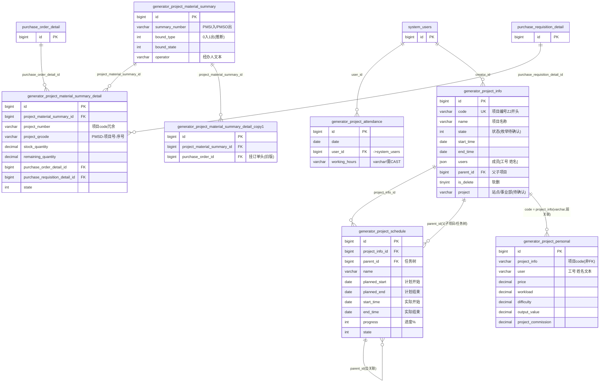

# 项目模块 · fuadmin 数据字典
> 域: 04-订单项目域 | 表数: 13 | 用途: Agent基础文件 | 生成: 2026-07-23

# project-项目 · 概述

项目模块是"治通"MES 的项目制经营管理中枢，覆盖技改/自动化工作站等内部项目从立项、排程、工时到物料、绩效的全生命周期。以 `generator_project_info` 项目主档（code 唯一，~325 行）为核心，向下挂 `project_schedule` 任务排程树（~2840 行）与 `project_attendance` 成员工时日表（~7094 行，全模块数据量最大）。物料侧通过 `project_material_summary` + `summary_detail`（PMSI 入库/PMSO 出库）把采购到货物资绑定到具体项目，明细行回链采购订单明细，实现"采购→项目领用"追溯。`project_personal`（~3052 行）按项目+人记录产值、工作量、难度系数与项目提成，是项目制绩效核算的数据源。主表在用，`_gh/_tf/_zt` 站点分表与 `summary` 三站点分表均 0 行未启用。

# project-项目 · 上岗指南

## 2.1 核心实体表（TOP8）

| 表 | 一句话定义 |
|---|---|
| generator_project_info | 项目主档：code 唯一（ZJ 开头），名称/周期/产线/工作站/产品，users 成员 JSON，parent_id 父子项目，is_delete 软删 |
| generator_project_schedule | 项目任务排程：挂 project_info_id，planned_start/end 计划 vs start/end 实际，progress 进度%，parent_id 任务树 |
| generator_project_attendance | 项目成员工时日表：date + user_id + working_hours（注意是 varchar），全模块数据量最大（~7094 行） |
| generator_project_material_summary | 项目物料汇总单头：summary_number（PMSI=入库/PMSO=出库），bound_type 绑定方向，bound_state 状态，operator 经办人 |
| generator_project_material_summary_detail | 物料出入库明细：项目名/编号冗余，stock_quantity/remaining_quantity，project_qrcode 二维码，回链 purchase_order_detail_id |
| generator_project_material_summary_detail_copy1 | 明细旧版/备份：结构近似但挂 purchase_order_id（订单头），与正式表并存，查询勿混用 |
| generator_project_personal | 项目个人产值绩效：project_info 存项目 code（varchar 非 FK），user 文本，price/output_value/workload/difficulty/project_commission |
| generator_project_material_summary_gh/_tf/_zt | 汇总单三站点分表（同构，全 0 行未启用）；detail 同样有三张分表 |

## 2.2 核心业务流

1. **立项**：`project_info` 建项目主档（`code` 唯一如 ZJ2410-01-001，`require` 立项需求，`users`/`read_users` JSON 存"工号 姓名"数组成员），`state` 流转（样本见 2/5，枚举待确认），`parent_id` 支持父子项目层级。
2. **排程**：`project_schedule` 按项目拆任务（`parent_id` 自关联成树），`planned_start/planned_end` 计划日期 vs `start_time/end_time` 实际日期，`progress` 0-100，`user` 负责人（文本"工号 姓名"）。
3. **工时考勤**：`project_attendance` 按 `user_id + date` 逐日登记 `working_hours`，为项目人力投入与绩效核算的底层数据。
4. **物料绑定**：采购到货后建 `project_material_summary`（单号 PMSI 入库/PMSO 出库，`bound_type` 0=入/1=出推断）+ 明细行：从采购订单明细引入（`purchase_order_detail_id`、`purchase_requisition_detail_id`），冗余项目名/编号与供应商、价格税率，`project_qrcode`（PMSD-项目号-序号）供扫码领用，`stock_quantity` 入/出库量、`remaining_quantity` 余量。
5. **绩效核算**：`project_personal` 按项目 code + 人员记录 `price`（项目单价/合同额）、`workload`（工作量占比）、`difficulty`（难度系数）、`output_value`（产值）、`project_commission`（提成比例）、`personal_average`（人均），支撑项目制奖金分配。

## 2.3 典型查询场景

**场景1：项目主档一览（排除软删）**
```sql
SELECT code, name, state, start_time, end_time, production_line, work_station, product
FROM generator_project_info
WHERE is_delete = 0
ORDER BY create_datetime DESC;
```

**场景2：某项目任务进度（计划 vs 实际）**
```sql
SELECT name, user, planned_start, planned_end, start_time, end_time, progress, state
FROM generator_project_schedule
WHERE project_info_id = 2
ORDER BY parent_id, sort;
```

**场景3：项目成员工时月度汇总（varchar 需 CAST）**
```sql
SELECT user_id, DATE_FORMAT(date, '%Y-%m') AS ym,
       SUM(CAST(working_hours AS DECIMAL(6,2))) AS total_hours
FROM generator_project_attendance
WHERE date >= '2025-03-01' AND date < '2025-04-01'
GROUP BY user_id, ym
ORDER BY total_hours DESC;
```

**场景4：项目物料入库明细（追溯采购订单明细）**
```sql
SELECT d.material_name, d.specification, d.stock_quantity, d.remaining_quantity,
       d.unit_price, d.amount, d.supplier_name, d.project_qrcode, d.purchase_order_detail_id
FROM generator_project_material_summary s
JOIN generator_project_material_summary_detail d ON d.project_material_summary_id = s.id
WHERE s.bound_type = 0 AND d.project_number = 'ZJ2549-00-000';
```

**场景5：某项目领用出库未领完物料（余量>0）**
```sql
SELECT d.material_name, d.stock_quantity, d.remaining_quantity, d.location, d.recipient
FROM generator_project_material_summary s
JOIN generator_project_material_summary_detail d ON d.project_material_summary_id = s.id
WHERE s.bound_type = 1 AND d.remaining_quantity > 0
  AND d.project_number = 'ZJ2549-00-000';
```

**场景6：项目个人产值/提成核算**
```sql
SELECT project_info, user, price, workload, difficulty, output_value,
       project_commission, personal_average
FROM generator_project_personal
WHERE project_info = 'ZJ2141-00-000'
ORDER BY output_value DESC;
```

**场景7：二维码反查物料归属（扫码枪场景）**
```sql
SELECT project_number, project_name, material_name, stock_quantity,
       remaining_quantity, location, state
FROM generator_project_material_summary_detail
WHERE project_qrcode = 'PMSD-ZJ2549-00-000-0001';
```

**场景8：超期未完工任务（进度<100 且实际结束为空/超计划）**
```sql
SELECT s.name, s.user, s.planned_end, s.progress, p.name AS project_name
FROM generator_project_schedule s
LEFT JOIN generator_project_info p ON p.id = s.project_info_id
WHERE s.progress < 100 AND s.planned_end < CURDATE() AND p.is_delete = 0
ORDER BY s.planned_end;
```

## 2.4 避坑提示

- **`project_personal.project_info` 是 varchar 存项目 code，不是 FK id**：关联主档须 `ON p.code = pp.project_info`，用 id 直 JOIN 必空。同表 `user` 也是文本"工号 姓名"（部分行只有姓名），对 `system_users` 只能按工号前缀或姓名模糊对碰。
- **`working_hours` 是 varchar(30)**：样本为 "10.3" 纯数字，但聚合前务必 `CAST(... AS DECIMAL)`，并防脏值（空串/中文）导致转换报错。
- **`detail_copy1` 挂 `purchase_order_id`（订单头）而正式明细表挂 `purchase_order_detail_id`（明细行）**：两版结构并存且 copy1 有 3361 行（与正式表 4044 行高度重叠，疑为迁移备份），统计只用正式表，勿 UNION 两表。
- **users/read_users/msg_info/history 是 JSON 数组**：元素为 "工号 姓名" 字符串，MySQL 5.7 无 JSON_TABLE，成员统计需 `JSON_EXTRACT` + 程序侧解析或 LIKE 模糊。
- **`project_info.project` 字段值为"智机/治通"**：疑为事业部/站点标识（与 `_zt`/`_gh` 分表口径不同），不是项目名称，勿当 name 用；确切含义待确认。
- **`bound_type` 0/1 语义为推断**：样本 PMSI（入库）单 bound_type=0、PMSO（出库）单 bound_type=1，`bound_state`、`state`（明细行 6/7）枚举均无注释，上线/对账前对照 `system_dict_item` 或后端代码确认。
- **三站点分表全 0 行**：`_gh/_tf/_zt` 汇总单与明细分表均未启用，当前全量数据在主表；但站点惯例随时可能开闸，写通用 SQL 时预留 UNION 结构。
- **软删 `is_delete`**：主档查询默认带 `is_delete = 0`，否则已删项目会混入统计。

## 3 数据字典

### generator_project_attendance（约 7094 行）
业务定义: 项目成员工时日表：按人按日登记工时，工时为varchar需转换 ｜ 表注释: -

| 字段 | 类型 | 可空 | 键 | 原始注释 | 推断语义 | 置信度 |
|---|---|---|---|---|---|---|
| id | bigint | N | PRI | - | 主键ID | high |
| remark | varchar(255) | Y | - | - | 备注 | high |
| modifier | varchar(255) | Y | - | - | 最后修改人姓名 | high |
| belong_dept | int | Y | - | - | 所属部门ID | mid |
| update_datetime | datetime(6) | Y | - | - | 最后更新时间 | high |
| create_datetime | datetime(6) | Y | - | - | 创建时间 | high |
| sort | int | Y | - | - | 排序号 | high |
| date | date | Y | - | - | 日期[推断] | high |
| user_id | bigint | Y | MUL | - | 关联ID → system_users.id[推断] | mid |
| working_hours | varchar(30) | Y | - | - | 工时/小时[推断] | mid |
| creator_id | bigint | Y | MUL | - | 创建人ID → system_users.id | high |

### generator_project_info（约 325 行）
业务定义: 项目主档：code唯一，成员/周期/产线/产品，支持父子项目 ｜ 表注释: -

| 字段 | 类型 | 可空 | 键 | 原始注释 | 推断语义 | 置信度 |
|---|---|---|---|---|---|---|
| id | bigint | N | PRI | - | 主键ID | high |
| remark | varchar(255) | Y | - | - | 备注 | high |
| modifier | varchar(255) | Y | - | - | 最后修改人姓名 | high |
| belong_dept | int | Y | - | - | 所属部门ID | mid |
| update_datetime | datetime(6) | Y | - | - | 最后更新时间 | high |
| create_datetime | datetime(6) | Y | - | - | 创建时间 | high |
| sort | int | Y | - | - | 排序号 | high |
| history | json | Y | - | - | 待确认 | low |
| msg_info | json | Y | - | - | 待确认 | low |
| users | json | Y | - | - | 用户[推断] | mid |
| state | int | Y | - | - | 状态（枚举值待确认）[推断] | mid |
| end_time | date | Y | - | - | 时间[推断] | high |
| start_time | date | Y | - | - | 时间[推断] | high |
| require | varchar(500) | Y | - | - | 文本字段[推断-待确认] | low |
| name | varchar(30) | Y | - | - | 名称[推断] | high |
| code | varchar(30) | Y | UNI | - | 编号/代码[推断] | mid |
| work_station | varchar(30) | Y | - | - | 工位/站点[推断] | mid |
| production_line | varchar(30) | Y | - | - | 产线[推断] | mid |
| creator_id | bigint | Y | MUL | - | 创建人ID → system_users.id | high |
| read_users | json | Y | - | - | 用户[推断] | mid |
| parent_id | bigint | Y | MUL | - | 关联ID（目标表待确认）[推断] | low |
| delivery_time | datetime | Y | - | - | 时间[推断] | high |
| product | varchar(30) | Y | - | - | 产品[推断] | high |
| is_delete | tinyint(1) | Y | - | - | 逻辑删除标志 | high |
| project | varchar(30) | Y | - | - | 文本字段[推断-待确认] | low |

### generator_project_material_summary（约 1319 行）
业务定义: 项目物料汇总单头：PMSI入库/PMSO出库，绑定类型与状态 ｜ 表注释: -

| 字段 | 类型 | 可空 | 键 | 原始注释 | 推断语义 | 置信度 |
|---|---|---|---|---|---|---|
| id | bigint | N | PRI | - | 主键ID | high |
| remark | varchar(255) | Y | - | - | 备注 | high |
| modifier | varchar(255) | Y | - | - | 最后修改人姓名 | high |
| belong_dept | int | Y | - | - | 所属部门ID | mid |
| update_datetime | datetime(6) | Y | - | - | 最后更新时间 | high |
| create_datetime | datetime(6) | Y | - | - | 创建时间 | high |
| sort | int | Y | - | - | 排序号 | high |
| summary_number | varchar(50) | Y | - | - | 编号/代码[推断] | mid |
| creator_id | bigint | Y | MUL | - | 创建人ID → system_users.id | high |
| bound_type | int | Y | - | - | 类型[推断] | mid |
| operator | varchar(20) | Y | - | - | 操作人[推断] | high |
| bound_state | int | Y | - | - | 状态（枚举值待确认）[推断] | mid |

### generator_project_material_summary_detail（约 4044 行）
业务定义: 项目物料出入库明细：回链采购明细，二维码追溯，余量管理 ｜ 表注释: -

| 字段 | 类型 | 可空 | 键 | 原始注释 | 推断语义 | 置信度 |
|---|---|---|---|---|---|---|
| id | bigint | N | PRI | - | 主键ID | high |
| remark | varchar(255) | Y | - | - | 备注 | high |
| modifier | varchar(255) | Y | - | - | 最后修改人姓名 | high |
| belong_dept | int | Y | - | - | 所属部门ID | mid |
| update_datetime | datetime(6) | Y | - | - | 最后更新时间 | high |
| create_datetime | datetime(6) | Y | - | - | 创建时间 | high |
| sort | int | Y | - | - | 排序号 | high |
| picture | json | Y | - | - | 图片路径[推断] | mid |
| remaining_quantity | decimal(13,2) | Y | - | - | 数量[推断] | high |
| recipient | varchar(20) | Y | - | - | 接收人[推断] | high |
| supplier_name | varchar(50) | Y | - | - | 名称[推断] | high |
| amount | decimal(13,2) | Y | - | - | 金额[推断] | high |
| tax_rate | decimal(6,2) | Y | - | - | 比率/百分比[推断] | high |
| unit_price | decimal(15,4) | Y | - | - | 单价[推断] | high |
| project_name | varchar(50) | Y | - | - | 名称[推断] | high |
| project_number | varchar(50) | Y | - | - | 编号/代码[推断] | mid |
| material_subcategory | varchar(50) | Y | - | - | 分类[推断] | mid |
| applicant | varchar(20) | Y | - | - | 文本字段[推断-待确认] | low |
| unit | varchar(10) | Y | - | - | 计量单位[推断] | high |
| config_requirement | varchar(255) | Y | - | - | 文本字段[推断-待确认] | low |
| specification | varchar(255) | Y | - | - | 规格/型号[推断] | mid |
| material_name | varchar(255) | Y | - | - | 名称[推断] | high |
| project_qrcode | varchar(50) | Y | - | - | 文本字段[推断-待确认] | low |
| creator_id | bigint | Y | MUL | - | 创建人ID → system_users.id | high |
| project_material_summary_id | bigint | Y | MUL | - | 关联ID → generator_project_material_summary.id[推断] | mid |
| stock_date | date | Y | - | - | 日期[推断] | high |
| stock_quantity | decimal(13,2) | Y | - | - | 数量[推断] | high |
| state | int | Y | - | - | 状态（枚举值待确认）[推断] | mid |
| location | varchar(50) | Y | - | - | 库位/位置[推断] | mid |
| purchase_requisition_detail_id | bigint | Y | - | - | 关联ID → generator_purchase_requisition_detail.id[推断] | mid |
| brand | varchar(20) | Y | - | - | 品牌[推断] | high |
| purchase_order_detail_id | bigint | Y | MUL | - | 关联ID → generator_purchase_order_detail.id[推断] | mid |

### generator_project_material_summary_detail_copy1（约 3361 行）
业务定义: 物料明细旧版/备份表：挂采购订单头而非明细，勿与正式表混用 ｜ 表注释: -

| 字段 | 类型 | 可空 | 键 | 原始注释 | 推断语义 | 置信度 |
|---|---|---|---|---|---|---|
| id | bigint | N | PRI | - | 主键ID | high |
| remark | varchar(255) | Y | - | - | 备注 | high |
| modifier | varchar(255) | Y | - | - | 最后修改人姓名 | high |
| belong_dept | int | Y | - | - | 所属部门ID | mid |
| update_datetime | datetime(6) | Y | - | - | 最后更新时间 | high |
| create_datetime | datetime(6) | Y | - | - | 创建时间 | high |
| sort | int | Y | - | - | 排序号 | high |
| picture | json | Y | - | - | 图片路径[推断] | mid |
| remaining_quantity | decimal(13,2) | Y | - | - | 数量[推断] | high |
| recipient | varchar(20) | Y | - | - | 接收人[推断] | high |
| supplier_name | varchar(50) | Y | - | - | 名称[推断] | high |
| amount | decimal(13,2) | Y | - | - | 金额[推断] | high |
| tax_rate | decimal(6,2) | Y | - | - | 比率/百分比[推断] | high |
| unit_price | decimal(15,4) | Y | - | - | 单价[推断] | high |
| project_name | varchar(50) | Y | - | - | 名称[推断] | high |
| project_number | varchar(50) | Y | - | - | 编号/代码[推断] | mid |
| material_subcategory | varchar(50) | Y | - | - | 分类[推断] | mid |
| applicant | varchar(20) | Y | - | - | 文本字段[推断-待确认] | low |
| unit | varchar(10) | Y | - | - | 计量单位[推断] | high |
| config_requirement | varchar(255) | Y | - | - | 文本字段[推断-待确认] | low |
| specification | varchar(50) | Y | - | - | 规格/型号[推断] | mid |
| material_name | varchar(50) | Y | - | - | 名称[推断] | high |
| project_qrcode | varchar(50) | Y | - | - | 文本字段[推断-待确认] | low |
| creator_id | bigint | Y | MUL | - | 创建人ID → system_users.id | high |
| project_material_summary_id | bigint | Y | MUL | - | 关联ID → generator_project_material_summary.id[推断] | mid |
| purchase_order_id | bigint | Y | MUL | - | 关联ID → generator_purchase_order.id[推断] | mid |
| stock_date | date | Y | - | - | 日期[推断] | high |
| stock_quantity | decimal(13,2) | Y | - | - | 数量[推断] | high |
| state | int | Y | - | - | 状态（枚举值待确认）[推断] | mid |
| location | varchar(50) | Y | - | - | 库位/位置[推断] | mid |
| purchase_requisition_detail_id | bigint | Y | - | - | 关联ID → generator_purchase_requisition_detail.id[推断] | mid |
| brand | varchar(20) | Y | - | - | 品牌[推断] | high |

### generator_project_material_summary_detail_gh（约 0 行）
业务定义: 项目物料明细广汇站点分表（同构，0行未启用） ｜ 表注释: -

| 字段 | 类型 | 可空 | 键 | 原始注释 | 推断语义 | 置信度 |
|---|---|---|---|---|---|---|
| id | bigint | N | PRI | - | 主键ID | high |
| remark | varchar(255) | Y | - | - | 备注 | high |
| modifier | varchar(255) | Y | - | - | 最后修改人姓名 | high |
| belong_dept | int | Y | - | - | 所属部门ID | mid |
| update_datetime | datetime(6) | Y | - | - | 最后更新时间 | high |
| create_datetime | datetime(6) | Y | - | - | 创建时间 | high |
| sort | int | Y | - | - | 排序号 | high |
| picture | json | Y | - | - | 图片路径[推断] | mid |
| state | int | Y | - | - | 状态（枚举值待确认）[推断] | mid |
| remaining_quantity | decimal(13,2) | Y | - | - | 数量[推断] | high |
| stock_quantity | decimal(13,2) | Y | - | - | 数量[推断] | high |
| stock_date | date | Y | - | - | 日期[推断] | high |
| location | varchar(50) | Y | - | - | 库位/位置[推断] | mid |
| recipient | varchar(20) | Y | - | - | 接收人[推断] | high |
| supplier_name | varchar(50) | Y | - | - | 名称[推断] | high |
| amount | decimal(13,2) | Y | - | - | 金额[推断] | high |
| tax_rate | decimal(6,2) | Y | - | - | 比率/百分比[推断] | high |
| unit_price | decimal(15,4) | Y | - | - | 单价[推断] | high |
| project_name | varchar(50) | Y | - | - | 名称[推断] | high |
| project_number | varchar(50) | Y | - | - | 编号/代码[推断] | mid |
| material_subcategory | varchar(50) | Y | - | - | 分类[推断] | mid |
| applicant | varchar(20) | Y | - | - | 文本字段[推断-待确认] | low |
| unit | varchar(10) | Y | - | - | 计量单位[推断] | high |
| brand | varchar(20) | Y | - | - | 品牌[推断] | high |
| config_requirement | varchar(255) | Y | - | - | 文本字段[推断-待确认] | low |
| specification | varchar(255) | Y | - | - | 规格/型号[推断] | mid |
| material_name | varchar(255) | Y | - | - | 名称[推断] | high |
| project_qrcode | varchar(50) | Y | - | - | 文本字段[推断-待确认] | low |
| purchase_requisition_detail_id | bigint | Y | - | - | 关联ID → generator_purchase_requisition_detail.id[推断] | mid |
| creator_id | bigint | Y | MUL | - | 创建人ID → system_users.id | high |
| project_material_summary_id | bigint | Y | MUL | - | 关联ID → generator_project_material_summary.id[推断] | mid |
| purchase_order_detail_id | bigint | Y | MUL | - | 关联ID → generator_purchase_order_detail.id[推断] | mid |

### generator_project_material_summary_detail_tf（约 0 行）
业务定义: 项目物料明细TF铸造站点分表（同构，0行未启用） ｜ 表注释: -

| 字段 | 类型 | 可空 | 键 | 原始注释 | 推断语义 | 置信度 |
|---|---|---|---|---|---|---|
| id | bigint | N | PRI | - | 主键ID | high |
| remark | varchar(255) | Y | - | - | 备注 | high |
| modifier | varchar(255) | Y | - | - | 最后修改人姓名 | high |
| belong_dept | int | Y | - | - | 所属部门ID | mid |
| update_datetime | datetime(6) | Y | - | - | 最后更新时间 | high |
| create_datetime | datetime(6) | Y | - | - | 创建时间 | high |
| sort | int | Y | - | - | 排序号 | high |
| picture | json | Y | - | - | 图片路径[推断] | mid |
| state | int | Y | - | - | 状态（枚举值待确认）[推断] | mid |
| remaining_quantity | decimal(13,2) | Y | - | - | 数量[推断] | high |
| stock_quantity | decimal(13,2) | Y | - | - | 数量[推断] | high |
| stock_date | date | Y | - | - | 日期[推断] | high |
| location | varchar(50) | Y | - | - | 库位/位置[推断] | mid |
| recipient | varchar(20) | Y | - | - | 接收人[推断] | high |
| supplier_name | varchar(50) | Y | - | - | 名称[推断] | high |
| amount | decimal(13,2) | Y | - | - | 金额[推断] | high |
| tax_rate | decimal(6,2) | Y | - | - | 比率/百分比[推断] | high |
| unit_price | decimal(15,4) | Y | - | - | 单价[推断] | high |
| project_name | varchar(50) | Y | - | - | 名称[推断] | high |
| project_number | varchar(50) | Y | - | - | 编号/代码[推断] | mid |
| material_subcategory | varchar(50) | Y | - | - | 分类[推断] | mid |
| applicant | varchar(20) | Y | - | - | 文本字段[推断-待确认] | low |
| unit | varchar(10) | Y | - | - | 计量单位[推断] | high |
| brand | varchar(20) | Y | - | - | 品牌[推断] | high |
| config_requirement | varchar(255) | Y | - | - | 文本字段[推断-待确认] | low |
| specification | varchar(255) | Y | - | - | 规格/型号[推断] | mid |
| material_name | varchar(255) | Y | - | - | 名称[推断] | high |
| project_qrcode | varchar(50) | Y | - | - | 文本字段[推断-待确认] | low |
| purchase_requisition_detail_id | bigint | Y | - | - | 关联ID → generator_purchase_requisition_detail.id[推断] | mid |
| creator_id | bigint | Y | MUL | - | 创建人ID → system_users.id | high |
| project_material_summary_id | bigint | Y | MUL | - | 关联ID → generator_project_material_summary.id[推断] | mid |
| purchase_order_detail_id | bigint | Y | MUL | - | 关联ID → generator_purchase_order_detail.id[推断] | mid |

### generator_project_material_summary_detail_zt（约 0 行）
业务定义: 项目物料明细治通站点分表（同构，0行未启用） ｜ 表注释: -

| 字段 | 类型 | 可空 | 键 | 原始注释 | 推断语义 | 置信度 |
|---|---|---|---|---|---|---|
| id | bigint | N | PRI | - | 主键ID | high |
| remark | varchar(255) | Y | - | - | 备注 | high |
| modifier | varchar(255) | Y | - | - | 最后修改人姓名 | high |
| belong_dept | int | Y | - | - | 所属部门ID | mid |
| update_datetime | datetime(6) | Y | - | - | 最后更新时间 | high |
| create_datetime | datetime(6) | Y | - | - | 创建时间 | high |
| sort | int | Y | - | - | 排序号 | high |
| picture | json | Y | - | - | 图片路径[推断] | mid |
| state | int | Y | - | - | 状态（枚举值待确认）[推断] | mid |
| remaining_quantity | decimal(13,2) | Y | - | - | 数量[推断] | high |
| stock_quantity | decimal(13,2) | Y | - | - | 数量[推断] | high |
| stock_date | date | Y | - | - | 日期[推断] | high |
| location | varchar(50) | Y | - | - | 库位/位置[推断] | mid |
| recipient | varchar(20) | Y | - | - | 接收人[推断] | high |
| supplier_name | varchar(50) | Y | - | - | 名称[推断] | high |
| amount | decimal(13,2) | Y | - | - | 金额[推断] | high |
| tax_rate | decimal(6,2) | Y | - | - | 比率/百分比[推断] | high |
| unit_price | decimal(15,4) | Y | - | - | 单价[推断] | high |
| project_name | varchar(50) | Y | - | - | 名称[推断] | high |
| project_number | varchar(50) | Y | - | - | 编号/代码[推断] | mid |
| material_subcategory | varchar(50) | Y | - | - | 分类[推断] | mid |
| applicant | varchar(20) | Y | - | - | 文本字段[推断-待确认] | low |
| unit | varchar(10) | Y | - | - | 计量单位[推断] | high |
| brand | varchar(20) | Y | - | - | 品牌[推断] | high |
| config_requirement | varchar(255) | Y | - | - | 文本字段[推断-待确认] | low |
| specification | varchar(255) | Y | - | - | 规格/型号[推断] | mid |
| material_name | varchar(255) | Y | - | - | 名称[推断] | high |
| project_qrcode | varchar(50) | Y | - | - | 文本字段[推断-待确认] | low |
| purchase_requisition_detail_id | bigint | Y | - | - | 关联ID → generator_purchase_requisition_detail.id[推断] | mid |
| creator_id | bigint | Y | MUL | - | 创建人ID → system_users.id | high |
| project_material_summary_id | bigint | Y | MUL | - | 关联ID → generator_project_material_summary.id[推断] | mid |
| purchase_order_detail_id | bigint | Y | MUL | - | 关联ID → generator_purchase_order_detail.id[推断] | mid |

### generator_project_material_summary_gh（约 0 行）
业务定义: 项目物料汇总单广汇站点分表（同构，0行未启用） ｜ 表注释: -

| 字段 | 类型 | 可空 | 键 | 原始注释 | 推断语义 | 置信度 |
|---|---|---|---|---|---|---|
| id | bigint | N | PRI | - | 主键ID | high |
| remark | varchar(255) | Y | - | - | 备注 | high |
| modifier | varchar(255) | Y | - | - | 最后修改人姓名 | high |
| belong_dept | int | Y | - | - | 所属部门ID | mid |
| update_datetime | datetime(6) | Y | - | - | 最后更新时间 | high |
| create_datetime | datetime(6) | Y | - | - | 创建时间 | high |
| sort | int | Y | - | - | 排序号 | high |
| summary_number | varchar(50) | Y | - | - | 编号/代码[推断] | mid |
| bound_type | int | Y | - | - | 类型[推断] | mid |
| bound_state | int | Y | - | - | 状态（枚举值待确认）[推断] | mid |
| operator | varchar(20) | Y | - | - | 操作人[推断] | high |
| creator_id | bigint | Y | MUL | - | 创建人ID → system_users.id | high |

### generator_project_material_summary_tf（约 0 行）
业务定义: 项目物料汇总单TF铸造站点分表（同构，0行未启用） ｜ 表注释: -

| 字段 | 类型 | 可空 | 键 | 原始注释 | 推断语义 | 置信度 |
|---|---|---|---|---|---|---|
| id | bigint | N | PRI | - | 主键ID | high |
| remark | varchar(255) | Y | - | - | 备注 | high |
| modifier | varchar(255) | Y | - | - | 最后修改人姓名 | high |
| belong_dept | int | Y | - | - | 所属部门ID | mid |
| update_datetime | datetime(6) | Y | - | - | 最后更新时间 | high |
| create_datetime | datetime(6) | Y | - | - | 创建时间 | high |
| sort | int | Y | - | - | 排序号 | high |
| summary_number | varchar(50) | Y | - | - | 编号/代码[推断] | mid |
| bound_type | int | Y | - | - | 类型[推断] | mid |
| bound_state | int | Y | - | - | 状态（枚举值待确认）[推断] | mid |
| operator | varchar(20) | Y | - | - | 操作人[推断] | high |
| creator_id | bigint | Y | MUL | - | 创建人ID → system_users.id | high |

### generator_project_material_summary_zt（约 0 行）
业务定义: 项目物料汇总单治通站点分表（同构，0行未启用） ｜ 表注释: -

| 字段 | 类型 | 可空 | 键 | 原始注释 | 推断语义 | 置信度 |
|---|---|---|---|---|---|---|
| id | bigint | N | PRI | - | 主键ID | high |
| remark | varchar(255) | Y | - | - | 备注 | high |
| modifier | varchar(255) | Y | - | - | 最后修改人姓名 | high |
| belong_dept | int | Y | - | - | 所属部门ID | mid |
| update_datetime | datetime(6) | Y | - | - | 最后更新时间 | high |
| create_datetime | datetime(6) | Y | - | - | 创建时间 | high |
| sort | int | Y | - | - | 排序号 | high |
| summary_number | varchar(50) | Y | - | - | 编号/代码[推断] | mid |
| bound_type | int | Y | - | - | 类型[推断] | mid |
| bound_state | int | Y | - | - | 状态（枚举值待确认）[推断] | mid |
| operator | varchar(20) | Y | - | - | 操作人[推断] | high |
| creator_id | bigint | Y | MUL | - | 创建人ID → system_users.id | high |

### generator_project_personal（约 3052 行）
业务定义: 项目个人产值绩效表：按项目+人记产值/工作量/难度/提成 ｜ 表注释: -

| 字段 | 类型 | 可空 | 键 | 原始注释 | 推断语义 | 置信度 |
|---|---|---|---|---|---|---|
| id | bigint | N | PRI | - | 主键ID | high |
| remark | varchar(255) | Y | - | - | 备注 | high |
| modifier | varchar(255) | Y | - | - | 最后修改人姓名 | high |
| belong_dept | int | Y | - | - | 所属部门ID | mid |
| update_datetime | datetime(6) | Y | - | - | 最后更新时间 | high |
| create_datetime | datetime(6) | Y | - | - | 创建时间 | high |
| sort | int | Y | - | - | 排序号 | high |
| total_planned_worktime | decimal(10,2) | Y | - | - | 时间[推断] | high |
| total_planned_time | decimal(10,2) | Y | - | - | 时间[推断] | high |
| output_value | decimal(10,2) | Y | - | - | 数值（小数）[推断-待确认] | low |
| workload | decimal(10,2) | Y | - | - | 数值（小数）[推断-待确认] | low |
| project_commission | decimal(10,2) | Y | - | - | 数值（小数）[推断-待确认] | low |
| price | decimal(10,2) | Y | - | - | 单价[推断] | high |
| creator_id | bigint | Y | MUL | - | 创建人ID → system_users.id | high |
| project_info | varchar(80) | N | - | - | 文本字段[推断-待确认] | low |
| user | varchar(30) | N | - | - | 用户[推断] | mid |
| difficulty | decimal(4,2) | Y | - | - | 数值（小数）[推断-待确认] | low |
| personal_average | decimal(10,2) | Y | - | - | 年龄[推断] | high |
| content | varchar(160) | Y | - | - | 内容[推断] | mid |
| name | varchar(100) | Y | - | - | 名称[推断] | high |
| man_hour | decimal(10,2) | Y | - | - | 数值（小数）[推断-待确认] | low |

### generator_project_schedule（约 2840 行）
业务定义: 项目任务排程树：计划vs实际日期、进度百分比，父子任务 ｜ 表注释: -

| 字段 | 类型 | 可空 | 键 | 原始注释 | 推断语义 | 置信度 |
|---|---|---|---|---|---|---|
| id | bigint | N | PRI | - | 主键ID | high |
| remark | varchar(255) | Y | - | - | 备注 | high |
| modifier | varchar(255) | Y | - | - | 最后修改人姓名 | high |
| belong_dept | int | Y | - | - | 所属部门ID | mid |
| update_datetime | datetime(6) | Y | - | - | 最后更新时间 | high |
| create_datetime | datetime(6) | Y | - | - | 创建时间 | high |
| sort | int | Y | - | - | 排序号 | high |
| state | int | Y | - | - | 状态（枚举值待确认）[推断] | mid |
| end_time | date | Y | - | - | 时间[推断] | high |
| start_time | date | Y | - | - | 时间[推断] | high |
| progress | int | Y | - | - | 数值字段[推断-待确认] | low |
| user | varchar(255) | Y | - | - | 用户[推断] | mid |
| name | varchar(50) | Y | - | - | 名称[推断] | high |
| creator_id | bigint | Y | MUL | - | 创建人ID → system_users.id | high |
| parent_id | bigint | Y | MUL | - | 关联ID（目标表待确认）[推断] | low |
| project_info_id | bigint | Y | MUL | - | 关联ID → generator_project_info.id[推断] | mid |
| planned_end | date | Y | - | - | 日期时间[推断] | mid |
| planned_start | date | Y | - | - | 日期时间[推断] | mid |

# project-项目 · ER 图



## 推断说明

- **已证实（索引/字段名）**：`schedule.project_info_id`、`schedule.parent_id`、`detail.project_material_summary_id`、`detail.purchase_order_detail_id`、`detail.purchase_requisition_detail_id`、`attendance.user_id` 均带 MUL 索引；`copy1.project_material_summary_id`、`copy1.purchase_order_id` 同样带索引。
- **弱关联（推断）**：`project_personal.project_info`(varchar) → `project_info.code`，无索引无 FK，按样本值（ZJ2141-00-000 格式与主档 code 一致）推断；`attendance.user_id` → `system_users.id` 为框架惯例。
- **父子层级**：`project_info.parent_id` 自关联（父子项目）、`project_schedule.parent_id` 自关联（任务树），均按命名+索引推断。
- **分表省略**：`_gh/_tf/_zt` 六张分表结构同主表、0 行未启用，图中未画出。
- **bound_type/bound_state/state 枚举**：取值含义为推断，已在图注标明，待 `system_dict_item` 或代码确认。

# project-项目 · 跨模块接口表

| 本模块表.字段 | → 目标模块.表.字段 | 依据 | 置信度 |
|---|---|---|---|
| project_material_summary_detail.purchase_order_detail_id | → purchase（采购）.generator_purchase_order_detail.id | 命名+MUL索引；purchase 模块存在该表 | 高（推断） |
| project_material_summary_detail.purchase_requisition_detail_id | → purchase.generator_purchase_requisition_detail.id | 命名（无索引）；purchase 模块存在该表 | 高（推断） |
| project_material_summary_detail_copy1.purchase_order_id | → purchase.generator_purchase_order.id（订单头，旧版口径） | 命名+MUL索引；与正式表明细级口径不同 | 高（推断） |
| project_material_summary_detail.project_number / project_name | → 本模块 project_info.code / name（冗余快照） | 样本值与主档一致（ZJ2549-00-000） | 高 |
| project_personal.project_info | → 本模块 project_info.code（varchar 弱关联，非 FK） | 样本值格式与 code 一致；无索引 | 高（推断） |
| project_info.project | → order（订单）.generator_customer_order 或站点/事业部字典（"智机/治通"） | 样本值为站点名；具体指向待确认 | 低（待确认） |
| project_attendance.user_id | → system（用户权限）.system_users.id | MUL索引+框架惯例（员工主表） | 高 |
| schedule.user / summary.operator / personal.user | → system_users（"工号 姓名"文本，按工号前缀对碰） | 样本格式 "22281 苏杨"；无 FK | 中 |
| project_info.users / read_users (JSON) | → system_users 集合（JSON 数组存"工号 姓名"） | 样本结构 | 中 |
| detail.supplier_name | → supplier（供应商）.generator_supplier 名称列 | 纯文本无 FK，purchase 同一惯例 | 中 |
| 所有表.creator_id | → system.system_users.id | 框架惯例+MUL索引 | 高 |
| 所有表.belong_dept | → system.system_dept.id（推断） | 框架惯例 int 部门号 | 中（待确认） |

## 说明

- **最实的两条边**：`summary_detail.purchase_order_detail_id`（带索引）打通"采购订单明细→项目物料"追溯；`schedule.project_info_id`（带索引）是项目→任务的内部主轴。
- **purchase 方向**：项目物料明细同时持有 `purchase_order_detail_id`（采购订单明细）与 `purchase_requisition_detail_id`（采购申请明细）双链，配合 `supplier_name` 冗余，可反查"申请→订单→入/出库"全链；注意 `detail_copy1` 是订单头级旧口径，跨模块统计只用正式明细表。
- **order 方向（弱）**：`project_info.project` 样本值为"智机/治通"，与 order 模块订单的站点/事业部口径可能对应，但无字段级证据，**待确认**；订单模块 `generator_customer_order` 未见回链 project 的字段，两模块当前以项目 code 文本弱耦合（推断）。
- **system_users 方向三种形态并存**：FK 级（`attendance.user_id`、`creator_id`）、"工号 姓名"文本级（`schedule.user` 等）、JSON 数组级（`project_info.users`），写人员维度统计需三种口径分别处理。
- **站点分表**：六张 `_gh/_tf/_zt` 分表 0 行未启用；若开闸，跨模块接口结构同主表。

## 6 字段备注改进建议

（待 enrich 补充）

## 相关页面
- [[fuadmin数据字典总览]]
- [[客户模块-fuadmin数据字典]]
- [[订单模块-fuadmin数据字典]]
- [[财务模块-fuadmin数据字典]]
