# 人力能力模块 · fuadmin 数据字典
> 域: 05-人事系统域 | 表数: 11 | 用途: Agent基础文件 | 生成: 2026-07-23

# hr-人力能力 模块概述

hr-人力能力模块覆盖"人"的全生命周期与"能力"的量化评估两条主线，共11张表。人的主线：`generator_employment_registration` 入职登记→`generator_roster` 花名册（合同/社保/紧急联系人）→`generator_salary` 工资明细（计件/计时，与生产排程 newscheduling 一单一关联）→`generator_holiday_date` 节假日与加班结算规则。能力主线：`generator_job_code` 工号（工作代号）树定义全厂工序岗位及计件单价，`generator_capability_score` 按"人×产线工号"计算效率/达成/稳定/经验/近期性五维综合评分并线内排名，`generator_user_product_matrix` 按"人×产品×工序×月份"统计工时产量良率与综合适配度，支撑排产派工与月度评奖。工号变更通过 `generator_historicaljobcode` 留痕（django-simple-history 风格），设备绑定走 `generator_jobcode_devices`。

# hr-人力能力 上岗指南

## 2.1 核心实体与定义

| 实体（表） | 业务定义 |
|---|---|
| generator_roster | 花名册：员工档案（合同、社保、紧急联系人、入离职），employee_id 唯一 |
| generator_employment_registration | 入职登记表：应聘人员信息采集（学历/经历/家庭JSON），state 流转状态 |
| generator_salary | 工资明细：按排程单结算计件/计时工资，newscheduling_id 唯一关联排程单 |
| generator_holiday_date | 节假日表：日期唯一，settle_rule 定义加班结算规则 |
| generator_job_code | 工号（工作代号）树：工序/岗位定义，含计件单价、计划产量、结算方式 |
| generator_job_code_product | 工号-产品多对多：该工号可生产哪些产品 |
| generator_jobcode_devices | 工号-设备绑定：该工号在哪些设备上作业 |
| generator_historicaljobcode | 工号变更历史：simple-history 风格快照（+新增/~修改/-删除） |
| generator_historicaljobcode_devices | 工号-设备绑定变更历史 |
| generator_capability_score | 人力能力评分：人×产线工号五维评分与线内排名，定时计算 |
| generator_user_product_matrix | 人力矩阵：人×产品×工序×月统计工时/产量/良率/适配度，月度评奖依据 |

关键字段语义：

- `generator_job_code.name` 唯一，层级命名如"密封"→"密封-缸盖"→"密封-缸盖-XXX"（parent_id 树）；`type`=手动/自动；`piecework_price` 计件单价；`contribution_ratio` 贡献系数（样本1.10）；`is_floor` 是否一线。
- `generator_capability_score.score` 综合评分 S（0~1），由 eff/attain/stability/exp/recency 五个子分合成；`recency_days` 距最近一次作业天数（样本428天→recency_score 仅0.09，惩罚长期没做）；`day_cap/night_cap` 白夜班能力标记；`calc_time` 为批量重算时间。
- `generator_user_product_matrix` 唯一键 (user, product_name, process, stat_month)；`stat_month='ALL'` 为全量汇总行；`is_qualified` 是否达到样本门槛（参与评奖）；`user` 格式"工号 姓名"（如"15020 饶某某"）。
- `generator_salary`：一行=一张排程单的工资结算（newscheduling_id 唯一）；`settlement_method` 计件/计时；`pattern` 倍数（如"1倍"）；`gross_wage` 应发合计；`ticket_sum` 罚款扣减。
- `generator_employment_registration.state` 整型状态（样本=0，含义待确认，推测 待处理/已入职/淘汰）。
- `generator_roster.employee_id` 唯一工号（样本 9001/9002 为高管号段，生产员工多为 2xxxx 五位数）。

## 2.2 业务流

```
招聘入职：generator_employment_registration 登记（state 流转）
  → 入职成功写 generator_roster 花名册（employee_id、合同、社保）
  → system_users 建账号（工号登录）
  ↓
能力建模：generator_job_code 维护工号树+计件单价；
      job_code_product / jobcode_devices 绑定可产产品与设备；
      变更自动落 generator_historicaljobcode 历史
  ↓
日常生产：员工按排程报工（02-生产铸造域 generator_newscheduling）
  → generator_salary 按单结算工资（计件=产量×piecework_price×contribution_ratio，
      计时=工时×time_price，节假日按 holiday_date.settle_rule 加倍）
  ↓
能力评估（定时任务，calc_time 批量）：
  → generator_capability_score：人×工号五维评分+线内排名
  → generator_user_product_matrix：人×产品×工序×月汇总+综合适配度
  ↓
应用：排产派工参考 score/rank_in_line；月度评优选 is_qualified=1 高 composite_score
```

## 2.3 常见查询场景

**场景1：某产品某工序的最佳人手（派工推荐）**

```sql
SELECT m.user, m.total_output, m.quality_rate, m.composite_score
FROM generator_user_product_matrix m
WHERE m.product_name = '50T HEV缸盖' AND m.process = '去毛刺'
  AND m.stat_month = 'ALL' AND m.is_qualified = 1
ORDER BY m.composite_score DESC
LIMIT 10;
```

**场景2：某员工会干哪些工号（能力清单）**

```sql
SELECT c.job_code, c.product_name, c.score, c.rank_in_line,
       c.day_cap, c.night_cap, c.recency_days
FROM generator_capability_score c
WHERE c.user_code = '22039'
ORDER BY c.score DESC;
```

**场景3：某产线工号的人员排名（谁能顶岗）**

```sql
SELECT c.user_code, c.user_name, c.score, c.rank_in_line, c.work_days
FROM generator_capability_score c
WHERE c.job_code = '外检-差壳-893BB'
ORDER BY c.rank_in_line;
```

**场景4：某员工某月工资汇总**

```sql
SELECT n.task_date, s.settlement_method, s.gross_wage, s.piece_rate_wage,
       s.hourly_wage, s.ticket_sum
FROM generator_salary s
JOIN generator_newscheduling n ON n.id = s.newscheduling_id
WHERE n.user_code = '22125'   -- 排程表员工字段名待确认
  AND n.task_date BETWEEN '2026-06-01' AND '2026-06-30';
-- 若需按 creator 关联请改用 n.creator_id
```

**场景5：工号计件单价表（报价/成本基础）**

```sql
SELECT j.name, j.type, j.piecework_price, j.settlement_method,
       j.contribution_ratio, j.plan_output, j.dept
FROM generator_job_code j
WHERE j.is_active = 1 AND j.is_delete = 0
ORDER BY j.parent_id, j.sort;
```

**场景6：花名册在职人员及合同到期预警**

```sql
SELECT employee_id, name, department, position, entry_date,
       contract_end_date, social_security
FROM generator_roster
WHERE resignation_date IS NULL
  AND contract_end_date BETWEEN CURDATE() AND DATE_ADD(CURDATE(), INTERVAL 60 DAY)
ORDER BY contract_end_date;
```

**场景7：工号变更审计（谁什么时候改了单价）**

```sql
SELECT h.name, h.piecework_price, h.history_type, h.history_date,
       h.history_change_reason, u.name AS operator
FROM generator_historicaljobcode h
LEFT JOIN system_users u ON u.id = h.history_user_id
WHERE h.name = '机加-缸盖-TP200-1线-OP05'
ORDER BY h.history_date DESC;
```

**场景8：月度评奖候选（达门槛高适配度）**

```sql
SELECT m.user, m.product_name, m.process, m.stat_month,
       m.composite_score, m.quality_rate
FROM generator_user_product_matrix m
WHERE m.stat_month = '2026-06' AND m.is_qualified = 1
ORDER BY m.composite_score DESC
LIMIT 20;
```

## 2.4 避坑指南

1. **salary 与排程单 1:1**：newscheduling_id 唯一，勿当"人×月"粒度直接汇总前先 join 排程表取人/日期。
2. **matrix 有 'ALL' 汇总行**：stat_month='ALL' 与月度行并存，统计时忘了过滤会把 ALL 当月份重复计数。
3. **capability_score 是快照式重算**：calc_time 批量刷新，同一 calc_time 内排名才可比；跨批次比较 rank_in_line 无意义。
4. **recency 惩罚很强**：样本中 428 天没做 recency_score=0.09，"会做但很久没做"的人分数会被显著拉低，派工时别只看 score 榜首。
5. **工号改名不影响历史**：generator_job_code.name 唯一且可改，历史表按 name 快照存，追溯单价要用 historicaljobcode 而非现表。
6. **roster 与 system_users 无外键**：靠 employee_id↔username 工号对齐，存在花名册有而账号无（或未同步）的情况， join 前先做差异校验。
7. **入职登记表含敏感信息**：身份证号/住址/紧急联系人，查询结果严禁明文外发，脱敏（某某/138****）后使用。
8. **历史表 history_type 枚举**：'+'新增、'~'修改、'-'删除（simple-history 约定），history_id 是快照PK非原表ID。
9. **job_code 树形层级**：parent_id 自关联，统计某大工序（如"密封"）要递归下钻子工号，别只统计顶级节点。
10. **user 字段格式"工号 姓名"**：matrix.user 是拼接串，精确匹配用工号 LIKE '22039 %' 或 SUBSTRING_INDEX 拆分。

## 3 数据字典

### generator_capability_score（约 5085 行）
业务定义: 人力能力评分表：人工号五维评分与线内排名 ｜ 表注释: 人力能力评分表

| 字段 | 类型 | 可空 | 键 | 原始注释 | 推断语义 | 置信度 |
|---|---|---|---|---|---|---|
| id | bigint | N | PRI | - | 主键ID | high |
| site | varchar(20) | Y | MUL | 工作地点 | 工作地点（原注释） | high |
| dept | varchar(30) | Y | - | 所属部门 | 所属部门（原注释） | high |
| job_code | varchar(255) | Y | - | 线级工作代号 | 线级工作代号（原注释） | high |
| product_name | varchar(500) | Y | MUL | 产品名称(多个拼接) | 产品名称(多个拼接)（原注释） | high |
| line_type | varchar(20) | Y | - | 工作类型:手动/自动 | 工作类型:手动/自动（原注释） | high |
| category | varchar(20) | Y | - | 类别:线级手动/线级自动/辅助 | 类别:线级手动/线级自动/辅助（原注释） | high |
| plan_output | int | Y | - | 计划产量(每班) | 计划产量(每班)（原注释） | high |
| user_code | varchar(20) | Y | MUL | 工号 | 工号（原注释） | high |
| user_name | varchar(30) | Y | - | 姓名 | 姓名（原注释） | high |
| work_days | int | Y | - | 工作天数 | 工作天数（原注释） | high |
| unit_hours | decimal(13,4) | Y | - | 单件工时(小时) | 单件工时(小时)（原注释） | high |
| oph | decimal(10,2) | Y | - | - | 数值（小数）[推断-待确认] | low |
| attain_rate | decimal(8,4) | Y | - | 产量达成率 | 产量达成率（原注释） | high |
| quality_rate | decimal(8,4) | Y | - | 良率 | 良率（原注释） | high |
| downtime_rate | decimal(8,4) | Y | - | 宕机率 | 宕机率（原注释） | high |
| eff_score | decimal(6,4) | Y | - | 效率子分 | 效率子分（原注释） | high |
| attain_score | decimal(6,4) | Y | - | 达成子分 | 达成子分（原注释） | high |
| stability_score | decimal(6,4) | Y | - | - | 评分[推断] | high |
| exp_score | decimal(6,4) | Y | - | 经验子分 | 经验子分（原注释） | high |
| recency_days | int | Y | - | 距最近一次作业天数 | 距最近一次作业天数（原注释） | high |
| recency_score | decimal(6,4) | Y | - | 近期性子分 | 近期性子分（原注释） | high |
| score | decimal(6,4) | Y | - | 综合评分S(0~1) | 综合评分S(0~1)（原注释） | high |
| rank_in_line | int | Y | - | 该线内排名 | 该线内排名（原注释） | high |
| day_cap | tinyint(1) | N | - | 白班做过 | 白班做过（原注释） | high |
| night_cap | tinyint(1) | N | - | 夜班做过 | 夜班做过（原注释） | high |
| calc_time | datetime | Y | - | 本次计算时间 | 本次计算时间（原注释） | high |

### generator_historicaljobcode（约 2144 行）
业务定义: 工号变更历史快照：增改删全程留痕 ｜ 表注释: -

| 字段 | 类型 | 可空 | 键 | 原始注释 | 推断语义 | 置信度 |
|---|---|---|---|---|---|---|
| id | bigint | N | MUL | - | 主键ID | high |
| remark | varchar(255) | Y | - | - | 备注 | high |
| modifier | varchar(255) | Y | - | - | 最后修改人姓名 | high |
| belong_dept | int | Y | - | - | 所属部门ID | mid |
| update_datetime | datetime(6) | Y | - | - | 最后更新时间 | high |
| create_datetime | datetime(6) | Y | - | - | 创建时间 | high |
| sort | int | Y | - | - | 排序号 | high |
| is_active | tinyint(1) | N | - | - | 标志位（布尔）[推断] | mid |
| is_delete | tinyint(1) | N | - | - | 逻辑删除标志 | high |
| incentive_system | json | Y | - | - | 待确认 | low |
| is_production | varchar(20) | Y | - | - | 标志位（布尔）[推断] | mid |
| range_price | json | Y | - | - | 单价[推断] | high |
| piecework_price | decimal(10,2) | Y | - | - | 单价[推断] | high |
| settlement_method | varchar(20) | Y | - | - | 文本字段[推断-待确认] | low |
| type | varchar(20) | Y | - | - | 类型[推断] | mid |
| name | varchar(255) | Y | MUL | - | 名称[推断] | high |
| dept | varchar(30) | Y | - | - | 部门[推断] | high |
| contribution_ratio | decimal(8,2) | Y | - | - | 比率/百分比[推断] | high |
| is_sign | tinyint(1) | N | - | - | 标志位（布尔）[推断] | mid |
| is_floor | tinyint(1) | N | - | - | 标志位（布尔）[推断] | mid |
| plan_output | int | Y | - | - | 计划产量[推断] | high |
| history_id | int | N | PRI | - | 关联ID（目标表待确认）[推断] | low |
| history_date | datetime(6) | N | MUL | - | 日期[推断] | high |
| history_change_reason | varchar(100) | Y | - | - | 原因[推断] | mid |
| history_type | varchar(1) | N | - | - | 快照操作类型（+新增/~修改/-删除）[推断] | high |
| creator_id | bigint | Y | MUL | - | 创建人ID → system_users.id | high |
| history_user_id | bigint | Y | MUL | - | 关联ID（目标表待确认）[推断] | low |
| parent_id | bigint | Y | MUL | - | 关联ID（目标表待确认）[推断] | low |
| station_group | varchar(100) | Y | - | - | 工位/站点[推断] | mid |

关联: history_user_id → system_users.id

### generator_historicaljobcode_devices（约 0 行）
业务定义: 工号-设备绑定的变更历史快照 ｜ 表注释: -

| 字段 | 类型 | 可空 | 键 | 原始注释 | 推断语义 | 置信度 |
|---|---|---|---|---|---|---|
| id | bigint | N | MUL | - | 主键ID | high |
| remark | varchar(255) | Y | - | - | 备注 | high |
| modifier | varchar(255) | Y | - | - | 最后修改人姓名 | high |
| belong_dept | int | Y | - | - | 所属部门ID | mid |
| update_datetime | datetime(6) | Y | - | - | 最后更新时间 | high |
| create_datetime | datetime(6) | Y | - | - | 创建时间 | high |
| sort | int | Y | - | - | 排序号 | high |
| is_active | tinyint(1) | N | - | - | 标志位（布尔）[推断] | mid |
| history_id | int | N | PRI | - | 关联ID（目标表待确认）[推断] | low |
| history_date | datetime(6) | N | MUL | - | 日期[推断] | high |
| history_change_reason | varchar(100) | Y | - | - | 原因[推断] | mid |
| history_type | varchar(1) | N | - | - | 快照操作类型（+新增/~修改/-删除）[推断] | high |
| creator_id | bigint | Y | MUL | - | 创建人ID → system_users.id | high |
| devices_id | bigint | Y | MUL | - | 关联ID → generator_devices.id[推断] | mid |
| history_user_id | bigint | Y | MUL | - | 关联ID（目标表待确认）[推断] | low |
| job_code_id | bigint | Y | MUL | - | 关联ID → generator_job_code.id[推断] | mid |

关联: history_user_id → system_users.id

### generator_user_product_matrix（约 6627 行）
业务定义: 人力矩阵统计表：人产品工序月度工时产量良率与适配度 ｜ 表注释: 人力矩阵统计表

| 字段 | 类型 | 可空 | 键 | 原始注释 | 推断语义 | 置信度 |
|---|---|---|---|---|---|---|
| id | bigint | N | PRI | 主键 | 主键（原注释） | high |
| user | varchar(50) | N | MUL | 姓名/工号 | 姓名/工号（原注释） | high |
| product_name | varchar(50) | N | MUL | 产品名称 | 产品名称（原注释） | high |
| process | varchar(30) | Y | MUL | 工序(工作代号第一个-之前,如 密封/机加/清整) | 工序(工作代号第一个-之前,如 密封/机加/清整)（原注释） | high |
| stat_month | varchar(7) | N | MUL | 统计月份 YYYY-MM；全量用 ALL | 统计月份 YYYY-MM；全量用 ALL（原注释） | high |
| dept | varchar(20) | Y | - | 部门 | 部门（原注释） | high |
| site | varchar(20) | Y | - | 工作地点 | 工作地点（原注释） | high |
| total_work_hours | decimal(13,2) | Y | - | 累计工时 | 累计工时（原注释） | high |
| total_output | int | N | - | 累计产量 | 累计产量（原注释） | high |
| avg_output_per_hour | decimal(10,4) | Y | - | 单位工时产量 | 单位工时产量（原注释） | high |
| output_per_hour_std | decimal(10,4) | Y | - | 效率标准差 | 效率标准差（原注释） | high |
| total_industrial_waste | int | N | - | 累计工废 | 累计工废（原注释） | high |
| total_scrap_waste | int | N | - | 累计料废(仅参考) | 累计料废(仅参考)（原注释） | high |
| quality_rate | decimal(6,4) | Y | - | 良品率 | 良品率（原注释） | high |
| record_count | int | N | - | 报工记录条数 | 报工记录条数（原注释） | high |
| work_day_count | int | N | - | 累计工作天数 | 累计工作天数（原注释） | high |
| efficiency_score | decimal(6,4) | Y | - | 效率得分 | 效率得分（原注释） | high |
| quality_score | decimal(6,4) | Y | - | 质量得分 | 质量得分（原注释） | high |
| experience_score | decimal(6,4) | Y | - | 经验得分 | 经验得分（原注释） | high |
| stability_score | decimal(6,4) | Y | - | 稳定性得分 | 稳定性得分（原注释） | high |
| composite_score | decimal(6,4) | Y | - | 综合适配度评分 | 综合适配度评分（原注释） | high |
| last_stat_date | date | Y | - | 最近统计日期 | 最近统计日期（原注释） | high |
| update_datetime | datetime | Y | - | 修改时间 | 修改时间（原注释） | high |
| create_datetime | datetime | Y | - | 创建时间 | 创建时间（原注释） | high |
| remark | varchar(255) | Y | - | 备注 | 备注（原注释） | high |
| is_qualified | tinyint(1) | Y | - | 是否达到样本门槛(参与评奖) | 是否达到样本门槛(参与评奖)（原注释） | high |

### generator_roster（约 686 行）
业务定义: 员工花名册：合同、社保、紧急联系人等人事档案，工号唯一 ｜ 表注释: -

| 字段 | 类型 | 可空 | 键 | 原始注释 | 推断语义 | 置信度 |
|---|---|---|---|---|---|---|
| id | bigint | N | PRI | - | 主键ID | high |
| remark | varchar(255) | Y | - | - | 备注 | high |
| modifier | varchar(255) | Y | - | - | 最后修改人姓名 | high |
| belong_dept | int | Y | - | - | 所属部门ID | mid |
| update_datetime | datetime(6) | Y | - | - | 最后更新时间 | high |
| create_datetime | datetime(6) | Y | - | - | 创建时间 | high |
| sort | int | Y | - | - | 排序号 | high |
| avatar | varchar(255) | Y | - | - | 文本字段[推断-待确认] | low |
| wechat_id | varchar(20) | Y | - | - | 关联ID（目标表待确认）[推断] | low |
| contract_count | int | Y | - | - | 数量[推断] | high |
| emergency_contact_phone | varchar(30) | Y | - | - | 联系电话[推断] | high |
| emergency_contact_name | varchar(30) | Y | - | - | 名称[推断] | high |
| home_address | varchar(255) | Y | - | - | 地址[推断] | high |
| registered_address | varchar(255) | Y | - | - | 地址[推断] | high |
| phone | varchar(20) | Y | - | - | 联系电话[推断] | high |
| resignation_reason | varchar(255) | Y | - | - | 原因[推断] | mid |
| resignation_date | date | Y | - | - | 日期[推断] | high |
| contract_end_date | date | Y | - | - | 日期[推断] | high |
| contract_start_date | date | Y | - | - | 日期[推断] | high |
| confirmation_date | date | Y | - | - | 日期[推断] | high |
| entry_date | date | Y | - | - | 日期[推断] | high |
| srcb_card_number | varchar(30) | Y | - | - | 编号/代码[推断] | mid |
| abc_card_number | varchar(30) | Y | - | - | 编号/代码[推断] | mid |
| company | varchar(20) | Y | - | - | 文本字段[推断-待确认] | low |
| provident_fund | tinyint(1) | Y | - | - | 数值字段[推断-待确认] | low |
| social_security | tinyint(1) | Y | - | - | 数值字段[推断-待确认] | low |
| health_report | varchar(10) | Y | - | - | 文本字段[推断-待确认] | low |
| employer_insurance | tinyint(1) | Y | - | - | 数值字段[推断-待确认] | low |
| residence_permit | tinyint(1) | Y | - | - | 数值字段[推断-待确认] | low |
| veteran_status | tinyint(1) | Y | - | - | 状态（枚举值待确认）[推断] | mid |
| political_status | varchar(10) | Y | - | - | 状态（枚举值待确认）[推断] | mid |
| work_certificate | varchar(100) | Y | - | - | 工作证书[推断] | mid |
| major | varchar(30) | Y | - | - | 文本字段[推断-待确认] | low |
| education | varchar(20) | Y | - | - | 学历[推断] | high |
| location | varchar(30) | Y | - | - | 库位/位置[推断] | mid |
| position | varchar(30) | Y | - | - | 库位/位置[推断] | mid |
| department | varchar(30) | Y | - | - | 部门[推断] | high |
| employee_id | varchar(20) | Y | UNI | - | 关联ID（目标表待确认）[推断] | low |
| id_number | varchar(18) | Y | - | - | 编号/代码[推断] | mid |
| name | varchar(30) | Y | - | - | 名称[推断] | high |
| creator_id | bigint | Y | MUL | - | 创建人ID → system_users.id | high |
| type_work | varchar(10) | Y | - | - | 文本字段[推断-待确认] | low |
| site | varchar(10) | Y | - | - | 站点[推断] | mid |

### generator_salary（约 253374 行）
业务定义: 工资明细表：按排程单结算计件计时工资，一单一条 ｜ 表注释: -

| 字段 | 类型 | 可空 | 键 | 原始注释 | 推断语义 | 置信度 |
|---|---|---|---|---|---|---|
| id | bigint | N | PRI | - | 主键ID | high |
| remark | varchar(255) | Y | - | - | 备注 | high |
| modifier | varchar(255) | Y | - | - | 最后修改人姓名 | high |
| belong_dept | int | Y | - | - | 所属部门ID | mid |
| update_datetime | datetime(6) | Y | - | - | 最后更新时间 | high |
| create_datetime | datetime(6) | Y | - | - | 创建时间 | high |
| sort | int | Y | - | - | 排序号 | high |
| output_value | decimal(13,2) | Y | - | - | 数值（小数）[推断-待确认] | low |
| contribution_value | decimal(13,2) | Y | - | - | 数值（小数）[推断-待确认] | low |
| gross_wage | decimal(13,2) | Y | - | - | 年龄[推断] | high |
| piece_rate_wage | decimal(13,2) | Y | - | - | 年龄[推断] | high |
| hourly_wage | decimal(13,2) | Y | - | - | 年龄[推断] | high |
| holiday_overtime | decimal(13,2) | Y | - | - | 时间[推断] | high |
| regular_overtime | decimal(13,2) | Y | - | - | 时间[推断] | high |
| normal_salary | decimal(13,2) | Y | - | - | 基本工资[推断] | mid |
| night_shift_allowance | decimal(13,2) | Y | - | - | 班次[推断] | high |
| other_subsidies | decimal(13,2) | Y | - | - | 数值（小数）[推断-待确认] | low |
| reward | decimal(13,2) | Y | - | - | 数值（小数）[推断-待确认] | low |
| quality | decimal(13,2) | Y | - | - | 数值（小数）[推断-待确认] | low |
| overproduction | decimal(13,2) | Y | - | - | 产品[推断] | high |
| production_target | decimal(13,2) | Y | - | - | 产品[推断] | high |
| settlement_method | varchar(255) | Y | - | - | 文本字段[推断-待确认] | low |
| contribution_ratio | decimal(13,2) | Y | - | - | 比率/百分比[推断] | high |
| production_value | decimal(13,2) | Y | - | - | 产品[推断] | high |
| time_price | decimal(13,2) | Y | - | - | 单价[推断] | high |
| piecework_price | decimal(13,2) | Y | - | - | 单价[推断] | high |
| creator_id | bigint | Y | MUL | - | 创建人ID → system_users.id | high |
| newscheduling_id | bigint | Y | UNI | - | 关联ID → generator_newscheduling.id[推断] | mid |
| pattern | varchar(20) | Y | - | - | 文本字段[推断-待确认] | low |
| is_change | tinyint(1) | Y | - | - | 标志位（布尔）[推断] | mid |
| ticket_sum | decimal(13,2) | Y | - | - | 数值（小数）[推断-待确认] | low |

### generator_employment_registration（约 249 行）
业务定义: 入职登记表：应聘人员信息、教育经历、家庭信息 ｜ 表注释: -

| 字段 | 类型 | 可空 | 键 | 原始注释 | 推断语义 | 置信度 |
|---|---|---|---|---|---|---|
| id | bigint | N | PRI | - | 主键ID | high |
| remark | varchar(255) | Y | - | - | 备注 | high |
| modifier | varchar(255) | Y | - | - | 最后修改人姓名 | high |
| belong_dept | int | Y | - | - | 所属部门ID | mid |
| update_datetime | datetime(6) | Y | - | - | 最后更新时间 | high |
| create_datetime | datetime(6) | Y | - | - | 创建时间 | high |
| sort | int | Y | - | - | 排序号 | high |
| veteran_status | tinyint(1) | Y | - | - | 状态（枚举值待确认）[推断] | mid |
| residence_permit | tinyint(1) | Y | - | - | 数值字段[推断-待确认] | low |
| work_certificate | varchar(100) | Y | - | - | 工作证书[推断] | mid |
| political_status | varchar(10) | Y | - | - | 状态（枚举值待确认）[推断] | mid |
| self_introduction | longtext | Y | - | - | 待确认 | low |
| family_information | json | Y | - | - | 待确认 | low |
| work_experience | json | Y | - | - | 待确认 | low |
| major | varchar(30) | Y | - | - | 文本字段[推断-待确认] | low |
| graduation_school | varchar(255) | Y | - | - | 文本字段[推断-待确认] | low |
| graduation_date | date | Y | - | - | 日期[推断] | high |
| education | varchar(20) | Y | - | - | 学历[推断] | high |
| id_number | varchar(18) | Y | - | - | 编号/代码[推断] | mid |
| household_registration_type | varchar(50) | Y | - | - | 类型[推断] | mid |
| emergency_contact_phone | varchar(30) | Y | - | - | 联系电话[推断] | high |
| emergency_contact_name | varchar(30) | Y | - | - | 名称[推断] | high |
| phone | varchar(20) | Y | - | - | 联系电话[推断] | high |
| home_address | varchar(255) | Y | - | - | 地址[推断] | high |
| postal_code | varchar(20) | Y | - | - | 编号/代码[推断] | mid |
| registered_address | varchar(255) | Y | - | - | 地址[推断] | high |
| marital_status | varchar(20) | Y | - | - | 状态（枚举值待确认）[推断] | mid |
| weight_kg | decimal(5,2) | Y | - | - | 数值（小数）[推断-待确认] | low |
| height_cm | decimal(5,2) | Y | - | - | 数值（小数）[推断-待确认] | low |
| vision | varchar(50) | Y | - | - | 文本字段[推断-待确认] | low |
| birth_date | date | Y | - | - | 日期[推断] | high |
| health_status | varchar(100) | Y | - | - | 状态（枚举值待确认）[推断] | mid |
| ethnicity | varchar(50) | Y | - | - | 文本字段[推断-待确认] | low |
| native_place | varchar(255) | Y | - | - | 文本字段[推断-待确认] | low |
| is_male | tinyint(1) | Y | - | - | 标志位（布尔）[推断] | mid |
| name | varchar(30) | Y | - | - | 名称[推断] | high |
| position | varchar(30) | Y | - | - | 库位/位置[推断] | mid |
| site | varchar(10) | Y | - | - | 站点[推断] | mid |
| creator_id | bigint | Y | MUL | - | 创建人ID → system_users.id | high |
| state | int | Y | - | - | 状态（枚举值待确认）[推断] | mid |
| company | varchar(20) | Y | - | - | 文本字段[推断-待确认] | low |

### generator_holiday_date（约 65 行）
业务定义: 节假日表：法定假日日期及加班结算规则 ｜ 表注释: -

| 字段 | 类型 | 可空 | 键 | 原始注释 | 推断语义 | 置信度 |
|---|---|---|---|---|---|---|
| id | bigint | N | PRI | - | 主键ID | high |
| remark | varchar(255) | Y | - | - | 备注 | high |
| modifier | varchar(255) | Y | - | - | 最后修改人姓名 | high |
| belong_dept | int | Y | - | - | 所属部门ID | mid |
| update_datetime | datetime(6) | Y | - | - | 最后更新时间 | high |
| create_datetime | datetime(6) | Y | - | - | 创建时间 | high |
| sort | int | Y | - | - | 排序号 | high |
| holiday_name | varchar(20) | Y | - | - | 名称[推断] | high |
| date_time | date | Y | UNI | - | 时间[推断] | high |
| creator_id | bigint | Y | MUL | - | 创建人ID → system_users.id | high |
| settle_rule | varchar(20) | Y | - | - | 文本字段[推断-待确认] | low |

### generator_job_code（约 1379 行）
业务定义: 工号定义树：工序岗位、计件单价、计划产量与结算方式 ｜ 表注释: -

| 字段 | 类型 | 可空 | 键 | 原始注释 | 推断语义 | 置信度 |
|---|---|---|---|---|---|---|
| id | bigint | N | PRI | - | 主键ID | high |
| remark | varchar(255) | Y | - | - | 备注 | high |
| modifier | varchar(255) | Y | - | - | 最后修改人姓名 | high |
| belong_dept | int | Y | - | - | 所属部门ID | mid |
| update_datetime | datetime(6) | Y | - | - | 最后更新时间 | high |
| create_datetime | datetime(6) | Y | - | - | 创建时间 | high |
| sort | int | Y | - | - | 排序号 | high |
| is_active | tinyint(1) | N | - | - | 标志位（布尔）[推断] | mid |
| is_delete | tinyint(1) | N | - | - | 逻辑删除标志 | high |
| incentive_system | json | Y | - | - | 待确认 | low |
| is_production | varchar(20) | Y | - | - | 标志位（布尔）[推断] | mid |
| piecework_price | decimal(10,2) | Y | - | - | 单价[推断] | high |
| settlement_method | varchar(20) | Y | - | - | 文本字段[推断-待确认] | low |
| type | varchar(20) | Y | - | - | 类型[推断] | mid |
| name | varchar(255) | Y | UNI | - | 名称[推断] | high |
| dept | varchar(30) | Y | - | - | 部门[推断] | high |
| history | longtext | Y | - | - | 待确认 | low |
| creator_id | bigint | Y | MUL | - | 创建人ID → system_users.id | high |
| parent_id | bigint | Y | MUL | - | 关联ID（目标表待确认）[推断] | low |
| contribution_ratio | decimal(8,2) | Y | - | - | 比率/百分比[推断] | high |
| is_sign | tinyint(1) | N | - | - | 标志位（布尔）[推断] | mid |
| range_price | json | Y | - | - | 单价[推断] | high |
| is_floor | tinyint(1) | N | - | - | 标志位（布尔）[推断] | mid |
| plan_output | int | Y | - | - | 计划产量[推断] | high |
| station_group | varchar(100) | Y | - | - | 工位/站点[推断] | mid |

### generator_job_code_product（约 1715 行）
业务定义: 工号-产品多对多：工号可生产的产品范围 ｜ 表注释: -

| 字段 | 类型 | 可空 | 键 | 原始注释 | 推断语义 | 置信度 |
|---|---|---|---|---|---|---|
| id | bigint | N | PRI | - | 主键ID | high |
| jobcode_id | bigint | N | MUL | - | 关联ID → knife_jobcode.id[推断] | mid |
| product_id | bigint | N | MUL | - | 关联ID → generator_bad_product.id[推断] | mid |

### generator_jobcode_devices（约 68 行）
业务定义: 工号-设备绑定表：工号可用的生产设备 ｜ 表注释: -

| 字段 | 类型 | 可空 | 键 | 原始注释 | 推断语义 | 置信度 |
|---|---|---|---|---|---|---|
| id | bigint | N | PRI | - | 主键ID | high |
| remark | varchar(255) | Y | - | - | 备注 | high |
| modifier | varchar(255) | Y | - | - | 最后修改人姓名 | high |
| belong_dept | int | Y | - | - | 所属部门ID | mid |
| update_datetime | datetime(6) | Y | - | - | 最后更新时间 | high |
| create_datetime | datetime(6) | Y | - | - | 创建时间 | high |
| sort | int | Y | - | - | 排序号 | high |
| creator_id | bigint | Y | MUL | - | 创建人ID → system_users.id | high |
| devices_id | bigint | N | MUL | - | 关联ID → generator_devices.id[推断] | mid |
| job_code_id | bigint | N | MUL | - | 关联ID → generator_job_code.id[推断] | mid |
| is_active | tinyint(1) | N | - | - | 标志位（布尔）[推断] | mid |

关联: devices_id → generator_devices.id; job_code_id → generator_job_code.id

# hr-人力能力 ER 图（核心实体）

```mermaid
erDiagram
    SYSTEM_USERS ||--o{ GENERATOR_ROSTER : "工号对齐 employee_id↔username(无FK)"
    GENERATOR_EMPLOYMENT_REGISTRATION ||--o| GENERATOR_ROSTER : "入职转正(无FK,业务流)"
    SYSTEM_USERS ||--o{ GENERATOR_CAPABILITY_SCORE : "工号对齐 user_code↔username(无FK)"
    SYSTEM_USERS ||--o{ GENERATOR_USER_PRODUCT_MATRIX : "user='工号 姓名'拼接(无FK)"
    GENERATOR_JOB_CODE ||--o{ GENERATOR_CAPABILITY_SCORE : "线级工号 name↔job_code(无FK)"
    GENERATOR_JOB_CODE ||--o{ GENERATOR_JOB_CODE : "parent_id 工号树"
    GENERATOR_JOB_CODE ||--o{ GENERATOR_HISTORICALJOBCODE : "simple-history 快照(按name,无FK)"
    GENERATOR_NEWSCHEDULING ||--o| GENERATOR_SALARY : "newscheduling_id 一单一工资(UNI)"
    GENERATOR_HOLIDAY_DATE ||--o{ GENERATOR_SALARY : "settle_rule 加班结算规则(代码层)"
    SYSTEM_USERS ||--o{ GENERATOR_HISTORICALJOBCODE : "history_user_id(显式FK)"

    SYSTEM_USERS {
        bigint id PK
        varchar username UK "工号"
        varchar name
    }
    GENERATOR_EMPLOYMENT_REGISTRATION {
        bigint id PK
        varchar name
        varchar id_number
        int state "流转状态,含义待确认"
        json family_information
        json work_experience
    }
    GENERATOR_ROSTER {
        bigint id PK
        varchar employee_id UK "工号"
        varchar name
        date entry_date
        date contract_end_date
        tinyint social_security
    }
    GENERATOR_JOB_CODE {
        bigint id PK
        varchar name UK "层级命名:密封-缸盖-XXX"
        bigint parent_id FK "自关联树"
        decimal piecework_price "计件单价"
        decimal contribution_ratio "贡献系数"
        tinyint is_floor "是否一线"
    }
    GENERATOR_HISTORICALJOBCODE {
        int history_id PK "快照PK"
        bigint id "原表ID(非唯一)"
        varchar name
        varchar history_type "+新增/~修改/-删除"
        datetime history_date
        bigint history_user_id FK
    }
    GENERATOR_CAPABILITY_SCORE {
        bigint id PK
        varchar user_code "工号"
        varchar job_code "线级工作代号"
        decimal score "综合评分S(0~1)"
        int rank_in_line "线内排名"
        int recency_days "距最近作业天数"
        datetime calc_time "批量重算时间"
    }
    GENERATOR_USER_PRODUCT_MATRIX {
        bigint id PK
        varchar user "UK:工号 姓名"
        varchar product_name UK
        varchar process UK
        varchar stat_month UK "YYYY-MM或ALL"
        decimal composite_score "综合适配度"
        tinyint is_qualified "达评奖门槛"
    }
    GENERATOR_SALARY {
        bigint id PK
        bigint newscheduling_id UK "排程单,一对一"
        varchar settlement_method "计件/计时"
        decimal gross_wage "应发合计"
        decimal ticket_sum "罚款扣减"
    }
    GENERATOR_HOLIDAY_DATE {
        bigint id PK
        date date_time UK
        varchar holiday_name
        varchar settle_rule "加班结算规则"
    }
    GENERATOR_NEWSCHEDULING {
        bigint id PK "02-生产铸造域"
    }
```



## 推断关系说明（依据与置信度）

| 关系 | 依据 | 置信度 |
|------|------|--------|
| roster ↔ system_users（employee_id↔username） | 工号体系样本同号段（9001/9002、2xxxx），无物理外键 | 中（naming+样本） |
| employment_registration → roster（入职转正） | 字段高度同构（身份证/紧急联系人/住址），state 流转列 | 中（业务流推断，无FK，转正回写链待确认） |
| capability_score.user_code ↔ system_users.username | 样本工号 22039 与 roster 工号同体系，无FK | 中（naming+样本） |
| capability_score.job_code ↔ job_code.name | 样本值"外检-差壳-893BB"为线级工号命名风格 | 中（样本形态） |
| matrix.user ↔ system_users（工号前缀） | 样本"15020 饶官军"为"工号 姓名"拼接串 | 中（样本格式） |
| salary.newscheduling_id → newscheduling.id | 字段同名+UNI唯一索引，一单一工资 | 高（结构确证，目标在02-生产铸造域） |
| job_code 自关联树（parent_id） | parent_id 索引+样本 密封→密封-缸盖 层级 | 高（结构+样本） |
| historicaljobcode 为 job_code 历史快照 | 列结构与 job_code 完全同构 + simple-history 三件套（history_id/date/type） | 高（结构确证） |
| historicaljobcode.history_user_id → system_users.id | 骨架显式 FK 声明 | 高（已证实） |
| holiday_date → salary（加班结算） | settle_rule 样本"节假日加班"+salary.holiday_overtime 列 | 中（代码层规则，无FK） |
| 评分/矩阵数据源于 02 域报工排程 | calc_time 定时批量重算、unit_hours/产量类指标 | 中（统计来源待确认） |

> 注：job_code_product（工号↔产品）、jobcode_devices（工号↔设备，显式FK至 generator_devices.id）为绑定类附表，未纳入主图；job_code_product.product_id 指向产品主数据表（待确认，疑在 02-生产铸造域）。

# hr-人力能力 · 跨模块接口表

| 本模块表.字段 | → 目标模块.表.字段 | 依据 | 置信度 |
|---|---|---|---|
| generator_salary.newscheduling_id | → 02-生产铸造域/newscheduling-新排程.generator_newscheduling.id | 字段同名 + UNI 唯一索引（一排程单对一工资行） | 高（结构确证） |
| generator_jobcode_devices.devices_id | → 03-质量技术域/device-设备装置（或02域）.generator_devices.id | 骨架显式 FK 声明 | 高（已证实，目标所属模块以实际为准） |
| generator_jobcode_devices.job_code_id | → 本模块.generator_job_code.id | 骨架显式 FK 声明 | 高（已证实，模块内部） |
| generator_historicaljobcode.history_user_id | → 05-人事系统域/system-用户权限.system_users.id | 骨架显式 FK 声明 | 高（已证实） |
| generator_historicaljobcode_devices.history_user_id | → system-用户权限.system_users.id | 骨架显式 FK 声明 | 高（已证实） |
| generator_job_code_product.product_id | → 产品主数据表.id（疑在 02-生产铸造域，表名待确认） | 字段命名 + 非空带索引 | 中（待确认） |
| generator_job_code_product.jobcode_id | → 本模块.generator_job_code.id | 命名 + 联合唯一索引 (jobcode_id,product_id) | 高 |
| generator_capability_score.user_code | → system-用户权限.system_users.username | 工号字符串对齐，样本 22039 与 roster 工号同体系；无FK | 中（naming+样本） |
| generator_capability_score.job_code | → 本模块.generator_job_code.name | 样本"外检-差壳-893BB"为线级工号命名风格；无FK | 中（样本形态） |
| generator_capability_score.product_name | → 产品主数据（名称弱引用，多产品拼接） | 注释"产品名称(多个拼接)"，纯文本无FK | 低-中（待确认） |
| generator_user_product_matrix.user | → system-用户权限.system_users.username（取工号前缀） | 样本"15020 饶官军"为"工号 姓名"拼接串 | 中（样本格式，需 SUBSTRING_INDEX 拆分） |
| generator_user_product_matrix.product_name / process | → 产品主数据 / 本模块工号树顶级工序名 | process 注释"工作代号第一个-之前，如 密封/机加/清整" | 中（注释锚点） |
| generator_roster.employee_id | ↔ system-用户权限.system_users.username | 工号体系（9001/9002 高管号段、2xxxx 生产号段）；无FK | 中（naming+样本） |
| generator_employment_registration（整行） | → 本模块.generator_roster（入职转正回写） | 字段高度同构（身份证/紧急联系人/住址），state 流转列 | 中（业务流推断，回写链待确认） |
| generator_holiday_date.settle_rule | → 本模块.generator_salary（holiday_overtime 计算规则） | settle_rule 样本"节假日加班"+salary.holiday_overtime 列 | 中（代码层规则） |
| 各现役表.creator_id（roster/salary/job_code 等 9 张） | → system-用户权限.system_users.id | 框架惯例 + creator_id 索引 | 高 |
| generator_capability_score / matrix（统计输入） | ← 02-生产铸造域报工/排程数据（generator_newscheduling 等） | calc_time 定时批量重算，含工时/产量/良率指标 | 中（统计来源链路待确认） |

## 说明

- **已证实接口**：仅 `history_user_id → system_users.id`、`jobcode_devices → job_code/generator_devices` 在骨架中有显式 FK；其余均基于命名/样本/框架惯例推断。
- **salary↔排程是最实的业务接口**：newscheduling_id 唯一约束保证"一单一条工资"，是人事域与生产域结算链路的核心锚点。
- **人的对齐全靠工号字符串**：capability_score.user_code、matrix.user（拼接串）、roster.employee_id 均无外键指向 system_users，跨表 join 前需先做工号差异校验（花名册有而账号无的情况存在）。
- **工号名称为弱引用**：capability_score.job_code、matrix.process 均为文本快照，工号改名后历史行不回溯，与现表 join 会漏数据。

## 6 字段备注改进建议

（待 enrich 补充）

## 相关页面
- [[fuadmin数据字典总览]]
- [[日报任务模块-fuadmin数据字典]]
- [[用户权限模块-fuadmin数据字典]]
- [[考勤打卡模块-fuadmin数据字典]]
