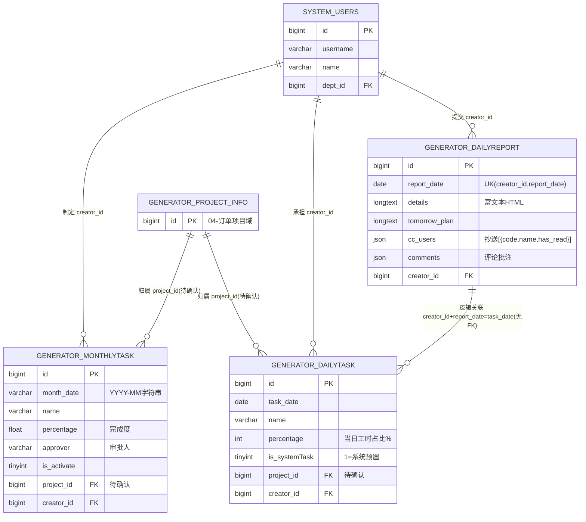

# 日报任务模块 · fuadmin 数据字典
> 域: 05-人事系统域 | 表数: 3 | 用途: Agent基础文件 | 生成: 2026-07-23

# dailyreport-日报任务 模块概述

日报任务是老板和管理层每天必看的核心管理模块，承载全员"日报提交—任务拆解—月度目标"三层管理闭环。`generator_dailyreport` 是日报主表（约5904行），每人每天一条（creator_id+report_date 唯一约束），内容为富文本 HTML，支持抄送（cc_users JSON 含已读标记）和评论（comments JSON）。`generator_dailytask`（约12784行）按天记录员工在各部门/项目上的任务及投入占比，`generator_monthlytask`（约754行）按月设定任务目标与完成度，支持审批人（approver）与激活标记。三张表共同回答老板最关心的问题："每个人昨天干了什么、干得怎么样、这个月进度如何"。

# dailyreport-日报任务 上岗指南

## 2.1 核心实体与定义

| 实体（表） | 业务定义 |
|---|---|
| generator_dailyreport | 日报主表：每人每天一条，富文本当日总结+明日计划，支持抄送与评论 |
| generator_dailytask | 日任务表：员工某天在某项目上的任务记录，percentage 为当日工时投入占比 |
| generator_monthlytask | 月任务表：按 YYYY-MM 设定的月度任务目标，percentage 为完成度，含审批人 |

关键字段语义（从样本推断）：

- `generator_dailyreport.details`：富文本 HTML（`<p>` 标签包裹），当日工作内容。
- `generator_dailyreport.tomorrow_plan`：明日计划，样本中多为空——员工常不写，分析时注意非强制。
- `generator_dailyreport.cc_users`：JSON 数组，元素形如 `{"code":"10000","name":"某某","has_read":...}`，含已读标记，支撑"老板已读/未读"统计。
- `generator_dailyreport.comments`：JSON 数组，评论（领导批注）存放处，结构待确认。
- `generator_dailytask.percentage`：当日该任务工时占比（%）。样本中同一员工同一天两条记录 5%（日常会议）+95%（项目任务）= 100%，可视为"当日工时分布"。
- `generator_dailytask.is_systemTask`：1=系统预置任务（如"日常会议"，name 有值且不挂具体业务项目）；0=员工自选项目任务（name 可能为空，靠 project_id 关联）。
- `generator_monthlytask.month_date`：字符串 `YYYY-MM`（如 `2025-05`），不是 date 类型。
- `generator_monthlytask.approver`：审批人（varchar，存姓名或工号，样本为空，格式待确认）。
- `generator_monthlytask.is_activate`：是否激活生效。

## 2.2 业务流

```
月初：员工/主管在 generator_monthlytask 设定本月任务（project_id 关联项目，
      approver 审批，is_activate=1 生效）
  ↓
每日：员工提交日报 generator_dailyreport（details 当日总结 + tomorrow_plan 明日计划，
      唯一约束 creator_id+report_date 保证一人一天一条；
      同时写入 generator_dailytask 当日任务明细：系统任务（如日常会议 is_systemTask=1）
      + 项目任务（is_systemTask=0, project_id 关联项目），percentage 合计≈100%）
  ↓
抄送与批阅：cc_users 中的领导收到抄送，has_read 标记已读；
      领导可在 comments 写批注
  ↓
月底：monthlytask.percentage 汇总完成度，approver 审批确认，
      供月度复盘/绩效参考
```

从样本推断的典型场景（creator_id=169，2025-04-07/08 连续两天提交日报，当日 dailytask 同步生成 5% 日常会议 + 95% 项目任务）：日报与日任务是"主表—明细"式的同日联动写入（两表 create_datetime 仅差毫秒级），可判定为同一事务保存。

## 2.3 常见查询场景

**场景1：老板看板——某员工本月所有日报**

```sql
SELECT r.report_date, r.details, r.tomorrow_plan, r.create_datetime
FROM generator_dailyreport r
WHERE r.creator_id = 169
  AND r.report_date >= '2025-04-01' AND r.report_date < '2025-05-01'
ORDER BY r.report_date DESC;
```

**场景2：某天全公司谁没交日报（未交名单）**

```sql
SELECT u.id, u.name, u.username
FROM system_users u
WHERE u.is_active = 1 AND u.is_delete = 0
  AND NOT EXISTS (
    SELECT 1 FROM generator_dailyreport r
    WHERE r.creator_id = u.id AND r.report_date = '2025-04-08'
  );
```

**场景3：某员工某天的工时分布（日任务明细）**

```sql
SELECT t.task_date, t.name, t.is_systemTask, t.project_id, t.percentage
FROM generator_dailytask t
WHERE t.creator_id = 169 AND t.task_date = '2025-04-07'
ORDER BY t.percentage DESC;
```

**场景4：某员工本月任务完成度（月任务）**

```sql
SELECT m.month_date, m.name, m.percentage, m.approver, m.is_activate
FROM generator_monthlytask m
WHERE m.creator_id = 169 AND m.month_date = '2025-05';
```

**场景5：抄送给某领导的未读日报（has_read 解析，MySQL JSON 查询）**

```sql
SELECT r.id, r.report_date, r.creator_id,
       jt.name AS cc_name, jt.has_read
FROM generator_dailyreport r,
JSON_TABLE(r.cc_users, '$[*]' COLUMNS (
    code VARCHAR(20) PATH '$.code',
    name VARCHAR(50) PATH '$.name',
    has_read VARCHAR(10) PATH '$.has_read'
)) jt
WHERE jt.code = '10000' AND r.report_date >= '2025-04-01';
-- has_read 的确切取值（true/false 或 0/1）待确认，样本被截断
```

**场景6：部门日报提交率（按天统计）**

```sql
SELECT r.report_date, u.belong_dept, COUNT(*) AS submitted
FROM generator_dailyreport r
JOIN system_users u ON u.id = r.creator_id
WHERE r.report_date BETWEEN '2025-04-01' AND '2025-04-30'
GROUP BY r.report_date, u.belong_dept
ORDER BY r.report_date, submitted DESC;
```

**场景7：项目人力投入汇总（日任务按项目聚合）**

```sql
SELECT t.project_id, COUNT(DISTINCT t.creator_id) AS people,
       COUNT(DISTINCT t.task_date) AS days,
       SUM(t.percentage) / 100.0 AS man_days
FROM generator_dailytask t
WHERE t.task_date BETWEEN '2025-04-01' AND '2025-04-30'
  AND t.is_systemTask = 0
GROUP BY t.project_id
ORDER BY man_days DESC;
```

## 2.4 避坑指南

1. **details/tomorrow_plan 是 HTML 富文本**：直接报表展示会带 `<p>&nbsp;` 等标签，导出前需去标签；全文检索注意 HTML 实体。
2. **一人一天一条是硬约束**：`creator_id+report_date` 唯一索引，补交历史日报要按 report_date 落位，程序重复提交会撞唯一键。
3. **日报与日任务不是外键关联**：dailytask 没有 dailyreport_id，靠 `creator_id + task_date = report_date` 逻辑关联；存在只交任务不写日报（或反之）的脏数据可能。
4. **month_date 是字符串**：`YYYY-MM` 格式，不要用日期函数直接比较，范围查询用字符串比较即可（格式固定时可比）。
5. **percentage 语义两张表不同**：dailytask 是"当日工时占比"（同日同人合计≈100%），monthlytask 是"完成度"，混用会得出荒谬结论。
6. **cc_users/comments 是 JSON**：MySQL 5.7 用 `JSON_EXTRACT`，8.0 可用 `JSON_TABLE`；JSON 字段无索引，大表按 cc 人检索很慢，应先按 report_date 缩小范围。
7. **project_id 指向待确认**：大概率指向 04-订单项目域 `generator_project_info`，未验证；is_systemTask=1 的记录 project_id 也可能有值（样本中为1），不要用它过滤系统任务。
8. **name 可空**：dailytask/monthlytask 的 name 样本中有空串，展示时要 fallback 到项目名或"未命名任务"。

## 3 数据字典

### generator_dailyreport（约 5904 行）
业务定义: 员工日报主表：每人每天一条富文本总结+明日计划，含抄送与评论 ｜ 表注释: -

| 字段 | 类型 | 可空 | 键 | 原始注释 | 推断语义 | 置信度 |
|---|---|---|---|---|---|---|
| id | bigint | N | PRI | - | 主键ID | high |
| remark | varchar(255) | Y | - | - | 备注 | high |
| modifier | varchar(255) | Y | - | - | 最后修改人姓名 | high |
| belong_dept | int | Y | - | - | 所属部门ID | mid |
| update_datetime | datetime(6) | Y | - | - | 最后更新时间 | high |
| create_datetime | datetime(6) | Y | - | - | 创建时间 | high |
| sort | int | Y | - | - | 排序号 | high |
| report_date | date | N | - | - | 日期[推断] | high |
| details | longtext | Y | - | - | 待确认 | low |
| tomorrow_plan | longtext | Y | - | - | 计划值[推断] | mid |
| creator_id | bigint | Y | MUL | - | 创建人ID → system_users.id | high |
| cc_users | json | Y | - | - | 用户[推断] | mid |
| comments | json | Y | - | - | 待确认 | low |

### generator_dailytask（约 12784 行）
业务定义: 日任务明细：员工当天各项目任务及工时占比，关联日报日期 ｜ 表注释: -

| 字段 | 类型 | 可空 | 键 | 原始注释 | 推断语义 | 置信度 |
|---|---|---|---|---|---|---|
| id | bigint | N | PRI | - | 主键ID | high |
| remark | varchar(255) | Y | - | - | 备注 | high |
| modifier | varchar(255) | Y | - | - | 最后修改人姓名 | high |
| belong_dept | int | Y | - | - | 所属部门ID | mid |
| update_datetime | datetime(6) | Y | - | - | 最后更新时间 | high |
| create_datetime | datetime(6) | Y | - | - | 创建时间 | high |
| sort | int | Y | - | - | 排序号 | high |
| task_date | date | N | - | - | 日期[推断] | high |
| percentage | int | N | - | - | 比率/百分比[推断] | high |
| creator_id | bigint | Y | MUL | - | 创建人ID → system_users.id | high |
| project_id | bigint | Y | MUL | - | 关联ID → go_view_project.id[推断] | mid |
| is_systemTask | tinyint(1) | N | - | - | 标志位（布尔）[推断] | mid |
| name | varchar(50) | Y | - | - | 名称[推断] | high |

### generator_monthlytask（约 754 行）
业务定义: 月度任务表：按月设定任务目标与完成度，含审批人和激活标记 ｜ 表注释: -

| 字段 | 类型 | 可空 | 键 | 原始注释 | 推断语义 | 置信度 |
|---|---|---|---|---|---|---|
| id | bigint | N | PRI | - | 主键ID | high |
| remark | varchar(255) | Y | - | - | 备注 | high |
| modifier | varchar(255) | Y | - | - | 最后修改人姓名 | high |
| belong_dept | int | Y | - | - | 所属部门ID | mid |
| update_datetime | datetime(6) | Y | - | - | 最后更新时间 | high |
| create_datetime | datetime(6) | Y | - | - | 创建时间 | high |
| sort | int | Y | - | - | 排序号 | high |
| month_date | varchar(10) | N | - | - | 日期[推断] | high |
| name | varchar(50) | Y | - | - | 名称[推断] | high |
| percentage | float(11,2) | N | - | - | 比率/百分比[推断] | high |
| is_systemTask | tinyint(1) | N | - | - | 标志位（布尔）[推断] | mid |
| creator_id | bigint | Y | MUL | - | 创建人ID → system_users.id | high |
| project_id | bigint | Y | MUL | - | 关联ID → go_view_project.id[推断] | mid |
| approver | varchar(15) | Y | - | - | 审核人[推断] | mid |
| is_activate | tinyint(1) | N | - | - | 标志位（布尔）[推断] | mid |

# dailyreport-日报任务 ER 图



说明：日报与日任务无物理外键，按"同一人同一天"逻辑关联；月任务与日任务按 project_id + 月份维度汇总对应。

# dailyreport-日报任务 跨模块接口

| 本模块表.字段 | 目标模块.表 | 关系 | 说明 |
|---|---|---|---|
| generator_dailyreport.creator_id | 05-人事系统域/system-用户权限.system_users.id | 多对一 | 日报提交人 |
| generator_dailytask.creator_id | 05-人事系统域/system-用户权限.system_users.id | 多对一 | 任务承担人 |
| generator_monthlytask.creator_id | 05-人事系统域/system-用户权限.system_users.id | 多对一 | 月任务制定人 |
| generator_dailytask.project_id | 04-订单项目域/project-项目.generator_project_info.id（待确认） | 多对一 | 任务所属项目 |
| generator_monthlytask.project_id | 04-订单项目域/project-项目.generator_project_info.id（待确认） | 多对一 | 任务所属项目 |
| generator_dailyreport.cc_users | system_users（JSON内含工号code/姓名name） | 逻辑引用 | 抄送人列表，非外键 |
| 月度完成度 | 绩效/人力分析（generator_user_product_matrix 等） | 逻辑关联 | 供月度复盘参考，无直接FK |

## 6 字段备注改进建议

（待 enrich 补充）

## 相关页面
- [[fuadmin数据字典总览]]
- [[人力能力模块-fuadmin数据字典]]
- [[用户权限模块-fuadmin数据字典]]
- [[考勤打卡模块-fuadmin数据字典]]
