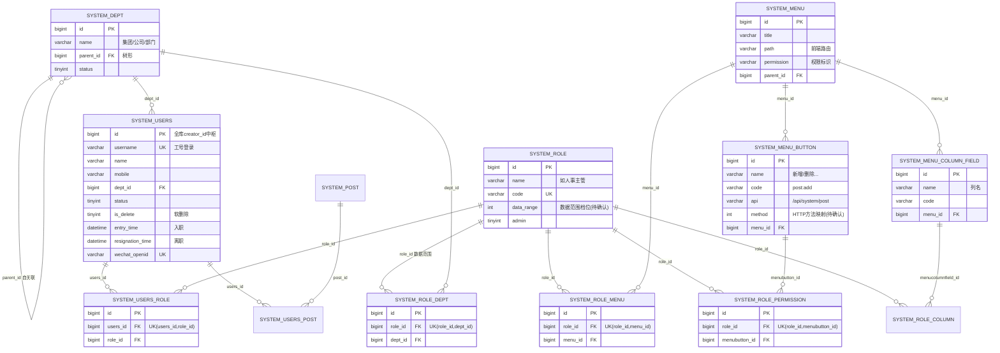

# 用户权限模块 · fuadmin 数据字典
> 域: 05-人事系统域 | 表数: 29 | 用途: Agent基础文件 | 生成: 2026-07-23

# system-用户权限 模块概述

system-用户权限是"治通"MES/ERP 的基座模块，共29张表，承载员工用户、组织架构、角色权限与系统配置四大职能。核心主表 `system_users`（约1625行）是全厂员工用户档案，django_admin_log、各业务表 creator_id、历史表 history_user_id 均外键指向它，是全库被引用最多的表。权限体系基于"用户—角色—菜单/按钮/数据列"三级模型：`system_users_role`→`system_role`→`system_role_menu`/`system_role_permission`/`system_role_column`，另通过 `system_role_dept` 实现按部门的数据范围控制（data_range）。部门 `system_dept` 为树形结构（集团→公司→部门），岗位 `system_post` 与用户多对多。其余为字典、文件、菜单、代码生成器模板、通知提醒、处罚票等支撑表。

# system-用户权限 上岗指南

## 2.1 核心实体与定义

| 实体（表） | 业务定义 |
|---|---|
| system_users | 员工用户主表：登录账号+姓名+工号体系+部门+入离职，全库 creator_id 中枢 |
| system_dept | 部门树：集团→公司（如上海智机）→部门，parent_id 自关联 |
| system_role | 角色：权限包（如人事主管、泰峰厂长），data_range 控制数据可见范围 |
| system_menu | 菜单树：前端路由+权限标识 permission |
| system_menu_button | 菜单下按钮/接口权限点（code 如 post:add，api+method 绑定后端） |
| system_menu_column_field | 菜单列表可授权的数据列（按角色控制列可见性） |
| system_users_role / system_users_post | 用户-角色、用户-岗位多对多桥表 |
| system_role_menu / system_role_permission / system_role_column / system_role_dept | 角色的菜单/按钮/数据列/数据部门授权桥表 |
| system_post | 岗位字典（总经理、技术员等，code 数字越小级别越高，样本：总经理=99 待确认排序方向） |
| system_dict / system_dict_item | 字典主表+字典项（如早/晚班、工作状态） |
| system_login_log | 登录日志（含 IP/地理位置/设备，当前 0 行，可能未启用或定期清理，待确认） |
| generator_authorization | 授权码表：code+userinfo（工号 姓名），疑似扫码/外部授权凭证 |
| generator_inform | 通知提醒：证书到期/系统模块提醒，remind_user JSON 存用户ID数组 |
| generator_users_ticket | 人员处罚票关联：用户罚单（金额、处罚方式、本人确认 i_agree） |

关键字段语义：

- `system_users.dept_id`→system_dept；`dept_level` 冗余部门层级；`work_dept`/`regulatory_dept` 为 JSON 数组（多部门工作/监管范围）。
- `system_users.is_delete` 软删除标记；`resignation_time` 离职时间，`entry_time` 入职时间。
- `system_users.username` 唯一，员工登录多为工号；`wechat_openid` 唯一，企业微信扫码登录凭证。
- `system_role.data_range` 整数枚举（样本=4），含义待确认，推测为"本部门及以下/自定部门"类数据范围档位。
- `system_menu_button.method` 整型映射 HTTP 方法（样本 1=POST 新增、3=DELETE 删除，映射表待确认）。

## 2.2 业务流

```
入职建档：HR 建 system_users（username=工号，dept_id 落部门，
          entry_time 入职）→ 同步 generator_roster 花名册
  ↓
授权：管理员在 system_users_role 挂角色；
      角色经 system_role_menu/permission/column 决定能看哪些菜单、
      能点哪些按钮、列表能看哪些列；
      system_role_dept + role.data_range 决定能看哪些部门的数据
  ↓
日常使用：登录（username+password pbkdf2 或 wechat_openid 扫码）
      → 业务操作落各表 creator_id=users.id → django_admin_log 记变更
  ↓
离职：is_delete=1 / status=0 / 写 resignation_time（账号保留不物理删，
      保证历史 creator_id 可追溯）
```

## 2.3 常见查询场景

**场景1：某员工的角色与数据权限全貌**

```sql
SELECT u.id, u.username, u.name, d.name AS dept, r.name AS role, r.data_range
FROM system_users u
LEFT JOIN system_dept d ON d.id = u.dept_id
LEFT JOIN system_users_role ur ON ur.users_id = u.id
LEFT JOIN system_role r ON r.id = ur.role_id
WHERE u.id = 169 AND u.is_delete = 0;
```

**场景2：某角色拥有的按钮级权限点**

```sql
SELECT r.name AS role, m.title AS menu, b.name AS button, b.code, b.api
FROM system_role_permission rp
JOIN system_role r ON r.id = rp.role_id
JOIN system_menu_button b ON b.id = rp.menubutton_id
JOIN system_menu m ON m.id = b.menu_id
WHERE r.code = 'official_supervisor'
ORDER BY m.id, b.sort;
```

**场景3：在职员工名单（按部门）**

```sql
SELECT d.name AS dept, u.username, u.name, u.mobile, u.entry_time
FROM system_users u
JOIN system_dept d ON d.id = u.dept_id
WHERE u.is_delete = 0 AND u.status = 1 AND u.resignation_time IS NULL
ORDER BY d.sort, u.username;
```

**场景4：部门树递归（查某公司下所有子部门）**

```sql
WITH RECURSIVE dept_tree AS (
  SELECT id, name, parent_id, 1 AS lvl FROM system_dept WHERE id = 2
  UNION ALL
  SELECT d.id, d.name, d.parent_id, t.lvl+1
  FROM system_dept d JOIN dept_tree t ON d.parent_id = t.id
)
SELECT * FROM dept_tree;
```

**场景5：查某员工可见的菜单（前端鉴权回显）**

```sql
SELECT DISTINCT m.id, m.title, m.path, m.permission, m.parent_id
FROM system_users_role ur
JOIN system_role_menu rm ON rm.role_id = ur.role_id
JOIN system_menu m ON m.id = rm.menu_id
WHERE ur.users_id = 169 AND m.status = 1
ORDER BY m.sort;
```

**场景6：证书/事项到期提醒收件人解析**

```sql
SELECT i.id, i.name, i.type, i.end_time, jt.user_id, u.name AS user_name
FROM generator_inform i,
JSON_TABLE(i.remind_user, '$[*]' COLUMNS (user_id BIGINT PATH '$')) jt
LEFT JOIN system_users u ON u.id = jt.user_id
WHERE i.end_time BETWEEN CURDATE() AND DATE_ADD(CURDATE(), INTERVAL 30 DAY);
```

**场景7：员工处罚票台账**

```sql
SELECT t.id, t.name AS employee, t.punishment_method, t.sum, t.i_agree, t.create_datetime
FROM generator_users_ticket t
WHERE t.is_active = 1
ORDER BY t.create_datetime DESC
LIMIT 50;
```

## 2.4 避坑指南

1. **system_users 绝不可物理删**：全库 creator_id/history_user_id 悬挂引用，离职走 is_delete/status/resignation_time 软删除。
2. **用户-角色是多对多**：一个员工可多个角色（样本：superadmin 挂 role 27），判权要并集，别当成单角色。
3. **data_range 语义待确认**：数值枚举（样本=4），改角色前先在测试环境验证数据可见范围。
4. **dept 有 belong_dept 与 dept_id 两套**：system_users.dept_id 是外键主归属，belong_dept 是 int 冗余（来源框架），work_dept/regulatory_dept 是 JSON 多部门，三套并存易混。
5. **system_login_log 当前为空**：不要基于它做在线统计；审计登录查 django_admin_log 或网关日志（待确认）。
6. **system_file 5.7万行且 url 相对路径**：文件查询避免全表扫描，按 create_datetime 过滤；md5sum 可空。
7. **桥表都有 (role_id, xxx_id) 唯一索引**：重复授权会撞唯一键，批量授权先查重。
8. **generator_inform.remind_user 是 JSON 数组存用户ID**：样本 [169]、[21,197,635]，别和 cc_users（对象数组）结构搞混。
9. **method 字段映射**：menu_button.method 样本 1/3 对应 HTTP 方法的确切映射待确认，勿硬编码猜测。
10. **system_area 3440 行全国行政区**：仅作地址下拉，别当业务表 join 大查询。

## 3 数据字典

### system_api_white_list（约 0 行）
业务定义: API白名单：免鉴权接口URL配置，当前未使用 ｜ 表注释: -

| 字段 | 类型 | 可空 | 键 | 原始注释 | 推断语义 | 置信度 |
|---|---|---|---|---|---|---|
| id | bigint | N | PRI | - | 主键ID | high |
| remark | varchar(255) | Y | - | - | 备注 | high |
| modifier | varchar(255) | Y | - | - | 最后修改人姓名 | high |
| belong_dept | int | Y | - | - | 所属部门ID | mid |
| update_datetime | datetime(6) | Y | - | - | 最后更新时间 | high |
| create_datetime | datetime(6) | Y | - | - | 创建时间 | high |
| sort | int | Y | - | - | 排序号 | high |
| url | varchar(200) | N | - | - | 路径/链接[推断] | mid |
| method | int | Y | - | - | 数值字段[推断-待确认] | low |
| enable_datasource | tinyint(1) | N | - | - | 数值字段[推断-待确认] | low |
| creator_id | bigint | Y | MUL | - | 创建人ID → system_users.id | high |

### system_area（约 3440 行）
业务定义: 全国行政区划表：省市区编码与拼音 ｜ 表注释: -

| 字段 | 类型 | 可空 | 键 | 原始注释 | 推断语义 | 置信度 |
|---|---|---|---|---|---|---|
| id | bigint | N | PRI | - | 主键ID | high |
| remark | varchar(255) | Y | - | - | 备注 | high |
| modifier | varchar(255) | Y | - | - | 最后修改人姓名 | high |
| belong_dept | int | Y | - | - | 所属部门ID | mid |
| update_datetime | datetime(6) | Y | - | - | 最后更新时间 | high |
| create_datetime | datetime(6) | Y | - | - | 创建时间 | high |
| sort | int | Y | - | - | 排序号 | high |
| name | varchar(100) | N | - | - | 名称[推断] | high |
| code | varchar(20) | N | UNI | - | 编号/代码[推断] | mid |
| level | bigint | N | - | - | 等级[推断] | mid |
| pinyin | varchar(255) | N | - | - | 文本字段[推断-待确认] | low |
| initials | varchar(20) | N | - | - | 文本字段[推断-待确认] | low |
| enable | tinyint(1) | N | - | - | 数值字段[推断-待确认] | low |
| creator_id | bigint | Y | MUL | - | 创建人ID → system_users.id | high |
| pcode_id | varchar(20) | Y | MUL | - | 关联ID（目标表待确认）[推断] | low |

### system_button（约 0 行）
业务定义: 按钮定义表：独立按钮编码，当前未使用 ｜ 表注释: -

| 字段 | 类型 | 可空 | 键 | 原始注释 | 推断语义 | 置信度 |
|---|---|---|---|---|---|---|
| id | bigint | N | PRI | - | 主键ID | high |
| remark | varchar(255) | Y | - | - | 备注 | high |
| modifier | varchar(255) | Y | - | - | 最后修改人姓名 | high |
| belong_dept | int | Y | - | - | 所属部门ID | mid |
| update_datetime | datetime(6) | Y | - | - | 最后更新时间 | high |
| create_datetime | datetime(6) | Y | - | - | 创建时间 | high |
| sort | int | Y | - | - | 排序号 | high |
| name | varchar(64) | N | UNI | - | 名称[推断] | high |
| code | varchar(64) | N | UNI | - | 编号/代码[推断] | mid |
| status | tinyint(1) | Y | - | - | 状态（枚举值待确认）[推断] | mid |
| creator_id | bigint | Y | MUL | - | 创建人ID → system_users.id | high |

### system_category_dict（约 0 行）
业务定义: 分类字典表：树形label/value键值配置 ｜ 表注释: -

| 字段 | 类型 | 可空 | 键 | 原始注释 | 推断语义 | 置信度 |
|---|---|---|---|---|---|---|
| id | bigint | N | PRI | - | 主键ID | high |
| remark | varchar(255) | Y | - | - | 备注 | high |
| modifier | varchar(255) | Y | - | - | 最后修改人姓名 | high |
| belong_dept | int | Y | - | - | 所属部门ID | mid |
| update_datetime | datetime(6) | Y | - | - | 最后更新时间 | high |
| create_datetime | datetime(6) | Y | - | - | 创建时间 | high |
| sort | int | Y | - | - | 排序号 | high |
| label | varchar(100) | Y | - | - | 文本字段[推断-待确认] | low |
| value | varchar(100) | Y | - | - | 文本字段[推断-待确认] | low |
| code | varchar(100) | Y | UNI | - | 编号/代码[推断] | mid |
| creator_id | bigint | Y | MUL | - | 创建人ID → system_users.id | high |
| parent_id | bigint | Y | MUL | - | 关联ID（目标表待确认）[推断] | low |

### system_config（约 0 行）
业务定义: 系统配置表：JSON格式的表单化参数配置 ｜ 表注释: -

| 字段 | 类型 | 可空 | 键 | 原始注释 | 推断语义 | 置信度 |
|---|---|---|---|---|---|---|
| id | bigint | N | PRI | - | 主键ID | high |
| remark | varchar(255) | Y | - | - | 备注 | high |
| modifier | varchar(255) | Y | - | - | 最后修改人姓名 | high |
| belong_dept | int | Y | - | - | 所属部门ID | mid |
| update_datetime | datetime(6) | Y | - | - | 最后更新时间 | high |
| create_datetime | datetime(6) | Y | - | - | 创建时间 | high |
| sort | int | Y | - | - | 排序号 | high |
| title | varchar(50) | N | - | - | 标题[推断] | high |
| key | varchar(20) | N | - | - | 文本字段[推断-待确认] | low |
| value | json | Y | - | - | 待确认 | low |
| status | tinyint(1) | N | - | - | 状态（枚举值待确认）[推断] | mid |
| data_options | json | Y | - | - | 待确认 | low |
| form_item_type | int | N | - | - | 类型[推断] | mid |
| rule | json | Y | - | - | 待确认 | low |
| placeholder | varchar(50) | Y | - | - | 文本字段[推断-待确认] | low |
| setting | json | Y | - | - | 待确认 | low |
| creator_id | bigint | Y | MUL | - | 创建人ID → system_users.id | high |
| parent_id | bigint | Y | MUL | - | 关联ID（目标表待确认）[推断] | low |

### system_dept（约 27 行）
业务定义: 部门树：集团到公司的多级组织架构，parent_id自关联 ｜ 表注释: -

| 字段 | 类型 | 可空 | 键 | 原始注释 | 推断语义 | 置信度 |
|---|---|---|---|---|---|---|
| id | bigint | N | PRI | - | 主键ID | high |
| remark | varchar(255) | Y | - | - | 备注 | high |
| modifier | varchar(255) | Y | - | - | 最后修改人姓名 | high |
| belong_dept | int | Y | - | - | 所属部门ID | mid |
| update_datetime | datetime(6) | Y | - | - | 最后更新时间 | high |
| create_datetime | datetime(6) | Y | - | - | 创建时间 | high |
| sort | int | Y | - | - | 排序号 | high |
| name | varchar(64) | N | - | - | 名称[推断] | high |
| owner | varchar(32) | Y | - | - | 文本字段[推断-待确认] | low |
| phone | varchar(32) | Y | - | - | 联系电话[推断] | high |
| email | varchar(32) | Y | - | - | 电子邮箱[推断] | high |
| status | tinyint(1) | Y | - | - | 状态（枚举值待确认）[推断] | mid |
| creator_id | bigint | Y | MUL | - | 创建人ID → system_users.id | high |
| parent_id | bigint | Y | MUL | - | 关联ID（目标表待确认）[推断] | low |

### system_dict（约 9 行）
业务定义: 字典主表：早晚班、工作状态等业务枚举分组 ｜ 表注释: -

| 字段 | 类型 | 可空 | 键 | 原始注释 | 推断语义 | 置信度 |
|---|---|---|---|---|---|---|
| id | bigint | N | PRI | - | 主键ID | high |
| remark | varchar(255) | Y | - | - | 备注 | high |
| modifier | varchar(255) | Y | - | - | 最后修改人姓名 | high |
| belong_dept | int | Y | - | - | 所属部门ID | mid |
| update_datetime | datetime(6) | Y | - | - | 最后更新时间 | high |
| create_datetime | datetime(6) | Y | - | - | 创建时间 | high |
| sort | int | Y | - | - | 排序号 | high |
| name | varchar(100) | Y | - | - | 名称[推断] | high |
| code | varchar(100) | Y | - | - | 编号/代码[推断] | mid |
| status | tinyint(1) | N | - | - | 状态（枚举值待确认）[推断] | mid |
| creator_id | bigint | Y | MUL | - | 创建人ID → system_users.id | high |

### system_dict_item（约 36 行）
业务定义: 字典项表：字典分组下的具体取值标签 ｜ 表注释: -

| 字段 | 类型 | 可空 | 键 | 原始注释 | 推断语义 | 置信度 |
|---|---|---|---|---|---|---|
| id | bigint | N | PRI | - | 主键ID | high |
| modifier | varchar(255) | Y | - | - | 最后修改人姓名 | high |
| belong_dept | int | Y | - | - | 所属部门ID | mid |
| update_datetime | datetime(6) | Y | - | - | 最后更新时间 | high |
| create_datetime | datetime(6) | Y | - | - | 创建时间 | high |
| sort | int | Y | - | - | 排序号 | high |
| icon | varchar(100) | Y | - | - | 文本字段[推断-待确认] | low |
| label | varchar(100) | Y | - | - | 文本字段[推断-待确认] | low |
| value | varchar(100) | Y | - | - | 文本字段[推断-待确认] | low |
| status | tinyint(1) | N | - | - | 状态（枚举值待确认）[推断] | mid |
| remark | varchar(2000) | Y | - | - | 备注 | high |
| creator_id | bigint | Y | MUL | - | 创建人ID → system_users.id | high |
| dict_id | bigint | N | MUL | - | 关联ID → system_category_dict.id[推断] | mid |

### system_file（约 57721 行）
业务定义: 文件存储登记表：上传文件的URL、大小、MD5 ｜ 表注释: -

| 字段 | 类型 | 可空 | 键 | 原始注释 | 推断语义 | 置信度 |
|---|---|---|---|---|---|---|
| id | bigint | N | PRI | - | 主键ID | high |
| remark | varchar(255) | Y | - | - | 备注 | high |
| modifier | varchar(255) | Y | - | - | 最后修改人姓名 | high |
| belong_dept | int | Y | - | - | 所属部门ID | mid |
| update_datetime | datetime(6) | Y | - | - | 最后更新时间 | high |
| create_datetime | datetime(6) | Y | - | - | 创建时间 | high |
| sort | int | Y | - | - | 排序号 | high |
| name | varchar(255) | Y | - | - | 名称[推断] | high |
| save_name | varchar(255) | Y | - | - | 名称[推断] | high |
| url | varchar(100) | N | - | - | 路径/链接[推断] | mid |
| size | bigint | Y | - | - | 尺寸[推断] | mid |
| md5sum | varchar(36) | N | - | - | 文本字段[推断-待确认] | low |
| creator_id | bigint | Y | MUL | - | 创建人ID → system_users.id | high |

### system_generator_template（约 54 行）
业务定义: 代码生成器模板：表单与表格JSON定义 ｜ 表注释: -

| 字段 | 类型 | 可空 | 键 | 原始注释 | 推断语义 | 置信度 |
|---|---|---|---|---|---|---|
| id | bigint | N | PRI | - | 主键ID | high |
| remark | varchar(255) | Y | - | - | 备注 | high |
| modifier | varchar(255) | Y | - | - | 最后修改人姓名 | high |
| belong_dept | int | Y | - | - | 所属部门ID | mid |
| update_datetime | datetime(6) | Y | - | - | 最后更新时间 | high |
| create_datetime | datetime(6) | Y | - | - | 创建时间 | high |
| sort | int | Y | - | - | 排序号 | high |
| name | varchar(64) | N | - | - | 名称[推断] | high |
| code | varchar(32) | N | - | - | 编号/代码[推断] | mid |
| form_info | longtext | N | - | - | 待确认 | low |
| table_info | longtext | N | - | - | 待确认 | low |
| has_menu | tinyint(1) | N | - | - | 数值字段[推断-待确认] | low |
| creator_id | bigint | Y | MUL | - | 创建人ID → system_users.id | high |

### system_login_log（约 0 行）
业务定义: 登录日志：IP、地理位置、设备指纹，当前无数据 ｜ 表注释: -

| 字段 | 类型 | 可空 | 键 | 原始注释 | 推断语义 | 置信度 |
|---|---|---|---|---|---|---|
| id | bigint | N | PRI | - | 主键ID | high |
| username | varchar(150) | Y | - | - | 名称[推断] | high |
| ip | varchar(50) | Y | - | - | IP地址[推断] | high |
| agent | varchar(255) | Y | - | - | 文本字段[推断-待确认] | low |
| browser | varchar(100) | Y | - | - | 文本字段[推断-待确认] | low |
| os | varchar(100) | Y | - | - | 文本字段[推断-待确认] | low |
| continent | varchar(50) | Y | - | - | 文本字段[推断-待确认] | low |
| country | varchar(50) | Y | - | - | 文本字段[推断-待确认] | low |
| country_code | varchar(20) | Y | - | - | 编号/代码[推断] | mid |
| country_english | varchar(100) | Y | - | - | 文本字段[推断-待确认] | low |
| province | varchar(50) | Y | - | - | 文本字段[推断-待确认] | low |
| city | varchar(50) | Y | - | - | 文本字段[推断-待确认] | low |
| district | varchar(50) | Y | - | - | 文本字段[推断-待确认] | low |
| isp | varchar(100) | Y | - | - | 文本字段[推断-待确认] | low |
| area_code | varchar(20) | Y | - | - | 编号/代码[推断] | mid |
| belong_dept | varchar(100) | Y | - | - | 所属部门ID | mid |
| login_type | varchar(20) | Y | - | - | 类型[推断] | mid |
| latitude | double | Y | - | - | 数值（小数）[推断-待确认] | low |
| longitude | double | Y | - | - | 数值（小数）[推断-待确认] | low |
| creator_id | bigint | Y | - | - | 创建人ID → system_users.id | high |
| modifier | varchar(100) | Y | - | - | 最后修改人姓名 | high |
| remark | varchar(255) | Y | - | - | 备注 | high |
| sort | int | Y | - | - | 排序号 | high |
| create_datetime | datetime | Y | - | - | 创建时间 | high |
| update_datetime | datetime | Y | - | - | 最后更新时间 | high |

### system_menu（约 259 行）
业务定义: 系统菜单树：前端路由、图标与权限标识 ｜ 表注释: -

| 字段 | 类型 | 可空 | 键 | 原始注释 | 推断语义 | 置信度 |
|---|---|---|---|---|---|---|
| id | bigint | N | PRI | - | 主键ID | high |
| remark | varchar(255) | Y | - | - | 备注 | high |
| modifier | varchar(255) | Y | - | - | 最后修改人姓名 | high |
| belong_dept | int | Y | - | - | 所属部门ID | mid |
| update_datetime | datetime(6) | Y | - | - | 最后更新时间 | high |
| create_datetime | datetime(6) | Y | - | - | 创建时间 | high |
| sort | int | Y | - | - | 排序号 | high |
| icon | varchar(64) | N | - | - | 文本字段[推断-待确认] | low |
| title | varchar(64) | N | - | - | 标题[推断] | high |
| permission | varchar(64) | Y | - | - | 权限[推断] | mid |
| is_ext | tinyint(1) | N | - | - | 标志位（布尔）[推断] | mid |
| type | int | N | - | - | 类型[推断] | mid |
| path | varchar(128) | Y | - | - | 路径/链接[推断] | mid |
| redirect | varchar(128) | Y | - | - | 文本字段[推断-待确认] | low |
| component | varchar(128) | Y | - | - | 文本字段[推断-待确认] | low |
| name | varchar(50) | Y | - | - | 名称[推断] | high |
| status | tinyint(1) | N | - | - | 状态（枚举值待确认）[推断] | mid |
| keepalive | tinyint(1) | N | - | - | 数值字段[推断-待确认] | low |
| hide_menu | tinyint(1) | N | - | - | 数值字段[推断-待确认] | low |
| creator_id | bigint | Y | MUL | - | 创建人ID → system_users.id | high |
| parent_id | bigint | Y | MUL | - | 关联ID（目标表待确认）[推断] | low |

### system_menu_button（约 1015 行）
业务定义: 菜单按钮权限点：绑定后端API与方法，按钮级鉴权 ｜ 表注释: -

| 字段 | 类型 | 可空 | 键 | 原始注释 | 推断语义 | 置信度 |
|---|---|---|---|---|---|---|
| id | bigint | N | PRI | - | 主键ID | high |
| remark | varchar(255) | Y | - | - | 备注 | high |
| modifier | varchar(255) | Y | - | - | 最后修改人姓名 | high |
| belong_dept | int | Y | - | - | 所属部门ID | mid |
| update_datetime | datetime(6) | Y | - | - | 最后更新时间 | high |
| create_datetime | datetime(6) | Y | - | - | 创建时间 | high |
| sort | int | Y | - | - | 排序号 | high |
| name | varchar(64) | N | - | - | 名称[推断] | high |
| code | varchar(64) | N | - | - | 编号/代码[推断] | mid |
| api | varchar(200) | N | - | - | 文本字段[推断-待确认] | low |
| method | int | Y | - | - | 数值字段[推断-待确认] | low |
| creator_id | bigint | Y | MUL | - | 创建人ID → system_users.id | high |
| menu_id | bigint | N | MUL | - | 关联ID → system_menu.id[推断] | mid |

### system_menu_column_field（约 1203 行）
业务定义: 菜单数据列权限：控制角色可见的列表字段 ｜ 表注释: -

| 字段 | 类型 | 可空 | 键 | 原始注释 | 推断语义 | 置信度 |
|---|---|---|---|---|---|---|
| id | bigint | N | PRI | - | 主键ID | high |
| remark | varchar(255) | Y | - | - | 备注 | high |
| modifier | varchar(255) | Y | - | - | 最后修改人姓名 | high |
| belong_dept | int | Y | - | - | 所属部门ID | mid |
| update_datetime | datetime(6) | Y | - | - | 最后更新时间 | high |
| create_datetime | datetime(6) | Y | - | - | 创建时间 | high |
| sort | int | Y | - | - | 排序号 | high |
| name | varchar(64) | N | - | - | 名称[推断] | high |
| code | varchar(64) | N | - | - | 编号/代码[推断] | mid |
| creator_id | bigint | Y | MUL | - | 创建人ID → system_users.id | high |
| menu_id | bigint | N | MUL | - | 关联ID → system_menu.id[推断] | mid |

### system_post（约 40 行）
业务定义: 岗位字典：总经理、技术员等职位编码 ｜ 表注释: -

| 字段 | 类型 | 可空 | 键 | 原始注释 | 推断语义 | 置信度 |
|---|---|---|---|---|---|---|
| id | bigint | N | PRI | - | 主键ID | high |
| remark | varchar(255) | Y | - | - | 备注 | high |
| modifier | varchar(255) | Y | - | - | 最后修改人姓名 | high |
| belong_dept | int | Y | - | - | 所属部门ID | mid |
| update_datetime | datetime(6) | Y | - | - | 最后更新时间 | high |
| create_datetime | datetime(6) | Y | - | - | 创建时间 | high |
| sort | int | Y | - | - | 排序号 | high |
| name | varchar(64) | N | - | - | 名称[推断] | high |
| code | varchar(32) | N | - | - | 编号/代码[推断] | mid |
| status | int | N | - | - | 状态（枚举值待确认）[推断] | mid |
| creator_id | bigint | Y | MUL | - | 创建人ID → system_users.id | high |

### system_product_szb（约 0 行）
业务定义: 产品PDF报告存档：工件号对应二进制报告 ｜ 表注释: -

| 字段 | 类型 | 可空 | 键 | 原始注释 | 推断语义 | 置信度 |
|---|---|---|---|---|---|---|
| id | bigint | N | PRI | - | 主键ID | high |
| product_name | varchar(255) | Y | - | - | 名称[推断] | high |
| workpiece_number | varchar(255) | Y | - | - | 编号/代码[推断] | mid |
| report_time | datetime | Y | - | - | 时间[推断] | high |
| product_id | int | Y | - | - | 关联ID → generator_bad_product.id[推断] | mid |
| report | mediumblob | Y | - | - | 待确认 | low |

### system_role（约 54 行）
业务定义: 角色表：权限包定义，data_range控制部门数据可见范围 ｜ 表注释: -

| 字段 | 类型 | 可空 | 键 | 原始注释 | 推断语义 | 置信度 |
|---|---|---|---|---|---|---|
| id | bigint | N | PRI | - | 主键ID | high |
| remark | varchar(255) | Y | - | - | 备注 | high |
| modifier | varchar(255) | Y | - | - | 最后修改人姓名 | high |
| belong_dept | int | Y | - | - | 所属部门ID | mid |
| update_datetime | datetime(6) | Y | - | - | 最后更新时间 | high |
| create_datetime | datetime(6) | Y | - | - | 创建时间 | high |
| sort | int | Y | - | - | 排序号 | high |
| name | varchar(64) | N | - | - | 名称[推断] | high |
| code | varchar(64) | N | UNI | - | 编号/代码[推断] | mid |
| status | tinyint(1) | N | - | - | 状态（枚举值待确认）[推断] | mid |
| admin | tinyint(1) | N | - | - | 数值字段[推断-待确认] | low |
| data_range | int | N | - | - | 数值字段[推断-待确认] | low |
| creator_id | bigint | Y | MUL | - | 创建人ID → system_users.id | high |

### system_role_column（约 15058 行）
业务定义: 角色-数据列授权桥表 ｜ 表注释: -

| 字段 | 类型 | 可空 | 键 | 原始注释 | 推断语义 | 置信度 |
|---|---|---|---|---|---|---|
| id | bigint | N | PRI | - | 主键ID | high |
| role_id | bigint | N | MUL | - | 关联ID → system_role.id[推断] | mid |
| menucolumnfield_id | bigint | N | MUL | - | 关联ID（目标表待确认）[推断] | low |

### system_role_dept（约 34 行）
业务定义: 角色-部门数据范围桥表 ｜ 表注释: -

| 字段 | 类型 | 可空 | 键 | 原始注释 | 推断语义 | 置信度 |
|---|---|---|---|---|---|---|
| id | bigint | N | PRI | - | 主键ID | high |
| role_id | bigint | N | MUL | - | 关联ID → system_role.id[推断] | mid |
| dept_id | bigint | N | MUL | - | 关联ID → system_dept.id[推断] | mid |

### system_role_menu（约 2607 行）
业务定义: 角色-菜单授权桥表 ｜ 表注释: -

| 字段 | 类型 | 可空 | 键 | 原始注释 | 推断语义 | 置信度 |
|---|---|---|---|---|---|---|
| id | bigint | N | PRI | - | 主键ID | high |
| role_id | bigint | N | MUL | - | 关联ID → system_role.id[推断] | mid |
| menu_id | bigint | N | MUL | - | 关联ID → system_menu.id[推断] | mid |

### system_role_permission（约 10070 行）
业务定义: 角色-按钮权限授权桥表 ｜ 表注释: -

| 字段 | 类型 | 可空 | 键 | 原始注释 | 推断语义 | 置信度 |
|---|---|---|---|---|---|---|
| id | bigint | N | PRI | - | 主键ID | high |
| role_id | bigint | N | MUL | - | 关联ID → system_role.id[推断] | mid |
| menubutton_id | bigint | N | MUL | - | 关联ID（目标表待确认）[推断] | low |

### system_users（约 1625 行）
业务定义: 员工用户主表：账号、姓名、部门、入离职，全库creator_id引用中枢 ｜ 表注释: -

| 字段 | 类型 | 可空 | 键 | 原始注释 | 推断语义 | 置信度 |
|---|---|---|---|---|---|---|
| password | varchar(128) | N | - | - | 密码（加密存储）[推断] | high |
| last_login | datetime(6) | Y | - | - | 日期时间[推断] | mid |
| is_superuser | tinyint(1) | N | - | - | 标志位（布尔）[推断] | mid |
| is_staff | tinyint(1) | N | - | - | 标志位（布尔）[推断] | mid |
| is_active | tinyint(1) | N | - | - | 标志位（布尔）[推断] | mid |
| date_joined | datetime(6) | N | - | - | 日期时间[推断] | mid |
| id | bigint | N | PRI | - | 主键ID | high |
| remark | varchar(255) | Y | - | - | 备注 | high |
| modifier | varchar(255) | Y | - | - | 最后修改人姓名 | high |
| belong_dept | int | Y | - | - | 所属部门ID | mid |
| update_datetime | datetime(6) | Y | - | - | 最后更新时间 | high |
| create_datetime | datetime(6) | Y | - | - | 创建时间 | high |
| sort | int | Y | - | - | 排序号 | high |
| username | varchar(150) | N | UNI | - | 名称[推断] | high |
| email | varchar(255) | Y | - | - | 电子邮箱[推断] | high |
| mobile | varchar(255) | Y | - | - | 联系电话[推断] | high |
| avatar | longtext | Y | - | - | 待确认 | low |
| name | varchar(40) | N | - | - | 名称[推断] | high |
| status | tinyint(1) | N | - | - | 状态（枚举值待确认）[推断] | mid |
| gender | int | Y | - | - | 性别[推断] | high |
| user_type | int | Y | - | - | 类型[推断] | mid |
| first_name | varchar(150) | Y | - | - | 名称[推断] | high |
| last_name | varchar(150) | Y | - | - | 名称[推断] | high |
| home_path | varchar(150) | Y | - | - | 路径/链接[推断] | mid |
| creator_id | bigint | Y | MUL | - | 创建人ID → system_users.id | high |
| dept_id | bigint | Y | MUL | - | 关联ID → system_dept.id[推断] | mid |
| is_delete | tinyint(1) | N | - | - | 逻辑删除标志 | high |
| wechat_id | varchar(150) | Y | - | - | 关联ID（目标表待确认）[推断] | low |
| working_type | int | Y | - | - | 类型[推断] | mid |
| resignation_time | datetime(6) | Y | - | - | 时间[推断] | high |
| dept_level | int | Y | - | - | 等级[推断] | mid |
| regulatory_dept | json | Y | - | - | 部门[推断] | high |
| work_dept | json | Y | - | - | 部门[推断] | high |
| entry_time | datetime(6) | Y | - | - | 入职时间[推断] | mid |
| wechat_openid | varchar(150) | Y | UNI | - | 文本字段[推断-待确认] | low |

### system_users_groups（约 0 行）
业务定义: Django原生用户-组桥表，当前未使用 ｜ 表注释: -

| 字段 | 类型 | 可空 | 键 | 原始注释 | 推断语义 | 置信度 |
|---|---|---|---|---|---|---|
| id | bigint | N | PRI | - | 主键ID | high |
| users_id | bigint | N | MUL | - | 关联ID → system_users.id[推断] | mid |
| group_id | int | N | MUL | - | 关联ID → system_users_groups.id[推断] | mid |

关联: group_id → auth_group.id; users_id → system_users.id

### system_users_post（约 178 行）
业务定义: 用户-岗位多对多桥表 ｜ 表注释: -

| 字段 | 类型 | 可空 | 键 | 原始注释 | 推断语义 | 置信度 |
|---|---|---|---|---|---|---|
| id | bigint | N | PRI | - | 主键ID | high |
| users_id | bigint | N | MUL | - | 关联ID → system_users.id[推断] | mid |
| post_id | bigint | N | MUL | - | 关联ID → system_post.id[推断] | mid |

### system_users_role（约 367 行）
业务定义: 用户-角色多对多桥表 ｜ 表注释: -

| 字段 | 类型 | 可空 | 键 | 原始注释 | 推断语义 | 置信度 |
|---|---|---|---|---|---|---|
| id | bigint | N | PRI | - | 主键ID | high |
| users_id | bigint | N | MUL | - | 关联ID → system_users.id[推断] | mid |
| role_id | bigint | N | MUL | - | 关联ID → system_role.id[推断] | mid |

### system_users_user_permissions（约 0 行）
业务定义: Django原生用户-权限桥表，当前未使用 ｜ 表注释: -

| 字段 | 类型 | 可空 | 键 | 原始注释 | 推断语义 | 置信度 |
|---|---|---|---|---|---|---|
| id | bigint | N | PRI | - | 主键ID | high |
| users_id | bigint | N | MUL | - | 关联ID → system_users.id[推断] | mid |
| permission_id | int | N | MUL | - | 关联ID → system_role_permission.id[推断] | mid |

关联: permission_id → auth_permission.id; users_id → system_users.id

### generator_authorization（约 78 行）
业务定义: 授权码表：code与用户信息绑定的授权凭证 ｜ 表注释: -

| 字段 | 类型 | 可空 | 键 | 原始注释 | 推断语义 | 置信度 |
|---|---|---|---|---|---|---|
| id | bigint | N | PRI | - | 主键ID | high |
| remark | varchar(255) | Y | - | - | 备注 | high |
| modifier | varchar(255) | Y | - | - | 最后修改人姓名 | high |
| belong_dept | int | Y | - | - | 所属部门ID | mid |
| update_datetime | datetime(6) | Y | - | - | 最后更新时间 | high |
| create_datetime | datetime(6) | Y | - | - | 创建时间 | high |
| sort | int | Y | - | - | 排序号 | high |
| code | varchar(100) | Y | - | - | 编号/代码[推断] | mid |
| userinfo | varchar(100) | Y | - | - | 用户[推断] | mid |
| creator_id | bigint | Y | MUL | - | 创建人ID → system_users.id | high |
| is_active | int | Y | - | - | 标志位（布尔）[推断] | mid |
| work_dept | json | Y | - | - | 部门[推断] | high |

### generator_inform（约 8 行）
业务定义: 通知提醒表：证书到期等事项定时提醒配置 ｜ 表注释: -

| 字段 | 类型 | 可空 | 键 | 原始注释 | 推断语义 | 置信度 |
|---|---|---|---|---|---|---|
| id | bigint | N | PRI | - | 主键ID | high |
| remark | varchar(255) | Y | - | - | 备注 | high |
| modifier | varchar(255) | Y | - | - | 最后修改人姓名 | high |
| belong_dept | int | Y | - | - | 所属部门ID | mid |
| update_datetime | datetime(6) | Y | - | - | 最后更新时间 | high |
| create_datetime | datetime(6) | Y | - | - | 创建时间 | high |
| sort | int | Y | - | - | 排序号 | high |
| remind_record | json | Y | - | - | 待确认 | low |
| state | int | Y | - | - | 状态（枚举值待确认）[推断] | mid |
| remind_state | json | Y | - | - | 状态（枚举值待确认）[推断] | mid |
| remind_method | json | Y | - | - | 待确认 | low |
| remind_user | json | Y | - | - | 用户[推断] | mid |
| remind_group | varchar(100) | Y | - | - | 文本字段[推断-待确认] | low |
| department | varchar(50) | Y | - | - | 部门[推断] | high |
| end_time | date | Y | - | - | 时间[推断] | high |
| start_time | date | Y | - | - | 时间[推断] | high |
| content | longtext | Y | - | - | 内容[推断] | mid |
| type | varchar(20) | Y | - | - | 类型[推断] | mid |
| name | varchar(100) | Y | - | - | 名称[推断] | high |
| creator_id | bigint | Y | MUL | - | 创建人ID → system_users.id | high |
| avatar | varchar(255) | Y | - | - | 文本字段[推断-待确认] | low |

### generator_users_ticket（约 3071 行）
业务定义: 人员处罚票：员工罚单金额、确认与关联罚单 ｜ 表注释: -

| 字段 | 类型 | 可空 | 键 | 原始注释 | 推断语义 | 置信度 |
|---|---|---|---|---|---|---|
| id | bigint | N | PRI | - | 主键ID | high |
| punishment_method | varchar(100) | Y | - | - | 文本字段[推断-待确认] | low |
| sum | decimal(10,2) | Y | - | - | 数值（小数）[推断-待确认] | low |
| update_datetime | datetime(6) | Y | - | - | 最后更新时间 | high |
| create_datetime | datetime(6) | Y | - | - | 创建时间 | high |
| i_agree | varchar(20) | Y | - | - | 文本字段[推断-待确认] | low |
| is_active | tinyint(1) | N | - | - | 标志位（布尔）[推断] | mid |
| remark | varchar(255) | Y | - | - | 备注 | high |
| ticket_id | bigint | N | MUL | - | 关联ID → generator_users_ticket.id[推断] | mid |
| users_id | bigint | N | MUL | - | 关联ID → system_users.id[推断] | mid |
| name | varchar(50) | Y | - | - | 名称[推断] | high |
| agree_user | varchar(30) | Y | - | - | 用户[推断] | mid |

# system-用户权限 ER 图（核心10实体）



简表（字典、文件、配置、登录日志、授权码、通知、处罚票等）不进图，定义见 table_defs.json。

# system-用户权限 跨模块接口

| 本模块表.字段 | 目标模块.表 | 关系 | 说明 |
|---|---|---|---|
| system_users.id | 07-框架表.django_admin_log.user_id | 被引用 | 后台操作审计归属人 |
| system_users.id | 全域业务表.creator_id（各模块） | 被引用 | 所有业务记录的创建人外键 |
| system_users.id | 各历史表.history_user_id（如 hr.generator_historicaljobcode） | 被引用 | 历史快照操作人 |
| system_users.dept_id | 本模块.system_dept.id | 多对一 | 员工主属部门 |
| system_users.id | 05-人事系统域/hr-人力能力.generator_roster（工号体系关联，无FK） | 逻辑关联 | 用户档案↔花名册，靠工号/姓名对齐 |
| system_users.id | 05-人事系统域/dailyreport-日报任务 三表.creator_id | 被引用 | 日报/任务提交人 |
| generator_users_ticket.ticket_id | 06-其他定制/misc-ticket.generator_ticket.id | 多对一 | 人员处罚关联罚单主表 |
| generator_users_ticket.users_id | 本模块.system_users.id | 多对一 | 被处罚员工 |
| generator_inform.remind_user | 本模块.system_users.id（JSON数组） | 逻辑引用 | 提醒收件人列表 |
| system_users_groups.group_id | 07-框架表.auth_group.id | 多对一 | Django原生组，未启用 |
| system_users_user_permissions.permission_id | 07-框架表.auth_permission.id | 多对一 | Django原生权限，未启用 |

## 6 字段备注改进建议

（待 enrich 补充）

## 相关页面
- [[fuadmin数据字典总览]]
- [[人力能力模块-fuadmin数据字典]]
- [[日报任务模块-fuadmin数据字典]]
- [[考勤打卡模块-fuadmin数据字典]]
