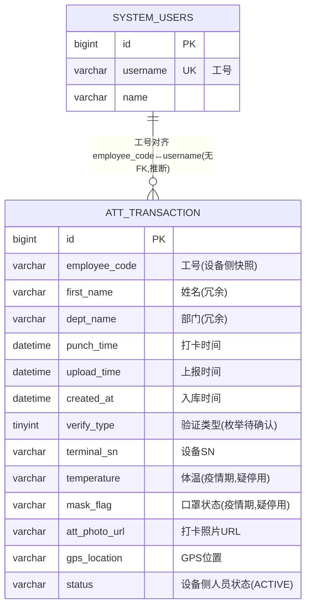

# 考勤打卡模块 · fuadmin 数据字典
> 域: 05-人事系统域 | 表数: 1 | 用途: Agent基础文件 | 生成: 2026-07-23

# att-考勤打卡 模块概述

att-考勤打卡模块仅 1 张表 `att_transaction`（约 19 万行），负责采集考勤机（打卡终端）上报的原始打卡流水：谁在什么时间、在哪台设备、以什么验证方式打的卡，含设备 SN、GPS、打卡照片 URL 等设备侧信息。表中 temperature（体温）、mask_flag（口罩状态）为疫情期间扩展的遗留字段，近期样本已全部为空，疑似疫情后停用（待确认）。本模块为人事考勤统计的最上游数据源，与 system_users 靠工号弱关联，无物理外键。

# att-考勤打卡 上岗指南

## 2.1 核心实体与定义

| 实体（表） | 业务定义 |
|---|---|
| att_transaction | 考勤打卡记录：考勤机上报的原始打卡流水，一行=一次打卡事件 |

关键字段语义：

- `employee_code` 工号（如 22125）、`first_name` 姓名、`dept_name` 部门——均为设备下发时的冗余快照，非外键。
- `punch_time` 打卡时间（设备本地时钟）；`upload_time` 设备上报时间；`created_at` 本库入库时间。
- `verify_type` 验证类型（tinyint 枚举，样本=15，含义待确认，疑为厂商协议码：人脸/指纹/刷卡等）；`device_verify_type` 设备侧验证类型字符串。
- `source` 来源（tinyint 枚举，样本=5，含义待确认）。
- `terminal_sn` 设备SN（如 QJQ1252700542）、`terminal_alias` 设备名称（样本为公司名"上海治通汽车部件有限公司"）。
- `temperature` 体温、`mask_flag` 口罩状态——疫情期扩展字段，近期样本全部为空，疑似停用（待确认）。
- `att_photo_url` 打卡照片 URL、`gps_location` GPS 位置——样本为空，实际采集情况待确认。
- `status` 设备侧人员状态（样本=ACTIVE，疑为厂商同步的员工在职状态快照）。
- `timezone` 时区（样本恒为 +08:00）。

## 2.2 业务流

```
员工在考勤机刷脸/刷卡/按指纹
  → 考勤机本地生成打卡事件（punch_time、verify_type，疫情期曾附带 temperature/mask_flag/照片）
  → 设备联网上传（upload_time，terminal_sn/alias 标识设备）
  → 平台接收入库 att_transaction（created_at，可能与 upload_time 有批量延迟）
  → 下游：考勤统计/薪资核算取 punch_time 口径（本模块只存原始流水，无汇总表）
```

## 2.3 常见查询场景

**场景1：某员工某月打卡记录（按打卡时间排序）**

```sql
SELECT punch_time, terminal_alias, verify_type, status
FROM att_transaction
WHERE employee_code = '22125'
  AND punch_time BETWEEN '2025-10-01' AND '2025-11-01'
ORDER BY punch_time;
```

**场景2：异常体温筛查（疫情期遗留口径，先确认字段仍在采集）**

```sql
SELECT employee_code, first_name, dept_name, punch_time, temperature
FROM att_transaction
WHERE temperature IS NOT NULL AND temperature <> ''
  AND CAST(temperature AS DECIMAL(4,1)) >= 37.3
  AND punch_time >= '2022-01-01'
ORDER BY punch_time DESC;
-- 注意：temperature 为 varchar，需转数值；近期数据为空属正常
```

**场景3：某设备打卡量与在线排查（哪台考勤机多久没上报）**

```sql
SELECT terminal_sn, terminal_alias, COUNT(*) AS punch_cnt,
       MAX(punch_time) AS last_punch, MAX(upload_time) AS last_upload
FROM att_transaction
GROUP BY terminal_sn, terminal_alias
ORDER BY last_upload DESC;
```

**场景4：异常时段打卡（深夜打卡/疑似代打排查）**

```sql
SELECT employee_code, first_name, dept_name, punch_time, terminal_sn
FROM att_transaction
WHERE TIME(punch_time) BETWEEN '23:00:00' AND '04:00:00'
  AND punch_time >= '2025-01-01'
ORDER BY punch_time DESC;
```

**场景5：上传延迟监控（设备离线或网络积压）**

```sql
SELECT terminal_sn, COUNT(*) AS delayed_cnt,
       AVG(TIMESTAMPDIFF(MINUTE, punch_time, upload_time)) AS avg_delay_min
FROM att_transaction
WHERE TIMESTAMPDIFF(MINUTE, punch_time, upload_time) > 30
  AND punch_time >= '2025-01-01'
GROUP BY terminal_sn
ORDER BY avg_delay_min DESC;
```

## 2.4 避坑指南

1. **temperature/mask_flag 疑似疫情后停用**：近期样本全部为空，做防疫类分析前先与运维确认字段是否仍在采集，别把空值当"体温正常"。
2. **三个时间别混用**：考勤统计一律用 `punch_time`（打卡发生时间）；`created_at` 是入库时间（样本显示 2025-10 的打卡 2026-05 才入库，存在批量补录/迁移），用它做月度统计会严重错位。
3. **无防重约束**：同一员工同一时刻可能因设备重传出现多条记录，统计出勤天数/次数前先按 (employee_code, punch_time) 去重（待确认是否已在写入侧去重）。
4. **人员信息是设备侧快照**：first_name/dept_name/status 为员工下发到设备时的冗余，员工调岗/离职后历史行不会更新，以 system_users/roster 现值为准。
5. **无外键弱关联**：employee_code ↔ system_users.username / roster.employee_id 靠工号字符串对齐，join 前先校验工号差异（设备侧可能有已删人员）。
6. **枚举码是厂商协议**：verify_type=15、source=5、status=ACTIVE 疑为考勤机厂商（中控/熵基风格）协议码，含义待确认，勿自行猜测写入报表口径。
7. **照片/GPS 可能大面积为空**：att_photo_url、gps_location 样本为空，是否开启采集/留存多久待确认，别当作必有字段。
8. **timezone 恒定 +08:00**：样本未见其他时区，跨时区分析前先验证数据覆盖范围。

## 3 数据字典

### att_transaction（约 189974 行）
业务定义: 考勤打卡记录表（含体温/口罩等疫情期扩展） ｜ 表注释: 打卡记录表

| 字段 | 类型 | 可空 | 键 | 原始注释 | 推断语义 | 置信度 |
|---|---|---|---|---|---|---|
| id | bigint | N | PRI | 记录ID | 记录ID（原注释） | high |
| verify_type | tinyint | Y | - | 验证类型 | 验证类型（原注释） | high |
| source | tinyint | Y | - | 来源 | 来源（原注释） | high |
| punch_time | datetime | Y | MUL | 打卡时间 | 打卡时间（原注释） | high |
| temperature | varchar(20) | Y | - | 体温 | 体温（原注释） | high |
| terminal_sn | varchar(50) | Y | - | 设备SN | 设备SN（原注释） | high |
| terminal_alias | varchar(100) | Y | - | 设备名称 | 设备名称（原注释） | high |
| att_photo_url | varchar(500) | Y | - | 打卡照片URL | 打卡照片URL（原注释） | high |
| mask_flag | varchar(20) | Y | - | 口罩状态 | 口罩状态（原注释） | high |
| upload_time | datetime | Y | - | 上传时间 | 上传时间（原注释） | high |
| timezone | varchar(10) | Y | - | 时区 | 时区（原注释） | high |
| gps_location | varchar(200) | Y | - | GPS位置 | GPS位置（原注释） | high |
| device_verify_type | varchar(10) | Y | - | 设备验证类型 | 设备验证类型（原注释） | high |
| employee_code | varchar(20) | Y | MUL | 工号 | 工号（原注释） | high |
| first_name | varchar(50) | Y | - | 姓名 | 姓名（原注释） | high |
| dept_name | varchar(100) | Y | MUL | 部门 | 部门（原注释） | high |
| status | varchar(20) | Y | - | 状态 | 状态（原注释） | high |
| created_at | datetime | Y | - | 入库时间 | 入库时间（原注释） | high |

# att-考勤打卡 ER 图



## 推断关系说明（依据与置信度）

| 关系 | 依据 | 置信度 |
|------|------|--------|
| att_transaction.employee_code ↔ system_users.username | 工号字符串对齐：样本 employee_code=22125/19107 与 hr 域 roster/capability_score 工号同号段（2xxxx）；无物理外键 | 中（naming+样本） |
| att_transaction.dept_name ↔ system_dept.name | 样本"生产部"为部门名文本快照；无FK | 低-中（待确认） |
| terminal_sn → 考勤设备主数据 | 样本 SN=QJQ1252700542，本库未见考勤设备主表（疑设备台账在外部考勤系统/待确认） | 低（待确认） |

> 注：本模块仅 1 张表，为设备数据的"落地暂存层"；人员、部门均为冗余文本快照，权威口径以 system_users / system_dept / hr 域 roster 为准。

# att-考勤打卡 · 跨模块接口表

| 本模块表.字段 | → 目标模块.表.字段 | 依据 | 置信度 |
|---|---|---|---|
| att_transaction.employee_code | → 05-人事系统域/system-用户权限.system_users.username | naming（工号）+ 样本 22125/19107 与 hr 域工号同号段；无FK | 中 |
| att_transaction.employee_code | → 05-人事系统域/hr-人力能力.generator_roster.employee_id | 同为工号体系，花名册为员工档案权威源 | 中 |
| att_transaction.dept_name | → 05-人事系统域/system-用户权限.system_dept.name | 样本"生产部"为部门名文本快照；无FK | 低-中（待确认） |
| att_transaction.first_name | → system_users.name（冗余校验用） | 与 employee_code 配套的设备侧快照 | 中 |
| att_transaction.terminal_sn | → 考勤设备主数据（本库未见对应表，疑在外部考勤系统） | 样本 SN=QJQ1252700542、terminal_alias 为公司名 | 低（待确认） |
| att_transaction（整表流水） | → 考勤/薪资核算下游（hr.generator_salary 关联链路） | 出勤数据为计时工资/全勤核算输入 | 低-中（推断，消费链路待确认） |

## 说明

- **本模块无任何显式外键**：是纯数据采集层，所有跨模块关联均为工号/名称文本弱引用。
- **最实的一条**：employee_code 工号对齐，是打通"打卡→人员档案→薪资"的唯一可靠键。
- **verify_type/source/status 为厂商协议枚举**（样本 15/5/ACTIVE），取值字典待确认，疑在代码层或考勤机厂商文档中。

## 6 字段备注改进建议

（本模块为小型/过渡性模块，业务语义与归属建议见同域《零散模块总览》或域内相关主模块文档）

## 相关页面
- [[fuadmin数据字典总览]]
- [[人力能力模块-fuadmin数据字典]]
- [[日报任务模块-fuadmin数据字典]]
- [[用户权限模块-fuadmin数据字典]]
