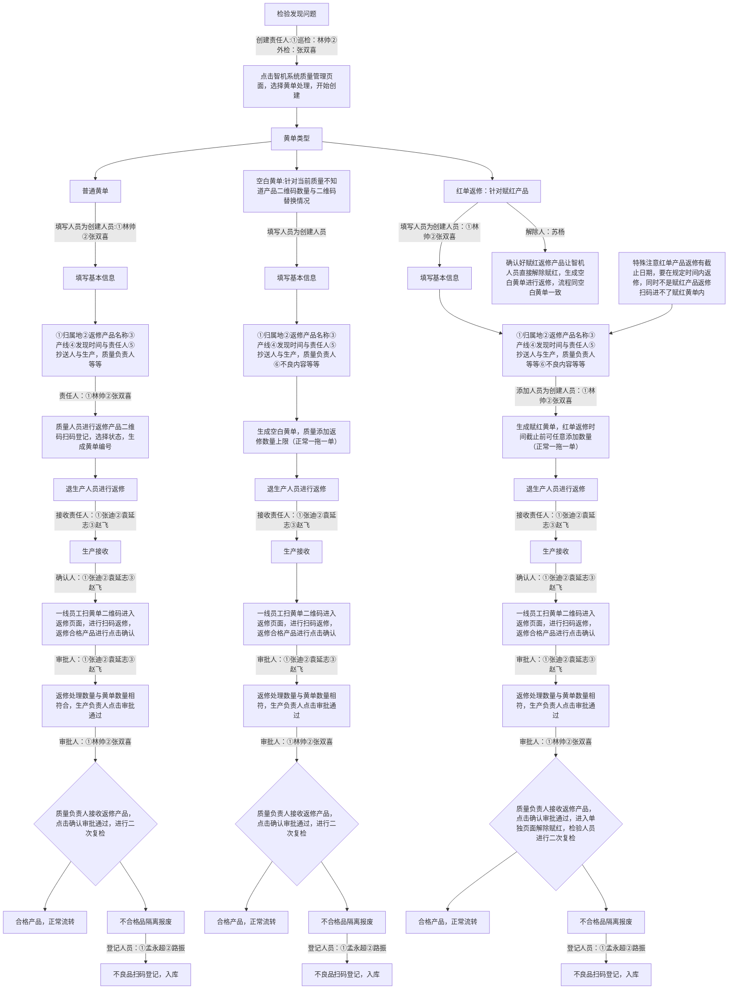

## 黄单流程图渲染

### 黄单流程

```mermaid
graph TD
    Start0[检验发现问题] -->| 创建责任人:①巡检：林帅②外检：张双喜 | Start1[点击智机系统质量管理页面，选择黄单处理，开始创建]
    Start1 --> Start2[黄单类型]
    Start2 --> P_A[普通黄单]
    Start2 --> B_A[空白黄单:针对当前质量不知道产品二维码数量与二维码替换情况]
    Start2 --> R_A[红单返修：针对赋红产品]

    %% ===== 普通黄单流程（原第一个） =====
    P_A[普通黄单] -->| 填写人员为创建人员:①林帅②张双喜 | P_B[填写基本信息]
    P_B --> P_C[①归属地②返修产品名称③产线④发现时间与责任人⑤抄送人与生产，质量负责人等等]
    P_C -->| 责任人：①林帅②张双喜 | P_D[质量人员进行返修产品二维码扫码登记，选择状态，生成黄单编号]
    P_D --> P_E[退生产人员进行返修]
    P_E -->| 接收责任人：①张迪②袁延志③赵飞 | P_F[生产接收]
    P_F -->| 确认人：①张迪②袁延志③赵飞 | P_G[一线员工扫黄单二维码进入返修页面，进行扫码返修，返修合格产品进行点击确认]
    P_G -->| 审批人：①张迪②袁延志③赵飞 | P_H[返修处理数量与黄单数量相符合，生产负责人点击审批通过]
    P_H -->| 审批人：①林帅②张双喜 | P_I{质量负责人接收返修产品，点击确认审批通过，进行二次复检}
    P_I --> P_J[合格产品，正常流转]
    P_I --> P_K[不合格品隔离报废]
    P_K -->| 登记人员：①孟永超②路振 | P_L[不良品扫码登记，入库]

    %% ===== 空白黄单流程（原第二个） =====
    B_A[空白黄单:针对当前质量不知道产品二维码数量与二维码替换情况] -->| 填写人员为创建人员 | B_B[填写基本信息]
    B_B --> B_C[①归属地②返修产品名称③产线④发现时间与责任人⑤抄送人与生产，质量负责人⑥不良内容等等]
    B_C --> B_D[生成空白黄单，质量添加返修数量上限（正常一拖一单）]
    B_D --> B_E[退生产人员进行返修]
    B_E -->| 接收责任人：①张迪②袁延志③赵飞 | B_F[生产接收]
    B_F --> B_G[一线员工扫黄单二维码进入返修页面，进行扫码返修，返修合格产品进行点击确认]
    B_G -->| 审批人：①张迪②袁延志③赵飞 | B_H[返修处理数量与黄单数量相符，生产负责人点击审批通过]
    B_H -->| 审批人：①林帅②张双喜 | B_I{质量负责人接收返修产品，点击确认审批通过，进行二次复检}
    B_I --> B_J[合格产品，正常流转]
    B_I --> B_K[不合格品隔离报废]
    B_K -->| 登记人员：①孟永超②路振 | B_L[不良品扫码登记，入库]

    %% ===== 红单返修流程（原第三个） =====
    R_A[红单返修：针对赋红产品] -->| 填写人员为创建人员：①林帅②张双喜 | R_B[填写基本信息]
    R_A -->| 解除人：苏杨 | R_C[确认好赋红返修产品让智机人员直接解除赋红，生成空白黄单进行返修，流程同空白黄单一致]
    R_B --> R_D[①归属地②返修产品名称③产线④发现时间与责任人⑤抄送人与生产，质量负责人等等⑥不良内容等等]
    R_E[特殊注意红单产品返修有截止日期，要在规定时间内返修，同时不是赋红产品返修扫码进不了赋红黄单内] --> R_D
    R_D -->| 添加人员为创建人员：①林帅②张双喜 | R_F[生成赋红黄单，红单返修时间截止前可任意添加数量（正常一拖一单）]
    R_F --> R_G[退生产人员进行返修]
    R_G -->| 接收责任人：①张迪②袁延志③赵飞 | R_H[生产接收]
    R_H -->| 确认人：①张迪②袁延志③赵飞 | R_I[一线员工扫黄单二维码进入返修页面，进行扫码返修，返修合格产品进行点击确认]
    R_I -->| 审批人：①张迪②袁延志③赵飞 | R_J[返修处理数量与黄单数量相符，生产负责人点击审批通过]
    R_J -->| 审批人：①林帅②张双喜 | R_K{质量负责人接收返修产品，点击确认审批通过，进入单独页面解除赋红，检验人员进行二次复检}
    R_K --> R_L[合格产品，正常流转]
    R_K --> R_M[不合格品隔离报废]
    R_M -->| 登记人员：①孟永超②路振 | R_N[不良品扫码登记，入库]
```